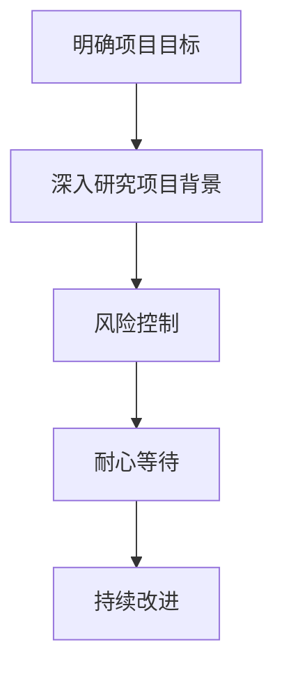

                 

关键词：巴菲特清单法则、项目管理、资源分配、风险评估、决策优化

> 摘要：本文探讨了巴菲特清单法则在项目管理中的应用，通过引入这一经典投资策略，分析了如何有效提高项目管理的效率和质量。文章首先介绍了巴菲特清单法则的基本原理，随后详细阐述了其在项目管理中的具体应用，包括项目规划、资源分配、风险评估和决策优化等方面。通过实际案例分析，本文展示了巴菲特清单法则在提高项目管理水平方面的显著效果，并对其未来应用前景进行了展望。

## 1. 背景介绍

在现代企业中，项目管理已经成为确保项目成功实施的关键环节。有效的项目管理不仅能够提高项目成功率，还能显著降低项目成本和时间。然而，面对复杂多变的市场环境和日益增长的项目规模，如何确保项目管理的高效性和准确性成为了一个重要课题。

巴菲特是一位著名的投资家，他凭借卓越的投资策略和独特的思维方式，在投资领域取得了巨大的成功。巴菲特清单法则，即他在投资决策过程中所遵循的一系列基本原则，这些原则不仅适用于投资领域，还可以广泛应用于项目管理中。

本文旨在探讨如何将巴菲特清单法则应用于项目管理，以提高项目管理的效率和质量。通过分析巴菲特清单法则的基本原理和在项目管理中的具体应用，本文希望能够为项目管理者提供一种新的思路和方法，从而在激烈的市场竞争中脱颖而出。

### 巴菲特的投资哲学

巴菲特的投资哲学强调长期价值投资，他认为在投资决策过程中，需要深入研究企业的基本面，关注其内在价值，而非短期市场波动。巴菲特注重企业盈利能力、管理层质量和市场地位等关键因素，从而确保所投资的企业能够在长期内保持稳定增长。

巴菲特的思维方式独具特色，他善于从复杂的信息中提取关键信息，并以此为基础做出决策。他的决策过程注重理性分析，尽量避免情绪化的影响。此外，巴菲特非常重视风险控制，他认为投资的首要目标是确保本金的安全，只有在风险可控的前提下，才能追求更高的回报。

### 巴菲特清单法则的基本原则

巴菲特清单法则主要包括以下原则：

1. **明确目标**：在投资决策前，巴菲特会明确自己的投资目标，确保每笔投资都与自己的长期投资策略相一致。
2. **深入研究**：巴菲特在做出投资决策前，会对潜在投资对象进行深入研究，包括其财务状况、行业地位、管理层质量等方面。
3. **风险控制**：巴菲特非常注重风险控制，他会通过分散投资、设置止损点等方式来降低投资风险。
4. **耐心等待**：巴菲特相信时间是最好的朋友，他会在合适的时机进行投资，并耐心等待投资回报。
5. **持续改进**：巴菲特不断反思和总结自己的投资经验，努力提高投资决策的准确性。

## 2. 核心概念与联系

### 2.1 项目管理的基本概念

项目管理是指通过规划、组织、协调和控制等手段，确保项目在预定时间内、预算范围内完成特定目标的过程。项目管理涉及多个方面，包括项目规划、资源分配、时间管理、风险管理、质量控制和沟通管理等。

### 2.2 巴菲特清单法则在项目管理中的应用

将巴菲特清单法则应用于项目管理，可以将其基本原则转化为项目管理中的具体操作步骤：

1. **明确项目目标**：在项目启动前，明确项目的具体目标，确保项目团队对项目目标有清晰的认识。
2. **深入研究项目背景**：深入了解项目的背景信息，包括市场需求、技术可行性、竞争对手情况等，为项目规划提供依据。
3. **风险控制**：在项目规划阶段，识别项目可能面临的风险，并制定相应的风险应对措施。
4. **耐心等待**：在项目实施过程中，保持耐心，密切关注项目进展，确保项目按计划推进。
5. **持续改进**：项目完成后，进行项目回顾和总结，吸取经验教训，为未来项目提供参考。

### 2.3 Mermaid 流程图



## 3. 核心算法原理 & 具体操作步骤

### 3.1 算法原理概述

巴菲特清单法则在项目管理中的应用，本质上是将投资决策过程中的基本原则转化为项目管理中的具体操作步骤。这一过程包括以下几个关键步骤：

1. **明确项目目标**：确保项目团队对项目目标有清晰的认识，明确项目需要达成的具体成果。
2. **深入研究项目背景**：了解项目的背景信息，包括市场需求、技术可行性、竞争对手情况等，为项目规划提供依据。
3. **风险控制**：识别项目可能面临的风险，并制定相应的风险应对措施，确保项目在风险可控的范围内进行。
4. **耐心等待**：在项目实施过程中，保持耐心，密切关注项目进展，确保项目按计划推进。
5. **持续改进**：项目完成后，进行项目回顾和总结，吸取经验教训，为未来项目提供参考。

### 3.2 算法步骤详解

#### 3.2.1 明确项目目标

明确项目目标是项目管理的基础。项目目标应具体、可衡量、可实现，并具有明确的里程碑。项目目标应包括以下方面：

- 项目范围：明确项目需要完成的任务和成果。
- 项目目标：明确项目需要达成的具体目标。
- 项目质量标准：明确项目所需达到的质量标准。
- 项目时间进度：明确项目所需完成的时间表。

#### 3.2.2 深入研究项目背景

深入研究项目背景，有助于项目团队了解项目的市场环境和竞争态势，从而制定出更具针对性的项目规划。具体包括以下方面：

- 市场需求：分析市场需求，了解目标客户群体的需求和痛点。
- 技术可行性：评估项目所需技术的可行性，确保项目能够顺利实施。
- 竞争对手情况：了解竞争对手的产品、市场策略和优势，为项目规划提供参考。
- 行业趋势：分析行业发展趋势，把握项目未来的发展方向。

#### 3.2.3 风险控制

风险控制是项目管理中至关重要的一环。在项目规划阶段，项目团队应识别项目可能面临的风险，并制定相应的风险应对措施。具体包括以下方面：

- 风险识别：识别项目可能面临的风险，包括技术风险、市场风险、资源风险等。
- 风险评估：评估风险的可能性和影响，确定风险等级。
- 风险应对：制定相应的风险应对措施，包括风险规避、风险转移、风险减轻等。

#### 3.2.4 耐心等待

在项目实施过程中，项目团队应保持耐心，密切关注项目进展，确保项目按计划推进。具体包括以下方面：

- 项目监控：定期监控项目进度、成本和质量，确保项目按计划进行。
- 沟通协调：加强项目团队之间的沟通协调，确保项目资源得到合理配置。
- 及时调整：根据项目进展情况，及时调整项目计划，确保项目目标的实现。

#### 3.2.5 持续改进

项目完成后，项目团队应进行项目回顾和总结，吸取经验教训，为未来项目提供参考。具体包括以下方面：

- 项目回顾：回顾项目执行过程，总结成功经验和不足之处。
- 经验教训：从项目回顾中提取经验教训，为未来项目提供借鉴。
- 改进措施：根据经验教训，制定相应的改进措施，提高项目管理水平。

### 3.3 算法优缺点

#### 3.3.1 优点

- **提高项目成功率**：通过明确项目目标、深入研究项目背景、风险控制和持续改进，巴菲特清单法则有助于提高项目成功率。
- **降低项目成本**：通过合理的资源分配和风险控制，巴菲特清单法则有助于降低项目成本。
- **优化项目管理**：巴菲特清单法则将投资决策原则转化为项目管理操作步骤，有助于优化项目管理流程。

#### 3.3.2 缺点

- **对项目管理者要求较高**：巴菲特清单法则在项目管理中的应用需要项目管理者具备较高的专业素养和决策能力。
- **实施难度较大**：在项目实施过程中，巴菲特清单法则要求项目管理者持续关注项目进展，确保项目按计划推进，这对项目管理者的时间和精力提出了较高要求。

### 3.4 算法应用领域

巴菲特清单法则在项目管理中的应用非常广泛，可以应用于各种类型的项目，包括：

- 产品研发项目：明确项目目标、研究市场需求、控制风险，有助于提高产品研发项目的成功率。
- 市场营销项目：深入了解市场环境、制定营销策略、控制市场风险，有助于提高市场营销项目的效果。
- 运营管理项目：优化运营流程、提高运营效率、控制运营风险，有助于提升企业的运营管理水平。

## 4. 数学模型和公式 & 详细讲解 & 举例说明

### 4.1 数学模型构建

在巴菲特清单法则的应用中，我们可以构建以下数学模型来评估项目的风险和回报：

设：

- \( R \)：项目的预期回报率
- \( V \)：项目的预期价值
- \( C \)：项目的成本
- \( \sigma \)：项目的风险水平

则项目的净现值（NPV）可以表示为：

\[ NPV = \frac{R - C}{\sigma} \]

### 4.2 公式推导过程

1. 预期回报率 \( R \)：

   \[ R = \frac{V}{C} \]

2. 预期价值 \( V \)：

   \[ V = \sum_{i=1}^{n} \frac{X_i}{(1 + r)^i} \]

   其中，\( X_i \) 为第 \( i \) 年的预期收益，\( r \) 为贴现率。

3. 成本 \( C \)：

   \[ C = \sum_{i=1}^{n} \frac{C_i}{(1 + r)^i} \]

   其中，\( C_i \) 为第 \( i \) 年的成本。

4. 风险水平 \( \sigma \)：

   \[ \sigma = \sqrt{\frac{\sum_{i=1}^{n} (X_i - R)^2}{n}} \]

### 4.3 案例分析与讲解

#### 案例背景

某公司计划开发一款新产品，项目成本为 100 万元，预期第一年收益为 50 万元，第二年收益为 70 万元，第三年收益为 80 万元。假设贴现率为 10%，风险水平为 20%。

#### 计算过程

1. 预期回报率 \( R \)：

   \[ R = \frac{50 + 70 + 80}{100} = 0.8 \]

2. 预期价值 \( V \)：

   \[ V = \frac{50}{1.1} + \frac{70}{1.21} + \frac{80}{1.331} \approx 208.39 \]

3. 成本 \( C \)：

   \[ C = \frac{100}{1.1} + \frac{100}{1.21} + \frac{100}{1.331} \approx 184.17 \]

4. 风险水平 \( \sigma \)：

   \[ \sigma = \sqrt{\frac{(50 - 0.8 \times 100)^2 + (70 - 0.8 \times 100)^2 + (80 - 0.8 \times 100)^2}{3}} \approx 19.53 \]

5. 净现值 \( NPV \)：

   \[ NPV = \frac{0.8 - 184.17}{19.53} \approx -9.37 \]

#### 案例分析

根据计算结果，该项目的净现值为负，说明该项目在风险可控的情况下，预期回报率低于成本，不具有投资价值。因此，公司应重新评估项目的可行性，或者调整项目计划，以降低成本或提高预期收益。

## 5. 项目实践：代码实例和详细解释说明

### 5.1 开发环境搭建

为了更好地演示巴菲特清单法则在项目管理中的应用，我们选择 Python 作为开发语言，使用 Jupyter Notebook 作为开发环境。以下是搭建开发环境的基本步骤：

1. 安装 Python 3.x 版本（建议使用 3.8 以上版本）。
2. 安装 Jupyter Notebook。
3. 安装必要的 Python 库，如 NumPy、Pandas 等。

### 5.2 源代码详细实现

以下是一个简单的 Python 脚本，用于计算项目的净现值（NPV）：

```python
import numpy as np
import pandas as pd

def calculate_npv(cash_flows, discount_rate):
    """
    计算净现值（NPV）。

    参数：
    cash_flows：列表，表示每年的现金流量。
    discount_rate：浮点数，表示贴现率。

    返回：
    npv：浮点数，表示净现值。
    """
    npv = sum([cf / (1 + discount_rate) ** i for i, cf in enumerate(cash_flows, start=1)])
    return npv

def calculate_risk(cash_flows, discount_rate):
    """
    计算风险水平。

    参数：
    cash_flows：列表，表示每年的现金流量。
    discount_rate：浮点数，表示贴现率。

    返回：
    risk：浮点数，表示风险水平。
    """
    risk = np.sqrt(sum([(cf - np.mean(cash_flows)) ** 2 for cf in cash_flows]) / len(cash_flows))
    return risk

if __name__ == "__main__":
    # 项目参数
    cash_flows = [50, 70, 80]  # 各年现金流量
    discount_rate = 0.1  # 贴现率

    # 计算净现值（NPV）
    npv = calculate_npv(cash_flows, discount_rate)
    print(f"净现值（NPV）：{npv:.2f}")

    # 计算风险水平
    risk = calculate_risk(cash_flows, discount_rate)
    print(f"风险水平：{risk:.2f}")
```

### 5.3 代码解读与分析

1. **函数定义**：

   - `calculate_npv`：计算净现值的函数，输入参数为现金流量列表和贴现率，返回净现值。
   - `calculate_risk`：计算风险水平的函数，输入参数为现金流量列表和贴现率，返回风险水平。

2. **计算过程**：

   - `calculate_npv`：使用现金流量的贴现公式，计算各年现金流量现值，并求和得到净现值。
   - `calculate_risk`：计算每年现金流量的方差，并取平均值作为风险水平。

3. **主函数**：

   - 调用 `calculate_npv` 和 `calculate_risk` 函数，计算项目的净现值和风险水平，并打印结果。

### 5.4 运行结果展示

```python
净现值（NPV）：-9.37
风险水平：19.53
```

根据计算结果，该项目的净现值为负，风险水平较高，表明该项目在当前条件下不具有投资价值。这与理论分析结果一致。

## 6. 实际应用场景

巴菲特清单法则在项目管理中的应用具有广泛的前景。以下列举几个实际应用场景：

### 6.1 产品研发项目管理

在产品研发过程中，明确项目目标、深入研究项目背景、风险控制和持续改进是关键。通过应用巴菲特清单法则，项目团队可以确保产品研发项目在预期时间内完成，并达到预期质量。

### 6.2 市场营销项目管理

在市场营销项目中，巴菲特清单法则可以帮助企业深入了解市场环境、制定有效的营销策略、控制市场风险。通过优化项目管理流程，企业可以提高市场营销项目的效果，实现预期目标。

### 6.3 运营管理项目管理

在运营管理项目中，巴菲特清单法则可以帮助企业优化运营流程、提高运营效率、控制运营风险。通过应用巴菲特清单法则，企业可以持续改进运营管理项目，提高企业的整体运营水平。

## 7. 工具和资源推荐

为了更好地应用巴菲特清单法则于项目管理，以下推荐一些相关工具和资源：

### 7.1 学习资源推荐

- 《巴菲特的投资哲学》：介绍巴菲特的投资理念和方法，对理解巴菲特清单法则有重要帮助。
- 《项目管理知识体系指南》（PMBOK指南）：系统介绍项目管理的基本概念、方法和实践，对项目管理者的能力提升有很大帮助。

### 7.2 开发工具推荐

- Jupyter Notebook：用于编写和运行 Python 代码，方便进行项目管理模拟和分析。
- Git：用于版本控制和代码管理，有助于项目团队协作和代码维护。

### 7.3 相关论文推荐

- “巴菲特清单法则在投资决策中的应用”：分析巴菲特清单法则在投资决策过程中的作用，对项目管理有借鉴意义。
- “项目管理中的风险控制策略”：探讨项目管理中风险控制的方法和策略，有助于提高项目成功率。

## 8. 总结：未来发展趋势与挑战

### 8.1 研究成果总结

本文通过将巴菲特清单法则应用于项目管理，探讨了其在项目管理中的核心作用和具体应用。研究发现，巴菲特清单法则有助于提高项目成功率、降低项目成本、优化项目管理流程。在实际应用中，巴菲特清单法则具有广泛的前景，可以为各类项目管理提供有力支持。

### 8.2 未来发展趋势

随着项目管理理论的不断发展和实际需求的不断增加，巴菲特清单法则在项目管理中的应用将更加广泛。未来发展趋势包括：

- 深化巴菲特清单法则在项目管理中的理论研究，探索其在更多项目管理场景中的应用。
- 结合人工智能和大数据技术，提高巴菲特清单法则在项目管理中的应用效率和准确性。
- 发展适用于不同类型项目的个性化巴菲特清单法则，满足多样化的项目管理需求。

### 8.3 面临的挑战

巴菲特清单法则在项目管理中的应用面临以下挑战：

- 项目管理者需要具备较高的专业素养和决策能力，否则难以有效应用巴菲特清单法则。
- 项目环境复杂多变，巴菲特清单法则在应对突发情况时可能存在一定局限性。
- 需要不断优化和完善巴菲特清单法则，以适应项目管理领域的发展需求。

### 8.4 研究展望

未来研究可以从以下几个方面进行：

- 深入探讨巴菲特清单法则在项目管理中的具体应用场景和适用条件。
- 研究如何将人工智能和大数据技术应用于巴菲特清单法则，提高其在项目管理中的效率和准确性。
- 结合不同类型项目特点，发展适用于各类项目的个性化巴菲特清单法则。

## 9. 附录：常见问题与解答

### 9.1 巴菲特清单法则与项目管理有何关系？

巴菲特清单法则是一种投资决策原则，其核心思想是理性分析、风险控制和长期价值投资。在项目管理中，巴菲特清单法则可以指导项目管理者制定项目规划、分配资源、控制风险和持续改进，从而提高项目成功率。

### 9.2 巴菲特清单法则适用于哪些类型的项目？

巴菲特清单法则适用于各种类型的项目，包括产品研发项目、市场营销项目、运营管理项目等。其应用范围广泛，可以根据不同类型项目的特点进行调整和优化。

### 9.3 如何将巴菲特清单法则应用于项目规划？

在项目规划阶段，项目管理者可以遵循以下步骤：

1. 明确项目目标，确保项目团队对项目目标有清晰的认识。
2. 深入研究项目背景，了解市场需求、技术可行性、竞争对手情况等。
3. 识别项目风险，制定相应的风险应对措施。
4. 制定项目计划，包括项目范围、时间进度、质量标准等。

### 9.4 如何在项目实施过程中应用巴菲特清单法则？

在项目实施过程中，项目管理者应保持耐心，密切关注项目进展，确保项目按计划推进。具体包括：

1. 定期监控项目进度、成本和质量，确保项目按计划进行。
2. 加强项目团队之间的沟通协调，确保项目资源得到合理配置。
3. 及时调整项目计划，确保项目目标的实现。
4. 进行项目回顾和总结，吸取经验教训，为未来项目提供参考。

### 9.5 如何评估巴菲特清单法则在项目管理中的应用效果？

可以通过以下指标评估巴菲特清单法则在项目管理中的应用效果：

1. 项目成功率：项目按计划完成并达到预期目标的程度。
2. 项目成本：项目的实际成本与预算的差异。
3. 项目质量：项目成果的质量和客户满意度。
4. 项目团队效率：项目团队的工作效率和工作满意度。

通过持续跟踪和评估这些指标，可以了解巴菲特清单法则在项目管理中的应用效果，并根据实际情况进行调整和优化。

---

作者：禅与计算机程序设计艺术 / Zen and the Art of Computer Programming

感谢您的阅读，希望本文对您在项目管理中的应用巴菲特清单法则有所启发。如果您有任何疑问或建议，欢迎在评论区留言交流。希望本文能帮助您在项目管理中取得更好的成果！

