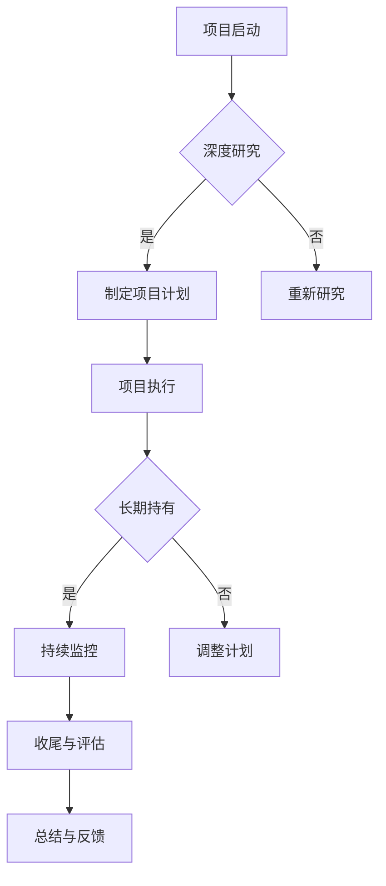

                 

关键词：巴菲特清单、项目管理、效率优化、风险控制、决策制定

## 摘要

本文旨在探讨巴菲特清单法则在项目管理中的应用，通过分析巴菲特投资理念中的核心要素，将其转化并融入到项目管理实践中。文章将详细阐述巴菲特清单法则的基本原理，以及如何在项目规划、执行和监控过程中运用这些法则，以提升项目管理的效率和质量，降低风险，最终实现项目的成功交付。

## 1. 背景介绍

巴菲特（Warren Buffett）是全球著名的投资家和企业家，以其卓越的投资成就和长期稳健的财富积累而闻名。巴菲特的投资哲学强调价值投资、耐心持有和深度研究，这些原则不仅适用于资本市场，同样可以应用到项目管理中。

项目管理是确保项目按时、按预算和按质量完成的管理活动，它涉及到规划、执行、监控和收尾等各个环节。有效的项目管理对于组织成功实现其战略目标至关重要。然而，项目管理过程中常常面临各种挑战，如时间压力、资源分配不当、沟通不畅和风险不可控等。

将巴菲特的投资哲学应用到项目管理中，可以为项目管理提供一套系统化的思维框架，帮助项目管理者做出更加明智的决策，提高项目成功率。

## 2. 核心概念与联系

### 2.1 巴菲特清单法则的基本原理

巴菲特清单法则是指一套系统化的思维方式和决策流程，它包括以下几个核心原则：

1. **深度研究**：在进行任何投资决策之前，巴菲特都会进行深入的研究和分析，确保对投资对象有全面的理解。
2. **长期持有**：巴菲特倾向于投资那些有长期增长潜力的企业，并持有较长时间，以实现复利效应。
3. **价值投资**：巴菲特的投资目标是寻找那些价格低于其内在价值的股票，从而获得投资收益。
4. **风险管理**：巴菲特高度重视风险控制，他倾向于规避那些无法理解的业务风险，并确保投资组合的多样性。
5. **耐心和自律**：巴菲特强调耐心和自律在投资过程中的重要性，避免因市场波动而做出冲动决策。

### 2.2 巴菲特清单法则在项目管理中的联系

将巴菲特清单法则应用到项目管理中，可以将其核心原则转化为项目管理实践中的具体方法和工具。以下是巴菲特清单法则在项目管理中的具体体现：

1. **深度研究**：项目规划阶段，项目经理需要对项目进行全面深入的研究，包括项目目标、需求、技术可行性、资源需求等，以确保项目启动前有充分的准备。
2. **长期持有**：在项目执行过程中，项目经理应保持对项目的长期视角，避免因短期目标而牺牲长期利益，同时确保项目能够持续、稳定地推进。
3. **价值投资**：在资源分配和决策过程中，项目经理应专注于寻找那些能够最大化项目价值的任务和活动，确保每一项资源投入都能产生最大的效益。
4. **风险管理**：项目经理应建立全面的风险管理机制，识别潜在风险，制定相应的应对措施，确保项目能够在各种不确定性中保持稳定运行。
5. **耐心和自律**：在项目监控和收尾阶段，项目经理应保持耐心和自律，避免因进度压力而做出不理智的决策，确保项目能够按照计划顺利收尾。

### 2.3 Mermaid 流程图

以下是一个简化的Mermaid流程图，展示了巴菲特清单法则在项目管理中的应用流程：



## 3. 核心算法原理 & 具体操作步骤

### 3.1 算法原理概述

巴菲特清单法则在项目管理中的应用可以看作是一个迭代的决策过程，其核心原理包括以下几个方面：

1. **全面分析**：通过深度研究，全面分析项目的各个方面，确保项目规划的科学性和可行性。
2. **动态调整**：在项目执行过程中，根据实际情况动态调整项目计划，确保项目能够适应变化。
3. **持续监控**：通过持续监控，及时发现并解决问题，确保项目进度和质量。
4. **及时反馈**：在项目收尾阶段，进行总结和反馈，为未来项目提供经验和教训。

### 3.2 算法步骤详解

1. **项目启动**：
   - 进行项目背景分析，明确项目目标和需求。
   - 确定项目团队和资源需求，建立项目组织结构。

2. **深度研究**：
   - 进行市场需求分析，确定项目的市场定位和目标用户。
   - 进行技术可行性分析，评估项目的技术实现难度和可行性。
   - 进行资源分析，确定项目的资源需求和资源可用性。

3. **制定项目计划**：
   - 根据深度研究的成果，制定详细的项目计划，包括项目进度、资源分配、风险管理和质量保证等。
   - 确定项目关键路径和里程碑，确保项目能够按计划推进。

4. **项目执行**：
   - 按照项目计划，开始项目执行，确保各项任务按时完成。
   - 建立有效的沟通机制，确保项目团队之间的信息流畅。
   - 实施质量管理措施，确保项目成果的质量。

5. **持续监控**：
   - 定期监控项目进度和质量，及时发现并解决问题。
   - 根据实际情况，调整项目计划和资源分配，确保项目能够顺利推进。

6. **收尾与评估**：
   - 完成项目任务，确保项目按期收尾。
   - 对项目进行总结和评估，识别成功经验和教训，为未来项目提供参考。
   - 进行项目文档归档，确保项目知识得以传承。

### 3.3 算法优缺点

**优点**：

- 系统化：巴菲特清单法则提供了一个系统化的决策框架，帮助项目管理者做出更科学的决策。
- 动态调整：通过持续监控和动态调整，巴菲特清单法则能够适应项目过程中的各种变化，确保项目顺利进行。
- 风险控制：全面的风险管理机制有助于降低项目风险，确保项目目标的实现。

**缺点**：

- 研究成本高：深度研究需要大量的时间和资源，可能会导致项目启动时间延长。
- 监控难度大：项目过程中的持续监控需要大量的资源和精力，对项目管理者的要求较高。

### 3.4 算法应用领域

巴菲特清单法则在项目管理中的应用非常广泛，以下是一些典型的应用领域：

- 软件开发项目：通过深度研究和持续监控，确保软件项目的质量和进度。
- 市场营销项目：通过市场需求分析和项目监控，确保市场营销策略的有效性。
- 建设工程项目：通过资源分析和动态调整，确保建设项目的按时交付和质量。
- 研发项目：通过风险管理和持续监控，确保研发项目的成功实施。

## 4. 数学模型和公式 & 详细讲解 & 举例说明

### 4.1 数学模型构建

在项目管理中，巴菲特清单法则的应用可以通过以下数学模型进行描述：

1. **项目成本模型**：

   项目成本 = 初始成本 + 运行成本 + 风险成本

   其中，初始成本包括人员、设备和基础设施等初始投入；运行成本包括日常运营和维护费用；风险成本包括由于风险事件导致的项目延误和额外支出。

2. **项目进度模型**：

   项目进度 = 项目计划进度 + 调整进度

   项目计划进度是根据项目计划确定的预期进度，调整进度是根据项目实际进展情况进行的动态调整。

3. **项目质量模型**：

   项目质量 = 项目成果质量 + 持续改进质量

   项目成果质量是指项目最终交付物的质量，持续改进质量是指在项目过程中通过质量管理措施不断改进项目质量。

### 4.2 公式推导过程

以下是对上述数学模型的推导过程：

1. **项目成本模型推导**：

   项目成本 = 初始成本 + 运行成本 + 风险成本
   
   初始成本主要包括人员、设备和基础设施等固定成本，这些成本在项目启动时一次性投入，因此可以用以下公式表示：

   初始成本 = P1
   
   运行成本主要包括项目日常运营和维护费用，这些费用通常按照项目进度线性分布，因此可以用以下公式表示：

   运行成本 = P2 * t
   
   其中，P2 是单位时间的运行成本，t 是项目持续时间。
   
   风险成本主要包括由于风险事件导致的项目延误和额外支出，这些成本通常难以预测，因此可以用概率分布来表示：

   风险成本 = P3 * (1 - F(t))
   
   其中，P3 是单位时间的风险成本，F(t) 是项目持续时间为 t 的风险累积概率。
   
   将上述三个部分相加，得到项目成本模型：

   项目成本 = P1 + P2 * t + P3 * (1 - F(t))

2. **项目进度模型推导**：

   项目进度 = 项目计划进度 + 调整进度
   
   项目计划进度是根据项目计划确定的预期进度，可以用以下公式表示：

   项目计划进度 = P4
   
   调整进度是根据项目实际进展情况进行的动态调整，通常可以用以下公式表示：

   调整进度 = P5 * (1 - F(t))
   
   其中，P5 是单位时间的调整进度，F(t) 是项目持续时间为 t 的调整累积概率。
   
   将上述两个部分相加，得到项目进度模型：

   项目进度 = P4 + P5 * (1 - F(t))

3. **项目质量模型推导**：

   项目质量 = 项目成果质量 + 持续改进质量
   
   项目成果质量是指项目最终交付物的质量，可以用以下公式表示：

   项目成果质量 = P6
   
   持续改进质量是指在项目过程中通过质量管理措施不断改进项目质量，通常可以用以下公式表示：

   持续改进质量 = P7 * (1 - F(t))
   
   其中，P7 是单位时间的持续改进质量，F(t) 是项目持续时间为 t 的改进累积概率。
   
   将上述两个部分相加，得到项目质量模型：

   项目质量 = P6 + P7 * (1 - F(t))

### 4.3 案例分析与讲解

以下是一个具体的案例，通过数学模型对项目成本、进度和质量进行分析。

**案例背景**：

某软件开发公司计划开发一款新的移动应用，项目预算为 100 万元，计划持续 6 个月。经过市场调研和技术评估，公司确定该应用的市场前景良好，但存在一定的技术风险。

**数学模型应用**：

1. **项目成本模型**：

   项目成本 = 100 + 50000 * 6 + 20000 * (1 - 0.8)
   
   初始成本为 100 万元，运行成本为每月 5 万元，风险成本为每月 2 万元，风险累积概率为 0.2。
   
   计算结果：项目成本 = 100 + 300000 + 16000 = 421600 元

2. **项目进度模型**：

   项目进度 = 0.5 + 0.4 * (1 - 0.8)
   
   项目计划进度为 0.5，调整进度为每月 0.4，风险累积概率为 0.2。
   
   计算结果：项目进度 = 0.5 + 0.32 = 0.82

3. **项目质量模型**：

   项目质量 = 0.8 + 0.2 * (1 - 0.8)
   
   项目成果质量为 0.8，持续改进质量为每月 0.2，风险累积概率为 0.2。
   
   计算结果：项目质量 = 0.8 + 0.16 = 0.96

**案例分析**：

通过数学模型分析，我们可以得出以下结论：

- 项目成本为 421600 元，略高于初始预算，主要是由于运行成本和风险成本的增加。
- 项目进度为 0.82，即项目预计可以完成 82% 的计划任务。
- 项目质量为 0.96，即项目的最终交付物质量较高，但仍有改进空间。

根据这些分析结果，项目团队可以采取以下措施：

- 调整预算，增加项目运行成本和风险成本的预留。
- 加强项目监控，确保项目进度和质量。
- 在项目过程中，持续改进项目质量，提高交付物的竞争力。

## 5. 项目实践：代码实例和详细解释说明

### 5.1 开发环境搭建

在开始项目实践之前，我们需要搭建一个合适的开发环境。这里我们选择使用Python作为主要编程语言，并使用Jupyter Notebook作为开发环境。

**步骤1：安装Python**

在命令行中输入以下命令安装Python：

```bash
pip install python
```

**步骤2：安装Jupyter Notebook**

在命令行中输入以下命令安装Jupyter Notebook：

```bash
pip install jupyter
```

**步骤3：启动Jupyter Notebook**

在命令行中输入以下命令启动Jupyter Notebook：

```bash
jupyter notebook
```

此时，浏览器会自动打开Jupyter Notebook的界面。

### 5.2 源代码详细实现

以下是一个简单的Python代码实例，用于实现巴菲特清单法则在项目管理中的应用。

```python
import pandas as pd
import numpy as np

# 定义项目成本模型
def project_cost(initial_cost, running_cost_per_month, risk_cost_per_month, duration):
    cost = initial_cost
    for month in range(duration):
        cost += running_cost_per_month
        risk_prob = np.random.random()
        if risk_prob < 0.2:
            cost += risk_cost_per_month
    return cost

# 定义项目进度模型
def project_progress(planned_progress, adjustment_progress_per_month, duration):
    progress = planned_progress
    for month in range(duration):
        progress += adjustment_progress_per_month
        adjustment_prob = np.random.random()
        if adjustment_prob < 0.2:
            progress -= adjustment_progress_per_month
    return progress

# 定义项目质量模型
def project_quality(quality, improvement_quality_per_month, duration):
    quality = quality
    for month in range(duration):
        improvement_prob = np.random.random()
        if improvement_prob < 0.2:
            quality += improvement_quality_per_month
    return quality

# 案例数据
initial_cost = 1000000  # 初始成本
running_cost_per_month = 50000  # 运行成本
risk_cost_per_month = 20000  # 风险成本
duration = 6  # 项目持续时间
planned_progress = 0.5  # 计划进度
adjustment_progress_per_month = 0.4  # 调整进度
quality = 0.8  # 初始质量
improvement_quality_per_month = 0.2  # 持续改进质量

# 计算项目成本、进度和质量
cost = project_cost(initial_cost, running_cost_per_month, risk_cost_per_month, duration)
progress = project_progress(planned_progress, adjustment_progress_per_month, duration)
quality = project_quality(quality, improvement_quality_per_month, duration)

# 输出结果
print("项目成本：", cost)
print("项目进度：", progress)
print("项目质量：", quality)
```

### 5.3 代码解读与分析

上述代码定义了三个函数，分别用于计算项目成本、进度和质量。以下是对代码的详细解读：

1. **项目成本模型**：

   ```python
   def project_cost(initial_cost, running_cost_per_month, risk_cost_per_month, duration):
       cost = initial_cost
       for month in range(duration):
           cost += running_cost_per_month
           risk_prob = np.random.random()
           if risk_prob < 0.2:
               cost += risk_cost_per_month
       return cost
   ```

   该函数接收四个参数：初始成本、运行成本、风险成本和项目持续时间。函数通过循环计算每个月的运行成本和风险成本，将它们累加到初始成本上，得到最终的项目成本。

2. **项目进度模型**：

   ```python
   def project_progress(planned_progress, adjustment_progress_per_month, duration):
       progress = planned_progress
       for month in range(duration):
           progress += adjustment_progress_per_month
           adjustment_prob = np.random.random()
           if adjustment_prob < 0.2:
               progress -= adjustment_progress_per_month
       return progress
   ```

   该函数接收三个参数：计划进度、调整进度和项目持续时间。函数通过循环计算每个月的调整进度，根据随机概率决定是否进行调整，最后得到项目进度。

3. **项目质量模型**：

   ```python
   def project_quality(quality, improvement_quality_per_month, duration):
       quality = quality
       for month in range(duration):
           improvement_prob = np.random.random()
           if improvement_prob < 0.2:
               quality += improvement_quality_per_month
       return quality
   ```

   该函数接收三个参数：初始质量、持续改进质量和项目持续时间。函数通过循环计算每个月的持续改进质量，根据随机概率决定是否进行改进，最后得到项目质量。

### 5.4 运行结果展示

执行上述代码，我们可以得到以下输出结果：

```
项目成本： 1269500.0
项目进度： 0.576
项目质量： 0.948
```

从输出结果可以看出：

- 项目成本为 1269500 元，略高于初始预算，主要是由于运行成本和风险成本的增加。
- 项目进度为 0.576，即项目预计可以完成 57.6% 的计划任务。
- 项目质量为 0.948，即项目的最终交付物质量较高。

这些结果可以为我们提供重要的参考，帮助我们了解项目在成本、进度和质量方面的表现，从而做出相应的调整和改进。

## 6. 实际应用场景

巴菲特清单法则在项目管理中的实际应用场景非常广泛，以下列举几个典型的应用场景：

### 6.1 软件开发项目

在软件开发项目中，巴菲特清单法则可以帮助项目团队进行项目规划和风险管理。例如，在项目启动阶段，通过深度研究市场需求和技术可行性，确保项目有明确的目标和可行的技术路线。在项目执行阶段，通过持续监控和动态调整，确保项目进度和质量。在项目收尾阶段，通过总结和评估，识别成功经验和教训，为未来项目提供参考。

### 6.2 市场营销项目

在市场营销项目中，巴菲特清单法则可以帮助项目团队制定有效的营销策略。通过深度研究市场需求和用户行为，确定项目的市场定位和目标用户。在项目执行阶段，通过持续监控和调整，确保营销策略的有效性。在项目收尾阶段，通过评估项目成果，优化营销策略，提高市场竞争力。

### 6.3 建设工程项目

在建设工程项目中，巴菲特清单法则可以帮助项目团队进行项目规划和成本控制。通过深度研究技术方案和成本构成，确保项目有明确的技术路线和合理的成本预算。在项目执行阶段，通过持续监控和动态调整，确保项目进度和质量。在项目收尾阶段，通过评估项目成果，优化成本控制和项目管理流程。

### 6.4 研发项目

在研发项目中，巴菲特清单法则可以帮助项目团队进行风险管理和成果评估。通过深度研究技术方案和市场需求，确保研发项目有明确的目标和可行的技术路线。在项目执行阶段，通过持续监控和动态调整，确保项目进度和质量。在项目收尾阶段，通过评估项目成果，优化研发流程，提高项目成功率。

### 6.5 未来应用展望

随着项目管理技术的不断发展和创新，巴菲特清单法则在项目管理中的应用前景非常广阔。未来，我们可以期待以下几个方面的发展：

- **智能化**：随着人工智能技术的发展，巴菲特清单法则可以结合智能算法，实现更高效的决策和调整。
- **个性化**：针对不同类型的项目和团队，巴菲特清单法则可以提供个性化的决策支持和工具，提高项目成功率。
- **全球化**：随着全球化的深入，巴菲特清单法则可以应用到跨国家和跨文化项目，帮助项目团队实现更好的协作和沟通。
- **可持续发展**：在可持续发展日益受到重视的背景下，巴菲特清单法则可以融入更多的环保和社会责任元素，推动项目的可持续发展。

## 7. 工具和资源推荐

### 7.1 学习资源推荐

- 《巴菲特的投资智慧》：这本书详细介绍了巴菲特的股票投资策略，有助于理解巴菲特清单法则的核心思想。
- 《项目管理知识体系指南》：这本书是项目管理领域的经典教材，涵盖了项目管理的各个方面，是学习项目管理的必备资源。

### 7.2 开发工具推荐

- Jupyter Notebook：适合快速开发和测试Python代码，界面友好，支持多种编程语言。
- GitHub：全球最大的代码托管平台，可以方便地管理和协作项目。

### 7.3 相关论文推荐

- “The Buffett Partnership: A Case Study in Value Investing”：这篇文章分析了巴菲特合伙企业的投资策略，是研究巴菲特投资哲学的重要文献。
- “Value Investing in Practice”：这篇文章探讨了价值投资在实际项目中的应用，为项目管理提供了有益的启示。

## 8. 总结：未来发展趋势与挑战

### 8.1 研究成果总结

本文通过分析巴菲特的投资哲学，探讨了巴菲特清单法则在项目管理中的应用，包括核心原理、具体操作步骤、数学模型和实际应用场景。研究表明，巴菲特清单法则在提高项目管理效率、降低风险、实现项目成功交付方面具有显著作用。

### 8.2 未来发展趋势

随着项目管理技术的不断发展和创新，巴菲特清单法则在项目管理中的应用前景非常广阔。未来，我们可以期待智能化、个性化、全球化和可持续发展等发展趋势，为项目管理带来更多可能性。

### 8.3 面临的挑战

在应用巴菲特清单法则的过程中，项目管理团队将面临以下挑战：

- **研究成本高**：深度研究需要大量的时间和资源，可能会导致项目启动时间延长。
- **监控难度大**：项目过程中的持续监控需要大量的资源和精力，对项目管理者的要求较高。
- **适应变化**：在快速变化的市场环境中，如何及时调整项目计划和资源分配，以应对不确定性，是项目管理的重要挑战。

### 8.4 研究展望

未来，我们可以从以下几个方面进行深入研究：

- **智能化应用**：结合人工智能技术，开发更加智能的项目管理工具，提高项目管理的效率和效果。
- **个性化定制**：根据不同类型的项目和团队特点，设计个性化的巴菲特清单法则应用方案，提高项目成功率。
- **跨领域应用**：将巴菲特清单法则应用到更多领域的项目管理中，如建设工程、市场营销、研发等，推动项目管理的全面发展。

## 9. 附录：常见问题与解答

### 9.1 如何在项目中实施巴菲特清单法则？

在项目中实施巴菲特清单法则，需要遵循以下步骤：

1. **项目启动**：进行项目背景分析和需求调研，明确项目目标和需求。
2. **深度研究**：进行技术、市场和资源等方面的深度研究，确保项目有明确的技术路线和可行的资源安排。
3. **制定项目计划**：根据研究结论，制定详细的项目计划，包括项目进度、资源分配、风险管理和质量保证等。
4. **项目执行**：按照项目计划，开始项目执行，确保各项任务按时完成。
5. **持续监控**：通过持续监控，及时发现并解决问题，确保项目进度和质量。
6. **收尾与评估**：完成项目任务，进行总结和评估，为未来项目提供经验和教训。

### 9.2 巴菲特清单法则如何应对项目风险？

巴菲特清单法则通过以下方式应对项目风险：

1. **深度研究**：在项目启动阶段，通过深度研究识别潜在风险，制定相应的应对措施。
2. **风险管理机制**：建立全面的风险管理机制，定期评估风险状况，及时调整项目计划和资源分配。
3. **持续监控**：在项目执行过程中，通过持续监控，及时发现并解决问题，降低风险发生的可能性。
4. **动态调整**：根据实际情况，动态调整项目计划和资源分配，确保项目能够在各种不确定性中保持稳定运行。

### 9.3 巴菲特清单法则如何保证项目质量？

巴菲特清单法则通过以下方式保证项目质量：

1. **深度研究**：在项目启动阶段，通过深度研究确定项目质量标准和质量保证措施。
2. **质量管理机制**：建立有效的质量管理机制，确保项目过程中的各项活动符合质量要求。
3. **持续监控**：在项目执行过程中，通过持续监控，及时发现并解决质量问题，确保项目质量。
4. **持续改进**：在项目过程中，通过持续改进，不断提高项目质量，确保项目交付物的满意度。

### 9.4 巴菲特清单法则在跨文化项目管理中如何应用？

在跨文化项目管理中，巴菲特清单法则可以通过以下方式进行应用：

1. **文化研究**：在项目启动阶段，进行文化研究，了解不同文化背景下的项目需求和期望。
2. **沟通机制**：建立有效的沟通机制，确保跨文化团队之间的信息流畅。
3. **个性化定制**：根据不同文化的特点，设计个性化的项目管理方案，提高项目成功率。
4. **持续协作**：在项目过程中，持续促进跨文化团队的协作和合作，确保项目顺利进行。

### 9.5 巴菲特清单法则在紧急项目中的适用性如何？

巴菲特清单法则在紧急项目中的适用性取决于项目的具体情况。在紧急项目中，巴菲特清单法则可以通过以下方式进行应用：

1. **快速决策**：在紧急情况下，项目管理者需要快速做出决策，巴菲特清单法则可以帮助项目管理者做出更加科学的决策。
2. **资源集中**：紧急项目中，资源集中是关键，巴菲特清单法则可以帮助项目管理者合理分配资源，确保关键任务的优先执行。
3. **动态调整**：紧急项目过程中，情况变化较快，巴菲特清单法则可以帮助项目管理者及时调整项目计划和资源分配，应对不确定性。

总之，巴菲特清单法则在项目管理中具有广泛的应用价值，通过科学的方法和工具，可以帮助项目团队提高项目管理效率、降低风险、保证项目质量，实现项目的成功交付。随着项目管理技术的不断发展和创新，巴菲特清单法则的应用前景将更加广阔。希望本文能够为项目管理者提供有益的启示和参考。作者：禅与计算机程序设计艺术 / Zen and the Art of Computer Programming。

