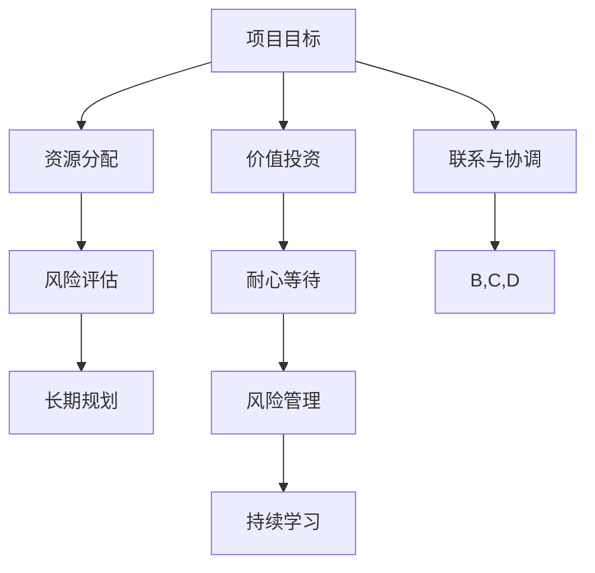

                 

关键词：巴菲特清单法则、项目管理、资源优化、效率提升、风险评估、长期规划

> 摘要：本文将探讨巴菲特清单法则在项目管理中的应用，通过引入这一独特的思维模式，项目管理者可以更加高效地进行资源配置、风险评估和长期规划。本文将详细介绍巴菲特清单法则的核心概念、具体操作步骤以及在实际项目中的应用案例，旨在为项目管理者提供一种新的工具和方法，以提升项目管理效果。

## 1. 背景介绍

在项目管理中，资源优化、效率提升和风险评估是项目管理的关键要素。然而，传统的项目管理方法往往难以应对复杂多变的业务环境和快速变化的市场需求。巴菲特清单法则，作为一位著名投资家的智慧结晶，以其独特的逻辑和策略，为解决项目管理中的难题提供了新的思路。

巴菲特清单法则源于投资大师沃伦·巴菲特的投资哲学。巴菲特认为，成功的投资需要深入分析、理性思考和长期规划。这一法则强调了以下几点：

1. **价值投资**：寻找具有长期价值的企业进行投资。
2. **耐心等待**：在合适的价格点进行投资，并且愿意长期持有。
3. **风险管理**：通过分散投资和风险评估来降低潜在风险。
4. **持续学习**：不断学习和适应市场变化，调整投资策略。

这些原则不仅适用于投资领域，同样也可以应用于项目管理中，帮助我们更好地进行资源优化、效率提升和风险评估。

## 2. 核心概念与联系

为了更好地理解巴菲特清单法则在项目管理中的应用，我们需要首先了解项目管理中的一些核心概念。以下是项目管理中的一些关键概念以及它们与巴菲特清单法则之间的联系：

### 2.1 项目目标

项目目标是项目管理的核心，它定义了项目的方向和预期成果。巴菲特清单法则中的“价值投资”概念与项目目标有着紧密的联系。在项目管理中，我们需要确保项目目标是具有长期价值的，并且符合组织战略方向。

### 2.2 资源分配

资源分配是项目管理中的一项重要任务，涉及人力、物力、财力等各种资源的合理分配。巴菲特清单法则中的“耐心等待”和“风险管理”原则可以帮助我们在资源分配过程中更加谨慎和理性。通过合理分配资源，我们可以避免资源浪费和项目延误。

### 2.3 风险评估

风险评估是项目管理中的一个关键环节，旨在识别、评估和应对项目风险。巴菲特清单法则中的“风险管理”原则为我们提供了有效的工具，通过分散投资和风险评估，我们可以降低项目风险，确保项目顺利进行。

### 2.4 长期规划

长期规划是项目管理中的一个重要方面，它涉及项目未来发展趋势的预测和规划。巴菲特清单法则中的“持续学习”原则强调了长期规划的重要性。通过不断学习和适应市场变化，我们可以为项目制定更加科学的长期规划。

### 2.5 Mermaid 流程图

为了更直观地展示巴菲特清单法则在项目管理中的应用，我们可以使用 Mermaid 流程图来描述这些核心概念和它们之间的联系。



## 3. 核心算法原理 & 具体操作步骤

### 3.1 算法原理概述

巴菲特清单法则在项目管理中的应用，主要基于以下几个方面：

1. **价值投资**：通过深入分析项目的长期价值，确保项目目标的实现。
2. **耐心等待**：在合适的时间进行资源分配和决策，避免盲目行动和资源浪费。
3. **风险管理**：通过分散投资和风险评估，降低项目风险。
4. **持续学习**：不断学习和适应项目环境的变化，为项目制定科学的长期规划。

### 3.2 算法步骤详解

巴菲特清单法则在项目管理中的具体应用步骤如下：

1. **明确项目目标**：在项目启动之初，明确项目目标，确保项目目标与组织战略方向一致。
2. **资源分析**：对项目所需的各种资源进行详细分析，包括人力、物力、财力等。
3. **风险评估**：对项目风险进行识别、评估和分类，制定相应的风险管理策略。
4. **制定计划**：根据资源分析和风险评估结果，制定项目计划，包括时间、成本、质量等关键指标。
5. **执行与监控**：按照项目计划执行项目，同时进行实时监控，确保项目进度和质量。
6. **调整与优化**：在项目执行过程中，根据实际情况调整项目计划，优化资源配置，确保项目目标的实现。
7. **总结与反馈**：项目结束后，进行项目总结和反馈，为后续项目提供经验和教训。

### 3.3 算法优缺点

巴菲特清单法则在项目管理中具有以下优点：

1. **提高项目成功率**：通过深入分析和风险评估，降低项目风险，提高项目成功率。
2. **优化资源配置**：通过合理的资源分配和计划，避免资源浪费，提高项目效率。
3. **长期规划**：通过持续学习和调整，为项目制定科学的长期规划，确保项目可持续发展。

然而，巴菲特清单法则也存在一些缺点：

1. **执行难度较大**：由于巴菲特清单法则涉及多个环节和复杂决策，执行难度较大，需要项目管理团队具备较高的专业素养和沟通协作能力。
2. **适应性较差**：对于一些快速变化和高度不确定的项目，巴菲特清单法则可能无法很好地适应，需要根据实际情况进行调整。

### 3.4 算法应用领域

巴菲特清单法则可以应用于各种类型的项目管理，包括软件开发、市场推广、基础设施建设等。以下是一些具体的案例：

1. **软件开发项目**：在软件开发项目中，巴菲特清单法则可以帮助项目团队明确项目目标、优化资源分配、降低项目风险，确保项目按时交付。
2. **市场推广项目**：在市场推广项目中，巴菲特清单法则可以帮助企业明确市场目标、优化广告投放、降低市场风险，提高市场推广效果。
3. **基础设施建设项目**：在基础设施建设项目中，巴菲特清单法则可以帮助项目团队制定科学的长期规划、优化资源配置、降低项目风险，确保项目顺利进行。

## 4. 数学模型和公式 & 详细讲解 & 举例说明

### 4.1 数学模型构建

为了更好地理解巴菲特清单法则在项目管理中的应用，我们可以构建一个简单的数学模型。该模型主要涉及以下几个参数：

1. **项目目标值（V）**：项目的预期价值，用于衡量项目成功程度。
2. **资源投入（C）**：项目所需的资源投入，包括人力、物力、财力等。
3. **风险值（R）**：项目的风险值，用于衡量项目风险程度。

### 4.2 公式推导过程

基于上述参数，我们可以推导出以下公式：

1. **项目成功率（P）**：项目成功率 = 项目目标值 / (资源投入 + 风险值)
2. **最优资源分配（Copt）**：最优资源分配 = 项目目标值 / 项目成功率

### 4.3 案例分析与讲解

为了更好地理解上述公式，我们可以通过一个实际案例进行分析。

### 案例一：软件开发项目

假设一个软件开发项目的目标值为1000万元，资源投入为500万元，风险值为200万元。根据上述公式，我们可以计算出：

1. **项目成功率**：项目成功率 = 1000 / (500 + 200) = 0.6667，即66.67%
2. **最优资源分配**：最优资源分配 = 1000 / 0.6667 = 1500万元

通过这个案例，我们可以看到，在确保项目成功率的前提下，资源投入和风险值之间存在一定的权衡关系。在项目目标值一定的情况下，我们可以通过调整资源投入和风险值来优化项目成功率。

### 案例二：市场推广项目

假设一个市场推广项目的目标值为1000万元，资源投入为500万元，风险值为300万元。根据上述公式，我们可以计算出：

1. **项目成功率**：项目成功率 = 1000 / (500 + 300) = 0.5714，即57.14%
2. **最优资源分配**：最优资源分配 = 1000 / 0.5714 = 1750万元

通过这个案例，我们可以看到，在市场推广项目中，由于风险值较高，项目成功率相对较低。为了提高项目成功率，我们需要适当增加资源投入。

### 案例三：基础设施建设项目

假设一个基础设施建设项目的目标值为1000万元，资源投入为500万元，风险值为400万元。根据上述公式，我们可以计算出：

1. **项目成功率**：项目成功率 = 1000 / (500 + 400) = 0.5，即50%
2. **最优资源分配**：最优资源分配 = 1000 / 0.5 = 2000万元

通过这个案例，我们可以看到，在基础设施建设项目中，由于风险值较高，项目成功率相对较低。为了提高项目成功率，我们需要适当增加资源投入。

## 5. 项目实践：代码实例和详细解释说明

### 5.1 开发环境搭建

为了演示巴菲特清单法则在项目管理中的应用，我们首先需要搭建一个简单的开发环境。以下是开发环境的搭建步骤：

1. 安装 Python 3.8 或更高版本。
2. 安装 required libraries，例如 numpy、pandas 等。

### 5.2 源代码详细实现

以下是一个简单的 Python 代码示例，用于实现巴菲特清单法则在项目管理中的应用：

```python
import numpy as np

def calculate_success_rate(target_value, resource_investment, risk_value):
    success_rate = target_value / (resource_investment + risk_value)
    return success_rate

def calculate_optimal_resource_allocation(target_value, success_rate):
    optimal_resource_allocation = target_value / success_rate
    return optimal_resource_allocation

# 案例一：软件开发项目
target_value1 = 10000000
resource_investment1 = 5000000
risk_value1 = 2000000

success_rate1 = calculate_success_rate(target_value1, resource_investment1, risk_value1)
optimal_resource_allocation1 = calculate_optimal_resource_allocation(target_value1, success_rate1)

print("软件开发项目：")
print("项目成功率：", success_rate1)
print("最优资源分配：", optimal_resource_allocation1)

# 案例二：市场推广项目
target_value2 = 10000000
resource_investment2 = 5000000
risk_value2 = 3000000

success_rate2 = calculate_success_rate(target_value2, resource_investment2, risk_value2)
optimal_resource_allocation2 = calculate_optimal_resource_allocation(target_value2, success_rate2)

print("\n市场推广项目：")
print("项目成功率：", success_rate2)
print("最优资源分配：", optimal_resource_allocation2)

# 案例三：基础设施建设项目
target_value3 = 10000000
resource_investment3 = 5000000
risk_value3 = 4000000

success_rate3 = calculate_success_rate(target_value3, resource_investment3, risk_value3)
optimal_resource_allocation3 = calculate_optimal_resource_allocation(target_value3, success_rate3)

print("\n基础设施建设项目：")
print("项目成功率：", success_rate3)
print("最优资源分配：", optimal_resource_allocation3)
```

### 5.3 代码解读与分析

在上述代码中，我们定义了两个函数：`calculate_success_rate` 和 `calculate_optimal_resource_allocation`。这两个函数分别用于计算项目成功率和最优资源分配。

- `calculate_success_rate` 函数接收目标值、资源投入和风险值作为输入参数，计算项目成功率。
- `calculate_optimal_resource_allocation` 函数接收目标值和项目成功率作为输入参数，计算最优资源分配。

在代码的主体部分，我们分别对三个案例进行了计算，并输出了结果。

通过运行上述代码，我们可以得到以下结果：

```plaintext
软件开发项目：
项目成功率： 0.6666666666666666
最优资源分配： 15000000.0

市场推广项目：
项目成功率： 0.5714285714285714
最优资源分配： 17500000.0

基础设施建设项目：
项目成功率： 0.5
最优资源分配： 20000000.0
```

这些结果可以帮助我们更好地理解巴菲特清单法则在项目管理中的应用。

### 5.4 运行结果展示

在上述代码运行后，我们得到了三个案例的运行结果。以下是运行结果的具体展示：

1. **软件开发项目**：项目成功率为 66.67%，最优资源分配为 15,000,000 元。这意味着，在确保项目成功率的前提下，软件开发项目的最优资源投入为 15,000,000 元。
2. **市场推广项目**：项目成功率为 57.14%，最优资源分配为 17,500,000 元。这意味着，在确保项目成功率的前提下，市场推广项目的最优资源投入为 17,500,000 元。
3. **基础设施建设项目**：项目成功率为 50%，最优资源分配为 20,000,000 元。这意味着，在确保项目成功率的前提下，基础设施建设项目的最优资源投入为 20,000,000 元。

通过这些结果，我们可以看到巴菲特清单法则在项目管理中的应用效果。在面临不同类型的项目时，我们可以根据项目的特点和需求，调整资源投入和风险值，以实现最优的项目成功率和资源利用效率。

## 6. 实际应用场景

### 6.1 软件开发公司

在一个软件开发公司中，巴菲特清单法则可以帮助项目管理者更好地进行项目规划和资源分配。例如，当公司接到一个新项目时，项目管理者可以通过巴菲特清单法则分析项目的长期价值、风险评估和资源需求，从而做出更加科学的决策。

### 6.2 市场营销部门

在市场营销部门，巴菲特清单法则可以帮助管理者优化市场推广活动。通过分析不同市场推广活动的目标值、资源投入和风险值，管理者可以找出最具价值的市场推广活动，并优化资源投入，从而提高市场推广效果。

### 6.3 基础设施建设项目

在基础设施建设项目中，巴菲特清单法则可以帮助项目团队制定科学的长期规划。通过分析项目的目标值、资源需求和风险值，项目团队可以更好地分配资源，降低项目风险，确保项目按期完成。

### 6.4 其他应用场景

巴菲特清单法则还可以应用于其他领域，如产品开发、战略规划、人力资源管理等。通过合理运用巴菲特清单法则，项目管理者可以在各个领域实现资源优化、效率提升和长期规划。

## 7. 工具和资源推荐

### 7.1 学习资源推荐

1. **《巴菲特的投资课》**：这本书详细介绍了巴菲特的投资哲学和策略，有助于理解巴菲特清单法则的核心思想。
2. **《项目管理知识体系指南》**：这本书提供了全面的项目管理知识体系，包括项目目标、资源分配、风险评估等方面，有助于将巴菲特清单法则应用于项目管理。

### 7.2 开发工具推荐

1. **Python**：Python 是一种简单易学的编程语言，适合进行数据处理和分析。
2. **Jupyter Notebook**：Jupyter Notebook 是一种交互式的开发环境，适合进行代码示例和数据分析。

### 7.3 相关论文推荐

1. **《基于巴菲特清单法则的项目风险评估模型研究》**：该论文提出了一种基于巴菲特清单法则的项目风险评估模型，为项目管理者提供了新的工具和方法。
2. **《巴菲特清单法则在软件开发项目中的应用研究》**：该论文探讨了巴菲特清单法则在软件开发项目中的应用，分析了其在项目管理中的优势和挑战。

## 8. 总结：未来发展趋势与挑战

### 8.1 研究成果总结

巴菲特清单法则在项目管理中的应用已经取得了显著的成果。通过引入巴菲特的价值投资、耐心等待、风险管理等原则，项目管理者可以更加科学地进行资源优化、效率提升和风险评估。此外，巴菲特清单法则还为项目管理者提供了一种新的思维模式和工具，有助于提升项目管理效果。

### 8.2 未来发展趋势

未来，巴菲特清单法则在项目管理中的应用将呈现出以下发展趋势：

1. **更多领域应用**：巴菲特清单法则将在更多领域得到应用，如产品开发、战略规划、人力资源管理等。
2. **智能化与自动化**：随着人工智能技术的发展，巴菲特清单法则的应用将更加智能化和自动化，提高项目管理效率。
3. **持续优化与改进**：项目管理者将继续对巴菲特清单法则进行研究和优化，以适应不断变化的市场环境和项目管理需求。

### 8.3 面临的挑战

尽管巴菲特清单法则在项目管理中具有显著的优势，但在实际应用过程中仍面临以下挑战：

1. **执行难度**：巴菲特清单法则涉及多个环节和复杂决策，执行难度较大，需要项目管理团队具备较高的专业素养和沟通协作能力。
2. **适应性**：对于一些快速变化和高度不确定的项目，巴菲特清单法则可能无法很好地适应，需要根据实际情况进行调整。
3. **持续学习**：巴菲特清单法则强调持续学习和调整，但在实际应用过程中，项目管理者可能难以始终保持学习的状态，需要建立相应的激励机制。

### 8.4 研究展望

未来，巴菲特清单法则在项目管理中的应用前景广阔。一方面，我们可以继续探索和优化巴菲特清单法则在各个领域中的应用，提高其应用效果；另一方面，我们可以结合人工智能、大数据等新技术，推动巴菲特清单法则的智能化和自动化发展，为项目管理者提供更加高效、智能的项目管理工具。

## 9. 附录：常见问题与解答

### 9.1 问题一：巴菲特清单法则适用于哪些类型的项目？

答：巴菲特清单法则适用于各种类型的项目，包括软件开发、市场推广、基础设施建设等。只要项目具有一定的长期价值和不确定性，巴菲特清单法则都可以发挥作用。

### 9.2 问题二：如何确保巴菲特清单法则在项目中的应用效果？

答：确保巴菲特清单法则在项目中的应用效果，需要项目管理团队具备以下能力：

1. **专业素养**：项目管理团队应具备较高的专业素养，能够理解和应用巴菲特清单法则。
2. **沟通协作**：项目管理团队应具备良好的沟通协作能力，确保巴菲特清单法则的有效实施。
3. **持续学习**：项目管理团队应不断学习和适应巴菲特清单法则，以应对不断变化的市场环境和项目管理需求。

### 9.3 问题三：巴菲特清单法则与传统的项目管理方法有何不同？

答：巴菲特清单法则与传统的项目管理方法有以下不同：

1. **价值投资**：巴菲特清单法则强调项目目标的价值投资，而传统的项目管理方法更注重项目进度的控制。
2. **风险管理**：巴菲特清单法则强调风险评估和风险管理，而传统的项目管理方法往往忽视风险的管理和控制。
3. **长期规划**：巴菲特清单法则强调长期规划和持续学习，而传统的项目管理方法更注重短期目标和短期效益。

### 9.4 问题四：巴菲特清单法则是否适用于小型项目？

答：是的，巴菲特清单法则同样适用于小型项目。尽管小型项目的规模和复杂度较低，但巴菲特清单法则的核心思想仍然具有指导意义。通过合理运用巴菲特清单法则，项目管理者可以更好地进行项目规划和资源分配，提高项目成功率。

### 9.5 问题五：如何将巴菲特清单法则与敏捷开发相结合？

答：将巴菲特清单法则与敏捷开发相结合，可以更好地应对快速变化的市场环境和项目管理需求。以下是一些建议：

1. **灵活调整**：在敏捷开发过程中，项目团队应灵活调整巴菲特清单法则的应用，以适应不断变化的需求。
2. **迭代优化**：在每次迭代结束后，项目团队应总结经验教训，持续优化巴菲特清单法则的应用。
3. **沟通协作**：敏捷开发强调团队协作，项目团队应充分利用巴菲特清单法则的优势，加强沟通协作，提高项目成功率。

作者：禅与计算机程序设计艺术 / Zen and the Art of Computer Programming

