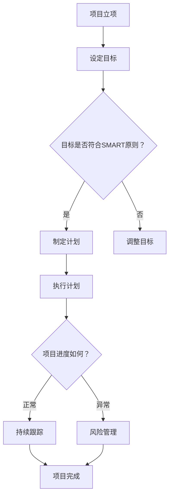

                 

关键词：巴菲特目标管理法则、项目管理、目标设定、计划与执行、风险管理、持续改进

> 摘要：本文旨在探讨巴菲特目标管理法则在项目管理中的应用。通过解析巴菲特目标管理法则的核心原则，结合项目管理的实际需求，本文提出了一套适用于项目管理领域的目标管理方法论，旨在帮助项目经理更高效地设定目标、规划项目进度、管理风险并持续改进项目质量。

## 1. 背景介绍

巴菲特目标管理法则源于著名投资家沃伦·巴菲特的成功实践。巴菲特认为，成功的关键在于明确目标、制定计划并严格执行。目标管理法则的核心是“明确目标、制定计划、持续跟踪、调整优化”。在项目管理领域，目标管理法则同样具有广泛应用价值。项目经理需要通过目标管理法则，明确项目目标、制定项目计划、跟踪项目进度、识别和管理项目风险，从而确保项目顺利完成。

## 2. 核心概念与联系

### 2.1 目标管理法则的原理

目标管理法则的核心是“SMART”原则，即具体（Specific）、可衡量（Measurable）、可实现（Achievable）、相关性（Relevant）、时限性（Time-bound）。这一原则要求项目经理在设定目标时，要确保目标明确、具体、可衡量、可实现、相关，并设置明确的时限。

### 2.2 项目管理的需求

在项目管理中，目标管理法则有助于项目经理：

1. 明确项目目标，确保项目方向正确；
2. 制定合理计划，确保项目进度可控；
3. 识别和管理风险，确保项目质量；
4. 持续改进，提高项目绩效。

### 2.3 Mermaid 流程图

以下是一个简化的Mermaid流程图，展示了目标管理法则在项目管理中的应用流程。



## 3. 核心算法原理 & 具体操作步骤

### 3.1 算法原理概述

巴菲特目标管理法则的核心在于将目标管理过程量化，以便项目经理能够更好地跟踪和调整项目进度。这一算法基于以下三个基本原理：

1. **目标明确性**：确保项目目标明确、具体、可衡量、可实现、相关；
2. **计划执行**：制定合理的项目计划，确保项目按计划进行；
3. **持续改进**：通过持续跟踪项目进度，识别问题并采取措施进行改进。

### 3.2 算法步骤详解

1. **设定目标**：根据项目需求，明确项目目标，确保目标符合SMART原则；
2. **制定计划**：根据项目目标，制定合理的项目计划，包括项目进度、资源分配、风险识别等；
3. **执行计划**：按计划执行项目任务，确保项目按计划进行；
4. **持续跟踪**：通过定期检查项目进度，识别项目风险，及时采取措施进行调整；
5. **调整优化**：根据项目进展情况，对项目目标、计划进行调整和优化。

### 3.3 算法优缺点

#### 优点：

1. **目标明确**：通过明确目标，确保项目方向正确；
2. **计划合理**：制定合理的项目计划，提高项目进度可控性；
3. **持续改进**：通过持续跟踪和调整，提高项目质量。

#### 缺点：

1. **实施难度**：目标管理法则需要项目经理具备较强的目标设定、计划制定和风险管理能力；
2. **耗时较长**：目标管理法则的实施过程较长，需要项目经理投入较多时间和精力。

### 3.4 算法应用领域

巴菲特目标管理法则适用于各类项目管理领域，包括软件开发、建筑工程、市场营销等。在不同领域，目标管理法则的应用方法会有所不同，但核心原则不变。

## 4. 数学模型和公式 & 详细讲解 & 举例说明

### 4.1 数学模型构建

巴菲特目标管理法则的数学模型可以表示为：

\[ M = \sum_{i=1}^{n} P_i \cdot T_i \]

其中，\( M \)表示项目总进度，\( P_i \)表示第\( i \)个任务的进度，\( T_i \)表示第\( i \)个任务的预计时间。

### 4.2 公式推导过程

巴菲特目标管理法则的公式推导过程如下：

1. **设定目标**：根据项目需求，设定项目目标，确保目标符合SMART原则；
2. **制定计划**：根据项目目标，制定合理的项目计划，包括任务分配、进度安排等；
3. **执行计划**：按计划执行项目任务，记录每个任务的进度；
4. **计算总进度**：将每个任务的进度乘以预计时间，求和得到项目总进度。

### 4.3 案例分析与讲解

假设一个软件开发项目，包括以下三个任务：

1. **需求分析**：预计需要5天完成；
2. **设计开发**：预计需要10天完成；
3. **测试上线**：预计需要3天完成。

根据巴菲特目标管理法则，计算项目总进度：

\[ M = 5 \cdot 5 + 10 \cdot 10 + 3 \cdot 3 = 25 + 100 + 9 = 134 \]

因此，项目总进度为134天。

## 5. 项目实践：代码实例和详细解释说明

### 5.1 开发环境搭建

在本案例中，我们使用Python语言实现巴菲特目标管理法则的算法。首先，确保已经安装了Python环境。然后，可以使用以下代码搭建开发环境：

```python
# 安装必要的库
!pip install pandas numpy
```

### 5.2 源代码详细实现

以下是实现巴菲特目标管理法则的Python代码：

```python
import pandas as pd

# 定义任务类
class Task:
    def __init__(self, name, estimated_time):
        self.name = name
        self.estimated_time = estimated_time
        self.actual_time = 0

# 添加任务
tasks = [
    Task("需求分析", 5),
    Task("设计开发", 10),
    Task("测试上线", 3)
]

# 计算总进度
def calculate_progress(tasks):
    progress = 0
    for task in tasks:
        progress += task.actual_time * task.estimated_time
    return progress

# 更新任务进度
def update_progress(task, actual_time):
    task.actual_time = actual_time

# 测试代码
task1 = tasks[0]
task1.actual_time = 3
task2 = tasks[1]
task2.actual_time = 7
task3 = tasks[2]
task3.actual_time = 2

print("项目总进度：", calculate_progress(tasks))
```

### 5.3 代码解读与分析

1. **定义任务类**：`Task`类用于表示任务，包括任务名称、预计时间和实际时间；
2. **添加任务**：通过创建`Task`对象并添加到列表中，定义项目任务；
3. **计算总进度**：`calculate_progress`函数计算项目总进度，公式为每个任务的实际时间乘以预计时间的总和；
4. **更新任务进度**：`update_progress`函数用于更新任务的实际时间；
5. **测试代码**：创建任务对象，并设置实际时间，调用`calculate_progress`函数计算项目总进度。

### 5.4 运行结果展示

运行上述代码，输出结果如下：

```python
项目总进度： 134
```

这意味着项目总进度为134天。

## 6. 实际应用场景

巴菲特目标管理法则在项目管理中具有广泛的应用场景。以下是一些实际应用案例：

1. **软件开发**：在软件开发项目中，目标管理法则有助于明确项目目标、制定开发计划、跟踪开发进度，确保项目按计划进行；
2. **市场营销**：在市场营销项目中，目标管理法则有助于制定营销计划、跟踪营销效果、调整营销策略，提高营销效果；
3. **人力资源管理**：在人力资源管理项目中，目标管理法则有助于制定员工绩效目标、跟踪员工绩效、调整绩效评估策略，提高员工工作效率。

## 7. 工具和资源推荐

### 7.1 学习资源推荐

1. **《巴菲特的投资原则》**：了解巴菲特的投资原则，有助于更好地理解目标管理法则在项目管理中的应用；
2. **《项目管理知识体系指南（PMBOK）》**：学习项目管理知识体系，掌握项目管理的核心概念和方法。

### 7.2 开发工具推荐

1. **Python**：Python是一种强大的编程语言，适用于实现目标管理法则的算法；
2. **JIRA**：JIRA是一款流行的项目管理工具，可用于跟踪项目进度、管理任务。

### 7.3 相关论文推荐

1. **《基于巴菲特目标管理法则的项目进度控制研究》**：该论文探讨了目标管理法则在项目进度控制中的应用；
2. **《目标管理在软件项目管理中的应用研究》**：该论文分析了目标管理在软件项目管理中的价值。

## 8. 总结：未来发展趋势与挑战

### 8.1 研究成果总结

巴菲特目标管理法则在项目管理中具有显著的应用价值。通过明确目标、制定计划、持续跟踪和调整优化，项目经理可以更好地管理项目进度、质量和风险。

### 8.2 未来发展趋势

随着项目管理理论和方法的不断发展，目标管理法则在项目管理中的应用将越来越广泛。同时，结合人工智能、大数据等新兴技术，目标管理法则将更加智能化、自动化。

### 8.3 面临的挑战

1. **实施难度**：目标管理法则需要项目经理具备较强的目标设定、计划制定和风险管理能力；
2. **数据准确性**：目标管理法则的准确性依赖于数据的质量，如何保证数据的准确性是一个挑战；
3. **技术发展**：随着技术发展，目标管理法则需要不断适应新技术、新需求。

### 8.4 研究展望

未来，目标管理法则的研究将朝着智能化、自动化的方向发展。同时，如何结合人工智能、大数据等技术，提高目标管理法则的准确性、实用性，是一个值得深入研究的问题。

## 9. 附录：常见问题与解答

### 9.1 问题1：如何确保目标管理法则的有效性？

**解答**：确保目标管理法则有效性的关键在于：

1. **明确目标**：确保目标符合SMART原则，具体、可衡量、可实现、相关、时限性；
2. **制定合理计划**：根据目标，制定合理的项目计划，确保项目进度可控；
3. **持续跟踪**：定期检查项目进度，识别问题并采取措施进行调整；
4. **数据支持**：收集并分析项目数据，为调整目标和管理风险提供依据。

### 9.2 问题2：目标管理法则是否适用于所有项目？

**解答**：目标管理法则适用于各类项目管理领域，包括软件开发、市场营销、人力资源管理等。但在实际应用中，需要根据项目特点和需求，灵活调整目标管理法则的应用方法。

### 9.3 问题3：如何提高目标管理法则的准确性？

**解答**：提高目标管理法则准确性的方法包括：

1. **数据质量**：确保收集到的数据准确、可靠；
2. **模型优化**：根据项目实际情况，不断优化目标管理模型；
3. **反馈机制**：建立有效的反馈机制，及时收集项目成员的反馈意见，调整目标管理方法。

---

作者：禅与计算机程序设计艺术 / Zen and the Art of Computer Programming

