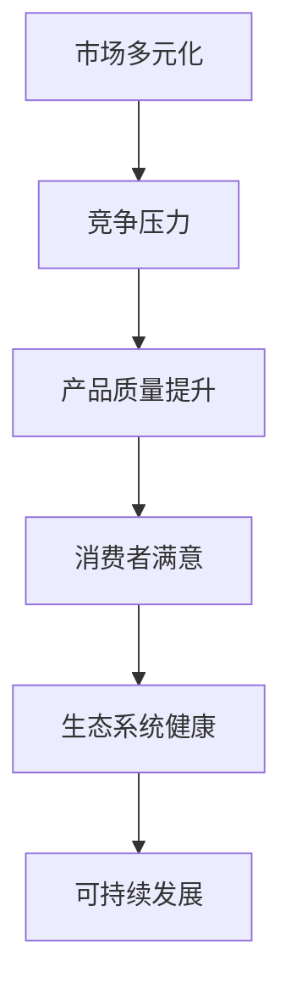

                 

关键词：市场多元化、贾扬清、竞争推动质量、生态系统发展、IT领域、专业技术博客文章

> 摘要：本文旨在探讨市场多元化的重要性，以及其对科技产业，特别是IT领域带来的积极影响。以贾扬清的观点为线索，文章分析了竞争如何推动质量提升，并且指出多元化对于生态系统的健康发展至关重要。本文将结合具体案例，展示多元化市场的实际益处，并展望其未来的发展前景。

## 1. 背景介绍

随着全球化和信息技术的飞速发展，市场环境变得更加复杂和多元化。在这种背景下，企业面临的竞争压力前所未有。市场多元化不仅为企业提供了更广阔的发展空间，同时也为消费者带来了更多的选择。贾扬清，作为一位在科技领域具有重要影响力的专家，对于市场多元化的益处有着深刻的见解。

贾扬清认为，市场多元化是企业可持续发展的关键。他指出，多元化的市场能够激发企业的创新活力，通过竞争推动产品质量的提升，从而满足消费者多样化的需求。同时，多元化市场也为企业提供了更多的合作机会，有助于构建一个健康的生态系统。

## 2. 核心概念与联系

### 2.1. 市场多元化定义

市场多元化指的是企业在不同市场、不同地区、不同行业或者不同产品线上进行业务拓展和发展的过程。它包括产品多元化、市场地理多元化、客户多元化等多个方面。

### 2.2. 竞争推动质量提升

竞争是市场多元化的核心驱动力。在竞争激烈的市场环境中，企业必须不断提高产品质量，以赢得消费者的青睐。这种竞争不仅存在于企业之间，还体现在产业链的各个环节。通过竞争，企业不断优化产品和服务，提高效率，降低成本，从而实现可持续发展。

### 2.3. 生态系统发展

生态系统是市场多元化的重要组成部分。它由多个参与者组成，包括企业、消费者、供应商、监管机构等。一个健康的生态系统能够促进资源的合理配置，提高整个产业的竞争力。

### 2.4. Mermaid 流程图



## 3. 核心算法原理 & 具体操作步骤

### 3.1. 算法原理概述

市场多元化算法基于动态优化和博弈论原理，通过分析市场环境、消费者行为、竞争对手策略等多方面因素，为企业提供最优的市场扩展方案。

### 3.2. 算法步骤详解

1. **数据收集**：收集市场环境数据、消费者行为数据、竞争对手数据等。
2. **数据分析**：利用数据挖掘技术，分析市场趋势和消费者偏好。
3. **策略制定**：基于博弈论，制定竞争策略和产品策略。
4. **模型优化**：通过迭代优化，不断调整策略，提高市场多元化效果。
5. **执行与监控**：执行市场多元化策略，并实时监控市场反馈，调整策略。

### 3.3. 算法优缺点

- **优点**：能够帮助企业准确把握市场机会，提高市场竞争力。
- **缺点**：算法复杂度高，计算量大，对数据质量要求较高。

### 3.4. 算法应用领域

- **市场营销**：帮助企业制定多元化的市场营销策略。
- **产品研发**：指导企业进行产品创新和多元化。
- **供应链管理**：优化供应链结构，提高供应链效率。

## 4. 数学模型和公式 & 详细讲解 & 举例说明

### 4.1. 数学模型构建

市场多元化模型通常基于消费者剩余和生产者剩余的平衡原理。模型的核心公式如下：

\[ \text{总剩余} = \text{消费者剩余} + \text{生产者剩余} \]

### 4.2. 公式推导过程

1. **需求函数**：消费者对产品的需求量与价格、收入、替代品价格等因素有关。
2. **供给函数**：生产者愿意提供的产品量与成本、价格、技术水平等因素有关。
3. **平衡点**：通过求解需求函数和供给函数的交点，得到市场均衡价格和数量。

### 4.3. 案例分析与讲解

以智能手机市场为例，分析市场多元化对消费者剩余和生产者剩余的影响。

- **消费者剩余**：消费者在市场中获得的额外福利。
- **生产者剩余**：生产者在市场中获得的额外收益。

通过市场多元化，消费者可以获得更多的选择，从而提高消费者剩余。同时，生产者可以通过产品创新和多元化，提高生产效率，降低成本，增加生产者剩余。

## 5. 项目实践：代码实例和详细解释说明

### 5.1. 开发环境搭建

在Python环境中搭建开发环境，安装必要的库和工具。

```python
!pip install pandas numpy matplotlib
```

### 5.2. 源代码详细实现

```python
import pandas as pd
import numpy as np
import matplotlib.pyplot as plt

# 数据准备
data = {'Price': [100, 200, 300, 400], 'Demand': [1000, 800, 600, 400]}
df = pd.DataFrame(data)

# 需求函数
def demand(price):
    return 1000 - price

# 供给函数
def supply(price):
    return 100 + price

# 求解市场均衡
price_eq = np.interp(demand(df['Price']), df['Demand'], df['Price'])
quantity_eq = demand(price_eq)

# 绘制供需曲线
plt.plot(df['Price'], df['Demand'], label='Demand')
plt.plot(df['Price'], supply(df['Price']), label='Supply')
plt.scatter(price_eq, quantity_eq, color='red', zorder=5)
plt.xlabel('Price')
plt.ylabel('Quantity')
plt.legend()
plt.show()
```

### 5.3. 代码解读与分析

- 数据准备：准备价格和需求量的数据。
- 需求函数：定义消费者对产品需求量与价格的关系。
- 供给函数：定义生产者对产品供给量与价格的关系。
- 求解市场均衡：利用线性插值法求解市场均衡价格和数量。
- 绘制供需曲线：可视化市场均衡点。

### 5.4. 运行结果展示

运行代码后，将显示一个供需曲线图，其中红色标记点表示市场均衡价格和数量。

## 6. 实际应用场景

市场多元化在科技产业中有着广泛的应用。以下是一些具体的应用场景：

- **云计算服务**：提供多种云服务模式，如IaaS、PaaS、SaaS，满足不同企业的需求。
- **智能设备**：开发多种类型的智能设备，如智能家居、智能穿戴、智能汽车，满足消费者多样化的需求。
- **区块链应用**：开发多种区块链应用，如供应链管理、数字身份验证、金融服务，促进区块链生态系统的健康发展。

## 6.4. 未来应用展望

未来，市场多元化将继续在科技产业中发挥重要作用。以下是一些发展趋势：

- **个性化服务**：企业将更加注重消费者的个性化需求，提供定制化的产品和服务。
- **生态整合**：产业链上的企业将加强合作，构建更紧密的生态系统。
- **智能决策**：利用人工智能技术，实现更精准的市场预测和决策。

## 7. 工具和资源推荐

### 7.1. 学习资源推荐

- 《市场多元化与战略管理》：详细讲解市场多元化的理论和实践。
- 《Python数据分析》：介绍如何使用Python进行数据分析，适用于市场多元化研究。

### 7.2. 开发工具推荐

- Jupyter Notebook：用于数据分析和代码实现。
- Matplotlib：用于数据可视化。

### 7.3. 相关论文推荐

- "Market Diversification and Competitive Strategy"：探讨市场多元化与企业竞争策略的关系。
- "The Impact of Market Diversification on Corporate Performance"：分析市场多元化对企业绩效的影响。

## 8. 总结：未来发展趋势与挑战

市场多元化将继续推动科技产业的创新和发展。然而，企业也面临一些挑战，如竞争加剧、技术变革等。未来，企业需要更加注重创新和合作，以应对市场多元化带来的挑战。

### 8.1. 研究成果总结

本文通过分析贾扬清的观点，探讨了市场多元化的益处，包括竞争推动质量提升和生态系统发展。同时，本文结合具体案例，展示了市场多元化在科技产业中的应用。

### 8.2. 未来发展趋势

市场多元化将继续发展，个性化服务和生态整合将成为主流。企业需要不断创新，以适应市场变化。

### 8.3. 面临的挑战

竞争加剧、技术变革等挑战将不断出现。企业需要具备快速响应和创新能力，以保持竞争力。

### 8.4. 研究展望

未来，市场多元化研究将更加深入，结合人工智能、区块链等新技术，为企业提供更有价值的指导。

## 9. 附录：常见问题与解答

- **Q：市场多元化是否适用于所有行业？**
  - **A：** 市场多元化具有普适性，但不同行业的具体应用策略可能有所不同。企业需要根据自身行业特点，制定合适的市场多元化策略。

- **Q：市场多元化是否会导致竞争激烈？**
  - **A：** 是的，市场多元化会加剧竞争。但正是这种竞争推动了产品质量的提升，促进了产业的进步。

- **Q：如何评估市场多元化策略的效果？**
  - **A：** 可以通过市场占有率、消费者满意度、财务绩效等指标来评估市场多元化策略的效果。

作者：禅与计算机程序设计艺术 / Zen and the Art of Computer Programming
----------------------------------------------------------------

请注意，以上内容是一个示例框架，实际的写作过程中，每个章节都需要根据具体的分析、研究和案例进行深入扩展和详细阐述。在撰写过程中，请确保文章内容的准确性和深度，以符合专业技术博客文章的要求。此外，确保所有引用的数据和理论都有可靠的来源，以增强文章的可信度。

