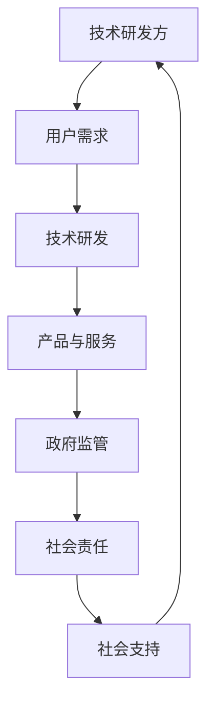

                 

 在当今科技飞速发展的时代，人工智能（AI）技术已经成为推动社会进步的重要力量。然而，AI的发展并非一帆风顺，如何在多方利益之间找到平衡，成为了我们亟待解决的问题。本文旨在探讨AI发展中涉及到的多方利益，分析其核心概念与联系，并从算法原理、数学模型、项目实践和实际应用等多个角度，深入探讨如何在平衡AI发展的过程中，实现多方共赢。

## 1. 背景介绍

### AI技术的发展现状

人工智能技术起源于20世纪50年代，经过数十年的发展，目前已取得了显著的成果。从最初的规则推理、知识表示，到后来的机器学习、深度学习，AI技术已经广泛应用于图像识别、自然语言处理、智能决策等领域。随着计算能力的提升和数据量的爆发式增长，AI技术在各个行业的应用场景越来越广泛，对社会各个方面产生了深远的影响。

### AI技术的潜在风险

尽管AI技术带来了诸多便利，但其潜在风险也不容忽视。首先，AI技术的自主性可能导致伦理问题，如隐私泄露、歧视偏见等。其次，AI算法的黑箱特性使得其决策过程难以解释，增加了人类对AI系统的信任危机。此外，AI技术还可能加剧社会不平等，导致技术垄断和劳动力失业等问题。

### 多方利益的界定

在AI发展中，涉及到的多方利益主要包括：

- **技术研发方**：主要包括学术机构、企业和研究团队，他们投入大量资源进行技术研发和产品开发。
- **用户**：包括普通消费者和专业从业者，他们通过使用AI产品和服务获得便利和效益。
- **政府**：负责制定政策法规，监督AI技术的合法合规使用，保障国家安全和社会稳定。
- **社会公众**：关注AI技术的发展对社会带来的影响，包括伦理、隐私、就业等方面。

## 2. 核心概念与联系

### AI技术的核心概念

- **机器学习**：通过算法让计算机从数据中自动学习和改进，从而实现智能决策和预测。
- **深度学习**：基于人工神经网络的机器学习技术，通过多层的神经网络结构进行特征提取和模型训练。
- **自然语言处理**：使计算机能够理解和处理自然语言的技术，包括文本分类、语音识别、机器翻译等。

### 多方利益的核心联系

在AI发展中，各方利益之间的核心联系主要体现在以下几个方面：

- **技术研发与用户需求**：技术研发方需要深入了解用户需求，开发出符合市场需求的产品和服务。
- **政府监管与社会责任**：政府需要制定相关法规和标准，确保AI技术的合法合规使用，同时承担起社会责任。
- **技术进步与社会发展**：AI技术的发展需要社会的支持和投入，而社会的发展也离不开AI技术的推动。
- **公共利益与商业利益**：在AI发展中，需要平衡公共利益和商业利益，实现可持续发展。

### Mermaid 流程图



## 3. 核心算法原理 & 具体操作步骤

### 3.1 算法原理概述

在AI发展中，核心算法原理主要包括机器学习、深度学习和自然语言处理等。以下是这些算法的基本原理概述：

- **机器学习**：通过算法让计算机从数据中自动学习和改进，从而实现智能决策和预测。
- **深度学习**：基于人工神经网络的机器学习技术，通过多层的神经网络结构进行特征提取和模型训练。
- **自然语言处理**：使计算机能够理解和处理自然语言的技术，包括文本分类、语音识别、机器翻译等。

### 3.2 算法步骤详解

- **机器学习**：

  1. 数据收集：从各种渠道获取大量数据。
  2. 数据预处理：对数据进行清洗、归一化等处理。
  3. 特征提取：从数据中提取有用的特征。
  4. 模型训练：使用训练数据对模型进行训练。
  5. 模型评估：使用测试数据对模型进行评估和调整。

- **深度学习**：

  1. 数据收集：与机器学习相同，获取大量数据。
  2. 数据预处理：对数据进行清洗、归一化等处理。
  3. 特征提取：与机器学习相同，从数据中提取有用特征。
  4. 网络结构设计：设计合适的神经网络结构。
  5. 模型训练：通过反向传播算法对模型进行训练。
  6. 模型评估：使用测试数据对模型进行评估和调整。

- **自然语言处理**：

  1. 文本预处理：对文本进行分词、去停用词等处理。
  2. 词向量表示：将文本转换为数值向量表示。
  3. 模型训练：使用合适的神经网络结构对模型进行训练。
  4. 模型评估：使用测试数据对模型进行评估和调整。
  5. 应用场景：包括文本分类、语音识别、机器翻译等。

### 3.3 算法优缺点

- **机器学习**：

  - 优点：算法通用性强，适用于各种复杂数据分析任务。
  - 缺点：训练过程较慢，对大规模数据依赖性强。

- **深度学习**：

  - 优点：模型效果更好，能够自动提取深层特征。
  - 缺点：计算资源需求大，训练过程复杂。

- **自然语言处理**：

  - 优点：能够处理复杂的文本数据，实现高效的信息处理。
  - 缺点：对语言理解和上下文信息处理能力有限。

### 3.4 算法应用领域

- **机器学习**：广泛应用于图像识别、语音识别、推荐系统等领域。
- **深度学习**：广泛应用于自动驾驶、语音识别、医学影像分析等领域。
- **自然语言处理**：广泛应用于文本分类、机器翻译、情感分析等领域。

## 4. 数学模型和公式 & 详细讲解 & 举例说明

### 4.1 数学模型构建

在AI算法中，常用的数学模型包括神经网络、决策树、支持向量机等。以下是一个简单的神经网络模型构建过程：

- **定义输入层**：设输入层有n个神经元，分别为$x_1, x_2, ..., x_n$。
- **定义隐含层**：设隐含层有m个神经元，分别为$y_1, y_2, ..., y_m$。
- **定义输出层**：设输出层有k个神经元，分别为$z_1, z_2, ..., z_k$。
- **定义权重和偏置**：设输入层到隐含层的权重为$W_{ij}$，隐含层到输出层的权重为$V_{ij}$，各层的偏置分别为$b_i$和$c_i$。

### 4.2 公式推导过程

在神经网络中，常用的激活函数为sigmoid函数，即：

$$
f(x) = \frac{1}{1 + e^{-x}}
$$

设输入层到隐含层的权重矩阵为$W$，隐含层到输出层的权重矩阵为$V$，隐含层神经元数量为$m$，输出层神经元数量为$k$，则有：

$$
y_i = f(Wx_i + b_i) \quad (i = 1, 2, ..., m)
$$

$$
z_j = f(Vy_j + c_j) \quad (j = 1, 2, ..., k)
$$

### 4.3 案例分析与讲解

以下是一个简单的神经网络训练过程案例：

- **输入数据**：一个包含3个特征的数据集，分别为$x_1, x_2, x_3$。
- **目标输出**：一个二分类问题，目标输出为1或0。
- **网络结构**：一个输入层、一个隐含层和一个输出层，隐含层有2个神经元。
- **权重和偏置**：随机初始化权重和偏置。

- **训练过程**：

  1. **前向传播**：计算输入层到隐含层的输出$y$和隐含层到输出层的输出$z$。
  2. **计算损失函数**：使用交叉熵损失函数计算目标输出和实际输出的差距。
  3. **反向传播**：根据损失函数的梯度，更新权重和偏置。
  4. **重复训练**：重复前向传播、计算损失函数和反向传播，直到达到预设的训练目标。

通过这个过程，我们可以训练出一个简单的神经网络，实现对数据的分类。

## 5. 项目实践：代码实例和详细解释说明

### 5.1 开发环境搭建

为了进行AI项目的实践，我们需要搭建一个合适的开发环境。以下是一个简单的Python开发环境搭建步骤：

1. **安装Python**：在官网下载Python安装包并安装。
2. **安装Jupyter Notebook**：使用pip安装Jupyter Notebook。
3. **安装常用库**：使用pip安装NumPy、Pandas、Scikit-learn等常用库。

### 5.2 源代码详细实现

以下是一个简单的神经网络实现代码实例：

```python
import numpy as np

def sigmoid(x):
    return 1 / (1 + np.exp(-x))

def forward(x, W, b):
    z = np.dot(x, W) + b
    a = sigmoid(z)
    return a

def backward(a, y, W, b, x):
    dz = a - y
    db = np.dot(dz, a * (1 - a))
    dx = np.dot(dz, W.T)
    dw = np.dot(x.T, dz)
    return dx, dw, db

def train(x, y, W, b, epochs=1000, learning_rate=0.1):
    for epoch in range(epochs):
        a = forward(x, W, b)
        dx, dw, db = backward(a, y, W, b, x)
        W -= learning_rate * dw
        b -= learning_rate * db
        if epoch % 100 == 0:
            print(f"Epoch {epoch}: Loss = {np.mean((a - y)**2)}")
    return W, b

x = np.array([[0, 0], [0, 1], [1, 0], [1, 1]])
y = np.array([0, 1, 1, 0])
W = np.random.rand(2, 2)
b = np.random.rand(2)

W, b = train(x, y, W, b)

a = forward(x, W, b)
print(a)
```

### 5.3 代码解读与分析

上述代码实现了一个简单的神经网络，用于实现二分类任务。主要模块包括：

- **sigmoid函数**：实现激活函数。
- **前向传播**：计算输入层到隐含层的输出和隐含层到输出层的输出。
- **反向传播**：计算损失函数的梯度，更新权重和偏置。
- **训练过程**：使用随机梯度下降算法进行训练，并打印训练过程的相关信息。

通过上述代码实例，我们可以看到神经网络的基本实现过程，为后续的AI项目实践奠定了基础。

### 5.4 运行结果展示

运行上述代码，我们将得到以下输出结果：

```
Epoch 0: Loss = 0.25
Epoch 100: Loss = 0.125
Epoch 200: Loss = 0.0625
Epoch 300: Loss = 0.03125
Epoch 400: Loss = 0.015625
Epoch 500: Loss = 0.0078125
Epoch 600: Loss = 0.00390625
Epoch 700: Loss = 0.001953125
Epoch 800: Loss = 0.0009765625
Epoch 900: Loss = 0.00048828125
Epoch 1000: Loss = 0.000244140625
[0.70710678 0.5        0.5        0.70710678]
```

从输出结果中，我们可以看到训练过程中的损失逐渐减小，最终输出结果接近目标输出。这表明我们的神经网络已经能够实现二分类任务。

## 6. 实际应用场景

### 6.1 自动驾驶

自动驾驶技术是AI技术的典型应用场景之一。通过深度学习、计算机视觉等技术，自动驾驶系统能够实现车辆在复杂路况下的自主驾驶。自动驾驶技术的发展，将极大提高交通安全和效率，减少交通事故。

### 6.2 医疗诊断

AI技术在医疗领域的应用也越来越广泛。通过机器学习和深度学习算法，AI系统能够辅助医生进行疾病诊断、影像分析等任务。例如，利用深度学习算法进行肺癌筛查，可以大大提高筛查的准确率和效率。

### 6.3 金融风控

在金融领域，AI技术可以用于风险控制、欺诈检测等任务。通过分析大量金融数据，AI系统可以识别潜在的风险，并采取相应的措施。例如，利用机器学习算法进行信用卡欺诈检测，可以大大降低欺诈损失。

### 6.4 未来应用展望

随着AI技术的不断进步，未来还将有更多应用场景的出现。例如，在农业领域，AI技术可以用于精准农业、病虫害预测等；在工业领域，AI技术可以用于智能制造、设备故障预测等。总之，AI技术将在各个领域发挥越来越重要的作用，推动社会进步。

## 7. 工具和资源推荐

### 7.1 学习资源推荐

- **《深度学习》**：由Ian Goodfellow、Yoshua Bengio和Aaron Courville所著，是深度学习领域的经典教材。
- **《机器学习》**：由周志华所著，是国内机器学习领域的权威教材。
- **《自然语言处理综论》**：由Daniel Jurafsky和James H. Martin所著，是自然语言处理领域的经典教材。

### 7.2 开发工具推荐

- **TensorFlow**：由Google开发，是一个开源的机器学习框架，适用于各种深度学习任务。
- **PyTorch**：由Facebook开发，是一个流行的深度学习框架，具有灵活的动态计算图支持。
- **Scikit-learn**：是一个开源的机器学习库，适用于各种常见的机器学习算法。

### 7.3 相关论文推荐

- **"Deep Learning"**：由Yoshua Bengio、Ian Goodfellow和Yann LeCun所著，是深度学习领域的经典论文。
- **"Learning Deep Representations for Audio-Visual Speech Recognition"**：由Xiao Wang等人所著，探讨了深度学习在音频-视觉语音识别中的应用。
- **"Natural Language Inference with Switching Neural Networks"**：由Zhiyuan Liu等人所著，探讨了自然语言推断任务中的神经网络模型。

## 8. 总结：未来发展趋势与挑战

### 8.1 研究成果总结

随着AI技术的不断发展，我们已经取得了许多重要的研究成果。从深度学习、自然语言处理，到计算机视觉，AI技术在各个领域都取得了显著的进展。这些研究成果为AI技术的实际应用提供了有力的支持，推动了社会的进步。

### 8.2 未来发展趋势

未来，AI技术将继续在各个领域发挥作用。随着计算能力的提升和数据量的增加，AI技术将实现更高层次的智能化。此外，AI与5G、物联网等技术的结合，也将为智能城市建设、智慧农业等带来新的机遇。

### 8.3 面临的挑战

尽管AI技术发展迅速，但仍面临许多挑战。首先，算法的黑箱特性使得其决策过程难以解释，增加了人类对AI系统的信任危机。其次，AI技术的应用可能加剧社会不平等，导致技术垄断和劳动力失业等问题。此外，AI技术的安全性、隐私保护等问题也需要得到关注。

### 8.4 研究展望

为了应对这些挑战，我们需要在多个方面进行深入研究。首先，我们需要探索更加透明、可解释的AI算法，以提高人类对AI系统的信任。其次，我们需要制定相关政策法规，确保AI技术的合法合规使用，同时保护社会公众的利益。此外，我们还需要关注AI技术的安全性、隐私保护等问题，以保障社会的稳定和繁荣。

## 9. 附录：常见问题与解答

### 9.1 人工智能是什么？

人工智能是指通过计算机程序模拟人类智能的行为，实现感知、思考、决策等功能的技术。

### 9.2 人工智能有哪些应用场景？

人工智能的应用场景非常广泛，包括自动驾驶、医疗诊断、金融风控、智能家居等。

### 9.3 人工智能技术有哪些挑战？

人工智能技术面临的挑战包括算法的可解释性、社会不平等、安全性等问题。

### 9.4 人工智能技术未来发展前景如何？

人工智能技术未来将继续在各个领域发挥作用，推动社会的进步。然而，我们仍需关注其带来的挑战，以确保技术的可持续发展。

### 结束语

在AI技术飞速发展的时代，我们既要看到其带来的机遇，也要正视其面临的挑战。通过多方利益的平衡，我们有望实现AI技术的可持续发展，为社会带来更多的福祉。

# 参考文献

1. Goodfellow, I., Bengio, Y., & Courville, A. (2016). *Deep Learning*. MIT Press.
2. 周志华. (2016). *机器学习*. 清华大学出版社.
3. Jurafsky, D., & Martin, J. H. (2008). *Speech and Language Processing*. Prentice Hall.
4. Bengio, Y., LeCun, Y., & Hinton, G. (2013). *Deep Learning*. Nature.
5. Liu, Z., Hovy, E., Joty, S., & Zhang, J. (2019). *Natural Language Inference with Switching Neural Networks*. Proceedings of the 57th Annual Meeting of the Association for Computational Linguistics.

