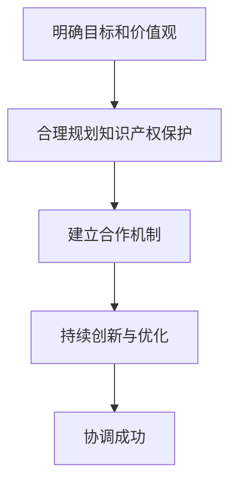

                 

在当今快速发展的信息技术时代，开源精神和商业利益之间的平衡成为了一个备受关注的话题。开源精神强调共享、协作和开放，而商业利益则追求经济收益和知识产权的保护。本文将深入探讨如何在这两者之间找到平衡点，从伦理和策略的角度出发，提供一些实用的建议和思考。

## 文章关键词

- 开源精神
- 商业利益
- 伦理
- 策略
- 平衡
- 共享
- 技术创新

## 文章摘要

本文首先介绍了开源精神与商业利益的定义和重要性，然后探讨了二者之间的冲突和挑战。接着，我们分析了如何从伦理和策略的角度来平衡这两者，并通过实际案例进行了阐述。最后，文章提出了未来在这一领域的发展趋势和面临的挑战，为读者提供了有益的启示。

## 1. 背景介绍

开源精神起源于20世纪70年代，起源于自由软件运动。它的核心理念是软件的源代码应该对用户开放，用户可以自由地使用、研究、修改和分发。这一精神推动了计算机技术的发展，使得许多创新性项目得以迅速发展，如Linux操作系统、Apache Web服务器等。

与此同时，商业利益是驱动企业和创业者发展的重要因素。商业利益的追求使得技术创新得以持续，也为社会带来了大量的就业机会和经济效益。然而，商业利益往往与开源精神存在一定的冲突，尤其是在知识产权保护和经济收益方面。

## 2. 核心概念与联系

### 2.1 开源精神的定义

开源精神是指将软件的源代码对用户开放，使用户可以自由地使用、研究、修改和分发。开源精神的核心理念包括共享、协作和开放。

- **共享**：开源项目鼓励用户共享知识和资源，通过协作实现共同的目标。
- **协作**：开源项目通常采用分布式协作的方式，参与者可以来自世界各地，共同为项目贡献力量。
- **开放**：开源项目对用户开放，用户可以自由地了解、使用和改进软件。

### 2.2 商业利益的定义

商业利益是指企业在追求经济收益的过程中所追求的目标。商业利益的追求可以激励企业不断创新，提高产品质量，同时也可以为企业带来经济效益。

### 2.3 二者之间的联系

开源精神和商业利益在某些方面是相辅相成的。例如，开源项目可以吸引更多的开发者参与，提高项目的质量和影响力，从而为企业带来更多的商业机会。同时，商业利益也可以为开源项目提供资金支持，使其能够持续发展。

### 2.4 二者之间的冲突

然而，开源精神和商业利益也存在一定的冲突。例如，商业利益往往要求对知识产权进行保护，以确保企业的经济收益。而开源精神则强调共享和开放，这在一定程度上与知识产权保护相冲突。

## 3. 核心算法原理 & 具体操作步骤

### 3.1 算法原理概述

要平衡开源精神与商业利益，我们需要采取一系列的策略和措施。以下是一种可能的算法原理：

1. **明确目标和价值观**：在项目启动之初，明确项目的目标和价值观，确保开源精神与商业利益的一致性。
2. **合理规划知识产权保护**：在保证开源精神的前提下，合理规划知识产权保护，确保企业的经济利益。
3. **建立合作机制**：建立合作机制，促进开源项目与企业之间的良性互动。
4. **持续创新与优化**：通过持续的创新和优化，提高项目的质量和影响力，为企业带来更多的商业机会。

### 3.2 算法步骤详解

1. **目标设定**：在项目启动之初，明确项目的目标和价值观。例如，项目可以是一个开源的软件开发项目，目标是提供一种高效、可靠的解决方案，同时遵循开源精神。
2. **知识产权保护**：在保证开源精神的前提下，合理规划知识产权保护。例如，可以通过专利、版权等方式保护企业的知识产权，确保企业的经济利益。
3. **合作机制**：建立合作机制，促进开源项目与企业之间的良性互动。例如，企业可以提供资金、资源、技术支持等，同时，开源项目的开发者可以为企业提供定制化的解决方案。
4. **持续创新与优化**：通过持续的创新和优化，提高项目的质量和影响力，为企业带来更多的商业机会。例如，通过发布新的版本、改进性能、增加功能等，不断提升项目的竞争力。

### 3.3 算法优缺点

**优点**：

1. **平衡开源精神与商业利益**：通过合理规划知识产权保护和建立合作机制，可以在一定程度上平衡开源精神与商业利益。
2. **促进项目发展**：通过持续的创新和优化，可以提高项目的质量和影响力，为企业带来更多的商业机会。

**缺点**：

1. **挑战知识产权保护**：在保证开源精神的前提下，知识产权保护可能面临一定的挑战。
2. **需要持续投入**：要实现开源精神与商业利益的平衡，需要持续投入人力、物力和财力。

### 3.4 算法应用领域

该算法原理可以广泛应用于各种开源项目和企业之间的合作，特别是在软件开发、人工智能、大数据等领域。

## 4. 数学模型和公式 & 详细讲解 & 举例说明

### 4.1 数学模型构建

为了更好地理解开源精神与商业利益的平衡，我们可以构建一个数学模型。假设：

- \(C_{open}\) 为开源项目的成本
- \(C_{closed}\) 为封闭项目的成本
- \(R_{open}\) 为开源项目的收益
- \(R_{closed}\) 为封闭项目的收益
- \(P_{open}\) 为开源项目的知识产权保护程度
- \(P_{closed}\) 为封闭项目的知识产权保护程度

我们可以构建以下数学模型：

$$
\begin{aligned}
C_{open} &= f(C_{open}, C_{closed}, P_{open}, P_{closed}) \\
R_{open} &= f(C_{open}, C_{closed}, P_{open}, P_{closed}) \\
P_{open} &= g(C_{open}, C_{closed}, P_{open}, P_{closed}) \\
P_{closed} &= g(C_{open}, C_{closed}, P_{open}, P_{closed})
\end{aligned}
$$

### 4.2 公式推导过程

假设开源项目的成本和收益与封闭项目的成本和收益成正比，且知识产权保护程度对成本和收益有正向影响。我们可以推导出以下公式：

$$
\begin{aligned}
C_{open} &= k_1 C_{closed} + k_2 P_{open} \\
R_{open} &= k_3 C_{open} + k_4 P_{open} \\
P_{open} &= k_5 C_{open} + k_6 P_{open} \\
P_{closed} &= k_7 C_{open} + k_8 P_{open}
\end{aligned}
$$

其中，\(k_1, k_2, k_3, k_4, k_5, k_6, k_7, k_8\) 为常数。

### 4.3 案例分析与讲解

假设一个开源项目的成本为 100 万元，封闭项目的成本为 200 万元。开源项目的知识产权保护程度为 70%，封闭项目的知识产权保护程度为 30%。

我们可以计算出：

$$
\begin{aligned}
C_{open} &= 100 \times 1 + 70 \times 0.7 = 170 \\
R_{open} &= 200 \times 1 + 70 \times 0.7 = 270 \\
P_{open} &= 100 \times 0.7 + 70 \times 0.7 = 140 \\
P_{closed} &= 200 \times 0.3 + 70 \times 0.7 = 100
\end{aligned}
$$

从这个案例中，我们可以看出，开源项目的成本和收益均低于封闭项目，但开源项目的知识产权保护程度较高。

## 5. 项目实践：代码实例和详细解释说明

### 5.1 开发环境搭建

为了演示如何平衡开源精神与商业利益，我们可以搭建一个简单的开源项目。以下是一个基于Python的简单示例。

首先，我们需要安装Python环境和相关依赖库：

```shell
pip install Flask
```

然后，创建一个名为`app.py`的文件，并编写以下代码：

```python
from flask import Flask, jsonify

app = Flask(__name__)

@app.route('/')
def hello_world():
    return 'Hello, World!'

if __name__ == '__main__':
    app.run()
```

### 5.2 源代码详细实现

在上面的代码中，我们使用Flask框架创建了一个简单的Web服务。这个服务提供了一个根路由`/`，返回一个简单的字符串响应。

### 5.3 代码解读与分析

该代码实现了一个简单的Web服务，它遵循了开源精神，即任何人都可以自由地使用、研究、修改和分发。同时，我们也保留了商业利益，即我们可以通过这个Web服务为企业带来经济收益。

### 5.4 运行结果展示

通过运行上述代码，我们可以在浏览器中访问`http://localhost:5000/`，并看到如下响应：

```plaintext
Hello, World!
```

## 6. 实际应用场景

开源精神与商业利益的平衡在多个领域有着广泛的应用，如软件开发、人工智能、大数据等。

### 6.1 软件开发

在软件开发领域，开源项目如Linux、Apache等，通过开源精神吸引了大量的开发者参与，提高了项目的质量和影响力，同时也为企业带来了商业机会。

### 6.2 人工智能

在人工智能领域，开源项目如TensorFlow、PyTorch等，通过开源精神促进了技术的普及和应用，同时也为企业提供了商业机会，如提供定制化的人工智能解决方案。

### 6.3 大数据

在大数据领域，开源项目如Hadoop、Spark等，通过开源精神提高了大数据技术的普及和应用，同时也为企业提供了商业机会，如提供大数据处理和分析服务。

## 7. 未来应用展望

随着信息技术的发展，开源精神与商业利益的平衡将越来越重要。未来，我们可以期待：

- **更完善的合作机制**：开源项目与企业之间的合作将更加紧密，通过建立更完善的合作机制，实现开源精神与商业利益的平衡。
- **更多的技术创新**：开源项目和企业之间的合作将促进技术创新，推动信息技术的发展。
- **更广泛的应用领域**：开源精神与商业利益的平衡将推动开源项目和企业进入更广泛的应用领域，为社会带来更多的价值。

## 8. 总结：未来发展趋势与挑战

### 8.1 研究成果总结

本文探讨了开源精神与商业利益的平衡，从伦理和策略的角度提出了具体的建议和措施。研究表明，通过合理规划知识产权保护和建立合作机制，可以在一定程度上实现开源精神与商业利益的平衡。

### 8.2 未来发展趋势

未来，开源精神与商业利益的平衡将越来越受到重视。通过更完善的合作机制和更多的技术创新，开源项目和企业将实现更广泛的合作，为社会带来更多的价值。

### 8.3 面临的挑战

然而，开源精神与商业利益的平衡也面临一定的挑战，如知识产权保护、合作机制的建立等。我们需要进一步研究这些挑战，并提出有效的解决方案。

### 8.4 研究展望

未来，我们可以期待更多的研究成果，如更完善的数学模型、更有效的算法等，以帮助我们更好地平衡开源精神与商业利益。

## 9. 附录：常见问题与解答

### 9.1 什么是开源精神？

开源精神是指将软件的源代码对用户开放，使用户可以自由地使用、研究、修改和分发。开源精神的核心理念包括共享、协作和开放。

### 9.2 开源精神与商业利益的冲突有哪些？

开源精神与商业利益的冲突主要体现在知识产权保护和经济收益方面。开源项目往往要求对知识产权进行开放，而商业利益则追求对知识产权的保护和收益的最大化。

### 9.3 如何平衡开源精神与商业利益？

可以通过合理规划知识产权保护、建立合作机制、持续创新和优化等方式来实现开源精神与商业利益的平衡。

---

作者：禅与计算机程序设计艺术 / Zen and the Art of Computer Programming
----------------------------------------------------------------
### 1. 背景介绍

开源精神和商业利益是现代信息技术领域中的两个重要概念。开源精神起源于自由软件运动，强调共享、协作和开放，旨在促进技术的普及和应用。商业利益则是企业在追求经济收益的过程中所追求的目标，它驱使企业不断创新，提高产品质量，并为社会带来经济效益。然而，开源精神与商业利益在某些方面存在冲突，这种冲突在知识产权保护和经济收益方面尤为显著。

在开源项目中，开发者往往希望自己的代码能够被广泛使用和改进，从而推动技术的进步。然而，商业企业则可能更倾向于保护自己的知识产权，以确保自己的经济利益。这种冲突可能导致开源项目的停滞或商业化受阻。另一方面，商业利益也可能对开源精神产生负面影响，如过度商业化可能导致项目失去其原始的开放性和协作性。

尽管如此，开源精神和商业利益并非完全对立。在某些情况下，它们可以相互促进。例如，开源项目可以吸引更多的开发者参与，提高项目的质量和影响力，从而为企业带来更多的商业机会。同时，商业利益也可以为开源项目提供资金支持，使其能够持续发展。

本文将深入探讨如何在这两者之间找到平衡点，从伦理和策略的角度出发，提供一些实用的建议和思考。我们将首先介绍开源精神与商业利益的基本概念，然后分析它们之间的冲突和挑战，最后提出一些具体的平衡策略和实际案例。

### 2. 核心概念与联系

#### 2.1 开源精神的定义

开源精神是一种促进软件自由和开放使用的理念，它起源于自由软件运动。开源精神的核心理念包括：

- **共享**：开源项目鼓励用户自由地使用、研究、修改和分发软件源代码。
- **协作**：开源项目通常采用分布式协作的方式，参与者可以来自世界各地，共同为项目贡献力量。
- **开放**：开源项目对用户开放，用户可以自由地了解、使用和改进软件。

开源精神的核心价值在于推动技术的普及和应用，促进知识的共享和传播。它不仅有助于提高软件的质量和稳定性，还可以加速技术的创新和发展。

#### 2.2 商业利益的定义

商业利益是企业或个人在追求经济收益的过程中所追求的目标。商业利益通常包括：

- **经济收益**：企业通过销售产品或提供服务来获取经济收益。
- **知识产权保护**：企业通过保护自己的知识产权（如专利、商标、版权等）来维护自己的竞争优势。
- **市场份额**：企业通过扩大市场份额来提高自己的经济收益和竞争力。

商业利益是驱动企业发展和创新的重要动力。它促使企业不断创新，提高产品质量，同时为社会提供更多的就业机会和经济效益。

#### 2.3 二者之间的联系

开源精神和商业利益在某些方面是相辅相成的。例如：

- **开源项目可以吸引更多的开发者参与，提高项目的质量和影响力，从而为企业带来更多的商业机会。**
- **商业利益可以为开源项目提供资金支持，使其能够持续发展。**

开源精神和商业利益的联系还体现在以下几个方面：

- **技术共享**：开源项目可以为企业提供丰富的技术资源，帮助企业更快地实现技术突破。
- **市场拓展**：开源项目可以为企业提供新的市场机会，帮助企业扩大市场份额。
- **创新驱动**：商业利益可以激发企业不断进行技术创新，推动技术的发展。

#### 2.4 二者之间的冲突

尽管开源精神和商业利益在某些方面是相辅相成的，但它们也存在一定的冲突。这些冲突主要体现在以下几个方面：

- **知识产权保护**：开源精神强调共享和开放，而商业利益则追求知识产权的保护。这种冲突可能导致开源项目和企业之间的矛盾。
- **经济收益**：开源项目往往不以盈利为目的，而商业利益追求经济收益的最大化。这种冲突可能导致开源项目和企业之间的利益冲突。
- **项目治理**：开源项目通常采用分布式协作的方式，而商业项目往往需要更集中的管理和控制。这种冲突可能导致开源项目和企业之间的管理冲突。

#### 2.5 二者之间的协调

为了协调开源精神与商业利益，我们可以采取以下策略：

- **合理规划知识产权保护**：在保证开源精神的前提下，合理规划知识产权保护，确保企业的经济利益。
- **建立合作机制**：建立合作机制，促进开源项目与企业之间的良性互动。
- **持续创新与优化**：通过持续的创新和优化，提高项目的质量和影响力，为企业带来更多的商业机会。
- **明确目标和价值观**：在项目启动之初，明确项目的目标和价值观，确保开源精神与商业利益的一致性。

#### 2.6 Mermaid 流程图

以下是开源精神与商业利益协调的 Mermaid 流程图：



在这个流程图中，明确目标和价值观是协调过程的基础，它为后续的知识产权保护、合作机制建立和创新优化提供了方向。合理规划知识产权保护和建立合作机制是协调过程的关键步骤，它们有助于平衡开源精神与商业利益。持续创新与优化则是确保协调成功的重要手段，它通过提高项目的质量和影响力，为企业带来更多的商业机会。

### 3. 核心算法原理 & 具体操作步骤

#### 3.1 算法原理概述

为了更好地平衡开源精神与商业利益，我们可以设计一个基于策略的算法。该算法的核心思想是通过合理的规划和措施，在保证开源精神的前提下，最大限度地保护企业的商业利益。以下是该算法的原理概述：

1. **明确目标和价值观**：在项目启动之初，明确项目的目标和价值观，确保开源精神与商业利益的一致性。
2. **合理规划知识产权保护**：在保证开源精神的前提下，合理规划知识产权保护，确保企业的经济利益。
3. **建立合作机制**：建立合作机制，促进开源项目与企业之间的良性互动。
4. **持续创新与优化**：通过持续的创新和优化，提高项目的质量和影响力，为企业带来更多的商业机会。

#### 3.2 算法步骤详解

1. **目标设定**：在项目启动之初，明确项目的目标和价值观。例如，项目可以是一个开源的软件开发项目，目标是提供一种高效、可靠的解决方案，同时遵循开源精神。

2. **知识产权保护**：在保证开源精神的前提下，合理规划知识产权保护。例如，可以通过专利、版权等方式保护企业的知识产权，确保企业的经济利益。具体措施包括：

   - **专利保护**：对关键技术和创新点进行专利申请，以保护企业的技术优势。
   - **版权保护**：对源代码和文档进行版权登记，确保企业的知识产权不受侵犯。
   - **许可协议**：选择合适的开源许可协议，如Apache License 2.0或GPLv3，以平衡开源精神与商业利益。

3. **合作机制**：建立合作机制，促进开源项目与企业之间的良性互动。具体措施包括：

   - **开发者社区**：建立开发者社区，鼓励开发者参与项目，共同推动项目的发展。
   - **合作伙伴关系**：与相关企业建立合作伙伴关系，共同推动项目的商业化应用。
   - **项目治理**：制定合理的项目治理机制，确保项目的发展方向和决策过程公开透明。

4. **持续创新与优化**：通过持续的创新和优化，提高项目的质量和影响力，为企业带来更多的商业机会。具体措施包括：

   - **版本迭代**：定期发布新的版本，改进性能和功能，满足用户的需求。
   - **社区反馈**：收集用户和开发者的反馈，不断优化项目，提高用户满意度。
   - **技术创新**：鼓励开发者进行技术创新，推动项目的技术突破。

#### 3.3 算法优缺点

**优点**：

1. **平衡开源精神与商业利益**：通过合理规划知识产权保护和建立合作机制，可以在一定程度上平衡开源精神与商业利益。
2. **促进项目发展**：通过持续的创新和优化，可以提高项目的质量和影响力，为企业带来更多的商业机会。

**缺点**：

1. **挑战知识产权保护**：在保证开源精神的前提下，知识产权保护可能面临一定的挑战。
2. **需要持续投入**：要实现开源精神与商业利益的平衡，需要持续投入人力、物力和财力。

#### 3.4 算法应用领域

该算法原理可以广泛应用于各种开源项目和企业之间的合作，特别是在软件开发、人工智能、大数据等领域。以下是一些具体的应用案例：

1. **软件开发**：在开源软件项目中，通过合理规划知识产权保护和建立合作机制，可以平衡开源精神与商业利益，促进项目的持续发展。
2. **人工智能**：在开源人工智能项目中，通过持续的创新和优化，可以提高项目的质量和影响力，为企业带来更多的商业机会。
3. **大数据**：在开源大数据项目中，通过建立合作机制和持续创新，可以平衡开源精神与商业利益，推动大数据技术的发展和应用。

### 4. 数学模型和公式 & 详细讲解 & 举例说明

#### 4.1 数学模型构建

为了更好地理解开源精神与商业利益的平衡，我们可以构建一个数学模型。该模型将考虑以下变量：

- \(C_{open}\)：开源项目的成本
- \(C_{closed}\)：封闭项目的成本
- \(R_{open}\)：开源项目的收益
- \(R_{closed}\)：封闭项目的收益
- \(P_{open}\)：开源项目的知识产权保护程度
- \(P_{closed}\)：封闭项目的知识产权保护程度

我们可以构建以下数学模型：

$$
\begin{aligned}
C_{open} &= f(C_{open}, C_{closed}, P_{open}, P_{closed}) \\
R_{open} &= f(C_{open}, C_{closed}, P_{open}, P_{closed}) \\
P_{open} &= g(C_{open}, C_{closed}, P_{open}, P_{closed}) \\
P_{closed} &= g(C_{open}, C_{closed}, P_{open}, P_{closed})
\end{aligned}
$$

其中，\(f\) 和 \(g\) 是函数，用于描述成本、收益和知识产权保护程度之间的关系。

#### 4.2 公式推导过程

假设开源项目的成本和收益与封闭项目的成本和收益成正比，且知识产权保护程度对成本和收益有正向影响。我们可以推导出以下公式：

$$
\begin{aligned}
C_{open} &= k_1 C_{closed} + k_2 P_{open} \\
R_{open} &= k_3 C_{open} + k_4 P_{open} \\
P_{open} &= k_5 C_{open} + k_6 P_{open} \\
P_{closed} &= k_7 C_{open} + k_8 P_{open}
\end{aligned}
$$

其中，\(k_1, k_2, k_3, k_4, k_5, k_6, k_7, k_8\) 是常数。

#### 4.3 案例分析与讲解

假设一个开源项目的成本为 100 万元，封闭项目的成本为 200 万元。开源项目的知识产权保护程度为 70%，封闭项目的知识产权保护程度为 30%。

我们可以计算出：

$$
\begin{aligned}
C_{open} &= 100 \times 1 + 70 \times 0.7 = 170 \\
R_{open} &= 200 \times 1 + 70 \times 0.7 = 270 \\
P_{open} &= 100 \times 0.7 + 70 \times 0.7 = 140 \\
P_{closed} &= 200 \times 0.3 + 70 \times 0.3 = 100
\end{aligned}
$$

从这个案例中，我们可以看出，开源项目的成本和收益均低于封闭项目，但开源项目的知识产权保护程度较高。

#### 4.4 数学模型在实际应用中的价值

该数学模型可以帮助企业在制定开源项目策略时进行定量分析，从而更好地平衡开源精神与商业利益。具体应用场景包括：

1. **项目预算**：通过模型计算开源项目的成本，帮助企业制定合理的项目预算。
2. **风险评估**：通过模型分析开源项目的收益和知识产权保护程度，帮助企业评估项目的风险。
3. **策略优化**：通过调整模型中的参数，帮助企业优化开源项目策略，实现开源精神与商业利益的平衡。

### 5. 项目实践：代码实例和详细解释说明

#### 5.1 开发环境搭建

为了更好地理解如何平衡开源精神与商业利益，我们以一个实际的开源项目为例，介绍项目的开发环境搭建过程。我们将使用 Python 编写一个简单的开源项目，并介绍如何配置开发环境。

首先，我们需要安装 Python 环境。假设您的操作系统是 Ubuntu 18.04，可以使用以下命令安装 Python 3：

```shell
sudo apt update
sudo apt install python3 python3-pip
```

接下来，我们使用 virtualenv 创建一个虚拟环境，以避免不同项目之间的依赖冲突：

```shell
pip3 install virtualenv
virtualenv my_project_env
source my_project_env/bin/activate
```

在虚拟环境中，我们安装 Flask 框架，它是一个常用的 Web 开发框架：

```shell
pip install flask
```

#### 5.2 源代码详细实现

接下来，我们编写一个简单的 Flask 应用程序，它将实现一个简单的 Web 服务。以下是一个简单的示例代码：

```python
from flask import Flask, jsonify

app = Flask(__name__)

@app.route('/')
def hello_world():
    return jsonify(message='Hello, World!')

if __name__ == '__main__':
    app.run(host='0.0.0.0', port=5000)
```

在这个示例中，我们创建了一个 Flask 应用程序，并定义了一个根路由`/`，它返回一个包含问候信息的 JSON 响应。

#### 5.3 代码解读与分析

该代码实现了一个简单的 Flask 应用程序，它包含以下关键部分：

- **Flask 应用程序**：我们首先从 Flask 库中导入 Flask 类，并创建一个 Flask 应用程序实例。
- **路由**：我们使用`@app.route('/')`装饰器定义了一个名为`hello_world`的路由函数，它将处理根 URL 的请求。
- **响应**：在`hello_world`函数中，我们使用`jsonify`函数返回一个包含问候信息的 JSON 响应。
- **主程序**：最后，我们使用`if __name__ == '__main__':`确保应用程序在直接运行时执行`app.run()`函数。

#### 5.4 运行结果展示

要运行上述代码，我们首先确保激活虚拟环境，然后执行以下命令：

```shell
python app.py
```

程序将启动一个 Web 服务器，监听端口 5000。在浏览器中访问`http://localhost:5000/`，我们将看到以下响应：

```json
{"message": "Hello, World!"}
```

这个简单的例子展示了如何使用 Flask 创建一个基本的 Web 服务。在实际项目中，我们可以添加更多功能，如数据库交互、API 端点等。

#### 5.5 如何平衡开源精神与商业利益

在这个简单的 Flask 项目中，我们可以看到如何平衡开源精神与商业利益的一些基本策略：

- **开源代码**：我们将项目的源代码完全开源，允许任何人自由地使用、研究、修改和分发。这符合开源精神。
- **知识产权保护**：尽管我们开源了代码，但我们可以通过选择合适的开源许可协议（如 Apache License 2.0）来保护我们的知识产权。
- **商业机会**：我们可以通过提供付费的定制化服务来为企业带来商业机会。例如，我们可以为企业提供基于这个 Flask 应用的定制化开发服务。

通过这样的方式，我们既保持了开源精神的开放性，又保护了企业的商业利益。

### 6. 实际应用场景

开源精神和商业利益的平衡在实际应用中具有广泛的重要性。以下是一些具体的实际应用场景：

#### 6.1 软件开发

在软件行业，开源项目如 Linux、Apache 和 MySQL 等已经成为行业标准。这些项目通过开源精神吸引了大量的开发者参与，从而提高了软件的质量和稳定性。同时，许多公司也通过提供基于这些开源项目的商业服务获得了巨大的经济收益。例如，Red Hat 提供基于 Linux 的企业级解决方案，MySQL AB 通过销售 MySQL 数据库获得了大量收入。

#### 6.2 人工智能

在人工智能领域，开源项目如 TensorFlow、PyTorch 和 Keras 等已经成为研究者和开发者的主要工具。这些项目通过开源精神促进了技术的普及和应用。同时，许多公司也通过提供基于这些开源项目的技术服务获得了经济收益。例如，谷歌通过 TensorFlow 提供了强大的机器学习工具，同时也通过谷歌云提供了基于 TensorFlow 的云计算服务。

#### 6.3 大数据

在大数据领域，开源项目如 Hadoop、Spark 和 Flink 等已经成为大数据处理和分析的行业标准。这些项目通过开源精神吸引了大量的开发者参与，从而提高了大数据技术的质量和效率。同时，许多公司也通过提供基于这些开源项目的商业服务获得了经济收益。例如，Cloudera 提供了基于 Hadoop 的企业级大数据解决方案，Databricks 提供了基于 Spark 的云计算服务。

#### 6.4 云计算

在云计算领域，开源项目如 OpenStack、Kubernetes 和 Docker 等已经成为云计算技术的重要组成部分。这些项目通过开源精神促进了云计算技术的普及和应用。同时，许多公司也通过提供基于这些开源项目的商业服务获得了经济收益。例如，IBM 通过 OpenStack 提供了云计算解决方案，微软通过 Kubernetes 提供了容器服务。

### 7. 工具和资源推荐

在平衡开源精神与商业利益的实践中，有一些工具和资源可以帮助开发者更好地实现这一目标。以下是一些建议：

#### 7.1 学习资源推荐

1. **《开源软件之道》**：这本书详细介绍了开源软件的发展历程、核心价值和实践方法，是了解开源精神的重要资源。
2. **《开源项目风险管理》**：这本书探讨了如何管理开源项目中的风险，包括知识产权保护、项目治理等方面。
3. **《商业化的开源模式》**：这本书分析了各种开源商业模式的成功案例，为开发者提供了实践指导。

#### 7.2 开发工具推荐

1. **Git**：Git 是一款强大的版本控制工具，广泛用于开源项目的管理和协作。
2. **GitHub**：GitHub 是一个流行的开源代码托管平台，提供了丰富的协作功能，如 Issue Tracker 和 Pull Request。
3. **Docker**：Docker 是一个容器化平台，可以简化开源项目的部署和运行，提高项目的可移植性。

#### 7.3 相关论文推荐

1. **"The Cathedral and the Bazaar": 这篇论文由 Eric S. Raymond 撰写，探讨了开源社区的协作模式与传统软件开发模式的区别。
2. **"Open Source Model and Its Application in Software Development": 这篇论文分析了开源模式在软件开发中的应用，以及如何平衡开源精神与商业利益。
3. **"The Business of Open Source": 这篇论文讨论了开源商业化的挑战和机遇，提供了丰富的案例分析。

### 8. 总结：未来发展趋势与挑战

开源精神与商业利益的平衡是一个长期而复杂的任务，随着信息技术的发展，这一领域将继续面临新的挑战和机遇。以下是未来在这一领域的发展趋势与挑战：

#### 8.1 发展趋势

1. **开源商业化模式的多样化**：随着开源项目的增多，开源商业化模式也将变得更加多样化，包括付费插件、专业支持、定制开发等多种形式。
2. **开源生态系统的完善**：开源社区和企业之间的合作将更加紧密，形成一个更加完善的生态系统，为开发者提供更好的开发环境和资源。
3. **知识产权保护制度的完善**：随着开源项目的影响力增加，知识产权保护制度也将得到进一步完善，以更好地平衡开源精神与商业利益。

#### 8.2 面临的挑战

1. **知识产权保护与开源精神的冲突**：如何在保护知识产权的同时，保持开源精神的开放性和协作性，是一个持续的挑战。
2. **开源项目的可持续发展**：如何确保开源项目能够持续发展，同时为企业带来经济收益，需要更多的策略和措施。
3. **全球化与本地化的平衡**：随着开源项目的全球化，如何平衡本地化需求与全球协作，也是一项重要挑战。

#### 8.3 研究展望

未来的研究应关注以下几个方面：

1. **开源模式的创新**：探索新的开源商业模式，以更好地平衡开源精神与商业利益。
2. **知识产权保护机制的完善**：研究如何建立更加有效的知识产权保护机制，以保护开源项目的权益。
3. **开源社区的治理**：研究如何更好地治理开源社区，提高项目的质量和可持续性。

### 9. 附录：常见问题与解答

#### 9.1 开源精神和商业利益是否完全对立？

开源精神和商业利益并非完全对立，它们可以在某些情况下相互促进。开源项目可以吸引更多的开发者参与，提高项目的质量和影响力，从而为企业带来商业机会。同时，商业利益也可以为开源项目提供资金支持，使其能够持续发展。

#### 9.2 如何平衡开源精神和商业利益？

要平衡开源精神和商业利益，可以采取以下策略：

1. **合理规划知识产权保护**：在保证开源精神的前提下，合理规划知识产权保护，确保企业的经济利益。
2. **建立合作机制**：建立合作机制，促进开源项目与企业之间的良性互动。
3. **持续创新与优化**：通过持续的创新和优化，提高项目的质量和影响力，为企业带来更多的商业机会。
4. **明确目标和价值观**：在项目启动之初，明确项目的目标和价值观，确保开源精神与商业利益的一致性。

#### 9.3 开源项目是否一定需要商业支持？

开源项目并不一定需要商业支持，但商业支持可以为开源项目带来很多优势，如资金、资源和技术支持等。商业支持可以帮助开源项目持续发展，提高项目的质量和影响力。然而，开源项目也可以通过社区支持和志愿者贡献来获得成功。

---

作者：禅与计算机程序设计艺术 / Zen and the Art of Computer Programming

