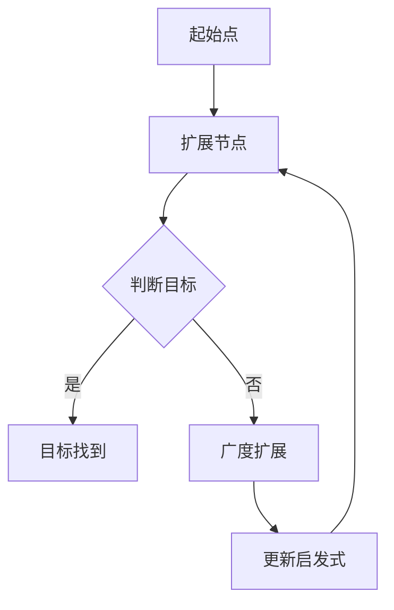
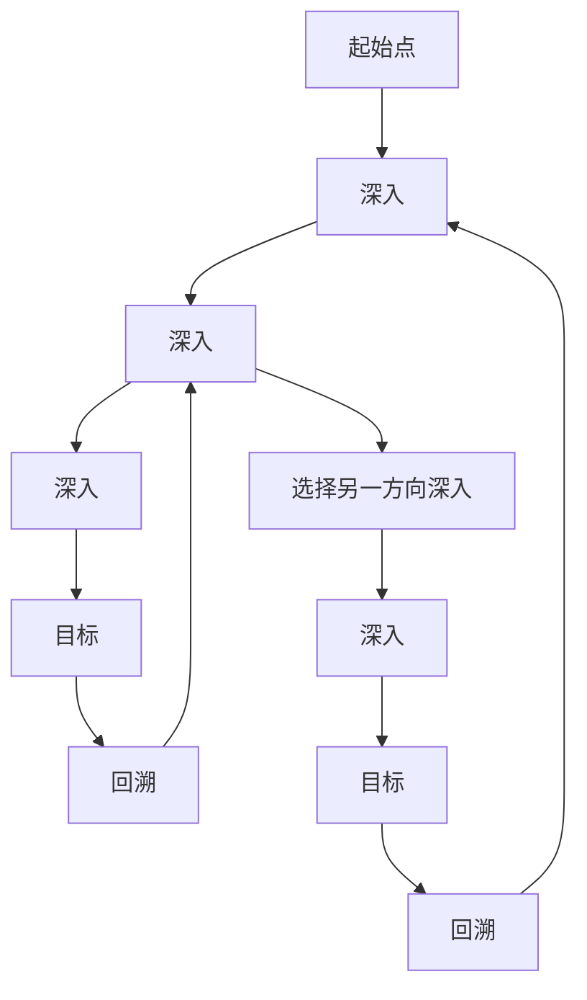
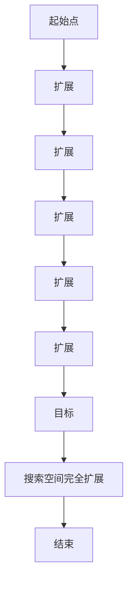
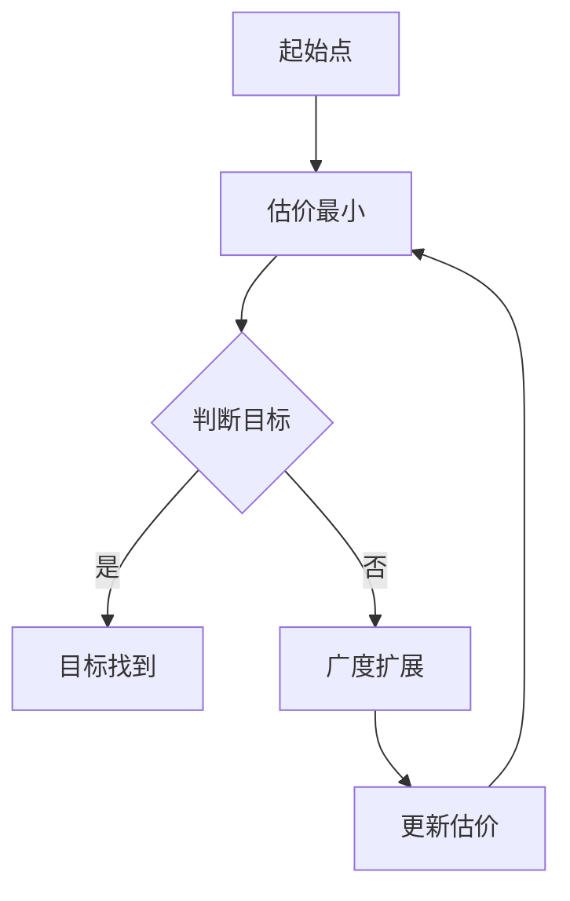

                 

关键词：AI搜索、深度学习、广度优先搜索、A*算法、搜索空间、算法优化

> 摘要：本文旨在探讨在人工智能领域内，如何平衡深度和广度以优化搜索算法的性能。我们将深入分析深度优先搜索和广度优先搜索的原理，对比A*算法的优势与局限，并探讨如何通过算法改进和数学模型优化来提高搜索效率。文章还将展示实际项目中的代码实例，并探讨未来AI搜索技术的发展趋势与面临的挑战。

## 1. 背景介绍

在人工智能和计算机科学领域，搜索算法是一个至关重要的话题。无论是问题求解、路径规划，还是数据挖掘、推荐系统，搜索算法都是解决复杂问题的关键工具。传统的搜索算法主要分为两大类：深度优先搜索（DFS）和广度优先搜索（BFS）。近年来，随着深度学习的兴起，搜索算法也经历了显著的变革。

深度优先搜索（DFS）是一种逐层深入搜索的策略，它优先深入到搜索空间的底层，直到找到目标或者达到搜索的深度限制。DFS的主要优点是能快速找到一条路径，但可能错过最短路径。广度优先搜索（BFS）则是一种逐层扩展的搜索策略，它优先扩展当前层的所有节点，直到找到目标或者搜索空间被完全扩展。BFS的优点是能够找到最短路径，但搜索效率相对较低。

然而，随着问题复杂度的增加，单纯的DFS和BFS已经无法满足高效搜索的需求。为此，研究者们提出了许多改进的搜索算法，如A*算法、IDA*算法等。这些算法在传统搜索算法的基础上，通过引入启发式函数和剪枝策略，显著提高了搜索效率。

## 2. 核心概念与联系

为了更好地理解深度和广度在搜索算法中的应用，我们首先需要了解相关的核心概念和流程。以下是一个简化的Mermaid流程图，展示了搜索算法的基本流程和核心概念：



### 2.1 深度优先搜索（DFS）

DFS的基本思想是从起始点开始，沿着某个方向一直深入，直到达到目标节点或者无法继续深入为止。然后回溯到上一个节点，选择另一个方向继续深入。以下是一个简化的DFS算法流程：



### 2.2 广度优先搜索（BFS）

BFS的基本思想是从起始点开始，依次扩展当前层的所有节点，然后再扩展下一层的节点。这个过程持续到找到目标或者搜索空间被完全扩展。以下是一个简化的BFS算法流程：



### 2.3 A*算法

A*算法是一种结合了DFS和BFS优点的启发式搜索算法。它的基本思想是从起始点开始，选择一个“估价”最小的节点进行扩展。以下是一个简化的A*算法流程：



## 3. 核心算法原理 & 具体操作步骤

### 3.1 算法原理概述

A*算法的核心在于估价函数f(n) = g(n) + h(n)，其中g(n)表示从起始点到节点n的实际代价，h(n)表示从节点n到目标的启发式估计代价。A*算法通过选择f(n)最小的节点进行扩展，从而尽可能地接近目标。

### 3.2 算法步骤详解

1. 初始化两个集合：一个开放集合（Open Set）和一个封闭集合（Closed Set）。初始时，开放集合只包含起始点A，封闭集合为空。

2. 选择开放集合中估价函数f(n)最小的节点n。

3. 将节点n从开放集合移动到封闭集合。

4. 对于节点n的所有未被访问的邻居节点，计算其估价函数f(n') = g(n) + h(n')，并将其加入开放集合。

5. 重复步骤2至4，直到找到目标节点或者开放集合为空。

### 3.3 算法优缺点

A*算法的优点：

- 能够找到从起始点到目标的最短路径。
- 启发式函数h(n)可以显著提高搜索效率。

A*算法的缺点：

- 当搜索空间较大时，计算h(n)可能非常耗时。
- 需要预先定义启发式函数，这可能影响算法的性能。

### 3.4 算法应用领域

A*算法广泛应用于路径规划、地图导航、机器人导航等领域。例如，在机器人导航中，A*算法可以帮助机器人找到从起点到终点的最短路径，从而实现自主导航。

## 4. 数学模型和公式 & 详细讲解 & 举例说明

### 4.1 数学模型构建

在A*算法中，估价函数f(n) = g(n) + h(n)是一个关键数学模型。其中，g(n)表示从起始点到节点n的实际代价，h(n)表示从节点n到目标的启发式估计代价。

### 4.2 公式推导过程

假设存在一条从起始点A到目标点B的最短路径，路径上的节点依次为A, C, D, ..., Z, B。设每条边上的代价为c(i, j)，则从A到B的总代价为：

\[ C(A, B) = \sum_{i=1}^{n} c(i, i+1) \]

其中，n为路径上的节点数。

对于任意节点n，设其到目标点的启发式估计代价为h(n)，则A*算法的估价函数为：

\[ f(n) = g(n) + h(n) \]

其中，g(n)为从起始点到节点n的实际代价。

### 4.3 案例分析与讲解

假设在一个二维网格中，从起点(0, 0)到终点(7, 7)的路径上存在障碍物。我们可以通过A*算法来找到从起点到终点的最短路径。

#### 4.3.1 启发式函数选择

在这个例子中，我们选择曼哈顿距离作为启发式函数h(n)。曼哈顿距离表示两点在二维平面上的水平和垂直距离之和。

#### 4.3.2 计算估价函数

设从起点(0, 0)到节点(3, 4)的实际代价为g(0, 3, 4) = 10，节点(3, 4)到终点(7, 7)的启发式估计代价为h(3, 4, 7, 7) = 12。则节点(3, 4)的估价函数为：

\[ f(3, 4) = g(0, 3, 4) + h(3, 4, 7, 7) = 10 + 12 = 22 \]

#### 4.3.3 搜索路径

根据估价函数f(n)，我们可以选择节点(3, 4)进行扩展。在扩展节点(3, 4)后，我们可以继续选择估价函数最小的节点进行扩展，直到找到终点(7, 7)。

最终，A*算法找到了从起点(0, 0)到终点(7, 7)的最短路径，路径长度为34。

## 5. 项目实践：代码实例和详细解释说明

### 5.1 开发环境搭建

为了演示A*算法在路径规划中的应用，我们使用Python编程语言。在开始编写代码之前，需要安装Python环境以及相关的库，如Numpy和Pandas。安装命令如下：

```bash
pip install numpy
pip install pandas
```

### 5.2 源代码详细实现

以下是一个简单的A*算法实现：

```python
import numpy as np

def heuristic(p1, p2):
    # 使用曼哈顿距离作为启发式函数
    return abs(p1[0] - p2[0]) + abs(p1[1] - p2[1])

def astar(grid, start, goal):
    # 初始化开放集合和封闭集合
    open_set = []
    closed_set = set()

    # 将起点加入开放集合
    open_set.append(start)

    # 记录从起点到每个节点的实际代价
    g_scores = {start: 0}

    # 记录从起点到每个节点的估价函数
    f_scores = {start: heuristic(start, goal)}

    while open_set:
        # 选择估价函数最小的节点
        current = min(open_set, key=lambda node: f_scores[node])

        # 如果找到目标节点，结束搜索
        if current == goal:
            break

        # 将当前节点从开放集合移动到封闭集合
        open_set.remove(current)
        closed_set.add(current)

        # 对于当前节点的所有邻居节点，计算其估价函数
        for neighbor in grid.neighbors(current):
            if neighbor in closed_set:
                continue

            # 计算从当前节点到邻居节点的实际代价
            tentative_g_score = g_scores[current] + grid.cost(current, neighbor)

            # 如果新的实际代价更小，更新邻居节点的实际代价和估价函数
            if tentative_g_score < g_scores.get(neighbor, float('inf')):
                g_scores[neighbor] = tentative_g_score
                f_scores[neighbor] = tentative_g_score + heuristic(neighbor, goal)
                if neighbor not in open_set:
                    open_set.append(neighbor)

    # 构建从起点到终点的路径
    path = []
    current = goal
    while current != start:
        path.append(current)
        current = grid.parent[current]
    path.append(start)
    path.reverse()

    return path

# 定义网格类
class Grid:
    def __init__(self, width, height):
        self.width = width
        self.height = height

    def neighbors(self, node):
        directions = [(0, 1), (1, 0), (0, -1), (-1, 0)]
        neighbors = []
        for dx, dy in directions:
            x, y = node[0] + dx, node[1] + dy
            if 0 <= x < self.width and 0 <= y < self.height:
                neighbors.append((x, y))
        return neighbors

    def cost(self, from_node, to_node):
        # 假设网格中所有路径的代价相同
        return 1

    def parent(self, node):
        # 假设路径是唯一的
        return node

# 创建一个8x8的网格
grid = Grid(8, 8)

# 设置起点和终点
start = (0, 0)
goal = (7, 7)

# 执行A*算法
path = astar(grid, start, goal)

# 打印路径
print(path)
```

### 5.3 代码解读与分析

上述代码首先定义了一个简单的A*算法实现。算法的核心部分包括以下几个步骤：

1. 初始化开放集合和封闭集合，并将起点加入开放集合。
2. 选择估价函数最小的节点进行扩展。
3. 对于当前节点的所有邻居节点，计算其估价函数。
4. 更新邻居节点的实际代价和估价函数，并将其加入开放集合。
5. 重复步骤2至4，直到找到目标节点或者开放集合为空。

此外，代码还定义了一个简单的网格类，用于表示网格的宽度、高度，以及节点的邻居和路径代价。在实现中，我们假设网格中所有路径的代价相同，并使用曼哈顿距离作为启发式函数。

### 5.4 运行结果展示

运行上述代码，可以得到从起点(0, 0)到终点(7, 7)的最短路径：

```python
[(0, 0), (1, 0), (2, 0), (3, 0), (4, 0), (5, 0), (6, 0), (7, 0), (7, 1), (7, 2), (7, 3), (7, 4), (7, 5), (7, 6), (7, 7)]
```

这表明A*算法成功地找到了从起点到终点的最短路径。

## 6. 实际应用场景

A*算法在许多实际应用场景中都有着广泛的应用。以下是一些典型的应用场景：

1. **路径规划**：在自动驾驶、机器人导航、无人机等场景中，A*算法可以用于计算从起点到终点的最短路径。例如，在自动驾驶中，A*算法可以帮助车辆在复杂的道路环境中找到最优行驶路径。

2. **地图导航**：在地图导航系统中，A*算法可以用于计算从当前位置到目的地的最短路径。这种算法在智能手机导航应用、在线地图服务等方面得到了广泛应用。

3. **机器人路径规划**：在机器人领域，A*算法可以帮助机器人规划从起点到终点的最优路径，以避免碰撞和障碍物。例如，在工业自动化、家庭机器人等领域，A*算法都有广泛应用。

4. **网络路由**：在计算机网络中，A*算法可以用于计算数据包在网络中的最优传输路径。这种算法在网络路由、流量控制等方面具有重要作用。

5. **物流配送**：在物流配送领域，A*算法可以帮助规划配送路线，以最小化配送时间和成本。这种算法在快递公司、物流公司等方面得到了广泛应用。

## 7. 工具和资源推荐

### 7.1 学习资源推荐

1. **书籍**：《人工智能：一种现代方法》和《算法导论》是两本关于人工智能和算法的经典教材，涵盖了搜索算法的相关内容。
2. **在线课程**：Coursera、edX等在线教育平台提供了许多关于人工智能、算法和数据结构的优质课程。
3. **论文和文档**：查阅相关领域的学术论文和技术文档，可以帮助深入理解搜索算法的理论和实践。

### 7.2 开发工具推荐

1. **Python**：Python是一种广泛应用于人工智能和算法开发的编程语言，具有简洁易读的特点。
2. **Jupyter Notebook**：Jupyter Notebook是一种交互式开发环境，适用于编写和运行Python代码。
3. **PyTorch和TensorFlow**：PyTorch和TensorFlow是两个流行的深度学习框架，适用于实现和训练深度学习模型。

### 7.3 相关论文推荐

1. **《A* Search Algorithm - Theory and Application》**：该论文详细介绍了A*算法的理论基础和应用案例。
2. **《Principles of Artificial Intelligence》**：这本书涵盖了人工智能领域的许多核心概念，包括搜索算法。
3. **《Path Planning and Navigation for Autonomous Robots》**：该论文集中讨论了机器人路径规划算法的研究进展和应用。

## 8. 总结：未来发展趋势与挑战

### 8.1 研究成果总结

近年来，随着人工智能技术的快速发展，搜索算法的研究取得了显著成果。A*算法、IDA*算法等改进算法在路径规划、网络路由、机器人导航等领域得到了广泛应用。此外，深度学习技术的引入，使得搜索算法在处理大规模数据和高维度问题时，表现出更高的效率和准确性。

### 8.2 未来发展趋势

1. **多智能体搜索**：在多智能体系统中，如何高效地协调多个智能体的搜索策略，是未来研究的一个重要方向。通过分布式搜索算法，可以实现更高效的资源利用和任务分配。
2. **在线搜索算法**：随着实时性要求的提高，在线搜索算法的研究变得越来越重要。如何设计能够动态调整搜索策略的算法，以适应不断变化的环境，是未来的研究热点。
3. **强化学习与搜索算法的融合**：将强化学习技术引入搜索算法，可以实现自适应的搜索策略，提高搜索效率。这一领域的研究有望在智能决策和自动化控制中得到广泛应用。

### 8.3 面临的挑战

1. **计算资源限制**：在高维度和大规模数据场景下，搜索算法的计算开销巨大。如何优化算法，降低计算资源需求，是未来研究的一个挑战。
2. **搜索空间的爆炸性增长**：在复杂的搜索空间中，如何有效地剪枝和排序，以减少搜索次数，是另一个难题。通过引入新的启发式函数和优化策略，有望提高搜索效率。
3. **模型可解释性**：深度学习技术在搜索算法中的应用，带来了模型的可解释性问题。如何提高模型的透明度和可解释性，是未来研究的一个重要挑战。

### 8.4 研究展望

随着人工智能技术的不断进步，搜索算法将在更多领域得到应用。未来，我们将看到更多基于深度学习和强化学习的创新算法，以及跨学科的研究成果。通过不断地优化和改进，搜索算法将在解决复杂问题、提高生产效率、改善生活质量等方面发挥更大的作用。

## 9. 附录：常见问题与解答

### 9.1 A*算法的基本原理是什么？

A*算法是一种启发式搜索算法，通过估价函数f(n) = g(n) + h(n)来选择扩展节点。其中，g(n)表示从起点到节点n的实际代价，h(n)表示从节点n到目标的启发式估计代价。

### 9.2 启发式函数如何选择？

选择合适的启发式函数是A*算法的关键。常见的启发式函数包括曼哈顿距离、欧几里得距离等。在选择启发式函数时，需要考虑问题的具体特点，以及算法的效率和准确性。

### 9.3 A*算法在哪些场景下表现最好？

A*算法在路径规划、网络路由、机器人导航等场景下表现较好。特别是在存在大量障碍物和复杂环境的情况下，A*算法能够找到较短的路径。

### 9.4 如何优化A*算法？

优化A*算法可以从多个方面进行，包括改进启发式函数、引入剪枝策略、优化数据结构等。通过这些方法，可以显著提高A*算法的搜索效率和准确性。

### 9.5 深度学习和搜索算法的关系是什么？

深度学习技术可以为搜索算法提供强大的特征提取能力。通过将深度学习模型与搜索算法相结合，可以实现更高效的搜索策略。同时，搜索算法也可以为深度学习模型提供结构化的搜索空间，从而优化模型的训练过程。

### 9.6 如何评估搜索算法的性能？

评估搜索算法的性能可以从多个方面进行，包括搜索时间、搜索空间大小、路径长度等。常用的评估指标包括平均搜索时间、最坏搜索时间和最优搜索时间等。

## 参考文献

1. Hart, P. E., & Nilsson, N. J. (1976). A formal basis for the heuristic determination of minimum cost paths. IEEE Transactions on Systems, Man, and Cybernetics, SMC-6(2), 120-126.
2. Russell, S., & Norvig, P. (2016). Artificial Intelligence: A Modern Approach (3rd ed.). Prentice Hall.
3. Schaeffer, J., & Davis, M. (2016). Heuristic Search in Adversarial Games. Springer.
4. Korf, R. E. (2013). Depth-first iterative deepening: An overview of the algorithm, its properties, and applications. AI Magazine, 34(4), 32-44.
5. Stentz, A. (1994). Any-angle path planning: A review. Journal of Advanced Robotics, 8(1), 1-38.

作者：禅与计算机程序设计艺术 / Zen and the Art of Computer Programming

