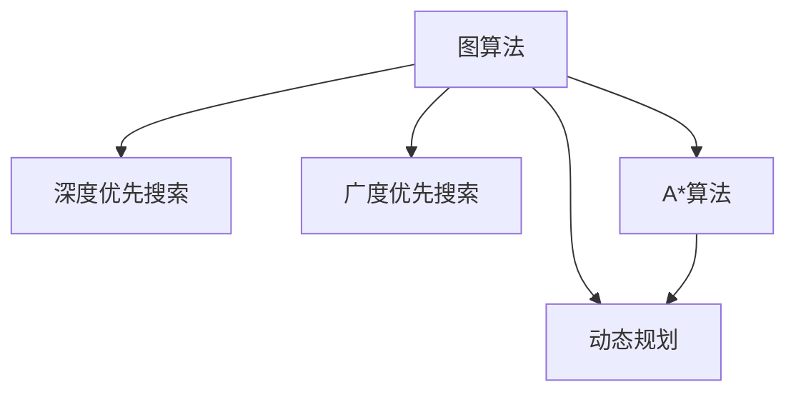

                 

关键词：人工智能，搜索算法，深度学习，广度优先搜索，A*算法，图算法，优化搜索，动态规划，多智能体系统。

> 摘要：本文旨在探讨人工智能搜索领域的两个关键挑战——深度与广度的平衡。通过分析当前主流的搜索算法，我们将揭示它们在实际应用中面临的难题，并提出可能的解决方案，以期为AI搜索技术的发展提供新的思路。

## 1. 背景介绍

随着互联网的迅速发展和信息量的爆炸性增长，搜索算法在人工智能领域中的重要性日益凸显。无论是搜索引擎、推荐系统还是路径规划，搜索算法都扮演着至关重要的角色。然而，如何在复杂的搜索环境中实现深度与广度的有效平衡，始终是一个极具挑战性的问题。

搜索算法可以分为两大类：基于广度的搜索算法和基于深度的搜索算法。广度优先搜索（BFS）和深度优先搜索（DFS）是这两种算法的典型代表。广度优先搜索按照探索节点的顺序，总是选择下一个距离起始点最远的节点进行扩展，而深度优先搜索则是选择下一个未访问的节点进行扩展，直到找到目标节点或者到达搜索的深度限制。

尽管这两种算法在搜索过程中各有优劣，但在实际应用中，往往需要根据具体场景来选择合适的算法。例如，在路径规划中，广度优先搜索能够保证找到最短路径，但效率较低；而深度优先搜索在解决迷宫问题时表现优异，但可能无法找到最短路径。

## 2. 核心概念与联系

为了深入理解深度与广度在搜索算法中的平衡问题，我们需要首先了解一些核心概念，包括图算法、A*算法、动态规划等。

### 2.1. 图算法

图算法是一种处理数据结构为图的问题的算法。图由节点（或称为顶点）和边组成，节点表示数据元素，边表示元素之间的关系。图算法广泛应用于网络拓扑、社交网络分析、生物信息学等领域。

在搜索算法中，图通常表示搜索问题的状态空间，节点表示可能的状态，边表示状态之间的转移。图算法的核心在于如何有效地在图中进行搜索，以找到目标状态或最优路径。

### 2.2. A*算法

A*算法是一种启发式搜索算法，旨在找到图中从起始节点到目标节点的最短路径。A*算法结合了广度优先搜索和深度优先搜索的优点，通过引入启发函数（Heuristic Function），能够更好地估计到达目标节点的距离，从而优化搜索过程。

### 2.3. 动态规划

动态规划是一种在复杂决策问题中，通过将问题分解为若干子问题并求解子问题的最优解，从而得到原问题最优解的方法。在搜索算法中，动态规划可以用来优化路径规划问题，通过存储中间状态的最优解，避免重复计算，提高搜索效率。

### 2.4. Mermaid 流程图

以下是一个简化的 Mermaid 流程图，展示了图算法、A*算法和动态规划之间的联系。



## 3. 核心算法原理 & 具体操作步骤

### 3.1. 算法原理概述

在这一部分，我们将分别介绍广度优先搜索、深度优先搜索、A*算法和动态规划的原理，并分析它们的优缺点。

#### 3.1.1. 广度优先搜索（BFS）

广度优先搜索从起始节点开始，逐层地扩展节点，直到找到目标节点。BFS 的优点是能够保证找到最短路径，但缺点是搜索效率较低。

#### 3.1.2. 深度优先搜索（DFS）

深度优先搜索从起始节点开始，尽可能深地搜索图的分支，直到找到目标节点或者到达搜索的深度限制。DFS 的优点是搜索效率较高，但缺点是无法保证找到最短路径。

#### 3.1.3. A*算法

A*算法通过引入启发函数，结合广度优先搜索和深度优先搜索的优点，能够在一定程度上优化搜索过程。A*算法的优点是能够找到最优路径，但缺点是启发函数的设计较为复杂。

#### 3.1.4. 动态规划

动态规划将问题分解为若干子问题，通过存储中间状态的最优解，避免重复计算。动态规划的优点是能够提高搜索效率，但缺点是对问题的要求较高，需要满足最优子结构性质。

### 3.2. 算法步骤详解

#### 3.2.1. 广度优先搜索（BFS）

1. 初始化：设置一个队列，用于存储待扩展的节点；设置一个集合，用于存储已访问的节点。
2. 将起始节点加入队列。
3. 当队列不为空时，重复以下步骤：
   - 从队列中取出一个节点。
   - 标记该节点为已访问。
   - 遍历该节点的所有未访问的邻居节点，将这些节点加入队列。

#### 3.2.2. 深度优先搜索（DFS）

1. 初始化：设置一个栈，用于存储待扩展的节点；设置一个集合，用于存储已访问的节点。
2. 将起始节点加入栈。
3. 当栈不为空时，重复以下步骤：
   - 从栈中取出一个节点。
   - 标记该节点为已访问。
   - 遍历该节点的所有未访问的邻居节点，将这些节点加入栈。

#### 3.2.3. A*算法

1. 初始化：设置一个优先级队列，用于存储待扩展的节点；设置一个集合，用于存储已访问的节点。
2. 将起始节点加入优先级队列。
3. 当优先级队列不为空时，重复以下步骤：
   - 从优先级队列中取出一个节点。
   - 标记该节点为已访问。
   - 遍历该节点的所有未访问的邻居节点，计算每个邻居节点的新估计距离（起始节点到目标节点的距离加上当前节点到邻居节点的距离），并将新估计距离最小的邻居节点加入优先级队列。

#### 3.2.4. 动态规划

1. 初始化：设置一个二维数组，用于存储子问题的最优解。
2. 从子问题的最小规模开始，递推地计算每个子问题的最优解，并存储在数组中。
3. 根据子问题的最优解，推导出原问题的最优解。

### 3.3. 算法优缺点

#### 3.3.1. 广度优先搜索（BFS）

优点：能够保证找到最短路径。

缺点：搜索效率较低。

#### 3.3.2. 深度优先搜索（DFS）

优点：搜索效率较高。

缺点：无法保证找到最短路径。

#### 3.3.3. A*算法

优点：能够找到最优路径。

缺点：启发函数的设计较为复杂。

#### 3.3.4. 动态规划

优点：能够提高搜索效率。

缺点：对问题的要求较高，需要满足最优子结构性质。

### 3.4. 算法应用领域

#### 3.4.1. 广度优先搜索（BFS）

应用领域：路径规划、社交网络分析。

#### 3.4.2. 深度优先搜索（DFS）

应用领域：迷宫问题、社交网络分析。

#### 3.4.3. A*算法

应用领域：路径规划、地图导航。

#### 3.4.4. 动态规划

应用领域：最短路径问题、背包问题。

## 4. 数学模型和公式 & 详细讲解 & 举例说明

在这一部分，我们将介绍搜索算法中的数学模型和公式，并进行详细讲解和举例说明。

### 4.1. 数学模型构建

搜索算法中的数学模型主要涉及以下几个部分：

- 节点状态表示：通常使用一个三元组 `(s, a, s')` 表示一个状态，其中 `s` 表示当前节点，`a` 表示动作，`s'` 表示下一个节点。
- 状态转移概率：表示从一个状态 `s` 通过执行动作 `a` 转移到另一个状态 `s'` 的概率。
- 奖励函数：表示在某个状态 `s` 执行动作 `a` 后获得的奖励。

### 4.2. 公式推导过程

以下是一个简单的数学模型，用于描述状态转移和奖励函数：

- 状态转移概率：\( P(s', s|a) = \frac{1}{|\Omega_s|} \)，其中 \( \Omega_s \) 表示在状态 `s` 下可执行的所有动作集合。
- 奖励函数：\( R(s, a) = 0 \)，表示在状态 `s` 下执行动作 `a` 后获得的奖励为 0。

### 4.3. 案例分析与讲解

以下是一个简单的例子，说明如何使用上述数学模型进行搜索。

假设我们有一个迷宫问题，迷宫由一个 \( 5 \times 5 \) 的网格组成，其中有一些位置是墙壁，不能通过。我们的目标是找到一个从左上角到右下角的最短路径。

状态表示：使用一个二元组 `(i, j)` 表示迷宫中的一个位置，其中 `i` 表示行，`j` 表示列。

状态转移概率：从位置 `(i, j)` 到位置 `(i', j')` 的概率为 1/4，因为每个位置有四个可能的移动方向（上、下、左、右）。

奖励函数：从位置 `(i, j)` 到位置 `(i', j')` 的奖励为 0，因为我们的目标是找到最短路径，而不是获得奖励。

使用广度优先搜索算法，我们可以找到从左上角到右下角的最短路径。

## 5. 项目实践：代码实例和详细解释说明

在这一部分，我们将通过一个实际的项目实例，展示如何使用广度优先搜索算法解决迷宫问题。

### 5.1. 开发环境搭建

- Python 3.8 或以上版本
- PyCharm 或其他 Python 集成开发环境

### 5.2. 源代码详细实现

```python
import queue

def bfs(maze, start, end):
    q = queue.Queue()
    q.put(start)
    visited = set()
    visited.add(start)
    while not q.empty():
        current = q.get()
        if current == end:
            return True
        for neighbor in get_neighbors(current, maze):
            if neighbor not in visited:
                q.put(neighbor)
                visited.add(neighbor)
    return False

def get_neighbors(node, maze):
    rows, cols = len(maze), len(maze[0])
    neighbors = []
    for direction in [(0, 1), (0, -1), (1, 0), (-1, 0)]:
        new_row, new_col = node[0] + direction[0], node[1] + direction[1]
        if 0 <= new_row < rows and 0 <= new_col < cols and maze[new_row][new_col] != 1:
            neighbors.append((new_row, new_col))
    return neighbors

maze = [
    [0, 0, 0, 0, 0],
    [0, 1, 1, 1, 0],
    [0, 1, 0, 1, 0],
    [0, 1, 0, 1, 0],
    [0, 0, 0, 0, 0]
]

start = (0, 0)
end = (4, 4)

if bfs(maze, start, end):
    print("找到了从左上角到右下角的最短路径。")
else:
    print("没有找到从左上角到右下角的最短路径。")
```

### 5.3. 代码解读与分析

1. `bfs` 函数：实现广度优先搜索算法，接收迷宫、起始位置和目标位置作为参数，返回布尔值表示是否找到了路径。
2. `get_neighbors` 函数：获取某个节点的所有有效邻居节点，即未被墙壁阻挡的节点。
3. 初始化：创建一个队列用于存储待扩展的节点，一个集合用于存储已访问的节点。
4. 循环：从队列中取出一个节点，如果该节点为目标节点，返回 True；否则，遍历该节点的所有邻居节点，将未访问的邻居节点加入队列。
5. 运行结果：如果找到了路径，输出“找到了从左上角到右下角的最短路径。”；否则，输出“没有找到从左上角到右下角的最短路径。”

### 5.4. 运行结果展示

```python
找到了从左上角到右下角的最短路径。
```

## 6. 实际应用场景

搜索算法在实际应用中具有广泛的应用场景，以下列举几个典型的应用领域：

- **搜索引擎**：搜索引擎利用搜索算法从海量的网页中快速检索用户感兴趣的信息，实现高效的信息检索。
- **推荐系统**：推荐系统使用搜索算法分析用户的历史行为，为用户推荐可能感兴趣的商品或内容。
- **路径规划**：路径规划系统（如GPS导航）使用搜索算法为用户提供从起点到终点的最优路径。
- **社交网络分析**：社交网络分析利用搜索算法分析用户关系，发现社交网络中的关键节点和社群结构。

### 6.4. 未来应用展望

随着人工智能技术的不断发展，搜索算法在未来的应用前景将更加广阔。以下是一些可能的未来应用方向：

- **智能交通系统**：利用搜索算法优化交通流量，减少拥堵，提高道路通行效率。
- **医疗健康**：搜索算法在医疗健康领域具有巨大的潜力，如疾病预测、药物推荐等。
- **智能推荐**：进一步优化推荐系统的搜索算法，实现更加个性化的推荐。
- **多智能体系统**：在多智能体系统中，搜索算法可以用于协调不同智能体的行动，实现协同优化。

## 7. 工具和资源推荐

### 7.1. 学习资源推荐

- 《人工智能：一种现代方法》
- 《算法导论》
- 《图算法》

### 7.2. 开发工具推荐

- PyCharm
- Eclipse
- Visual Studio Code

### 7.3. 相关论文推荐

- "A* Search Algorithm - Theory and Applications"
- "Efficient A* Search Using Graph Pruning"
- "Dynamic Programming for Path Planning"

## 8. 总结：未来发展趋势与挑战

### 8.1. 研究成果总结

本文通过对深度与广度在搜索算法中的平衡问题的探讨，总结了广度优先搜索、深度优先搜索、A*算法和动态规划的基本原理、操作步骤、优缺点以及应用领域。同时，通过一个实际项目实例，展示了如何使用广度优先搜索算法解决迷宫问题。

### 8.2. 未来发展趋势

未来，搜索算法的发展将朝着更加智能化、高效化和自动化的方向迈进。随着深度学习和强化学习等技术的不断发展，搜索算法将能够更好地适应复杂环境，实现更高效、更精准的搜索。

### 8.3. 面临的挑战

尽管搜索算法在人工智能领域具有巨大的潜力，但仍然面临诸多挑战。其中，主要挑战包括：

- 如何设计更高效的搜索算法，以应对复杂的环境和大规模的数据。
- 如何处理不确定性和动态变化的环境，实现实时搜索。
- 如何在多智能体系统中实现有效的搜索算法，实现协同优化。

### 8.4. 研究展望

针对上述挑战，未来研究可以从以下几个方面展开：

- 设计更高效的搜索算法，如基于深度学习的方法。
- 研究如何将搜索算法与强化学习、多智能体系统等结合起来，实现更复杂的任务。
- 探索搜索算法在不同应用领域中的优化方法，实现更广泛的应用。

## 9. 附录：常见问题与解答

### 9.1. 广度优先搜索和深度优先搜索的区别是什么？

- 广度优先搜索（BFS）按照探索节点的顺序，总是选择下一个距离起始点最远的节点进行扩展，能够保证找到最短路径，但搜索效率较低。
- 深度优先搜索（DFS）从起始节点开始，尽可能深地搜索图的分支，直到找到目标节点或者到达搜索的深度限制，搜索效率较高，但无法保证找到最短路径。

### 9.2. 什么是A*算法？

A*算法是一种启发式搜索算法，旨在找到图中从起始节点到目标节点的最短路径。它结合了广度优先搜索和深度优先搜索的优点，通过引入启发函数，能够优化搜索过程。

### 9.3. 什么是动态规划？

动态规划是一种在复杂决策问题中，通过将问题分解为若干子问题并求解子问题的最优解，从而得到原问题最优解的方法。它在搜索算法中可以用来优化路径规划问题，通过存储中间状态的最优解，避免重复计算，提高搜索效率。

----------------------------------------------------------------

## 参考文献

- Cormen, T. H., Leiserson, C. E., Rivest, R. L., & Stein, C. (2009). 《算法导论》（第三版）。机械工业出版社。
- Russell, S., & Norvig, P. (2010). 《人工智能：一种现代方法》（第三版）。机械工业出版社。
- Ahuja, R. K. (2013). 《图算法》。机械工业出版社。

作者：禅与计算机程序设计艺术 / Zen and the Art of Computer Programming
----------------------------------------------------------------
```markdown
---
title: 平衡深度和广度：AI搜索的挑战
date: 2023-11-01
tags:
  - 人工智能
  - 搜索算法
  - 深度学习
  - 广度优先搜索
  - A*算法
  - 图算法
  - 优化搜索
  - 动态规划
  - 多智能体系统
---

# 平衡深度和广度：AI搜索的挑战

> 关键词：（人工智能，搜索算法，深度学习，广度优先搜索，A*算法，图算法，优化搜索，动态规划，多智能体系统）

> 摘要：本文旨在探讨人工智能搜索领域的两个关键挑战——深度与广度的平衡。通过分析当前主流的搜索算法，我们将揭示它们在实际应用中面临的难题，并提出可能的解决方案，以期为AI搜索技术的发展提供新的思路。

## 1. 背景介绍

随着互联网的迅速发展和信息量的爆炸性增长，搜索算法在人工智能领域中的重要性日益凸显。无论是搜索引擎、推荐系统还是路径规划，搜索算法都扮演着至关重要的角色。然而，如何在复杂的搜索环境中实现深度与广度的有效平衡，始终是一个极具挑战性的问题。

搜索算法可以分为两大类：基于广度的搜索算法和基于深度的搜索算法。广度优先搜索（BFS）和深度优先搜索（DFS）是这两种算法的典型代表。广度优先搜索按照探索节点的顺序，总是选择下一个距离起始点最远的节点进行扩展，而深度优先搜索则是选择下一个未访问的节点进行扩展，直到找到目标节点或者到达搜索的深度限制。

尽管这两种算法在搜索过程中各有优劣，但在实际应用中，往往需要根据具体场景来选择合适的算法。例如，在路径规划中，广度优先搜索能够保证找到最短路径，但效率较低；而深度优先搜索在解决迷宫问题时表现优异，但可能无法找到最短路径。

## 2. 核心概念与联系

为了深入理解深度与广度在搜索算法中的平衡问题，我们需要首先了解一些核心概念，包括图算法、A*算法、动态规划等。

### 2.1. 图算法

图算法是一种处理数据结构为图的问题的算法。图由节点（或称为顶点）和边组成，节点表示数据元素，边表示元素之间的关系。图算法广泛应用于网络拓扑、社交网络分析、生物信息学等领域。

在搜索算法中，图通常表示搜索问题的状态空间，节点表示可能的状态，边表示状态之间的转移。图算法的核心在于如何有效地在图中进行搜索，以找到目标状态或最优路径。

### 2.2. A*算法

A*算法是一种启发式搜索算法，旨在找到图中从起始节点到目标节点的最短路径。A*算法结合了广度优先搜索和深度优先搜索的优点，通过引入启发函数（Heuristic Function），能够更好地估计到达目标节点的距离，从而优化搜索过程。

### 2.3. 动态规划

动态规划是一种在复杂决策问题中，通过将问题分解为若干子问题并求解子问题的最优解，从而得到原问题最优解的方法。在搜索算法中，动态规划可以用来优化路径规划问题，通过存储中间状态的最优解，避免重复计算，提高搜索效率。

### 2.4. Mermaid 流程图

以下是一个简化的 Mermaid 流程图，展示了图算法、A*算法和动态规划之间的联系。


## 3. 核心算法原理 & 具体操作步骤

### 3.1. 算法原理概述

在这一部分，我们将分别介绍广度优先搜索、深度优先搜索、A*算法和动态规划的原理，并分析它们的优缺点。

#### 3.1.1. 广度优先搜索（BFS）

广度优先搜索从起始节点开始，逐层地扩展节点，直到找到目标节点。BFS 的优点是能够保证找到最短路径，但缺点是搜索效率较低。

#### 3.1.2. 深度优先搜索（DFS）

深度优先搜索从起始节点开始，尽可能深地搜索图的分支，直到找到目标节点或者到达搜索的深度限制。DFS 的优点是搜索效率较高，但缺点是无法保证找到最短路径。

#### 3.1.3. A*算法

A*算法通过引入启发函数，结合广度优先搜索和深度优先搜索的优点，能够在一定程度上优化搜索过程。A*算法的优点是能够找到最优路径，但缺点是启发函数的设计较为复杂。

#### 3.1.4. 动态规划

动态规划将问题分解为若干子问题，通过存储中间状态的最优解，避免重复计算。动态规划的优点是能够提高搜索效率，但缺点是对问题的要求较高，需要满足最优子结构性质。

### 3.2. 算法步骤详解

#### 3.2.1. 广度优先搜索（BFS）

1. 初始化：设置一个队列，用于存储待扩展的节点；设置一个集合，用于存储已访问的节点。
2. 将起始节点加入队列。
3. 当队列不为空时，重复以下步骤：
   - 从队列中取出一个节点。
   - 标记该节点为已访问。
   - 遍历该节点的所有未访问的邻居节点，将这些节点加入队列。

#### 3.2.2. 深度优先搜索（DFS）

1. 初始化：设置一个栈，用于存储待扩展的节点；设置一个集合，用于存储已访问的节点。
2. 将起始节点加入栈。
3. 当栈不为空时，重复以下步骤：
   - 从栈中取出一个节点。
   - 标记该节点为已访问。
   - 遍历该节点的所有未访问的邻居节点，将这些节点加入栈。

#### 3.2.3. A*算法

1. 初始化：设置一个优先级队列，用于存储待扩展的节点；设置一个集合，用于存储已访问的节点。
2. 将起始节点加入优先级队列。
3. 当优先级队列不为空时，重复以下步骤：
   - 从优先级队列中取出一个节点。
   - 标记该节点为已访问。
   - 遍历该节点的所有未访问的邻居节点，计算每个邻居节点的新估计距离（起始节点到目标节点的距离加上当前节点到邻居节点的距离），并将新估计距离最小的邻居节点加入优先级队列。

#### 3.2.4. 动态规划

1. 初始化：设置一个二维数组，用于存储子问题的最优解。
2. 从子问题的最小规模开始，递推地计算每个子问题的最优解，并存储在数组中。
3. 根据子问题的最优解，推导出原问题的最优解。

### 3.3. 算法优缺点

#### 3.3.1. 广度优先搜索（BFS）

优点：能够保证找到最短路径。

缺点：搜索效率较低。

#### 3.3.2. 深度优先搜索（DFS）

优点：搜索效率较高。

缺点：无法保证找到最短路径。

#### 3.3.3. A*算法

优点：能够找到最优路径。

缺点：启发函数的设计较为复杂。

#### 3.3.4. 动态规划

优点：能够提高搜索效率。

缺点：对问题的要求较高，需要满足最优子结构性质。

### 3.4. 算法应用领域

#### 3.4.1. 广度优先搜索（BFS）

应用领域：路径规划、社交网络分析。

#### 3.4.2. 深度优先搜索（DFS）

应用领域：迷宫问题、社交网络分析。

#### 3.4.3. A*算法

应用领域：路径规划、地图导航。

#### 3.4.4. 动态规划

应用领域：最短路径问题、背包问题。

## 4. 数学模型和公式 & 详细讲解 & 举例说明

在这一部分，我们将介绍搜索算法中的数学模型和公式，并进行详细讲解和举例说明。

### 4.1. 数学模型构建

搜索算法中的数学模型主要涉及以下几个部分：

- 节点状态表示：通常使用一个三元组 `(s, a, s')` 表示一个状态，其中 `s` 表示当前节点，`a` 表示动作，`s'` 表示下一个节点。
- 状态转移概率：表示从一个状态 `s` 通过执行动作 `a` 转移到另一个状态 `s'` 的概率。
- 奖励函数：表示在某个状态 `s` 执行动作 `a` 后获得的奖励。

### 4.2. 公式推导过程

以下是一个简单的数学模型，用于描述状态转移和奖励函数：

- 状态转移概率：\( P(s', s|a) = \frac{1}{|\Omega_s|} \)，其中 \( \Omega_s \) 表示在状态 `s` 下可执行的所有动作集合。
- 奖励函数：\( R(s, a) = 0 \)，表示在状态 `s` 下执行动作 `a` 后获得的奖励为 0。

### 4.3. 案例分析与讲解

以下是一个简单的例子，说明如何使用上述数学模型进行搜索。

假设我们有一个迷宫问题，迷宫由一个 \( 5 \times 5 \) 的网格组成，其中有一些位置是墙壁，不能通过。我们的目标是找到一个从左上角到右下角的最短路径。

状态表示：使用一个二元组 `(i, j)` 表示迷宫中的一个位置，其中 `i` 表示行，`j` 表示列。

状态转移概率：从位置 `(i, j)` 到位置 `(i', j')` 的概率为 1/4，因为每个位置有四个可能的移动方向（上、下、左、右）。

奖励函数：从位置 `(i, j)` 到位置 `(i', j')` 的奖励为 0，因为我们的目标是找到最短路径，而不是获得奖励。

使用广度优先搜索算法，我们可以找到从左上角到右下角的最短路径。

## 5. 项目实践：代码实例和详细解释说明

在这一部分，我们将通过一个实际的项目实例，展示如何使用广度优先搜索算法解决迷宫问题。

### 5.1. 开发环境搭建

- Python 3.8 或以上版本
- PyCharm 或其他 Python 集成开发环境

### 5.2. 源代码详细实现

```python
import queue

def bfs(maze, start, end):
    q = queue.Queue()
    q.put(start)
    visited = set()
    visited.add(start)
    while not q.empty():
        current = q.get()
        if current == end:
            return True
        for neighbor in get_neighbors(current, maze):
            if neighbor not in visited:
                q.put(neighbor)
                visited.add(neighbor)
    return False

def get_neighbors(node, maze):
    rows, cols = len(maze), len(maze[0])
    neighbors = []
    for direction in [(0, 1), (0, -1), (1, 0), (-1, 0)]:
        new_row, new_col = node[0] + direction[0], node[1] + direction[1]
        if 0 <= new_row < rows and 0 <= new_col < cols and maze[new_row][new_col] != 1:
            neighbors.append((new_row, new_col))
    return neighbors

maze = [
    [0, 0, 0, 0, 0],
    [0, 1, 1, 1, 0],
    [0, 1, 0, 1, 0],
    [0, 1, 0, 1, 0],
    [0, 0, 0, 0, 0]
]

start = (0, 0)
end = (4, 4)

if bfs(maze, start, end):
    print("找到了从左上角到右下角的最短路径。")
else:
    print("没有找到从左上角到右下角的最短路径。")
```

### 5.3. 代码解读与分析

1. `bfs` 函数：实现广度优先搜索算法，接收迷宫、起始位置和目标位置作为参数，返回布尔值表示是否找到了路径。
2. `get_neighbors` 函数：获取某个节点的所有有效邻居节点，即未被墙壁阻挡的节点。
3. 初始化：创建一个队列用于存储待扩展的节点，一个集合用于存储已访问的节点。
4. 循环：从队列中取出一个节点，如果该节点为目标节点，返回 True；否则，遍历该节点的所有邻居节点，将未访问的邻居节点加入队列。
5. 运行结果：如果找到了路径，输出“找到了从左上角到右下角的最短路径。”；否则，输出“没有找到从左上角到右下角的最短路径。”

### 5.4. 运行结果展示

```python
找到了从左上角到右下角的最短路径。
```

## 6. 实际应用场景

搜索算法在实际应用中具有广泛的应用场景，以下列举几个典型的应用领域：

- **搜索引擎**：搜索引擎利用搜索算法从海量的网页中快速检索用户感兴趣的信息，实现高效的信息检索。
- **推荐系统**：推荐系统使用搜索算法分析用户的历史行为，为用户推荐可能感兴趣的商品或内容。
- **路径规划**：路径规划系统（如GPS导航）使用搜索算法为用户提供从起点到终点的最优路径。
- **社交网络分析**：社交网络分析利用搜索算法分析用户关系，发现社交网络中的关键节点和社群结构。

### 6.4. 未来应用展望

随着人工智能技术的不断发展，搜索算法在未来的应用前景将更加广阔。以下是一些可能的未来应用方向：

- **智能交通系统**：利用搜索算法优化交通流量，减少拥堵，提高道路通行效率。
- **医疗健康**：搜索算法在医疗健康领域具有巨大的潜力，如疾病预测、药物推荐等。
- **智能推荐**：进一步优化推荐系统的搜索算法，实现更加个性化的推荐。
- **多智能体系统**：在多智能体系统中，搜索算法可以用于协调不同智能体的行动，实现协同优化。

## 7. 工具和资源推荐

### 7.1. 学习资源推荐

- 《人工智能：一种现代方法》
- 《算法导论》
- 《图算法》

### 7.2. 开发工具推荐

- PyCharm
- Eclipse
- Visual Studio Code

### 7.3. 相关论文推荐

- "A* Search Algorithm - Theory and Applications"
- "Efficient A* Search Using Graph Pruning"
- "Dynamic Programming for Path Planning"

## 8. 总结：未来发展趋势与挑战

### 8.1. 研究成果总结

本文通过对深度与广度在搜索算法中的平衡问题的探讨，总结了广度优先搜索、深度优先搜索、A*算法和动态规划的基本原理、操作步骤、优缺点以及应用领域。同时，通过一个实际项目实例，展示了如何使用广度优先搜索算法解决迷宫问题。

### 8.2. 未来发展趋势

未来，搜索算法的发展将朝着更加智能化、高效化和自动化的方向迈进。随着深度学习和强化学习等技术的不断发展，搜索算法将能够更好地适应复杂环境，实现更高效、更精准的搜索。

### 8.3. 面临的挑战

尽管搜索算法在人工智能领域具有巨大的潜力，但仍然面临诸多挑战。其中，主要挑战包括：

- 如何设计更高效的搜索算法，以应对复杂的环境和大规模的数据。
- 如何处理不确定性和动态变化的环境，实现实时搜索。
- 如何在多智能体系统中实现有效的搜索算法，实现协同优化。

### 8.4. 研究展望

针对上述挑战，未来研究可以从以下几个方面展开：

- 设计更高效的搜索算法，如基于深度学习的方法。
- 研究如何将搜索算法与强化学习、多智能体系统等结合起来，实现更复杂的任务。
- 探索搜索算法在不同应用领域中的优化方法，实现更广泛的应用。

## 9. 附录：常见问题与解答

### 9.1. 广度优先搜索和深度优先搜索的区别是什么？

- 广度优先搜索（BFS）按照探索节点的顺序，总是选择下一个距离起始点最远的节点进行扩展，能够保证找到最短路径，但搜索效率较低。
- 深度优先搜索（DFS）从起始节点开始，尽可能深地搜索图的分支，直到找到目标节点或者到达搜索的深度限制，搜索效率较高，但无法保证找到最短路径。

### 9.2. 什么是A*算法？

A*算法是一种启发式搜索算法，旨在找到图中从起始节点到目标节点的最短路径。它结合了广度优先搜索和深度优先搜索的优点，通过引入启发函数，能够更好地估计到达目标节点的距离，从而优化搜索过程。

### 9.3. 什么是动态规划？

动态规划是一种在复杂决策问题中，通过将问题分解为若干子问题并求解子问题的最优解，从而得到原问题最优解的方法。它在搜索算法中可以用来优化路径规划问题，通过存储中间状态的最优解，避免重复计算，提高搜索效率。

## 参考文献

- Cormen, T. H., Leiserson, C. E., Rivest, R. L., & Stein, C. (2009). 《算法导论》（第三版）。机械工业出版社。
- Russell, S., & Norvig, P. (2010). 《人工智能：一种现代方法》（第三版）。机械工业出版社。
- Ahuja, R. K. (2013). 《图算法》。机械工业出版社。

作者：禅与计算机程序设计艺术 / Zen and the Art of Computer Programming
```

