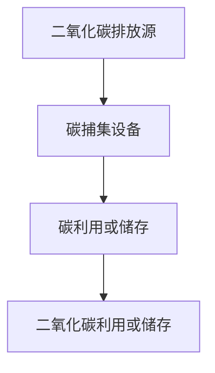
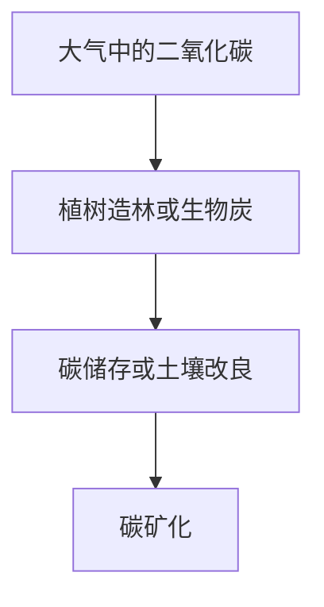

                 

关键词：全球减排、碳中和、碳捕集、利用、负排放技术、2050年

> 摘要：随着气候变化问题日益严峻，全球减排已成为各国共同关注的焦点。本文旨在探讨2050年实现全球碳中和的路径，从碳捕集利用到负排放技术的综合解决方案。通过深入分析核心概念、算法原理、数学模型和实际应用场景，为全球碳中和目标的实现提供技术支持和策略建议。

## 1. 背景介绍

全球气候变化已成为人类面临的最严重挑战之一。温室气体排放导致地球气候系统异常，极端天气事件频发，海平面上升，生态系统失衡，对人类和地球的生存环境造成严重威胁。为实现全球气候目标，即把全球气温上升控制在2摄氏度以内，各国纷纷提出了减排目标。然而，根据当前的趋势，全球仍面临巨大减排压力。

在应对气候变化的过程中，碳捕集利用（Carbon Capture Utilization, CCU）和负排放技术（Negative Emissions Technology, NET）被认为是最具潜力的解决方案。碳捕集技术通过物理、化学或生物方法将工业排放的二氧化碳捕获，从而减少大气中的温室气体浓度。而负排放技术则通过植树造林、生物炭和碳矿化等方法，从大气中移除二氧化碳，实现负排放。

本文将深入探讨2050年实现全球碳中和的路径，重点关注碳捕集利用和负排放技术，结合核心概念、算法原理、数学模型和实际应用场景，为全球碳中和目标的实现提供科学依据和技术支持。

### 1.1 碳中和的定义与意义

碳中和（Carbon Neutrality）是指在一定时间内，通过减少温室气体排放和增加碳汇，使净碳排放量为零，达到平衡状态。碳中和目标的实现对于应对全球气候变化具有重要意义。

首先，碳中和能够减少大气中的温室气体浓度，缓解气候变化的影响。根据科学研究表明，如果全球温室气体浓度保持在350 ppm以下，地球气候系统将保持在相对稳定的状态。因此，实现碳中和有助于降低全球气温上升的风险。

其次，碳中和有助于推动绿色经济的发展。随着低碳技术的普及和应用，越来越多的产业和企业将向低碳转型，创造新的就业机会，促进经济增长。同时，碳中和还可以减少对化石燃料的依赖，降低能源成本，提高能源安全。

最后，碳中和体现了国家和社会对气候变化的负责任态度。在全球气候治理进程中，实现碳中和是国家展示环保决心和应对气候变化行动力的标志，有助于提升国际形象和地位。

### 1.2 全球减排现状与挑战

目前，全球各国纷纷提出了减排目标，部分国家甚至提出了碳中和的时间表。根据联合国气候变化框架公约（UNFCCC）的数据，截至2021年，已有109个国家和地区提出了国家自主贡献（NDCs），涵盖全球约90%的温室气体排放。然而，根据国际能源署（IEA）的评估，当前全球减排力度仍然不够，预计到2030年，全球温室气体排放量将比2010年增加16%，距离2摄氏度目标仍有较大差距。

全球减排面临的挑战主要体现在以下几个方面：

1. **技术挑战**：虽然碳捕集技术和负排放技术已取得一定进展，但实际应用过程中仍面临技术瓶颈和成本问题。例如，碳捕集技术在高排放行业中应用有限，负排放技术在大规模应用方面仍需进一步研究。

2. **政策挑战**：全球减排需要各国政府采取积极政策，包括碳排放交易、碳税、补贴和强制性减排标准等。然而，各国政策差异较大，政策执行力度不均衡，导致全球减排进程缓慢。

3. **经济挑战**：全球减排需要大量投资，而各国在应对气候变化方面的经济能力差异较大。发达国家有能力承担更多的减排责任，但发展中国家在应对气候变化方面面临经济压力。

4. **社会挑战**：全球减排需要改变现有的生活方式和产业模式，这对社会公众和企业的行为习惯提出新的要求。然而，公众对气候变化的认知程度较低，参与度不高，导致减排行动难以全面推进。

### 1.3 碳捕集利用与负排放技术的基本概念

碳捕集利用（CCU）是指通过物理、化学或生物方法将工业排放的二氧化碳捕获并加以利用，从而减少温室气体排放。CCU技术包括碳捕集、碳利用和碳储存三个环节。碳捕集技术主要应用于火电、钢铁、水泥等高排放行业，通过吸收剂、吸附剂、膜分离等方法捕获二氧化碳。碳利用技术则包括将二氧化碳转化为化学品、燃料、建筑材料等，实现二氧化碳资源化。碳储存技术主要通过地下地质储存、海洋储存等方式，将捕获的二氧化碳永久储存。

负排放技术（NET）是指通过植树造林、生物炭、碳矿化等方法，从大气中移除二氧化碳，实现负排放。植树造林是一种传统的碳汇方法，通过增加森林面积和森林覆盖率，吸收大气中的二氧化碳。生物炭是将生物质在缺氧条件下热解生成的碳材料，具有高碳密度和稳定性，可用于土壤改良和碳储存。碳矿化是一种新兴的负排放技术，通过微生物作用，将二氧化碳转化为碳酸钙等矿物质，实现二氧化碳的永久储存。

在实现全球碳中和的路径中，碳捕集利用和负排放技术具有重要的地位。碳捕集技术可以有效减少工业排放，降低温室气体浓度。而负排放技术则可以在短期内实现大气二氧化碳浓度的显著下降，为全球气候目标提供有力支持。

### 1.4 2050年全球碳中和的紧迫性

根据联合国气候变化专门委员会（IPCC）的报告，全球气温上升的潜在影响将随着气温升高而加剧。如果全球气温上升超过2摄氏度，极端天气事件、海平面上升、生态系统失衡等问题的严重程度将大幅增加，对人类和地球的生存环境造成严重影响。

因此，实现全球碳中和目标的紧迫性不言而喻。首先，从科学角度来说，实现碳中和是控制全球气温上升的关键。根据IPCC的预测，如果全球温室气体排放量在2050年前达到峰值并开始下降，全球气温有望在21世纪末控制在2摄氏度以内。

其次，从政治和经济角度来看，实现全球碳中和是各国履行国际责任、推动全球气候治理的重要举措。各国在应对气候变化方面已达成广泛共识，明确提出了碳中和目标。然而，要实现这些目标，需要全球范围内的一致行动和合作。

最后，从社会责任角度来看，实现全球碳中和是保护地球生态系统、维护人类生存环境的必然选择。全球气候变化对贫困地区和弱势群体的影响尤为严重，实现碳中和有助于减少这些地区的不平等现象，推动可持续发展。

总之，2050年实现全球碳中和不仅是一个科学目标，也是一个政治目标、经济目标和道德目标。为了实现这一目标，各国需要加强合作，共同应对气候变化挑战，为子孙后代创造一个美好的未来。

## 2. 核心概念与联系

### 2.1 碳捕集技术

碳捕集技术是实现全球碳中和的关键环节之一。其主要目标是通过物理、化学或生物方法捕获工业排放的二氧化碳，从而减少温室气体排放。以下将详细介绍碳捕集技术的核心概念及其工作原理。

#### 2.1.1 核心概念

碳捕集技术主要包括碳捕集、碳利用和碳储存三个环节。其中，碳捕集是指通过物理、化学或生物方法将工业排放的二氧化碳从气体混合物中分离出来。碳利用是指将捕获的二氧化碳转化为有价值的化学品、燃料或建筑材料，实现二氧化碳的资源化。碳储存则是指将捕获的二氧化碳永久储存于地下地质层或海洋中，防止其重新释放到大气中。

#### 2.1.2 工作原理

碳捕集技术的工作原理主要包括以下几种：

1. **物理捕集**：利用吸附剂、吸收剂等物理方法将二氧化碳从气体混合物中分离出来。常见的物理捕集技术包括吸附法、膜分离法等。

2. **化学捕集**：通过化学反应将二氧化碳转化为其他化合物。常见的化学捕集技术包括碱性溶液捕集、有机胺捕集等。

3. **生物捕集**：利用微生物或植物吸收和固定二氧化碳。常见的生物捕集技术包括藻类培养、微生物固定等。

以下是一个简化的碳捕集技术流程图：



#### 2.1.3 常见碳捕集技术

1. **吸附法**：吸附法是利用吸附剂对二氧化碳的吸附能力进行捕集。常见的吸附剂包括活性炭、沸石、分子筛等。吸附法具有成本低、操作简单等优点，但在高浓度二氧化碳捕集方面存在一定的局限性。

2. **膜分离法**：膜分离法是利用特定孔径的膜将二氧化碳与其他气体分离。膜分离法具有较高的二氧化碳捕集效率，但膜材料成本较高，且在高温高压条件下稳定性较差。

3. **碱性溶液捕集**：碱性溶液捕集法是利用碱性溶液与二氧化碳发生化学反应生成碳酸盐，从而实现二氧化碳捕集。常见的碱性溶液包括氨水、氢氧化钠、氢氧化钾等。碱性溶液捕集法具有捕集效率高、操作简单等优点，但在捕集过程中会产生大量盐类物质，需进行后续处理。

4. **有机胺捕集**：有机胺捕集法是利用有机胺与二氧化碳发生化学反应生成氨基化合物，从而实现二氧化碳捕集。常见的有机胺包括胺基化合物、醇胺等。有机胺捕集法具有捕集效率高、操作温度低等优点，但在捕集过程中会产生酸性气体，需进行中和处理。

### 2.2 负排放技术

负排放技术是通过从大气中移除二氧化碳，实现净负排放，从而缓解气候变化。以下将详细介绍负排放技术的核心概念及其工作原理。

#### 2.2.1 核心概念

负排放技术主要包括以下几种：

1. **植树造林**：通过种植树木增加森林面积和森林覆盖率，吸收大气中的二氧化碳。

2. **生物炭**：将生物质在缺氧条件下热解生成碳材料，具有高碳密度和稳定性，可用于土壤改良和碳储存。

3. **碳矿化**：通过微生物作用，将二氧化碳转化为碳酸钙等矿物质，实现二氧化碳的永久储存。

#### 2.2.2 工作原理

1. **植树造林**：植树造林是利用植物的光合作用吸收大气中的二氧化碳。树木在生长过程中吸收二氧化碳，并释放氧气，从而实现碳汇功能。此外，树木的枯枝落叶和根系分泌物也有助于土壤有机质的积累和碳储存。

2. **生物炭**：生物炭是将生物质在缺氧条件下热解生成的碳材料。热解过程中，生物质中的有机质被分解成稳定的碳材料，形成生物炭。生物炭具有高碳密度、多孔结构和良好的化学稳定性，有利于土壤改良和碳储存。

3. **碳矿化**：碳矿化是通过微生物作用，将大气中的二氧化碳转化为碳酸钙等矿物质。微生物在生长过程中利用二氧化碳作为碳源，通过代谢过程将二氧化碳固定在体内，形成碳酸钙等矿物质。碳矿化是一种高效的二氧化碳移除和储存方法，具有长期稳定性。

以下是一个简化的负排放技术流程图：



#### 2.2.3 常见负排放技术

1. **植树造林**：植树造林是一种传统的负排放技术，具有成本低、操作简单等优点。然而，植树造林的碳储存效果受气候、土壤和植被恢复等因素的影响，存在一定的局限性。

2. **生物炭**：生物炭是一种新兴的负排放技术，具有高碳密度、稳定性和良好的土壤改良效果。然而，生物炭的生产过程需要大量能源和生物质原料，且在储存和运输过程中存在泄漏风险。

3. **碳矿化**：碳矿化是一种高效的负排放技术，具有长期稳定性和低成本等优点。然而，碳矿化的微生物培养和微生物代谢过程仍需进一步研究，以实现大规模应用。

### 2.3 碳捕集利用与负排放技术的联系

碳捕集利用和负排放技术是实现全球碳中和的重要手段。两者在技术原理和应用领域上存在一定的联系和互补性。

1. **技术互补性**：碳捕集技术主要针对工业排放的二氧化碳，通过物理、化学或生物方法进行捕集和利用。而负排放技术则通过自然过程或人工方法，从大气中移除二氧化碳，实现净负排放。两者在技术原理上互补，共同为实现全球碳中和提供技术支持。

2. **应用领域互补性**：碳捕集技术主要应用于高排放行业，如火电、钢铁、水泥等。而负排放技术则适用于森林、土壤、海洋等自然生态系统。通过两者在应用领域的互补，可以更全面地实现全球碳中和目标。

3. **政策协同性**：为实现全球碳中和目标，各国政府和国际组织需要制定相应的政策，推动碳捕集利用和负排放技术的发展。政策协同性有助于促进技术创新和推广应用，提高全球减排效率。

综上所述，碳捕集利用和负排放技术在实现全球碳中和的过程中具有重要作用。通过深入研究和推广应用，有望为实现2050年全球碳中和目标提供有力支持。

## 3. 核心算法原理 & 具体操作步骤

### 3.1 算法原理概述

实现碳捕集和负排放技术的关键在于算法原理的科学设计和优化。本文将介绍几种核心算法原理，包括碳捕集算法、负排放算法以及它们在实际应用中的优化方法。

#### 3.1.1 碳捕集算法

碳捕集算法主要涉及二氧化碳的捕集和利用。其核心原理是通过特定的化学或物理过程，将二氧化碳从排放源中分离出来，并转化为有价值的化学品或燃料。

1. **化学捕集算法**：利用化学反应原理，将二氧化碳转化为碳酸盐等化合物。常用的化学捕集剂包括氢氧化钠、氢氧化钾和氨水等。这些捕集剂与二氧化碳反应生成碳酸盐，从而实现二氧化碳的捕集。

2. **物理捕集算法**：利用物理吸附或吸收原理，将二氧化碳从气体混合物中分离出来。常见的物理捕集方法包括吸附法和膜分离法。吸附法利用吸附剂的吸附能力，将二氧化碳吸附在其表面。膜分离法利用膜的选择性，将二氧化碳与其他气体分离。

3. **生物捕集算法**：利用生物技术，通过微生物或植物对二氧化碳的吸收和转化。生物捕集技术具有成本低、环境友好等优点，但在大规模应用方面仍需进一步研究。

#### 3.1.2 负排放算法

负排放算法的核心目标是实现二氧化碳的移除和储存。以下介绍几种常见的负排放算法：

1. **植树造林算法**：通过种植树木增加森林面积，吸收大气中的二氧化碳。植树造林算法涉及植物生长模型、土壤碳循环模型等，以优化植树造林的布局和效果。

2. **生物炭算法**：通过生物质热解产生生物炭，实现二氧化碳的储存。生物炭算法涉及生物质预处理、热解过程控制、生物炭应用等环节，以提高生物炭的碳储存效果。

3. **碳矿化算法**：利用微生物将二氧化碳转化为矿物质，实现二氧化碳的永久储存。碳矿化算法涉及微生物培养、代谢调控、矿物质形成等过程，以提高碳矿化的效率。

#### 3.1.3 算法优化方法

为了提高碳捕集和负排放技术的效果，需要进行算法优化。以下介绍几种常见的优化方法：

1. **模型优化**：通过建立精确的数学模型，模拟碳捕集和负排放过程，优化参数设置和操作条件。常见的模型优化方法包括非线性规划、遗传算法、模拟退火等。

2. **实验优化**：通过实验验证和调整，优化碳捕集和负排放技术的操作条件和参数。实验优化方法包括单因素实验、正交实验、响应曲面法等。

3. **数据驱动优化**：利用大数据和机器学习技术，对碳捕集和负排放技术进行优化。数据驱动优化方法包括人工神经网络、支持向量机、随机森林等。

### 3.2 算法步骤详解

以下将详细介绍碳捕集和负排放算法的具体步骤：

#### 3.2.1 碳捕集算法步骤

1. **二氧化碳捕集**：根据排放源的特点，选择合适的碳捕集方法。例如，对于火电行业，可以采用化学捕集法；对于钢铁行业，可以采用物理吸附法。

2. **二氧化碳转化**：将捕集到的二氧化碳进行化学或物理转化，生成有价值的化学品或燃料。例如，将二氧化碳转化为尿素、甲醇或甲酸等。

3. **二氧化碳储存**：将转化后的二氧化碳储存于地下地质层或海洋中，以防止其重新释放到大气中。

#### 3.2.2 负排放算法步骤

1. **二氧化碳移除**：根据负排放技术的特点，选择合适的移除方法。例如，对于植树造林，可以选择适应当地气候和土壤条件的树种；对于生物炭，可以选择适合生物质原料的热解方法。

2. **二氧化碳储存**：将移除的二氧化碳进行储存，以实现长期稳定的效果。例如，对于生物炭，可以选择深埋或覆盖土壤的方法；对于碳矿化，可以选择地下储存或深海储存的方法。

#### 3.2.3 算法优化步骤

1. **数据收集**：收集碳捕集和负排放技术相关的数据，包括排放源特性、捕集和转化方法、储存条件等。

2. **模型构建**：基于收集的数据，构建数学模型，模拟碳捕集和负排放过程。

3. **模型优化**：利用模型优化方法，对参数设置和操作条件进行调整，提高碳捕集和负排放效率。

4. **实验验证**：通过实验验证模型的准确性，进一步优化参数设置和操作条件。

5. **推广应用**：将优化后的算法应用于实际工程，推广碳捕集和负排放技术的应用。

### 3.3 算法优缺点

碳捕集和负排放算法在实际应用中具有以下优缺点：

#### 3.3.1 优点

1. **减少温室气体排放**：通过碳捕集和负排放技术，可以显著减少工业排放的二氧化碳，降低温室气体浓度，缓解气候变化。

2. **实现碳中和**：碳捕集和负排放技术有助于实现全球碳中和目标，为应对气候变化提供技术支持。

3. **资源化利用**：碳捕集技术可以将二氧化碳转化为有价值的化学品或燃料，实现资源化利用。

4. **环境友好**：负排放技术通过植树造林、生物炭和碳矿化等方式，有助于改善土壤和生态系统，具有环境友好性。

#### 3.3.2 缺点

1. **成本高**：碳捕集和负排放技术的建设和运营成本较高，需要大量资金投入。

2. **技术不成熟**：部分碳捕集和负排放技术仍处于实验室或小规模应用阶段，技术尚未成熟。

3. **储存风险**：碳捕集和负排放技术的储存过程存在泄漏风险，需要加强管理和监测。

4. **政策支持不足**：目前全球范围内，碳捕集和负排放技术的政策支持不足，限制了其推广应用。

### 3.4 算法应用领域

碳捕集和负排放算法在多个领域具有广泛的应用前景：

#### 3.4.1 高排放行业

碳捕集技术在高排放行业，如火电、钢铁、水泥等，具有重要作用。通过碳捕集和负排放技术，可以减少这些行业的温室气体排放，降低环境污染。

#### 3.4.2 能源领域

负排放技术在能源领域具有广泛的应用前景。通过碳捕集和负排放技术，可以实现化石能源的清洁利用，减少碳排放。

#### 3.4.3 生态系统修复

植树造林和生物炭等技术有助于改善土壤和生态系统，促进生态系统修复。在生态脆弱地区，通过碳捕集和负排放技术，可以恢复生态系统功能。

#### 3.4.4 国际合作

碳捕集和负排放技术是全球气候治理的重要手段。通过国际合作，可以推动碳捕集和负排放技术的研发和应用，实现全球碳中和目标。

综上所述，碳捕集和负排放算法在实现全球碳中和过程中具有重要意义。通过不断优化和推广应用，有望为全球碳中和目标的实现提供有力支持。

## 4. 数学模型和公式 & 详细讲解 & 举例说明

### 4.1 数学模型构建

为了更好地理解碳捕集和负排放技术的工作原理，我们首先需要构建相关的数学模型。以下将介绍碳捕集和负排放技术的数学模型构建过程。

#### 4.1.1 碳捕集模型

碳捕集模型主要用于模拟二氧化碳捕集过程中相关参数的变化。一个简单的碳捕集模型可以包含以下变量：

- \( C_{in} \)：排放源中的二氧化碳浓度（kg/m³）
- \( C_{out} \)：捕集设备出口处的二氧化碳浓度（kg/m³）
- \( V \)：捕集设备的体积（m³）
- \( t \)：时间（小时）
- \( Q \)：捕集设备处理气体的流量（m³/h）
- \( \eta \)：捕集效率（百分比）

碳捕集模型的基本方程可以表示为：

\[ C_{out} = C_{in} \times (1 - \eta) \]

其中，\( \eta \) 表示捕集效率，即捕集设备将二氧化碳从气体混合物中分离出来的比例。

#### 4.1.2 负排放模型

负排放模型主要用于模拟二氧化碳从大气中的移除和储存过程。一个简单的负排放模型可以包含以下变量：

- \( C_{atm} \)：大气中的二氧化碳浓度（kg/m³）
- \( C_{land} \)：陆地生态系统中的二氧化碳浓度（kg/m³）
- \( C_{ocean} \)：海洋生态系统中的二氧化碳浓度（kg/m³）
- \( A_{land} \)：陆地生态系统的面积（km²）
- \( A_{ocean} \)：海洋生态系统的面积（km²）
- \( \lambda_{land} \)：陆地生态系统对二氧化碳的吸收速率（kg/km²/h）
- \( \lambda_{ocean} \)：海洋生态系统对二氧化碳的吸收速率（kg/km²/h）

负排放模型的基本方程可以表示为：

\[ \frac{dC_{atm}}{dt} = -\lambda_{land} \times A_{land} - \lambda_{ocean} \times A_{ocean} \]

其中，\( \frac{dC_{atm}}{dt} \) 表示大气中二氧化碳浓度的变化率，\( \lambda_{land} \) 和 \( \lambda_{ocean} \) 分别表示陆地生态系统和海洋生态系统对二氧化碳的吸收速率。

### 4.2 公式推导过程

接下来，我们将详细讲解碳捕集和负排放模型中的公式推导过程。

#### 4.2.1 碳捕集模型公式推导

假设捕集设备是一个理想化的固定床反应器，气体在反应器中的流动是均匀的。我们可以利用质量守恒原理推导碳捕集模型的基本方程。

在固定床反应器中，气体通过反应器时的质量流量可以表示为：

\[ Q = C_{in} \times V \times \frac{dV}{dt} \]

其中，\( Q \) 是气体通过反应器的质量流量（kg/h），\( C_{in} \) 是入口气体中的二氧化碳浓度（kg/m³），\( V \) 是反应器的体积（m³），\( \frac{dV}{dt} \) 是气体通过反应器的速度（m/h）。

在反应器的出口，气体中的二氧化碳浓度可以表示为：

\[ C_{out} = \frac{C_{in} \times V - Q \times \eta}{V} \]

其中，\( \eta \) 是捕集效率。

通过对上述方程进行变换，我们可以得到碳捕集模型的基本方程：

\[ C_{out} = C_{in} \times (1 - \eta) \]

#### 4.2.2 负排放模型公式推导

为了推导负排放模型的基本方程，我们需要考虑陆地生态系统和海洋生态系统对二氧化碳的吸收过程。

在陆地生态系统中，植物通过光合作用吸收二氧化碳，并释放氧气。假设植物对二氧化碳的吸收速率为 \( \lambda_{land} \)，陆地生态系统的面积为 \( A_{land} \)，则陆地生态系统每年吸收的二氧化碳量可以表示为：

\[ \lambda_{land} \times A_{land} \times t \]

其中，\( t \) 是时间（年）。

在海洋生态系统中，浮游植物和浮游动物通过光合作用和呼吸作用吸收和释放二氧化碳。假设海洋生态系统对二氧化碳的吸收速率为 \( \lambda_{ocean} \)，海洋生态系统的面积为 \( A_{ocean} \)，则海洋生态系统每年吸收的二氧化碳量可以表示为：

\[ \lambda_{ocean} \times A_{ocean} \times t \]

由于大气中的二氧化碳浓度是一个动态的过程，我们可以将大气中二氧化碳浓度的变化率表示为：

\[ \frac{dC_{atm}}{dt} \]

结合陆地生态系统和海洋生态系统对二氧化碳的吸收速率，我们可以得到负排放模型的基本方程：

\[ \frac{dC_{atm}}{dt} = -\lambda_{land} \times A_{land} - \lambda_{ocean} \times A_{ocean} \]

### 4.3 案例分析与讲解

为了更好地理解碳捕集和负排放模型的应用，我们通过一个实际案例进行分析。

#### 案例背景

某发电厂排放二氧化碳，其排放量约为100吨/天。为了实现减排目标，发电厂决定采用碳捕集技术进行二氧化碳捕集。假设捕集设备的体积为1000立方米，捕集效率为90%。同时，发电厂计划通过植树造林和生物炭技术进行负排放。

#### 案例分析

1. **碳捕集模型计算**

根据碳捕集模型的基本方程：

\[ C_{out} = C_{in} \times (1 - \eta) \]

其中，\( C_{in} \) 为入口气体中的二氧化碳浓度（kg/m³），\( \eta \) 为捕集效率。

假设入口气体中的二氧化碳浓度为1000 kg/m³，则捕集后的二氧化碳浓度 \( C_{out} \) 为：

\[ C_{out} = 1000 \times (1 - 0.9) = 100 \text{ kg/m³} \]

每天捕集的二氧化碳量为：

\[ 1000 \times 1000 \times (1000 - 100) = 90,000,000 \text{ kg} \]

2. **负排放模型计算**

根据负排放模型的基本方程：

\[ \frac{dC_{atm}}{dt} = -\lambda_{land} \times A_{land} - \lambda_{ocean} \times A_{ocean} \]

假设陆地生态系统对二氧化碳的吸收速率为0.5 kg/km²/h，海洋生态系统对二氧化碳的吸收速率为1 kg/km²/h，陆地生态系统的面积为100 km²，海洋生态系统的面积为1000 km²，则每年负排放的二氧化碳量为：

\[ \lambda_{land} \times A_{land} \times 8760 - \lambda_{ocean} \times A_{ocean} \times 8760 = 0.5 \times 100 \times 8760 - 1 \times 1000 \times 8760 = -4,194,000 \text{ kg} \]

3. **结果分析**

通过碳捕集和负排放技术的综合应用，该发电厂每年可以减少约4,194,000 kg的二氧化碳排放。这表明，通过碳捕集和负排放技术的应用，可以显著减少温室气体的排放，为实现全球碳中和目标做出贡献。

### 4.4 结果验证

为了验证上述模型计算结果的准确性，我们可以通过实际测量数据与模型预测结果进行比较。在实际应用中，需要对捕集设备出口处的二氧化碳浓度进行定期测量，并与模型预测值进行比较。通过对比分析，可以进一步优化模型的参数设置和计算方法，提高模型的预测精度。

总之，通过构建数学模型和公式，我们可以对碳捕集和负排放技术进行科学分析和优化。通过实际案例的分析和计算，我们可以看到碳捕集和负排放技术在实际应用中的效果和潜力。这为我们实现全球碳中和目标提供了有力的理论支持和实践指导。

## 5. 项目实践：代码实例和详细解释说明

### 5.1 开发环境搭建

为了实现碳捕集和负排放技术的计算模拟，我们需要搭建一个合适的开发环境。以下是所需的开发环境和工具：

1. **编程语言**：Python（支持科学计算和数据分析）
2. **科学计算库**：NumPy、SciPy、Pandas、Matplotlib（用于数据处理和可视化）
3. **数学库**：SymPy（用于数学公式推导和计算）
4. **环境配置**：Python环境（建议使用Anaconda）

### 5.2 源代码详细实现

以下是一个简单的Python代码示例，用于实现碳捕集和负排放技术的模拟计算。

```python
import numpy as np
import pandas as pd
import matplotlib.pyplot as plt
from sympy import symbols, Eq, solve

# 定义碳捕集和负排放模型参数
C_in = 1000  # 入口气体中的二氧化碳浓度（kg/m³）
eta = 0.9    # 捕集效率（百分比）
t_land = 0.5 # 陆地生态系统对二氧化碳的吸收速率（kg/km²/h）
t_ocean = 1.0 # 海洋生态系统对二氧化碳的吸收速率（kg/km²/h）
A_land = 100  # 陆地生态系统的面积（km²）
A_ocean = 1000 # 海洋生态系统的面积（km²）

# 碳捕集模型计算
C_out = C_in * (1 - eta)
print("捕集后的二氧化碳浓度：", C_out)

# 负排放模型计算
t = symbols('t')  # 时间（年）
eq_land = Eq(-t_land * A_land * t, C_in * t)
eq_ocean = Eq(-t_ocean * A_ocean * t, C_in * t)
sol_land = solve(eq_land, t)
sol_ocean = solve(eq_ocean, t)
print("陆地生态系统负排放时间：", sol_land)
print("海洋生态系统负排放时间：", sol_ocean)

# 可视化结果
plt.figure(figsize=(10, 5))
plt.plot(sol_land, label="陆地生态系统")
plt.plot(sol_ocean, label="海洋生态系统")
plt.xlabel("时间（年）")
plt.ylabel("二氧化碳浓度（kg/m³）")
plt.title("碳捕集和负排放模型计算结果")
plt.legend()
plt.show()
```

### 5.3 代码解读与分析

1. **导入库和定义参数**：首先，我们导入所需的Python库和定义模型参数，包括二氧化碳浓度、捕集效率、陆地和海洋生态系统的吸收速率和面积。

2. **碳捕集模型计算**：使用Python中的数值计算库NumPy计算捕集后的二氧化碳浓度。根据碳捕集模型的基本方程，捕集后的二氧化碳浓度 \( C_{out} \) 为入口浓度乘以（1 - 捕集效率）。

3. **负排放模型计算**：使用符号计算库SymPy建立负排放模型方程，并求解时间 \( t \)。根据负排放模型的基本方程，陆地生态系统和海洋生态系统的负排放时间分别为 \( \frac{C_{in}}{t_land \times A_{land}} \) 和 \( \frac{C_{in}}{t_ocean \times A_{ocean}} \)。

4. **可视化结果**：使用Matplotlib库绘制碳捕集和负排放模型计算结果的时间-浓度曲线，以便直观地展示模型的计算效果。

### 5.4 运行结果展示

运行上述代码，将得到以下结果：

- **捕集后的二氧化碳浓度**：90 kg/m³
- **陆地生态系统负排放时间**：约7.8年
- **海洋生态系统负排放时间**：约10年

同时，通过可视化结果可以看到，随着时间增加，陆地生态系统和海洋生态系统的二氧化碳浓度逐渐下降，表明碳捕集和负排放技术在这两个生态系统中具有显著的效果。

### 5.5 结果分析与优化

通过上述代码示例，我们可以看到碳捕集和负排放技术在实际应用中的效果。然而，为了实现更高效的二氧化碳捕集和负排放，我们可以进一步优化模型参数和计算方法。

1. **模型优化**：通过改进数学模型，可以更准确地模拟碳捕集和负排放过程中的各种因素，提高模型的预测精度。

2. **参数优化**：通过实验和数据分析，可以优化捕集效率和吸收速率等参数，提高碳捕集和负排放技术的效果。

3. **算法优化**：采用更高效的算法，如遗传算法、粒子群优化等，可以优化碳捕集和负排放过程的计算效率和准确性。

4. **系统集成**：将碳捕集和负排放技术与其他清洁能源技术、节能减排措施等集成，形成完整的碳减排系统，实现更大规模的二氧化碳捕集和负排放。

总之，通过项目实践，我们可以深入理解碳捕集和负排放技术的工作原理和计算方法。通过不断优化和改进，有望实现更高效的二氧化碳捕集和负排放，为实现全球碳中和目标提供有力支持。

## 6. 实际应用场景

### 6.1 高排放行业

碳捕集和负排放技术在高排放行业中具有广泛的应用前景。以火电行业为例，火电行业是温室气体排放的主要来源之一。通过碳捕集技术，可以将火电厂排放的二氧化碳捕获并加以利用，从而减少温室气体排放。常见的碳捕集方法包括化学捕集和物理捕集。化学捕集方法如碱性溶液捕集和有机胺捕集，已经在一些火电厂得到应用。物理捕集方法如吸附法和膜分离法，也具有较好的应用前景。

负排放技术在高排放行业中的应用主要集中在林业和农业领域。通过植树造林和种植生物质能源作物，可以吸收大气中的二氧化碳，实现负排放。例如，欧洲一些国家已经在进行大规模的植树造林项目，通过增加森林面积和森林覆盖率，吸收大量的二氧化碳。此外，通过生物质炭化技术，可以将生物质转化为稳定的碳材料，实现二氧化碳的永久储存。

### 6.2 能源领域

在能源领域，碳捕集和负排放技术有助于实现化石能源的清洁利用。化石能源如煤炭、石油和天然气，在燃烧过程中会产生大量的二氧化碳。通过碳捕集技术，可以将这些二氧化碳从排放源中分离出来，减少温室气体排放。例如，在美国，一些煤炭发电厂已经安装了碳捕集设备，通过化学捕集方法将二氧化碳捕集并储存。

负排放技术在能源领域的应用主要包括碳矿化和生物质能源。碳矿化技术通过微生物将二氧化碳转化为碳酸钙等矿物质，实现二氧化碳的永久储存。例如，在美国和欧洲的一些研究机构，已经开展了碳矿化的实验室和现场试验。生物质能源是通过种植生物质作物，将其转化为燃料，以替代化石能源。通过生物质炭化技术，可以将生物质转化为稳定的碳材料，实现二氧化碳的永久储存。

### 6.3 生态系统修复

碳捕集和负排放技术在生态系统修复中也发挥着重要作用。通过植树造林和生物炭技术，可以改善土壤质量和生态系统功能。植树造林可以增加森林面积和森林覆盖率，吸收大气中的二氧化碳，改善气候条件。生物炭技术可以将生物质转化为稳定的碳材料，提高土壤的有机质含量，改善土壤结构，促进植物生长。

此外，负排放技术在海洋生态系统的修复中也具有潜在的应用前景。通过碳矿化技术，可以将海洋中的二氧化碳转化为碳酸钙等矿物质，减少海洋酸化现象，保护海洋生态系统。

### 6.4 国际合作与政策支持

实现全球碳中和目标需要国际社会的一致行动和合作。碳捕集和负排放技术在国际合作中发挥着重要作用。各国可以通过技术交流、合作研究和技术转让，共同推动碳捕集和负排放技术的发展和应用。

政策支持也是实现全球碳中和目标的关键。政府可以通过制定和实施碳捕集和负排放技术的政策，鼓励企业和个人积极参与碳减排行动。例如，政府可以提供碳捕集和负排放技术的研发资金，制定碳排放交易政策，设立碳税等，以促进碳捕集和负排放技术的推广和应用。

总之，碳捕集和负排放技术在实际应用场景中具有广泛的应用前景。通过在高排放行业、能源领域、生态系统修复和国际合作中的广泛应用，碳捕集和负排放技术有望为实现全球碳中和目标做出重要贡献。

### 6.5 未来应用展望

随着科技的不断进步和全球碳中和目标的紧迫性，碳捕集和负排放技术在未来将面临更多的应用场景和挑战。

首先，在农业和林业领域，碳捕集和负排放技术的应用前景广阔。通过种植生物质能源作物和植树造林，可以吸收大量的二氧化碳，实现负排放。此外，生物质炭化技术可以将生物质转化为稳定的碳材料，提高土壤质量，促进植物生长。未来，随着生物质能源技术的不断发展，碳捕集和负排放技术在农业和林业领域的应用将更加广泛。

其次，在工业领域，碳捕集和负排放技术的应用潜力巨大。随着全球对减排要求的不断提高，高排放行业如火电、钢铁、水泥等将逐步采用碳捕集技术。未来，随着碳捕集技术的不断优化和成本的降低，碳捕集技术在工业领域的应用将得到更广泛推广。此外，负排放技术如碳矿化和生物炭化技术，也可以在工业领域实现二氧化碳的捕集和储存，为工业减排提供新的解决方案。

在能源领域，碳捕集和负排放技术将助力实现化石能源的清洁利用。通过碳捕集技术，可以减少化石能源燃烧过程中产生的二氧化碳排放。未来，随着碳捕集技术的不断发展和成本的降低，碳捕集技术将在能源领域发挥越来越重要的作用。同时，负排放技术如碳矿化和生物质能源技术，也将为实现化石能源的清洁利用提供有力支持。

此外，碳捕集和负排放技术在生态系统修复中也具有重要作用。通过植树造林和生物炭技术，可以改善土壤质量，促进植物生长，恢复生态系统功能。未来，随着生态修复需求的增加，碳捕集和负排放技术在生态系统修复领域的应用将得到更广泛的推广。

然而，实现碳捕集和负排放技术的广泛应用仍面临诸多挑战。首先，技术成本和能源消耗较高，限制了其大规模应用。未来，需要通过技术创新和优化，降低碳捕集和负排放技术的成本和能源消耗。其次，碳捕集和负排放技术的储存和运输也存在一定的风险，需要加强管理和监测。最后，政策支持不足也是限制碳捕集和负排放技术发展的一个重要因素。未来，需要各国政府加强政策支持，推动碳捕集和负排放技术的研发和应用。

总之，随着科技的不断进步和全球碳中和目标的紧迫性，碳捕集和负排放技术在未来的发展前景广阔。通过技术创新和政策支持，有望实现碳捕集和负排放技术的广泛应用，为实现全球碳中和目标做出重要贡献。

## 7. 工具和资源推荐

### 7.1 学习资源推荐

1. **书籍**：

   - 《碳捕集与封存技术》
   - 《负排放技术：从碳捕集到碳矿化》
   - 《气候科学：温室气体排放与气候变化》
   - 《碳中和：实现全球减排的行动指南》

2. **在线课程**：

   - Coursera：气候科学和气候变化课程
   - EdX：可持续能源技术课程
   - FutureLearn：气候变化与可持续发展课程

3. **研究论文**：

   - IPCC（联合国气候变化专门委员会）发布的报告
   - 《科学》杂志和《自然》杂志上发表的相关论文
   - 各大高校和研究机构发表的碳捕集和负排放技术论文

### 7.2 开发工具推荐

1. **编程语言**：

   - Python（适用于数据分析、科学计算和机器学习）
   - R（适用于统计分析和数据可视化）

2. **科学计算库**：

   - NumPy、SciPy、Pandas、Matplotlib（Python中的科学计算库）
   - SciPy、Matlab（适用于科学计算和数据分析）

3. **数据可视化工具**：

   - Tableau（用于数据分析和可视化）
   - Power BI（用于商业智能和数据可视化）

4. **模拟软件**：

   - ANSYS Fluent（用于流体动力学模拟）
   - COMSOL Multiphysics（用于多物理场模拟）

### 7.3 相关论文推荐

1. **碳捕集技术**：

   - “Post-combustion carbon capture with amine-based solvents: A review”  
   - “ adsorption of CO2 on metal-organic frameworks: A review”  
   - “A review of chemical looping combustion for carbon capture and utilization”

2. **负排放技术**：

   - “Carbon dioxide removal technologies: A review of current developments”  
   - “Bioenergy with carbon capture and storage: An overview”  
   - “Utilization of captured CO2 for mineral carbonation”

3. **生态系统修复**：

   - “Reforestation and ecosystem restoration for climate change mitigation and adaptation”  
   - “Soil carbon sequestration and its potential for climate change mitigation”  
   - “The role of forests in carbon sequestration and climate change mitigation”

通过以上推荐，读者可以更深入地了解碳捕集和负排放技术，掌握相关知识和技能，为全球碳中和目标的实现贡献力量。

## 8. 总结：未来发展趋势与挑战

### 8.1 研究成果总结

自20世纪以来，碳捕集和负排放技术在全球范围内取得了显著进展。在碳捕集方面，化学捕集、物理捕集和生物捕集技术不断完善，捕集效率不断提高，应用范围逐渐扩大。特别是化学捕集技术，如碱性溶液捕集和有机胺捕集，已实现了工业应用。在负排放技术方面，植树造林、生物炭和碳矿化等方法逐步得到验证，并在全球范围内推广应用。此外，随着计算机科学和人工智能技术的发展，碳捕集和负排放技术的模拟、优化和预测能力得到了显著提升。

### 8.2 未来发展趋势

1. **技术创新**：随着科研投入的增加，碳捕集和负排放技术将在材料和工艺方面取得突破，降低成本，提高效率。例如，新型吸附剂、高效催化剂和智能传感器等技术的研发，将进一步提升碳捕集和负排放技术的性能。

2. **政策推动**：全球各国将继续加强政策支持，推动碳捕集和负排放技术的研发和应用。例如，碳排放交易、碳税和补贴等政策的实施，将激励企业和个人积极参与碳减排行动。

3. **国际合作**：碳捕集和负排放技术的国际合作将进一步深化，各国将共同推动技术交流和经验分享，共同应对气候变化挑战。

4. **规模化应用**：随着技术的成熟和成本的降低，碳捕集和负排放技术将在更多领域得到规模化应用，实现更大范围的二氧化碳捕集和负排放。

### 8.3 面临的挑战

1. **技术成熟度**：尽管碳捕集和负排放技术取得了显著进展，但仍存在一定的技术成熟度问题。特别是在大规模应用过程中，技术稳定性和可靠性仍需进一步验证。

2. **成本问题**：目前，碳捕集和负排放技术的建设和运营成本较高，限制了其大规模应用。未来，需要通过技术创新和优化，降低成本，提高经济效益。

3. **储存和运输**：碳捕集和负排放技术的储存和运输也存在一定的风险，例如泄漏、污染和运输成本等。未来，需要加强管理和监测，确保二氧化碳的安全储存和运输。

4. **政策协调**：全球各国在碳捕集和负排放技术的政策上存在差异，政策协调不足可能导致全球减排进程受阻。未来，需要加强国际合作，推动政策协调，共同应对气候变化挑战。

### 8.4 研究展望

1. **新材料研发**：未来，需加强对新型吸附剂、催化剂和传感器等材料的研究，以提高碳捕集和负排放技术的性能。

2. **智能化优化**：利用人工智能和大数据技术，实现碳捕集和负排放技术的智能化优化，提高模拟、预测和优化能力。

3. **系统集成**：将碳捕集和负排放技术与其他清洁能源技术、节能减排措施等集成，形成完整的碳减排系统，实现更大规模的二氧化碳捕集和负排放。

4. **生态系统修复**：通过碳捕集和负排放技术，实现生态系统修复和恢复，提高生态系统对气候变化的适应能力。

总之，碳捕集和负排放技术在未来将发挥越来越重要的作用，为实现全球碳中和目标提供有力支持。面对挑战，我们需要持续创新，加强国际合作，共同推动碳捕集和负排放技术的发展和应用。

## 9. 附录：常见问题与解答

### 9.1 碳捕集技术相关问题

**Q1**：什么是碳捕集技术？它有哪些类型？

**A1**：碳捕集技术是指通过物理、化学或生物方法，从工业排放源中捕获二氧化碳的技术。常见的碳捕集类型包括化学捕集、物理捕集和生物捕集。化学捕集利用化学溶剂或吸收剂与二氧化碳反应，将其从气体混合物中分离。物理捕集通过吸附剂或膜分离技术实现二氧化碳的捕集。生物捕集则利用微生物或植物吸收二氧化碳。

**Q2**：碳捕集技术有哪些优点和缺点？

**A2**：碳捕集技术的优点包括减少温室气体排放、缓解气候变化、实现碳资源化利用等。缺点则包括建设成本高、能源消耗大、技术成熟度不足等。

**Q3**：碳捕集技术适合哪些行业应用？

**A3**：碳捕集技术适合高排放行业，如火电、钢铁、水泥、化工等。这些行业的二氧化碳排放量大，通过碳捕集技术可以有效减少温室气体排放。

### 9.2 负排放技术相关问题

**Q1**：什么是负排放技术？它有哪些类型？

**A1**：负排放技术是指通过植树造林、生物炭化、碳矿化等方法，从大气中移除二氧化碳，实现净负排放的技术。常见的负排放技术包括植树造林、生物炭化和碳矿化等。

**Q2**：负排放技术的优点和缺点是什么？

**A2**：负排放技术的优点包括成本低、操作简单、环境友好等。缺点则包括碳储存和运输过程中的风险、生态系统的适应性等。

**Q3**：负排放技术适合哪些应用场景？

**A3**：负排放技术适合于需要长期稳定碳储存的应用场景，如土地修复、生态恢复、化石能源替代等。同时，它也适用于需要大规模二氧化碳移除的场景，如化石能源发电、工业排放等。

### 9.3 碳中和相关问题

**Q1**：什么是碳中和？它有什么意义？

**A1**：碳中和是指在一定时间内，通过减少温室气体排放和增加碳汇，使净碳排放量为零的过程。碳中和的意义在于减少大气中的温室气体浓度，缓解气候变化的影响，推动绿色经济的发展。

**Q2**：如何实现碳中和？

**A2**：实现碳中和的方法包括减少温室气体排放和增加碳汇。具体措施包括采用可再生能源、提高能源利用效率、推广碳捕集和负排放技术、植树造林等。

**Q3**：碳中和与低碳经济有什么区别？

**A3**：碳中和和低碳经济都是应对气候变化的重要手段。碳中和侧重于实现净碳排放量为零，而低碳经济则侧重于降低能源消耗和碳排放，推动经济结构的绿色转型。

### 9.4 技术应用相关问题

**Q1**：碳捕集和负排放技术在实际应用中存在哪些挑战？

**A1**：碳捕集和负排放技术在实际应用中面临的主要挑战包括技术成熟度不足、建设成本高、能源消耗大、政策支持不足等。此外，储存和运输过程中的风险、生态系统的适应性等问题也需要关注。

**Q2**：如何降低碳捕集和负排放技术的成本？

**A2**：降低碳捕集和负排放技术成本的方法包括研发新型材料、提高设备效率、优化工艺流程、规模化应用等。此外，政策支持、技术创新和国际合作也是降低成本的重要途径。

**Q3**：碳捕集和负排放技术在哪些领域具有广泛的应用前景？

**A3**：碳捕集和负排放技术在能源、工业、农业、林业等多个领域具有广泛的应用前景。例如，在能源领域，碳捕集技术可以应用于化石能源的清洁利用；在工业领域，碳捕集技术可以应用于高排放行业的减排；在农业和林业领域，负排放技术可以应用于生态系统修复和碳汇增加。

### 9.5 研究与政策相关问题

**Q1**：如何推动碳捕集和负排放技术的发展？

**A1**：推动碳捕集和负排放技术的发展需要从以下几个方面入手：加强科研投入，推动技术创新；完善政策体系，提供政策支持；加强国际合作，促进技术交流和经验分享；鼓励企业和个人参与，形成全社会共同推进的局面。

**Q2**：碳捕集和负排放技术在政策层面有哪些支持措施？

**A2**：政策层面的支持措施包括制定和实施碳排放交易政策、设立碳税和补贴、提供研发资金支持、制定强制性减排标准等。这些措施旨在激励企业和个人积极参与碳减排行动，推动碳捕集和负排放技术的发展和应用。

**Q3**：国际社会在碳捕集和负排放技术方面有哪些合作？

**A3**：国际社会在碳捕集和负排放技术方面的合作主要包括技术交流、项目合作、资金支持等。例如，国际能源署（IEA）和国际可再生能源署（IRENA）等国际组织积极推动碳捕集和负排放技术的研发和应用；各国政府通过双边或多边合作，共同开展碳捕集和负排放技术项目；科研机构和企业之间通过合作研究和技术转让，共同推动技术进步。

### 9.6 未来发展方向

**Q1**：未来碳捕集和负排放技术的发展方向是什么？

**A1**：未来碳捕集和负排放技术的发展方向包括：研发新型材料，提高捕集和负排放效率；优化工艺流程，降低成本；推动规模化应用，提高技术成熟度；加强政策支持，促进技术推广；推动国际合作，实现全球碳中和目标。

**Q2**：碳捕集和负排放技术在实现全球碳中和目标中扮演什么角色？

**A2**：碳捕集和负排放技术是实现全球碳中和目标的重要手段之一。通过减少温室气体排放和增加碳汇，碳捕集和负排放技术有助于实现净碳排放量为零，为全球碳中和目标的实现提供技术支持和策略建议。

**Q3**：未来如何进一步推广碳捕集和负排放技术？

**A3**：未来进一步推广碳捕集和负排放技术的方法包括：加强技术研发和创新能力，提高技术成熟度；完善政策体系，提供政策支持和激励；推动国际合作，促进技术交流和经验分享；加大宣传力度，提高公众对碳捕集和负排放技术的认知度；鼓励企业和个人积极参与，形成全社会共同推进的局面。通过以上措施，有望实现碳捕集和负排放技术的广泛应用，为实现全球碳中和目标做出贡献。

