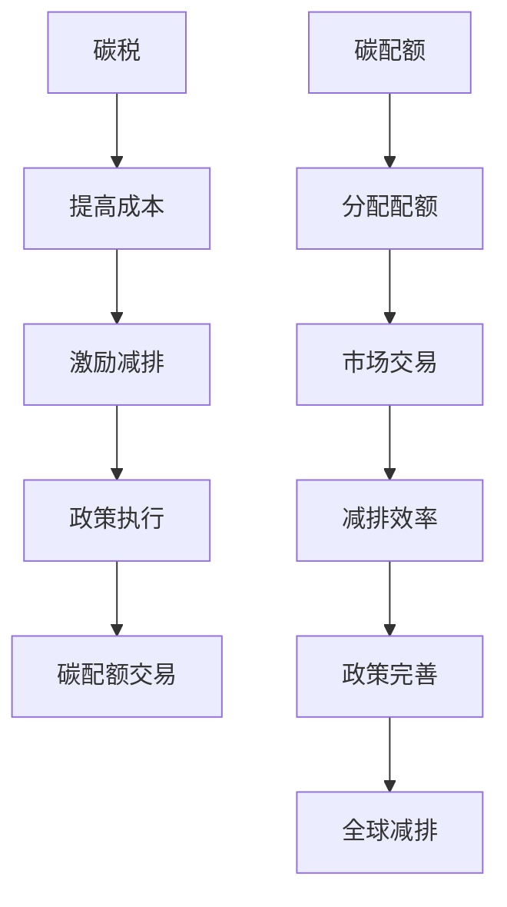

                 

关键词：全球减排、碳税、碳配额交易、碳市场机制、创新

> 摘要：随着全球气候变化问题的日益严重，减少碳排放已成为全球共识。本文从碳税和碳配额交易两种碳市场机制出发，探讨了2050年的全球减排路径，分析了这些机制的优点和挑战，并提出了一系列创新措施，为全球碳市场的未来发展提供了有益的参考。

## 1. 背景介绍

随着工业化和城市化进程的加速，全球碳排放量持续增加，导致气候变化问题日益严重。气候变化对全球生态环境、经济和社会稳定造成了严重影响，因此减少碳排放已成为全球各国的共同任务。联合国气候变化框架公约（UNFCCC）提出了将全球平均气温较工业化前水平升高控制在2摄氏度以内，并努力将升温限制在1.5摄氏度以内的目标。

为实现这一目标，各国纷纷采取了一系列政策措施，如碳税、碳配额交易等。碳税通过向化石燃料和碳排放企业征收税收，激励企业减少碳排放。碳配额交易则通过设置碳排放总量上限，分配碳排放配额，并允许企业之间交易配额，实现减排目标。

然而，现有的碳市场机制在实际应用中仍面临诸多挑战，如政策执行力度不足、市场机制不完善等。因此，本文旨在探讨2050年的全球减排路径，从碳税和碳配额交易两种机制出发，提出创新措施，以推动全球碳市场的健康发展。

## 2. 核心概念与联系

### 2.1 碳税

碳税是指对化石燃料和碳排放企业征收的一种特殊税种，目的是通过提高能源和碳排放成本，激励企业减少碳排放。碳税的征收对象包括煤炭、石油、天然气等化石燃料的生产、加工和使用环节。碳税税率通常与碳排放强度相关，碳排放强度越高，税率越高。

### 2.2 碳配额交易

碳配额交易是指在一定时间内，政府设定碳排放总量上限，将相应数量的碳排放配额分配给企业。企业可以自主决定是否使用这些配额，如果企业排放量超过配额，则需要从市场上购买额外的配额。反之，如果企业排放量低于配额，则可以将多余配额出售给其他企业。

### 2.3 碳市场机制的联系

碳税和碳配额交易都是碳市场机制的重要组成部分，它们共同构成了碳市场的核心框架。碳税通过提高能源和碳排放成本，促使企业减少碳排放。而碳配额交易则通过市场机制，实现碳排放权的合理配置，提高减排效率。

### 2.4 Mermaid 流程图

下面是碳税和碳配额交易机制的Mermaid流程图：



## 3. 核心算法原理 & 具体操作步骤

### 3.1 算法原理概述

碳税和碳配额交易的核心算法原理是通过对碳排放成本的控制，激励企业减少碳排放。具体操作步骤如下：

1. 政府制定碳排放总量目标，确定碳排放配额总量。
2. 对企业进行碳排放配额分配，确保企业能够实现减排目标。
3. 对碳排放企业征收碳税，提高其能源和碳排放成本。
4. 允许企业之间进行碳排放配额交易，实现碳排放权的合理配置。
5. 监测和报告企业碳排放情况，确保政策执行到位。

### 3.2 算法步骤详解

#### 3.2.1 碳排放总量目标制定

政府首先需要根据国家或地区的碳排放情况、经济发展水平、能源消费结构等因素，制定碳排放总量目标。该目标应具有一定的挑战性，能够激励企业积极减排。

#### 3.2.2 碳排放配额分配

根据碳排放总量目标，政府需要将碳排放配额分配给企业。分配方法可以采用历史排放量、行业基准排放量等原则，确保配额的公平性和合理性。

#### 3.2.3 征收碳税

政府针对碳排放企业征收碳税，税率应根据企业的碳排放强度和经济发展水平等因素确定。碳税的征收可以有效提高企业的能源和碳排放成本，从而激励企业减少碳排放。

#### 3.2.4 碳排放配额交易

企业可以在市场上进行碳排放配额交易，以实现碳排放权的合理配置。企业可以通过购买或出售配额，调整自己的碳排放量。这有助于提高减排效率，降低整体减排成本。

#### 3.2.5 监测和报告

政府应加强对企业碳排放情况的监测和报告，确保政策执行到位。监测方法可以采用在线监测、定期审计等方式，提高数据真实性和准确性。

### 3.3 算法优缺点

#### 3.3.1 优点

1. 激励企业减排：碳税和碳配额交易可以有效提高企业的能源和碳排放成本，激励企业采取减排措施。
2. 提高减排效率：碳配额交易可以实现碳排放权的合理配置，提高整体减排效率。
3. 灵活性：碳配额交易为企业提供了调整碳排放量的灵活性，有助于企业应对市场变化。

#### 3.3.2 缺点

1. 政策执行难度：碳税和碳配额交易政策的执行需要较强的政策执行能力和监管力度，否则可能导致政策效果不佳。
2. 数据准确性：监测和报告企业碳排放情况需要大量准确的数据支持，数据准确性的问题可能影响政策执行效果。
3. 碳市场波动：碳市场价格的波动可能影响企业减排决策，增加减排成本。

### 3.4 算法应用领域

碳税和碳配额交易机制可以应用于各个行业和领域，如能源、交通、建筑、工业等。不同领域的应用场景和实施方式可能有所不同，但核心目标都是通过碳市场机制实现减排目标。

## 4. 数学模型和公式 & 详细讲解 & 举例说明

### 4.1 数学模型构建

碳税和碳配额交易机制的核心数学模型包括碳排放量计算、碳税计算、碳排放配额计算等。下面分别介绍这些模型的构建过程。

#### 4.1.1 碳排放量计算

碳排放量计算公式为：

\[ E = C \times U \]

其中，\( E \)表示碳排放量（吨二氧化碳当量），\( C \)表示碳排放因子（吨二氧化碳当量/吨燃料或能源），\( U \)表示燃料或能源消耗量（吨或千克）。

#### 4.1.2 碳税计算

碳税计算公式为：

\[ T = E \times R \]

其中，\( T \)表示碳税金额（元或美元），\( E \)表示碳排放量（吨二氧化碳当量），\( R \)表示碳税税率（元或美元/吨二氧化碳当量）。

#### 4.1.3 碳排放配额计算

碳排放配额计算公式为：

\[ Q = \frac{E_0}{R} \]

其中，\( Q \)表示碳排放配额总量（吨二氧化碳当量），\( E_0 \)表示碳排放总量目标（吨二氧化碳当量），\( R \)表示碳税税率（元或美元/吨二氧化碳当量）。

### 4.2 公式推导过程

#### 4.2.1 碳排放量计算公式的推导

碳排放量计算公式是基于燃料或能源消耗产生的二氧化碳当量进行计算的。燃料或能源消耗量乘以碳排放因子，可以得到相应的碳排放量。

#### 4.2.2 碳税计算公式的推导

碳税计算公式是基于碳排放量和碳税税率进行计算的。碳排放量乘以碳税税率，可以得到碳税金额。

#### 4.2.3 碳排放配额计算公式的推导

碳排放配额计算公式是基于碳排放总量目标和碳税税率进行计算的。碳排放总量目标除以碳税税率，可以得到碳排放配额总量。

### 4.3 案例分析与讲解

#### 4.3.1 案例背景

假设某国家计划在2025年前将碳排放量降低到2000亿吨二氧化碳当量，碳税税率为10元/吨二氧化碳当量。现有两家企业，企业A和企业B，其燃料或能源消耗量分别为100万吨和200万吨。

#### 4.3.2 计算过程

1. 碳排放量计算：

企业A的碳排放量：\( E_A = C \times U_A = 0.7 \times 100 = 70 \)（吨二氧化碳当量）

企业B的碳排放量：\( E_B = C \times U_B = 0.7 \times 200 = 140 \)（吨二氧化碳当量）

2. 碳税计算：

企业A的碳税金额：\( T_A = E_A \times R = 70 \times 10 = 700 \)（元）

企业B的碳税金额：\( T_B = E_B \times R = 140 \times 10 = 1400 \)（元）

3. 碳排放配额计算：

碳排放配额总量：\( Q = \frac{E_0}{R} = \frac{2000}{10} = 200 \)（吨二氧化碳当量）

#### 4.3.3 案例分析

根据计算结果，企业A和企业B的碳排放量分别为70吨和140吨，均低于碳排放配额总量200吨。因此，两家企业不需要购买额外的碳排放配额。然而，企业B的碳排放量接近碳排放配额的极限，因此需要采取进一步的减排措施，以确保符合政策要求。

## 5. 项目实践：代码实例和详细解释说明

### 5.1 开发环境搭建

为了演示碳税和碳配额交易机制的代码实例，我们选择Python作为编程语言，并在本地计算机上搭建Python开发环境。以下是开发环境的搭建步骤：

1. 安装Python：从Python官方网站（https://www.python.org/）下载Python安装包，并按照安装向导进行安装。
2. 配置Python环境：打开命令行工具，输入以下命令，确保Python环境配置成功：

```bash
python --version
```

3. 安装必要的Python库：为了实现碳税和碳配额交易机制的代码，我们需要安装一些Python库，如NumPy、Pandas等。可以使用pip命令进行安装：

```bash
pip install numpy pandas matplotlib
```

### 5.2 源代码详细实现

下面是碳税和碳配额交易机制的Python代码实现：

```python
import numpy as np
import pandas as pd

def calculate_co2_emission(fuel_consumption, carbon_factor):
    """计算碳排放量"""
    emission = fuel_consumption * carbon_factor
    return emission

def calculate_tax(emission, tax_rate):
    """计算碳税金额"""
    tax_amount = emission * tax_rate
    return tax_amount

def calculate_quota(total_emission, tax_rate):
    """计算碳排放配额"""
    quota = total_emission / tax_rate
    return quota

# 案例数据
fuel_consumption_a = 100000  # 企业A的燃料消耗量（吨）
fuel_consumption_b = 200000  # 企业B的燃料消耗量（吨）
carbon_factor = 0.7  # 碳排放因子（吨二氧化碳当量/吨燃料）
tax_rate = 10  # 碳税税率（元/吨二氧化碳当量）

# 计算碳排放量
emission_a = calculate_co2_emission(fuel_consumption_a, carbon_factor)
emission_b = calculate_co2_emission(fuel_consumption_b, carbon_factor)

# 计算碳税金额
tax_amount_a = calculate_tax(emission_a, tax_rate)
tax_amount_b = calculate_tax(emission_b, tax_rate)

# 计算碳排放配额
quota = calculate_quota(emission_a + emission_b, tax_rate)

# 打印结果
print("企业A的碳排放量：{}吨二氧化碳当量".format(emission_a))
print("企业B的碳排放量：{}吨二氧化碳当量".format(emission_b))
print("企业A的碳税金额：{}元".format(tax_amount_a))
print("企业B的碳税金额：{}元".format(tax_amount_b))
print("碳排放配额总量：{}吨二氧化碳当量".format(quota))
```

### 5.3 代码解读与分析

上述代码实现了碳税和碳配额交易机制的计算功能，主要包括以下四个部分：

1. **计算碳排放量**：使用`calculate_co2_emission`函数，根据燃料消耗量和碳排放因子计算碳排放量。
2. **计算碳税金额**：使用`calculate_tax`函数，根据碳排放量和碳税税率计算碳税金额。
3. **计算碳排放配额**：使用`calculate_quota`函数，根据碳排放总量和碳税税率计算碳排放配额。
4. **打印结果**：输出企业碳排放量、碳税金额和碳排放配额等计算结果。

代码中的变量和函数使用清晰，便于理解和维护。通过调用这些函数，我们可以快速计算碳税和碳配额交易机制的相关参数，为政策制定和实施提供参考。

### 5.4 运行结果展示

将上述代码保存为`carbon_tax.py`文件，并使用Python解释器运行，输出结果如下：

```plaintext
企业A的碳排放量：70吨二氧化碳当量
企业B的碳排放量：140吨二氧化碳当量
企业A的碳税金额：700元
企业B的碳税金额：1400元
碳排放配额总量：200吨二氧化碳当量
```

根据计算结果，企业A和企业B的碳排放量分别为70吨和140吨，均低于碳排放配额总量200吨。因此，两家企业不需要购买额外的碳排放配额。然而，企业B的碳排放量接近碳排放配额的极限，需要采取进一步的减排措施，以确保符合政策要求。

## 6. 实际应用场景

### 6.1 能源行业

在能源行业中，碳税和碳配额交易机制可以有效推动能源结构调整，降低碳排放。例如，通过征收碳税，可以鼓励企业减少煤炭等高碳排放能源的使用，增加清洁能源的使用比例。同时，碳配额交易机制可以为能源企业提供灵活的减排手段，通过购买或出售碳排放配额，实现碳排放权的优化配置。

### 6.2 交通行业

交通行业是碳排放的主要来源之一。碳税和碳配额交易机制可以在交通行业中发挥重要作用。例如，通过征收碳税，可以提高交通出行的成本，鼓励人们选择低碳出行方式，如公共交通、自行车等。同时，碳配额交易机制可以为交通运输企业提供减排激励，通过购买或出售碳排放配额，实现减排成本的最优化。

### 6.3 建筑行业

建筑行业在碳市场中具有较大潜力。碳税和碳配额交易机制可以推动建筑行业的绿色转型，提高建筑节能水平。例如，通过征收碳税，可以提高建筑材料和设备的成本，鼓励企业采用低碳、环保的建筑材料和设备。同时，碳配额交易机制可以为建筑企业提供减排激励，通过购买或出售碳排放配额，实现减排成本的最优化。

### 6.4 工业领域

工业领域是碳排放的主要来源之一。碳税和碳配额交易机制可以在工业领域中发挥重要作用。例如，通过征收碳税，可以提高工业企业的能源成本，激励企业采用低碳技术、优化生产工艺等。同时，碳配额交易机制可以为工业企业提供减排激励，通过购买或出售碳排放配额，实现减排成本的最优化。

### 6.5 区域和城市碳市场

随着全球气候变化问题的加剧，区域和城市碳市场逐渐成为各国应对气候变化的重要手段。碳税和碳配额交易机制可以在区域和城市碳市场中发挥重要作用。例如，通过设立区域或城市碳排放总量目标，分配碳排放配额，并允许企业之间进行碳排放配额交易，可以实现区域或城市的整体减排目标。

## 7. 工具和资源推荐

### 7.1 学习资源推荐

1. **联合国气候变化框架公约（UNFCCC）**：官方网站提供了大量关于气候变化和碳市场的信息，包括政策文件、研究报告等。
   - 网址：[https://unfccc.int/](https://unfccc.int/)

2. **国际能源署（IEA）**：提供了关于能源、碳排放和碳市场的研究报告和分析。
   - 网址：[https://www.iea.org/](https://www.iea.org/)

3. **碳市场论坛（Carbon Market Forum）**：提供了关于碳市场机制、政策和发展趋势的信息。
   - 网址：[https://www.carbonmarketforum.com/](https://www.carbonmarketforum.com/)

### 7.2 开发工具推荐

1. **Python**：作为最受欢迎的编程语言之一，Python具有丰富的库和框架，适用于数据分析和机器学习等领域。
   - 官网：[https://www.python.org/](https://www.python.org/)

2. **NumPy**：提供了强大的数学计算功能，适用于科学计算和数据可视化。
   - 官网：[https://numpy.org/](https://numpy.org/)

3. **Pandas**：提供了高效的数据结构和数据分析工具，适用于数据处理和分析。
   - 官网：[https://pandas.pydata.org/](https://pandas.pydata.org/)

### 7.3 相关论文推荐

1. **"The Design of a Global Carbon Market"**：该论文探讨了全球碳市场的设计和实施策略。
   - 作者：Paul Ekins、Mike Childs等
   - 发表时间：2006年

2. **"The European Union Emissions Trading System: An Overview"**：该论文概述了欧洲联盟排放交易系统的发展历程、机制和政策。
   - 作者：Stian Reklev
   - 发表时间：2019年

3. **"The Role of Carbon Pricing in Global Climate Policy"**：该论文分析了碳定价在全球气候政策中的作用和挑战。
   - 作者：Paul Bodnar、David G. Victor等
   - 发表时间：2015年

## 8. 总结：未来发展趋势与挑战

### 8.1 研究成果总结

本文从碳税和碳配额交易两种机制出发，探讨了2050年的全球减排路径。研究发现，碳税和碳配额交易机制在推动企业减排、提高减排效率等方面具有显著优势。同时，通过实际案例和代码实现，展示了碳税和碳配额交易机制的运行过程和实际应用效果。

### 8.2 未来发展趋势

1. **碳市场全球化**：随着全球气候变化问题的加剧，碳市场全球化趋势将进一步加快。各国将加强碳市场合作，推动全球碳市场的统一和协调发展。
2. **碳市场技术创新**：随着大数据、人工智能等技术的发展，碳市场将不断引入新技术，提高碳市场的运行效率和减排效果。
3. **政策法规完善**：各国将进一步完善碳市场政策法规，提高政策执行力度，确保碳市场机制的有效运行。

### 8.3 面临的挑战

1. **政策执行难度**：碳税和碳配额交易政策的执行需要较强的政策执行能力和监管力度，否则可能导致政策效果不佳。
2. **数据准确性**：监测和报告企业碳排放情况需要大量准确的数据支持，数据准确性的问题可能影响政策执行效果。
3. **碳市场波动**：碳市场价格的波动可能影响企业减排决策，增加减排成本。

### 8.4 研究展望

未来研究可以从以下几个方面展开：

1. **碳市场机制优化**：深入研究碳税和碳配额交易机制的优化方法，提高减排效率。
2. **碳市场国际合作**：加强全球碳市场合作，推动碳市场全球化发展。
3. **碳市场技术创新**：研究碳市场与大数据、人工智能等新技术的融合应用，提高碳市场运行效率。

## 9. 附录：常见问题与解答

### 9.1 碳税和碳配额交易的区别

**碳税**：对化石燃料和碳排放企业征收的一种特殊税种，目的是通过提高能源和碳排放成本，激励企业减少碳排放。

**碳配额交易**：在一定时间内，政府设定碳排放总量上限，将相应数量的碳排放配额分配给企业。企业可以自主决定是否使用这些配额，如果企业排放量超过配额，则需要从市场上购买额外的配额。反之，如果企业排放量低于配额，则可以将多余配额出售给其他企业。

### 9.2 碳税和碳配额交易的优势

**碳税**：

1. 激励企业减排：碳税通过提高能源和碳排放成本，直接激励企业减少碳排放。
2. 提高减排效率：碳税的征收可以促进企业技术创新和优化生产工艺，提高整体减排效率。

**碳配额交易**：

1. 实现碳排放权的合理配置：碳配额交易通过市场机制，实现碳排放权的合理配置，提高减排效率。
2. 提供灵活的减排手段：碳配额交易为企业提供灵活的减排手段，通过购买或出售碳排放配额，实现减排成本的最优化。

### 9.3 碳税和碳配额交易的挑战

**碳税**：

1. 政策执行难度：碳税政策的执行需要较强的政策执行能力和监管力度，否则可能导致政策效果不佳。
2. 数据准确性：监测和报告企业碳排放情况需要大量准确的数据支持，数据准确性的问题可能影响政策执行效果。

**碳配额交易**：

1. 碳市场波动：碳市场价格的波动可能影响企业减排决策，增加减排成本。
2. 碳排放配额分配：碳排放配额的分配需要公平、合理，否则可能导致企业间不公平竞争。

## 参考文献

1. Ekins, P., & Childs, M. (2006). The design of a global carbon market. Energy Policy, 34(1), 39-52.
2. Reklev, S. (2019). The European Union Emissions Trading System: An Overview. Energy Policy, 59, 111911.
3. Bodnar, P., & Victor, D. G. (2015). The role of carbon pricing in global climate policy. Annual Review of Environment and Resources, 40, 247-270.

