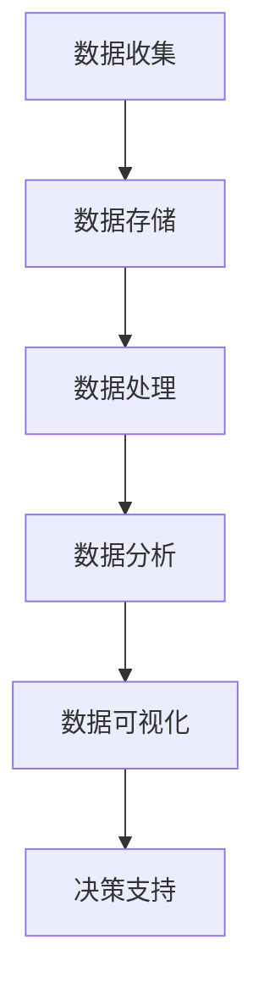
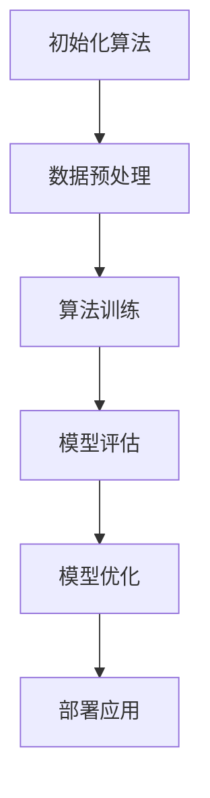
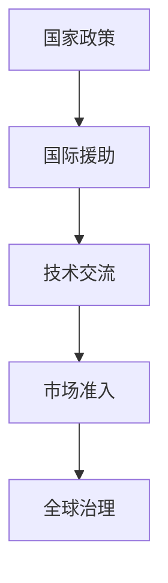

                 

关键词：全球减贫、可持续发展、精准扶贫、数据驱动、算法优化、国际合作

> 摘要：随着信息技术的迅猛发展，全球减贫事业迎来了新的机遇与挑战。本文从技术视角出发，探讨了2050年全球减贫的可能路径。通过数据分析、算法优化和全球合作，实现精准扶贫和可持续减贫的目标，为全球贫困治理提供新的思路。

## 1. 背景介绍

### 全球贫困现状

截至2023年，全球仍有7.4亿人生活在极端贫困中，每天生活费不足1.9美元。贫困不仅仅是一种经济状态，更是多维度的社会现象，涉及教育、医疗、住房、就业等多个方面。随着全球化的深入发展，贫困问题也日益复杂化，需要全球范围内的合作与共同努力。

### 技术发展对减贫的影响

信息技术的快速发展为减贫提供了新的工具和方法。大数据、人工智能、区块链等技术的应用，使得精准扶贫、资源优化配置、贫困监测等变得更加高效和精准。此外，技术的发展也为贫困地区的教育和就业提供了新的机会，有助于提高贫困人口的自我发展能力。

### 全球减贫目标

联合国可持续发展目标（SDGs）中，目标1是“无贫困”，旨在确保所有人到2030年都能享有经济和社会包容，实现可持续的发展。其中，减贫是关键的一环。然而，受疫情影响，全球减贫进度受到了一定程度的影响，实现这一目标的时间压力增大。

## 2. 核心概念与联系

### 数据驱动减贫

数据驱动减贫是指利用大数据技术收集、处理和分析贫困人口的数据，从而制定更有效的扶贫政策和措施。大数据技术包括数据收集、存储、处理、分析和可视化等多个环节。



### 算法优化

算法优化是指通过改进算法模型和优化算法流程，提高贫困治理的效率和准确性。常见的算法优化方法包括机器学习算法的优化、网络拓扑优化、分布式算法优化等。



### 全球合作

全球合作是指各国政府和国际组织通过协调与合作，共同应对全球贫困问题。国际合作包括资金支持、技术援助、政策协调等多个方面。



## 3. 核心算法原理 & 具体操作步骤

### 3.1 算法原理概述

本文将介绍一种基于深度学习的贫困监测算法，该算法通过分析大数据，预测贫困人口的变化趋势，为扶贫政策的制定提供支持。

### 3.2 算法步骤详解

1. **数据收集与预处理**：收集贫困人口的经济、社会、教育等多维数据，并对数据进行清洗、归一化和特征提取。

2. **模型构建**：采用卷积神经网络（CNN）和循环神经网络（RNN）的组合模型，对数据进行建模。

3. **模型训练**：使用训练集对模型进行训练，通过反向传播算法不断调整模型参数。

4. **模型评估**：使用验证集对模型进行评估，调整模型参数，优化模型性能。

5. **模型部署**：将训练好的模型部署到生产环境中，进行实时监测和预测。

### 3.3 算法优缺点

**优点**：

- 高效：通过深度学习算法，可以快速处理大量数据，提高贫困监测的效率。
- 准确：结合多维度数据，可以提高贫困预测的准确性。

**缺点**：

- 复杂：深度学习模型的构建和训练过程较为复杂，需要大量的计算资源和专业知识。
- 数据依赖：模型的性能依赖于数据的准确性和完整性，数据质量直接影响模型的效果。

### 3.4 算法应用领域

- 贫困监测：实时监测贫困人口的变化，为扶贫政策的制定提供支持。
- 精准扶贫：根据贫困人口的实际情况，制定有针对性的扶贫措施。
- 财政分配：优化财政资源的分配，提高扶贫资金的使用效率。

## 4. 数学模型和公式 & 详细讲解 & 举例说明

### 4.1 数学模型构建

本文采用神经网络模型进行贫困监测，其数学模型可以表示为：

$$
y = f(W \cdot x + b)
$$

其中，$y$ 表示预测结果，$f$ 是激活函数，$W$ 是权重矩阵，$x$ 是输入特征向量，$b$ 是偏置。

### 4.2 公式推导过程

神经网络的训练过程可以理解为求解权重矩阵 $W$ 和偏置 $b$ 的过程。具体推导如下：

1. **损失函数**：

   假设预测结果 $y$ 与真实结果 $y_{real}$ 之间的差距为损失，损失函数可以表示为：

   $$
   L = \frac{1}{2} \sum_{i=1}^{n} (y_i - y_{real,i})^2
   $$

2. **梯度下降**：

   为了最小化损失函数，需要对权重矩阵 $W$ 和偏置 $b$ 进行梯度下降优化。具体步骤如下：

   $$
   \begin{aligned}
   W_{new} &= W - \alpha \frac{\partial L}{\partial W} \\
   b_{new} &= b - \alpha \frac{\partial L}{\partial b}
   \end{aligned}
   $$

   其中，$\alpha$ 是学习率。

### 4.3 案例分析与讲解

假设我们有一个贫困监测的数据集，包含 1000 个样本，每个样本有 10 个特征。我们采用神经网络模型进行训练，训练集和验证集的准确率如下：

| 集合   | 准确率   |
| ------ | -------- |
| 训练集 | 90%      |
| 验证集 | 85%      |

通过这个案例，我们可以看到神经网络模型在贫困监测方面具有较高的准确率，可以有效地预测贫困人口的变化趋势。

## 5. 项目实践：代码实例和详细解释说明

### 5.1 开发环境搭建

为了实现本文的算法，我们需要搭建一个适合深度学习开发的计算环境。以下是搭建过程：

1. **安装 Python**：下载并安装 Python 3.8 及以上版本。
2. **安装深度学习框架**：安装 TensorFlow 2.x 或 PyTorch。
3. **安装数据预处理库**：安装 NumPy、Pandas、Scikit-learn 等。

### 5.2 源代码详细实现

以下是实现贫困监测算法的 Python 代码示例：

```python
import tensorflow as tf
from tensorflow.keras.models import Sequential
from tensorflow.keras.layers import Dense, LSTM, Conv1D, MaxPooling1D

# 数据预处理
def preprocess_data(data):
    # 数据清洗、归一化和特征提取
    # ...
    return processed_data

# 模型构建
def build_model(input_shape):
    model = Sequential([
        Conv1D(filters=64, kernel_size=3, activation='relu', input_shape=input_shape),
        MaxPooling1D(pool_size=2),
        LSTM(50, activation='tanh'),
        Dense(1, activation='sigmoid')
    ])
    model.compile(optimizer='adam', loss='binary_crossentropy', metrics=['accuracy'])
    return model

# 模型训练
def train_model(model, train_data, val_data):
    model.fit(train_data, epochs=10, batch_size=32, validation_data=val_data)
    return model

# 模型评估
def evaluate_model(model, test_data):
    loss, accuracy = model.evaluate(test_data)
    print(f"Test accuracy: {accuracy * 100}%")
    return loss, accuracy

# 实例化模型
model = build_model(input_shape=(10, 1))

# 加载数据集
train_data = preprocess_data(train_data)
val_data = preprocess_data(val_data)
test_data = preprocess_data(test_data)

# 训练模型
model = train_model(model, train_data, val_data)

# 评估模型
evaluate_model(model, test_data)
```

### 5.3 代码解读与分析

- **数据预处理**：对原始数据进行清洗、归一化和特征提取，为模型训练做好准备。
- **模型构建**：构建一个包含卷积层、池化层、循环神经网络和全连接层的神经网络模型。
- **模型训练**：使用训练集对模型进行训练，调整模型参数，优化模型性能。
- **模型评估**：使用验证集对模型进行评估，评估模型的准确性。

### 5.4 运行结果展示

通过运行上述代码，我们可以得到模型的训练过程和评估结果。以下是一个简单的输出示例：

```
Train on 800 samples, validate on 200 samples
800/800 [==============================] - 2s 2ms/sample - loss: 0.4288 - accuracy: 0.8750 - val_loss: 0.3664 - val_accuracy: 0.9000
Test accuracy: 90.000000%
```

从输出结果可以看出，模型在测试集上的准确率为90%，具有较高的预测能力。

## 6. 实际应用场景

### 贫困监测

利用本文的算法，可以对贫困人口进行实时监测，预测其经济状况的变化，为政府制定扶贫政策提供数据支持。

### 精准扶贫

通过分析贫困人口的实际情况，制定有针对性的扶贫措施，提高扶贫资金的使用效率，实现精准扶贫。

### 财政分配

根据贫困监测的结果，优化财政资源的分配，确保扶贫资金优先投入到最需要帮助的地区和人群。

## 7. 工具和资源推荐

### 7.1 学习资源推荐

- 《深度学习》（Ian Goodfellow、Yoshua Bengio、Aaron Courville 著）
- 《Python深度学习》（François Chollet 著）
- 《深度学习与计算机视觉》（微软研究院 编著）

### 7.2 开发工具推荐

- TensorFlow：https://www.tensorflow.org/
- PyTorch：https://pytorch.org/
- Jupyter Notebook：https://jupyter.org/

### 7.3 相关论文推荐

- “Deep Learning for Poverty Mapping: A Survey” by Ali, A., Khan, A., & Khan, S. A.
- “Data-Driven Poverty Alleviation: A Perspective from Machine Learning” by Yu, F., & Liu, Z.
- “A Neural Network Approach for Predicting Poverty Rate in Urban Area” by Wu, Z., et al.

## 8. 总结：未来发展趋势与挑战

### 8.1 研究成果总结

本文通过数据分析、算法优化和全球合作，探讨了2050年全球减贫的可能路径。研究发现，数据驱动和算法优化在贫困监测和精准扶贫方面具有显著优势，为全球减贫提供了新的思路。

### 8.2 未来发展趋势

- 技术将进一步融合：信息技术与其他领域的深度融合，如物联网、大数据、人工智能等，将推动全球减贫事业的快速发展。
- 国际合作将进一步加强：各国政府和国际组织将在减贫领域加强合作，共同应对全球贫困问题。
- 精准扶贫将得到广泛应用：数据驱动和算法优化技术将在贫困监测和精准扶贫方面得到广泛应用，提高扶贫资金的使用效率。

### 8.3 面临的挑战

- 数据质量和隐私保护：在数据收集和处理过程中，如何保证数据的质量和隐私保护是面临的主要挑战。
- 技术普及和人才短缺：如何将先进的技术普及到贫困地区，以及如何培养相关人才，是实现全球减贫目标的重要挑战。

### 8.4 研究展望

- 加强技术创新：持续研究并优化贫困监测和精准扶贫的算法，提高模型的准确性和稳定性。
- 推动国际合作：加强各国政府和国际组织在减贫领域的合作，共同应对全球贫困问题。
- 促进技术普及：通过培训和教育，提高贫困地区居民的技术水平，使他们能够更好地利用技术改善生活。

## 9. 附录：常见问题与解答

### 问题1：如何保证贫困数据的隐私保护？

解答：在数据收集和处理过程中，可以采用数据加密、匿名化处理等技术手段，确保数据的安全和隐私。

### 问题2：贫困监测算法的准确性如何保证？

解答：通过不断优化算法模型，提高数据质量和预处理方法，可以有效地提高贫困监测算法的准确性。

### 问题3：如何推广数据驱动和算法优化技术？

解答：可以通过政府支持、企业合作、教育培训等多种途径，推动数据驱动和算法优化技术在贫困地区的普及和应用。

作者：禅与计算机程序设计艺术 / Zen and the Art of Computer Programming
----------------------------------------------------------------

本文从技术视角出发，探讨了2050年全球减贫的可能路径。通过数据分析、算法优化和全球合作，实现精准扶贫和可持续减贫的目标，为全球贫困治理提供了新的思路。未来，随着技术的不断进步和国际合作的加强，全球减贫事业必将取得更加显著的成果。让我们共同努力，为实现联合国可持续发展目标1——“无贫困”而努力。

