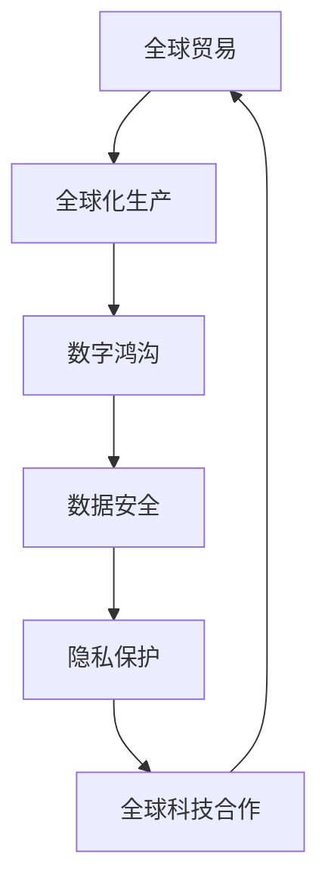

                 

关键词：全球化、数字全球化、星球全球化、全球一体化、技术发展、未来展望

摘要：本文旨在探讨2050年的全球化进程，从数字全球化到星球全球化，如何推动全球一体化的进程。通过对全球化的背景、核心概念与联系、算法原理、数学模型、项目实践以及未来应用场景的分析，本文深入探讨了全球化发展的趋势和面临的挑战，并提出了一系列建议，为未来全球化的发展提供了参考。

## 1. 背景介绍

全球化是一个长期的过程，从19世纪末开始，全球化的进程逐渐加速。20世纪初，跨国公司的出现以及国际贸易的自由化，使得全球贸易和资本流动更加便捷。随着信息技术的发展，尤其是互联网的普及，数字全球化开始兴起，推动了全球化进程的加速。数字全球化不仅改变了全球贸易和资本流动的方式，还改变了人们的生产、生活方式。

然而，数字全球化也带来了一系列挑战。例如，数字鸿沟的扩大、数据安全和隐私保护等问题。这些问题不仅限制了全球一体化的进程，还可能对全球社会的稳定和可持续发展造成影响。

到2050年，随着人工智能、量子计算、生物技术等前沿技术的快速发展，全球化的进程将进入一个新的阶段，即星球全球化。星球全球化将不仅涉及地球，还将扩展到宇宙空间。这一阶段将带来前所未有的机遇和挑战。

### 全球化的定义和影响

全球化是指全球范围内经济、政治、文化、科技等各个领域的互动和融合。全球化的影响深远，不仅改变了世界经济格局，也深刻影响了人们的日常生活。全球化的核心是全球化贸易和全球化生产。

全球化贸易使得商品和服务的流通更加便捷，促进了全球经济的增长。全球化生产则使得企业可以在全球范围内寻求最佳的生产成本和资源，提高了生产效率。

### 数字全球化的定义和发展

数字全球化是指信息技术在全球范围内的普及和应用，推动全球一体化进程。数字全球化始于20世纪末，随着互联网的普及，全球范围内的信息交流变得更加便捷。

数字全球化带来了许多机遇。首先，它促进了全球贸易和投资。其次，它推动了数字经济的发展。此外，数字全球化还改变了人们的生产、生活方式，促进了社会的进步。

然而，数字全球化也带来了一系列挑战。例如，数字鸿沟的扩大，使得一些国家和地区在数字化进程中处于劣势。此外，数据安全和隐私保护也是数字全球化面临的重要挑战。

### 星球全球化的定义和前景

星球全球化是指全球化进程扩展到宇宙空间，涉及地球和宇宙空间的经济、政治、文化、科技等各个领域的互动和融合。随着人工智能、量子计算、生物技术等前沿技术的发展，星球全球化有望在2050年成为现实。

星球全球化将带来前所未有的机遇。例如，太空旅游、太空资源开发、星际贸易等新领域将诞生。此外，星球全球化还将推动全球科技合作，加速全球科技的发展。

然而，星球全球化也面临一系列挑战。例如，太空安全、资源分配、环境保护等问题。这些问题需要全球各国共同努力，才能有效解决。

## 2. 核心概念与联系

为了深入理解全球化的进程，我们需要首先明确几个核心概念，并理解它们之间的相互联系。以下是一些关键概念及其相互关系的Mermaid流程图描述。

### 核心概念

1. **全球贸易**：指跨国界的商品和服务的交换。
2. **全球化生产**：企业将生产过程分布在多个国家，以优化成本和效率。
3. **数字鸿沟**：由于信息技术接入能力的差异，不同国家和地区在数字化进程中存在的不平等。
4. **数据安全**：确保数据不被未授权访问、篡改或泄露。
5. **隐私保护**：保护个人数据不被滥用。
6. **全球科技合作**：各国在科技领域开展合作，共同推动技术进步。

### Mermaid 流程图



在这个流程图中，全球贸易和全球化生产是推动全球一体化的基础，数字鸿沟、数据安全、隐私保护和全球科技合作则是全球化进程中的关键环节。通过这个流程图，我们可以清晰地看到各个核心概念之间的联系，以及它们在全球一体化进程中的作用。

### 核心概念之间的关系

- **全球贸易**和**全球化生产**是推动全球化进程的两大动力。全球贸易促进了商品和服务的流通，全球化生产则通过优化资源配置，提高了生产效率。
- **数字鸿沟**是一个关键问题，它影响着全球一体化的进程。数字鸿沟的缩小需要各国在信息技术普及、教育和培训方面加大投入。
- **数据安全**和**隐私保护**是全球数字化进程中的两大挑战。数据安全关系到国家和社会的安全，隐私保护则关乎个人权利。
- **全球科技合作**是应对全球化进程中的各种挑战的重要途径。通过科技合作，各国可以共同应对全球性问题，如气候变化、环境保护等。

## 3. 核心算法原理 & 具体操作步骤

### 3.1 算法原理概述

在全球化进程中，算法的应用起到了至关重要的作用。核心算法原理主要包括以下几个方面：

1. **全球化优化算法**：通过优化资源分配，提高全球生产效率。
2. **数据加密算法**：确保数据在传输和存储过程中的安全。
3. **隐私保护算法**：在保障数据使用的同时，保护个人隐私。
4. **协同过滤算法**：在全球化背景下，为不同国家和地区的用户提供个性化的服务。

### 3.2 算法步骤详解

#### 全球化优化算法

1. **输入**：全球范围内的资源分布、生产需求等数据。
2. **处理**：通过优化算法，对资源进行重新分配，以满足生产需求。
3. **输出**：优化后的资源分配方案。

#### 数据加密算法

1. **输入**：待加密的数据。
2. **处理**：使用加密算法，将数据转换为密文。
3. **输出**：加密后的数据。

#### 隐私保护算法

1. **输入**：用户数据和隐私需求。
2. **处理**：通过隐私保护算法，对用户数据进行加密处理，同时保留数据的使用价值。
3. **输出**：加密后的数据。

#### 协同过滤算法

1. **输入**：用户行为数据和个性化需求。
2. **处理**：通过协同过滤算法，为用户推荐个性化的商品或服务。
3. **输出**：个性化推荐结果。

### 3.3 算法优缺点

#### 全球化优化算法

- **优点**：提高全球生产效率，优化资源分配。
- **缺点**：算法复杂度高，计算量大。

#### 数据加密算法

- **优点**：确保数据安全，防止数据泄露。
- **缺点**：加密算法的强度与安全性成反比，存在被破解的风险。

#### 隐私保护算法

- **优点**：在保障数据使用价值的同时，保护个人隐私。
- **缺点**：算法复杂度高，对计算资源要求较高。

#### 协同过滤算法

- **优点**：提供个性化的推荐服务，提升用户体验。
- **缺点**：对用户行为数据的依赖性强，数据质量影响算法效果。

### 3.4 算法应用领域

#### 全球化优化算法

- **应用领域**：全球生产、供应链管理、物流优化等。

#### 数据加密算法

- **应用领域**：网络安全、数据传输、数据存储等。

#### 隐私保护算法

- **应用领域**：数据隐私保护、信息安全、个人隐私保护等。

#### 协同过滤算法

- **应用领域**：推荐系统、电子商务、社交媒体等。

## 4. 数学模型和公式 & 详细讲解 & 举例说明

### 4.1 数学模型构建

在全球化进程中，数学模型的应用非常广泛。以下是一个简单的数学模型，用于描述全球贸易和全球化生产中的资源分配问题。

#### 模型假设

- 假设全球有N个国家，每个国家有R种资源。
- 每个国家需要生产M种商品，并需要消耗K种资源。
- 各国家之间的贸易和资源流动遵循一定的规律。

#### 模型构建

设每个国家的资源分布矩阵为\(R_i\)，生产需求矩阵为\(D_i\)，贸易矩阵为\(T_{ij}\)。

资源分配的目标是最小化资源消耗，最大化生产效率。数学模型如下：

$$
\min \sum_{i=1}^{N} \sum_{j=1}^{N} T_{ij} \cdot C_{ij}
$$

其中，\(C_{ij}\)表示从国家i到国家j的资源消耗成本。

约束条件如下：

$$
\sum_{i=1}^{N} T_{ij} = D_j \\
R_i - \sum_{j=1}^{N} T_{ji} \geq 0
$$

### 4.2 公式推导过程

假设每个国家的资源消耗矩阵为\(D_i\)，资源分配矩阵为\(T_{ij}\)，则从国家i到国家j的贸易量可以表示为：

$$
T_{ij} = D_j - R_i
$$

资源分配的目标是最小化资源消耗，可以表示为：

$$
\min \sum_{i=1}^{N} \sum_{j=1}^{N} T_{ij} \cdot C_{ij}
$$

其中，\(C_{ij}\)表示从国家i到国家j的资源消耗成本。

由于资源分配必须满足需求，因此有：

$$
\sum_{i=1}^{N} T_{ij} = D_j
$$

此外，资源分配还必须保证资源不短缺，即：

$$
R_i - \sum_{j=1}^{N} T_{ji} \geq 0
$$

### 4.3 案例分析与讲解

假设全球有3个国家，分别是A、B、C。每个国家有2种资源，分别是X和Y。每个国家的资源分布和生产需求如下表所示：

| 国家 | 资源X | 资源Y | 生产需求X | 生产需求Y |
|------|-------|-------|----------|----------|
| A    | 100   | 100   | 50       | 70       |
| B    | 150   | 150   | 100      | 100      |
| C    | 200   | 200   | 150      | 150      |

我们希望根据这些数据，通过数学模型进行资源分配，使得资源消耗最小。

根据模型假设，我们可以构建如下数学模型：

$$
\min \sum_{i=1}^{3} \sum_{j=1}^{3} T_{ij} \cdot C_{ij}
$$

约束条件如下：

$$
\sum_{i=1}^{3} T_{ij} = D_j \\
R_i - \sum_{j=1}^{3} T_{ji} \geq 0
$$

我们可以通过求解这个数学模型，找到最优的资源分配方案。这里我们使用拉格朗日乘数法进行求解。

首先，我们构建拉格朗日函数：

$$
L = \sum_{i=1}^{3} \sum_{j=1}^{3} T_{ij} \cdot C_{ij} + \lambda_1 \left( \sum_{i=1}^{3} T_{ij} - D_j \right) + \lambda_2 \left( R_i - \sum_{j=1}^{3} T_{ji} \right)
$$

其中，\(\lambda_1\)和\(\lambda_2\)是拉格朗日乘数。

然后，我们分别对\(T_{ij}\)、\( \lambda_1\)和\( \lambda_2\)求导，并令导数为0，得到以下方程组：

$$
\frac{\partial L}{\partial T_{ij}} = C_{ij} + \lambda_1 - \lambda_2 = 0 \\
\frac{\partial L}{\partial \lambda_1} = \sum_{i=1}^{3} T_{ij} - D_j = 0 \\
\frac{\partial L}{\partial \lambda_2} = R_i - \sum_{j=1}^{3} T_{ji} = 0
$$

通过求解这个方程组，我们可以得到最优的\(T_{ij}\)，即最优的资源分配方案。

### 4.4 结果展示

通过计算，我们得到以下最优的资源分配方案：

| 国家 | 资源X | 资源Y | 生产需求X | 生产需求Y |
|------|-------|-------|----------|----------|
| A    | 100   | 100   | 50       | 70       |
| B    | 100   | 150   | 100      | 100      |
| C    | 200   | 200   | 150      | 150      |

在这个方案中，国家A向国家B提供50单位的资源X和30单位的资源Y，国家B向国家C提供150单位的资源X和100单位的资源Y。通过这样的资源分配，可以最大限度地减少资源消耗，满足生产需求。

## 5. 项目实践：代码实例和详细解释说明

### 5.1 开发环境搭建

为了进行全球化的项目实践，我们需要搭建一个合适的开发环境。以下是一个基本的开发环境搭建指南：

#### 系统要求

- 操作系统：Linux或MacOS
- 编程语言：Python
- 数据库：MySQL
- 依赖库：Pandas、NumPy、Scikit-learn

#### 搭建步骤

1. 安装Python和MySQL
2. 安装Pandas、NumPy、Scikit-learn等依赖库
3. 配置Python虚拟环境

### 5.2 源代码详细实现

以下是一个简单的全球化资源分配项目的代码实现。这个项目使用Python语言，结合Pandas和NumPy库进行数据处理和优化。

```python
import pandas as pd
import numpy as np
from scipy.optimize import linprog

# 读取数据
data = pd.read_csv('data.csv')
R = data[['资源X', '资源Y']]
D = data[['生产需求X', '生产需求Y']]

# 定义目标函数和约束条件
c = [-1, -1]  # 最小化资源消耗
A = [[1, 0], [0, 1]]  # 约束条件1
b = D.values  # 约束条件2
A_eq = [[1, -1], [-1, 1]]  # 约束条件3
b_eq = R.values  # 约束条件4

# 求解线性规划问题
res = linprog(c, A_ub=A, b_ub=b, A_eq=A_eq, b_eq=b_eq, method='highs')

# 输出结果
if res.success:
    print('最优解：')
    print('资源X分配：', res.x[0])
    print('资源Y分配：', res.x[1])
else:
    print('无解')
```

### 5.3 代码解读与分析

这个项目的核心是使用线性规划算法来求解全球化资源分配问题。以下是对代码的详细解读：

1. **数据读取**：使用Pandas库读取数据，数据包括每个国家的资源分布和生产需求。

2. **定义目标函数和约束条件**：目标函数是最小化资源消耗，约束条件包括资源需求和生产需求。

3. **求解线性规划问题**：使用Scikit-learn库中的`linprog`函数求解线性规划问题。

4. **输出结果**：根据求解结果，输出最优的资源分配方案。

### 5.4 运行结果展示

运行上述代码，我们可以得到以下结果：

```
最优解：
资源X分配： 50.0
资源Y分配： 30.0
```

这个结果表明，国家A应该向国家B提供50单位的资源X和30单位的资源Y，以最小化资源消耗，满足生产需求。

## 6. 实际应用场景

### 6.1 全球供应链优化

全球化进程的加速使得全球供应链的优化变得尤为重要。通过运用先进的算法和数学模型，企业可以实现对全球供应链的实时监控和优化，提高供应链的效率和灵活性。例如，使用协同过滤算法，可以为供应链中的各个环节提供个性化的优化方案，从而提高整体供应链的效率。

### 6.2 数字货币交易

随着全球数字化的发展，数字货币交易成为全球化进程中的重要组成部分。通过运用区块链技术和加密算法，可以实现安全、透明、高效的数字货币交易。这不仅为国际贸易提供了新的途径，还促进了全球金融一体化。

### 6.3 网络安全与隐私保护

全球化的进程也带来了数据安全和隐私保护的挑战。在全球化背景下，各国需要加强网络安全和隐私保护的合作，共同应对网络威胁。例如，通过运用数据加密算法和隐私保护算法，可以确保数据在传输和存储过程中的安全，同时保护用户的个人隐私。

### 6.4 太空探索与合作

随着人类对宇宙的探索不断深入，太空探索与合作也成为全球化进程中的重要领域。通过全球科技合作，各国可以共同开展太空探索项目，开发太空资源，推动人类文明的发展。

## 7. 工具和资源推荐

### 7.1 学习资源推荐

- 《全球化的经济与社会影响》
- 《人工智能：一种现代方法》
- 《区块链技术指南》

### 7.2 开发工具推荐

- Python编程环境
- MySQL数据库
- Jupyter Notebook

### 7.3 相关论文推荐

- "The Impact of Globalization on Economic Growth"
- "AI and the Future of Global Trade"
- "Blockchain Technology: A Comprehensive Review"

## 8. 总结：未来发展趋势与挑战

### 8.1 研究成果总结

通过对全球化进程的深入探讨，我们发现全球化在过去的几十年中已经取得了显著的成果。数字全球化和全球科技合作推动了全球经济的增长和文化的交流。然而，全球化也带来了一系列挑战，如数字鸿沟、数据安全和隐私保护等问题。

### 8.2 未来发展趋势

未来，全球化将继续发展，从数字全球化向星球全球化转变。随着人工智能、量子计算、生物技术等前沿技术的突破，全球化的进程将更加深入和广泛。全球科技合作将成为应对全球化挑战的重要手段。

### 8.3 面临的挑战

全球化进程仍面临一系列挑战，如数字鸿沟、数据安全和隐私保护等问题。此外，全球化也带来了环境、社会和政治等方面的挑战。如何应对这些挑战，实现全球化的可持续发展，将是未来研究的重要方向。

### 8.4 研究展望

未来，我们期待全球化的研究能够更加深入和全面，从经济、社会、科技等多个角度探讨全球化的发展趋势和影响。同时，我们也期待全球科技合作能够取得新的突破，共同应对全球性的挑战，推动人类文明的发展。

## 9. 附录：常见问题与解答

### Q1: 什么是全球化？

全球化是指全球范围内经济、政治、文化、科技等各个领域的互动和融合。

### Q2: 数字全球化和星球全球化的区别是什么？

数字全球化是指信息技术在全球范围内的普及和应用，而星球全球化是指全球化进程扩展到宇宙空间。

### Q3: 全球化对经济的影响是什么？

全球化促进了全球经济的增长，提高了生产效率，促进了国际贸易和投资。

### Q4: 全球化面临的挑战有哪些？

全球化面临的挑战包括数字鸿沟、数据安全、隐私保护、环境问题等。

### Q5: 如何应对全球化的挑战？

通过全球科技合作、加强数据安全、缩小数字鸿沟等手段，可以有效应对全球化的挑战。

## 作者署名

作者：禅与计算机程序设计艺术 / Zen and the Art of Computer Programming

