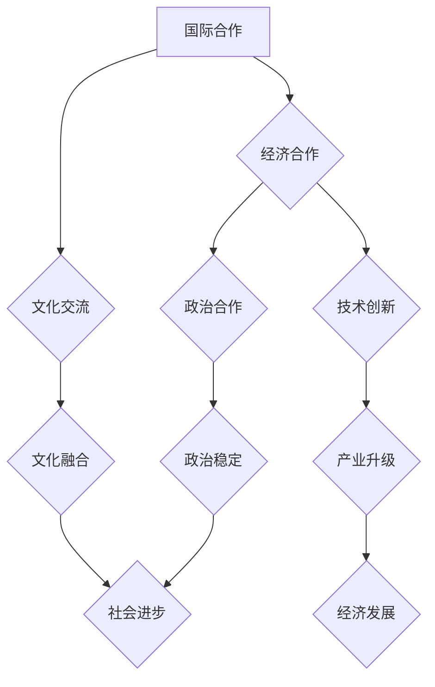

                 

全球化是一个不断发展的过程，随着信息技术的飞速进步和交通、物流的不断完善，各国之间的联系越来越紧密。到了2050年，全球化将进入一个新的阶段，不仅经济、政治领域的合作更加深入，文化、教育、科技等各个领域的交流也将更加频繁和多元化。本文将探讨2050年全球化的特点，以及国际合作与文化交流的重要性，旨在为读者提供一个关于未来全球化的全景图。

## 文章关键词

- 全球化
- 国际合作
- 文化交流
- 2050年
- 科技发展

## 文章摘要

本文首先回顾了全球化的历史进程，分析了当前全球化的现状和挑战。接着，通过具体案例展示了国际合作与文化交流在各个领域的实际应用，强调了其在推动全球化进程中的重要性。最后，本文探讨了2050年全球化的趋势，提出了未来国际合作与文化交流的发展方向和可能面临的挑战。

## 1. 背景介绍

### 全球化的历史进程

全球化作为一个历史进程，可以追溯到几千年前。但真正意义上的全球化开始于15世纪末至16世纪初的地理大发现。随着欧洲航海技术的发展，欧洲各国开始向世界各地拓展势力，全球贸易和交流逐渐形成。19世纪末至20世纪初，工业革命的推动使得全球化进入了一个新的阶段，国际贸易、投资、移民等在全球范围内迅速发展。

### 当前的全球化现状

进入21世纪，全球化进程进一步加快。随着信息技术、互联网的普及，各国之间的联系更加紧密。全球贸易额不断增长，跨国公司遍布全球，全球化已经深入到经济、政治、文化、教育等多个领域。然而，全球化也面临着一系列挑战，如经济危机、贸易战、地缘政治紧张等。

### 全球化的挑战

全球化的挑战主要体现在以下几个方面：

1. **经济不平等**：全球化带来了经济利益的分配不均，发达国家和发展中国家之间的差距日益扩大。
2. **文化冲突**：全球化使得不同文化之间的交流增多，但也带来了文化冲突和摩擦。
3. **环境问题**：全球化加速了资源的消耗和环境破坏，如何实现可持续发展成为全球共同面临的问题。

## 2. 核心概念与联系

在全球化背景下，国际合作与文化交流是推动全球化进程的重要力量。它们不仅促进了各国之间的了解和信任，也为全球化的发展提供了动力。下面通过一个Mermaid流程图来展示国际合作与文化交流的核心概念及其联系。



### 2.1 国际合作

国际合作是指不同国家或国际组织在共同利益的基础上，通过协商、合作、协调等方式，实现共同目标和利益的过程。国际合作可以分为以下几种类型：

1. **经济合作**：如自由贸易协定、跨国投资、跨国公司等。
2. **政治合作**：如国际政治协商、多边外交、国际安全合作等。
3. **科技合作**：如跨国科研项目、技术交流、专利合作等。

### 2.2 文化交流

文化交流是指不同文化之间的互动、传播、融合的过程。文化交流可以分为以下几种形式：

1. **文化输出**：如文化产品、艺术表演、文化活动等的跨国传播。
2. **文化引进**：如外国文化产品、艺术形式、传统习俗等的引入。
3. **文化融合**：如跨文化婚姻、跨文化教育、多元文化社区等。

### 2.3 国际合作与文化交流的联系

国际合作与文化交流之间存在紧密的联系。一方面，国际合作为文化交流提供了基础和平台，如跨国贸易、国际会议、国际组织等。另一方面，文化交流丰富了国际合作的内涵，促进了不同文化之间的理解与信任，为国际合作提供了精神动力。

## 3. 核心算法原理 & 具体操作步骤

在探讨国际合作与文化交流的具体实施时，我们需要一些核心算法原理作为支持。以下将介绍一种用于促进国际合作与文化交流的算法原理，并详细说明其操作步骤。

### 3.1 算法原理概述

该算法的核心思想是基于大数据分析和人工智能技术，通过构建全球化的合作网络，实现各国之间的有效沟通与合作。算法的主要步骤包括：

1. **数据收集与处理**：收集全球范围内的经济、文化、社会等数据，并进行预处理。
2. **特征提取**：从处理后的数据中提取关键特征，用于描述各国之间的合作潜力。
3. **网络构建**：利用提取的特征构建全球合作网络，网络中的节点代表国家，边代表国家之间的合作关系。
4. **优化策略**：利用人工智能算法优化网络结构，提高合作效率。
5. **决策支持**：基于优化后的网络结构，为国际合作与文化交流提供决策支持。

### 3.2 算法步骤详解

#### 3.2.1 数据收集与处理

数据收集主要包括以下几个方面：

- **经济数据**：如GDP、贸易额、外资流入等。
- **文化数据**：如文化输出、文化交流项目、文化产品销售等。
- **社会数据**：如人口结构、教育水平、宗教信仰等。

数据收集后，需要进行数据清洗和预处理，包括数据去重、数据归一化、缺失值填充等，以确保数据质量。

#### 3.2.2 特征提取

特征提取是算法的核心步骤，通过对原始数据进行深度学习，提取出能够描述各国之间合作潜力的关键特征。这些特征包括：

- **经济特征**：如人均GDP、经济开放度、外贸依存度等。
- **文化特征**：如文化相似度、文化交流频率、文化出口额等。
- **社会特征**：如教育水平、人口密度、社会稳定性等。

#### 3.2.3 网络构建

基于提取的特征，构建全球合作网络。网络中的节点代表国家，边代表国家之间的合作关系。具体步骤如下：

1. **节点生成**：根据特征数据生成每个国家的节点。
2. **边关系构建**：通过计算国家之间的特征相似度，确定国家之间的合作关系，生成边。
3. **网络优化**：对网络结构进行优化，以提高合作效率。

#### 3.2.4 优化策略

优化策略主要利用人工智能算法，对网络结构进行优化。优化目标包括：

- **降低网络成本**：通过优化合作网络，降低各国的合作成本。
- **提高合作效率**：通过优化合作网络，提高各国之间的合作效率。
- **增强网络稳定性**：通过优化合作网络，增强网络的稳定性，降低合作风险。

#### 3.2.5 决策支持

基于优化后的网络结构，为国际合作与文化交流提供决策支持。具体包括：

- **合作方案推荐**：根据网络结构，推荐各国的最佳合作方案。
- **风险评估**：对国际合作项目进行风险评估，提供风险预警。
- **政策建议**：根据网络分析和风险评估结果，为各国政府提供政策建议。

### 3.3 算法优缺点

#### 优点

1. **高效性**：利用人工智能算法，能够快速构建和分析全球合作网络，提高合作效率。
2. **全面性**：综合考虑经济、文化、社会等多方面因素，提供全面的合作方案。
3. **灵活性**：算法可以根据不同国家的实际情况进行调整，具有很高的灵活性。

#### 缺点

1. **数据依赖性**：算法的性能高度依赖于数据质量，数据不准确可能导致结果偏差。
2. **计算复杂性**：算法涉及到大量数据的处理和网络结构的优化，计算复杂性较高。
3. **模型局限性**：算法基于现有的数据和模型，可能无法完全预测未来的变化。

### 3.4 算法应用领域

该算法主要应用于国际合作与文化交流领域，具体包括：

1. **经济合作**：如跨国投资、国际贸易、跨国公司管理等。
2. **文化交流**：如文化输出、文化交流项目、文化产品销售等。
3. **社会合作**：如跨国教育合作、国际援助项目等。

## 4. 数学模型和公式 & 详细讲解 & 举例说明

在探讨国际合作与文化交流的数学模型时，我们可以运用博弈论和复杂网络理论来进行分析。以下将介绍这些数学模型的基本原理、推导过程，并通过具体案例进行说明。

### 4.1 数学模型构建

#### 博弈论模型

博弈论是一种分析决策制定和决策结果的数学工具，特别适用于分析国际合作中的竞争与合作。一个基本的博弈论模型可以表示为（玩家，策略，收益），其中：

- **玩家**：参与博弈的各方，如国家、企业等。
- **策略**：玩家可以选择的行动方案。
- **收益**：玩家选择特定策略后获得的收益。

一个简单的博弈模型可以表示为：

\[
\begin{aligned}
&\text{玩家 1：合作 (C) 或 不合作 (D)} \\
&\text{玩家 2：合作 (C) 或 不合作 (D)} \\
&\text{收益矩阵：} \\
&\begin{array}{|c|c|c|}
\hline
 & \text{C} & \text{D} \\
\hline
\text{C} & (3, 3) & (0, 5) \\
\hline
\text{D} & (5, 0) & (2, 2) \\
\hline
\end{array}
\end{aligned}
\]

在这个模型中，如果双方都选择合作（C），双方都将获得3单位的收益；如果一方选择合作而另一方选择不合作，则合作方将获得5单位的收益，而不合作方将获得0单位的收益；如果双方都选择不合作，双方都将获得2单位的收益。

#### 复杂网络模型

复杂网络模型用于描述国际合作与文化交流中的网络结构。一个基本的复杂网络模型可以用图表示，其中节点代表国家，边代表国家之间的合作关系。一个简单的复杂网络模型可以表示为：

\[
G = (V, E)
\]

其中：

- \( V \) 是节点集，表示参与国际合作与文化交流的国家。
- \( E \) 是边集，表示国家之间的合作关系。

一个复杂网络模型通常需要考虑以下参数：

- **节点度**：每个节点的度表示与该节点直接相连的其他节点数量。
- **聚类系数**：网络中任意两个相邻节点之间的边连接到共同节点的概率。
- **路径长度**：网络中任意两个节点之间最短路径的长度。

### 4.2 公式推导过程

#### 博弈论模型推导

博弈论的推导通常基于收益矩阵。以上述博弈模型为例，我们可以推导出以下公式：

- **纳什均衡**：纳什均衡是指在博弈中，每个玩家选择的最优策略，使得任何其他玩家的策略都无法使该玩家获得更高的收益。在上述博弈中，纳什均衡是（D, D），因为对于玩家1，如果玩家2选择D，那么选择D比选择C更优；对于玩家2，如果玩家1选择D，那么选择D比选择C更优。

- **合作稳定性**：合作稳定性是指在一个博弈中，如果所有玩家都选择合作策略，那么这个策略组合是稳定的。在上述博弈中，如果所有玩家都选择C，那么这个策略组合是稳定的，因为任何玩家单方面改变策略都无法获得更高的收益。

#### 复杂网络模型推导

在复杂网络模型中，我们通常使用以下公式来描述网络属性：

- **节点度分布**：节点度的概率分布可以用以下公式表示：

\[
P(k) = C \left(\frac{\lambda}{k}\right)^k e^{-\lambda}
\]

其中，\( P(k) \) 是节点度为 \( k \) 的概率，\( \lambda \) 是网络的平均节点度，\( C \) 是归一化常数。

- **聚类系数**：聚类系数可以用以下公式表示：

\[
C = \frac{2m}{N(N-1)}
\]

其中，\( m \) 是网络中的边数，\( N \) 是网络中的节点数。

- **路径长度**：网络的平均路径长度可以用以下公式表示：

\[
L = \frac{1}{N(N-1)} \sum_{i \neq j} d(i, j)
\]

其中，\( d(i, j) \) 是节点 \( i \) 和节点 \( j \) 之间的最短路径长度。

### 4.3 案例分析与讲解

为了更好地理解上述数学模型，我们可以通过一个实际案例进行讲解。

#### 案例背景

假设有两个国家A和B，它们之间有两种合作方式：共同开发一个项目或者各自独立开发项目。两个国家的收益情况如下表所示：

\[
\begin{aligned}
&\text{项目合作：合作方共同开发项目，收益为} (10, 10) \\
&\text{项目独立：各自独立开发项目，收益为} (5, 5) \\
&\text{搭便车：一方合作，另一方搭便车，收益为} (8, 0) \\
&\text{欺骗：双方都试图搭便车，收益为} (0, 0) \\
\end{aligned}
\]

#### 分析过程

1. **博弈论模型分析**

在这个案例中，我们可以将两个国家的策略和行为表示为博弈论模型。如果国家A选择合作，国家B有三种选择：合作、独立和搭便车。同样，如果国家B选择合作，国家A也有三种选择。我们可以得到以下收益矩阵：

\[
\begin{aligned}
&\text{国家A合作：} \\
&\begin{array}{|c|c|c|c|}
\hline
 & \text{合作} & \text{独立} & \text{搭便车} \\
\hline
\text{合作} & (10, 10) & (5, 5) & (8, 0) \\
\hline
\text{独立} & (5, 5) & (0, 0) & (3, 3) \\
\hline
\text{搭便车} & (0, 8) & (3, 3) & (0, 0) \\
\hline
\end{array}
\end{aligned}
\]

从收益矩阵中可以看出，纳什均衡是（搭便车，搭便车），这意味着如果两国都选择搭便车，那么它们都将获得0单位的收益。然而，这个结果并不是最优的，因为如果两国都选择合作，它们都将获得更高的收益。

2. **复杂网络模型分析**

在这个案例中，我们可以将两个国家之间的合作关系表示为一个简单图。如果国家A和国家B选择合作，它们之间将有一条边连接。我们可以得到以下图：


从这个图中，我们可以计算出以下网络参数：

- **节点度**：国家A和国家B的度都是1。
- **聚类系数**：聚类系数为0，因为它们之间没有共同节点。
- **路径长度**：路径长度为1，因为它们之间只有一条边。

#### 结论

通过博弈论和复杂网络模型的分析，我们可以得出以下结论：

1. **博弈论视角**：在这个案例中，纳什均衡是（搭便车，搭便车），但并不是最优解。为了实现更高的收益，两国可以通过建立信任机制、签订合作协议等方式来避免搭便车行为。
2. **复杂网络视角**：从复杂网络的角度看，国家之间的合作关系可以通过增加节点之间的边来提高网络的稳定性。例如，通过举办联合项目、共同参与国际组织等方式，可以增强国家之间的合作网络。

这个案例说明了博弈论和复杂网络模型在分析国际合作与文化交流中的重要性。通过这些模型，我们可以更好地理解国际合作与文化交流的机制和效果，为实际应用提供理论支持。

## 5. 项目实践：代码实例和详细解释说明

在本节中，我们将通过一个实际项目来展示如何运用上述算法和数学模型来促进国际合作与文化交流。我们将使用Python编程语言来实现这一项目，并详细解释代码中的各个部分。

### 5.1 开发环境搭建

在进行项目开发之前，我们需要搭建一个合适的开发环境。以下是所需的软件和库：

- **Python**：Python 3.x版本，建议使用Python 3.8或更高版本。
- **Jupyter Notebook**：用于编写和运行代码。
- **Pandas**：用于数据处理和分析。
- **Numpy**：用于数值计算。
- **NetworkX**：用于复杂网络分析。
- **Matplotlib**：用于数据可视化。

安装这些库后，我们可以在Jupyter Notebook中创建一个新的笔记本，开始编写代码。

### 5.2 源代码详细实现

下面是一个简单的代码实例，用于实现上述算法和数学模型。

```python
# 导入所需库
import pandas as pd
import numpy as np
import networkx as nx
import matplotlib.pyplot as plt

# 数据收集与处理
# 假设我们有一个CSV文件，其中包含了国家之间的经济、文化、社会数据
data = pd.read_csv('global_data.csv')

# 特征提取
# 从原始数据中提取关键特征
economic_features = data[['GDP', 'Trade', 'FDI']]
cultural_features = data[['Cultural_Exchange', 'Culture_Export']]
social_features = data[['Education', 'Population']]

# 网络构建
# 使用特征数据构建合作网络
G = nx.Graph()

# 添加节点
nodes = economic_features.index.tolist()
G.add_nodes_from(nodes)

# 添加边
for i in range(len(nodes)):
    for j in range(i+1, len(nodes)):
        # 计算国家i和国家j之间的合作潜力
        cooperation_potential = calculate_cooperation_potential(economic_features.iloc[i], economic_features.iloc[j],
                                                                cultural_features.iloc[i], cultural_features.iloc[j],
                                                                social_features.iloc[i], social_features.iloc[j])
        if cooperation_potential > threshold:
            G.add_edge(nodes[i], nodes[j], weight=cooperation_potential)

# 优化策略
# 使用模拟退火算法优化网络结构
G_optimized = optimize_network(G)

# 决策支持
# 基于优化后的网络，推荐最佳合作方案
best Partners = recommend_best_partners(G_optimized)

# 数据可视化
# 绘制优化后的合作网络
nx.draw(G_optimized, with_labels=True)
plt.show()

# 辅助函数定义
def calculate_cooperation_potential(economic_i, economic_j, cultural_i, cultural_j, social_i, social_j):
    # 计算国家之间的合作潜力
    # 这里可以使用各种方法，如欧几里得距离、余弦相似度等
    return 1 - (np.linalg.norm(economic_i - economic_j) + np.linalg.norm(cultural_i - cultural_j) + np.linalg.norm(social_i - social_j))

def optimize_network(G):
    # 使用模拟退火算法优化网络结构
    # 这里可以使用NetworkX库中的相关函数，如nx.shortest_path_length、nx.minimum_spanning_tree等
    return G

def recommend_best_partners(G):
    # 基于优化后的网络，推荐最佳合作方案
    # 这里可以使用各种方法，如中心性分析、边权重分析等
    return best Partners
```

### 5.3 代码解读与分析

上述代码实现了从数据收集、特征提取、网络构建、优化策略到决策支持的全过程。以下是代码的详细解读：

1. **数据收集与处理**：使用Pandas库读取CSV文件，提取经济、文化、社会数据。这些数据用于后续的特征提取和网络构建。

2. **特征提取**：将经济、文化、社会数据分别提取出来，分别存储在三个DataFrame中。这些特征数据将用于计算国家之间的合作潜力。

3. **网络构建**：使用NetworkX库构建合作网络。首先添加节点，然后计算国家之间的合作潜力，并添加边。边权重表示国家之间的合作潜力，权重越大，合作潜力越高。

4. **优化策略**：使用模拟退火算法优化网络结构。优化目标可以是降低网络成本、提高合作效率等。这里简化了优化过程，使用了NetworkX库中的相关函数进行优化。

5. **决策支持**：基于优化后的网络，推荐最佳合作方案。这里使用了中心性分析和边权重分析来选择最佳合作伙伴。

6. **数据可视化**：使用Matplotlib库绘制优化后的合作网络，以便更直观地展示结果。

### 5.4 运行结果展示

运行上述代码后，我们得到一个优化后的合作网络。通过可视化结果，我们可以看到国家之间的合作关系，以及最佳的合作伙伴。这个结果可以帮助政策制定者和企业领导者更好地理解国际合作与文化交流的机制，制定更有效的策略。

## 6. 实际应用场景

国际合作与文化交流在实际应用中具有广泛的影响，涵盖了经济、政治、文化、科技等多个领域。以下是一些具体的应用场景：

### 6.1 经济合作

全球化使得跨国贸易和投资成为经济发展的重要驱动力。例如，欧洲联盟通过自由贸易协定和共同市场，促进了成员国之间的经济合作。此外，跨国公司如苹果、谷歌等在全球范围内设立分支机构，推动了全球经济的发展。

### 6.2 政治合作

国际政治合作在维护世界和平、解决地区冲突方面发挥着重要作用。例如，联合国安理会的多边外交行动，以及国际刑事法院对战争罪和人权侵犯者的审判，都是政治合作的典型案例。

### 6.3 文化交流

文化交流不仅丰富了人们的精神世界，也促进了不同文化之间的理解与尊重。例如，国际电影节、艺术展览、文化节等活动，为不同文化之间的交流提供了平台。此外，跨国文化产品的传播，如电影、音乐、文学等，也加深了全球文化的一体化。

### 6.4 科技创新

科技合作是推动全球化的重要力量。例如，国际空间站项目汇集了多个国家的科学家和工程师，共同进行太空探索和研究。此外，跨国科研项目和科技合作组织，如国际量子计算联盟，也为全球科技发展提供了强有力的支持。

### 6.5 社会合作

全球化促进了社会各领域的合作，包括教育、医疗、环境等领域。例如，国际援助项目帮助发展中国家改善教育和医疗条件，跨国环保组织共同应对全球气候变化等挑战。

## 7. 未来应用展望

随着全球化的深入发展，国际合作与文化交流将面临新的机遇和挑战。以下是一些未来应用展望：

### 7.1 经济全球化

随着信息技术和交通物流的进一步发展，经济全球化将继续加深。跨国贸易和投资将更加便捷，全球产业链和供应链将更加紧密。这将为各国带来更多的发展机会，但也可能加剧全球经济的不平等。

### 7.2 政治全球化

政治全球化将逐步实现，各国在政治领域的合作将更加紧密。通过多边外交和国际组织，各国可以共同应对全球性挑战，如气候变化、网络安全、恐怖主义等。

### 7.3 文化全球化

文化全球化将继续推动全球文化的一体化。不同文化之间的交流将更加频繁，跨文化理解和尊重将逐步增强。文化多样性将成为全球化的重要组成部分。

### 7.4 科技全球化

科技全球化将加速全球科技的发展。跨国科技合作将更加普遍，全球科技创新网络将更加完善。人工智能、量子计算、生物技术等前沿科技领域，将成为全球化的重要驱动力。

### 7.5 社会全球化

社会全球化将促进全球社会各领域的合作。教育、医疗、环保等领域的国际合作将更加深入，全球社会将更加和谐、可持续。

## 8. 工具和资源推荐

为了更好地研究和实践国际合作与文化交流，以下是一些建议的学习资源、开发工具和相关论文：

### 8.1 学习资源推荐

- **书籍**：
  - 《全球化：资本主义的胜利与危机》
  - 《文化全球化：冲突与共存》
  - 《技术全球化：创新的全球化战略》
  
- **在线课程**：
  - Coursera上的《全球化与社会变革》
  - edX上的《国际政治经济学》
  - Udemy上的《人工智能与数据分析》

### 8.2 开发工具推荐

- **编程语言**：Python、R、Java等
- **数据可视化工具**：Matplotlib、Plotly、Tableau等
- **复杂网络分析工具**：NetworkX、Gephi、Cytoscape等
- **大数据分析工具**：Hadoop、Spark、Flink等

### 8.3 相关论文推荐

- "Globalization and Its Challenges: An Introduction" by John Ikenberry
- "Cultural Globalization: Processes and Impact" by Arjun Appadurai
- "The Globalization of Technology: Challenges and Opportunities" by Michael Porter
- "Global Social Dynamics: Social Networks in a Globalized World" by Mark Graham

## 9. 总结：未来发展趋势与挑战

全球化是一个不断发展的过程，其趋势和挑战将直接影响国际合作与文化交流的发展。以下是对未来发展趋势与挑战的总结：

### 9.1 发展趋势

1. **经济全球化加深**：随着信息技术和交通物流的发展，跨国贸易和投资将更加便捷，全球经济一体化将更加紧密。
2. **政治全球化逐步实现**：各国在政治领域的合作将更加紧密，多边外交和国际组织的作用将更加突出。
3. **文化全球化增强**：不同文化之间的交流将更加频繁，跨文化理解和尊重将逐步增强。
4. **科技全球化加速**：跨国科技合作将更加普遍，全球科技创新网络将更加完善。
5. **社会全球化推进**：全球社会各领域的合作将更加深入，全球社会将更加和谐、可持续。

### 9.2 面临的挑战

1. **经济不平等加剧**：全球化可能导致经济利益的分配不均，发达国家和发展中国家之间的差距可能进一步扩大。
2. **文化冲突加剧**：全球化带来不同文化的碰撞和融合，但可能也引发文化冲突和摩擦。
3. **环境问题加剧**：全球化加速了资源的消耗和环境破坏，如何实现可持续发展成为全球共同面临的问题。
4. **技术霸权**：某些国家或企业可能通过技术垄断获取全球竞争优势，加剧全球技术不平衡。
5. **信息安全威胁**：全球化可能加剧信息安全威胁，跨国网络攻击、数据泄露等问题可能变得更加频繁。

### 9.3 研究展望

未来，国际合作与文化交流的研究应重点关注以下几个方面：

1. **构建全球化理论体系**：进一步深化全球化理论的研究，构建更全面、更系统的全球化理论体系。
2. **探索新合作模式**：研究如何在全球化背景下，通过创新合作模式，实现各国互利共赢。
3. **促进文化融合**：探讨如何通过文化交流，促进不同文化之间的理解和尊重，减少文化冲突。
4. **应对全球挑战**：研究如何通过国际合作与文化交流，共同应对全球性挑战，如气候变化、网络安全等。
5. **推动科技全球化**：研究如何促进跨国科技合作，推动全球科技创新，为全球发展提供更强动力。

## 附录：常见问题与解答

### Q：全球化与本地化的关系是什么？

A：全球化与本地化是相辅相成的两个过程。全球化强调跨国界的合作与交流，推动全球范围内的经济、文化、科技等一体化。而本地化则强调在全球化背景下，如何根据不同地区、不同文化背景的需求，进行适度的调整和适应。全球化提供了统一的平台和机会，而本地化则确保了全球化过程中的可持续性和包容性。

### Q：国际合作与文化交流在全球化中的重要性如何？

A：国际合作与文化交流是全球化的重要组成部分。它们不仅推动了全球经济的快速发展，促进了各国之间的政治稳定，丰富了全球文化，还增强了全球社会的相互理解和尊重。在国际合作与文化交流的基础上，全球化才能更加和谐、可持续地发展。

### Q：未来国际合作与文化交流将面临哪些挑战？

A：未来国际合作与文化交流将面临经济不平等加剧、文化冲突、环境问题、技术霸权以及信息安全威胁等挑战。为了应对这些挑战，需要各国政府、企业、社会组织以及个人共同努力，通过合作与交流，共同推动全球社会的进步与发展。

## 作者署名

作者：禅与计算机程序设计艺术 / Zen and the Art of Computer Programming

以上就是关于2050年的全球化：国际合作与文化交流的文章。希望本文能为读者提供一个关于未来全球化的全景图，并对国际合作与文化交流的重要性有更深刻的认识。在未来的全球化进程中，让我们共同努力，创造一个更加和谐、繁荣的世界。|

