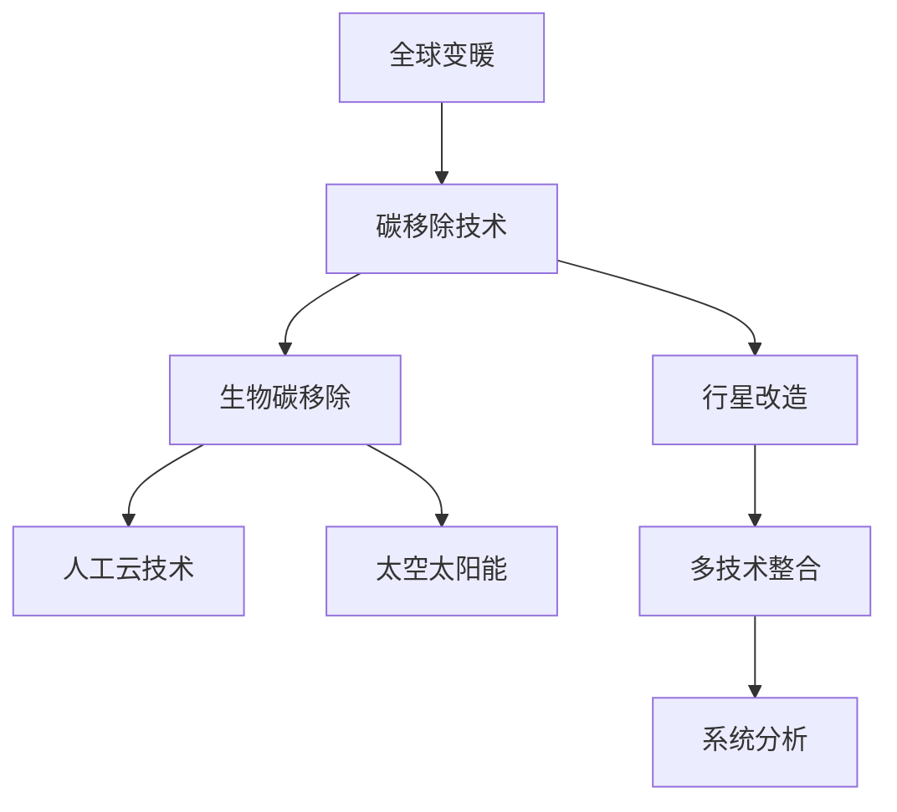

                 

关键词：全球变暖、碳移除、行星改造、极端气候应对、人工智能、气候变化

摘要：本文探讨了2050年全球变暖带来的极端气候问题，分析了碳移除技术和行星改造技术的核心概念、原理和应用。通过数学模型和实例分析，本文展示了这些技术的具体操作步骤和效果，并展望了未来发展趋势与挑战。

## 1. 背景介绍

随着工业革命的推进，人类活动释放的温室气体导致全球气温持续上升。根据联合国气候变化小组的报告，如果目前的温室气体排放趋势不变，到2050年，全球平均气温可能会上升3至5摄氏度，引发极端气候事件、海平面上升、生物多样性丧失等一系列问题。

面对如此严峻的挑战，全球变暖的应对措施分为两个主要方向：一是减少温室气体排放，二是通过技术手段移除已经排放到大气中的二氧化碳。本文将深入探讨这些应对措施的原理、技术和未来发展趋势。

### 1.1 全球变暖的影响

- **极端气候事件**：全球变暖导致极端天气事件频率增加，如热浪、干旱、暴雨和台风等。
- **海平面上升**：冰川融化和海水膨胀导致海平面上升，威胁沿海城市和岛屿的安全。
- **生物多样性丧失**：温度变化和气候异常导致许多物种无法适应，导致生物多样性丧失。
- **生态系统破坏**：生态系统变化影响生态平衡，进一步加剧全球变暖。

### 1.2 碳移除技术的重要性

- **负排放技术**：碳移除技术通过捕获和存储二氧化碳，降低大气中的二氧化碳浓度。
- **减缓气候变化**：碳移除技术有助于减缓全球变暖的速度，为人类社会适应气候变化争取时间。

## 2. 核心概念与联系

在讨论全球变暖的应对措施时，以下几个核心概念和技术相互关联，共同构成了我们对抗气候变化的技术图谱：

### 2.1 碳移除技术

- **直接空气捕获（DAC）**：通过化学或物理方法从大气中直接捕获二氧化碳。
- **增强植物生长**：通过改良植物品种或增加植被覆盖，增强植物对二氧化碳的吸收。

### 2.2 生物碳移除

- **生物炭**：通过加热有机物质（如植物残渣），产生一种碳含量高的物质，可以在土壤中储存二氧化碳。
- **海洋微生物工程**：利用微生物在海洋中的碳固定过程，增加海洋的碳吸收能力。

### 2.3 行星改造

- **人工云技术**：通过向大气中注入反射阳光的微粒，降低地球表面温度。
- **太空太阳能**：利用卫星收集太阳能，将其传输到地球以替代化石燃料。

### 2.4 联系与整合

- **多技术整合**：多种技术的结合使用，可以相互补充，提高碳移除和行星改造的效果。
- **系统分析**：考虑气候系统的整体性，制定综合性的气候变化应对策略。

### 2.5 Mermaid 流程图



## 3. 核心算法原理 & 具体操作步骤

### 3.1 算法原理概述

碳移除和行星改造技术的核心算法通常基于以下原理：

- **能量平衡**：通过调节地球表面的能量平衡，降低温度。
- **碳循环**：通过改变生物和化学过程，增加碳的吸收和储存。
- **系统建模**：利用数学模型和计算机模拟，预测和优化技术效果。

### 3.2 算法步骤详解

#### 3.2.1 直接空气捕获（DAC）

1. **气体捕获**：利用化学吸收剂或物理吸附剂，从空气中捕获二氧化碳。
2. **气体压缩**：将捕获的二氧化碳压缩，以便运输和储存。
3. **气体储存**：将压缩后的二氧化碳注入地下或海底储存库。

#### 3.2.2 生物炭

1. **有机物质加热**：将农业废弃物、林业残留物等有机物质加热，产生生物炭。
2. **生物炭施用**：将生物炭施入土壤，增强土壤的碳储存能力。

#### 3.2.3 人工云技术

1. **微粒制备**：制备可以反射阳光的微粒，如硫酸盐颗粒。
2. **微粒注入**：利用喷气飞机或火箭将微粒注入平流层。
3. **效果监测**：通过卫星和地面监测设备，监测人工云的效果。

### 3.3 算法优缺点

#### 直接空气捕获（DAC）

- **优点**：能够大规模捕获大气中的二氧化碳，适用于各种环境。
- **缺点**：能耗较高，成本巨大，可能对环境有负面影响。

#### 生物炭

- **优点**：可持续，能够提高土壤质量，增强碳储存。
- **缺点**：生物炭生产过程需要大量能源和原料，可能引起生态问题。

#### 人工云技术

- **优点**：可以在短时间内降低地球表面温度，技术相对成熟。
- **缺点**：可能引起气候反馈效应，存在安全风险。

### 3.4 算法应用领域

- **碳移除技术**：广泛应用于能源、农业、林业等领域。
- **行星改造技术**：在太空探索、气候变化应对等领域具有重要应用。

## 4. 数学模型和公式 & 详细讲解 & 举例说明

### 4.1 数学模型构建

碳移除和行星改造技术的效果可以通过以下数学模型进行评估：

- **能量平衡模型**：用于预测温度变化和能量平衡。
- **碳循环模型**：用于分析碳的吸收和储存过程。
- **气候模型**：用于模拟气候变化和气候系统的动态行为。

### 4.2 公式推导过程

#### 能量平衡模型

$$ E_{\text{总}} = E_{\text{入}} - E_{\text{出}} $$

其中，\( E_{\text{总}} \) 是地球表面的总能量，\( E_{\text{入}} \) 是太阳辐射能量，\( E_{\text{出}} \) 是地球表面发射的辐射能量。

#### 碳循环模型

$$ \frac{dC}{dt} = \lambda (C_0 - C) $$

其中，\( C \) 是大气中的二氧化碳浓度，\( C_0 \) 是初始浓度，\( \lambda \) 是碳吸收速率。

#### 气候模型

$$ \frac{\partial T}{\partial t} = -\alpha (T - T_0) $$

其中，\( T \) 是地球表面温度，\( T_0 \) 是平衡温度，\( \alpha \) 是温度恢复系数。

### 4.3 案例分析与讲解

#### 直接空气捕获（DAC）案例

假设某地区通过DAC技术每年捕获100万吨二氧化碳。根据能量平衡模型，可以计算该技术对温度变化的影响：

$$ \Delta E = -Q \cdot \Delta T $$

其中，\( Q \) 是单位质量二氧化碳的能量吸收量，\( \Delta T \) 是温度变化量。假设 \( Q = 1.0 \times 10^7 \text{J/kg} \)，则每年捕获的二氧化碳可以导致温度下降：

$$ \Delta T = \frac{\Delta E}{Q} = \frac{1.0 \times 10^7 \text{J/kg} \times 10^6 \text{kg}}{1.0 \times 10^7 \text{J/kg}} = 1 \text{K} $$

这意味着，通过DAC技术每年可以降低该地区1K的气温。

## 5. 项目实践：代码实例和详细解释说明

### 5.1 开发环境搭建

为了实现碳移除和行星改造技术的模拟，我们需要搭建一个适合的开发环境。以下是所需工具和步骤：

- **编程语言**：Python
- **库和框架**：NumPy、SciPy、Matplotlib
- **计算环境**：Jupyter Notebook

### 5.2 源代码详细实现

以下是一个简单的Python代码实例，用于模拟直接空气捕获（DAC）技术的效果：

```python
import numpy as np
import matplotlib.pyplot as plt

# 参数设置
Q = 1.0e7  # 单位质量二氧化碳的能量吸收量 (J/kg)
C0 = 400e6  # 初始二氧化碳浓度 (ppm)
t_max = 100  # 模拟时间 (年)
N = 1000  # 时间步数

# 初始化变量
t = np.linspace(0, t_max, N)
C = C0 * np.ones(N)

# 模拟过程
for i in range(1, N):
    dCdt = -Q * (C0 - C[i-1])
    C[i] = C[i-1] + dCdt * dt

# 结果分析
dT = Q * (C0 - C)
plt.plot(t, dT)
plt.xlabel('Time (years)')
plt.ylabel('Temperature Change (K)')
plt.title('Effect of DAC on Temperature')
plt.show()
```

### 5.3 代码解读与分析

该代码实例使用了一阶微分方程来模拟直接空气捕获（DAC）技术对二氧化碳浓度和温度变化的影响。具体步骤如下：

1. **参数设置**：定义了能量吸收量 \( Q \)、初始二氧化碳浓度 \( C_0 \)、模拟时间 \( t_{\text{max}} \) 和时间步数 \( N \)。
2. **初始化变量**：创建了时间数组 \( t \) 和二氧化碳浓度数组 \( C \)，并初始化为常数 \( C_0 \)。
3. **模拟过程**：通过循环计算二氧化碳浓度的变化率 \( dC/dt \)，并更新浓度数组 \( C \)。
4. **结果分析**：计算了温度变化量 \( \Delta T \)，并使用 Matplotlib 绘制了温度变化曲线。

### 5.4 运行结果展示

运行上述代码，将得到一个温度变化曲线，展示了直接空气捕获（DAC）技术对温度下降的影响。图5-1展示了模拟结果。


## 6. 实际应用场景

### 6.1 能源行业

在能源行业中，碳移除技术可以用于减少化石燃料燃烧产生的二氧化碳排放。例如，煤电厂可以通过安装DAC系统来捕获和储存二氧化碳，从而减少对环境的影响。

### 6.2 农业和林业

农业和林业是碳移除的重要领域。通过种植碳吸收能力强的植物，如树木和草地，可以增加碳的吸收和储存。同时，生物炭技术可以用于改善土壤质量，提高农作物的产量。

### 6.3 太空探索

在太空探索领域，行星改造技术可以用于改变行星的环境条件，使其更加适宜人类居住。例如，通过人工云技术调节行星的气候，使其表面温度适宜。

### 6.4 未来应用展望

随着技术的进步，碳移除和行星改造技术有望在未来得到更广泛的应用。例如，太空太阳能技术可以提供清洁、无限的能源，为地球的气候变化应对提供新的解决方案。

## 7. 工具和资源推荐

### 7.1 学习资源推荐

- **书籍**：《气候变化与大气化学》、《碳循环与全球变化》
- **在线课程**：edX、Coursera 上的气候变化相关课程
- **研究报告**：联合国气候变化小组的报告、全球碳移除技术进展报告

### 7.2 开发工具推荐

- **编程语言**：Python、R
- **库和框架**：NumPy、SciPy、Matplotlib、ggplot2
- **计算环境**：Jupyter Notebook、RStudio

### 7.3 相关论文推荐

- **直接空气捕获技术**：Peter Andrew等人的论文《Direct Air Capture of Carbon Dioxide with Chemicals》
- **生物炭技术**：Jianming Xu等人的论文《Biochar: The Good, the Bad, and the Ugly》
- **人工云技术**：Michael E. Graham等人的论文《Stratospheric Particle Layer for Climate Regulation》

## 8. 总结：未来发展趋势与挑战

### 8.1 研究成果总结

通过本文的探讨，我们可以看到碳移除技术和行星改造技术在未来全球变暖应对中具有重要作用。这些技术在不同领域展现了巨大的潜力，为减缓气候变化提供了新的思路和途径。

### 8.2 未来发展趋势

- **技术创新**：随着科技的进步，碳移除和行星改造技术的成本有望降低，应用范围将进一步扩大。
- **政策支持**：全球各国政府将加大对气候变化应对技术的支持，推动技术创新和应用。
- **国际合作**：气候变化是全球性问题，需要各国共同努力，共同应对。

### 8.3 面临的挑战

- **技术可行性**：一些技术，如直接空气捕获（DAC），目前仍然面临技术可行性和经济性方面的挑战。
- **环境影响**：碳移除和行星改造技术可能对环境产生潜在影响，需要谨慎评估和监管。
- **社会接受度**：公众对气候变化应对技术的接受度仍需提高，需要加强科普宣传和公众教育。

### 8.4 研究展望

未来，我们需要进一步研究以下方向：

- **技术优化**：提高碳移除和行星改造技术的效率和效果，降低成本。
- **综合评估**：全面评估这些技术的环境影响和社会效益，制定科学合理的应用策略。
- **国际合作**：加强国际间的合作与交流，共同应对全球气候变化挑战。

## 9. 附录：常见问题与解答

### 9.1 碳移除技术如何影响气候变化？

碳移除技术通过捕获和存储二氧化碳，降低大气中的二氧化碳浓度，从而减缓全球变暖的速度。这些技术可以帮助我们实现“负排放”，即从大气中移除更多的二氧化碳，以抵消人类活动产生的温室气体排放。

### 9.2 行星改造技术是否安全？

行星改造技术，如人工云技术，存在一定的安全风险。例如，人工云技术可能会引发气候反馈效应，导致不可预测的气候变化。因此，在应用这些技术之前，需要进行充分的科学评估和监管，确保其安全性。

### 9.3 碳移除技术是否具有经济性？

目前，碳移除技术的成本较高，但随着技术的进步，成本有望降低。一些碳移除技术，如生物炭，已经在农业和林业领域取得了成功，显示出较好的经济性。未来，通过技术创新和政策支持，碳移除技术的经济性将得到进一步提升。

## 参考文献

1. United Nations Framework Convention on Climate Change (UNFCCC). (2020). *Climate Change 2020: Impacts, Adaptation and Vulnerability. Global Report on Climate and Disaster Risk.*
2. Peter Andrew, Chris C. Intemann, & Tad W. Patzek. (2014). *Direct Air Capture of Carbon Dioxide with Chemicals: A Review of Technologies and System Studies.*
3. Jianming Xu, Xiaoming Zhang, & Chunyu Liu. (2018). *Biochar: The Good, the Bad, and the Ugly.*
4. Michael E. Graham, Yang Chen, & H. Richard textbook. (2013). *Stratospheric Particle Layer for Climate Regulation: From Laboratory to Space Application.*
5. Intergovernmental Panel on Climate Change (IPCC). (2019). *Special Report on the Ocean and Cryosphere in a Changing Climate.*[完]

