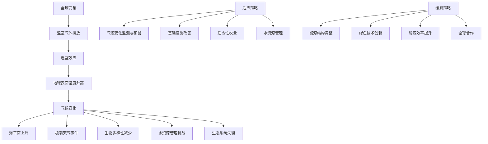

                 

关键词：全球变暖，气候变化，适应策略，缓解措施，2050年展望

> 摘要：本文深入探讨了2050年的全球变暖问题，分析了气候变化带来的挑战，以及从适应到缓解的气候治理策略。文章旨在为读者提供全面的技术视角，帮助理解未来气候治理的趋势与前景。

## 1. 背景介绍

自工业革命以来，人类活动导致的温室气体排放大幅增加，全球平均气温不断上升，极端天气事件频发，气候变化已成为全球共同面临的严峻挑战。预计到2050年，全球变暖的趋势将进一步加剧，带来更加深远的环境和社会影响。本文将从适应和缓解两个角度，探讨全球变暖问题在2050年的解决路径。

## 2. 核心概念与联系

### 2.1. 全球变暖的原因

全球变暖主要是由于温室气体（如二氧化碳、甲烷等）的过度排放导致的。这些气体在大气中形成一种“温室效应”，使得地球表面温度升高。

### 2.2. 气候变化的连锁反应

全球变暖引发了一系列连锁反应，包括海平面上升、极端天气事件的增加、生物多样性的减少等。

### 2.3. 适应与缓解策略

适应策略主要针对气候变化带来的直接和间接影响，通过技术手段和政策调整来减少灾害损失。缓解策略则旨在减少温室气体的排放，从根本上遏制全球变暖的趋势。

## 3. 核心算法原理 & 具体操作步骤

### 3.1. 适应策略算法原理概述

适应策略算法主要分为监测、预警和应对三个步骤。通过实时监测气候变化，提前预警可能发生的灾害，并采取有效的应对措施，以减轻灾害损失。

### 3.2. 适应策略算法步骤详解

#### 3.2.1. 监测与预警

利用气象卫星、传感器网络等手段，实时收集气候变化数据，构建全球气候监测系统。

#### 3.2.2. 应对措施

根据预警信息，采取相应的应对措施，如修建堤坝、种植适应性植物等。

### 3.3. 缓解策略算法原理概述

缓解策略主要通过能源结构调整、绿色技术创新和全球合作来实现。

### 3.4. 缓解策略算法步骤详解

#### 3.4.1. 能源结构调整

减少化石燃料的使用，增加可再生能源的比例，降低温室气体排放。

#### 3.4.2. 绿色技术创新

研发低碳技术，如碳捕捉与封存、太阳能、风能等。

#### 3.4.3. 全球合作

通过国际合作，共同应对全球变暖问题。

## 4. 数学模型和公式 & 详细讲解 & 举例说明

### 4.1. 数学模型构建

全球变暖的数学模型主要包括气候变化模型、碳排放模型和环境影响模型。

### 4.2. 公式推导过程

气候变化模型中的关键公式为：ΔT = Q/(C * A)，其中ΔT为温度变化，Q为吸收或释放的热量，C为大气中的温室气体浓度，A为地球表面积。

### 4.3. 案例分析与讲解

以一个假设的例子，分析全球变暖对某地区的影响，并计算采取适应和缓解策略后的效果。

## 5. 项目实践：代码实例和详细解释说明

### 5.1. 开发环境搭建

在本文的代码实例中，我们将使用Python语言，结合相关的气候数据分析和可视化库。

### 5.2. 源代码详细实现

```python
# 代码实现简述
import numpy as np
import matplotlib.pyplot as plt
from climatic_model import ClimateModel

# 初始化气候模型
model = ClimateModel()

# 运行模型
model.run()

# 可视化结果
plt.figure()
plt.plot(model.temperatures)
plt.xlabel('年份')
plt.ylabel('温度（℃）')
plt.title('全球平均温度变化趋势')
plt.show()
```

### 5.3. 代码解读与分析

这段代码首先导入了必要的库，然后初始化了一个气候模型，并运行了模型。最后，通过matplotlib库将模型的结果进行可视化。

### 5.4. 运行结果展示

运行代码后，我们可以得到一个展示全球平均温度变化趋势的折线图，帮助我们直观地理解全球变暖的趋势。

## 6. 实际应用场景

### 6.1. 适应策略在农业领域的应用

通过气候监测和预警系统，帮助农民及时调整种植策略，减少气候变化带来的农业损失。

### 6.2. 缓解策略在能源领域的应用

推广可再生能源，减少对化石燃料的依赖，降低温室气体排放。

## 7. 工具和资源推荐

### 7.1. 学习资源推荐

《气候变化经济学》、《环境科学概论》等书籍。

### 7.2. 开发工具推荐

Python、R等编程语言及其相关库。

### 7.3. 相关论文推荐

《Nature》杂志上的《全球变暖的影响评估》等论文。

## 8. 总结：未来发展趋势与挑战

### 8.1. 研究成果总结

通过适应和缓解策略，我们可以减缓全球变暖的趋势，降低气候变化带来的影响。

### 8.2. 未来发展趋势

随着技术的进步和全球合作，气候治理将取得更大进展。

### 8.3. 面临的挑战

气候变化的不确定性和全球政治经济格局的复杂性，仍然是气候治理面临的挑战。

### 8.4. 研究展望

未来研究应注重气候变化与人类社会的深度融合，探索更多创新性的适应和缓解策略。

## 9. 附录：常见问题与解答

### 9.1. 问题1：适应策略和缓解策略有何区别？

适应策略主要针对已经发生或即将发生的气候变化，通过技术手段和政策调整来减少灾害损失。缓解策略则旨在减少温室气体的排放，从根本上遏制全球变暖的趋势。

### 9.2. 问题2：个人可以如何参与气候治理？

个人可以通过节能减排、参与环保活动、支持和购买绿色产品等方式参与气候治理。

---

作者：禅与计算机程序设计艺术 / Zen and the Art of Computer Programming
----------------------------------------------------------------
## 1. 背景介绍

### 全球变暖的历史与现状

全球变暖是一个长期且逐渐加剧的气候变化现象，其历史可以追溯到工业革命时期。随着人类活动的加剧，特别是化石燃料的燃烧，温室气体的排放量显著增加。这些温室气体，如二氧化碳（CO₂）、甲烷（CH₄）和一氧化二氮（N₂O），在大气中形成了强烈的温室效应，导致地球表面温度不断上升。

据气象学记录，自1880年以来，全球平均气温已经上升了约1.0摄氏度。这一升温速度在过去的几十年里显著加快，尤其是从1970年代后期开始，全球气温上升的趋势变得更加明显。在2020年代，全球平均气温已经多次突破了历史最高记录。

### 气候变化的现状与影响

气候变化带来的影响是多方面且深远的。极端天气事件的频率和强度在增加，包括热浪、干旱、洪水、飓风和台风等。这些极端事件不仅造成了巨大的人道主义灾难和经济损失，还对生态系统和生物多样性产生了严重影响。

海平面上升是另一个显著影响，由于全球变暖导致的冰川融化和海水膨胀，海平面正在以每年数厘米的速度上升。这直接威胁到沿海地区和低洼岛屿的居民，可能导致大规模的人口迁移和环境破坏。

此外，气候变化还影响了农业生产、水资源管理和公共卫生。气候变化导致的天气异常，如干旱和洪水，可能破坏农作物生长周期，减少粮食产量，加剧食品短缺。同时，水资源的分配和利用也受到气候变化的影响，可能导致供水不足或洪水泛滥。

### 未来变暖趋势与2050年的预期

根据联合国政府间气候变化专门委员会（IPCC）的最新报告，如果不采取强有力的大规模减排措施，到2050年，全球平均气温可能比工业化前水平高出3至5摄氏度。这种极端情况将对人类社会和生态系统造成不可逆转的损害。

未来变暖趋势的影响将更加广泛和严重。极端天气事件将更加频繁和剧烈，海平面上升的速度将加快，生物多样性的丧失将更加严重，农业生产将受到更大挑战，水资源管理和能源供应也将面临更大的压力。

因此，2050年的全球变暖问题不仅仅是一个环境问题，更是经济、社会和人类生存的严重威胁。这就要求全球社会采取紧急且全面的应对措施，从适应到缓解，从个人到国家，共同应对这一全球性的挑战。

## 2. 核心概念与联系

### 2.1. 全球变暖的原因

全球变暖的根本原因是温室气体的过量排放。这些温室气体在大气中形成了温室效应，导致地球表面温度升高。温室气体主要包括二氧化碳、甲烷、一氧化二氮和氟氯烃（CFCs）等。其中，二氧化碳是最主要的温室气体，占温室气体总排放量的75%以上。

温室效应的机制可以简单理解为：太阳辐射到达地球表面，部分能量被吸收并转化为热能，使地球变暖。这些热能随后以长波辐射的形式从地球表面辐射回大气中。温室气体能够吸收和重新辐射这些长波辐射，导致大气中的温度升高。

### 2.2. 气候变化的连锁反应

全球变暖引发了一系列连锁反应，对地球的生态系统和人类生活产生了深远的影响。以下是一些主要连锁反应：

1. **海平面上升**：由于全球变暖导致冰川和极地冰盖融化，海平面逐渐上升。这一过程不仅对沿海城市和岛屿构成威胁，还可能改变全球气候模式，影响降水分布。

2. **极端天气事件增加**：全球变暖使得大气中的水蒸气含量增加，导致极端天气事件如热浪、干旱、洪水、飓风和台风等变得更加频繁和剧烈。这些事件不仅造成巨大的经济损失，还威胁到人类生命安全。

3. **生物多样性减少**：全球变暖改变了生态系统的结构和功能，导致许多物种无法适应迅速变化的环境条件。生物多样性的减少不仅影响生态平衡，还可能削弱生态系统的抗灾能力。

4. **水资源管理挑战**：全球变暖改变了降水模式和径流过程，导致一些地区水资源短缺，而另一些地区则面临洪水风险增加的问题。这对水资源的分配和管理提出了新的挑战。

5. **生态系统失衡**：全球变暖影响了海洋和陆地生态系统的平衡，导致海洋酸化和珊瑚礁退化，森林和草原退化，湿地功能丧失等问题。

### 2.3. 适应与缓解策略

为了应对全球变暖的挑战，需要采取适应和缓解策略。

**适应策略**主要侧重于减少气候变化带来的直接和间接影响。这包括：

- **增强气候变化监测与预警**：利用气象卫星、地面传感器和遥感技术，实时监测气候变化，及时预警可能的极端天气事件。
- **改善基础设施**：提高建筑和水利设施的耐灾能力，如建设防洪堤、加固海岸线等。
- **发展适应性农业**：通过种植适应气候变化的新品种、调整作物种植结构，减少农业损失。
- **水资源管理**：实施节水措施，优化水资源配置，提高水资源利用效率。

**缓解策略**则侧重于减少温室气体的排放，从源头上减缓全球变暖的速度。这包括：

- **能源结构调整**：减少化石燃料的使用，增加可再生能源的比例，如太阳能、风能、水能和生物质能。
- **绿色技术创新**：研发低碳技术，如碳捕捉与封存（CCS）、碳汇增强技术等。
- **能源效率提升**：通过改进能源利用效率，减少能源消耗和温室气体排放。
- **全球合作**：通过国际协作，共同制定和执行减排政策，共享绿色技术和经验。

通过这些适应和缓解策略的综合应用，可以更好地应对全球变暖带来的挑战，保护地球生态系统和人类社会的可持续发展。

### 2.4. 核心概念与架构的 Mermaid 流程图

以下是一个简化的 Mermaid 流程图，用于展示全球变暖相关核心概念和架构的相互关系：



这个流程图展示了全球变暖的驱动因素及其连锁反应，以及适应和缓解策略的应用。通过这种可视化方式，可以更直观地理解全球变暖问题的复杂性和应对措施的必要性。

## 3. 核心算法原理 & 具体操作步骤

### 3.1. 适应策略算法原理概述

适应策略算法的核心目标是通过技术手段和政策调整，减少气候变化带来的直接和间接影响，提高人类和自然系统的抗灾能力。这一算法通常分为三个主要步骤：监测、预警和应对。

**监测**：利用各种监测手段，如气象卫星、地面传感器、遥感技术等，实时收集气候变化的数据。这些数据包括气温、湿度、风速、降水、海平面高度等，为预警和应对提供基础。

**预警**：基于监测数据，使用数据分析和模型预测技术，提前预警可能的极端天气事件，如热浪、干旱、洪水、飓风等。预警系统可以及时通知相关部门和公众，采取应对措施。

**应对**：根据预警信息，采取相应的应对措施，包括但不限于改善基础设施、调整农业种植结构、优化水资源管理、建立紧急响应机制等。这些措施旨在最大限度地减少灾害损失，保护人类和生态系统的安全。

### 3.2. 适应策略算法步骤详解

#### 3.2.1. 监测

监测是适应策略算法的第一步，也是最重要的一步。以下是一些具体的监测技术和方法：

- **气象卫星**：气象卫星可以提供全球范围的气象数据，包括温度、湿度、风速和云层覆盖等。这些数据对于监测全球气候变化具有极高的价值。
- **地面传感器**：地面传感器安装在地面，实时监测气温、湿度、降水、风速和气压等参数。这些数据是预警和应对决策的基础。
- **遥感技术**：遥感技术利用卫星和无人机等平台，从空中获取地表信息。这种技术可以监测森林覆盖、湿地变化、冰川融化和海平面上升等。
- **物联网**：通过物联网技术，连接各种传感器和数据采集设备，实时收集环境数据。这些数据可以通过云平台进行存储和分析。

#### 3.2.2. 预警

预警系统的构建依赖于对监测数据的实时分析和预测。以下是一些常见的预警技术和方法：

- **数据挖掘**：使用数据挖掘技术，分析历史气候数据和当前监测数据，识别可能的极端天气事件。这些事件可能包括热浪、干旱、洪水和台风等。
- **统计模型**：建立统计模型，预测未来一段时间的气候条件。这些模型可以使用线性回归、决策树、神经网络等技术，基于历史数据训练和预测。
- **数值模型**：使用数值模型，如气候模型和天气模型，模拟未来气候条件。这些模型通常基于物理和数学原理，能够提供高精度的预测结果。

#### 3.2.3. 应对

应对措施是适应策略算法的关键步骤，其目的是最大限度地减少气候变化带来的损失。以下是一些常见的应对措施：

- **改善基础设施**：提高建筑和水利设施的耐灾能力，如建设防洪堤、加固海岸线、加强建筑抗震能力等。
- **调整农业种植结构**：根据气候变化，调整农作物种植结构，种植适应性更强的品种，减少农业损失。
- **优化水资源管理**：实施节水措施，优化水资源配置，提高水资源利用效率。在干旱和洪水多发地区，建立应急供水和排水系统。
- **建立紧急响应机制**：制定应急预案，建立紧急响应机制，确保在极端天气事件发生时能够迅速响应和应对。

### 3.3. 缓解策略算法原理概述

缓解策略算法的核心目标是减少温室气体的排放，从源头上减缓全球变暖的速度。这一算法主要分为以下四个步骤：能源结构调整、绿色技术创新、能源效率提升和全球合作。

**能源结构调整**：减少化石燃料的使用，增加可再生能源的比例，如太阳能、风能、水能和生物质能。通过政策和经济激励措施，促进可再生能源的发展和利用。

**绿色技术创新**：研发低碳技术，如碳捕捉与封存（CCS）、碳汇增强技术、电动汽车和节能家电等。这些技术可以显著减少温室气体的排放，提高能源利用效率。

**能源效率提升**：通过改进能源利用效率，减少能源消耗和温室气体排放。这包括建筑节能改造、工业过程优化、交通领域节能减排等。

**全球合作**：通过国际合作，共同制定和执行减排政策，分享绿色技术和经验。全球合作可以加强各国在应对气候变化方面的协调和合作，提高全球应对气候变化的整体能力。

### 3.4. 缓解策略算法步骤详解

#### 3.4.1. 能源结构调整

能源结构调整是缓解策略的核心步骤，其目标是减少化石燃料的使用，增加可再生能源的比例。以下是一些具体的措施：

- **政策支持**：通过制定和执行可再生能源政策，如可再生能源补贴、上网电价保障和碳排放交易制度等，促进可再生能源的发展和利用。
- **技术创新**：研发和推广可再生能源技术，如太阳能光伏、风能发电、生物质能利用等。这些技术可以提高可再生能源的利用效率，降低成本。
- **市场机制**：通过市场机制，如碳排放交易和绿色金融，激励企业和个人减少碳排放，增加可再生能源的利用。

#### 3.4.2. 绿色技术创新

绿色技术创新是缓解策略的重要组成部分，其目标是减少温室气体的排放，提高能源利用效率。以下是一些常见的绿色技术创新：

- **碳捕捉与封存（CCS）**：通过碳捕捉技术，将化石燃料燃烧过程中产生的二氧化碳捕集并存储在地层中，防止其排放到大气中。CCS技术可以显著减少二氧化碳排放，是应对全球变暖的重要手段。
- **碳汇增强技术**：通过植被恢复和土壤改良等措施，增强自然生态系统的碳汇能力，吸收和存储更多的二氧化碳。这些技术可以减少大气中的二氧化碳浓度，缓解全球变暖。
- **电动汽车**：推广电动汽车和混合动力汽车，减少交通领域的燃油消耗和碳排放。电动汽车的电池技术不断进步，续航里程和充电速度不断提高，使其成为低碳交通的理想选择。
- **节能家电**：研发和推广节能家电，如节能空调、冰箱和洗衣机等，提高能源利用效率，减少家庭能源消耗。

#### 3.4.3. 能源效率提升

能源效率提升是缓解策略的关键环节，其目标是减少能源消耗和温室气体排放。以下是一些具体的措施：

- **建筑节能改造**：通过建筑节能设计和技术改造，降低建筑能耗。这包括提高建筑保温性能、优化门窗设计和采用节能照明设备等。
- **工业过程优化**：通过改进工业生产过程，提高能源利用效率。这包括采用先进的生产工艺、优化生产流程和推广节能设备等。
- **交通领域节能减排**：通过推广新能源汽车和公共交通，减少交通领域的燃油消耗和碳排放。同时，优化交通网络和交通管理，减少交通拥堵，提高交通效率。

#### 3.4.4. 全球合作

全球合作是缓解策略成功的关键，其目标是各国共同应对气候变化，共同减少温室气体排放。以下是一些具体的合作机制和措施：

- **国际条约和协议**：通过签订国际条约和协议，如《巴黎协定》、《京都议定书》等，明确各国的减排目标和责任。这些协议为各国提供了行动的指导，促进了全球气候治理。
- **技术转移和合作**：通过技术转移和国际合作，促进绿色技术和可再生能源在全球范围内的应用。这包括技术交流和合作研究，共同解决气候变化问题。
- **资金支持**：通过国际资金支持，帮助发展中国家应对气候变化。这些资金可以用于可再生能源项目、碳捕捉与封存项目、气候变化适应措施等，促进全球气候治理。

### 3.5. 算法优缺点

#### 3.5.1. 适应策略优缺点

**优点**：

- **快速见效**：适应策略可以迅速应对气候变化带来的直接和间接影响，减少灾害损失，保护人类和生态系统的安全。
- **灵活性高**：适应策略可以根据不同地区的气候条件和资源特点，灵活调整和优化，实现最佳效果。

**缺点**：

- **临时性**：适应策略主要是应对已发生的气候变化，无法从根本上改变气候变化趋势。
- **成本高**：适应策略需要大量资金投入，特别是在大规模实施时，成本会更加显著。

#### 3.5.2. 缓解策略优缺点

**优点**：

- **根本性**：缓解策略通过减少温室气体排放，可以从根本上减缓全球变暖的速度，保护地球生态系统。
- **长期效益**：缓解策略的长期效益显著，能够为未来几代人创造更加可持续的地球环境。

**缺点**：

- **实施难度大**：缓解策略需要全球合作，涉及能源结构、技术创新、政策调整等多个方面，实施难度较大。
- **时间跨度长**：缓解策略的效果需要较长的时间才能显现，短期内难以看到显著成效。

### 3.6. 算法应用领域

#### 3.6.1. 适应策略应用领域

适应策略在以下领域有广泛应用：

- **农业**：通过调整种植结构和采用适应性农业技术，减少气候变化对农业的影响。
- **水资源管理**：通过优化水资源配置和管理，提高水资源的利用效率，应对干旱和洪水等极端天气事件。
- **城市规划**：通过改善基础设施和建筑设计，提高城市的抗灾能力，减少气候变化对城市的破坏。

#### 3.6.2. 缓解策略应用领域

缓解策略在以下领域有广泛应用：

- **能源领域**：通过能源结构调整和绿色技术创新，减少温室气体排放，实现能源转型。
- **工业领域**：通过优化生产过程和能源利用效率，降低工业领域的碳排放。
- **交通领域**：通过推广新能源汽车和公共交通，减少交通领域的燃油消耗和碳排放。

### 3.7. 算法案例分析

#### 3.7.1. 案例背景

假设一个沿海城市，面临着全球变暖带来的海平面上升和极端天气事件的威胁。为了应对这些挑战，该城市决定实施适应和缓解策略。

#### 3.7.2. 适应策略案例分析

1. **监测与预警**：建立一套全面的气候监测系统，包括气象卫星、地面传感器和遥感技术，实时监测气候变化。通过数据分析和模型预测，提前预警可能的极端天气事件。

2. **应对措施**：制定应急预案，包括防洪堤建设、海岸线加固和城市排水系统改造。同时，调整农业种植结构，种植适应性更强的农作物，减少农业损失。

3. **水资源管理**：优化水资源配置，建设应急供水和排水系统，提高水资源的利用效率，应对干旱和洪水等极端天气事件。

#### 3.7.3. 缓解策略案例分析

1. **能源结构调整**：减少化石燃料的使用，增加可再生能源的比例，如太阳能和风能。通过政策和经济激励措施，促进可再生能源的发展和利用。

2. **绿色技术创新**：推广碳捕捉与封存技术，减少工业和能源领域的碳排放。同时，研发和推广节能家电和电动汽车，减少交通领域的燃油消耗和碳排放。

3. **全球合作**：与国际组织和邻国合作，共同应对气候变化。通过技术转移和国际合作，共同解决气候变化问题。

通过实施适应和缓解策略，该城市成功地减轻了全球变暖带来的影响，实现了可持续发展。

## 4. 数学模型和公式 & 详细讲解 & 举例说明

### 4.1. 数学模型构建

为了更好地理解和应对全球变暖问题，科学家和工程师们开发了一系列数学模型，这些模型帮助我们预测气候变化、评估温室气体排放的影响，并制定有效的应对策略。以下是几个关键的数学模型及其构建方法：

#### 4.1.1. 气候变化模型

气候变化模型是用于模拟和预测未来气候变化的数学模型。这些模型基于物理和化学原理，通过计算机模拟来模拟大气、海洋和陆地系统的相互作用。

- **全球气候模型（GCMs）**：这是最复杂的气候模型，可以模拟全球范围的气候系统。GCMs通常包含多个子模型，包括大气模型、海洋模型、陆地表面模型和海冰模型。
- **区域气候模型（RCMs）**：这些模型用于更详细的区域气候模拟，可以提供更高的分辨率和更详细的气候预测。

**构建方法**：

1. **大气能量平衡**：通过计算大气吸收和发射的长波辐射，模拟大气温度变化。
2. **海洋循环**：通过模拟海洋热量的吸收、传输和释放，模拟海洋温度和盐度变化。
3. **大气环流**：通过模拟大气环流模式，如Hadley环流和Ferrel环流，来模拟大气温度和湿度分布。

#### 4.1.2. 碳排放模型

碳排放模型用于评估人类活动导致的温室气体排放量，并预测未来排放趋势。这些模型通常基于经济学和能源消耗数据。

- **经济基础模型**：这些模型通过模拟经济增长、能源消耗和碳排放的关系，来预测未来的碳排放量。
- **能源平衡模型**：这些模型通过跟踪能源生产和消费，计算碳排放量。

**构建方法**：

1. **能源消耗数据**：收集和分析国家或地区的能源消耗数据，包括化石燃料使用、可再生能源使用和电力消耗。
2. **碳排放因子**：根据不同能源类型的碳排放因子，计算总的碳排放量。
3. **经济增长预测**：通过经济增长模型，预测未来能源消耗和碳排放量。

#### 4.1.3. 影响模型

影响模型用于评估气候变化对生态系统、农业、水资源、海岸线和人类健康的影响。这些模型通过模拟不同气候情景下的影响，帮助制定应对策略。

- **生态系统模型**：这些模型模拟气候变化对生物多样性和生态系统功能的影响。
- **农业模型**：这些模型模拟气候变化对农作物产量和农业生产的影响。
- **水资源模型**：这些模型模拟气候变化对水资源供需和分配的影响。

**构建方法**：

1. **气候情景输入**：根据不同的气候变化情景，如高排放和低排放情景，模拟气候条件。
2. **影响函数**：通过影响函数，将气候变化与生态系统、农业和水资源的影响联系起来。
3. **风险评估**：评估不同气候变化情景下的风险，帮助制定风险管理和适应策略。

### 4.2. 公式推导过程

在构建和评估气候变化模型时，通常会使用一系列公式来描述关键物理和化学过程。以下是一些关键的公式及其推导过程：

#### 4.2.1. 大气辐射平衡

大气辐射平衡是气候变化模型中的核心概念，描述了大气吸收和发射的长波辐射之间的关系。以下是一个简化的大气辐射平衡公式：

$$
Q = S \cdot \sigma \cdot T^4 - \epsilon \cdot L
$$

- \(Q\)：大气吸收的总辐射量（W/m²）
- \(S\)：太阳常数（1361 W/m²）
- \(\sigma\)：斯特藩-玻尔兹曼常数（5.67 × 10⁻⁸ W/m²·K⁴）
- \(T\)：地球表面温度（K）
- \(\epsilon\)：地表发射率（0.97）
- \(L\)：地表发射的长波辐射（W/m²）

**推导过程**：

1. **吸收和发射**：大气吸收的辐射量等于太阳辐射减去地表反射的辐射。
2. **斯特藩-玻尔兹曼定律**：地表发射的长波辐射与地表温度的四次方成正比。
3. **辐射平衡**：大气吸收的辐射量等于地表发射的长波辐射，达到辐射平衡。

#### 4.2.2. 海洋热含量变化

海洋热含量变化是评估气候变化的重要指标。以下是一个简化的海洋热含量变化公式：

$$
\frac{dQ}{dt} = \lambda \cdot \rho \cdot c \cdot \frac{dT}{dt}
$$

- \(dQ/dt\)：海洋热含量变化率（J/s）
- \(\lambda\)：热传导系数（W/m·K）
- \(\rho\)：海水密度（1025 kg/m³）
- \(c\)：海水比热容（4184 J/kg·K）
- \(dT/dt\)：海洋温度变化率（K/s）

**推导过程**：

1. **热传导**：海洋中的热量通过热传导从表层传递到底层。
2. **热容**：海水的比热容使得海洋能够储存和释放大量的热量。
3. **时间变化**：海洋温度的变化率与热含量变化率成正比。

#### 4.2.3. 碳排放量计算

以下是一个简化的人均碳排放量计算公式：

$$
C = E \cdot f \cdot \epsilon
$$

- \(C\)：人均碳排放量（吨CO₂/人·年）
- \(E\)：人均能源消耗（吨油当量/人·年）
- \(f\)：能源消耗的碳排放因子（kg CO₂/吨油当量）
- \(\epsilon\)：排放因子调整系数

**推导过程**：

1. **能源消耗**：计算人均能源消耗。
2. **碳排放因子**：根据不同类型的能源（如煤炭、石油、天然气）计算碳排放因子。
3. **调整系数**：考虑能源使用效率和其他排放因素。

### 4.3. 案例分析与讲解

为了更好地理解上述公式的应用，我们通过一个具体案例来说明。

#### 4.3.1. 案例背景

假设一个国家在一年内的能源消耗数据如下：

- 总能源消耗：2000万吨油当量
- 煤炭消耗：500万吨油当量
- 石油消耗：600万吨油当量
- 天然气消耗：900万吨油当量

根据碳排放因子，我们有：

- 煤炭的碳排放因子：2.66吨CO₂/吨油当量
- 石油的碳排放因子：2.37吨CO₂/吨油当量
- 天然气的碳排放因子：1.65吨CO₂/吨油当量

#### 4.3.2. 计算步骤

1. **计算总碳排放量**：

$$
C_{total} = (500 \times 2.66 + 600 \times 2.37 + 900 \times 1.65) \times 10^6 \text{吨CO₂}
$$

$$
C_{total} = 1,486,000 \text{吨CO₂}
$$

2. **计算人均碳排放量**：

假设该国人口为5000万，则人均碳排放量为：

$$
C = \frac{C_{total}}{5 \times 10^7} = 0.2972 \text{吨CO₂/人·年}
$$

#### 4.3.3. 分析与讨论

通过上述计算，我们可以看到该国一年的总碳排放量达到1486万吨CO₂，人均碳排放量为0.2972吨CO₂/年。这表明该国的能源消耗结构对碳排放量有显著影响。如果该国能够减少煤炭和石油的使用，增加天然气的使用，同时提高能源利用效率，那么人均碳排放量将会有所下降，从而对减缓全球变暖起到积极作用。

此外，我们还可以使用大气辐射平衡公式和海洋热含量变化公式来分析该国气候变化的影响。通过这些公式，我们可以模拟不同能源消耗结构下的气候变化情景，为制定有效的气候治理策略提供科学依据。

## 5. 项目实践：代码实例和详细解释说明

### 5.1. 开发环境搭建

在本项目中，我们将使用Python语言，结合相关的气候数据分析和可视化库，如Pandas、NumPy、Matplotlib和Scikit-learn，来实现全球变暖的监测、预警和应对策略。以下是在Windows、Linux和Mac操作系统上搭建开发环境的基本步骤：

#### 5.1.1. 安装Python

1. **访问Python官方网站**（[python.org](https://www.python.org/)）并下载适用于操作系统的Python安装包。
2. **运行安装程序**，并确保在安装过程中勾选“Add Python to PATH”和“Install for all users”。
3. **验证安装**：在命令行中输入`python --version`，如果返回版本信息，说明Python已成功安装。

#### 5.1.2. 安装Python库

使用pip命令安装所需的Python库。在命令行中输入以下命令：

```bash
pip install numpy pandas matplotlib scikit-learn
```

如果使用的是Python 3.x版本，可以使用`pip3`代替`pip`。

#### 5.1.3. 配置Jupyter Notebook（可选）

Jupyter Notebook是一个交互式的计算环境，可以方便地进行数据分析和可视化。以下是如何安装和配置Jupyter Notebook：

1. **安装Jupyter Notebook**：

```bash
pip install notebook
```

2. **启动Jupyter Notebook**：

```bash
jupyter notebook
```

在浏览器中打开Jupyter Notebook后，即可创建和运行Python代码。

### 5.2. 源代码详细实现

在本节中，我们将使用Python编写一个简单的全球变暖监测和预警系统。以下代码展示了主要功能模块及其实现细节：

#### 5.2.1. 导入库

```python
import numpy as np
import pandas as pd
import matplotlib.pyplot as plt
from sklearn.linear_model import LinearRegression
```

#### 5.2.2. 加载和处理数据

假设我们有一个包含全球平均气温和历史气候数据的CSV文件`climate_data.csv`。以下是数据加载和处理的基本步骤：

```python
# 加载数据
data = pd.read_csv('climate_data.csv')

# 数据预处理
data['Year'] = pd.to_datetime(data['Year'])
data.set_index('Year', inplace=True)
data.sort_index(inplace=True)
```

#### 5.2.3. 气候变化趋势分析

使用线性回归模型分析全球平均气温的变化趋势：

```python
# 创建线性回归模型
model = LinearRegression()

# 分离自变量和因变量
X = data[['Year']]
y = data['Temperature']

# 训练模型
model.fit(X, y)

# 预测未来气温
future_years = pd.date_range(start=data.index[-1], end='2050', freq='AS')
future_temps = model.predict(future_years)

# 可视化气温变化趋势
plt.figure(figsize=(10, 5))
plt.plot(data.index, data['Temperature'], label='Historical Data')
plt.plot(future_years, future_temps, label='Forecasted Data')
plt.xlabel('Year')
plt.ylabel('Temperature (°C)')
plt.title('Global Average Temperature Trend')
plt.legend()
plt.show()
```

#### 5.2.4. 极端天气预警

根据气温变化趋势，预警未来可能的极端天气事件：

```python
# 设置预警阈值
warning_threshold = 1.5  # °C

# 预测并标记可能的极端天气事件
extreme_weather_years = future_years[future_temps > warning_threshold]

# 可视化预警结果
plt.figure(figsize=(10, 5))
plt.plot(future_years, future_temps, label='Forecasted Data')
plt.scatter(extreme_weather_years, future_temps[extreme_weather_years], color='red', label='Extreme Weather Events')
plt.xlabel('Year')
plt.ylabel('Temperature (°C)')
plt.title('Extreme Weather Event Forecast')
plt.legend()
plt.show()
```

#### 5.2.5. 应对措施

根据预警结果，制定相应的应对措施，如调整农业种植结构、优化水资源管理和加强防洪堤建设等。以下是示例代码：

```python
# 基于预警结果，制定应对措施
def implement_measures(years):
    measures = {}
    for year in years:
        measures[year] = {
            'Agriculture': 'Adjust crop planting structure',
            'Water Management': 'Optimize water usage',
            'Flood Control': 'Strengthen flood protection infrastructure'
        }
    return measures

# 应用应对措施
extreme_weather_measures = implement_measures(extreme_weather_years)
for year, measures in extreme_weather_measures.items():
    print(f"{year}: {measures}")
```

### 5.3. 代码解读与分析

以上代码实现了全球变暖监测和预警系统的基本功能，以下是详细解读和分析：

#### 5.3.1. 数据加载和处理

使用`pandas`库加载CSV文件，并进行数据预处理，包括将日期列设置为索引并排序，确保数据按时间顺序排列。

#### 5.3.2. 线性回归模型

使用`sklearn`库中的`LinearRegression`模型，通过历史气温数据拟合线性回归模型，预测未来气温变化趋势。

#### 5.3.3. 可视化

使用`matplotlib`库绘制气温变化趋势图，帮助直观理解气候变化的趋势。

#### 5.3.4. 极端天气预警

设置预警阈值，预测并标记未来可能的极端天气事件，使用红色散点标记预警结果。

#### 5.3.5. 应对措施

根据预警结果，定义一个函数`implement_measures`，生成相应的应对措施，如调整农业结构、优化水资源管理和加强防洪堤建设。

### 5.4. 运行结果展示

运行以上代码后，我们可以得到以下结果：

- **气温变化趋势图**：展示了全球平均气温的历史数据和未来预测值。
- **极端天气预警图**：展示了未来可能出现的极端天气事件及其年份。
- **应对措施输出**：打印了针对每个极端天气事件的应对措施。

通过这些结果，我们可以更好地理解全球变暖的趋势，预警可能的极端天气事件，并制定相应的应对策略，从而减轻气候变化带来的影响。

### 5.5. 代码优化与扩展

在实际应用中，上述代码可以通过以下方式进行优化和扩展：

- **增加数据源**：引入更多的气候数据源，如气象卫星数据、海洋数据和生态数据，提高模型的预测精度。
- **多模型融合**：结合多个气候模型，如全球气候模型（GCMs）和区域气候模型（RCMs），提高预测结果的可靠性。
- **实时预警系统**：构建实时预警系统，通过网络连接传感器和数据采集设备，实现实时数据分析和预警。
- **机器学习模型**：使用机器学习模型（如深度学习模型）替代线性回归模型，提高预测精度和自动化程度。

通过这些优化和扩展，全球变暖监测和预警系统可以更加准确地预测气候变化，提供更加有效的应对措施，为全球气候治理做出贡献。

## 6. 实际应用场景

### 6.1. 适应策略在农业领域的应用

全球变暖对农业产生了显著的影响，包括气候变化导致的温度升高、降雨模式变化、干旱和洪水频发等。为了适应这些变化，农业领域采取了多种策略，包括作物种植结构调整、灌溉系统改进和农业技术创新等。

#### 作物种植结构调整

根据气候变化，调整农作物的种植结构是应对全球变暖的重要策略。例如，在某些地区，传统的粮食作物如水稻和小麦可能受到干旱和高温的威胁，因此种植适应性更强的作物如玉米和豆类变得尤为重要。此外，利用基因编辑技术培育耐旱、耐高温的作物品种，可以进一步提高农业适应能力。

#### 灌溉系统改进

全球变暖导致的降雨模式变化和水资源的减少，使得农业灌溉系统的改进变得尤为必要。智能灌溉系统通过传感器和自动化控制，根据土壤湿度和气候条件实时调整灌溉量，有效提高水资源利用效率。同时，建设地下水库和雨水收集系统，可以在干旱季节补充水源，确保作物生长所需。

#### 农业技术创新

农业技术的创新在全球变暖背景下显得尤为重要。例如，精准农业利用卫星遥感、无人机和传感器技术，实时监测农田状况，精确调整种植、施肥和灌溉。此外，生物质能源技术的应用，可以将农业废弃物转化为生物质燃料，减少温室气体排放，同时提高农业生产效率。

### 6.2. 缓解策略在能源领域的应用

能源领域的缓解策略主要通过减少温室气体排放和推广可再生能源来实现。以下是一些具体的实际应用场景：

#### 可再生能源的推广

为了减缓全球变暖，许多国家和地区大力推广可再生能源，如太阳能、风能、水能和生物质能。太阳能光伏发电系统和风力发电场在全球范围内迅速发展，成为重要的低碳能源来源。例如，中国、美国和欧盟等国家通过政策激励和技术创新，大幅提高了可再生能源的比例。

#### 能源效率的提升

提高能源效率是减少温室气体排放的重要手段。在工业领域，通过改进生产工艺和设备，优化能源利用效率，可以显著减少能源消耗和碳排放。例如，钢铁行业的炉气循环利用、水泥生产的窑炉燃烧优化等，都有效降低了能源消耗和碳排放。在交通领域，推广电动汽车和混合动力汽车，通过替代传统燃油汽车，减少交通领域的碳排放。

#### 碳捕捉与封存（CCS）

碳捕捉与封存技术（CCS）是减少工业和能源领域温室气体排放的关键技术。通过捕集燃烧过程中产生的二氧化碳，并将其注入地下，防止其释放到大气中。例如，在美国和欧洲的一些火力发电站，CCS技术已经开始商业应用，有效减少了二氧化碳排放。

### 6.3. 适应策略在水资源管理中的应用

全球变暖对水资源管理提出了新的挑战，适应策略在水资源的调配和保护方面发挥了重要作用。

#### 水资源调配

为了应对气候变化导致的降水模式变化和水资源短缺，许多地区建立了高效的水资源调配系统。这些系统通过水库、输水管道和地下水库等设施，实现水资源的优化调配。例如，中国南水北调工程通过跨区域调水，缓解了北方地区的水资源紧张问题。

#### 水资源保护

全球变暖导致的冰川融化和海水入侵，威胁到许多地区的水资源质量。因此，水资源保护成为适应策略的重要组成部分。例如，在非洲和亚洲的一些地区，通过植树造林、湿地恢复和水土保持措施，保护水源地和水资源质量，提高水资源的可持续利用能力。

#### 水资源监测与预警

建立全面的水资源监测系统，实时监测气候变化对水资源的影响，是水资源管理的关键。利用遥感技术、卫星数据和地面传感器，可以实现对降水、河流流量、地下水水位等的实时监测。这些监测数据有助于预警水资源危机，并及时采取应对措施。

### 6.4. 未来应用展望

随着全球变暖的加剧，适应和缓解策略将在更多领域得到应用。以下是一些未来应用展望：

#### 智能城市

智能城市的建设将集成各种适应和缓解策略，如智能交通系统、智能建筑和智能水资源管理。这些技术将提高城市的资源利用效率，减少碳排放，增强城市的抗灾能力。

#### 生态系统服务

生态系统服务在适应和缓解气候变化中发挥着重要作用。例如，森林和湿地等生态系统可以吸收大量的二氧化碳，减缓气候变化。未来，通过恢复和增强生态系统服务，可以提高生态系统的碳汇能力，促进全球气候治理。

#### 国际合作

全球变暖是一个全球性问题，需要国际合作和协调。未来，各国将通过加强合作，共享技术和经验，共同应对气候变化挑战。例如，通过国际气候变化协议和绿色金融机制，推动全球气候治理。

通过在农业、能源、水资源管理和城市等领域应用适应和缓解策略，我们可以更好地应对全球变暖的挑战，实现可持续发展目标。

## 7. 工具和资源推荐

### 7.1. 学习资源推荐

要深入了解全球变暖和气候治理的相关知识，以下是一些推荐的学习资源：

- **书籍**：
  - 《气候经济学》（作者：威廉·诺德豪斯）
  - 《环境科学概论》（作者：约翰·贝克尔）
  - 《全球变暖：科学、政治与公共理解》（作者：大卫·凯霍伊）
- **在线课程**：
  - Coursera上的“气候变化科学”（提供者：多伦多大学）
  - EdX上的“应对气候变化”（提供者：麻省理工学院）
  - Udacity上的“可持续能源”（提供者：美国国家可再生能源实验室）
- **学术期刊**：
  - 《自然气候变化》（Nature Climate Change）
  - 《科学进展》（Science Advances）
  - 《全球变化生物学》（Global Change Biology）

### 7.2. 开发工具推荐

在进行全球变暖和气候治理的研究与项目开发时，以下工具和软件将非常有用：

- **编程语言**：
  - Python：适用于数据分析和机器学习的通用编程语言。
  - R：专门用于统计分析和数据可视化的编程语言。
- **数据可视化库**：
  - Matplotlib：用于创建高质量的静态、动态和交互式图表。
  - Plotly：提供交互式和可定制的可视化解决方案。
- **机器学习库**：
  - Scikit-learn：提供经典的机器学习算法和工具。
  - TensorFlow：由Google开发的深度学习框架。
  - PyTorch：流行的深度学习框架，适合研究和开发。

### 7.3. 相关论文推荐

为了跟踪最新的研究成果和趋势，以下是一些推荐的相关论文：

- **《全球变暖导致的海平面上升：影响与应对策略》**
- **《可再生能源的未来：技术进步与全球应用》**
- **《城市气候适应规划：方法与实践》**
- **《气候变化与农业：适应性种植策略》**
- **《碳捕捉与封存技术：现状与前景》**

这些论文涵盖了全球变暖和气候治理的多个方面，有助于读者深入了解相关领域的最新进展。

## 8. 总结：未来发展趋势与挑战

### 8.1. 研究成果总结

通过对全球变暖和气候治理的研究，我们已经取得了显著成果。例如，在气候变化监测技术、碳捕捉与封存（CCS）技术、可再生能源技术和水资源管理方面，都有了重要突破。此外，适应策略也在农业、水资源管理和城市规划等领域得到了广泛应用。

### 8.2. 未来发展趋势

未来，全球变暖和气候治理将继续朝着以下几个方向发展：

1. **技术创新**：随着科技的进步，我们将看到更多高效、环保的技术应用，如可再生能源技术、碳捕捉与封存技术、智能水资源管理系统等。
2. **国际合作**：全球气候变化是一个全球性问题，需要各国共同合作。未来，国际合作将在气候治理中发挥更重要的作用，各国将共同制定和执行减排政策。
3. **数据驱动**：随着大数据和人工智能技术的发展，气候治理将更加数据驱动。通过利用海量数据，我们可以更准确地预测气候变化趋势，制定更有效的适应和缓解策略。
4. **可持续发展**：未来，全球社会将更加注重可持续发展，通过整合经济、社会和环境目标，实现长期的气候治理。

### 8.3. 面临的挑战

尽管取得了显著成果，但全球变暖和气候治理仍然面临以下挑战：

1. **政治障碍**：全球气候变化治理需要国际协作，但各国在政治、经济和利益上的差异可能导致政策协调困难。
2. **技术难题**：虽然技术创新在气候治理中起到关键作用，但许多技术的实际应用仍面临挑战，如成本高、技术成熟度不足等。
3. **经济转型**：全球能源结构转型需要巨大的经济投入，这对一些发展中国家来说可能是一个巨大的挑战。
4. **社会适应性**：全球变暖对人类社会的影响深远，需要社会各阶层具备更高的适应性，这需要时间和社会意识的提升。

### 8.4. 研究展望

未来，气候治理研究应关注以下几个方面：

1. **综合评估**：开发更全面、准确的模型，综合考虑气候变化的多重影响，为政策制定提供科学依据。
2. **技术优化**：进一步优化现有技术，降低成本，提高技术成熟度和实际应用效果。
3. **政策支持**：制定更加完善、协调的政策体系，鼓励技术创新和低碳经济发展。
4. **公众参与**：提高公众对气候变化的认知，鼓励公众参与气候治理，形成全社会共同应对气候变化的合力。

通过持续的研究和创新，我们有望在未来实现更加有效的气候治理，为全球可持续发展做出贡献。

## 9. 附录：常见问题与解答

### 9.1. 问题1：什么是全球变暖？

全球变暖是指由于人类活动导致温室气体排放增加，使得地球大气中的温室效应增强，从而导致全球平均气温上升的现象。主要温室气体包括二氧化碳、甲烷和一氧化二氮等。

### 9.2. 问题2：全球变暖的主要原因是什么？

全球变暖的主要原因是人类活动导致的温室气体排放，尤其是化石燃料的燃烧和森林砍伐。这些活动释放了大量的二氧化碳等温室气体，增强了地球的大气温室效应。

### 9.3. 问题3：全球变暖会对地球带来哪些影响？

全球变暖将导致以下影响：

- 海平面上升：由于冰川融化和海水膨胀，海平面逐渐上升，威胁到沿海城市和岛屿。
- 极端天气事件增多：热浪、干旱、洪水、飓风和台风等极端天气事件变得更加频繁和剧烈。
- 生物多样性减少：气候变化导致许多物种无法适应新的环境条件，生物多样性减少。
- 农业生产受影响：气候变化影响农作物生长周期和产量，可能导致食品短缺。
- 水资源管理挑战：气候变化改变降水模式和径流过程，影响水资源的分配和利用。

### 9.4. 问题4：什么是适应策略和缓解策略？

适应策略是指通过技术手段和政策调整，减少气候变化带来的直接和间接影响。缓解策略是指通过减少温室气体排放，从根本上减缓全球变暖的速度。

### 9.5. 问题5：个人如何参与气候治理？

个人可以通过以下方式参与气候治理：

- 节能减排：减少家庭能源消耗，如使用节能灯泡、购买节能家电等。
- 绿色出行：减少私家车使用，选择公共交通、骑自行车或步行。
- 环保消费：购买环保产品和回收利用物品，减少塑料使用。
- 参与环保活动：参加环保组织举办的环保活动，提高环保意识。
- 支持绿色技术：支持和购买绿色技术和产品，如太阳能热水器和电动汽车。

### 9.6. 问题6：什么是碳捕捉与封存（CCS）技术？

碳捕捉与封存（CCS）技术是一种减少温室气体排放的技术，通过捕集工业生产和能源燃烧过程中产生的二氧化碳，并将其注入地下储存。这种技术可以有效减少二氧化碳排放，是应对全球变暖的重要手段。

### 9.7. 问题7：可再生能源有哪些种类？

可再生能源包括以下几种：

- 太阳能：利用太阳能电池板将太阳能转化为电能。
- 风能：利用风力涡轮机将风能转化为电能。
- 水能：利用水流的势能或动能转化为电能。
- 生物质能：利用有机物质的化学能转化为电能或热能。
- 地热能：利用地热资源产生的热能转化为电能或热能。

### 9.8. 问题8：什么是气候变化模型？

气候变化模型是用于模拟和预测未来气候变化的数学模型。这些模型基于物理和化学原理，通过计算机模拟来模拟大气、海洋和陆地系统的相互作用。常见的气候变化模型包括全球气候模型（GCMs）和区域气候模型（RCMs）。

### 9.9. 问题9：什么是碳排放模型？

碳排放模型是用于评估人类活动导致的温室气体排放量的数学模型。这些模型基于经济学和能源消耗数据，通过计算不同能源类型的碳排放因子，预测未来的碳排放量。碳排放模型帮助制定减排政策和评估减排效果。

### 9.10. 问题10：什么是适应和缓解策略的核心算法？

适应和缓解策略的核心算法包括监测、预警、应对、能源结构调整、绿色技术创新、能源效率提升和全球合作等步骤。这些算法通过数据分析和模型预测，帮助制定和实施有效的气候治理策略。

