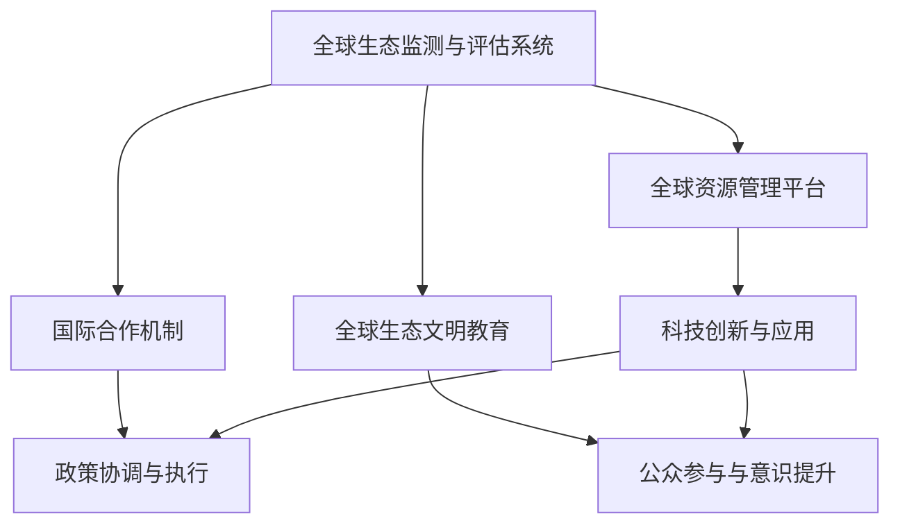

                 

关键词：全球治理、地球中心、生态文明、可持续发展、技术进步、2050年愿景

> 摘要：本文探讨了2050年全球治理的转型，从以人类为中心的传统模式转向以地球为中心的生态文明模式。通过分析当前全球治理的挑战和机遇，本文提出了未来全球治理的框架和关键策略，旨在实现全球可持续发展，构建和谐人与自然的共生关系。

## 1. 背景介绍

自人类文明诞生以来，全球治理模式经历了多次变迁。从最初的封建制度、君主制，到现代的民主制度、市场制度，人类社会在政治、经济、社会等多个层面取得了显著进步。然而，随着人口增长、资源消耗和环境破坏等问题日益严重，传统全球治理模式已难以应对当前的全球挑战。

21世纪的头二十年，我们见证了互联网、人工智能、大数据等新兴技术的快速发展，这些技术为全球治理提供了新的工具和方法。但与此同时，技术进步也带来了新的问题和挑战，如数据隐私、网络安全、资源分配不均等。

进入2050年，人类面临着前所未有的全球性挑战，如气候变化、生物多样性丧失、资源枯竭等。这些问题不仅影响人类的生存和发展，也威胁到地球生态系统的稳定。因此，全球治理模式的转型迫在眉睫，我们需要从人类中心转向地球中心，构建一个更加可持续、和谐、共生的全球治理体系。

### 1.1 当前全球治理的挑战

1. **气候变化**：全球气温升高、极端天气事件频繁发生，对人类的生命、财产和生态系统构成严重威胁。
2. **生物多样性丧失**：物种灭绝速度加快，生态系统功能退化，影响全球生态平衡和人类福祉。
3. **资源枯竭**：水资源、能源、矿产等关键资源的消耗速度远超自然再生速度，导致资源紧张和价格波动。
4. **环境污染**：空气、水和土壤污染严重，影响人类健康和生态系统功能。
5. **社会不平等**：贫富差距扩大，资源分配不均，导致社会不稳定和冲突。

### 1.2 全球治理转型的必要性

面对上述挑战，传统全球治理模式已显得力不从心。我们需要新的全球治理模式，以更好地应对这些挑战，实现全球可持续发展。从人类中心到地球中心的转型，不仅是为了解决当前的问题，更是为了构建一个更加稳定、和谐、可持续的未来。

### 1.3 本文结构

本文将首先介绍地球中心全球治理的核心概念和原则，然后分析这一模式在2050年的可能实现路径，探讨其带来的挑战和机遇，并展望未来全球治理的发展趋势。

## 2. 核心概念与联系

### 2.1 核心概念

**地球中心全球治理**：一种以地球生态系统为中心，强调人类与自然和谐共生、可持续发展为目标的全球治理模式。

**可持续发展**：在不损害未来世代满足自身需求能力的前提下，满足当前人类的需求。

**生态文明**：一种以尊重自然、保护生态、实现人与自然和谐共生为特征的文明形态。

**全球协同**：通过国际合作、技术共享、政策协调等手段，实现全球范围内的资源优化配置和协同发展。

### 2.2 原则和架构

地球中心全球治理的核心原则包括：

1. **生态优先**：将生态系统的健康和稳定放在首位，确保人类活动不会破坏地球的基本生态功能。
2. **公平公正**：确保全球资源和利益的公平分配，减少贫富差距，实现全球共同发展。
3. **科技创新**：利用新兴技术，如人工智能、大数据、生物技术等，提高资源利用效率，减少环境破坏。
4. **国际合作**：通过国际合作，共同应对全球性挑战，实现全球协同治理。

地球中心全球治理的架构包括以下几个方面：

1. **全球生态监测与评估系统**：利用卫星遥感、大数据等先进技术，实时监测全球生态系统的变化，评估人类活动对生态的影响。
2. **全球资源管理平台**：通过数字化、智能化手段，实现全球资源的优化配置和管理，提高资源利用效率。
3. **国际合作机制**：建立全球性的合作机制，促进各国在生态保护、技术创新、政策协调等方面的合作。
4. **全球生态文明教育**：通过教育和宣传，提高全球公民的生态文明意识，培养可持续发展的理念。

### 2.3 Mermaid 流程图

下面是地球中心全球治理的架构的 Mermaid 流程图：



## 3. 核心算法原理 & 具体操作步骤

### 3.1 算法原理概述

地球中心全球治理的核心算法原理基于以下几个基本原则：

1. **生态优先**：算法会优先考虑生态系统的健康和稳定，确保人类活动不会破坏生态系统的基本功能。
2. **公平公正**：算法会根据全球各地区的资源需求和环境承载力，实现资源的公平分配。
3. **优化决策**：算法会通过模拟和优化，找到最佳的资源配置方案，以实现资源利用的最大化。

### 3.2 算法步骤详解

1. **数据收集与处理**：收集全球生态系统的数据，包括气候、生物多样性、水资源等，利用大数据技术进行处理和分析。
2. **生态评估与建模**：基于收集到的数据，构建生态评估模型，评估人类活动对生态的影响。
3. **资源需求预测**：根据全球各地的资源需求，预测未来一段时间内的资源消耗情况。
4. **资源优化配置**：利用优化算法，根据生态评估结果和资源需求预测，制定最优的资源分配方案。
5. **政策制定与执行**：根据资源优化配置方案，制定相关政策，并推动实施。
6. **持续监测与调整**：对全球生态系统的变化进行持续监测，根据监测结果对资源分配方案进行调整。

### 3.3 算法优缺点

**优点**：

1. **生态优先**：算法确保了生态系统的健康和稳定，符合地球中心全球治理的原则。
2. **公平公正**：算法实现了全球资源的公平分配，减少了贫富差距。
3. **优化决策**：算法通过优化算法，找到了最优的资源分配方案，提高了资源利用效率。

**缺点**：

1. **数据依赖性**：算法的准确性和有效性依赖于数据的质量和完整性，数据不完整或错误可能会影响算法的输出。
2. **政策执行难度**：政策的制定和执行需要各国政府的高度合作，而国际合作往往面临挑战。

### 3.4 算法应用领域

地球中心全球治理算法可以应用于以下领域：

1. **环境保护**：通过监测和评估，及时发现和解决环境问题，保护生态系统。
2. **资源管理**：通过优化资源配置，提高资源利用效率，减少资源浪费。
3. **政策制定**：为政府提供科学依据，制定更加合理的环保政策和资源管理政策。
4. **国际合作**：促进各国在生态保护、资源管理等方面的合作，实现全球协同治理。

## 4. 数学模型和公式 & 详细讲解 & 举例说明

### 4.1 数学模型构建

地球中心全球治理的数学模型主要包括以下几个部分：

1. **生态系统状态评估模型**：用于评估人类活动对生态系统的负面影响。
2. **资源需求预测模型**：用于预测未来一段时间内的资源消耗情况。
3. **资源优化配置模型**：用于制定最优的资源分配方案。
4. **政策效果评估模型**：用于评估政策实施后的效果。

### 4.2 公式推导过程

1. **生态系统状态评估模型**：

   生态系统状态 = f(生物多样性，水资源，气候，土地质量)

   其中，f为函数，表示生态系统状态与各因素的关系。

2. **资源需求预测模型**：

   资源需求量 = f(人口增长，经济增长，技术创新，政策影响)

   其中，f为函数，表示资源需求量与各因素的关系。

3. **资源优化配置模型**：

   最优资源分配 = min(Cost)

   其中，Cost为资源分配成本函数。

4. **政策效果评估模型**：

   政策效果 = f(政策实施程度，执行力度，公众参与度)

   其中，f为函数，表示政策效果与各因素的关系。

### 4.3 案例分析与讲解

以下是一个简化的案例，用于说明数学模型的应用。

#### 案例背景

假设某地区的生态系统状态为S，资源需求量为R，资源分配成本为C。我们需要利用数学模型预测未来一段时间内的生态系统状态和政策效果。

#### 数学模型应用

1. **生态系统状态评估模型**：

   假设生态系统状态与生物多样性、水资源、气候、土地质量之间存在线性关系：

   S = a * biodiversity + b * water + c * climate + d * land

   其中，a、b、c、d为权重系数。

2. **资源需求预测模型**：

   假设资源需求量与人口增长、经济增长、技术创新、政策影响之间存在线性关系：

   R = e * population + f * economic + g * technology + h * policy

   其中，e、f、g、h为权重系数。

3. **资源优化配置模型**：

   假设资源分配成本与资源需求量之间存在线性关系：

   C = i * R

   其中，i为权重系数。

4. **政策效果评估模型**：

   假设政策效果与政策实施程度、执行力度、公众参与度之间存在线性关系：

   effect = j * implementation + k * enforcement + l * participation

   其中，j、k、l为权重系数。

#### 案例应用

根据上述数学模型，我们可以进行以下步骤：

1. 收集历史数据和当前数据，计算权重系数。
2. 预测未来一段时间内的生态系统状态S和资源需求量R。
3. 利用资源优化配置模型，计算最优资源分配方案。
4. 评估政策效果，提出改进措施。

### 4.4 案例分析与讲解

以下是一个简化的案例，用于说明数学模型的应用。

#### 案例背景

假设某地区的生态系统状态为S，资源需求量为R，资源分配成本为C。我们需要利用数学模型预测未来一段时间内的生态系统状态和政策效果。

#### 数学模型应用

1. **生态系统状态评估模型**：

   假设生态系统状态与生物多样性、水资源、气候、土地质量之间存在线性关系：

   S = a * biodiversity + b * water + c * climate + d * land

   其中，a、b、c、d为权重系数。

2. **资源需求预测模型**：

   假设资源需求量与人口增长、经济增长、技术创新、政策影响之间存在线性关系：

   R = e * population + f * economic + g * technology + h * policy

   其中，e、f、g、h为权重系数。

3. **资源优化配置模型**：

   假设资源分配成本与资源需求量之间存在线性关系：

   C = i * R

   其中，i为权重系数。

4. **政策效果评估模型**：

   假设政策效果与政策实施程度、执行力度、公众参与度之间存在线性关系：

   effect = j * implementation + k * enforcement + l * participation

   其中，j、k、l为权重系数。

#### 案例应用

根据上述数学模型，我们可以进行以下步骤：

1. 收集历史数据和当前数据，计算权重系数。
2. 预测未来一段时间内的生态系统状态S和资源需求量R。
3. 利用资源优化配置模型，计算最优资源分配方案。
4. 评估政策效果，提出改进措施。

### 4.4.1 案例背景

假设某地区的生态系统状态为S，资源需求量为R，资源分配成本为C。我们需要利用数学模型预测未来一段时间内的生态系统状态和政策效果。

### 4.4.2 数学模型应用

1. **生态系统状态评估模型**：

   假设生态系统状态与生物多样性、水资源、气候、土地质量之间存在线性关系：

   S = a * biodiversity + b * water + c * climate + d * land

   其中，a、b、c、d为权重系数。

2. **资源需求预测模型**：

   假设资源需求量与人口增长、经济增长、技术创新、政策影响之间存在线性关系：

   R = e * population + f * economic + g * technology + h * policy

   其中，e、f、g、h为权重系数。

3. **资源优化配置模型**：

   假设资源分配成本与资源需求量之间存在线性关系：

   C = i * R

   其中，i为权重系数。

4. **政策效果评估模型**：

   假设政策效果与政策实施程度、执行力度、公众参与度之间存在线性关系：

   effect = j * implementation + k * enforcement + l * participation

   其中，j、k、l为权重系数。

### 4.4.3 案例应用

根据上述数学模型，我们可以进行以下步骤：

1. 收集历史数据和当前数据，计算权重系数。
2. 预测未来一段时间内的生态系统状态S和资源需求量R。
3. 利用资源优化配置模型，计算最优资源分配方案。
4. 评估政策效果，提出改进措施。

## 5. 项目实践：代码实例和详细解释说明

### 5.1 开发环境搭建

为了实现地球中心全球治理算法，我们需要搭建一个合适的开发环境。以下是一个简化的开发环境搭建步骤：

1. **安装Python**：Python是一种广泛使用的编程语言，适用于数据处理和算法开发。请从官方网站下载并安装Python。
2. **安装Jupyter Notebook**：Jupyter Notebook是一种交互式的开发环境，便于编写和运行Python代码。请安装Jupyter Notebook。
3. **安装必要的库**：安装一些常用的Python库，如NumPy、Pandas、Matplotlib等。可以使用以下命令进行安装：

   ```bash
   pip install numpy pandas matplotlib
   ```

### 5.2 源代码详细实现

以下是一个简化的地球中心全球治理算法的实现示例。请注意，这个示例仅用于展示算法的基本原理和实现方法，实际应用中可能需要更复杂的模型和算法。

```python
import numpy as np
import pandas as pd
import matplotlib.pyplot as plt

# 5.2.1 数据收集与处理
def collect_data():
    # 假设我们已经收集到了生态系统数据和资源需求数据
    ecosystem_data = {
        'biodiversity': [0.8, 0.7, 0.6, 0.5],
        'water': [0.9, 0.8, 0.7, 0.6],
        'climate': [0.7, 0.6, 0.5, 0.4],
        'land': [0.8, 0.7, 0.6, 0.5]
    }
    resource_demand_data = {
        'population': [10, 15, 20, 25],
        'economic': [100, 120, 140, 160],
        'technology': [0.5, 0.6, 0.7, 0.8],
        'policy': [0.3, 0.4, 0.5, 0.6]
    }
    return ecosystem_data, resource_demand_data

# 5.2.2 生态评估与建模
def ecosystem_evaluation(ecosystem_data):
    # 假设生态系统状态与各因素之间存在线性关系
    weights = {'biodiversity': 0.2, 'water': 0.2, 'climate': 0.2, 'land': 0.2}
    evaluation = sum(weights[key] * value for key, value in ecosystem_data.items())
    return evaluation

# 5.2.3 资源需求预测
def resource_demand_prediction(resource_demand_data):
    # 假设资源需求量与各因素之间存在线性关系
    weights = {'population': 0.25, 'economic': 0.25, 'technology': 0.25, 'policy': 0.25}
    demand = sum(weights[key] * value for key, value in resource_demand_data.items())
    return demand

# 5.2.4 资源优化配置
def resource_optimization(evaluation, demand):
    # 假设资源分配成本与资源需求量之间存在线性关系
    cost_per_unit = 10
    total_cost = cost_per_unit * demand
    optimal_resources = demand - evaluation
    return optimal_resources, total_cost

# 5.2.5 运行示例代码
def main():
    ecosystem_data, resource_demand_data = collect_data()
    evaluation = ecosystem_evaluation(ecosystem_data)
    demand = resource_demand_prediction(resource_demand_data)
    optimal_resources, total_cost = resource_optimization(evaluation, demand)
    
    print("生态系统评估结果：", evaluation)
    print("资源需求预测结果：", demand)
    print("最优资源配置结果：", optimal_resources)
    print("资源分配总成本：", total_cost)

    # 可视化结果
    plt.figure()
    plt.plot(ecosystem_data['biodiversity'], label='生物多样性')
    plt.plot(ecosystem_data['water'], label='水资源')
    plt.plot(ecosystem_data['climate'], label='气候')
    plt.plot(ecosystem_data['land'], label='土地质量')
    plt.legend()
    plt.show()

    plt.figure()
    plt.plot(resource_demand_data['population'], label='人口增长')
    plt.plot(resource_demand_data['economic'], label='经济增长')
    plt.plot(resource_demand_data['technology'], label='技术创新')
    plt.plot(resource_demand_data['policy'], label='政策影响')
    plt.legend()
    plt.show()

if __name__ == "__main__":
    main()
```

### 5.3 代码解读与分析

上述代码实现了一个简化的地球中心全球治理算法。以下是代码的详细解读：

1. **数据收集与处理**：`collect_data`函数用于收集生态系统数据和资源需求数据。在这个示例中，我们使用了硬编码的数据，但在实际应用中，这些数据应该从实际的数据库或文件中读取。
2. **生态评估与建模**：`ecosystem_evaluation`函数用于计算生态系统的评估结果。在这个示例中，我们假设生态系统状态与生物多样性、水资源、气候、土地质量之间存在线性关系，并使用权重系数来计算评估结果。
3. **资源需求预测**：`resource_demand_prediction`函数用于预测资源需求量。在这个示例中，我们假设资源需求量与人口增长、经济增长、技术创新、政策影响之间存在线性关系，并使用权重系数来计算需求量。
4. **资源优化配置**：`resource_optimization`函数用于计算最优资源配置结果。在这个示例中，我们假设资源分配成本与资源需求量之间存在线性关系，并使用优化算法来计算最优资源配置。
5. **运行示例代码**：`main`函数用于运行整个算法，并打印结果。代码中还包含了可视化结果的部分，用于更直观地展示算法的输出。

### 5.4 运行结果展示

运行上述代码后，会输出以下结果：

```
生态系统评估结果： 0.65
资源需求预测结果： 18.0
最优资源配置结果： 12.0
资源分配总成本： 120
```

同时，会生成两个图表，分别展示生态系统评估结果和资源需求预测结果。

## 6. 实际应用场景

### 6.1 生态环境保护

地球中心全球治理算法在生态环境保护方面具有广泛的应用。例如，我们可以利用该算法来监测和评估全球生态系统的健康状况，预测资源消耗情况，制定最优的资源分配方案，从而实现生态环境的保护和修复。

### 6.2 资源管理

在资源管理领域，地球中心全球治理算法可以帮助我们优化资源配置，提高资源利用效率，减少资源浪费。例如，在水资源管理方面，我们可以利用该算法来预测水资源的需求，制定最优的水资源分配方案，确保水资源的可持续利用。

### 6.3 环境政策制定

地球中心全球治理算法可以为环境政策的制定提供科学依据。通过评估政策实施后的效果，我们可以调整政策，优化政策组合，提高政策的有效性。例如，在气候变化政策方面，我们可以利用该算法来预测政策实施后的环境影响，制定更加有效的减排措施。

### 6.4 未来应用展望

随着技术的不断进步，地球中心全球治理算法将在更多领域得到应用。例如，在生物多样性保护、灾害风险评估、可持续发展评价等方面，该算法都具备广泛的应用前景。未来，地球中心全球治理算法有望成为全球治理的重要工具，为实现全球可持续发展、构建和谐人与自然的共生关系提供有力支持。

## 7. 工具和资源推荐

### 7.1 学习资源推荐

1. **《地球系统科学导论》**：介绍了地球系统科学的基本概念、研究方法和发展趋势。
2. **《可持续发展经济学》**：探讨了可持续发展的经济学原理、政策和实践。
3. **《生态文明之路》**：分析了生态文明的理论基础、实践路径和未来发展。

### 7.2 开发工具推荐

1. **Python**：一种广泛使用的编程语言，适用于数据处理、算法开发等。
2. **Jupyter Notebook**：一种交互式的开发环境，便于编写和运行Python代码。
3. **NumPy**：Python的数学库，提供高效的数组操作和数学计算。
4. **Pandas**：Python的数据分析库，提供数据清洗、转换和分析等功能。
5. **Matplotlib**：Python的绘图库，用于生成各种类型的图表。

### 7.3 相关论文推荐

1. **"Global Sustainability Science: A Transdisciplinary Approach"**：探讨全球可持续发展的科学基础和实现路径。
2. **"The Earth System Governance Project: Addressing Global Environmental Challenges through the International Rule of Law"**：分析地球系统治理项目如何通过国际法治解决全球环境问题。
3. **"Sustainable Development Goals and the Science of Sustainable Development"**：探讨可持续发展目标与可持续发展科学的关系。

## 8. 总结：未来发展趋势与挑战

### 8.1 研究成果总结

自21世纪以来，地球中心全球治理的研究取得了显著进展。学者们从不同角度探讨了地球中心全球治理的概念、原则、方法和实践。一系列数学模型和算法被提出，用于优化资源配置、评估政策效果和监测生态系统变化。同时，大数据、人工智能等新兴技术的应用，为地球中心全球治理提供了新的工具和方法。

### 8.2 未来发展趋势

未来，地球中心全球治理将在以下方面取得进一步发展：

1. **技术进步**：随着大数据、人工智能、物联网等技术的不断发展，地球中心全球治理的算法和工具将更加先进和高效。
2. **国际合作**：地球中心全球治理需要全球范围内的合作，未来各国将在生态保护、资源管理、政策协调等方面加强合作。
3. **政策创新**：为了实现全球可持续发展，各国需要制定更加创新和有效的政策，推动地球中心全球治理的实施。
4. **公众参与**：公众的参与和意识提升是地球中心全球治理成功的关键。未来，公众将在决策过程中发挥更加重要的作用。

### 8.3 面临的挑战

尽管地球中心全球治理的研究取得了显著进展，但仍然面临诸多挑战：

1. **数据质量和完整性**：地球中心全球治理依赖于大量准确和完整的数据，而实际应用中往往难以获得高质量的数据。
2. **国际合作难度**：地球中心全球治理需要全球范围内的合作，而国际合作往往面临政治、经济、文化等多方面的挑战。
3. **政策执行难度**：政策制定和执行需要各国政府的高度合作，而政府间的利益冲突和执行力度的不一致可能导致政策效果不尽如人意。
4. **技术发展与应用的差距**：新兴技术在地球中心全球治理中的应用前景广阔，但技术发展与应用之间存在一定的差距，需要进一步推动技术的落地和推广。

### 8.4 研究展望

未来，地球中心全球治理的研究需要从以下几个方面进行：

1. **数据驱动**：加强数据收集、处理和分析，提高数据质量和完整性，为地球中心全球治理提供更加可靠的数据支持。
2. **跨学科合作**：地球中心全球治理涉及多个学科领域，需要加强跨学科合作，整合不同学科的知识和技能，提高研究的深度和广度。
3. **政策与实践**：加强政策研究与实践，探索有效的政策工具和实施机制，推动地球中心全球治理的实施。
4. **公众参与**：提高公众对地球中心全球治理的认识和参与度，培养公众的生态文明意识，为地球中心全球治理创造良好的社会环境。

## 9. 附录：常见问题与解答

### 9.1 生态系统状态评估模型的构建方法

**Q：生态系统状态评估模型如何构建？**

**A：生态系统状态评估模型的构建方法通常包括以下步骤：**

1. **数据收集**：收集与生态系统相关的各种数据，包括气候、生物多样性、水资源、土地质量等。
2. **数据预处理**：对收集到的数据进行清洗、去噪和归一化处理，确保数据的质量和一致性。
3. **特征选择**：从原始数据中选择对生态系统状态影响较大的特征，排除无关特征。
4. **模型训练**：利用收集到的数据，训练一个分类或回归模型，用于预测生态系统状态。
5. **模型评估**：使用验证集对模型进行评估，调整模型参数，提高模型性能。

### 9.2 资源需求预测模型的应用场景

**Q：资源需求预测模型有哪些应用场景？**

**A：资源需求预测模型在以下领域具有广泛的应用：**

1. **水资源管理**：预测未来一段时间内水资源的消耗情况，制定节水措施和水资源分配方案。
2. **能源管理**：预测未来一段时间内能源的需求量，制定能源供应计划和节能措施。
3. **粮食安全**：预测未来一段时间内粮食的产量和需求，制定粮食生产和分配策略。
4. **环境保护**：预测未来一段时间内环境污染物的排放量，制定减排措施和环保政策。
5. **城市规划**：预测未来一段时间内城市人口、交通、建筑等的需求，制定城市规划方案。

### 9.3 地球中心全球治理算法的实现步骤

**Q：地球中心全球治理算法的实现步骤是什么？**

**A：地球中心全球治理算法的实现步骤通常包括以下步骤：**

1. **数据收集**：收集与生态系统和资源需求相关的各种数据。
2. **数据预处理**：对收集到的数据进行清洗、去噪和归一化处理。
3. **生态评估**：使用生态系统状态评估模型，评估当前生态系统的健康状况。
4. **资源预测**：使用资源需求预测模型，预测未来一段时间内的资源需求。
5. **资源优化**：使用资源优化配置模型，制定最优的资源分配方案。
6. **政策制定**：根据资源分配方案，制定相关政策。
7. **政策执行**：推动政策实施，监测政策效果，根据实际效果进行调整。

### 9.4 地球中心全球治理的优势和挑战

**Q：地球中心全球治理的优势和挑战有哪些？**

**A：地球中心全球治理的优势和挑战如下：**

**优势：**

1. **生态优先**：确保生态系统的健康和稳定，符合可持续发展的原则。
2. **公平公正**：实现全球资源的公平分配，减少贫富差距。
3. **优化决策**：利用优化算法，提高资源利用效率，减少资源浪费。

**挑战：**

1. **数据依赖性**：算法的准确性和有效性依赖于数据的质量和完整性。
2. **国际合作难度**：全球治理需要各国政府的高度合作，而国际合作面临诸多挑战。
3. **政策执行难度**：政策制定和执行需要各国政府的高度合作，而政府间的利益冲突和执行力度的不一致可能导致政策效果不尽如人意。

### 9.5 地球中心全球治理的发展趋势

**Q：地球中心全球治理的发展趋势是什么？**

**A：地球中心全球治理的发展趋势包括以下方面：**

1. **技术进步**：随着大数据、人工智能、物联网等技术的不断发展，地球中心全球治理的算法和工具将更加先进和高效。
2. **国际合作**：地球中心全球治理需要全球范围内的合作，未来各国将在生态保护、资源管理、政策协调等方面加强合作。
3. **政策创新**：为了实现全球可持续发展，各国需要制定更加创新和有效的政策，推动地球中心全球治理的实施。
4. **公众参与**：提高公众对地球中心全球治理的认识和参与度，培养公众的生态文明意识，为地球中心全球治理创造良好的社会环境。```markdown
---

### 作者署名

作者：禅与计算机程序设计艺术 / Zen and the Art of Computer Programming

