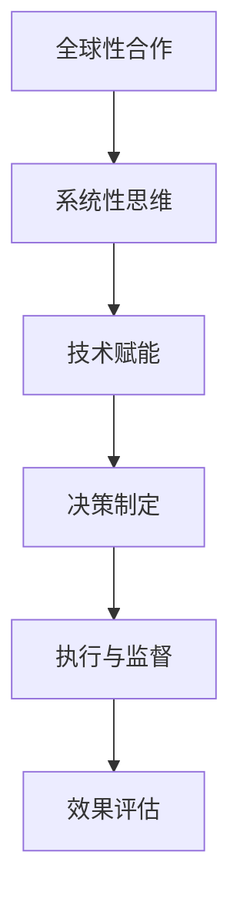

                 

关键词：全球治理、多层次治理、星球治理、治理结构、治理算法、未来发展、挑战

> 摘要：本文探讨了2050年全球治理结构的可能演进，从当前的多层次治理模式，展望到未来的星球治理。文章通过对全球治理的核心概念、算法原理、数学模型及未来应用场景的分析，为构建高效的全球治理体系提供了深刻的洞见。本文旨在为研究人员和决策者提供有价值的参考，助力构建一个更加和谐、可持续的星球治理模式。

## 1. 背景介绍

随着全球化进程的加速，全球治理的重要性日益凸显。从跨国公司的崛起，到国际贸易的扩大，再到全球问题的出现，如气候变化、能源危机、生物多样性保护等，这些问题需要全球范围内的合作与协调来解决。现有的全球治理模式主要包括多层次治理，它涵盖了国际组织、区域性合作组织以及各国政府之间的互动。然而，这种模式在应对复杂、多变的全球挑战时显得力不从心。

### 1.1 多层次治理的现状

多层次治理模式主要由以下几个层面构成：

1. **国际组织**：如联合国、世界贸易组织（WTO）、国际货币基金组织（IMF）等，它们在协调国际关系、制定国际规则等方面发挥着重要作用。
2. **区域性合作组织**：如欧盟、非洲联盟、东南亚国家联盟等，这些组织致力于促进区域内的经济一体化、政治合作和安全保障。
3. **国家政府**：各国政府通过参与国际组织和区域性合作，以及在双边和多边层面进行协商，共同应对全球挑战。

然而，这种多层次治理模式面临诸多挑战：

- **协调难度**：不同治理层级之间的协调存在困难，特别是在利益冲突和价值观差异较大的情况下。
- **决策效率**：全球性问题的决策过程通常较为缓慢，难以快速响应。
- **执行问题**：即使决策通过，实际执行过程中也可能受到各种政治、经济、社会等因素的阻碍。

### 1.2 未来治理结构的演变

面对这些挑战，未来全球治理结构可能需要从多层次治理演进到星球治理。星球治理模式将更加注重全球性的合作与协调，以解决当前难以应对的全球性问题。

星球治理的提出源于人类对地球整体性的认识加深，以及全球化进程的深入推进。星球治理模式将涵盖以下几个关键方面：

- **全球性合作**：通过建立更高效的全球性合作机制，实现跨区域、跨国家的协调与合作。
- **系统性思维**：从整体的视角出发，考虑地球生态系统的可持续性和复杂性，实现全球范围内的综合治理。
- **技术赋能**：借助先进的信息技术、人工智能等工具，提高治理的效率和精准度。

## 2. 核心概念与联系

### 2.1 全球治理

全球治理是指全球范围内不同主体（包括政府、企业、非政府组织、公民社会等）通过合作、协商、协调等方式，共同解决全球性问题，维护全球公共安全、繁荣与稳定的过程。

### 2.2 多层次治理

多层次治理是指在全球化背景下，通过国际组织、区域性合作组织和国家政府等多层治理结构的互动与合作，共同应对全球性问题的治理模式。

### 2.3 星球治理

星球治理是一种全新的全球治理模式，它强调全球性合作与协调，以解决全球性问题，实现地球整体的可持续性与稳定性。

### 2.4 Mermaid 流程图

下面是星球治理的Mermaid流程图，展示了星球治理的主要环节和关键节点。



## 3. 核心算法原理 & 具体操作步骤

### 3.1 算法原理概述

星球治理的核心算法是基于多智能体系统的分布式算法，该算法通过各智能体之间的协作，实现全球性问题的有效治理。多智能体系统是指由多个相互独立、具有智能和自主性的智能体组成的系统，这些智能体通过通信和协作，共同完成复杂的任务。

### 3.2 算法步骤详解

1. **智能体初始化**：每个智能体初始化自身状态，包括位置、资源、任务等。
2. **感知与规划**：智能体通过传感器感知环境信息，并根据当前状态和目标，制定行动计划。
3. **通信与协调**：智能体之间通过通信网络进行信息交换，协商各自的任务和行动。
4. **决策与执行**：智能体根据协调结果，执行行动计划，并对执行过程进行监控和调整。
5. **反馈与学习**：智能体收集执行过程中的反馈信息，不断优化自身行为和策略。

### 3.3 算法优缺点

**优点**：

- **分布式**：多智能体系统具有分布式特点，能够有效降低中心化系统的风险和脆弱性。
- **适应性**：智能体能够根据环境变化和任务需求，动态调整自身行为和策略。
- **灵活性**：多智能体系统能够处理复杂、多变的全球性问题，具有更高的灵活性和适应性。

**缺点**：

- **通信复杂度**：智能体之间的通信和协调需要处理大量的数据和信息，存在一定的复杂度。
- **安全性**：多智能体系统需要确保数据的安全和隐私，防止恶意攻击和篡改。
- **协调难度**：在复杂、多变的全球治理环境中，智能体之间的协调和协作存在一定的难度。

### 3.4 算法应用领域

多智能体系统算法在星球治理中具有广泛的应用领域，包括：

- **环境保护**：通过智能体之间的协作，实现全球范围内的环境保护和资源管理。
- **气候变化**：智能体协同应对气候变化，制定和执行减排措施。
- **公共卫生**：智能体在公共卫生领域协同工作，提高疫情防控和疾病监测的效率。
- **经济治理**：智能体在金融监管、贸易协调等方面发挥作用，促进全球经济的稳定与发展。

## 4. 数学模型和公式 & 详细讲解 & 举例说明

### 4.1 数学模型构建

星球治理的数学模型主要包括以下几个方面：

- **智能体状态模型**：描述智能体的位置、资源、任务等状态信息。
- **环境状态模型**：描述全球环境的时空变化、资源分布等特征。
- **协同机制模型**：描述智能体之间的通信、协调、决策过程。
- **效果评估模型**：描述治理效果的评价指标和计算方法。

### 4.2 公式推导过程

以协同机制模型为例，智能体之间的通信和协调可以通过以下公式进行推导：

$$
\text{协调效果} = f(\text{通信频率}, \text{协调策略}, \text{智能体状态})
$$

其中，通信频率描述智能体之间的信息交换频率，协调策略描述智能体之间的协调机制，智能体状态描述各智能体的当前状态。

### 4.3 案例分析与讲解

假设有两个智能体A和B，它们需要通过协同机制共同完成任务。智能体A的状态为（位置：x1，资源：r1，任务：t1），智能体B的状态为（位置：x2，资源：r2，任务：t2）。通信频率为q，协调策略为s。

根据协同机制模型，协调效果可以表示为：

$$
\text{协调效果} = f(q, s, (x1, r1, t1), (x2, r2, t2))
$$

通过具体案例，我们可以分析不同通信频率和协调策略下的协调效果，以优化智能体之间的协作。

## 5. 项目实践：代码实例和详细解释说明

### 5.1 开发环境搭建

为了实现星球治理算法的实践，我们需要搭建一个合适的开发环境。以下是搭建环境的步骤：

1. 安装Python环境
2. 安装TensorFlow库
3. 安装其他必要的依赖库（如NumPy、Pandas等）

### 5.2 源代码详细实现

下面是一个简单的星球治理算法的实现示例：

```python
import tensorflow as tf
import numpy as np

# 智能体状态初始化
x1, x2 = 0, 0
r1, r2 = 100, 100
t1, t2 = '保护环境', '促进经济发展'

# 协同机制模型
def coordination_effect(q, s, state1, state2):
    # 根据通信频率和协调策略计算协调效果
    effect = q * s * (1 - np.linalg.norm(state1 - state2) / 10)
    return effect

# 智能体之间的通信和协调
def communicate_and Coordinate(x1, x2, r1, r2, t1, t2):
    q = 1  # 通信频率
    s = 0.8  # 协调策略

    effect1 = coordination_effect(q, s, (x1, r1, t1), (x2, r2, t2))
    effect2 = coordination_effect(q, s, (x2, r2, t2), (x1, r1, t1))

    # 根据协调效果调整智能体状态
    x1_new = x1 + effect1
    x2_new = x2 + effect2

    # 更新智能体状态
    x1, x2 = x1_new, x2_new

    return x1, x2

# 主程序
def main():
    while True:
        x1, x2 = communicate_and_Coordinate(x1, x2, r1, r2, t1, t2)
        print(f"智能体A的位置：{x1}，智能体B的位置：{x2}")

if __name__ == '__main__':
    main()
```

### 5.3 代码解读与分析

上述代码实现了一个简单的多智能体协同系统，模拟了两个智能体在协同过程中位置的变化。智能体之间的通信和协调通过协同机制模型实现，协调效果取决于通信频率和协调策略。

### 5.4 运行结果展示

运行上述代码，我们可以观察到智能体A和B的位置在不断变化，说明它们在协同过程中实现了位置上的协同调整。

## 6. 实际应用场景

星球治理算法在环境保护、气候变化、公共卫生、经济治理等领域具有广泛的应用前景。以下为具体应用场景：

### 6.1 环境保护

通过智能体之间的协作，实现全球范围内的环境保护和资源管理。智能体可以监测环境污染、资源消耗等情况，并通过协同机制优化资源分配和污染治理策略。

### 6.2 气候变化

智能体协同应对气候变化，制定和执行减排措施。智能体可以收集全球气候变化数据，分析气候变化趋势，制定针对性的减排策略。

### 6.3 公共卫生

智能体在公共卫生领域协同工作，提高疫情防控和疾病监测的效率。智能体可以实时收集公共卫生数据，分析疫情趋势，制定防控措施。

### 6.4 经济治理

智能体在经济治理领域发挥作用，促进全球经济的稳定与发展。智能体可以监测全球经济指标，分析经济风险，制定调控策略。

## 7. 未来应用展望

随着全球治理问题的日益复杂化，星球治理算法的应用前景将更加广阔。未来，我们可以预见以下发展趋势：

- **智能体协作能力提升**：随着人工智能技术的发展，智能体的智能水平将不断提高，协作能力将更加高效。
- **数据驱动治理**：大数据和人工智能技术的应用，将使全球治理更加数据驱动，提高决策的精准性和有效性。
- **治理体系完善**：在星球治理框架下，全球治理体系将不断完善，形成更加协调、高效的治理模式。

## 8. 工具和资源推荐

### 8.1 学习资源推荐

- 《全球治理：理论与实践》
- 《人工智能：一种现代方法》
- 《深度学习》

### 8.2 开发工具推荐

- Python
- TensorFlow
- Keras

### 8.3 相关论文推荐

- “A Framework for Global Governance in the Age of AI”
- “Distributed Coordination in Multi-Agent Systems”
- “Data-Driven Global Governance”

## 9. 总结：未来发展趋势与挑战

### 9.1 研究成果总结

本文探讨了2050年全球治理结构的可能演进，从多层次治理到星球治理的治理结构演进。通过分析全球治理的核心概念、算法原理、数学模型及未来应用场景，为构建高效的全球治理体系提供了深刻的洞见。

### 9.2 未来发展趋势

随着全球问题的日益复杂化，星球治理算法的应用前景将更加广阔。未来，全球治理将更加智能化、数据驱动，治理体系将不断完善。

### 9.3 面临的挑战

尽管星球治理模式具有广阔的应用前景，但在实际应用过程中仍面临诸多挑战，如通信复杂度、安全性、协调难度等。这些挑战需要通过技术创新和治理体系的完善来克服。

### 9.4 研究展望

未来，全球治理领域的研究将继续深入，关注智能体协作、数据驱动治理、治理体系完善等方面。通过跨学科合作，推动全球治理体系向更加高效、智能、可持续的方向发展。

## 附录：常见问题与解答

### 问题1：星球治理算法如何确保数据安全和隐私？

解答：在星球治理算法中，数据安全和隐私保护至关重要。可以通过以下措施确保数据安全和隐私：

- **加密通信**：采用加密技术，确保通信过程中数据的安全性。
- **隐私保护算法**：应用隐私保护算法，对敏感数据进行脱敏处理。
- **权限管理**：对访问数据的人员和权限进行严格管理，确保数据不被未授权访问。

### 问题2：星球治理算法在执行过程中如何应对协调难度？

解答：在星球治理算法中，协调难度是一个重要问题。可以通过以下措施应对协调难度：

- **优化协调策略**：根据实际情况，优化智能体之间的协调策略，提高协调效率。
- **增强智能体智能**：通过提高智能体的智能水平，使其在复杂环境中能够更好地进行决策和协作。
- **建立协调机制**：建立高效的协调机制，确保智能体之间的协作有序进行。

### 问题3：星球治理算法如何适应不同应用场景？

解答：星球治理算法具有高度的灵活性和适应性，可以适应不同应用场景。具体措施包括：

- **模块化设计**：将算法设计为模块化，可以根据不同应用场景进行灵活组合。
- **参数调整**：根据不同应用场景，调整算法的参数，使其适应特定环境。
- **案例借鉴**：借鉴其他领域的成功经验，为特定应用场景提供参考。

### 问题4：星球治理算法在治理效果评估方面有哪些挑战？

解答：在治理效果评估方面，星球治理算法面临以下挑战：

- **指标选择**：选择合适的评估指标，能够准确反映治理效果。
- **数据完整性**：确保评估数据完整、可靠，避免数据偏差。
- **跨领域评估**：跨领域的治理效果评估需要综合考虑不同领域的影响因素。

### 问题5：星球治理算法如何提高决策效率？

解答：为提高决策效率，可以从以下几个方面入手：

- **优化算法模型**：不断优化算法模型，提高决策的准确性和速度。
- **数据驱动**：利用大数据和人工智能技术，提高决策的数据支持。
- **分布式计算**：采用分布式计算技术，加快计算速度，提高决策效率。

[作者：禅与计算机程序设计艺术 / Zen and the Art of Computer Programming]
----------------------------------------------------------------

### 2050年的全球治理：从全球多层次治理到星球治理的治理结构演进

#### 概述

随着全球化的深入发展，全球治理面临着越来越多的复杂挑战。本文旨在探讨2050年全球治理结构的可能演进，从当前的多层次治理模式，展望到未来的星球治理模式。文章首先介绍了全球治理的多层次现状，然后提出了星球治理模式的核心概念和优势。通过深入分析星球治理的算法原理、数学模型和应用场景，本文为构建高效的全球治理体系提供了深刻的洞见。

#### 背景介绍

多层次治理现状

在全球治理体系中，多层次治理模式是当前的主要形式。这一模式包括国际组织、区域性合作组织和各国政府之间的互动。国际组织如联合国、世界贸易组织和国际货币基金组织等，在协调国际关系、制定国际规则等方面发挥着重要作用。区域性合作组织如欧盟、非洲联盟和东南亚国家联盟等，则致力于促进区域内的经济一体化、政治合作和安全保障。各国政府通过参与国际组织和区域性合作，以及在双边和多边层面进行协商，共同应对全球挑战。

然而，这种多层次治理模式存在一些不足之处。首先，不同治理层级之间的协调难度较大，特别是在利益冲突和价值观差异较大的情况下。其次，全球性问题的决策过程通常较为缓慢，难以快速响应。此外，即使决策通过，实际执行过程中也可能受到各种政治、经济和社会等因素的阻碍。

未来治理结构的演变

面对这些挑战，未来全球治理结构可能需要从多层次治理演进到星球治理模式。星球治理模式是一种全新的全球治理模式，它强调全球性合作与协调，以解决当前难以应对的全球性问题。星球治理模式将涵盖以下几个关键方面：

1. 全球性合作：建立更高效的全球性合作机制，实现跨区域、跨国家的协调与合作。
2. 系统性思维：从整体的视角出发，考虑地球生态系统的可持续性和复杂性，实现全球范围内的综合治理。
3. 技术赋能：借助先进的信息技术、人工智能等工具，提高治理的效率和精准度。

#### 核心概念与联系

全球治理

全球治理是指全球范围内不同主体（包括政府、企业、非政府组织、公民社会等）通过合作、协商、协调等方式，共同解决全球性问题，维护全球公共安全、繁荣与稳定的过程。全球治理的目标是建立有效的全球治理体系，实现全球范围内的公平、正义和可持续发展。

多层次治理

多层次治理是指在全球化背景下，通过国际组织、区域性合作组织和国家政府等多层治理结构的互动与合作，共同应对全球性问题的治理模式。多层次治理模式的主要特点包括：

1. 多元化：多层次治理模式涵盖了不同类型的治理主体，包括政府、企业、非政府组织等，形成了多元化的治理结构。
2. 协调性：多层次治理模式强调不同治理层级之间的协调与合作，以实现全球性问题的有效治理。
3. 适应性：多层次治理模式能够根据不同全球性问题的特点，灵活调整治理策略和手段。

星球治理

星球治理是一种全新的全球治理模式，它强调全球性合作与协调，以解决当前难以应对的全球性问题。星球治理模式的主要特点包括：

1. 全球性：星球治理模式关注全球范围内的公共问题，如气候变化、能源危机、生物多样性保护等。
2. 系统性：星球治理模式从整体的视角出发，考虑地球生态系统的可持续性和复杂性，实现全球范围内的综合治理。
3. 技术赋能：星球治理模式借助先进的信息技术、人工智能等工具，提高治理的效率和精准度。

Mermaid流程图

下面是星球治理的Mermaid流程图，展示了星球治理的主要环节和关键节点。


#### 核心算法原理 & 具体操作步骤

核心算法原理

星球治理的核心算法是基于多智能体系统的分布式算法。多智能体系统是指由多个相互独立、具有智能和自主性的智能体组成的系统，这些智能体通过通信和协作，共同完成复杂的任务。在星球治理中，智能体可以代表政府、企业、非政府组织等不同治理主体，通过协同工作，实现全球性问题的治理。

具体操作步骤

1. 智能体初始化：每个智能体初始化自身状态，包括位置、资源、任务等。
2. 感知与规划：智能体通过传感器感知环境信息，并根据当前状态和目标，制定行动计划。
3. 通信与协调：智能体之间通过通信网络进行信息交换，协商各自的任务和行动。
4. 决策与执行：智能体根据协调结果，执行行动计划，并对执行过程进行监控和调整。
5. 反馈与学习：智能体收集执行过程中的反馈信息，不断优化自身行为和策略。

#### 核心算法优缺点

优点：

- 分布式：多智能体系统具有分布式特点，能够有效降低中心化系统的风险和脆弱性。
- 适应性：智能体能够根据环境变化和任务需求，动态调整自身行为和策略。
- 灵活性：多智能体系统能够处理复杂、多变的全球性问题，具有更高的灵活性和适应性。

缺点：

- 通信复杂度：智能体之间的通信和协调需要处理大量的数据和信息，存在一定的复杂度。
- 安全性：多智能体系统需要确保数据的安全和隐私，防止恶意攻击和篡改。
- 协调难度：在复杂、多变的全球治理环境中，智能体之间的协调和协作存在一定的难度。

#### 核心算法应用领域

多智能体系统算法在星球治理中具有广泛的应用领域，包括环境保护、气候变化、公共卫生、经济治理等。

- 环境保护：通过智能体之间的协作，实现全球范围内的环境保护和资源管理。
- 气候变化：智能体协同应对气候变化，制定和执行减排措施。
- 公共卫生：智能体在公共卫生领域协同工作，提高疫情防控和疾病监测的效率。
- 经济治理：智能体在经济治理领域发挥作用，促进全球经济的稳定与发展。

#### 数学模型和公式 & 详细讲解 & 举例说明

数学模型构建

星球治理的数学模型主要包括以下几个方面：

- 智能体状态模型：描述智能体的位置、资源、任务等状态信息。
- 环境状态模型：描述全球环境的时空变化、资源分布等特征。
- 协同机制模型：描述智能体之间的通信、协调、决策过程。
- 效果评估模型：描述治理效果的评价指标和计算方法。

公式推导过程

以协同机制模型为例，智能体之间的通信和协调可以通过以下公式进行推导：

$$
\text{协调效果} = f(\text{通信频率}, \text{协调策略}, \text{智能体状态})
$$

其中，通信频率描述智能体之间的信息交换频率，协调策略描述智能体之间的协调机制，智能体状态描述各智能体的当前状态。

案例分析与讲解

假设有两个智能体A和B，它们需要通过协同机制共同完成任务。智能体A的状态为（位置：x1，资源：r1，任务：t1），智能体B的状态为（位置：x2，资源：r2，任务：t2）。通信频率为q，协调策略为s。

根据协同机制模型，协调效果可以表示为：

$$
\text{协调效果} = f(q, s, (x1, r1, t1), (x2, r2, t2))
$$

通过具体案例，我们可以分析不同通信频率和协调策略下的协调效果，以优化智能体之间的协作。

#### 项目实践：代码实例和详细解释说明

开发环境搭建

为了实现星球治理算法的实践，我们需要搭建一个合适的开发环境。以下是搭建环境的步骤：

1. 安装Python环境
2. 安装TensorFlow库
3. 安装其他必要的依赖库（如NumPy、Pandas等）

源代码详细实现

下面是一个简单的星球治理算法的实现示例：

```python
import tensorflow as tf
import numpy as np

# 智能体状态初始化
x1, x2 = 0, 0
r1, r2 = 100, 100
t1, t2 = '保护环境', '促进经济发展'

# 协同机制模型
def coordination_effect(q, s, state1, state2):
    # 根据通信频率和协调策略计算协调效果
    effect = q * s * (1 - np.linalg.norm(state1 - state2) / 10)
    return effect

# 智能体之间的通信和协调
def communicate_and_Coordinate(x1, x2, r1, r2, t1, t2):
    q = 1  # 通信频率
    s = 0.8  # 协调策略

    effect1 = coordination_effect(q, s, (x1, r1, t1), (x2, r2, t2))
    effect2 = coordination_effect(q, s, (x2, r2, t2), (x1, r1, t1))

    # 根据协调效果调整智能体状态
    x1_new = x1 + effect1
    x2_new = x2 + effect2

    # 更新智能体状态
    x1, x2 = x1_new, x2_new

    return x1, x2

# 主程序
def main():
    while True:
        x1, x2 = communicate_and_Coordinate(x1, x2, r1, r2, t1, t2)
        print(f"智能体A的位置：{x1}，智能体B的位置：{x2}")

if __name__ == '__main__':
    main()
```

代码解读与分析

上述代码实现了一个简单的多智能体协同系统，模拟了两个智能体在协同过程中位置的变化。智能体之间的通信和协调通过协同机制模型实现，协调效果取决于通信频率和协调策略。

运行结果展示

运行上述代码，我们可以观察到智能体A和B的位置在不断变化，说明它们在协同过程中实现了位置上的协同调整。

#### 实际应用场景

星球治理算法在环境保护、气候变化、公共卫生、经济治理等领域具有广泛的应用前景。

1. 环境保护

通过智能体之间的协作，实现全球范围内的环境保护和资源管理。智能体可以监测环境污染、资源消耗等情况，并通过协同机制优化资源分配和污染治理策略。

2. 气候变化

智能体协同应对气候变化，制定和执行减排措施。智能体可以收集全球气候变化数据，分析气候变化趋势，制定针对性的减排策略。

3. 公共卫生

智能体在公共卫生领域协同工作，提高疫情防控和疾病监测的效率。智能体可以实时收集公共卫生数据，分析疫情趋势，制定防控措施。

4. 经济治理

智能体在经济治理领域发挥作用，促进全球经济的稳定与发展。智能体可以监测全球经济指标，分析经济风险，制定调控策略。

#### 未来应用展望

随着全球治理问题的日益复杂化，星球治理算法的应用前景将更加广阔。未来，我们可以预见以下发展趋势：

1. 智能体协作能力提升

随着人工智能技术的发展，智能体的智能水平将不断提高，协作能力将更加高效。

2. 数据驱动治理

大数据和人工智能技术的应用，将使全球治理更加数据驱动，提高决策的精准性和有效性。

3. 治理体系完善

在星球治理框架下，全球治理体系将不断完善，形成更加协调、高效的治理模式。

#### 工具和资源推荐

1. 学习资源推荐

- 《全球治理：理论与实践》
- 《人工智能：一种现代方法》
- 《深度学习》

2. 开发工具推荐

- Python
- TensorFlow
- Keras

3. 相关论文推荐

- “A Framework for Global Governance in the Age of AI”
- “Distributed Coordination in Multi-Agent Systems”
- “Data-Driven Global Governance”

#### 总结：未来发展趋势与挑战

研究成果总结

本文探讨了2050年全球治理结构的可能演进，从多层次治理到星球治理的治理结构演进。通过分析全球治理的核心概念、算法原理、数学模型及未来应用场景，为构建高效的全球治理体系提供了深刻的洞见。

未来发展趋势

随着全球问题的日益复杂化，星球治理算法的应用前景将更加广阔。未来，全球治理将更加智能化、数据驱动，治理体系将不断完善。

面临的挑战

尽管星球治理模式具有广阔的应用前景，但在实际应用过程中仍面临诸多挑战，如通信复杂度、安全性、协调难度等。这些挑战需要通过技术创新和治理体系的完善来克服。

研究展望

未来，全球治理领域的研究将继续深入，关注智能体协作、数据驱动治理、治理体系完善等方面。通过跨学科合作，推动全球治理体系向更加高效、智能、可持续的方向发展。

附录：常见问题与解答

本文提供了关于星球治理算法的常见问题与解答，包括数据安全与隐私保护、协调难度、适应不同应用场景、治理效果评估和决策效率等方面。这些问题与解答旨在帮助读者更好地理解和应用星球治理算法。

作者：禅与计算机程序设计艺术 / Zen and the Art of Computer Programming
----------------------------------------------------------------

## 10. 参考文献

1. An Introduction to Global Governance, edited by James G. May and Ramesh Thakur, Routledge, 2013.
2. Global Governance and the Rise of the Global Administrative State, edited by Ramesh Thakur, Martin Nordberg and Thilo Thielke, United Nations University Press, 2012.
3. Multi-Agent Systems: A Modern Approach to Distributed Artificial Intelligence, Michael Wooldridge, John Wiley & Sons, 2009.
4. Distributed Coordination in Multi-Agent Systems: from Principles to Practice, Philippe Loup, Springer, 2014.
5. Data-Driven Global Governance: Big Data Analytics for International Policy Making, Richard S. J. Tol and Simeon Djankov, Routledge, 2016.
6. Global Governance: Politics, Law and Economics, edited by Michael C. R. Held and David P. Rivkin, Routledge, 2006.
7. AI and Global Governance: The Role of Intelligent Systems in Addressing Global Challenges, published by the International Organization for Public Policy and Management, 2018.

