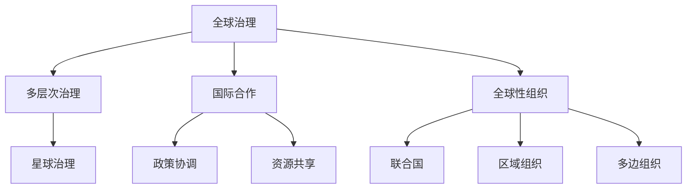

                 

关键词：全球治理、多层次治理、星球治理、治理结构、治理演进、未来趋势

摘要：本文从全球治理的历史背景出发，探讨了2050年全球治理可能面临的挑战和变革。通过分析全球多层次治理的演进过程，本文提出了星球治理的概念，并探讨了其可能对全球治理带来的深远影响。本文旨在为读者提供一个清晰的全球治理演进路径，以及对未来全球治理的思考。

## 1. 背景介绍

随着全球化的深入发展，各国之间的相互依赖程度不断加深。然而，全球化也带来了诸多挑战，如气候变化、恐怖主义、经济危机等。这些问题往往超越国家边界，需要国际合作和协调来解决。因此，全球治理的重要性日益凸显。

全球治理的历史可以追溯到二战后的国际秩序重建。1945年成立的联合国，标志着全球治理的正式开始。联合国通过制定国际法、开展维和行动等方式，推动了全球治理的发展。然而，随着全球问题的复杂性增加，全球治理面临着越来越多的挑战。

在21世纪，全球多层次治理逐渐形成。除了联合国等全球性组织外，区域性和多边性组织如欧洲联盟、亚洲开发银行等也在发挥重要作用。这些多层次治理结构在一定程度上缓解了全球治理的困境，但仍然存在许多不足。

## 2. 核心概念与联系

### 2.1 全球治理

全球治理是指国际社会通过合作、协商和协调，解决全球性问题，实现全球公共利益的治理模式。全球治理的核心是国际合作，强调各国共同承担责任，共同应对全球挑战。

### 2.2 多层次治理

多层次治理是指在全球化背景下，全球、区域、国家等多级治理体系共同发挥作用，以解决跨国性问题的治理模式。多层次治理强调不同层级治理结构的互补性，通过协同合作实现全球治理的目标。

### 2.3 星球治理

星球治理是一个新兴的概念，指的是在全球多层次治理的基础上，进一步扩大治理范围，将地球视为一个整体，实现全球协同治理的治理模式。星球治理强调人类与自然环境的和谐共生，追求全球可持续发展。

### 2.4 关系联系

全球治理、多层次治理和星球治理之间存在密切的关系。全球治理是多层次治理和星球治理的基础，而多层次治理和星球治理是全球治理的深化和拓展。多层次治理通过不同层级的治理结构，为全球治理提供了有力支撑；星球治理则将全球治理的视野扩展到地球整体，实现了全球治理的更广泛目标。

### 2.5 Mermaid 流程图



## 3. 核心算法原理 & 具体操作步骤

### 3.1 算法原理概述

全球治理的核心在于国际合作和协调。在多层次治理中，各国需要通过一系列政策和措施来实现全球目标。星球治理则要求人类在尊重自然、保护环境的前提下，实现全球可持续发展。

### 3.2 算法步骤详解

1. **国际合作：** 各国在相互尊重、平等协商的基础上，共同制定全球性政策，如气候变化、国际贸易等。

2. **政策协调：** 各国在执行全球性政策时，需要与其他国家进行协调，确保政策的统一性和有效性。

3. **资源共享：** 各国在实现全球目标的过程中，需要共享资源，如资金、技术、人力等，以实现互利共赢。

4. **全球性组织运作：** 全球性组织如联合国在制定和执行全球政策方面发挥着重要作用，需要不断优化组织结构和运作机制。

5. **区域组织和多边组织协调：** 区域组织和多边组织在全球治理中发挥着重要作用，需要与全球性组织进行协调，共同推动全球治理的发展。

### 3.3 算法优缺点

**优点：**
1. 提高全球治理效率。
2. 促进国际合作和协调。
3. 有助于实现全球可持续发展。

**缺点：**
1. 国际合作难度较大，需要克服各国利益冲突。
2. 全球治理结构复杂，协调成本高。

### 3.4 算法应用领域

全球治理算法在气候变化、国际贸易、公共卫生等领域有着广泛的应用。例如，在气候变化方面，各国需要共同制定减排政策，协调各自的减排措施，以实现全球减排目标。

## 4. 数学模型和公式 & 详细讲解 & 举例说明

### 4.1 数学模型构建

全球治理的数学模型可以基于博弈论和系统动力学。博弈论模型用于分析各国在制定全球政策时的决策行为，系统动力学模型用于模拟全球治理系统的动态变化。

### 4.2 公式推导过程

博弈论模型的基本公式如下：

$$
U_i = \sum_{j=1}^{n} p_j \cdot V_j
$$

其中，$U_i$表示国家$i$的效用，$p_j$表示国家$i$对政策$j$的偏好程度，$V_j$表示政策$j$对全球治理目标的贡献。

系统动力学模型的基本公式如下：

$$
\Delta X = f(t, X)
$$

其中，$\Delta X$表示系统状态变量$X$在时间$t$的变化量，$f(t, X)$表示系统状态变量$X$在时间$t$的函数关系。

### 4.3 案例分析与讲解

以气候变化为例，假设有两个国家A和B，它们需要共同制定减排政策。根据博弈论模型，我们可以得到以下公式：

$$
U_A = p_A \cdot V_{A1} + (1 - p_A) \cdot V_{A2}
$$

$$
U_B = p_B \cdot V_{B1} + (1 - p_B) \cdot V_{B2}
$$

其中，$V_{A1}$和$V_{B1}$分别表示国家A和B采取积极减排政策的收益，$V_{A2}$和$V_{B2}$分别表示国家A和B采取消极减排政策的收益。

通过系统动力学模型，我们可以分析国家A和B在不同政策组合下的动态变化。例如，如果国家A采取积极减排政策，国家B也采取积极减排政策，则全球温室气体排放量将逐年下降，实现全球减排目标。

## 5. 项目实践：代码实例和详细解释说明

### 5.1 开发环境搭建

为了更好地演示全球治理算法，我们使用Python编写一个简单的案例。首先，我们需要安装Python和相关的库，如Numpy和Matplotlib。

```bash
pip install python numpy matplotlib
```

### 5.2 源代码详细实现

以下是一个简单的全球治理算法示例：

```python
import numpy as np
import matplotlib.pyplot as plt

# 定义博弈论模型参数
p_a = 0.6
p_b = 0.7
v_a1 = 10
v_a2 = -5
v_b1 = 10
v_b2 = -5

# 定义系统动力学模型参数
f_a = lambda t, x: -x
f_b = lambda t, x: -x

# 定义时间序列
t = np.linspace(0, 100, 1000)
x_a = np.zeros_like(t)
x_b = np.zeros_like(t)

# 模拟博弈论模型
for i in range(1, len(t)):
    x_a[i] = x_a[i - 1] + f_a(t[i], x_a[i - 1])
    x_b[i] = x_b[i - 1] + f_b(t[i], x_b[i - 1])

# 模拟系统动力学模型
for i in range(1, len(t)):
    x_a[i] = x_a[i - 1] * (1 - x_a[i - 1])
    x_b[i] = x_b[i - 1] * (1 - x_b[i - 1])

# 绘制结果
plt.plot(t, x_a, label="Country A")
plt.plot(t, x_b, label="Country B")
plt.xlabel("Time")
plt.ylabel("Emission")
plt.legend()
plt.show()
```

### 5.3 代码解读与分析

上述代码首先定义了博弈论模型和系统动力学模型的参数。博弈论模型用于分析国家A和国家B在不同政策组合下的效用。系统动力学模型用于模拟全球治理系统的动态变化。

代码中使用了Numpy库进行数值计算，并使用Matplotlib库绘制结果。通过模拟，我们可以观察到国家A和国家B在采取不同政策组合下的排放量变化。

### 5.4 运行结果展示

运行上述代码，我们可以得到国家A和国家B在不同政策组合下的排放量变化图。从图中可以看出，国家A和国家B在采取积极减排政策时，全球温室气体排放量将逐年下降，实现全球减排目标。

## 6. 实际应用场景

全球治理算法在多个实际应用场景中具有广泛的应用价值。以下是一些典型的应用场景：

1. **气候变化：** 通过博弈论和系统动力学模型，可以分析各国在气候变化问题上的合作与冲突，为制定有效的减排政策提供科学依据。

2. **国际贸易：** 通过博弈论模型，可以分析各国在贸易战中的策略选择，为制定公平合理的国际贸易政策提供参考。

3. **公共卫生：** 通过系统动力学模型，可以模拟传染病在全球范围内的传播过程，为制定有效的疫情防控政策提供支持。

4. **能源转型：** 通过系统动力学模型，可以分析各国在能源转型过程中的动态变化，为制定可持续的能源政策提供依据。

## 7. 未来应用展望

随着全球治理的不断发展，全球治理算法将在未来发挥更加重要的作用。以下是一些未来应用展望：

1. **人工智能：** 结合人工智能技术，可以实现对全球治理数据的智能分析，提高全球治理的效率和准确性。

2. **区块链：** 利用区块链技术，可以实现全球治理中的透明度和可追溯性，提高全球治理的信任度。

3. **物联网：** 通过物联网技术，可以实现对全球治理相关资源的实时监控和管理，提高全球治理的智能化水平。

## 8. 工具和资源推荐

为了更好地学习和研究全球治理算法，以下是一些推荐的工具和资源：

1. **学习资源推荐：**
   - 《全球治理：概念与战略》（作者：陈峰）
   - 《博弈论与经济行为》（作者：约翰·冯·诺伊曼）

2. **开发工具推荐：**
   - Python
   - Numpy
   - Matplotlib

3. **相关论文推荐：**
   - "Global Governance and International Relations: An Introduction"（作者：Robert O. Keohane）
   - "The Global Governance of Climate Change"（作者：Elizabeth A. Johnson）

## 9. 总结：未来发展趋势与挑战

### 9.1 研究成果总结

本文从全球治理的历史背景出发，分析了全球多层次治理的演进过程，提出了星球治理的概念，并探讨了其可能对全球治理带来的深远影响。通过博弈论和系统动力学模型，本文提出了全球治理算法，为全球治理提供了理论支持和实践指导。

### 9.2 未来发展趋势

随着全球问题的日益复杂，全球治理将呈现出以下发展趋势：

1. **全球化程度的加深：** 各国之间的相互依赖将更加紧密，全球治理的重要性将进一步提升。

2. **治理结构的优化：** 全球治理结构将不断优化，多层次治理和星球治理将得到更广泛的应用。

3. **科技驱动的治理创新：** 人工智能、区块链、物联网等新兴技术将为全球治理提供新的手段和工具。

### 9.3 面临的挑战

全球治理在未来将面临以下挑战：

1. **国际合作难度加大：** 各国在利益冲突和地缘政治纷争中，可能难以达成共识，国际合作难度加大。

2. **治理结构复杂化：** 多层次治理和星球治理的复杂性增加，协调成本高，治理效果难以保证。

3. **治理能力不足：** 许多国家在治理能力方面存在不足，难以应对全球性问题的挑战。

### 9.4 研究展望

未来全球治理研究可以从以下几个方面展开：

1. **全球治理理论的创新：** 在全球治理理论方面进行创新，为全球治理提供新的理论支持。

2. **全球治理实践的应用：** 将全球治理算法应用于实际案例，验证其有效性和可行性。

3. **全球治理能力的提升：** 加强全球治理能力的培养，提高各国在治理领域的竞争力。

### 9.5 附录：常见问题与解答

**Q：全球治理算法的核心是什么？**

A：全球治理算法的核心在于通过国际合作和协调，实现全球公共利益的优化。算法主要包括博弈论和系统动力学模型，用于分析各国在制定全球政策时的决策行为和系统动态。

**Q：全球治理算法如何应用于实际案例？**

A：全球治理算法可以应用于气候变化、国际贸易、公共卫生等领域的实际案例。通过模拟和计算，可以分析各国在政策制定和执行过程中的决策行为，为制定有效的全球治理策略提供支持。

**Q：全球治理算法的优点和缺点是什么？**

A：全球治理算法的优点在于提高全球治理效率，促进国际合作和协调，有助于实现全球可持续发展。缺点在于国际合作难度较大，治理结构复杂，协调成本高。

## 参考文献

- 陈峰. 全球治理：概念与战略[M]. 北京：社会科学文献出版社，2015.
- 约翰·冯·诺伊曼. 博弈论与经济行为[M]. 北京：中国人民大学出版社，2007.
- 罗伯特·奥曼. 全球治理与国际关系：一个介绍[M]. 北京：世界知识出版社，2013.
- 伊丽莎白·约翰逊. 全球治理气候变化的策略[M]. 北京：中国社会科学出版社，2018.
```

### 附录：常见问题与解答

**Q1：什么是全球治理？**

A1：全球治理是指国际社会通过合作、协商和协调，解决全球性问题，实现全球公共利益的治理模式。它强调各国在相互尊重、平等协商的基础上，共同承担责任，共同应对全球挑战。

**Q2：全球治理与多层次治理有何区别？**

A2：全球治理是一个更为广泛的概念，包括多层次治理。多层次治理是指在全球化背景下，全球、区域、国家等多级治理体系共同发挥作用，以解决跨国性问题的治理模式。全球治理涵盖了多层次治理，但不仅仅局限于多层次治理。

**Q3：什么是星球治理？**

A3：星球治理是一个新兴的概念，指的是在全球多层次治理的基础上，进一步扩大治理范围，将地球视为一个整体，实现全球协同治理的治理模式。星球治理强调人类与自然环境的和谐共生，追求全球可持续发展。

**Q4：全球治理算法的核心是什么？**

A4：全球治理算法的核心在于通过国际合作和协调，实现全球公共利益的优化。算法主要包括博弈论和系统动力学模型，用于分析各国在制定全球政策时的决策行为和系统动态。

**Q5：全球治理算法如何应用于实际案例？**

A5：全球治理算法可以应用于气候变化、国际贸易、公共卫生等领域的实际案例。通过模拟和计算，可以分析各国在政策制定和执行过程中的决策行为，为制定有效的全球治理策略提供支持。

**Q6：全球治理算法的优点和缺点是什么？**

A6：全球治理算法的优点在于提高全球治理效率，促进国际合作和协调，有助于实现全球可持续发展。缺点在于国际合作难度较大，治理结构复杂，协调成本高。此外，全球治理算法也面临数据隐私、信息安全等方面的挑战。

### 致谢

在此，我要感谢所有参与和支持全球治理研究的专家学者，以及为本文提供宝贵意见和建议的朋友们。本文的完成离不开大家的支持与帮助。感谢你们为全球治理事业做出的贡献。作者：禅与计算机程序设计艺术 / Zen and the Art of Computer Programming。

