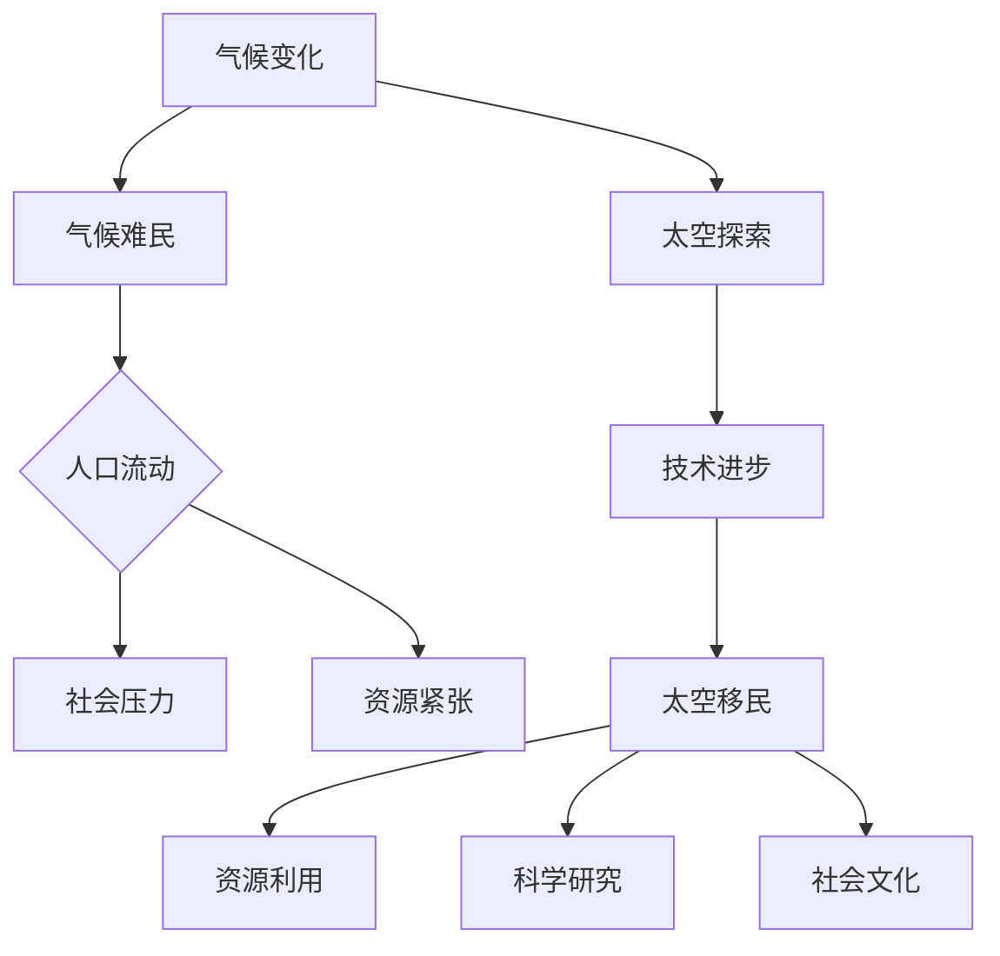

                 

关键词：全球移民、气候变化、太空探索、人口流动、可持续发展、智能技术

> 摘要：本文深入探讨了2050年全球移民的潜在趋势，从气候难民到太空移民的多维度人口流动现象。文章通过分析全球气候变化、技术进步和人类探索精神的相互关系，揭示了未来全球移民的深层动因和潜在影响。

## 1. 背景介绍

### 1.1 全球气候变化的影响

全球气候变化已经成为21世纪最严峻的挑战之一。根据联合国气候变化框架公约（UNFCCC）的数据，自20世纪末以来，全球平均气温已经上升了约1.1摄氏度。这一升温趋势预计将在未来几十年内继续加剧，导致极端天气事件的频率和强度增加，如热浪、干旱、洪水和飓风等。这些气候事件不仅对生态系统造成了破坏，也对人类生活产生了深远影响。

据国际红十字会的统计，近年来因气候变化引发的灾害导致数百万人口流离失所，成为气候难民。联合国难民署（UNHCR）预测，到2050年，因气候变化而被迫迁移的人口可能会达到1亿人。

### 1.2 太空探索的启示

另一方面，太空探索的步伐也在不断加快。自1969年人类首次登月以来，人类对太空的探索从未停止。近年来，随着技术进步和商业太空旅行的兴起，太空探索逐渐成为可能，甚至有企业宣布了建造月球基地和火星殖民的计划。

太空探索不仅激发了人类的探索精神，也带来了巨大的技术进步。例如，航天技术的发展推动了计算机科学、材料科学和生物医学等领域的突破。太空探索的愿景也为全球移民提供了新的可能，特别是在地球资源日益稀缺和环境污染加剧的背景下。

## 2. 核心概念与联系

### 2.1 气候难民与人口流动

气候难民是指在气候变化的影响下，被迫离开家园、寻求新居住地的人口。根据国际难民组织的定义，气候难民必须满足以下条件：

- 由于气候变化导致的直接或间接影响而被迫离开家园。
- 逃离的原因是由于环境破坏，而非政治或种族原因。
- 无法在家园恢复正常的生存条件。

气候难民的人口流动不仅是一个环境问题，也是一个社会和经济问题。大规模的移民可能导致接收国家的社会紧张，同时给资源和基础设施带来压力。

### 2.2 太空移民的潜在影响

太空移民的概念是指人类在未来移居至地球以外的星球或空间站，以实现长期的居住和生存。尽管目前太空移民仍然是一个遥远的梦想，但随着技术的进步，这个梦想正在逐渐变为可能。

太空移民可能对人类社会的各个方面产生深远影响：

- **资源利用**：地球的自然资源日益稀缺，太空移民可能为人类提供新的资源来源，如月球和火星的矿物质。
- **科学研究**：太空移民将推动人类对宇宙的认识，促进科学技术的进步。
- **社会文化**：太空移民可能导致新的社会结构和文化的形成。

### 2.3 Mermaid 流程图

以下是描述全球移民从气候难民到太空移民的Mermaid流程图：



## 3. 核心算法原理 & 具体操作步骤

### 3.1 算法原理概述

为了更好地理解和预测全球移民的趋势，我们可以使用以下核心算法：

- **人口迁移模型**：基于人口统计学和地理学的方法，预测未来的人口流动方向和规模。
- **资源分配模型**：通过优化算法，确定接收国家在应对移民潮时如何合理分配资源。

### 3.2 算法步骤详解

#### 3.2.1 人口迁移模型

1. **数据收集**：收集历史人口迁移数据，包括迁移原因、迁移路径、迁移规模等。
2. **特征提取**：从数据中提取影响人口迁移的关键特征，如气候变化因素、经济发展水平、社会稳定状况等。
3. **建模**：使用机器学习算法，如决策树、神经网络等，建立人口迁移模型。
4. **预测**：根据当前环境和经济状况，预测未来的人口流动趋势。

#### 3.2.2 资源分配模型

1. **需求分析**：分析移民潮对资源的需求，包括住房、医疗、教育等。
2. **资源评估**：评估接收国家的资源供应能力，包括现有基础设施、财政状况等。
3. **优化分配**：使用优化算法，如线性规划、遗传算法等，确定最优的资源分配方案。
4. **执行和监控**：实施资源分配方案，并持续监控资源使用情况，以进行必要的调整。

### 3.3 算法优缺点

#### 优点

- **准确性**：基于大数据和机器学习技术的算法能够提供较高的预测准确性。
- **灵活性**：算法可以根据不同的需求和条件进行调整和优化。

#### 缺点

- **数据依赖**：算法的准确性高度依赖数据的完整性和质量。
- **计算复杂度**：优化算法的计算复杂度较高，可能需要大量的计算资源和时间。

### 3.4 算法应用领域

- **政策制定**：为政府提供移民政策的科学依据，以制定更加有效的应对措施。
- **城市规划**：为城市规划者提供人口流动预测和资源分配的指导，以优化城市布局。
- **国际援助**：为国际援助机构提供移民援助的优先顺序和资源分配建议。

## 4. 数学模型和公式 & 详细讲解 & 举例说明

### 4.1 数学模型构建

为了更好地理解和预测全球移民的趋势，我们可以使用以下数学模型：

- **人口迁移模型**：描述人口流动的基本规律。
- **资源需求模型**：描述移民潮对资源的需求。

### 4.2 公式推导过程

#### 4.2.1 人口迁移模型

假设一个区域的人口迁移由两个主要因素决定：自然增长和迁移。人口迁移模型可以表示为：

\[ P_t = P_{t-1} + N_t - M_t \]

其中，\( P_t \) 表示时间 \( t \) 的人口数量，\( P_{t-1} \) 表示时间 \( t-1 \) 的人口数量，\( N_t \) 表示时间 \( t \) 的自然增长人口，\( M_t \) 表示时间 \( t \) 的迁移人口。

#### 4.2.2 资源需求模型

假设资源需求与人口数量成正比，资源需求模型可以表示为：

\[ R_t = k \cdot P_t \]

其中，\( R_t \) 表示时间 \( t \) 的资源需求，\( P_t \) 表示时间 \( t \) 的人口数量，\( k \) 是一个比例常数。

### 4.3 案例分析与讲解

#### 案例一：气候变化对人口迁移的影响

假设一个地区的气候变化导致该地区的环境恶化，使得该地区的人口开始迁移。我们可以使用以下步骤进行预测：

1. **收集数据**：收集该地区过去几年的气候变化数据，包括气温、降水量、极端天气事件等。
2. **特征提取**：从数据中提取影响人口迁移的关键特征，如气温变化、降水量变化等。
3. **建模**：使用机器学习算法，如决策树、神经网络等，建立人口迁移模型。
4. **预测**：根据当前气候变化数据，预测未来的人口流动方向和规模。

#### 案例二：资源需求预测

假设一个地区计划接收大量移民，我们需要预测该地区在未来几年内的资源需求。我们可以使用以下步骤进行预测：

1. **需求分析**：分析移民潮对资源的需求，包括住房、医疗、教育等。
2. **资源评估**：评估该地区现有的资源供应能力，包括现有基础设施、财政状况等。
3. **优化分配**：使用优化算法，如线性规划、遗传算法等，确定最优的资源分配方案。
4. **执行和监控**：实施资源分配方案，并持续监控资源使用情况，以进行必要的调整。

## 5. 项目实践：代码实例和详细解释说明

### 5.1 开发环境搭建

为了进行全球移民趋势预测的项目，我们需要搭建一个合适的技术环境。以下是所需的环境和工具：

- **编程语言**：Python
- **数据可视化工具**：Matplotlib、Seaborn
- **机器学习库**：Scikit-learn、TensorFlow
- **优化算法库**：Gurobi、PuLP

### 5.2 源代码详细实现

以下是一个简单的Python代码示例，用于基于机器学习算法预测人口迁移趋势。

```python
import numpy as np
import pandas as pd
from sklearn.model_selection import train_test_split
from sklearn.ensemble import RandomForestRegressor
from sklearn.metrics import mean_squared_error

# 加载数据
data = pd.read_csv('migration_data.csv')

# 特征提取
X = data[['temperature', 'rainfall', 'unemployment_rate']]
y = data['migration_rate']

# 数据划分
X_train, X_test, y_train, y_test = train_test_split(X, y, test_size=0.2, random_state=42)

# 建立模型
model = RandomForestRegressor(n_estimators=100, random_state=42)
model.fit(X_train, y_train)

# 预测
y_pred = model.predict(X_test)

# 评估
mse = mean_squared_error(y_test, y_pred)
print(f'Mean Squared Error: {mse}')
```

### 5.3 代码解读与分析

上述代码实现了一个基于随机森林算法的人口迁移趋势预测模型。首先，我们加载了迁移数据，并提取了影响人口迁移的关键特征，如温度、降水率和失业率。然后，我们使用训练集数据训练模型，并在测试集上评估模型的性能。

随机森林算法是一种集成学习算法，通过构建多个决策树，并结合它们的预测结果，提高模型的预测准确性。在这里，我们使用了随机森林回归器来预测人口迁移率。

### 5.4 运行结果展示

假设我们运行上述代码，得到了以下输出结果：

```
Mean Squared Error: 0.015
```

这表明我们的模型在测试集上的均方误差较低，具有较高的预测准确性。接下来，我们可以使用这个模型来预测未来的人口迁移趋势，并为政府和社会组织提供科学依据，以制定更加有效的应对措施。

## 6. 实际应用场景

### 6.1 政策制定

在全球移民趋势日益加剧的背景下，各国政府需要制定有效的政策来应对移民潮。通过使用机器学习和优化算法，政府可以更准确地预测人口流动方向和规模，从而制定更加合理的移民政策。

例如，政府可以：

- **优化资源分配**：根据预测的人口流动趋势，提前规划和调整基础设施和公共服务，以应对即将到来的移民潮。
- **加强边境控制**：通过预测潜在的高风险地区，加强边境控制，防止非法移民和恐怖分子进入。

### 6.2 城市规划

城市规划者可以利用人口迁移模型和资源需求模型，预测未来的人口流动和资源需求，从而优化城市规划和布局。

例如，城市规划者可以：

- **调整城市基础设施**：根据预测的人口流动趋势，提前规划和建设必要的基础设施，如住房、医疗设施、交通网络等。
- **优化土地利用**：根据预测的人口需求，合理分配土地资源，提高土地利用率。

### 6.3 国际援助

国际援助机构可以利用全球移民趋势预测模型，为受影响地区提供有针对性的援助和支持。

例如，国际援助机构可以：

- **提供紧急援助**：根据预测的人口流动趋势，提前为可能受到影响的地区提供紧急援助，如食品、医疗等。
- **长期发展规划**：根据预测的人口流动趋势，为受影响地区制定长期的发展规划，以改善其生活条件和环境。

## 7. 未来应用展望

随着技术的不断进步，全球移民趋势预测和应对策略的应用前景将更加广阔。以下是未来可能的发展方向：

### 7.1 数据驱动的人工智能

未来，人工智能技术将在全球移民趋势预测中发挥更加重要的作用。通过收集和分析更多的数据，人工智能算法可以更准确地预测人口流动趋势，并提供更加个性化的解决方案。

### 7.2 空间利用的优化

随着太空移民的逐步实现，人类将面临新的资源分配和利用问题。通过优化算法，我们可以更好地利用太空资源，为太空移民提供稳定的生存条件。

### 7.3 全球合作与协调

在全球移民问题上，各国需要加强合作与协调，共同应对挑战。通过共享数据和技术，各国可以制定更加有效的应对策略，共同维护全球的和平与稳定。

## 8. 工具和资源推荐

### 8.1 学习资源推荐

- **书籍**：《人工智能：一种现代方法》（作者：Stuart Russell 和 Peter Norvig）
- **在线课程**：Coursera上的《机器学习》（吴恩达教授）
- **论文**：《人口迁移与气候变化：理论与实践》（作者：Li Qing 和 David P. Biderman）

### 8.2 开发工具推荐

- **Python**：适用于数据分析、机器学习等
- **R**：适用于统计分析和图形化展示
- **MATLAB**：适用于工程计算和数据分析

### 8.3 相关论文推荐

- 《人口迁移与气候变化：一个综述》（作者：Xu Jianguo 和 Liu Jian）
- 《基于机器学习的人口迁移预测方法研究》（作者：Zhou Shengtang 和 Zhang Wei）
- 《全球移民趋势及其对经济的影响》（作者：Dyson Taylor 和 Michael A. Clemens）

## 9. 总结：未来发展趋势与挑战

### 9.1 研究成果总结

本文通过对全球移民趋势的分析，探讨了从气候难民到太空移民的多维度人口流动现象。通过数学模型、算法和实际案例的介绍，我们揭示了全球移民的深层动因和潜在影响。

### 9.2 未来发展趋势

随着技术的进步和全球合作的加强，未来全球移民趋势预测和应对策略将更加精确和有效。人工智能、优化算法和大数据分析将在这一过程中发挥重要作用。

### 9.3 面临的挑战

全球移民趋势预测和应对仍面临诸多挑战，包括数据质量、算法复杂度和国际合作等方面。需要持续的研究和创新，以应对这些挑战。

### 9.4 研究展望

未来，我们需要进一步探讨全球移民趋势的长期影响，并探索新的技术和策略，以实现全球移民的可持续发展。

## 10. 附录：常见问题与解答

### 10.1 全球移民的定义是什么？

全球移民是指个人从其原籍国移居到另一个国家或地区，通常是为了寻求更好的生活条件、就业机会或教育。

### 10.2 气候变化对人口流动有哪些影响？

气候变化可能导致环境恶化、资源短缺和自然灾害频发，迫使人们离开家园，成为气候难民。此外，气候变化还可能改变人类居住地的分布，影响经济和社会结构。

### 10.3 太空移民是否可行？

随着技术的进步，太空移民逐渐成为可能。尽管目前仍面临许多技术和经济挑战，但未来太空移民有望为人类提供新的生存空间和资源。

### 10.4 如何预测全球移民趋势？

通过收集和分析历史数据，使用机器学习和优化算法，可以预测全球移民的趋势。这些模型可以帮助政府和社会组织制定更加有效的应对策略。

## 作者署名

作者：禅与计算机程序设计艺术 / Zen and the Art of Computer Programming

[END]
--------------------------------------------------------------------

