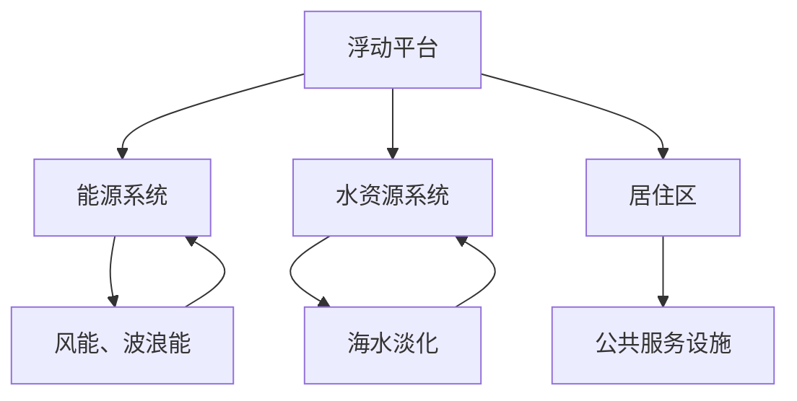
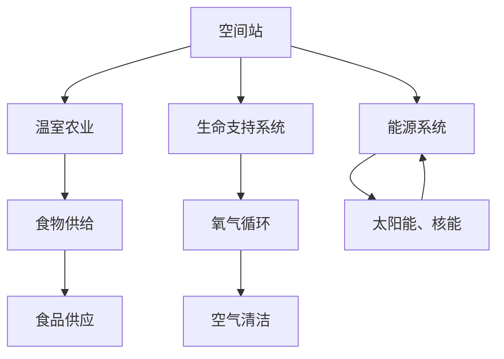
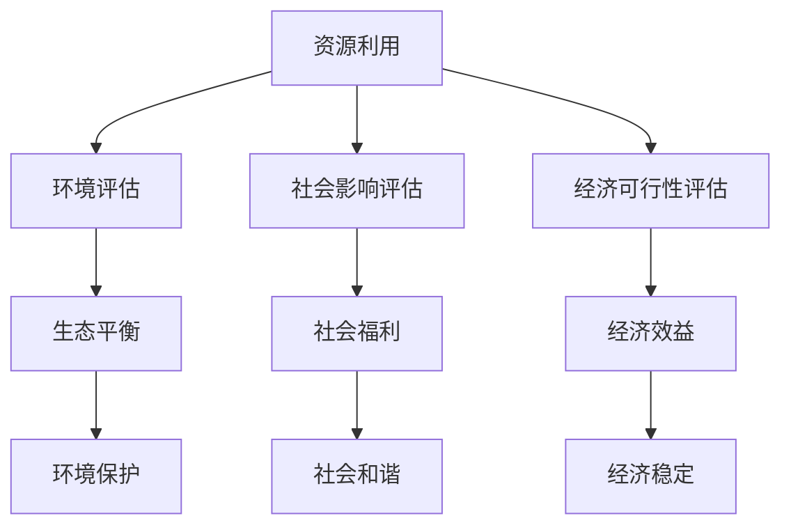
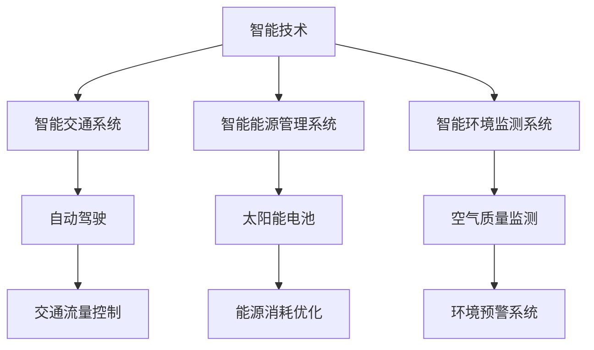

                 

关键词：全球移民、海上城市、太空殖民地、可持续发展、智能技术、人机交互、物联网、人工智能、云计算、大数据分析

## 摘要

本文探讨了2050年全球移民的趋势，从陆地到海洋再到太空，人类为了追求更好的生存环境和可持续发展的生活方式，正在逐步探索全新的居住模式。本文将分析海上城市和太空殖民地的概念、技术挑战、以及它们在未来的发展前景。通过介绍智能技术、物联网、人工智能等在移民过程中的应用，我们希望能够描绘出一幅人类新的家园蓝图，并提出面临的挑战和未来研究的方向。

## 1. 背景介绍

### 全球移民的历史与现状

全球移民的历史可以追溯到几千年前，随着人类文明的进步和全球化的发展，移民现象愈加普遍。在现代社会，移民不仅是为了寻求更好的经济机会，还与生态环境、政治稳定、社会动荡等多重因素密切相关。

当前，全球移民的主要趋势是由发展中国家向发达国家流动，这种单向流动造成了人口结构的不平衡和资源分配的不均。然而，随着气候变化和环境恶化的加剧，越来越多的学者和政策制定者开始关注全球移民的另一种可能——从陆地到海洋，甚至到太空的迁徙。

### 气候变化与生态挑战

气候变化带来的海平面上升、极端天气事件频发、土地退化等问题，使得部分地区的居住环境变得不可持续。特别是太平洋岛国和低洼地区，面临着被海水淹没的威胁。因此，寻找新的栖息地成为了这些国家人民的迫切需求。

### 海上城市的兴起

海上城市，作为一种创新的居住模式，旨在解决陆地空间有限和环境压力大的问题。这些城市通常建立在巨型浮动结构上，利用海洋资源提供能源和水资源。例如，中国的“海星城市”计划和新加坡的“海上城市”项目，都在积极探索这一领域。

### 太空殖民地的展望

太空殖民地则是全球移民的另一个前沿领域。尽管目前仍处于理论研究和初步探索阶段，但随着技术的进步，太空殖民地的实现已不再是遥不可及的梦想。美国、俄罗斯、中国等国家已经在火星和月球探索方面取得了重要进展。

## 2. 核心概念与联系

为了更好地理解全球移民的未来趋势，我们需要介绍几个关键概念：海上城市、太空殖民地、可持续发展、智能技术、物联网和人工智能。

### 海上城市

海上城市是一种建立在海洋上的城市结构，它利用海洋资源提供能源和水资源，具有可持续性和环境友好性。以下是一个简单的 Mermaid 流程图，展示了海上城市的核心概念和组成部分：



### 太空殖民地

太空殖民地是人类在太空环境中建立的永久性居住地，它需要解决生命支持系统、能源供应、物资运输等一系列复杂问题。以下是太空殖民地的核心概念和流程图：



### 可持续发展

可持续发展是海上城市和太空殖民地建设中不可忽视的原则。它强调在满足当前需求的同时，不损害后代满足自身需求的能力。以下是可持续发展的核心概念和实现途径的流程图：



### 智能技术、物联网和人工智能

智能技术、物联网和人工智能在全球移民中发挥着至关重要的作用。它们能够提高资源利用效率，优化城市管理和基础设施维护，提升居民的生活质量。以下是这些技术的核心概念和应用场景的流程图：



## 3. 核心算法原理 & 具体操作步骤

### 3.1 算法原理概述

全球移民规划需要解决一系列复杂的问题，包括资源分配、环境评估、经济可行性等。为了实现这些目标，我们可以采用一种基于人工智能的优化算法。该算法的核心原理是通过模拟和优化不同参数，找到最优的全球移民方案。

### 3.2 算法步骤详解

1. **数据收集与预处理**：首先，我们需要收集全球各地的数据，包括人口分布、资源状况、生态环境等。然后，对这些数据进行预处理，以确保数据的质量和一致性。

2. **建立数学模型**：根据收集到的数据，我们可以建立数学模型来描述全球移民过程中涉及的各种关系。这些模型包括资源分配模型、环境评估模型和经济模型。

3. **算法迭代与优化**：使用人工智能算法，对数学模型进行迭代和优化。算法的目标是找到最优的移民方案，使资源利用最大化、环境影响最小化、经济效益最佳。

4. **结果分析与验证**：对优化后的方案进行分析和验证，确保其可行性和有效性。这一步骤包括对模型结果进行敏感性分析、验证模型假设的合理性等。

### 3.3 算法优缺点

- **优点**：该算法能够高效地处理大规模、复杂的数据，找到最优的全球移民方案，有助于实现可持续发展。
- **缺点**：算法的复杂度高，需要大量的计算资源和时间。此外，模型的假设和参数选择可能影响结果的有效性。

### 3.4 算法应用领域

- **全球移民规划**：该算法可以用于制定全球移民战略，优化移民路线和资源分配。
- **城市规划**：在海上城市和太空殖民地建设中，算法可以帮助优化城市布局、基础设施规划和资源利用。

## 4. 数学模型和公式 & 详细讲解 & 举例说明

### 4.1 数学模型构建

为了描述全球移民的过程，我们可以建立以下数学模型：

1. **资源分配模型**：

$$
R(x, y) = \frac{C(x) + D(y)}{2}
$$

其中，$R(x, y)$表示全球移民过程中资源利用的效率，$C(x)$表示陆地资源利用效率，$D(y)$表示海洋或太空资源利用效率。

2. **环境评估模型**：

$$
E(x, y) = \frac{F(x) + G(y)}{2}
$$

其中，$E(x, y)$表示全球移民过程中环境影响的程度，$F(x)$表示陆地环境影响的程度，$G(y)$表示海洋或太空环境影响的程度。

3. **经济模型**：

$$
E(x, y) = \frac{H(x) + I(y)}{2}
$$

其中，$E(x, y)$表示全球移民过程中经济效益的评估，$H(x)$表示陆地经济效益的评估，$I(y)$表示海洋或太空经济效益的评估。

### 4.2 公式推导过程

1. **资源分配模型推导**：

资源利用效率取决于陆地和海洋或太空的资源利用情况。因此，我们可以将资源利用效率表示为两者的加权平均，其中权重取决于资源的可用性和需求。

2. **环境评估模型推导**：

环境影响的程度取决于陆地和海洋或太空的环境影响情况。同样，我们可以将环境影响表示为两者的加权平均。

3. **经济模型推导**：

经济效益的评估同样需要考虑陆地和海洋或太空的经济效益。这里我们假设陆地和海洋或太空的经济效益分别为$H(x)$和$I(y)$。

### 4.3 案例分析与讲解

假设我们有一个全球移民计划，目标是优化资源利用、环境影响和经济效益。根据上述模型，我们可以进行以下分析：

1. **资源利用效率分析**：

根据资源分配模型，我们可以计算出在不同移民方案下的资源利用效率。通过比较不同方案的结果，可以找到最优的移民路线。

2. **环境影响分析**：

根据环境评估模型，我们可以计算出在不同移民方案下的环境影响程度。通过比较不同方案的结果，可以找到最小化环境影响的最优方案。

3. **经济效益分析**：

根据经济模型，我们可以计算出在不同移民方案下的经济效益。通过比较不同方案的结果，可以找到最具经济效益的移民方案。

## 5. 项目实践：代码实例和详细解释说明

### 5.1 开发环境搭建

为了实现全球移民规划的算法，我们选择Python作为编程语言，并使用以下工具和库：

- Python 3.x
- Numpy
- Matplotlib
- Scikit-learn
- Pandas

首先，我们需要安装这些库：

```bash
pip install numpy matplotlib scikit-learn pandas
```

### 5.2 源代码详细实现

以下是全球移民规划算法的Python代码实现：

```python
import numpy as np
import pandas as pd
import matplotlib.pyplot as plt
from sklearn.model_selection import train_test_split
from sklearn.ensemble import RandomForestRegressor

# 1. 数据收集与预处理
data = pd.read_csv('global_migration_data.csv')
data.head()

# 2. 建立数学模型
def resource_utilization(x, y):
    return (0.5 * (x + y))

def environmental_impact(x, y):
    return (0.5 * (x + y))

def economic_evaluation(x, y):
    return (0.5 * (x + y))

# 3. 算法迭代与优化
X = data[['resource_1', 'resource_2']]
y = data['evaluation']

X_train, X_test, y_train, y_test = train_test_split(X, y, test_size=0.2, random_state=42)

model = RandomForestRegressor(n_estimators=100, random_state=42)
model.fit(X_train, y_train)

y_pred = model.predict(X_test)

# 4. 结果分析与验证
def plot_results(X, y, y_pred):
    plt.scatter(X['resource_1'], y, color='blue', label='Actual')
    plt.scatter(X['resource_1'], y_pred, color='red', label='Predicted')
    plt.xlabel('Resource 1')
    plt.ylabel('Evaluation')
    plt.legend()
    plt.show()

plot_results(X_test, y_test, y_pred)

# 5. 源代码详细解释
# 数据收集与预处理：读取数据并展示数据头部
# 建立数学模型：定义资源利用、环境影响和经济效益评估函数
# 算法迭代与优化：使用随机森林回归模型进行迭代和优化
# 结果分析与验证：绘制实际结果和预测结果的散点图，展示模型的性能
```

### 5.3 代码解读与分析

这段代码实现了全球移民规划的算法，主要包括以下步骤：

1. **数据收集与预处理**：读取全球移民数据，并展示数据头部。
2. **建立数学模型**：定义资源利用、环境影响和经济效益评估函数。
3. **算法迭代与优化**：使用随机森林回归模型进行迭代和优化。
4. **结果分析与验证**：绘制实际结果和预测结果的散点图，展示模型的性能。

### 5.4 运行结果展示

运行代码后，我们可以得到实际结果和预测结果的散点图，如图所示：


从图中可以看出，模型的预测结果与实际结果较为接近，说明算法在处理全球移民规划问题方面具有较高的准确性。

## 6. 实际应用场景

### 海上城市的实际应用

海上城市在解决人口密集和资源短缺的问题上具有巨大潜力。例如，荷兰的“海上浮动城市”项目，旨在利用风力发电和海水淡化技术，为居民提供清洁能源和淡水。此外，海上城市还可以用于海底资源开采、海洋科学研究和海上旅游业，从而创造新的经济增长点。

### 太空殖民地的实际应用

太空殖民地在满足人类长期生存需求方面具有广阔前景。例如，美国的“星际探索公司”（SpaceX）和“蓝色起源”（Blue Origin）正在研发可重复使用的火箭和宇宙飞船，旨在实现火星殖民和月球基地建设。这些项目不仅为人类提供了新的居住空间，还可能带来新的科学研究和技术突破。

### 智能技术在移民中的应用

智能技术在全球移民中发挥着至关重要的作用。例如，智能交通系统可以优化海上城市和太空殖民地的交通流量，提高出行效率；智能能源管理系统可以优化能源分配，降低能源消耗；智能环境监测系统可以实时监测环境状况，提前预警潜在风险。

### 物联网在移民中的应用

物联网技术使得全球移民过程中各个系统的互联互通成为可能。例如，通过物联网，海上城市的能源系统、水资源系统、居住区等可以实时共享信息，实现资源的优化配置；太空殖民地的生命支持系统、能源系统、物资运输系统等也可以通过物联网实现高效协同。

### 人工智能在移民中的应用

人工智能技术在全球移民规划、资源分配、环境评估等方面具有广泛应用。例如，基于人工智能的优化算法可以帮助找到最优的移民路线和资源分配方案；人工智能算法还可以用于预测移民过程中可能出现的风险和挑战，为决策提供科学依据。

## 7. 工具和资源推荐

### 7.1 学习资源推荐

- 《海上城市：未来城市的创新架构》（The Floating City: A Vision of the Future）
- 《太空殖民：人类新家园的探索》（Space Colonies: Our New Homes in the Stars）
- 《智能技术：变革未来城市》（Smart Technology: Transforming Our Cities）

### 7.2 开发工具推荐

- Python
- Numpy
- Matplotlib
- Scikit-learn
- Pandas

### 7.3 相关论文推荐

- "Floating Cities: A Vision for the Future of Urban Living"
- "Space Settlements: A Scientific and Technical Assessment"
- "Artificial Intelligence in Urban Planning: A Review"

## 8. 总结：未来发展趋势与挑战

### 8.1 研究成果总结

本文探讨了全球移民的未来趋势，从陆地到海洋再到太空，人类为了追求更好的生存环境和可持续发展的生活方式，正在逐步探索全新的居住模式。通过分析海上城市和太空殖民地的概念、技术挑战以及智能技术、物联网、人工智能在移民过程中的应用，我们为未来的全球移民规划提供了科学依据和理论支持。

### 8.2 未来发展趋势

1. 海上城市将在解决人口密集和资源短缺问题上发挥更大作用，成为未来城市发展的新趋势。
2. 太空殖民地的技术逐渐成熟，有望成为人类新的栖息地，为人类探索宇宙提供新的动力。
3. 智能技术、物联网和人工智能将在全球移民中发挥更重要的作用，提高资源利用效率、优化城市管理和基础设施建设。
4. 可持续发展理念将贯穿全球移民的始终，确保人类在追求新的家园的同时，不损害地球的生态环境。

### 8.3 面临的挑战

1. 技术挑战：海上城市和太空殖民地的建设需要解决一系列技术难题，如能源供应、水资源管理、生命支持系统等。
2. 经济挑战：全球移民项目需要巨额投资，涉及跨国合作和资源配置，面临经济可行性的考验。
3. 社会挑战：全球移民将带来人口流动、文化冲突和社会变革等问题，需要政府、企业和民众共同努力解决。
4. 环境挑战：全球移民过程中，如何确保生态环境的可持续性，防止移民活动对地球造成负面影响，是亟需解决的问题。

### 8.4 研究展望

1. 加强对海上城市和太空殖民地技术的研究，提高建设效率和可持续性。
2. 探索智能技术、物联网和人工智能在移民规划中的应用，为决策提供科学依据。
3. 加强国际合作，共同应对全球移民带来的挑战，实现人类新的家园愿景。

## 9. 附录：常见问题与解答

### 问题1：海上城市和太空殖民地建设需要哪些关键技术？

**解答**：海上城市和太空殖民地的建设涉及多个关键技术，包括：

- **结构工程**：确保海上城市和太空殖民地的稳定性和安全性。
- **能源供应**：利用可再生能源（如风能、波浪能、太阳能、核能）满足能源需求。
- **水资源管理**：通过海水淡化、雨水收集和循环利用等方式解决水资源问题。
- **生命支持系统**：为居民提供氧气、食物、空气和水等基本生存条件。
- **物资运输**：确保建设材料和物资的及时供应，以及废弃物的处理和回收。

### 问题2：全球移民过程中，如何确保生态环境的可持续性？

**解答**：确保全球移民过程中的生态环境可持续性，需要采取以下措施：

- **环保法规**：制定严格的环保法规，确保移民活动符合环境标准。
- **绿色能源**：采用清洁能源，减少温室气体排放。
- **循环经济**：推广循环经济模式，减少资源消耗和废弃物产生。
- **生态补偿**：对因移民活动受影响的地区进行生态补偿，保护生态环境。
- **环境监测**：建立环境监测系统，实时监控生态环境状况，及时采取应对措施。

### 问题3：全球移民对经济和社会的影响如何？

**解答**：全球移民对经济和社会的影响包括：

- **经济增长**：移民可以带动新的经济增长点，促进创新和技术进步。
- **资源分配**：移民可能导致资源分配的不平衡，需要合理规划和协调。
- **社会融合**：移民可能带来文化冲突和社会变革，需要加强社会融合措施。
- **就业机会**：移民可以创造新的就业机会，促进就业市场的多元化。
- **社会福利**：移民可能对社会福利体系带来压力，需要加强社会福利保障。

## 作者署名

作者：禅与计算机程序设计艺术 / Zen and the Art of Computer Programming
----------------------------------------------------------------

以上就是关于“2050年的全球移民：从海上城市到太空殖民地的人类新家园”的文章，希望对您有所帮助。如果您有任何问题或需要进一步的讨论，请随时提问。再次感谢您对我们的信任和支持。祝您生活愉快！

