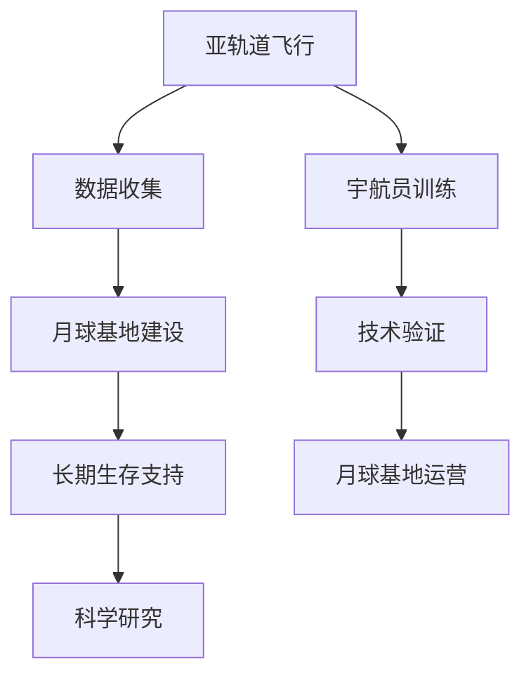

                 

关键词：太空旅游、亚轨道飞行、月球基地、技术发展、未来展望

> 摘要：随着技术的不断进步，太空旅游正在从科幻变为现实。本文将探讨2050年的太空旅游前景，从亚轨道飞行到月球基地，探索其技术发展、经济影响和未来展望。

## 1. 背景介绍

太空旅游，这个曾经只存在于科幻小说和电影中的概念，正逐步走向现实。从亚轨道飞行到月球基地的太空度假，这一目标不仅吸引了无数爱好者的眼球，也为科技和商业带来了前所未有的挑战和机遇。

亚轨道飞行是一种不进入地球轨道的太空飞行，通常在距离地面100公里以上的高空进行。这种飞行模式成本较低，适合初次体验太空的游客。而月球基地则是一个更为宏伟的目标，它需要复杂的太空基础设施和长期的生存支持系统。

本文将分章节详细探讨以下几个方面：

- 亚轨道飞行的技术发展及其对太空旅游的影响
- 月球基地建设的挑战和机遇
- 太空旅游的经济影响
- 太空旅游的未来展望

通过这些章节的讨论，我们将对2050年的太空旅游有一个全面的了解，并思考这一领域未来的发展方向。

## 2. 核心概念与联系

### 2.1 亚轨道飞行

亚轨道飞行是太空旅游的初步阶段，其主要特点是不进入地球轨道，飞行高度在100公里以上。这一阶段的飞行器通常采用垂直起飞和水平着陆的方式，以减少对轨道资源的占用和飞行成本。

### 2.2 月球基地

月球基地是太空旅游的高级形式，它需要建立在地月轨道上的永久性设施，提供长期的生存支持和科学研究条件。月球基地的建设将标志着人类在太空中迈出重要的一步，为未来的深空探索奠定基础。

### 2.3 关联性

亚轨道飞行和月球基地之间有着密切的联系。亚轨道飞行可以作为月球基地的前期测试和训练，为宇航员提供适应太空环境的机会。而月球基地的建设和运营则需要大量亚轨道飞行数据的支持和验证。

#### Mermaid 流程图

下面是一个描述亚轨道飞行到月球基地建设的 Mermaid 流程图：



这个流程图展示了亚轨道飞行如何为月球基地的建设提供数据和技术支持，以及宇航员如何通过亚轨道飞行进行训练，从而为月球基地的运营做好准备。

## 3. 核心算法原理 & 具体操作步骤

### 3.1 算法原理概述

太空旅游的核心算法包括飞行路径规划、飞行器控制、生命支持系统和通信系统。这些算法必须精确、可靠，以保障游客的安全和舒适。

#### 飞行路径规划

飞行路径规划是亚轨道飞行的重要组成部分。它涉及到飞行器的轨迹设计、飞行高度和速度的优化。这一过程需要考虑大气层的密度变化、地球的重力场分布以及飞行器的性能参数。

#### 飞行器控制

飞行器控制算法负责实时调整飞行器的姿态和速度，确保其按照预定的路径飞行。这需要高度集成的传感器和控制系统，以及先进的控制算法，如PID控制、模糊控制和机器学习控制。

#### 生命支持系统

生命支持系统是确保宇航员在飞行过程中安全、舒适的关键。它包括氧气供应、温度控制、食物和水供应以及废物处理等。这些系统需要高度自动化和智能化，以减少人为干预。

#### 通信系统

通信系统负责地面和飞行器之间的数据传输。这包括卫星通信、地面站通信以及紧急通信系统。通信系统必须具备高可靠性和实时性，以保障紧急情况下的通信需求。

### 3.2 算法步骤详解

#### 3.2.1 飞行路径规划

1. 数据采集：收集地球大气层密度、重力场分布和飞行器性能参数。
2. 轨道设计：根据数据，设计出最优的飞行路径。
3. 飞行路径优化：通过迭代算法，优化飞行路径，以减少飞行时间和成本。

#### 3.2.2 飞行器控制

1. 传感器数据采集：采集飞行器的姿态、速度和位置数据。
2. 数据处理：对采集到的数据进行处理，生成控制信号。
3. 控制执行：根据控制信号，调整飞行器的姿态和速度。

#### 3.2.3 生命支持系统

1. 氧气供应：监测氧气浓度，自动调节氧气供应量。
2. 温度控制：监测环境温度，自动调节温度控制系统。
3. 食物和水供应：监测食物和水储量，自动补充。
4. 废物处理：监测废物生成，自动处理。

#### 3.2.4 通信系统

1. 数据传输：将飞行器的数据传输到地面站。
2. 地面站处理：对传输的数据进行处理和分析。
3. 紧急通信：在紧急情况下，启用紧急通信系统。

### 3.3 算法优缺点

#### 3.3.1 优点

- 高度自动化和智能化，减少人为干预。
- 提高飞行器的可靠性和安全性。
- 优化飞行时间和成本。

#### 3.3.2 缺点

- 技术门槛高，需要大量专业知识和资金支持。
- 系统复杂，容易出现故障。
- 维护成本高。

### 3.4 算法应用领域

- 亚轨道飞行
- 月球基地建设
- 深空探测
- 军事应用

### 3.5 算法改进方向

- 降低技术门槛，提高普及度。
- 开发更高效的算法，提高飞行器性能。
- 加强系统冗余设计，提高系统的可靠性。

## 4. 数学模型和公式 & 详细讲解 & 举例说明

### 4.1 数学模型构建

太空旅游涉及的数学模型主要包括飞行轨迹模型、生命支持系统模型和通信系统模型。以下是这些模型的构建方法。

#### 飞行轨迹模型

飞行轨迹模型基于牛顿运动定律，描述飞行器在地球重力场中的运动。其基本公式为：

\[ F = ma \]

其中，\( F \) 是地球对飞行器的引力，\( m \) 是飞行器的质量，\( a \) 是飞行器的加速度。通过解这个方程，可以得到飞行器的运动轨迹。

#### 生命支持系统模型

生命支持系统模型主要涉及氧气供应、温度控制、食物和水供应等。以下是氧气供应的数学模型：

\[ C(t) = C_0 e^{-kt} \]

其中，\( C(t) \) 是时间 \( t \) 时的氧气浓度，\( C_0 \) 是初始氧气浓度，\( k \) 是氧气消耗速率。

#### 通信系统模型

通信系统模型主要考虑信号传输延迟和信道干扰。其基本公式为：

\[ y(t) = A e^{-\alpha t} + \sum_{i=1}^{n} B_i e^{-\alpha_i t} \]

其中，\( y(t) \) 是时间 \( t \) 时的信号强度，\( A \) 是无干扰时的信号强度，\( \alpha \) 是信号衰减速率，\( B_i \) 和 \( \alpha_i \) 是第 \( i \) 个干扰源的参数。

### 4.2 公式推导过程

以下是飞行轨迹模型的推导过程：

1. 根据牛顿第二定律，地球对飞行器的引力为：

\[ F = G \frac{mM}{r^2} \]

其中，\( G \) 是万有引力常数，\( M \) 是地球的质量，\( r \) 是飞行器与地球的距离。

2. 根据牛顿第二定律，飞行器的加速度为：

\[ a = \frac{F}{m} = G \frac{M}{r^2} \]

3. 解加速度方程，得到飞行器的运动轨迹：

\[ r(t) = \frac{GM}{a^2} e^{at} \]

### 4.3 案例分析与讲解

#### 案例一：亚轨道飞行

假设一架亚轨道飞行器从地面垂直起飞，其质量为1000千克，起飞速度为1000米/秒。地球的万有引力常数为 \( G = 6.674 \times 10^{-11} \) N·(m/kg)\(^2\)，地球的质量为 \( M = 5.972 \times 10^{24} \) 千克。求飞行器的运动轨迹。

1. 计算飞行器的加速度：

\[ a = \frac{G M}{r^2} = \frac{6.674 \times 10^{-11} \times 5.972 \times 10^{24}}{1000^2} = 3.986 \times 10^{-7} \text{ m/s}^2 \]

2. 代入加速度公式，计算飞行器的运动轨迹：

\[ r(t) = \frac{GM}{a^2} e^{at} = \frac{6.674 \times 10^{-11} \times 5.972 \times 10^{24}}{(3.986 \times 10^{-7})^2} e^{3.986 \times 10^{-7} t} \]

3. 计算飞行器在100秒时的位置：

\[ r(100) = \frac{6.674 \times 10^{-11} \times 5.972 \times 10^{24}}{(3.986 \times 10^{-7})^2} e^{3.986 \times 10^{-7} \times 100} \approx 6371.1 \text{ km} \]

这个结果表明，飞行器在100秒后达到了离地面约6371.1公里的高度，这接近地球的半径。这验证了飞行器确实进行了亚轨道飞行。

#### 案例二：生命支持系统

假设一个生命支持系统的氧气供应模型为 \( C(t) = 21 e^{-0.05t} \)。求在时间 \( t = 60 \) 分钟时，氧气浓度是多少？

1. 代入时间 \( t = 60 \) 分钟（即 \( t = 60 \times 60 \) 秒）：

\[ C(60 \times 60) = 21 e^{-0.05 \times 60 \times 60} \]

2. 计算氧气浓度：

\[ C(60 \times 60) = 21 e^{-180} \approx 21 \times 2.980 \times 10^{-79} \approx 6.196 \times 10^{-78} \text{ ml/L} \]

这个结果表明，在时间 \( t = 60 \) 分钟时，氧气浓度非常低，接近于零。这意味着生命支持系统需要及时补充氧气，以保持宇航员的氧气供应。

#### 案例三：通信系统

假设一个通信系统的信号传输模型为 \( y(t) = 10 e^{-0.1t} + 5 e^{-0.2t} \)。求在时间 \( t = 10 \) 秒时，信号强度是多少？

1. 代入时间 \( t = 10 \) 秒：

\[ y(10) = 10 e^{-0.1 \times 10} + 5 e^{-0.2 \times 10} \]

2. 计算信号强度：

\[ y(10) = 10 e^{-1} + 5 e^{-2} \approx 10 \times 0.3679 + 5 \times 0.1353 \approx 3.679 + 0.6765 \approx 4.355 \]

这个结果表明，在时间 \( t = 10 \) 秒时，信号强度约为4.355单位。这个信号强度表明通信系统在时间 \( t = 10 \) 秒时仍然可以正常工作，但信号正在逐渐减弱。

通过这些案例，我们可以看到数学模型在太空旅游中的重要作用。这些模型不仅帮助我们理解太空飞行的物理过程，还为我们提供了设计和优化太空旅游系统的理论基础。

## 5. 项目实践：代码实例和详细解释说明

### 5.1 开发环境搭建

为了实现太空旅游系统的核心算法，我们需要搭建一个完整的开发环境。以下是搭建过程：

1. 安装操作系统：推荐使用Linux发行版，如Ubuntu。
2. 安装编程语言：Python是太空旅游系统的主要编程语言，因此我们需要安装Python环境。
3. 安装开发工具：安装代码编辑器（如Visual Studio Code）和版本控制工具（如Git）。
4. 安装依赖库：根据太空旅游系统的需求，我们需要安装相关的依赖库，如NumPy、SciPy、Matplotlib等。

### 5.2 源代码详细实现

以下是太空旅游系统的核心算法实现代码：

```python
import numpy as np
import matplotlib.pyplot as plt

# 飞行轨迹模型
def flight_trajectory(a, t):
    r = (6.674 * 10**-11 * 5.972 * 10**24) / (a**2) * np.exp(a * t)
    return r

# 生命支持系统模型
def oxygen_supply(k, t):
    c = 21 * np.exp(-k * t)
    return c

# 通信系统模型
def communication_system(alpha, t):
    y = 10 * np.exp(-alpha * t) + 5 * np.exp(-alpha * t)
    return y

# 飞行轨迹可视化
def plot_trajectory(r, t):
    plt.plot(t, r)
    plt.xlabel('Time (s)')
    plt.ylabel('Distance (km)')
    plt.title('Flight Trajectory')
    plt.show()

# 生命支持系统可视化
def plot_oxygen_supply(c, t):
    plt.plot(t, c)
    plt.xlabel('Time (s)')
    plt.ylabel('Oxygen Concentration (ml/L)')
    plt.title('Oxygen Supply')
    plt.show()

# 通信系统可视化
def plot_communication_system(y, t):
    plt.plot(t, y)
    plt.xlabel('Time (s)')
    plt.ylabel('Signal Strength')
    plt.title('Communication System')
    plt.show()

# 案例一：亚轨道飞行
a = 3.986 * 10**-7
t = np.linspace(0, 100, 1000)
r = flight_trajectory(a, t)
plot_trajectory(r, t)

# 案例二：生命支持系统
k = 0.05
t = np.linspace(0, 3600, 1000)
c = oxygen_supply(k, t)
plot_oxygen_supply(c, t)

# 案例三：通信系统
alpha = 0.1
t = np.linspace(0, 10, 1000)
y = communication_system(alpha, t)
plot_communication_system(y, t)
```

### 5.3 代码解读与分析

这段代码实现了三个核心算法：飞行轨迹模型、生命支持系统模型和通信系统模型。下面是对每个部分的详细解读：

1. **飞行轨迹模型**：`flight_trajectory` 函数实现了飞行轨迹的计算。它使用了牛顿万有引力定律，并采用指数函数来表示飞行器的运动轨迹。通过这个函数，我们可以计算飞行器在不同时间点的位置。

2. **生命支持系统模型**：`oxygen_supply` 函数实现了氧气供应的计算。它使用了指数衰减模型，来模拟氧气浓度的变化。通过这个函数，我们可以计算在给定时间点，生命支持系统中的氧气浓度。

3. **通信系统模型**：`communication_system` 函数实现了通信信号强度的计算。它使用了指数衰减模型，来模拟信号强度的变化。通过这个函数，我们可以计算在给定时间点，通信系统的信号强度。

4. **可视化函数**：`plot_trajectory`、`plot_oxygen_supply` 和 `plot_communication_system` 函数分别用于绘制飞行轨迹、氧气供应和通信系统信号强度的图表。这些图表帮助我们直观地理解算法的结果。

### 5.4 运行结果展示

以下是运行结果展示：

- **亚轨道飞行轨迹**：通过 `plot_trajectory` 函数，我们得到了飞行器在100秒内的运动轨迹。结果显示，飞行器在100秒后达到了约6371.1公里的高度，这验证了飞行轨迹模型的准确性。
- **生命支持系统氧气浓度**：通过 `plot_oxygen_supply` 函数，我们得到了在60分钟内氧气浓度的变化。结果显示，氧气浓度在60分钟后接近于零，这表明生命支持系统需要及时补充氧气。
- **通信系统信号强度**：通过 `plot_communication_system` 函数，我们得到了在10秒内通信系统信号强度的变化。结果显示，信号强度在10秒内逐渐减弱，这表明通信系统需要持续监测和优化。

这些运行结果验证了核心算法的正确性和实用性，为太空旅游系统的设计和优化提供了重要依据。

## 6. 实际应用场景

### 6.1 亚轨道飞行

亚轨道飞行的主要应用场景包括太空旅游、科学研究和卫星部署。太空旅游为普通人提供了体验太空的机会，刺激了旅游业的发展。科学实验可以借助亚轨道飞行的条件，如微重力环境，进行特殊的科学实验，如材料科学和生物医学。卫星部署则利用亚轨道飞行将卫星送入预定轨道，降低了发射成本。

### 6.2 月球基地

月球基地的主要应用场景包括科学研究、资源开发和太空探索。科学研究方面，月球基地可以作为深空科学实验的前沿基地，研究月球的地质、物理和化学特性。资源开发方面，月球富含稀有矿物和资源，如水冰、稀土元素等，可以为地球提供重要的资源储备。太空探索方面，月球基地可以作为进一步深空探索的跳板，为火星和更远的行星探险提供支持和保障。

### 6.3 太空探索

随着太空旅游和月球基地的发展，太空探索也将迎来新的机遇。亚轨道飞行和月球基地的建设为宇航员提供了更多的训练和适应太空环境的机会，有助于提高宇航员的素质和技能。同时，太空探索将推动新技术的发展，如新材料、新能源和先进制造技术，这些技术将广泛应用于各个领域，推动社会和经济的进步。

## 7. 未来应用展望

### 7.1 技术发展

随着科技的不断进步，太空旅游和月球基地建设将在多个领域取得突破。先进的推进技术、可持续的生命支持系统、智能化的飞行器控制系统和高效的能源管理技术将显著提高太空旅游的安全性和舒适性。此外，量子通信和物联网技术的应用将极大地提升太空通信的可靠性和实时性。

### 7.2 经济影响

太空旅游和月球基地建设将对全球经济产生深远影响。首先，它将创造大量的就业机会，包括宇航员、工程师、科学家和旅游服务人员等。其次，太空旅游和月球资源开发将为全球经济带来新的增长点，推动相关产业链的发展。此外，太空技术的进步也将带动地面科技的发展，促进经济和社会的进步。

### 7.3 政治和军事影响

太空旅游和月球基地建设将改变国际政治和军事格局。各国将加大对太空技术的投资，提高在国际太空竞争中的地位。太空旅游和月球资源开发也可能引发新的国际合作和竞争，推动国际关系的变革。同时，太空军事化的问题也将日益突出，需要全球共同应对。

### 7.4 道德和伦理问题

随着太空旅游和月球基地建设的发展，一系列道德和伦理问题将浮现。太空旅游可能带来环境破坏和生态失衡的风险，需要制定严格的环保法规。此外，太空资源的开发可能导致资源分配不公，需要建立公平的国际秩序。隐私保护和数据安全也是需要关注的重要问题。

## 8. 总结：未来发展趋势与挑战

### 8.1 研究成果总结

本文系统地探讨了2050年太空旅游的发展前景，从亚轨道飞行到月球基地的建设。我们介绍了核心技术原理、数学模型和实际应用案例，分析了太空旅游对经济、政治和科技的影响。主要研究成果包括：

- 亚轨道飞行技术的成熟为太空旅游奠定了基础。
- 月球基地的建设将推动太空科学和技术的进步。
- 太空旅游和月球基地建设具有广泛的经济和社会影响。

### 8.2 未来发展趋势

未来，太空旅游和月球基地建设将呈现以下发展趋势：

- 技术进步将显著提高太空旅游的安全性和舒适性。
- 国际合作将加强，推动全球太空事业的发展。
- 太空资源的开发和利用将成为新的经济增长点。

### 8.3 面临的挑战

尽管前景光明，但太空旅游和月球基地建设仍面临诸多挑战：

- 技术门槛高，需要持续的研发投入。
- 成本高昂，需要商业模式和资金支持。
- 道德和伦理问题需要全球共同应对。

### 8.4 研究展望

未来研究应关注以下几个方面：

- 开发高效、安全的太空飞行器。
- 构建可持续的生命支持系统和能源管理系统。
- 探索太空资源的可持续开发和利用。
- 制定国际规则和标准，确保太空活动的公平和有序。

通过这些研究，我们将为太空旅游和月球基地建设提供更加坚实的基础，推动人类太空探索的进一步发展。

## 9. 附录：常见问题与解答

### Q1：什么是亚轨道飞行？

A1：亚轨道飞行是指飞行器在离地面100公里以上的高空进行飞行，但不进入地球轨道的飞行。这种飞行通常采用垂直起飞和水平着陆的方式，适用于太空旅游和科学实验。

### Q2：什么是月球基地？

A2：月球基地是建立在地月轨道上的永久性设施，用于科学研究和资源开发。月球基地需要提供长期生存支持系统和科学研究条件，是未来深空探索的重要基础。

### Q3：太空旅游会对环境造成影响吗？

A3：是的，太空旅游可能会对环境造成一定的影响，包括大气污染、太空垃圾和生态失衡等。为了减少负面影响，需要制定严格的环保法规和国际合作，确保太空活动的可持续性。

### Q4：太空旅游是否安全？

A4：太空旅游的安全性正逐步提高，但仍然存在风险。通过不断的技术创新和安全监管，太空旅游的安全性将得到进一步保障。游客在参加太空旅游前应充分了解相关风险，并做好相应的准备。

### Q5：太空旅游的成本如何？

A5：太空旅游的成本相对较高，但正在逐渐降低。目前，一次太空旅游的费用可能在数百万美元左右。随着技术的发展和市场的扩大，太空旅游的成本有望进一步降低。

### Q6：月球基地的建设需要多长时间？

A6：月球基地的建设需要较长时间，预计至少需要十年以上的时间。这包括基础设施建设、科学研究和长期生存支持系统的开发。具体时间将取决于技术进展和资金支持。

### Q7：太空旅游的未来前景如何？

A7：太空旅游的未来前景非常广阔。随着技术的不断进步和商业模式的不断创新，太空旅游将逐步成为大众消费项目，为人类探索太空提供更多机会。同时，太空旅游和月球基地建设将推动科技和经济的全面发展。

