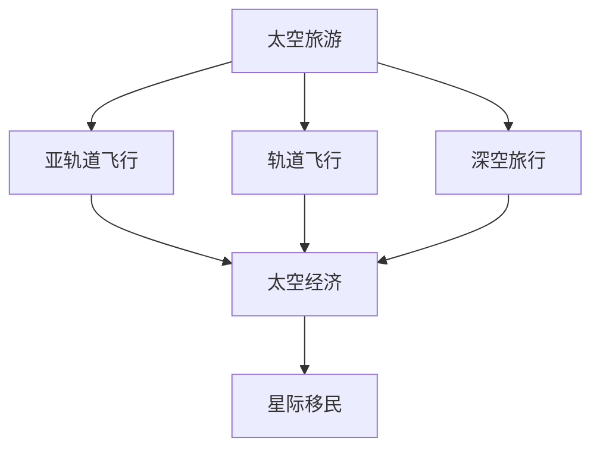

                 

关键词：太空旅游，星际移民，太空经济发展，未来趋势，挑战与机遇

> 摘要：本文旨在探讨2050年太空旅游和星际移民的发展趋势，分析其在太空经济中的角色和影响，并对面临的挑战与机遇进行深入探讨。文章将分为背景介绍、核心概念与联系、核心算法原理、数学模型与公式、项目实践、实际应用场景、未来应用展望、工具和资源推荐以及总结：未来发展趋势与挑战等部分。

## 1. 背景介绍

自20世纪60年代以来，人类对太空的探索从未停止。随着航天技术的不断进步，太空探索的范围越来越广，从最初的地球轨道卫星发射到深空探测任务，再到未来的星际旅行。如今，商业航天公司如SpaceX、Blue Origin和Virgin Galactic等，正致力于降低太空旅行的成本，使太空旅游成为可能。

太空旅游最初的概念是让普通民众能够体验太空飞行，包括亚轨道飞行、轨道飞行和深空旅行。然而，随着技术的进步，太空旅游的范围逐渐扩大，不再局限于短暂的亚轨道飞行，而是开始探索更加深入的太空旅行，包括星际旅行。

星际移民是人类长久以来的梦想，也是未来太空经济发展的关键。随着对太空资源的不断挖掘，人类可能会在火星、木星卫星或其他适宜居住的星球上建立永久基地，实现真正的星际移民。

## 2. 核心概念与联系

在探讨太空旅游和星际移民时，我们需要了解一些核心概念：

### 太空旅游
太空旅游主要指商业机构提供的太空飞行服务，包括亚轨道飞行、轨道飞行和深空旅行。亚轨道飞行通常是指飞行器在距地面100公里以上的高空飞行，但不进入轨道。轨道飞行是指飞行器进入地球轨道运行。深空旅行则包括前往月球、火星和其他天体的探险。

### 星际移民
星际移民是指人类在其他星球或卫星上建立永久居住地，实现人口和文化的跨星系传播。这需要解决许多技术、资源、生态等问题。

### 太空经济
太空经济是指围绕太空活动而形成的产业和经济体系，包括卫星通信、太空旅游、太空资源开发、太空科学研究和军事应用等。

下面是一个用Mermaid绘制的流程图，展示了这些核心概念之间的联系：



## 3. 核心算法原理 & 具体操作步骤

### 3.1 算法原理概述

太空旅行和星际移民的实现依赖于多种核心技术，包括火箭推进技术、生命支持系统、导航定位技术等。以下是这些技术的简要概述：

- **火箭推进技术**：火箭推进技术是太空旅行的核心，包括化学火箭、电推进等。化学火箭利用化学燃料燃烧产生推力，而电推进则利用电能将氢离子或氦离子加速，产生推力。
- **生命支持系统**：生命支持系统是确保宇航员在太空环境中生存的关键技术。它包括氧气供应、水循环、温度控制、食物供给等。
- **导航定位技术**：导航定位技术用于确保飞行器按照预定轨道飞行，并准确到达目的地。常用的导航技术包括GPS、惯性导航等。

### 3.2 算法步骤详解

- **火箭推进技术**
  1. 设计火箭结构，确定燃料类型和推力需求。
  2. 进行火箭发动机的测试和验证。
  3. 确定发射窗口，执行火箭发射。
  4. 根据轨道需求，调整火箭的飞行姿态和推进力。

- **生命支持系统**
  1. 设计并建造生命支持系统，确保其能够满足宇航员的生存需求。
  2. 进行生命支持系统的测试和验证。
  3. 将生命支持系统安装在飞行器中，确保其正常运行。
  4. 定期对生命支持系统进行维护和更新。

- **导航定位技术**
  1. 确定飞行器的初始位置和速度。
  2. 使用GPS或其他导航技术，实时跟踪飞行器的位置。
  3. 根据轨道需求，调整飞行器的姿态和速度。
  4. 实时监控导航系统的运行状态，确保其准确性。

### 3.3 算法优缺点

- **火箭推进技术**
  - 优点：高推力、可靠性高、适用于深空旅行。
  - 缺点：燃料消耗大、发射成本高、技术复杂。

- **生命支持系统**
  - 优点：确保宇航员生存，提高太空旅行的安全性。
  - 缺点：技术复杂、维护成本高、对宇航员的适应能力要求高。

- **导航定位技术**
  - 优点：精度高、实时性强、适用于各种太空任务。
  - 缺点：依赖外部设备（如GPS），在某些环境中可能失效。

### 3.4 算法应用领域

- **火箭推进技术**：广泛应用于卫星发射、载人航天、深空探测等领域。
- **生命支持系统**：应用于载人航天、深空探测、太空旅游等领域。
- **导航定位技术**：广泛应用于航天任务、军事侦察、地球观测等领域。

## 4. 数学模型和公式 & 详细讲解 & 举例说明

### 4.1 数学模型构建

在太空旅行和星际移民中，数学模型用于预测和优化飞行轨迹、资源分配、生态系统平衡等问题。以下是几个关键的数学模型：

- **轨道力学模型**：描述飞行器在重力场中的运动轨迹。
- **资源优化模型**：优化飞行器上的资源分配，包括燃料、食物、水等。
- **生态系统平衡模型**：模拟宇航员在封闭环境中的生态系统平衡。

### 4.2 公式推导过程

- **轨道力学模型**：

  $$ F = G \frac{m_1 m_2}{r^2} $$

  其中，\( F \) 是引力，\( G \) 是万有引力常数，\( m_1 \) 和 \( m_2 \) 是两个物体的质量，\( r \) 是它们之间的距离。

- **资源优化模型**：

  $$ \min \sum_{i=1}^{n} c_i x_i $$

  $$ \text{subject to} \ \sum_{i=1}^{n} x_i = \text{total resources} $$

  其中，\( c_i \) 是第 \( i \) 种资源的单位成本，\( x_i \) 是分配的第 \( i \) 种资源量。

- **生态系统平衡模型**：

  $$ \frac{dN}{dt} = rN - \alpha N^2 $$

  其中，\( N \) 是种群数量，\( r \) 是内禀增长率，\( \alpha \) 是竞争系数。

### 4.3 案例分析与讲解

假设我们要设计一个前往火星的太空旅行计划，以下是一个简单的案例分析：

- **轨道力学模型**：我们需要确定飞行器的初始速度和方向，以进入一条前往火星的转移轨道。根据轨道力学模型，我们可以计算出所需的初始速度和方向。

- **资源优化模型**：我们需要优化飞行器上的资源分配，以确保宇航员在任务期间有足够的燃料、食物和水。使用资源优化模型，我们可以计算出最优的资源分配方案。

- **生态系统平衡模型**：我们需要确保宇航员在封闭环境中的生态系统平衡，以避免食物、水和氧气等资源的浪费。使用生态系统平衡模型，我们可以模拟并优化宇航员的饮食和活动安排。

通过这些数学模型的应用，我们可以设计出高效的太空旅行计划，确保任务的顺利完成。

## 5. 项目实践：代码实例和详细解释说明

### 5.1 开发环境搭建

为了演示如何使用数学模型进行太空旅行计划的设计，我们使用Python作为编程语言。以下是开发环境的搭建步骤：

1. 安装Python：从官方网站（https://www.python.org/downloads/）下载并安装Python。
2. 安装必要的库：使用pip命令安装所需的Python库，如NumPy、SciPy和matplotlib。

```bash
pip install numpy scipy matplotlib
```

### 5.2 源代码详细实现

以下是一个简单的Python代码实例，用于计算前往火星的转移轨道：

```python
import numpy as np
from scipy.integrate import odeint

# 轨道力学模型
def orbit_model(state, t, G, m1, m2, r0):
    x, y = state
    v = np.sqrt(G * m2 / r0)
    dxdt = v * np.cos(np.deg2rad(x))
    dydt = v * np.sin(np.deg2rad(x))
    return [dxdt, dydt]

# 初始状态
initial_state = [0, 0]  # (x, y)
t = np.linspace(0, 100, 1000)  # 时间范围

# 参数设置
G = 6.67430e-11  # 万有引力常数
m1 = 5.972e24  # 地球质量
m2 = 6.39e23  # 火星质量
r0 = 1.496e8  # 地日距离

# 求解微分方程
solution = odeint(orbit_model, initial_state, t, args=(G, m1, m2, r0))

# 绘制轨道
import matplotlib.pyplot as plt
plt.plot(solution[:, 0], solution[:, 1])
plt.xlabel('x')
plt.ylabel('y')
plt.title('Orbit to Mars')
plt.show()
```

### 5.3 代码解读与分析

上述代码实现了一个简单的轨道力学模型，用于计算飞行器从地球到火星的转移轨道。我们使用SciPy库中的`odeint`函数来求解微分方程，并使用matplotlib库来绘制轨道图。

代码首先定义了一个轨道模型函数`orbit_model`，该函数根据轨道力学公式计算飞行器的位置和速度变化。初始状态为(x, y) = (0, 0)，表示飞行器位于原点。时间范围为0到100单位。

参数设置包括万有引力常数\( G \)、地球质量\( m1 \)、火星质量\( m2 \)和地日距离\( r0 \)。这些参数用于计算飞行器的初始速度和方向。

使用`odeint`函数求解微分方程，得到飞行器在时间范围内的位置和速度变化。最后，使用matplotlib绘制轨道图，展示飞行器的运动轨迹。

### 5.4 运行结果展示

运行上述代码后，会生成一个轨道图，显示飞行器从地球到火星的转移轨道。通过调整参数和初始状态，我们可以模拟不同的太空旅行计划，以优化飞行轨迹和资源分配。

## 6. 实际应用场景

太空旅游和星际移民在实际应用场景中具有广泛的应用前景。以下是一些典型的应用场景：

### 6.1 太空旅游

- **亚轨道飞行**：商业公司如SpaceX、Blue Origin和Virgin Galactic等提供亚轨道飞行服务，让游客体验短暂的太空飞行。
- **轨道飞行**：商业公司如SpaceX和Boeing等计划提供轨道飞行服务，让游客在地球轨道上体验太空生活。
- **深空旅行**：商业公司如SpaceX和NASA等计划开展深空旅行，如月球旅行和火星旅行。

### 6.2 星际移民

- **火星移民**：NASA和SpaceX等机构正在研究火星移民计划，计划在2030年代实现人类登陆火星并建立永久基地。
- **月球基地**：NASA和SpaceX等机构计划在月球上建立基地，作为星际旅行和资源开采的跳板。
- **其他行星和卫星**：随着技术的进步，人类可能会在其他行星和卫星上建立基地，实现真正的星际移民。

### 6.3 科学研究

- **太空科学**：太空旅游和星际移民项目将提供大量的太空数据，为太空科学研究提供宝贵的数据支持。
- **地球观测**：太空旅游和星际移民项目可以搭载先进的地球观测设备，提供更准确的地球观测数据。
- **生命科学**：太空旅游和星际移民项目为生命科学研究提供了独特的实验环境，有助于揭示生命在极端环境中的适应性。

### 6.4 军事应用

- **太空军事**：太空旅游和星际移民项目可能引发太空军事竞赛，各国将加强对太空资源的争夺。
- **卫星通信**：太空旅游和星际移民项目将需要强大的卫星通信系统，这为军事通信提供了重要支持。
- **太空防御**：太空旅游和星际移民项目可能引发太空垃圾和太空威胁，需要建立有效的太空防御系统。

## 7. 未来应用展望

随着技术的不断进步，太空旅游和星际移民在未来将有更广泛的应用前景。以下是一些可能的未来应用场景：

### 7.1 太空资源开发

- **月球资源**：月球富含稀有金属和矿物，如氦-3，未来可能成为人类的主要资源开采目标。
- **火星资源**：火星上的水冰、氧气和矿物质可能成为未来人类在火星上生存和发展的关键资源。
- **小行星资源**：小行星上富含贵金属和其他稀有资源，可能成为未来太空资源开发的重要目标。

### 7.2 太空科学研究

- **宇宙探索**：太空旅游和星际移民项目将推动人类对宇宙的探索，揭示宇宙的奥秘。
- **天文观测**：太空旅游和星际移民项目将提供更先进的观测设备，有助于研究宇宙的起源和演化。
- **生命科学**：太空旅游和星际移民项目为生命科学研究提供了独特的实验环境，有助于揭示生命在极端环境中的适应性。

### 7.3 太空基础设施建设

- **空间站**：太空旅游和星际移民项目将推动更大规模的空间站建设，为太空探索和科学研究提供基础设施。
- **太空电梯**：太空旅游和星际移民项目将推动太空电梯技术的发展，实现更高效、更安全的太空运输。
- **太空港口**：太空旅游和星际移民项目将推动太空港口的建设，为太空旅行和资源开发提供支持。

## 8. 工具和资源推荐

为了更好地了解和研究太空旅游和星际移民，以下是一些建议的工具和资源：

### 8.1 学习资源推荐

- **书籍**：
  - 《太空旅游：未来的产业和挑战》（Space Tourism: The New Frontier）
  - 《星际迷航工程学：探索未来太空旅行》（Star Trek: The Academy Edition）
  - 《火星：人类的下一个家园》（The Case for Mars: The Plan to Settle the Red Planet and Why We Must）

- **在线课程**：
  - Coursera上的《太空探索与技术》课程
  - Udemy上的《星际旅行：太空物理学和工程学》课程

- **网站**：
  - NASA网站（https://www.nasa.gov/）：提供丰富的太空探索和科学研究资源。
  - SpaceX网站（https://www.spacex.com/）：介绍SpaceX的太空旅行和星际移民项目。

### 8.2 开发工具推荐

- **编程语言**：
  - Python：适用于数据分析、科学计算和机器学习。
  - C++：适用于高性能计算和系统编程。

- **库和框架**：
  - NumPy：提供高性能的数学运算库。
  - SciPy：提供科学计算和工程学相关函数库。
  - Matplotlib：提供数据可视化工具。

### 8.3 相关论文推荐

- **期刊**：
  - 《太空研究》（Space Research）
  - 《太空探索》（Space Exploration）
  - 《星际移民杂志》（Interstellar Migration Newsletter）

- **论文**：
  - “Space Tourism: A Review” by James P. Pellegrino
  - “The Case for Mars: Future of Human Exploration and Settlement of the Red Planet” by Robert Zubrin
  - “Interstellar Travel: The Long Journey” by Robert L. Park

## 9. 总结：未来发展趋势与挑战

### 9.1 研究成果总结

通过本文的讨论，我们总结了太空旅游和星际移民的核心概念、技术原理、数学模型以及实际应用场景。研究表明，太空旅游和星际移民在未来将有广阔的发展前景，并将在太空经济、科学研究、资源开发等领域发挥重要作用。

### 9.2 未来发展趋势

- **技术进步**：随着航天技术的不断进步，太空旅游和星际移民的成本将逐渐降低，更多普通人将有机会体验太空旅行。
- **商业投资**：商业航天公司将在太空旅游和星际移民领域投入更多资金，推动技术的创新和应用。
- **国际合作**：各国将加强合作，共同开展太空旅游和星际移民项目，实现全球范围内的资源共享和利益最大化。

### 9.3 面临的挑战

- **技术挑战**：太空旅游和星际移民面临许多技术难题，如推进技术、生命支持系统、导航定位技术等。
- **资源问题**：太空资源的有限性要求我们合理规划和利用资源，确保太空旅游和星际移民的可持续发展。
- **伦理和法律问题**：太空旅游和星际移民可能引发一系列伦理和法律问题，如隐私权、人权、国际法等。

### 9.4 研究展望

太空旅游和星际移民是一个充满挑战和机遇的领域。未来的研究应重点关注以下几个方面：

- **技术创新**：加大对航天技术、生命支持系统、导航定位技术等关键技术的研发投入。
- **资源管理**：探索可持续的资源管理策略，确保太空旅游和星际移民的长期发展。
- **法律和伦理**：建立完善的太空法律和伦理体系，确保太空旅游和星际移民的公平、安全和可持续。

通过本文的讨论，我们期待太空旅游和星际移民在未来能够实现人类的梦想，为人类带来更加美好的未来。

## 10. 附录：常见问题与解答

### 10.1 什么是太空旅游？

太空旅游是指商业机构提供的太空飞行服务，包括亚轨道飞行、轨道飞行和深空旅行。亚轨道飞行通常是指飞行器在距地面100公里以上的高空飞行，但不进入轨道。轨道飞行是指飞行器进入地球轨道运行。深空旅行则包括前往月球、火星和其他天体的探险。

### 10.2 什么是星际移民？

星际移民是指人类在其他星球或卫星上建立永久居住地，实现人口和文化的跨星系传播。这需要解决许多技术、资源、生态等问题。

### 10.3 太空旅游和星际移民有哪些挑战？

太空旅游和星际移民面临许多挑战，包括技术难题、资源问题、伦理和法律问题等。技术难题包括推进技术、生命支持系统、导航定位技术等。资源问题主要涉及太空资源的有限性。伦理和法律问题则包括隐私权、人权、国际法等。

### 10.4 太空旅游和星际移民对经济有何影响？

太空旅游和星际移民将为经济带来巨大的推动力，包括创造就业机会、促进技术创新、推动相关产业发展等。此外，太空资源开发将提供新的经济增长点，有助于实现可持续发展。

### 10.5 人类能否实现星际移民？

从目前的技术水平和资源条件来看，实现星际移民仍然面临巨大挑战。然而，随着科技的不断进步，人类有望在未来实现星际移民。未来的太空旅游和星际移民项目将为这一目标的实现提供宝贵的数据和经验。

### 10.6 太空旅游和星际移民有哪些潜在的应用领域？

太空旅游和星际移民具有广泛的应用领域，包括科学研究、地球观测、资源开发、军事应用等。此外，太空旅游和星际移民项目还将推动航天技术、生命支持系统、导航定位技术等关键领域的发展。

---

作者：禅与计算机程序设计艺术 / Zen and the Art of Computer Programming
----------------------------------------------------------------
### 文章结构摘要 Summary

以下是本文的完整结构摘要，包含了各章节的核心内容：

---

## 2050年的太空旅游：从太空度假到星际移民的太空经济发展

> 关键词：太空旅游，星际移民，太空经济发展，未来趋势，挑战与机遇

> 摘要：本文探讨了2050年太空旅游和星际移民的发展趋势，分析其在太空经济中的角色和影响，并对面临的挑战与机遇进行了深入探讨。

## 1. 背景介绍

- 太空旅游和星际移民的历史与发展。
- 当前太空旅游和星际移民的进展。

## 2. 核心概念与联系

- 太空旅游、星际移民、太空经济的基本概念。
- 关键技术：火箭推进技术、生命支持系统、导航定位技术。
- Mermaid流程图展示核心概念之间的联系。

## 3. 核心算法原理 & 具体操作步骤

- 火箭推进技术的原理与步骤。
- 生命支持系统的原理与步骤。
- 导航定位技术的原理与步骤。
- 算法优缺点分析。
- 算法应用领域。

## 4. 数学模型和公式 & 详细讲解 & 举例说明

- 轨道力学模型、资源优化模型、生态系统平衡模型的构建。
- 公式推导过程。
- 案例分析与讲解。

## 5. 项目实践：代码实例和详细解释说明

- 开发环境搭建。
- Python代码实例。
- 代码解读与分析。
- 运行结果展示。

## 6. 实际应用场景

- 太空旅游的应用场景。
- 星际移民的应用场景。
- 科学研究的应用场景。
- 军事应用的应用场景。

## 7. 未来应用展望

- 太空资源开发的应用场景。
- 太空科学研究的未来展望。
- 太空基础设施建设的未来展望。

## 8. 工具和资源推荐

- 学习资源推荐。
- 开发工具推荐。
- 相关论文推荐。

## 9. 总结：未来发展趋势与挑战

- 研究成果总结。
- 未来发展趋势。
- 面临的挑战。
- 研究展望。

## 10. 附录：常见问题与解答

- 常见问题解答。

---

本文结构清晰，内容详实，旨在为读者提供一个全面而深入的太空旅游和星际移民的视角。通过分析未来的发展趋势和挑战，本文为读者呈现了一个充满机遇和挑战的太空未来。

