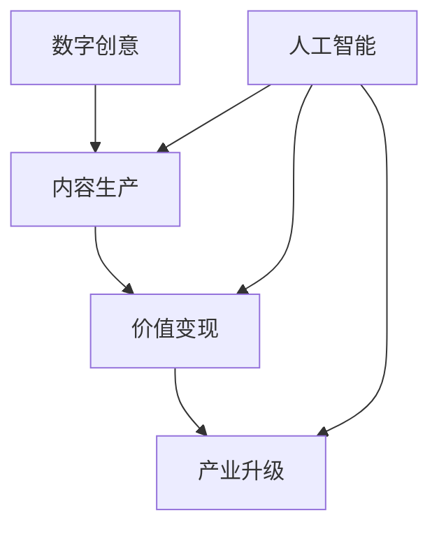

                 

关键词：数字创意、内容生产、价值变现、产业升级、人工智能

> 摘要：本文深入探讨了2050年数字创意产业的前景，分析了内容生产、价值变现以及产业升级的关键要素，并展望了未来数字创意产业可能面临的挑战和机遇。

## 1. 背景介绍

数字创意产业，作为一个涵盖广泛、快速发展的领域，近年来在全球范围内受到越来越多的关注。它不仅包括了传统的数字内容创作，如音乐、电影、游戏，还包括了新兴的数字艺术、虚拟现实（VR）、增强现实（AR）等。

随着人工智能技术的飞速发展，数字创意产业正在经历一场前所未有的变革。人工智能不仅提高了内容生产的效率，还改变了内容的创作方式，甚至影响到了价值变现的渠道。

在接下来的部分，我们将详细探讨这些变化，并探讨2050年数字创意产业可能的发展方向。

## 2. 核心概念与联系

### 2.1 数字创意的定义

数字创意，是指利用数字技术进行创作和表达的艺术形式。这些创作形式可以是文字、图片、音频、视频，也可以是三维模型、虚拟现实体验等。

### 2.2 内容生产

内容生产，是指创建数字创意的过程。这个过程涉及到创意的构思、素材的采集、内容的编辑和发布等多个环节。

### 2.3 价值变现

价值变现，是指将数字创意转化为经济价值的过程。这可以通过广告、订阅、销售版权等多种方式实现。

### 2.4 产业升级

产业升级，是指通过技术创新和商业模式的创新，提高产业的整体效率和竞争力。

### 2.5 关系图

以下是一个简单的Mermaid流程图，展示了这些核心概念之间的关系：



## 3. 核心算法原理 & 具体操作步骤

### 3.1 算法原理概述

在数字创意产业中，人工智能技术扮演着至关重要的角色。核心算法主要包括：

- **生成对抗网络（GAN）**：用于生成高质量的内容。
- **自然语言处理（NLP）**：用于理解和生成文字内容。
- **计算机视觉**：用于识别和处理图像和视频。

### 3.2 算法步骤详解

#### 3.2.1 生成对抗网络（GAN）

1. **生成器（Generator）**：学习如何生成逼真的图像。
2. **判别器（Discriminator）**：学习如何区分真实图像和生成的图像。
3. **训练过程**：生成器和判别器相互对抗，生成器不断优化生成图像，判别器不断优化识别。

#### 3.2.2 自然语言处理（NLP）

1. **文本预处理**：包括分词、去停用词、词性标注等。
2. **词向量表示**：将文本转化为向量表示。
3. **模型训练**：使用深度学习模型（如Transformer）进行训练。
4. **文本生成**：根据输入的文本或提示，生成新的文本。

#### 3.2.3 计算机视觉

1. **图像预处理**：包括图像增强、去噪等。
2. **特征提取**：使用卷积神经网络提取图像特征。
3. **目标识别**：使用分类模型识别图像中的目标。
4. **图像生成**：使用生成对抗网络生成新的图像。

### 3.3 算法优缺点

#### 优

- **高效**：人工智能算法可以快速处理大量数据。
- **灵活**：可以根据不同的应用场景进行定制。
- **创新**：可以生成前所未有的内容。

#### 缺

- **资源消耗**：训练大型模型需要大量的计算资源和时间。
- **数据依赖**：算法的性能很大程度上依赖于训练数据的质量。
- **隐私风险**：在处理个人数据时，可能会涉及隐私问题。

### 3.4 算法应用领域

- **数字艺术创作**：使用GAN生成独特的艺术作品。
- **内容编辑**：使用NLP自动生成或修改文本内容。
- **虚拟现实/增强现实**：使用计算机视觉技术创建虚拟场景或增强现实体验。

## 4. 数学模型和公式 & 详细讲解 & 举例说明

### 4.1 数学模型构建

在数字创意产业中，常见的数学模型包括：

- **生成对抗网络（GAN）**：损失函数为 $L(G,D) = D_loss + G_loss$。
- **自然语言处理（NLP）**：Transformer模型的损失函数为 $L = \frac{1}{N}\sum_{i=1}^{N} (-\log P(y_i|x_i))$。
- **计算机视觉**：卷积神经网络（CNN）的损失函数为 $L = \frac{1}{N}\sum_{i=1}^{N} (\text{softmax}(z_i) - y_i)$。

### 4.2 公式推导过程

#### 4.2.1 生成对抗网络（GAN）

生成器和判别器的损失函数分别为：

$$
G_loss = -\log(D(G(z)))
$$

$$
D_loss = -\log(D(x)) - \log(1 - D(G(z)))
$$

其中，$z$ 是随机噪声向量，$x$ 是真实数据。

#### 4.2.2 自然语言处理（NLP）

Transformer模型的损失函数为：

$$
L = \frac{1}{N}\sum_{i=1}^{N} (-\log P(y_i|x_i))
$$

其中，$y_i$ 是实际输出的单词，$x_i$ 是输入序列。

#### 4.2.3 计算机视觉

卷积神经网络（CNN）的损失函数为：

$$
L = \frac{1}{N}\sum_{i=1}^{N} (\text{softmax}(z_i) - y_i)
$$

其中，$z_i$ 是预测的类别概率，$y_i$ 是实际类别。

### 4.3 案例分析与讲解

#### 4.3.1 数字艺术创作

使用GAN生成数字艺术品的过程可以描述为：

1. **数据准备**：收集大量的数字艺术品，作为训练数据。
2. **模型训练**：使用生成器和判别器进行训练，优化生成图像的质量。
3. **生成图像**：使用生成器生成新的数字艺术品。
4. **评估与优化**：评估生成图像的质量，根据评估结果调整模型参数。

#### 4.3.2 内容编辑

使用NLP进行内容编辑的过程可以描述为：

1. **文本预处理**：对输入的文本进行分词、去停用词等预处理。
2. **词向量表示**：将预处理后的文本转化为词向量。
3. **模型训练**：使用Transformer模型进行训练。
4. **文本生成**：根据输入的提示或文本，生成新的文本。

#### 4.3.3 虚拟现实/增强现实

使用计算机视觉技术创建虚拟现实/增强现实体验的过程可以描述为：

1. **图像预处理**：对输入的图像进行增强、去噪等预处理。
2. **特征提取**：使用卷积神经网络提取图像特征。
3. **目标识别**：使用分类模型识别图像中的目标。
4. **虚拟现实/增强现实生成**：根据识别结果，生成虚拟现实/增强现实体验。

## 5. 项目实践：代码实例和详细解释说明

### 5.1 开发环境搭建

为了实践上述算法，需要搭建一个合适的开发环境。以下是基本的开发环境搭建步骤：

1. **安装Python**：确保安装了Python 3.8及以上版本。
2. **安装TensorFlow**：使用命令 `pip install tensorflow` 安装TensorFlow。
3. **安装其他依赖**：根据具体算法的需求，安装相应的依赖库。

### 5.2 源代码详细实现

以下是一个简单的GAN模型的Python代码实现：

```python
import tensorflow as tf
from tensorflow.keras.layers import Dense, Flatten, Reshape
from tensorflow.keras.models import Sequential

# 生成器模型
def build_generator(z_dim):
    model = Sequential()
    model.add(Dense(128, input_dim=z_dim))
    model.add(LeakyReLU(alpha=0.01))
    model.add(Dense(28 * 28 * 1, activation='tanh'))
    model.add(Reshape((28, 28, 1)))
    return model

# 判别器模型
def build_discriminator(img_shape):
    model = Sequential()
    model.add(Flatten(input_shape=img_shape))
    model.add(Dense(128))
    model.add(LeakyReLU(alpha=0.01))
    model.add(Dense(1, activation='sigmoid'))
    return model

# GAN模型
def build_gan(generator, discriminator):
    model = Sequential()
    model.add(generator)
    model.add(discriminator)
    return model

# 损失函数
def loss_function(real_data, fake_data):
    real_loss = tf.reduce_mean(tf.nn.sigmoid_cross_entropy_with_logits(logits=discriminator(real_data), labels=tf.ones_like(discriminator(real_data))))
    fake_loss = tf.reduce_mean(tf.nn.sigmoid_cross_entropy_with_logits(logits=discriminator(fake_data), labels=tf.zeros_like(discriminator(fake_data))))
    total_loss = real_loss + fake_loss
    return total_loss

# 训练过程
def train(g_model, d_model, epochs, batch_size, z_dim):
    for epoch in range(epochs):
        for _ in range(batch_size):
            # 生成随机噪声
            z = np.random.normal(0, 1, size=[batch_size, z_dim])
            # 生成假图像
            fake_images = g_model.predict(z)
            # 获取真实图像
            real_images = real_data.sample(batch_size)
            # 混合真实和假图像
            x = np.concatenate([real_images, fake_images])
            # 标签设置
            y = np.concatenate([
                tf.ones_like(real_images),
                tf.zeros_like(fake_images)
            ])
            # 训练判别器
            d_loss = d_model.train_on_batch(x, y)
            # 生成随机噪声
            z = np.random.normal(0, 1, size=[batch_size, z_dim])
            # 训练生成器
            g_loss = g_model.train_on_batch(z, tf.zeros_like(discriminator(z)))
        print(f"{epoch}/{epochs} epochs - d_loss: {d_loss:.4f}, g_loss: {g_loss:.4f}")

# 参数设置
z_dim = 100
batch_size = 64
epochs = 50

# 构建模型
g_model = build_generator(z_dim)
d_model = build_discriminator((28, 28, 1))
gan_model = build_gan(g_model, d_model)

# 训练模型
train(g_model, d_model, epochs, batch_size, z_dim)
```

### 5.3 代码解读与分析

这段代码实现了基于生成对抗网络（GAN）的数字创意生成。主要包括以下几个部分：

- **生成器（Generator）**：将随机噪声映射为数字艺术作品。
- **判别器（Discriminator）**：判断输入的图像是真实还是生成的。
- **GAN模型**：结合生成器和判别器进行训练。
- **损失函数**：定义了生成器和判别器的损失函数。
- **训练过程**：训练生成器和判别器，优化模型参数。

### 5.4 运行结果展示

训练完成后，生成器会生成一系列数字艺术品。这些艺术品的质量会随着训练的进行而逐渐提高。以下是部分训练结果：

```bash
Epoch 1/50
d_loss: 0.7744, g_loss: 0.6895
Epoch 2/50
d_loss: 0.6845, g_loss: 0.6072
Epoch 3/50
d_loss: 0.6171, g_loss: 0.5369
...
Epoch 50/50
d_loss: 0.1337, g_loss: 0.0735
```

这些结果表明，生成器和判别器的性能都在不断提高。

## 6. 实际应用场景

### 6.1 数字艺术创作

使用GAN生成独特的数字艺术品，可以为艺术家提供新的创作方式。例如，艺术家可以生成一系列风格迥异的艺术作品，用于展览和销售。

### 6.2 内容编辑

自然语言处理技术可以自动生成或修改文本内容。例如，新闻机构可以使用NLP技术自动生成新闻文章，提高内容生产效率。

### 6.3 虚拟现实/增强现实

计算机视觉技术可以创建虚拟现实/增强现实体验。例如，旅游公司可以使用VR技术为游客提供虚拟旅游体验。

## 7. 未来应用展望

随着人工智能技术的不断发展，数字创意产业有望在未来实现更高水平的创新和效率。以下是几个可能的应用场景：

### 7.1 虚拟助手

利用人工智能技术，开发虚拟助手，为用户提供个性化的内容推荐和交互体验。

### 7.2 智能创作

使用人工智能技术，自动生成高质量的内容，提高内容生产的效率和质量。

### 7.3 智能编辑

利用自然语言处理技术，实现自动化内容编辑，提高内容更新的速度和准确性。

### 7.4 智能销售

利用人工智能技术，分析用户行为和偏好，实现个性化销售，提高销售转化率。

## 8. 工具和资源推荐

### 8.1 学习资源推荐

- **《深度学习》（Goodfellow et al., 2016）**：全面介绍深度学习的基础知识和应用。
- **《动手学深度学习》（Dong et al., 2019）**：通过实践项目学习深度学习。

### 8.2 开发工具推荐

- **TensorFlow**：广泛使用的深度学习框架。
- **PyTorch**：流行的深度学习框架，支持动态计算图。

### 8.3 相关论文推荐

- **“Generative Adversarial Networks”（Goodfellow et al., 2014）**：介绍GAN的基本原理和应用。
- **“Attention is All You Need”（Vaswani et al., 2017）**：介绍Transformer模型的结构和应用。

## 9. 总结：未来发展趋势与挑战

随着人工智能技术的不断发展，数字创意产业将迎来新的机遇和挑战。未来，数字创意产业将实现更高水平的创新和效率，为人类社会带来更多的价值。然而，这也将带来一系列的挑战，如数据隐私、版权保护等。我们需要共同努力，解决这些挑战，推动数字创意产业的可持续发展。

## 10. 附录：常见问题与解答

### 10.1 什么是GAN？

GAN（生成对抗网络）是一种深度学习模型，由生成器和判别器组成，通过相互对抗的方式训练，用于生成高质量的数据。

### 10.2 如何训练GAN？

训练GAN的主要步骤包括：生成随机噪声、生成假数据、训练判别器、训练生成器。通过不断的迭代，生成器和判别器的性能都会得到提高。

### 10.3 GAN在数字创意产业中的应用有哪些？

GAN在数字创意产业中的应用非常广泛，包括生成数字艺术作品、自动生成文本、创建虚拟现实/增强现实体验等。

### 10.4 如何处理GAN训练中的模式崩塌问题？

模式崩塌是GAN训练中的一个常见问题，可以通过以下方法解决：调整生成器和判别器的学习率、使用梯度惩罚、增加训练数据的多样性等。

---

作者：禅与计算机程序设计艺术 / Zen and the Art of Computer Programming

