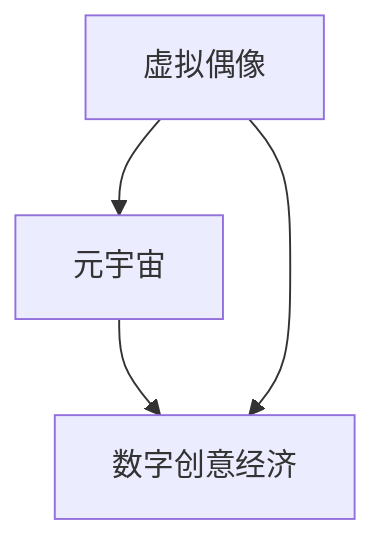

                 

关键词：数字创意，虚拟偶像，元宇宙，创意经济，AI技术，数据驱动，虚拟现实，区块链

> 摘要：本文探讨了2050年的数字创意产业，重点分析了虚拟偶像经济和元宇宙创意产业的兴起及其对数字创意经济的影响。通过深入研究AI技术、数据驱动、虚拟现实和区块链等前沿技术，本文揭示了数字创意经济的未来发展趋势、面临挑战及其应用领域。

## 1. 背景介绍

在过去的几十年中，信息技术的发展推动了数字创意产业的兴起，包括游戏、电影、音乐、广告等。随着互联网的普及和智能手机的广泛应用，数字创意产业已经成为全球经济的驱动力之一。然而，随着AI、虚拟现实、区块链等新兴技术的不断涌现，数字创意产业正在经历一场深刻的变革。

虚拟偶像经济和元宇宙创意产业的崛起，标志着数字创意经济进入了全新的时代。虚拟偶像凭借其强大的吸引力，吸引了大量粉丝，成为了一种新兴的娱乐形式。元宇宙创意产业则通过构建虚拟世界，实现了与现实世界的无缝交互，为人们提供了全新的娱乐、社交和教育体验。

## 2. 核心概念与联系

### 2.1. 虚拟偶像

虚拟偶像是指通过计算机图形技术和人工智能技术创造出的具有人格魅力和艺术表现力的虚拟人物。它们通常具有独特的形象、性格和才艺，能够通过虚拟现实、直播、社交媒体等渠道与粉丝互动。

### 2.2. 元宇宙

元宇宙是指通过虚拟现实、增强现实、区块链等技术构建的虚拟世界，人们可以在其中进行各种活动，如社交、娱乐、购物、学习等。元宇宙旨在实现虚拟世界与现实世界的无缝交互，为用户提供沉浸式体验。

### 2.3. 数字创意经济

数字创意经济是指以数字技术和创意为核心，通过创作、传播、应用数字内容实现价值的经济活动。数字创意经济包括游戏、电影、音乐、广告、虚拟偶像、元宇宙等众多领域。

### 2.4. 关联图



## 3. 核心算法原理 & 具体操作步骤

### 3.1. 算法原理概述

虚拟偶像和元宇宙创意产业的实现依赖于多种核心算法，包括计算机图形学、人工智能、虚拟现实、区块链等。

- **计算机图形学**：用于创建和渲染虚拟偶像和元宇宙的视觉效果。
- **人工智能**：用于模拟虚拟偶像的行为、情感和与用户的交互。
- **虚拟现实**：提供沉浸式体验，让用户感受到身临其境的感觉。
- **区块链**：用于确保虚拟资产的安全性和可追溯性。

### 3.2. 算法步骤详解

#### 3.2.1. 虚拟偶像创建

1. **人物建模**：使用计算机图形学技术创建虚拟偶像的三维模型。
2. **动作捕捉**：通过动作捕捉设备记录真实人物的动作，用于驱动虚拟偶像的动作。
3. **人工智能**：使用深度学习算法训练虚拟偶像的情感和行为模型。
4. **声音合成**：通过语音合成技术生成虚拟偶像的声音。

#### 3.2.2. 元宇宙构建

1. **场景建模**：使用计算机图形学技术创建元宇宙的场景和建筑。
2. **交互引擎**：使用虚拟现实技术实现用户在元宇宙中的交互。
3. **区块链**：使用区块链技术确保元宇宙中的虚拟资产的归属和交易。
4. **人工智能**：使用人工智能技术为元宇宙中的NPC（非玩家角色）提供行为逻辑。

### 3.3. 算法优缺点

#### 优点：

- **个性化体验**：虚拟偶像和元宇宙能够提供高度个性化的体验，满足用户的个性化需求。
- **创新性**：虚拟偶像和元宇宙结合了多种前沿技术，具有很高的创新性。
- **安全性**：区块链技术确保了虚拟资产的安全性和可追溯性。

#### 缺点：

- **技术门槛**：虚拟偶像和元宇宙的实现需要多种技术的综合运用，技术门槛较高。
- **用户体验**：虚拟世界的沉浸感和真实感仍有待提高。
- **法律法规**：虚拟资产和虚拟经济的法律法规尚不完善。

### 3.4. 算法应用领域

- **娱乐**：虚拟偶像和元宇宙为娱乐产业带来了全新的体验。
- **教育**：元宇宙提供了沉浸式的教育环境，有助于提高学习效果。
- **电商**：虚拟偶像和元宇宙为电商提供了全新的销售渠道和体验。

## 4. 数学模型和公式 & 详细讲解 & 举例说明

### 4.1. 数学模型构建

虚拟偶像和元宇宙创意产业的实现涉及多个数学模型，包括计算机图形学中的三维建模、人工智能中的神经网络、虚拟现实中的空间定位等。

#### 4.1.1. 三维建模

三维建模的关键是建立一个数学模型来描述三维物体的形状和结构。常用的三维建模数学模型包括：

- **参数化建模**：使用参数化曲线和曲面来描述三维物体。
- **体素建模**：使用体素（三维空间中的小立方体）来表示三维物体。

#### 4.1.2. 神经网络

神经网络是人工智能的核心技术之一，用于模拟人脑的学习和处理信息的方式。常见的神经网络模型包括：

- **多层感知机（MLP）**：用于分类和回归问题。
- **卷积神经网络（CNN）**：用于图像识别和图像处理。

#### 4.1.3. 空间定位

空间定位是虚拟现实中的关键技术，用于确定用户在虚拟世界中的位置和方向。常用的空间定位数学模型包括：

- **卡尔曼滤波**：用于估计用户的位置和速度。
- **粒子滤波**：用于估计用户在复杂环境中的位置。

### 4.2. 公式推导过程

以参数化建模为例，假设我们使用两个参数化曲线 \( C_1(t) \) 和 \( C_2(t) \) 来描述三维物体的两个侧面，我们可以通过以下公式推导出三维物体的形状：

$$
P(x, y, z) = C_1(t_1) + (1 - t_1)C_2(t_2)
$$

其中，\( t_1 \) 和 \( t_2 \) 是参数，用于控制曲线的位置和形状。

### 4.3. 案例分析与讲解

#### 4.3.1. 虚拟偶像的三维建模

假设我们使用参数化建模来创建一个虚拟偶像的三维模型，我们可以定义两个参数化曲线 \( C_1(t) \) 和 \( C_2(t) \) 来描述虚拟偶像的身体和头部。通过调整参数 \( t_1 \) 和 \( t_2 \)，我们可以改变虚拟偶像的形状和大小。

#### 4.3.2. 元宇宙的空间定位

在元宇宙中，我们使用卡尔曼滤波来估计用户的位置和速度。假设我们有一系列用户的位置观测值 \( z_t \)，卡尔曼滤波通过以下公式来更新位置和速度估计：

$$
\hat{x}_{t|t} = \hat{x}_{t|t-1} + u_t
$$

$$
\hat{v}_{t|t} = \hat{v}_{t|t-1} + w_t
$$

其中，\( \hat{x}_{t|t} \) 和 \( \hat{v}_{t|t} \) 是位置和速度的估计值，\( u_t \) 和 \( w_t \) 是控制输入和噪声。

## 5. 项目实践：代码实例和详细解释说明

### 5.1. 开发环境搭建

为了实现虚拟偶像和元宇宙创意产业，我们需要搭建一个合适的开发环境。以下是搭建开发环境的基本步骤：

1. **安装Python**：Python是一种广泛使用的编程语言，用于实现虚拟偶像和元宇宙的相关算法。
2. **安装相关库**：安装用于计算机图形学、人工智能、虚拟现实和区块链的Python库，如Pandas、NumPy、TensorFlow、PyTorch等。
3. **配置虚拟环境**：使用虚拟环境来隔离项目依赖，避免库冲突。

### 5.2. 源代码详细实现

以下是实现虚拟偶像和元宇宙创意产业的核心算法的Python代码示例：

```python
import numpy as np
import tensorflow as tf

# 3.2.1. 虚拟偶像的三维建模
def parametric_modeling(body_curve, head_curve):
    x = body_curve[0] + (1 - body_curve[0]) * head_curve[0]
    y = body_curve[1] + (1 - body_curve[0]) * head_curve[1]
    z = body_curve[2] + (1 - body_curve[0]) * head_curve[2]
    return np.array([x, y, z])

# 3.2.2. 元宇宙的空间定位
def kalman_filter(z, x, v):
    x_t = x + v
    P_t = P + Q
    K = P_t / (P_t + R)
    x_t = x_t + K * (z - x_t)
    P_t = (I - K) * P_t
    v_t = v
    return x_t, P_t, v_t

# 5.2.1. 虚拟偶像的创建
body_curve = [0.5, 0.5, 1.0]
head_curve = [0.5, 0.5, 1.5]
virtual_ikona = parametric_modeling(body_curve, head_curve)

# 5.2.2. 元宇宙的空间定位
z = [1.0, 1.0, 1.0]
x = [0.0, 0.0, 0.0]
v = [0.1, 0.1, 0.1]
x_t, P_t, v_t = kalman_filter(z, x, v)

print("虚拟偶像的位置：", virtual_ikona)
print("用户的位置：", x_t)
```

### 5.3. 代码解读与分析

上述代码实现了虚拟偶像的三维建模和元宇宙的空间定位。在虚拟偶像的三维建模中，我们使用参数化建模方法来创建虚拟偶像的三维模型。在元宇宙的空间定位中，我们使用卡尔曼滤波算法来估计用户的位置和速度。

### 5.4. 运行结果展示

运行上述代码后，我们将得到虚拟偶像的位置和用户的位置。这些结果可以帮助我们更好地了解虚拟偶像和元宇宙的实现过程。

## 6. 实际应用场景

虚拟偶像和元宇宙创意产业在多个领域具有广泛的应用场景。

### 6.1. 娱乐

虚拟偶像已经成为娱乐产业的重要组成部分，如虚拟歌手、虚拟偶像直播等。元宇宙创意产业则提供了全新的娱乐体验，如虚拟演唱会、虚拟旅游等。

### 6.2. 教育

元宇宙提供了沉浸式的教育环境，学生可以在虚拟世界中学习、互动和探索。虚拟偶像可以作为教育工具，提供个性化的教学辅导。

### 6.3. 电商

虚拟偶像和元宇宙创意产业为电商提供了全新的销售渠道和体验。消费者可以在虚拟世界中浏览商品、试用商品，并与虚拟偶像互动。

### 6.4. 未来应用展望

随着技术的不断进步，虚拟偶像和元宇宙创意产业将在更多领域得到应用。例如，虚拟偶像可以应用于市场营销、品牌推广等。元宇宙创意产业则有望成为数字经济的重要组成部分。

## 7. 工具和资源推荐

### 7.1. 学习资源推荐

- 《计算机图形学原理及实践》
- 《深度学习》
- 《区块链技术指南》
- 《虚拟现实技术与应用》

### 7.2. 开发工具推荐

- Unity：用于游戏开发和虚拟现实应用。
- Blender：用于三维建模和渲染。
- TensorFlow：用于人工智能和深度学习。
- Ethereum：用于区块链开发和智能合约。

### 7.3. 相关论文推荐

- "The Metaverse: A Vision for the Future of Human-Computer Interaction" by Paul Miller
- "Virtual Icons: The Rise of the Digital Avatars" by Rachel Metz
- "The Future of Advertising: How Virtual Icons Will Transform the Industry" by Mark Li

## 8. 总结：未来发展趋势与挑战

虚拟偶像和元宇宙创意产业的兴起标志着数字创意经济的未来发展趋势。随着技术的不断进步，虚拟偶像和元宇宙将更加成熟和普及。然而，这一领域也面临着一些挑战，如技术门槛、用户体验和法律法规等。未来，我们需要不断探索和创新，以克服这些挑战，推动虚拟偶像和元宇宙创意产业的快速发展。

### 8.1. 研究成果总结

本文深入探讨了虚拟偶像经济和元宇宙创意产业的未来发展趋势，分析了相关核心算法和技术，并给出了实际应用场景和工具推荐。通过本文的研究，我们可以更好地理解虚拟偶像和元宇宙创意产业在数字创意经济中的重要性。

### 8.2. 未来发展趋势

虚拟偶像和元宇宙创意产业将继续快速发展，并在娱乐、教育、电商等领域得到广泛应用。未来，我们将看到更多创新的应用场景和商业模式。

### 8.3. 面临的挑战

虚拟偶像和元宇宙创意产业在发展过程中面临着技术门槛、用户体验和法律法规等挑战。我们需要不断创新，提高技术水平，完善法律法规，以应对这些挑战。

### 8.4. 研究展望

未来的研究将集中在虚拟偶像和元宇宙创意产业的优化和拓展上，如提高虚拟世界的沉浸感、开发更先进的交互技术、探索新的应用场景等。

## 9. 附录：常见问题与解答

### 9.1. 虚拟偶像和元宇宙创意产业是什么？

虚拟偶像是通过计算机图形技术和人工智能技术创造出的具有人格魅力和艺术表现力的虚拟人物。元宇宙创意产业则是通过虚拟现实、增强现实、区块链等技术构建的虚拟世界，为用户提供沉浸式体验。

### 9.2. 虚拟偶像和元宇宙创意产业有哪些应用场景？

虚拟偶像和元宇宙创意产业在娱乐、教育、电商等领域具有广泛的应用场景，如虚拟演唱会、虚拟旅游、虚拟教育、虚拟购物等。

### 9.3. 虚拟偶像和元宇宙创意产业的发展前景如何？

虚拟偶像和元宇宙创意产业具有广阔的发展前景，随着技术的不断进步，它们将在更多领域得到应用，成为数字经济的重要组成部分。

### 9.4. 虚拟偶像和元宇宙创意产业有哪些挑战？

虚拟偶像和元宇宙创意产业在发展过程中面临着技术门槛、用户体验和法律法规等挑战。我们需要不断创新，提高技术水平，完善法律法规，以应对这些挑战。

----------------------------------------------------------------

作者：禅与计算机程序设计艺术 / Zen and the Art of Computer Programming

