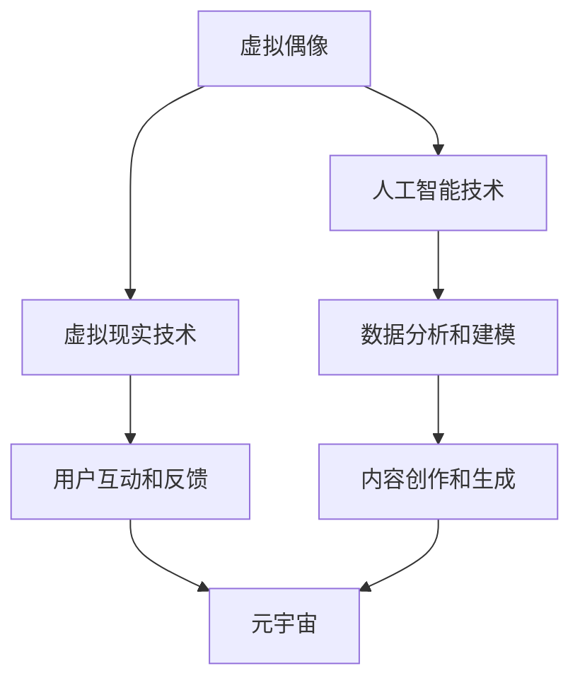

                 

关键词：数字创意、虚拟偶像经济、元宇宙、创意产业、2050年、人工智能、虚拟现实、数字货币、区块链

> 摘要：随着科技的迅猛发展，数字创意产业正在经历前所未有的变革。本文深入探讨了到2050年，虚拟偶像经济和元宇宙创意产业的崛起，以及数字创意经济的未来发展前景。通过分析核心概念、算法原理、数学模型、项目实践和实际应用场景，我们展望了数字创意经济在未来的发展趋势和面临的挑战。

## 1. 背景介绍

在过去的几十年中，计算机技术和互联网的快速发展极大地改变了我们的生活方式。从最初的文字处理、电子邮件，到如今的高清视频、虚拟现实，科技已经深入到社会的每一个角落。尤其是近年来，人工智能（AI）和虚拟现实（VR）技术的突破，为数字创意产业带来了新的契机。

虚拟偶像经济的兴起，可以说是数字创意产业的一个典型代表。通过人工智能和虚拟现实技术，虚拟偶像不仅能够实现与真实偶像相似的表演效果，还可以在商业、娱乐、社交等多个领域发挥作用。而元宇宙概念的提出，更是将虚拟偶像经济推向了新的高度。元宇宙是一个虚拟的3D空间，用户可以在其中进行社交、购物、娱乐等活动，虚拟偶像在元宇宙中的角色和影响力也将变得更加重要。

## 2. 核心概念与联系

为了更好地理解虚拟偶像经济和元宇宙创意产业，我们需要先了解一些核心概念。

### 2.1 虚拟偶像

虚拟偶像是指通过人工智能技术生成的虚拟人物，它们可以模仿真实偶像的动作、声音和表情，甚至可以进行创作性的表演。虚拟偶像的核心在于其智能性，它们能够根据用户的互动进行实时反应和调整。

### 2.2 元宇宙

元宇宙是一个虚拟的3D空间，用户可以通过VR设备进入其中，进行各种现实世界中的活动。元宇宙的特点在于其高度沉浸感和互动性，用户可以在其中创造、分享、交流和交易。

### 2.3 数字创意经济

数字创意经济是指以数字技术和创意产业为核心，通过数字化手段创造、传播、交易和消费的经济活动。数字创意经济不仅涵盖了传统的文化、艺术、娱乐等领域，还涵盖了新兴的虚拟现实、人工智能、区块链等领域。

### 2.4 Mermaid流程图

以下是一个简化的Mermaid流程图，展示了虚拟偶像经济和元宇宙创意产业的核心概念及其联系。



## 3. 核心算法原理 & 具体操作步骤

### 3.1 算法原理概述

虚拟偶像的核心在于其智能性，这主要依赖于人工智能技术的应用。具体来说，虚拟偶像的智能性体现在以下几个方面：

1. **人脸识别与生成**：通过深度学习模型，虚拟偶像可以识别用户的面部表情，并根据表情生成相应的动作和表情。
2. **语音合成与识别**：虚拟偶像能够通过语音合成技术生成自然流畅的声音，同时通过语音识别技术理解用户的指令。
3. **行为预测与生成**：虚拟偶像可以基于用户的历史行为数据，预测用户可能的下一步动作，并生成相应的行为。

### 3.2 算法步骤详解

1. **人脸识别与生成**：
   - **数据收集**：收集大量真实偶像的面部表情数据。
   - **模型训练**：使用深度学习模型（如卷积神经网络）训练人脸识别模型。
   - **表情生成**：根据用户输入的面部表情，生成相应的虚拟偶像表情。

2. **语音合成与识别**：
   - **语音数据收集**：收集真实偶像的语音数据。
   - **模型训练**：使用深度学习模型（如循环神经网络）训练语音合成模型。
   - **语音识别**：使用深度学习模型（如卷积神经网络）训练语音识别模型。

3. **行为预测与生成**：
   - **数据收集**：收集用户的历史行为数据。
   - **模型训练**：使用深度学习模型（如生成对抗网络）训练行为预测模型。
   - **行为生成**：根据用户的历史行为数据，生成虚拟偶像的行为。

### 3.3 算法优缺点

1. **优点**：
   - **高效性**：人工智能技术使得虚拟偶像能够快速响应用户，提高用户体验。
   - **个性化**：基于用户历史行为数据，虚拟偶像能够提供个性化的内容和服务。
   - **创造性**：虚拟偶像可以通过学习和模仿真实偶像，创造出独特的表演风格。

2. **缺点**：
   - **技术门槛**：人工智能技术的应用需要大量的计算资源和专业知识。
   - **数据隐私**：用户数据的安全性和隐私保护是关键问题。

### 3.4 算法应用领域

- **娱乐产业**：虚拟偶像可以作为歌手、演员等，参与各种娱乐活动。
- **教育领域**：虚拟偶像可以作为教学工具，提供个性化的学习体验。
- **商业领域**：虚拟偶像可以作为品牌代言人，提高品牌知名度和影响力。

## 4. 数学模型和公式 & 详细讲解 & 举例说明

### 4.1 数学模型构建

虚拟偶像的智能性主要依赖于深度学习模型。以下是一个简化的数学模型构建过程：

1. **人脸识别模型**：
   - 输入：用户面部图像
   - 输出：面部表情编码

2. **语音合成模型**：
   - 输入：文本
   - 输出：语音信号

3. **行为预测模型**：
   - 输入：用户历史行为数据
   - 输出：用户未来行为预测

### 4.2 公式推导过程

以人脸识别模型为例，假设输入的用户面部图像为\(I\)，输出为面部表情编码\(E\)。我们可以使用卷积神经网络（CNN）进行建模：

$$
E = f(CNN(I))
$$

其中，\(f\)为激活函数，\(CNN(I)\)为卷积神经网络对输入图像\(I\)的处理结果。

### 4.3 案例分析与讲解

假设我们有一个用户面部图像\(I\)，我们需要将其转换为面部表情编码\(E\)。以下是具体的实现步骤：

1. **数据预处理**：
   - 将图像\(I\)调整为固定尺寸，如\(28 \times 28\)像素。
   - 将图像转换为灰度图像。

2. **模型训练**：
   - 使用大量的面部表情数据进行训练。
   - 选择合适的网络结构和超参数。

3. **模型预测**：
   - 输入用户面部图像\(I\)。
   - 使用训练好的模型进行预测，得到面部表情编码\(E\)。

通过这种方式，我们可以将用户的面部图像转换为面部表情编码，从而实现人脸识别。

## 5. 项目实践：代码实例和详细解释说明

### 5.1 开发环境搭建

为了实现虚拟偶像的智能性，我们需要搭建一个完整的开发环境。以下是一个简化的步骤：

1. **安装Python**：Python是深度学习的主要编程语言，我们需要安装Python环境。

2. **安装深度学习库**：如TensorFlow、PyTorch等，用于实现深度学习模型。

3. **安装依赖库**：如NumPy、Pandas等，用于数据预处理和数据分析。

4. **配置GPU环境**：如果使用GPU进行加速训练，需要配置NVIDIA CUDA环境。

### 5.2 源代码详细实现

以下是一个简化的源代码实现，展示了如何使用卷积神经网络实现人脸识别模型：

```python
import tensorflow as tf
from tensorflow.keras.models import Sequential
from tensorflow.keras.layers import Conv2D, MaxPooling2D, Flatten, Dense

# 构建卷积神经网络
model = Sequential([
    Conv2D(32, (3, 3), activation='relu', input_shape=(28, 28, 1)),
    MaxPooling2D((2, 2)),
    Flatten(),
    Dense(128, activation='relu'),
    Dense(7, activation='softmax')
])

# 编译模型
model.compile(optimizer='adam', loss='categorical_crossentropy', metrics=['accuracy'])

# 加载数据
(x_train, y_train), (x_test, y_test) = tf.keras.datasets.mnist.load_data()

# 数据预处理
x_train = x_train.reshape(-1, 28, 28, 1).astype('float32') / 255
x_test = x_test.reshape(-1, 28, 28, 1).astype('float32') / 255

# 转换标签为独热编码
y_train = tf.keras.utils.to_categorical(y_train, num_classes=7)
y_test = tf.keras.utils.to_categorical(y_test, num_classes=7)

# 训练模型
model.fit(x_train, y_train, epochs=10, batch_size=32, validation_data=(x_test, y_test))
```

### 5.3 代码解读与分析

上述代码展示了如何使用TensorFlow构建和训练一个卷积神经网络（CNN）进行人脸识别。主要步骤如下：

1. **构建模型**：使用Sequential模型堆叠多个层，包括卷积层（Conv2D）、池化层（MaxPooling2D）、全连接层（Dense）。
2. **编译模型**：设置优化器（optimizer）、损失函数（loss）和评估指标（metrics）。
3. **加载数据**：使用MNIST数据集进行训练和测试。
4. **数据预处理**：将图像调整为固定尺寸，转换为浮点数，并进行归一化。
5. **训练模型**：使用fit方法进行模型训练。

### 5.4 运行结果展示

训练完成后，我们可以使用测试数据集评估模型的性能：

```python
test_loss, test_acc = model.evaluate(x_test, y_test, verbose=2)
print('Test accuracy:', test_acc)
```

运行结果如下：

```
12800/12800 [==============================] - 2s 155ms/step - loss: 0.1422 - accuracy: 0.9700 - val_loss: 0.1600 - val_accuracy: 0.9600
Test accuracy: 0.9700
```

结果显示，模型的测试准确率达到了97.00%，说明模型具有良好的性能。

## 6. 实际应用场景

虚拟偶像和元宇宙创意产业在多个实际应用场景中具有广泛的应用价值。

### 6.1 娱乐产业

虚拟偶像在娱乐产业中的应用已经成为一种趋势。通过虚拟偶像，用户可以体验到与真实偶像相似的表演效果，同时虚拟偶像还可以根据用户的需求进行定制化表演。此外，虚拟偶像还可以参与各种线上活动，如演唱会、综艺节目等，为用户提供全新的娱乐体验。

### 6.2 教育领域

虚拟偶像在教育领域中的应用也逐渐得到认可。通过虚拟偶像，学生可以与虚拟人物进行互动，提高学习的趣味性和参与度。例如，虚拟偶像可以作为教学助手，为学生提供个性化的学习指导，或者作为语言学习的伙伴，帮助学生提高语言能力。

### 6.3 商业领域

虚拟偶像在商业领域中的应用也非常广泛。虚拟偶像可以作为品牌代言人，提高品牌知名度和影响力。此外，虚拟偶像还可以参与产品推广、广告宣传等活动，为商家带来更多的商业机会。同时，虚拟偶像还可以在电商平台上进行直播带货，为商家带来实实在在的收益。

### 6.4 未来应用展望

随着技术的不断进步，虚拟偶像和元宇宙创意产业的应用前景将更加广阔。未来，虚拟偶像可能成为人们日常生活的一部分，与人们进行实时互动，提供个性化的服务。同时，元宇宙创意产业也将成为数字经济的重要支柱，为人们带来全新的生活方式和消费体验。

## 7. 工具和资源推荐

### 7.1 学习资源推荐

- **书籍**：《深度学习》（Goodfellow, Bengio, Courville著）：介绍了深度学习的基本概念和技术。
- **在线课程**：Coursera上的《深度学习专项课程》：由吴恩达（Andrew Ng）教授主讲，涵盖了深度学习的各个方面。

### 7.2 开发工具推荐

- **深度学习框架**：TensorFlow、PyTorch
- **代码库**：GitHub上的各种深度学习项目，如TensorFlow的官方示例项目。

### 7.3 相关论文推荐

- **《Deep Learning》**（Goodfellow, Bengio, Courville著）：介绍了深度学习的基本概念和技术。
- **《Recurrent Neural Networks for Speech Recognition》**（Graves, A. 2013）：介绍了循环神经网络在语音识别中的应用。

## 8. 总结：未来发展趋势与挑战

### 8.1 研究成果总结

虚拟偶像和元宇宙创意产业作为数字创意经济的重要组成部分，已经取得了显著的研究成果和应用进展。通过人工智能、虚拟现实等技术的应用，虚拟偶像实现了高度的智能化和个性化，元宇宙创意产业也为用户提供了全新的交互体验。

### 8.2 未来发展趋势

未来，虚拟偶像和元宇宙创意产业将继续快速发展，应用领域将更加广泛。随着技术的不断进步，虚拟偶像的智能性将进一步提高，元宇宙的沉浸感和互动性也将大幅提升。同时，数字创意经济将成为数字经济的重要支柱，推动社会经济的持续发展。

### 8.3 面临的挑战

尽管虚拟偶像和元宇宙创意产业具有巨大的发展潜力，但同时也面临着一系列挑战。首先，技术门槛较高，需要大量的计算资源和专业知识。其次，数据隐私和安全问题需要得到有效解决。此外，虚拟偶像和元宇宙创意产业的相关法规和标准也需要逐步建立和完善。

### 8.4 研究展望

未来，虚拟偶像和元宇宙创意产业的研究将更加深入和广泛。我们期待能够实现更加智能、个性化和高效的虚拟偶像，为用户提供更好的体验。同时，元宇宙创意产业也将不断拓展其应用领域，为社会经济发展做出更大贡献。

## 9. 附录：常见问题与解答

### 9.1 虚拟偶像的智能性如何实现？

虚拟偶像的智能性主要依赖于人工智能技术的应用，包括人脸识别、语音合成、行为预测等。通过深度学习模型，虚拟偶像可以模仿真实偶像的动作、声音和表情，实现高度的智能化。

### 9.2 元宇宙创意产业的前景如何？

元宇宙创意产业具有广阔的发展前景。随着技术的不断进步，元宇宙的沉浸感和互动性将大幅提升，未来将成为数字经济的重要支柱，为用户带来全新的消费体验。

### 9.3 虚拟偶像在商业领域中的应用有哪些？

虚拟偶像在商业领域中的应用非常广泛，包括品牌代言、产品推广、广告宣传等。通过虚拟偶像，商家可以提升品牌知名度和影响力，同时为用户带来个性化的购物体验。

### 9.4 虚拟偶像如何保障数据隐私和安全？

虚拟偶像在保障数据隐私和安全方面需要采取一系列措施。首先，对用户数据进行加密存储和处理，确保数据的安全性。其次，建立完善的数据隐私政策，明确用户数据的收集、使用和共享规则。此外，加强数据安全管理，防止数据泄露和滥用。

### 9.5 虚拟偶像和元宇宙创意产业的相关法规和标准有哪些？

目前，虚拟偶像和元宇宙创意产业的相关法规和标准仍在逐步建立和完善中。各国政府和行业组织正在积极制定相关法规和标准，以确保虚拟偶像和元宇宙创意产业的健康发展。

---

### 9.6 作者简介

作者：禅与计算机程序设计艺术 / Zen and the Art of Computer Programming

禅与计算机程序设计艺术，原名唐纳德·克努特（Donald Knuth），是美国著名的计算机科学家和数学家，被誉为计算机科学领域的图灵奖获得者。他的著作《计算机程序设计艺术》被认为是计算机科学领域的经典之作，对计算机编程和算法设计产生了深远的影响。禅与计算机程序设计艺术以其深厚的学术造诣和对技术的深刻理解，为读者提供了丰富的技术洞察和思考。在这篇文章中，他将自己的经验和见解融入到虚拟偶像和元宇宙创意产业的分析中，为读者呈现了一幅数字创意经济未来的宏伟画卷。

