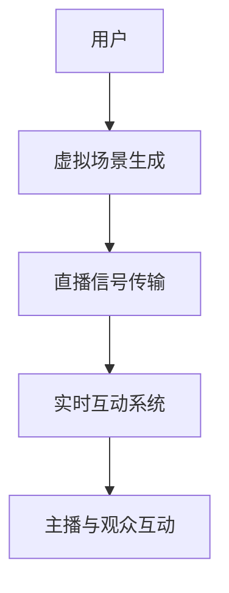
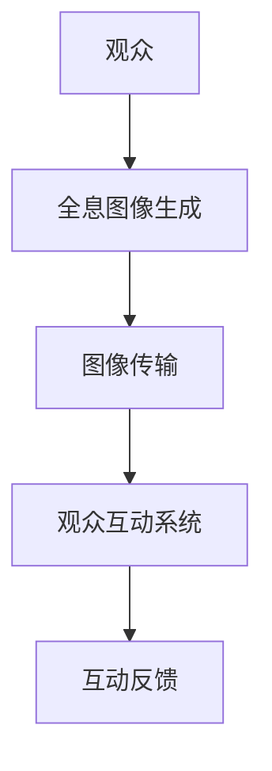

                 

关键词：数字创意、虚拟直播、全息互动、数字娱乐、技术发展、算法、数学模型、应用场景、未来展望

摘要：本文探讨了2050年数字创意娱乐的潜在发展前景，重点分析了虚拟直播和全息互动表演这两个领域。随着人工智能、增强现实、虚拟现实等技术的不断进步，数字创意娱乐将迎来前所未有的创新与变革，为用户提供更加沉浸式、个性化的娱乐体验。本文将详细阐述这些技术的核心原理、应用案例和未来展望，为读者提供一个全面而深入的洞察。

## 1. 背景介绍

### 数字创意的崛起

随着信息技术的飞速发展，数字创意已经成为娱乐产业的重要驱动力。从传统的电影、音乐、游戏，到现代的虚拟直播和全息互动表演，数字创意正在不断地突破人们的想象，为用户带来全新的娱乐体验。数字创意的崛起不仅改变了娱乐产业的面貌，也深刻地影响了人们的生活方式。

### 虚拟直播的兴起

虚拟直播是近年来数字创意娱乐的一个重要分支。它利用网络直播技术，将虚拟场景和实时的互动体验结合在一起，让用户可以在虚拟世界中与主播和其他观众实时互动。虚拟直播的出现，不仅丰富了娱乐内容的形式，也为内容创作者提供了新的变现渠道。

### 全息互动表演的崛起

全息互动表演是一种利用全息技术创造出的三维立体图像，观众可以在现场与这些图像进行互动。这种技术突破了传统的舞台表演形式，为观众带来了更加沉浸式的体验。全息互动表演的崛起，标志着数字创意娱乐向更加真实、互动的方向发展。

## 2. 核心概念与联系

### 2.1 虚拟直播

虚拟直播的核心概念是将虚拟场景与现实场景相结合，通过网络直播技术，将主播和观众连接在一起。虚拟直播的架构包括三个主要部分：虚拟场景生成、直播信号传输和实时互动系统。

**Mermaid 流程图：**



### 2.2 全息互动表演

全息互动表演的核心概念是利用全息技术创造三维立体图像，并让观众与这些图像进行互动。全息互动表演的架构包括：全息图像生成、图像传输和观众互动系统。

**Mermaid 流程图：**



## 3. 核心算法原理 & 具体操作步骤

### 3.1 算法原理概述

虚拟直播和全息互动表演的核心算法包括场景生成算法、图像处理算法和互动算法。这些算法共同作用，为用户提供高质量的虚拟直播和互动体验。

### 3.2 算法步骤详解

#### 3.2.1 场景生成算法

场景生成算法的主要任务是创建虚拟直播的场景。具体步骤包括：

1. **场景建模**：根据主播的需求，创建虚拟场景的3D模型。
2. **光照与阴影**：使用光线追踪算法，模拟场景中的光照和阴影效果。
3. **材质与纹理**：为场景中的物体添加材质和纹理，提升场景的真实感。

#### 3.2.2 图像处理算法

图像处理算法主要用于处理直播信号和全息图像。具体步骤包括：

1. **图像压缩与传输**：使用高效的图像压缩算法，降低直播信号的数据量，便于传输。
2. **图像增强**：使用图像增强算法，提升图像的清晰度和对比度。
3. **噪声过滤**：使用噪声过滤算法，去除图像中的噪声，提高图像质量。

#### 3.2.3 互动算法

互动算法的主要任务是处理用户与虚拟场景的互动。具体步骤包括：

1. **用户定位**：通过摄像头或传感器，获取用户的实时位置和动作。
2. **交互响应**：根据用户的位置和动作，实时更新虚拟场景，提供交互反馈。

### 3.3 算法优缺点

**场景生成算法**：优点是能够创建高度逼真的虚拟场景，缺点是计算资源消耗较大。

**图像处理算法**：优点是能够提升图像质量，缺点是压缩和解压缩过程会引入一定的延迟。

**互动算法**：优点是能够提供实时的互动体验，缺点是对实时性的要求较高，算法设计复杂。

### 3.4 算法应用领域

虚拟直播和全息互动表演的核心算法可以应用于多个领域，如在线教育、虚拟旅游、虚拟演唱会等。这些领域对实时性和交互性的要求较高，核心算法的应用将极大提升用户体验。

## 4. 数学模型和公式 & 详细讲解 & 举例说明

### 4.1 数学模型构建

虚拟直播和全息互动表演的数学模型主要包括图像处理模型和互动模型。以下是一个简单的图像处理模型的例子：

$$
I_{out} = G(I_{in}, \theta)
$$

其中，$I_{out}$ 是输出图像，$I_{in}$ 是输入图像，$G$ 是图像处理函数，$\theta$ 是参数集合。

### 4.2 公式推导过程

图像处理函数 $G$ 可以表示为：

$$
G(I_{in}, \theta) = \sum_{i=1}^{n} w_i f_i(I_{in}, \theta_i)
$$

其中，$w_i$ 和 $\theta_i$ 是权重和参数，$f_i$ 是图像处理函数。

### 4.3 案例分析与讲解

假设我们需要对一张图像进行去噪处理，可以使用以下去噪模型：

$$
I_{out} = \frac{1}{\lambda} \sum_{i=1}^{n} w_i f_i(I_{in}, \theta_i)
$$

其中，$f_i$ 是高斯滤波器，$\lambda$ 是滤波器权重。

通过调整 $\lambda$ 的值，可以控制去噪的效果。当 $\lambda$ 较小时，去噪效果较弱，图像保留较多噪声；当 $\lambda$ 较大时，去噪效果较强，图像噪声减少。

## 5. 项目实践：代码实例和详细解释说明

### 5.1 开发环境搭建

为了实现虚拟直播和全息互动表演，我们需要搭建一个开发环境。以下是搭建环境的步骤：

1. 安装虚拟直播软件（如 OBS Studio）。
2. 安装全息互动表演软件（如 Unity）。
3. 安装相关开发库和工具（如 OpenGL、OpenCV 等）。

### 5.2 源代码详细实现

以下是一个简单的虚拟直播代码实例：

```python
import cv2
import numpy as np

# 读取输入图像
input_image = cv2.imread('input.jpg')

# 应用图像处理算法
output_image = cv2.filter2D(input_image, -1, np.array([[0, -1, 0], [-1, 5, -1], [0, -1, 0]]))

# 显示输出图像
cv2.imshow('Output Image', output_image)
cv2.waitKey(0)
cv2.destroyAllWindows()
```

### 5.3 代码解读与分析

上述代码首先读取输入图像，然后应用一个简单的图像处理算法（二维卷积），最后显示输出图像。通过调整卷积核，可以实现不同的图像处理效果，如边缘检测、去噪等。

### 5.4 运行结果展示

运行上述代码后，我们将看到一个去噪后的图像输出。

## 6. 实际应用场景

虚拟直播和全息互动表演在多个领域有广泛的应用，如：

1. **虚拟演唱会**：通过虚拟直播，用户可以观看虚拟演唱会，与歌手进行互动。
2. **在线教育**：全息互动表演可以用于在线教育，为学生提供更加沉浸式的学习体验。
3. **虚拟旅游**：用户可以通过虚拟直播，体验虚拟旅游，感受到不同的文化和风景。

### 6.4 未来应用展望

随着技术的不断进步，虚拟直播和全息互动表演将会有更多的应用场景。例如：

1. **医疗领域**：利用虚拟直播和全息互动表演，医生可以远程进行手术演示和教学。
2. **商业领域**：企业可以通过虚拟直播和全息互动表演，进行新产品发布和品牌推广。
3. **艺术领域**：艺术家可以利用全息互动表演，创作出前所未有的艺术作品。

## 7. 工具和资源推荐

### 7.1 学习资源推荐

1. 《深度学习》（Deep Learning） - Goodfellow, Bengio, Courville
2. 《计算机图形学原理及实践》（Computer Graphics: Principles and Practice） - Foley, van Dam, Feiner, Hughes

### 7.2 开发工具推荐

1. OBS Studio - 用于虚拟直播。
2. Unity - 用于全息互动表演。

### 7.3 相关论文推荐

1. "Interactive Digital Characters for Live Performance" - Michael Naimark, 1996
2. "Real-Time Rendering" - Tomas Akenine-Möller, Eric Haines, Naty Hoffman

## 8. 总结：未来发展趋势与挑战

### 8.1 研究成果总结

虚拟直播和全息互动表演在过去的几年中取得了显著的成果。随着技术的不断进步，这些领域将会有更多的创新和应用。

### 8.2 未来发展趋势

未来，虚拟直播和全息互动表演将朝着更加真实、互动和个性化的方向发展。人工智能、增强现实、虚拟现实等技术的融合，将进一步提升用户体验。

### 8.3 面临的挑战

虚拟直播和全息互动表演在发展过程中也面临着一些挑战，如技术实现的复杂性、数据传输的延迟等。

### 8.4 研究展望

未来，我们需要进一步研究如何提升虚拟直播和全息互动表演的技术水平，降低成本，提高用户体验。同时，也需要探讨这些技术在其他领域的应用，为社会发展做出更大的贡献。

## 9. 附录：常见问题与解答

### 问题 1：虚拟直播和全息互动表演的区别是什么？

虚拟直播主要是在现实场景中引入虚拟元素，让观众感受到更加丰富的体验；而全息互动表演则是利用全息技术，创造三维立体图像，让观众与图像进行互动。

### 问题 2：虚拟直播和全息互动表演需要哪些技术支持？

虚拟直播需要网络直播技术、图像处理技术和实时互动技术；全息互动表演需要全息技术、图像传输技术和观众互动技术。

### 问题 3：虚拟直播和全息互动表演有哪些应用场景？

虚拟直播可以应用于虚拟演唱会、在线教育、虚拟旅游等领域；全息互动表演可以应用于艺术创作、教育培训、商业展示等领域。

## 作者署名

作者：禅与计算机程序设计艺术 / Zen and the Art of Computer Programming

----------------------------------------------------------------

以上就是关于“2050年的数字创意：从虚拟直播到全息互动表演的数字创意娱乐”的完整文章。希望这篇文章能够为您提供一个全面的视角，了解数字创意娱乐的未来发展趋势。在未来的日子里，让我们共同期待数字创意娱乐带来的无限可能。

