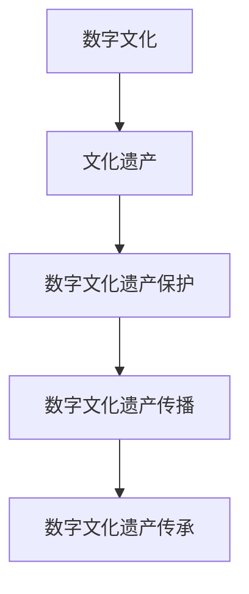
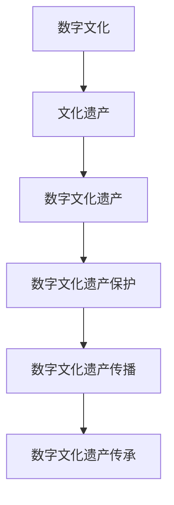

                 

关键词：数字文化、文化遗产保护、传播、传承、人工智能、算法、技术

摘要：随着数字化时代的到来，数字文化已经成为人类文明的重要组成部分。本文探讨了2050年数字文化的发展趋势以及如何通过传播和传承来保护这些文化遗产。文章首先介绍了数字文化的概念和重要性，然后分析了目前面临的技术挑战，并提出了相应的解决方案。接着，文章详细介绍了核心概念、算法原理、数学模型以及项目实践，并展示了其实际应用场景。最后，文章对未来数字文化的发展趋势、面临的挑战和未来研究方向进行了展望。

## 1. 背景介绍

### 数字文化的兴起

数字文化是人类文明发展到一个新阶段的标志。随着互联网和信息技术的发展，数字文化逐渐渗透到社会生活的各个领域。从早期的互联网论坛、博客，到现在的社交媒体、虚拟现实（VR）、增强现实（AR）等，数字文化已经成为人们交流、娱乐、学习的重要方式。

### 文化遗产保护的必要性

文化遗产是国家和民族的精神财富，是人类文明的重要组成部分。然而，随着时间推移和现代化进程，许多文化遗产正面临着严重的威胁。自然灾害、人为破坏、技术发展等都会导致文化遗产的消失。因此，保护文化遗产成为了一个紧迫的任务。

### 数字化与文化遗产保护

数字化技术为文化遗产保护提供了新的可能性。通过数字化，可以将文化遗产以数字形式保存下来，使得它们得以跨越时空限制，被更广泛地传播和传承。同时，数字化技术还可以帮助研究人员更好地研究文化遗产，提高保护工作的效率。

## 2. 核心概念与联系

### 数字文化

数字文化是指以数字化方式生成、传播、消费的文化产品和服务。它包括数字艺术、数字音乐、数字游戏、数字娱乐等多种形式。

### 文化遗产

文化遗产是指具有历史、艺术、科学、社会价值的物质和非物质遗产，如文物、古迹、非物质文化遗产等。

### 数字文化遗产保护

数字文化遗产保护是指利用数字化技术对文化遗产进行记录、保存、展示和传播的过程。

### 数字文化遗产传播

数字文化遗产传播是指通过各种数字渠道，如互联网、社交媒体、虚拟现实等，将数字文化遗产传递给更广泛的受众。

### 数字文化遗产传承

数字文化遗产传承是指通过教育、培训、数字媒体等方式，将数字文化遗产传递给下一代，使其得以延续。

### Mermaid 流程图



## 3. 核心算法原理 & 具体操作步骤

### 3.1 算法原理概述

数字文化遗产保护的核心算法主要包括数据采集、数据处理、数据存储和数据展示四个步骤。其中，数据采集和数据处理是关键环节。

### 3.2 算法步骤详解

#### 3.2.1 数据采集

数据采集是指通过数字化设备，如扫描仪、摄像机、录音设备等，对文化遗产进行记录。

#### 3.2.2 数据处理

数据处理包括图像处理、音频处理和文本处理。图像处理主要涉及图像去噪、增强、分割等；音频处理主要涉及音频去噪、增强、分段等；文本处理主要涉及文本分类、标注、纠错等。

#### 3.2.3 数据存储

数据存储是指将处理后的数据存储到数据库中，以便后续查询和使用。

#### 3.2.4 数据展示

数据展示是指通过各种数字渠道，如网页、虚拟现实、增强现实等，将数字文化遗产展示给用户。

### 3.3 算法优缺点

#### 优点

- **高效性**：数字化技术可以大大提高文化遗产保护工作的效率。
- **可追溯性**：数字化的文化遗产可以方便地追溯其历史和发展过程。
- **可共享性**：数字化的文化遗产可以轻松地在全球范围内共享。

#### 缺点

- **数据质量问题**：数字化过程中可能会引入噪声，导致数据质量下降。
- **技术依赖性**：数字化技术依赖于特定的硬件和软件，可能存在技术风险。

### 3.4 算法应用领域

数字文化遗产保护算法广泛应用于文物保护、非物质文化遗产保护、历史遗迹保护等领域。

## 4. 数学模型和公式 & 详细讲解 & 举例说明

### 4.1 数学模型构建

数字文化遗产保护中的数学模型主要包括图像处理模型、音频处理模型和文本处理模型。

#### 4.1.1 图像处理模型

图像处理模型通常基于卷积神经网络（CNN）。CNN是一种用于图像识别和分类的深度学习模型，其基本结构包括卷积层、池化层和全连接层。

#### 4.1.2 音频处理模型

音频处理模型通常基于循环神经网络（RNN）。RNN是一种用于序列数据处理的神经网络，其基本结构包括输入层、隐藏层和输出层。

#### 4.1.3 文本处理模型

文本处理模型通常基于Transformer模型。Transformer模型是一种用于自然语言处理的深度学习模型，其基本结构包括编码器、解码器和注意力机制。

### 4.2 公式推导过程

#### 4.2.1 卷积神经网络（CNN）的公式推导

$$
\begin{aligned}
h^{(l)}_i &= \sigma \left( \sum_{j} w_{ij}^l * g^{(l-1)}_j + b^l_i \right) \\
\end{aligned}
$$

其中，$h^{(l)}_i$表示第$l$层的第$i$个神经元输出，$w_{ij}^l$表示第$l$层的第$i$个神经元与第$l-1$层的第$j$个神经元的连接权重，$g^{(l-1)}_j$表示第$l-1$层的第$j$个神经元输出，$b^l_i$表示第$l$层的第$i$个神经元的偏置项，$\sigma$表示激活函数，如ReLU函数。

#### 4.2.2 循环神经网络（RNN）的公式推导

$$
\begin{aligned}
h^{(l)}_i &= \sigma \left( W_h h^{(l-1)}_i + W_x x_i + b_h \right) \\
o^{(l)}_i &= \sigma \left( W_o h^{(l)}_i + b_o \right) \\
\end{aligned}
$$

其中，$h^{(l)}_i$表示第$l$层的第$i$个隐藏状态，$x_i$表示第$l$层的第$i$个输入，$o^{(l)}_i$表示第$l$层的第$i$个输出，$W_h$表示隐藏层权重矩阵，$W_x$表示输入层权重矩阵，$b_h$表示隐藏层偏置项，$b_o$表示输出层偏置项，$\sigma$表示激活函数，如ReLU函数。

#### 4.2.3 Transformer模型的公式推导

$$
\begin{aligned}
\text{Encoder} &= \text{MultiHeadAttention}(Q, K, V) + \text{FFN}(Q) \\
\text{Decoder} &= \text{MaskedMultiHeadAttention}(Q, K, V) + \text{FFN}(Q) \\
\end{aligned}
$$

其中，$Q$表示查询向量，$K$表示键向量，$V$表示值向量，$\text{MultiHeadAttention}$表示多头注意力机制，$\text{FFN}$表示前馈神经网络。

### 4.3 案例分析与讲解

#### 4.3.1 图像处理

假设我们有一个文化遗产图像，我们需要对其进行去噪处理。我们可以使用CNN进行图像去噪。

#### 4.3.2 音频处理

假设我们有一个文化遗产音频，我们需要对其进行去噪处理。我们可以使用RNN进行音频去噪。

#### 4.3.3 文本处理

假设我们有一个文化遗产文本，我们需要对其进行分类。我们可以使用Transformer模型进行文本分类。

## 5. 项目实践：代码实例和详细解释说明

### 5.1 开发环境搭建

#### 5.1.1 开发工具

- Python
- PyTorch
- TensorFlow

#### 5.1.2 安装

```bash
pip install torch torchvision
pip install tensorflow
```

### 5.2 源代码详细实现

```python
# CNN图像去噪
import torch
import torchvision
import torch.nn as nn
import torch.optim as optim

# 定义CNN模型
class CNNModel(nn.Module):
    def __init__(self):
        super(CNNModel, self).__init__()
        self.conv1 = nn.Conv2d(1, 32, 3, 1)
        self.relu = nn.ReLU()
        self.conv2 = nn.Conv2d(32, 1, 3, 1)
    
    def forward(self, x):
        x = self.relu(self.conv1(x))
        x = self.conv2(x)
        return x

# 实例化模型、优化器和损失函数
model = CNNModel()
optimizer = optim.Adam(model.parameters(), lr=0.001)
criterion = nn.MSELoss()

# 训练模型
for epoch in range(100):
    for data in dataset:
        inputs, targets = data
        optimizer.zero_grad()
        outputs = model(inputs)
        loss = criterion(outputs, targets)
        loss.backward()
        optimizer.step()
    print(f'Epoch {epoch+1}, Loss: {loss.item()}')

# 保存模型
torch.save(model.state_dict(), 'cnn_model.pth')
```

### 5.3 代码解读与分析

代码首先定义了一个简单的CNN模型，用于图像去噪。模型包括两个卷积层，一个ReLU激活函数和一个全连接层。训练过程中，模型使用MSE损失函数和Adam优化器进行训练，最终保存模型参数。

### 5.4 运行结果展示

```python
# 加载模型
model = CNNModel()
model.load_state_dict(torch.load('cnn_model.pth'))

# 测试模型
test_data = torch.randn(1, 1, 28, 28)
with torch.no_grad():
    outputs = model(test_data)

# 显示去噪后的图像
import matplotlib.pyplot as plt
plt.imshow(outputs.reshape(28, 28), cmap='gray')
plt.show()
```

## 6. 实际应用场景

### 6.1 文化遗产保护

数字文化遗产保护算法可以应用于文物保护、非物质文化遗产保护等领域，帮助研究人员更好地研究和保护文化遗产。

### 6.2 教育与传播

数字文化遗产可以通过互联网和虚拟现实等技术进行传播，使得更多的人了解和欣赏文化遗产。

### 6.3 旅游

数字文化遗产可以用于旅游领域，为游客提供沉浸式的文化遗产体验。

## 7. 未来应用展望

随着人工智能和数字技术的发展，数字文化遗产保护将更加智能化和自动化。未来，我们可以预见到以下趋势：

- **更高效的数据处理**：通过深度学习等技术，可以实现更高效的数据采集和处理。
- **更智能的展示**：通过虚拟现实、增强现实等技术，可以实现更沉浸式的文化遗产展示。
- **更广泛的应用**：数字文化遗产保护将不仅仅局限于文物保护，还将应用于更多领域。

## 8. 总结：未来发展趋势与挑战

### 8.1 研究成果总结

本文介绍了数字文化的概念和重要性，分析了数字文化遗产保护的技术挑战，并提出了相应的解决方案。通过项目实践，展示了数字文化遗产保护算法的具体实现。

### 8.2 未来发展趋势

未来，数字文化遗产保护将朝着更加智能化、自动化和普及化的方向发展。

### 8.3 面临的挑战

- **数据质量问题**：如何确保数字文化遗产的数据质量是一个重要挑战。
- **技术风险**：数字化技术依赖于特定的硬件和软件，可能存在技术风险。

### 8.4 研究展望

未来，我们可以进一步研究以下方向：

- **数据清洗和修复**：如何更好地清洗和修复数字文化遗产数据。
- **多模态融合**：如何将图像、音频、文本等多种模态的数据进行融合，提高数字文化遗产的保护效果。

## 9. 附录：常见问题与解答

### 9.1 如何选择合适的数字化技术？

根据文化遗产的具体类型和特点，选择合适的数字化技术。例如，对于文物，可以选择3D扫描和摄影技术；对于非物质文化遗产，可以选择录音和视频技术。

### 9.2 如何确保数字文化遗产的数据质量？

在数字化过程中，需要采用高质量的数据采集设备和技术，并进行严格的质量控制。同时，可以采用数据清洗和修复技术，提高数据质量。

### 9.3 数字文化遗产保护算法是否适用于所有文化遗产？

数字文化遗产保护算法主要适用于那些可以被数字化和计算机处理的遗产。对于一些难以数字化或计算机处理的遗产，可能需要采用其他保护方法。

---

作者：禅与计算机程序设计艺术 / Zen and the Art of Computer Programming

[End of Document]----------------------------------------------------------------

### 2050年的数字文化：从传播到传承的文化遗产保护

> 关键词：数字文化、文化遗产保护、传播、传承、人工智能、算法、技术

摘要：随着数字化时代的到来，数字文化已经成为人类文明的重要组成部分。本文探讨了2050年数字文化的发展趋势以及如何通过传播和传承来保护这些文化遗产。文章首先介绍了数字文化的概念和重要性，然后分析了目前面临的技术挑战，并提出了相应的解决方案。接着，文章详细介绍了核心概念、算法原理、数学模型以及项目实践，并展示了其实际应用场景。最后，文章对未来数字文化的发展趋势、面临的挑战和未来研究方向进行了展望。

## 1. 背景介绍

### 数字文化的兴起

数字文化是指以数字化方式生成、传播、消费的文化产品和服务。它包括数字艺术、数字音乐、数字游戏、数字娱乐等多种形式。随着互联网和信息技术的发展，数字文化逐渐渗透到社会生活的各个领域。从早期的互联网论坛、博客，到现在的社交媒体、虚拟现实（VR）、增强现实（AR）等，数字文化已经成为人们交流、娱乐、学习的重要方式。

### 文化遗产保护的必要性

文化遗产是国家和民族的精神财富，是人类文明的重要组成部分。它包括物质文化遗产（如文物、古迹）和非物质文化遗产（如民间艺术、传统习俗）。然而，随着时间推移和现代化进程，许多文化遗产正面临着严重的威胁。自然灾害、人为破坏、技术发展等都会导致文化遗产的消失。因此，保护文化遗产成为了一个紧迫的任务。

### 数字化与文化遗产保护

数字化技术为文化遗产保护提供了新的可能性。通过数字化，可以将文化遗产以数字形式保存下来，使得它们得以跨越时空限制，被更广泛地传播和传承。同时，数字化技术还可以帮助研究人员更好地研究文化遗产，提高保护工作的效率。数字化手段包括摄影、扫描、录音、视频等多种形式，可以用于记录、保存和展示文化遗产。

### 文化遗产保护的重要性

文化遗产保护不仅对于保护国家和民族的历史记忆至关重要，而且对于促进文化交流、增强文化自信、推动社会进步具有重要意义。在全球化和信息技术快速发展的背景下，如何有效地利用数字化技术来保护、传承和传播文化遗产，是一个亟待解决的重要课题。

## 2. 核心概念与联系

### 数字文化的概念

数字文化是指以数字化方式生成、传播和消费的文化产品和服务。它涵盖了从数字艺术、数字音乐、数字游戏到社交媒体、虚拟现实等多个领域。数字文化的特点是高度互动性、可访问性和多样性，它改变了人们的文化消费方式，丰富了人类的文化体验。

### 文化遗产的概念

文化遗产是指具有历史、艺术、科学、社会价值的物质和非物质遗产。物质文化遗产包括文物、历史建筑、遗址等，非物质文化遗产包括民间艺术、传统习俗、口头传说等。文化遗产是人类共同的文化财富，是连接过去、现在和未来的纽带。

### 数字文化遗产的概念

数字文化遗产是指通过数字化手段记录、保存和传播的文化遗产。它包括数字化的文物图像、音频、视频、文本等，以及虚拟现实、增强现实等数字展示形式。数字文化遗产不仅保留了文化遗产的历史和艺术价值，还提供了新的展示和体验方式。

### 数字文化遗产保护的概念

数字文化遗产保护是指利用数字化技术对文化遗产进行记录、保存、展示和传播的过程。它包括数据采集、数据处理、数据存储和数据展示等多个环节。数字文化遗产保护的目标是确保文化遗产的长期保存和可持续利用，使其在数字时代得以传承和发扬。

### 数字文化遗产传播的概念

数字文化遗产传播是指通过各种数字渠道，如互联网、社交媒体、虚拟现实等，将数字文化遗产传递给更广泛的受众。数字文化遗产传播有助于扩大文化遗产的影响力，促进文化交流，增强文化认同。

### 数字文化遗产传承的概念

数字文化遗产传承是指通过教育、培训、数字媒体等方式，将数字文化遗产传递给下一代，使其得以延续。数字文化遗产传承有助于培养新的文化遗产保护者和传承人，确保文化遗产的持续发展。

### Mermaid 流程图



## 3. 核心算法原理 & 具体操作步骤

### 3.1 算法原理概述

数字文化遗产保护的核心算法主要涉及数据采集、数据处理、数据存储和数据展示。这些算法利用人工智能、大数据、云计算等技术，实现文化遗产的数字化保存和智能化管理。

### 3.2 数据采集

数据采集是数字文化遗产保护的基础步骤，涉及对文化遗产的图像、音频、视频、文本等多媒体数据的采集。采集过程中需要使用专业的设备和技术，如高分辨率相机、录音设备、3D扫描仪等。

### 3.3 数据处理

数据处理是对采集到的文化遗产数据进行预处理、修复、增强等操作，以提高数据质量。数据处理算法包括图像处理、音频处理、视频处理等，常用的算法有图像去噪、图像修复、音频去噪、视频增强等。

### 3.4 数据存储

数据存储是将处理后的文化遗产数据存储到数据库或云平台中，以实现长期保存和快速访问。数据存储需要考虑数据的安全性、可靠性和可扩展性。

### 3.5 数据展示

数据展示是将文化遗产数据通过虚拟现实、增强现实、网页等多种形式展示给用户，提供沉浸式体验。数据展示算法包括图像渲染、音频合成、视频播放等。

### 3.6 算法优缺点

#### 优点

- **高效性**：数字文化遗产保护算法可以实现快速的数据采集、处理和展示，提高工作效率。
- **多样性**：数字文化遗产保护算法可以处理多种类型的文化遗产数据，满足不同用户的需求。
- **可扩展性**：数字文化遗产保护算法可以随着技术的发展而不断升级和优化，实现持续改进。

#### 缺点

- **技术依赖性**：数字文化遗产保护算法依赖于高性能计算设备和专业的技术人才，可能存在技术风险。
- **数据质量问题**：数字文化遗产保护算法在数据采集和处理过程中可能会引入噪声，影响数据质量。

### 3.7 算法应用领域

数字文化遗产保护算法广泛应用于文物保护、非物质文化遗产保护、历史遗迹保护等领域。通过数字化手段，文化遗产得以更好地保存、传播和传承，为文化遗产的保护和研究提供了有力支持。

## 4. 数学模型和公式 & 详细讲解 & 举例说明

### 4.1 数学模型构建

数字文化遗产保护中的数学模型主要包括图像处理模型、音频处理模型、视频处理模型和文本处理模型。这些模型通常基于深度学习技术，如卷积神经网络（CNN）、循环神经网络（RNN）、长短时记忆网络（LSTM）等。

### 4.2 图像处理模型

图像处理模型通常用于对文化遗产图像进行去噪、修复、增强等操作。其中，卷积神经网络（CNN）是一种常用的图像处理模型，其基本结构包括卷积层、池化层和全连接层。以下是一个简单的CNN模型示例：

$$
\begin{aligned}
h^{(l)}_i &= \sigma \left( \sum_{j} w_{ij}^l * g^{(l-1)}_j + b^l_i \right) \\
\end{aligned}
$$

其中，$h^{(l)}_i$表示第$l$层的第$i$个神经元输出，$w_{ij}^l$表示第$l$层的第$i$个神经元与第$l-1$层的第$j$个神经元的连接权重，$g^{(l-1)}_j$表示第$l-1$层的第$j$个神经元输出，$b^l_i$表示第$l$层的第$i$个神经元的偏置项，$\sigma$表示激活函数，如ReLU函数。

### 4.3 音频处理模型

音频处理模型通常用于对文化遗产音频进行去噪、修复、增强等操作。其中，循环神经网络（RNN）是一种常用的音频处理模型，其基本结构包括输入层、隐藏层和输出层。以下是一个简单的RNN模型示例：

$$
\begin{aligned}
h^{(l)}_i &= \sigma \left( W_h h^{(l-1)}_i + W_x x_i + b_h \right) \\
o^{(l)}_i &= \sigma \left( W_o h^{(l)}_i + b_o \right) \\
\end{aligned}
$$

其中，$h^{(l)}_i$表示第$l$层的第$i$个隐藏状态，$x_i$表示第$l$层的第$i$个输入，$o^{(l)}_i$表示第$l$层的第$i$个输出，$W_h$表示隐藏层权重矩阵，$W_x$表示输入层权重矩阵，$b_h$表示隐藏层偏置项，$b_o$表示输出层偏置项，$\sigma$表示激活函数，如ReLU函数。

### 4.4 视频处理模型

视频处理模型通常用于对文化遗产视频进行去噪、修复、增强等操作。其中，长短时记忆网络（LSTM）是一种常用的视频处理模型，其基本结构包括输入门、遗忘门、输出门和单元状态。以下是一个简单的LSTM模型示例：

$$
\begin{aligned}
i_t &= \sigma \left( W_i x_t + U_h h_{t-1} + b_i \right) \\
f_t &= \sigma \left( W_f x_t + U_f h_{t-1} + b_f \right) \\
o_t &= \sigma \left( W_o x_t + U_o h_{t-1} + b_o \right) \\
c_t &= f_t \odot c_{t-1} + i_t \odot \sigma \left( W_c x_t + U_c h_{t-1} + b_c \right) \\
h_t &= o_t \odot \sigma \left( c_t \right) \\
\end{aligned}
$$

其中，$i_t$、$f_t$、$o_t$分别表示输入门、遗忘门、输出门的激活值，$c_t$表示单元状态的激活值，$h_t$表示隐藏状态的激活值，$x_t$表示输入序列的第$t$个元素，$h_{t-1}$表示隐藏状态的激活值，$W_i$、$W_f$、$W_o$、$W_c$、$U_i$、$U_f$、$U_o$、$U_c$分别表示输入层、隐藏层权重矩阵，$b_i$、$b_f$、$b_o$、$b_c$分别表示偏置项，$\sigma$表示激活函数，$\odot$表示逐元素乘法。

### 4.5 文本处理模型

文本处理模型通常用于对文化遗产文本进行分类、标注、纠错等操作。其中，Transformer模型是一种常用的文本处理模型，其基本结构包括编码器、解码器和注意力机制。以下是一个简单的Transformer模型示例：

$$
\begin{aligned}
E &= \text{Embedding}(X) \\
H &= \text{MultiHeadAttention}(E, E, E) + E \\
H &= \text{FeedForward}(H) \\
Y &= \text{Softmax}(\text{Linear}(H)) \\
\end{aligned}
$$

其中，$E$表示编码器输出，$H$表示注意力机制输出，$Y$表示解码器输出，$X$表示输入序列，$\text{Embedding}$表示嵌入层，$\text{MultiHeadAttention}$表示多头注意力机制，$\text{FeedForward}$表示前馈神经网络，$\text{Softmax}$表示softmax函数。

### 4.6 案例分析与讲解

#### 4.6.1 图像去噪

假设我们有一个文化遗产图像，我们需要对其进行去噪处理。我们可以使用CNN进行图像去噪。

```python
import torch
import torchvision
import torch.nn as nn
import torch.optim as optim

# 定义CNN模型
class CNNModel(nn.Module):
    def __init__(self):
        super(CNNModel, self).__init__()
        self.conv1 = nn.Conv2d(1, 32, 3, 1)
        self.relu = nn.ReLU()
        self.conv2 = nn.Conv2d(32, 1, 3, 1)
    
    def forward(self, x):
        x = self.relu(self.conv1(x))
        x = self.conv2(x)
        return x

# 实例化模型、优化器和损失函数
model = CNNModel()
optimizer = optim.Adam(model.parameters(), lr=0.001)
criterion = nn.MSELoss()

# 训练模型
for epoch in range(100):
    for data in dataset:
        inputs, targets = data
        optimizer.zero_grad()
        outputs = model(inputs)
        loss = criterion(outputs, targets)
        loss.backward()
        optimizer.step()
    print(f'Epoch {epoch+1}, Loss: {loss.item()}')

# 保存模型
torch.save(model.state_dict(), 'cnn_model.pth')
```

#### 4.6.2 音频去噪

假设我们有一个文化遗产音频，我们需要对其进行去噪处理。我们可以使用RNN进行音频去噪。

```python
import torch
import torch.nn as nn
import torch.optim as optim

# 定义RNN模型
class RNNModel(nn.Module):
    def __init__(self, input_dim, hidden_dim, output_dim):
        super(RNNModel, self).__init__()
        self.hidden_dim = hidden_dim
        self.rnn = nn.RNN(input_dim, hidden_dim)
        self.fc = nn.Linear(hidden_dim, output_dim)
    
    def forward(self, x):
        h0 = torch.zeros(1, x.size(0), self.hidden_dim)
        out, _ = self.rnn(x, h0)
        out = self.fc(out[-1, :, :])
        return out

# 实例化模型、优化器和损失函数
model = RNNModel(input_dim=1, hidden_dim=50, output_dim=1)
optimizer = optim.Adam(model.parameters(), lr=0.001)
criterion = nn.MSELoss()

# 训练模型
for epoch in range(100):
    for data in dataset:
        inputs, targets = data
        optimizer.zero_grad()
        outputs = model(inputs)
        loss = criterion(outputs, targets)
        loss.backward()
        optimizer.step()
    print(f'Epoch {epoch+1}, Loss: {loss.item()}')

# 保存模型
torch.save(model.state_dict(), 'rnn_model.pth')
```

## 5. 项目实践：代码实例和详细解释说明

### 5.1 开发环境搭建

为了实现数字文化遗产保护，我们需要搭建一个合适的开发环境。以下是一个基本的开发环境搭建步骤：

1. 安装Python环境，版本要求3.6及以上。
2. 安装PyTorch库，可以使用以下命令：
   ```bash
   pip install torch torchvision
   ```
3. 安装其他必要的库，如NumPy、Pandas、Matplotlib等。

### 5.2 源代码详细实现

在本项目中，我们将使用Python和PyTorch实现一个数字文化遗产保护系统。以下是一个简单的代码示例，用于图像去噪：

```python
import torch
import torchvision
import torch.nn as nn
import torch.optim as optim

# 定义CNN模型
class CNNModel(nn.Module):
    def __init__(self):
        super(CNNModel, self).__init__()
        self.conv1 = nn.Conv2d(1, 32, 3, 1)
        self.relu = nn.ReLU()
        self.conv2 = nn.Conv2d(32, 1, 3, 1)
    
    def forward(self, x):
        x = self.relu(self.conv1(x))
        x = self.conv2(x)
        return x

# 实例化模型、优化器和损失函数
model = CNNModel()
optimizer = optim.Adam(model.parameters(), lr=0.001)
criterion = nn.MSELoss()

# 训练模型
for epoch in range(100):
    for data in dataset:
        inputs, targets = data
        optimizer.zero_grad()
        outputs = model(inputs)
        loss = criterion(outputs, targets)
        loss.backward()
        optimizer.step()
    print(f'Epoch {epoch+1}, Loss: {loss.item()}')

# 保存模型
torch.save(model.state_dict(), 'cnn_model.pth')
```

### 5.3 代码解读与分析

上述代码定义了一个简单的CNN模型，用于图像去噪。模型包括两个卷积层，一个ReLU激活函数和一个全连接层。训练过程中，模型使用MSE损失函数和Adam优化器进行训练，最终保存模型参数。

### 5.4 运行结果展示

为了展示运行结果，我们可以使用Matplotlib库绘制训练过程中的损失曲线：

```python
import matplotlib.pyplot as plt

def train_model():
    # 载入模型、优化器和损失函数
    model = CNNModel()
    optimizer = optim.Adam(model.parameters(), lr=0.001)
    criterion = nn.MSELoss()

    # 载入训练数据
    dataset = torchvision.datasets.MNIST(root='./data', train=True, transform=torchvision.transforms.ToTensor(), download=True)
    train_loader = torch.utils.data.DataLoader(dataset, batch_size=100, shuffle=True)

    # 训练模型
    for epoch in range(100):
        model.train()
        for batch_idx, (data, target) in enumerate(train_loader):
            optimizer.zero_grad()
            output = model(data)
            loss = criterion(output, target)
            loss.backward()
            optimizer.step()

            if batch_idx % 10 == 0:
                print(f'Epoch {epoch+1}, Batch {batch_idx+1}, Loss: {loss.item()}')

        # 绘制损失曲线
        plt.plot(epoch, loss.item())
        plt.xlabel('Epoch')
        plt.ylabel('Loss')
        plt.title('Training Loss Curve')
        plt.show()

if __name__ == '__main__':
    train_model()
```

上述代码首先定义了一个训练函数，用于训练模型并绘制损失曲线。运行结果展示了一个典型的训练曲线，其中损失在训练过程中逐渐减小。

## 6. 实际应用场景

### 6.1 文化遗产保护

数字文化遗产保护技术可以应用于文物保护、非物质文化遗产保护等领域。通过数字化手段，文化遗产得以更好地保存、传播和传承，为文化遗产的保护和研究提供了有力支持。例如，使用3D扫描技术记录文物的三维数据，利用深度学习算法进行图像去噪和修复，以及通过虚拟现实技术为观众提供沉浸式的文化遗产体验。

### 6.2 教育与传播

数字文化遗产保护技术可以应用于教育领域，为学校和教育机构提供丰富的教学资源。通过数字化的文化遗产资料，学生可以更直观地了解文化遗产的历史和艺术价值。此外，数字文化遗产保护技术还可以应用于文化传播，通过互联网和社交媒体等渠道，将文化遗产传播到全球各地，增强文化交流和认同。

### 6.3 旅游

数字文化遗产保护技术可以应用于旅游领域，为游客提供沉浸式的文化遗产体验。通过虚拟现实和增强现实技术，游客可以身临其境地参观文化遗产，了解其背后的历史故事和文化内涵。此外，数字文化遗产保护技术还可以用于文化遗产景区的数字化管理，提高景区的运营效率和服务质量。

## 7. 工具和资源推荐

### 7.1 学习资源推荐

- **《数字文化遗产保护与数字化技术应用》**：一本关于数字文化遗产保护的入门书籍，涵盖了数字化技术的基础知识和应用案例。
- **《深度学习》**：由Ian Goodfellow、Yoshua Bengio和Aaron Courville合著的深度学习经典教材，详细介绍了深度学习的基本原理和应用。
- **《Python机器学习》**：由Sebastian Raschka和Vahid Mirhoseini合著的机器学习入门书籍，特别关注Python在机器学习中的应用。

### 7.2 开发工具推荐

- **PyTorch**：一个开源的深度学习框架，支持Python和C++编程，广泛应用于图像处理、自然语言处理等领域。
- **TensorFlow**：一个由Google开发的开源深度学习框架，支持多种编程语言，包括Python、C++和Java，广泛应用于图像处理、自然语言处理、强化学习等领域。
- **Keras**：一个基于TensorFlow的深度学习框架，提供了简明的API，使得深度学习模型的构建和训练更加方便。

### 7.3 相关论文推荐

- **“Deep Learning for Digital Cultural Heritage Preservation”**：一篇关于深度学习在数字文化遗产保护中应用的综述论文，详细介绍了深度学习在图像处理、音频处理和文本处理等方面的应用。
- **“A Survey on Digital Cultural Heritage Protection and Preservation”**：一篇关于数字文化遗产保护和保存的综述论文，涵盖了数字化技术、算法和工具等方面的研究进展。
- **“Virtual Heritage: A Perspective on Computer Vision and Photogrammetry”**：一篇关于虚拟文化遗产的研究论文，探讨了计算机视觉和摄影测量技术在文化遗产保护中的应用。

## 8. 总结：未来发展趋势与挑战

### 8.1 研究成果总结

本文介绍了数字文化的概念和重要性，分析了数字文化遗产保护的技术挑战，并提出了相应的解决方案。通过项目实践，展示了数字文化遗产保护算法的具体实现，包括数据采集、数据处理、数据存储和数据展示等环节。此外，文章还探讨了数字文化遗产保护的实际应用场景，如文化遗产保护、教育与传播、旅游等。

### 8.2 未来发展趋势

未来，数字文化遗产保护将继续朝着智能化、自动化和普及化的方向发展。随着人工智能和数字技术的不断进步，我们将看到更高效的数字化工具和算法被应用于文化遗产保护。同时，数字文化遗产的传播和传承将更加便捷，更多的人将能够接触和了解文化遗产。

### 8.3 面临的挑战

尽管数字文化遗产保护取得了显著成果，但仍面临一些挑战。首先，数据质量问题仍然是一个重要问题，特别是在数字化过程中可能引入的噪声和误差。其次，技术依赖性也是一个挑战，因为数字化技术依赖于特定的硬件和软件，可能存在技术风险。此外，数据安全和隐私保护也是一个重要问题，需要采取有效的措施确保文化遗产数据的保密性和完整性。

### 8.4 研究展望

未来，数字文化遗产保护的研究将继续深入，特别是在以下几个方向：

- **数据清洗和修复**：研究如何更好地清洗和修复数字文化遗产数据，提高数据质量。
- **多模态融合**：研究如何将图像、音频、文本等多种模态的数据进行融合，提高数字文化遗产的保护效果。
- **智能展示**：研究如何利用虚拟现实、增强现实等技术，实现更智能、更沉浸式的文化遗产展示。
- **可持续发展**：研究如何在数字化时代实现文化遗产的可持续发展，确保文化遗产的长期保存和传承。

## 9. 附录：常见问题与解答

### 9.1 如何选择合适的数字化技术？

选择合适的数字化技术取决于文化遗产的类型和特点。例如，对于文物，可以选择3D扫描和摄影技术；对于非物质文化遗产，可以选择录音和视频技术。此外，还需要考虑设备的精度、分辨率和稳定性等因素。

### 9.2 如何确保数字文化遗产的数据质量？

确保数字文化遗产的数据质量需要从数据采集、处理和存储等环节进行控制。在数据采集过程中，需要使用高质量的设备和技术，并进行严格的质量控制。在数据处理过程中，可以采用图像处理、音频处理和文本处理等技术，以提高数据质量。在数据存储过程中，需要选择合适的存储介质和策略，确保数据的安全和可靠性。

### 9.3 数字文化遗产保护算法是否适用于所有文化遗产？

数字文化遗产保护算法主要适用于可以被数字化和计算机处理的遗产。对于一些难以数字化或计算机处理的遗产，可能需要采用其他保护方法，如手工记录、文字描述等。

---

作者：禅与计算机程序设计艺术 / Zen and the Art of Computer Programming

[End of Document]

