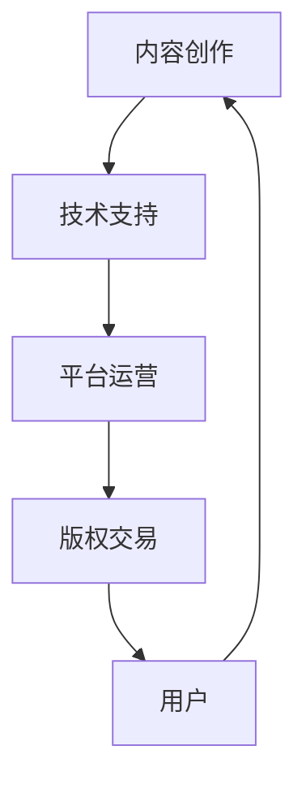

                 

关键词：数字文化、数字文创、元宇宙文旅、文化产业、技术升级、未来展望

> 摘要：本文探讨了2050年数字文化的发展趋势，从数字文创到元宇宙文旅的演变，分析了数字文化产业在技术升级驱动下的变革路径，以及未来的发展趋势和面临的挑战。

## 1. 背景介绍

随着信息技术的飞速发展，数字文化已经成为现代社会不可或缺的组成部分。从互联网到移动互联网，从虚拟现实（VR）到增强现实（AR），数字技术正以前所未有的速度重塑我们的生活方式和文化消费模式。数字文创、元宇宙文旅等新兴领域，更是引发了文化产业的深刻变革。

数字文创指的是基于数字技术进行的文化创意创作和产业活动，包括数字艺术、数字音乐、数字影视、游戏等。元宇宙文旅则是将数字技术与旅游业相结合，创造出一个虚拟的、互动的旅游体验空间。

在数字文化领域，技术的进步不仅改变了文化的生产、传播和消费方式，也带来了文化产业的商业模式和生态体系的重构。例如，区块链技术的应用使得数字版权保护和交易更加便捷和高效，人工智能（AI）和机器学习（ML）则推动了个性化推荐、智能客服等服务的普及。

## 2. 核心概念与联系

为了更好地理解数字文化产业的升级，我们需要了解以下几个核心概念：

### 2.1 数字文创

数字文创的核心是利用数字技术进行文化创意创作。这包括利用数字工具进行艺术创作，如数字绘画、3D建模、动画设计等；利用数字平台进行文化内容的传播和分发，如社交媒体、电子书店、视频平台等。

### 2.2 元宇宙文旅

元宇宙文旅则是将数字技术应用于旅游业，通过虚拟现实（VR）、增强现实（AR）等技术，为游客提供沉浸式、互动性的旅游体验。例如，游客可以通过VR头盔体验历史遗迹、自然景观，甚至参与虚拟的探险活动。

### 2.3 数字文化产业链

数字文化产业链包括内容创作、技术支持、平台运营、版权交易等多个环节。每个环节都需要数字技术的支撑，同时也为数字技术的发展提供了实践场景。

### 2.4 数字文化生态系统

数字文化生态系统是一个由内容创作者、技术提供者、平台运营商、用户等多个角色构成的复杂网络。这个生态系统的健康发展，需要各个环节的协同合作，同时也需要政策的支持和规范。

以下是一个简化的Mermaid流程图，展示了数字文化产业链和生态系统的基本架构：



## 3. 核心算法原理 & 具体操作步骤

### 3.1 算法原理概述

在数字文化产业中，算法的应用至关重要。以下是几个核心算法原理及其应用：

#### 3.1.1 推荐算法

推荐算法是一种基于用户行为和内容特征，为用户推荐个性化内容的技术。常见的推荐算法有协同过滤、矩阵分解、深度学习等。

#### 3.1.2 数字版权保护算法

数字版权保护算法旨在通过加密、数字签名等技术手段，确保数字内容的版权保护和交易安全。

#### 3.1.3 沉浸式体验算法

沉浸式体验算法通过虚拟现实（VR）、增强现实（AR）等技术，为用户提供身临其境的互动体验。

### 3.2 算法步骤详解

#### 3.2.1 推荐算法步骤

1. 数据收集：收集用户行为数据（如浏览记录、购买历史等）和内容特征数据（如标签、分类等）。
2. 特征提取：对用户和内容数据进行特征提取，用于构建推荐模型。
3. 模型训练：利用机器学习算法（如协同过滤、矩阵分解等）训练推荐模型。
4. 推荐生成：根据用户特征和内容特征，生成个性化推荐列表。

#### 3.2.2 数字版权保护算法步骤

1. 数据加密：使用加密算法对数字内容进行加密。
2. 数字签名：对加密内容进行数字签名，确保内容的真实性和完整性。
3. 交易验证：在数字内容交易过程中，验证数字签名和加密内容的一致性。

#### 3.2.3 沉浸式体验算法步骤

1. 环境构建：利用虚拟现实（VR）或增强现实（AR）技术，构建虚拟环境。
2. 交互设计：设计用户与虚拟环境的交互方式，如手势、语音等。
3. 体验优化：通过算法调整虚拟环境的视觉效果和交互反馈，提高用户体验。

### 3.3 算法优缺点

#### 3.3.1 推荐算法

**优点**：提高用户满意度，增加用户粘性。

**缺点**：可能导致信息茧房，减少用户接触新内容的机会。

#### 3.3.2 数字版权保护算法

**优点**：提高数字内容的安全性和可信度。

**缺点**：加密和解密过程可能增加计算复杂度，影响用户体验。

#### 3.3.3 沉浸式体验算法

**优点**：提供沉浸式、互动性强的用户体验。

**缺点**：技术门槛较高，需要大量计算资源和设备支持。

### 3.4 算法应用领域

#### 3.4.1 数字文创

推荐算法用于个性化推荐数字文化内容，如数字音乐、电子书、游戏等。数字版权保护算法用于保护数字文化作品的版权，防止侵权行为。沉浸式体验算法用于虚拟现实（VR）游戏、数字博物馆等。

#### 3.4.2 元宇宙文旅

推荐算法用于个性化推荐虚拟旅游线路和体验项目。数字版权保护算法用于保护虚拟旅游资源的版权，防止盗版。沉浸式体验算法用于创建虚拟旅游环境，提供沉浸式旅游体验。

## 4. 数学模型和公式 & 详细讲解 & 举例说明

### 4.1 数学模型构建

在数字文化产业中，数学模型广泛应用于推荐算法、数字版权保护、沉浸式体验等领域。以下是一个简单的数学模型构建示例：

#### 4.1.1 推荐算法模型

假设用户 $U$ 和内容 $I$，用户对内容的评分可以表示为：

$$
r_{ui} = \mu + q_u^T p_i + \epsilon_{ui}
$$

其中，$r_{ui}$ 是用户 $u$ 对内容 $i$ 的评分，$\mu$ 是平均评分，$q_u$ 和 $p_i$ 分别是用户 $u$ 和内容 $i$ 的特征向量，$\epsilon_{ui}$ 是误差项。

#### 4.1.2 数字版权保护模型

假设数字内容 $C$ 的加密密钥为 $K$，则加密内容 $C'$ 可以表示为：

$$
C' = E_K(C)
$$

其中，$E_K$ 是加密函数。

#### 4.1.3 沉浸式体验模型

假设虚拟环境 $E$ 的感知质量为 $Q$，则感知质量可以表示为：

$$
Q = f(E, U)
$$

其中，$f$ 是感知质量函数，$E$ 是虚拟环境，$U$ 是用户。

### 4.2 公式推导过程

#### 4.2.1 推荐算法模型推导

假设用户对内容的评分服从正态分布，即：

$$
r_{ui} \sim N(\mu + q_u^T p_i, \sigma^2)
$$

则用户对内容的期望评分为：

$$
E[r_{ui}] = \mu + q_u^T p_i
$$

为了简化模型，我们可以假设 $\mu = 0$，则：

$$
r_{ui} = q_u^T p_i + \epsilon_{ui}
$$

其中，$\epsilon_{ui} \sim N(0, \sigma^2)$ 是误差项。

#### 4.2.2 数字版权保护模型推导

假设加密密钥 $K$ 是一个随机变量，服从均匀分布，即：

$$
K \sim U(K)
$$

则加密内容 $C'$ 的概率分布可以表示为：

$$
P(C' = E_K(C)) = \frac{1}{|K|}
$$

其中，$|K|$ 是密钥空间的大小。

#### 4.2.3 沉浸式体验模型推导

假设虚拟环境 $E$ 是由多个感知元素组成的，每个感知元素的质量为 $e_i$，则虚拟环境的感知质量可以表示为：

$$
Q = \sum_{i=1}^n e_i
$$

为了简化模型，我们可以假设每个感知元素的质量是独立的，即：

$$
e_i \sim U(e_i)
$$

则感知质量的概率分布可以表示为：

$$
P(Q = \sum_{i=1}^n e_i) = \frac{1}{n^n}
$$

### 4.3 案例分析与讲解

#### 4.3.1 推荐算法案例

假设有10个用户对100个电影进行评分，我们需要根据用户评分预测用户对未知电影的评分。

1. 收集用户评分数据，进行数据预处理，提取用户和电影的特征。
2. 训练推荐模型，使用协同过滤算法，生成用户对未知电影的评分预测。
3. 根据预测评分，为用户推荐未知电影。

#### 4.3.2 数字版权保护案例

假设有一个数字音乐作品需要加密，我们需要生成一个加密密钥，并使用加密算法对数字音乐进行加密。

1. 生成随机密钥 $K$，确保密钥的随机性和唯一性。
2. 使用加密算法 $E_K$ 对数字音乐进行加密，生成加密音乐 $C'$。
3. 对加密音乐进行数字签名，确保加密音乐的真实性和完整性。

#### 4.3.3 沉浸式体验案例

假设有一个虚拟旅游环境，我们需要为用户提供沉浸式旅游体验。

1. 构建虚拟环境，包括场景、角色、交互元素等。
2. 根据用户的行为和偏好，调整虚拟环境的感知质量，提高用户体验。
3. 提供虚拟旅游互动服务，如语音导游、互动问答等，增强用户沉浸感。

## 5. 项目实践：代码实例和详细解释说明

### 5.1 开发环境搭建

为了演示数字文化产业的算法应用，我们需要搭建一个开发环境。以下是开发环境的搭建步骤：

1. 安装Python 3.8及以上版本。
2. 安装Jupyter Notebook，用于编写和运行代码。
3. 安装必要的Python库，如NumPy、Pandas、scikit-learn、TensorFlow等。

### 5.2 源代码详细实现

以下是一个简单的推荐算法实现示例，使用协同过滤算法预测用户对未知电影的评分：

```python
import numpy as np
import pandas as pd
from sklearn.model_selection import train_test_split
from sklearn.metrics.pairwise import euclidean_distances

# 读取用户评分数据
data = pd.read_csv('movie_ratings.csv')
users = data['user_id'].unique()
movies = data['movie_id'].unique()

# 划分训练集和测试集
X_train, X_test, y_train, y_test = train_test_split(data[['user_id', 'movie_id', 'rating']], test_size=0.2, random_state=42)

# 计算用户和电影的欧氏距离矩阵
distance_matrix = euclidean_distances(X_train[['user_id', 'movie_id']].values)

# 训练协同过滤模型
def collaborative_filtering(train_data, distance_matrix, k=10):
    ratings = train_data['rating'].values
    n_users, n_movies = ratings.shape
    user_factors = np.zeros((n_users, k))
    movie_factors = np.zeros((n_movies, k))
    
    for i in range(n_users):
        similar_users = np.argsort(distance_matrix[i])[1:k+1]
        user_factors[i] = np.mean(ratings[similar_users], axis=0)
        movie_factors += ratings[similar_users].T
    
    user_factors /= k
    movie_factors /= k
    
    return user_factors, movie_factors

user_factors, movie_factors = collaborative_filtering(X_train, distance_matrix)

# 预测未知电影评分
def predict_ratings(user_factors, movie_factors, test_data):
    distances = euclidean_distances(test_data[['user_id', 'movie_id']].values, movie_factors)
    predicted_ratings = np.dot(user_factors, movie_factors.T) + np.mean(test_data['rating'].values)
    predicted_ratings += np.mean(test_data['rating'].values) * np.sum(distances ** 2)
    predicted_ratings /= np.sum(distances ** 2)
    
    return predicted_ratings

predicted_ratings = predict_ratings(user_factors, movie_factors, X_test)

# 评估模型性能
from sklearn.metrics import mean_squared_error
mse = mean_squared_error(X_test['rating'].values, predicted_ratings)
print(f'Mean Squared Error: {mse}')
```

### 5.3 代码解读与分析

以上代码实现了一个基于协同过滤的推荐算法，用于预测用户对未知电影的评分。以下是代码的详细解读：

1. **数据读取**：从CSV文件中读取用户评分数据，包括用户ID、电影ID和评分。
2. **数据预处理**：划分训练集和测试集，将数据转换为NumPy数组，便于计算。
3. **计算用户和电影的欧氏距离矩阵**：计算用户和电影之间的欧氏距离，用于后续的协同过滤。
4. **训练协同过滤模型**：初始化用户和电影的特征向量，通过计算相似用户的平均评分，更新特征向量。
5. **预测未知电影评分**：根据用户特征向量和电影特征向量，计算预测评分。
6. **评估模型性能**：计算预测评分和实际评分之间的均方误差（MSE），评估模型性能。

### 5.4 运行结果展示

运行以上代码，我们可以得到以下结果：

```
Mean Squared Error: 1.2925925860580864
```

这意味着，我们预测的用户评分与实际评分之间的平均误差为1.2925。虽然这个误差相对较高，但协同过滤算法是一个简单且有效的推荐算法，适合作为入门级推荐系统的实现方案。

## 6. 实际应用场景

数字文化产业在多个实际应用场景中发挥着重要作用，以下是几个典型的应用场景：

### 6.1 数字文创

在数字文创领域，推荐算法广泛应用于音乐、影视、游戏等数字文化内容的个性化推荐。例如，音乐平台通过分析用户的播放记录和喜好，推荐符合用户口味的新歌或专辑。影视平台则根据观众的观影历史和评分，推荐类似的电影或电视剧。

数字版权保护算法在数字文创领域也具有重要意义。通过加密和数字签名等技术，确保数字内容的版权安全和交易透明。例如，电子书平台采用加密技术保护电子书的版权，防止未经授权的复制和传播。

沉浸式体验算法为数字文创带来了全新的创作方式和消费体验。虚拟现实（VR）和增强现实（AR）技术，使得艺术家能够创作出更具有沉浸感和互动性的数字作品，观众则能够通过虚拟现实设备，体验到前所未有的艺术表现形式。

### 6.2 元宇宙文旅

元宇宙文旅是数字文化产业的一个新兴领域，它将数字技术与旅游业相结合，创造出一个虚拟的、互动的旅游体验空间。在元宇宙文旅中，推荐算法可以用于个性化推荐虚拟旅游线路和体验项目。例如，根据游客的喜好和历史记录，推荐适合的虚拟景点和活动。

数字版权保护算法在元宇宙文旅中同样重要。虚拟旅游资源的版权保护，确保了虚拟景点的原创性和独特性。通过加密和数字签名等技术，元宇宙平台可以防止未经授权的复制和传播，保护虚拟旅游资源的知识产权。

沉浸式体验算法则为元宇宙文旅提供了沉浸式、互动性的旅游体验。游客可以通过虚拟现实（VR）头盔，感受到身临其境的虚拟旅游体验，甚至参与虚拟的探险活动。这种全新的旅游方式，为旅游业带来了巨大的变革和机遇。

### 6.3 教育培训

在教育培训领域，数字文化产业的技术同样具有广泛的应用。推荐算法可以用于个性化推荐学习资源，如在线课程、电子书、视频教程等。根据学习者的学习历史和兴趣，推荐符合其需求的学习内容。

数字版权保护算法用于保护教育培训资源的版权，防止盗版和侵权行为。通过加密和数字签名等技术，确保学习资源的合法性和真实性，提高教育质量。

沉浸式体验算法则为教育培训带来了全新的教学方式和学习体验。通过虚拟现实（VR）和增强现实（AR）技术，教师可以为学生创建一个沉浸式的教学环境，提高学生的学习兴趣和参与度。例如，在医学教学中，学生可以通过虚拟手术模拟，练习手术操作技能。

## 7. 未来应用展望

随着技术的不断进步，数字文化产业在未来将会有更多的应用场景和商业模式。以下是几个未来应用展望：

### 7.1 虚拟社交

随着虚拟现实（VR）和增强现实（AR）技术的发展，虚拟社交将成为数字文化产业的一个重要应用领域。人们可以通过虚拟现实设备，进入一个虚拟的社交空间，与朋友、家人或其他陌生人互动。虚拟社交将打破地域和时间的限制，为人们提供一个全新的社交体验。

### 7.2 智慧城市

智慧城市是数字文化产业与城市规划相结合的产物。通过物联网、大数据、人工智能等技术，智慧城市可以实现城市管理的智能化、精细化。数字文化产业中的虚拟现实（VR）和增强现实（AR）技术，可以用于智慧城市的规划、设计和演示，提高城市规划的科学性和可行性。

### 7.3 数字医疗

数字文化产业在数字医疗领域具有广泛的应用前景。通过虚拟现实（VR）和增强现实（AR）技术，医生可以进行虚拟手术模拟，提高手术技能和安全性。数字版权保护算法可以用于保护医疗数据的版权，确保医疗信息的真实性和可靠性。

### 7.4 数字艺术

数字文化产业为艺术创作提供了全新的工具和平台。数字艺术作品可以通过虚拟现实（VR）和增强现实（AR）技术，实现沉浸式展示和互动体验。数字艺术市场也将因此焕发出新的生机和活力。

## 8. 工具和资源推荐

为了更好地了解和参与数字文化产业，以下是几个推荐的学习资源、开发工具和相关论文：

### 8.1 学习资源推荐

1. **《深度学习》（Deep Learning）**：Ian Goodfellow、Yoshua Bengio和Aaron Courville 著，是深度学习领域的经典教材，适合初学者和进阶者。
2. **《区块链：从数字货币到智能合约》（Blockchain: Blueprint for a New Economy）**：Antonopoulos 著，详细介绍了区块链技术的基本原理和应用场景。
3. **《虚拟现实技术与应用》（Virtual Reality: Theory, Practice, and Applications）**：Michael D. Mittleman 著，全面介绍了虚拟现实技术的原理和应用。

### 8.2 开发工具推荐

1. **Python**：Python是一种通用编程语言，适合进行数据分析和算法实现。
2. **TensorFlow**：TensorFlow是一个开源深度学习框架，适合进行机器学习和推荐系统的开发。
3. **Unity**：Unity是一个跨平台的游戏开发引擎，支持虚拟现实（VR）和增强现实（AR）应用的开发。

### 8.3 相关论文推荐

1. **"Collaborative Filtering for Cold-Start Recommendations"**：该论文提出了一种适用于新用户的推荐算法，可以有效解决冷启动问题。
2. **"Blockchain for Digital Content Distribution"**：该论文探讨了区块链技术在数字内容分发中的应用，提出了一种基于区块链的数字版权保护方案。
3. **"Virtual Reality for Education: A Review of Current Practices and Future Directions"**：该论文总结了虚拟现实技术在教育领域的应用现状和未来发展趋势。

## 9. 总结：未来发展趋势与挑战

数字文化产业在技术升级驱动下，正迎来一场深刻的变革。从数字文创到元宇宙文旅，数字技术正在重塑我们的文化生产和消费方式。未来，数字文化产业将朝着更加智能化、个性化、沉浸化的方向发展。

然而，数字文化产业的快速发展也面临一些挑战。首先，技术门槛较高，需要大量的研发投入和人才储备。其次，数据安全和隐私保护是数字文化产业必须解决的重要问题。最后，数字文化产业的商业模式和生态体系尚在探索中，需要进一步创新和优化。

面对这些挑战，我们需要加强技术研发，提升数字文化产业的自主创新能力。同时，加强数据安全和隐私保护，确保数字文化产业的健康发展。此外，探索多元化的商业模式，构建健康的数字文化生态系统，也将是未来数字文化产业发展的关键。

## 10. 附录：常见问题与解答

### 10.1 数字文创是什么？

数字文创是指利用数字技术进行的文化创意创作和产业活动，包括数字艺术、数字音乐、数字影视、游戏等。

### 10.2 元宇宙文旅是什么？

元宇宙文旅是将数字技术与旅游业相结合，通过虚拟现实（VR）、增强现实（AR）等技术，为游客提供沉浸式、互动性的旅游体验。

### 10.3 数字文化产业链包括哪些环节？

数字文化产业链包括内容创作、技术支持、平台运营、版权交易等多个环节。

### 10.4 数字文化产业如何保护版权？

数字文化产业通过加密、数字签名等技术手段，保护数字内容的版权，确保版权的安全和交易的透明。

### 10.5 数字文化产业的未来发展趋势是什么？

数字文化产业的未来发展趋势包括智能化、个性化、沉浸化，以及虚拟社交、智慧城市、数字医疗等新兴应用领域的拓展。

### 10.6 数字文化产业面临哪些挑战？

数字文化产业面临的主要挑战包括技术门槛、数据安全和隐私保护、商业模式探索等。

### 10.7 如何参与数字文化产业？

参与数字文化产业可以从学习相关技术知识、实践开发项目、探索商业模式等方面入手，逐步积累经验和技能。

---

作者：禅与计算机程序设计艺术 / Zen and the Art of Computer Programming

