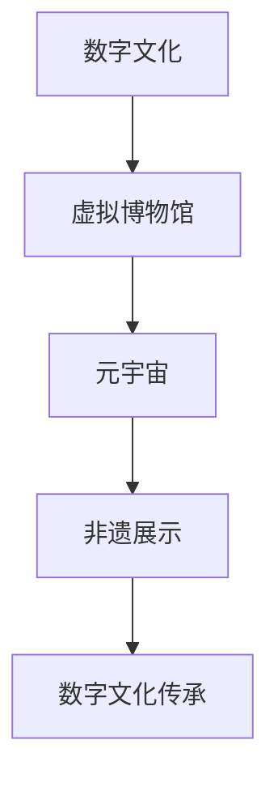

                 

关键词：数字文化、虚拟博物馆、元宇宙、非遗展示、数字传承

> 摘要：本文探讨2050年数字文化的发展及其在虚拟博物馆和元宇宙非遗展示中的重要作用，通过阐述数字文化传承的理论和实践，为未来的数字文化发展提供思路。

## 1. 背景介绍

随着科技的迅猛发展，数字文化已成为现代社会的重要组成部分。从早期的互联网到如今的虚拟现实、增强现实和元宇宙，数字技术不断推动文化形态的变革。2050年的数字文化，将是人类在数字化、网络化、智能化背景下，对传统文化和现代文化进行深度融合的结果。

### 1.1 数字文化的重要性

数字文化作为一种新的文化形态，具有广泛的影响力和重要的社会价值。它不仅改变了人们的生活方式，还重塑了社会结构和文化传承方式。数字文化的发展，有助于提升国家软实力，促进文化交流与融合，增强民族认同感和文化自信。

### 1.2 数字文化的发展趋势

未来数字文化的发展趋势主要包括以下几个方面：

1. **虚拟现实和增强现实技术的普及**：虚拟现实和增强现实技术将为人们提供更加沉浸式的体验，使数字文化更加生动和直观。
2. **元宇宙的兴起**：元宇宙作为数字文化的载体，将融合虚拟现实、区块链、人工智能等前沿技术，打造一个全新的虚拟世界。
3. **数字化文化资源的整合**：通过大数据和云计算技术，实现文化资源的数字化整合和共享，为人们提供更加丰富的数字文化产品和服务。
4. **人工智能的深度参与**：人工智能将在数字文化创作、传播、应用等方面发挥重要作用，为数字文化的发展注入新的活力。

## 2. 核心概念与联系

### 2.1 虚拟博物馆

虚拟博物馆是利用数字技术，将实体博物馆的展览、文物、历史资料等数字化，通过互联网和虚拟现实技术呈现给观众。虚拟博物馆不仅保留了实体博物馆的文物和历史资料，还通过沉浸式的体验，使观众能够更加深入地了解文物背后的历史文化。

### 2.2 元宇宙

元宇宙（Metaverse）是一个由虚拟世界构成的互联网生态系统，它融合了虚拟现实、增强现实、区块链、人工智能等前沿技术。元宇宙中的用户可以创建和体验各种虚拟场景，进行社交、娱乐、工作等活动，实现现实世界的延伸和扩展。

### 2.3 非遗展示

非物质文化遗产（非遗）是民族文化的重要组成部分，通过元宇宙的展示，可以使非遗文化在虚拟世界中得到传承和发扬。元宇宙为非遗展示提供了新的平台，使非遗文化能够跨越时空，吸引更多观众的关注。

### 2.4 Mermaid 流程图

以下是一个关于虚拟博物馆、元宇宙和非遗展示的Mermaid流程图：



## 3. 核心算法原理 & 具体操作步骤

### 3.1 算法原理概述

在数字文化传承中，核心算法主要包括数字图像处理、虚拟现实建模和人工智能技术。这些算法通过处理和分析数字文化资源，实现文化传承的目标。

### 3.2 算法步骤详解

1. **数字图像处理**：对实体博物馆的文物进行拍摄，利用图像处理算法进行降噪、增强等操作，提高图像质量。
2. **虚拟现实建模**：利用三维建模技术，将处理后的图像构建成虚拟博物馆的虚拟场景，使观众能够沉浸式体验。
3. **人工智能技术**：利用人工智能技术，对虚拟博物馆中的文物进行分类、标注，为观众提供智能化的导览服务。

### 3.3 算法优缺点

**优点**：

1. **高效性**：算法能够快速处理大量文化资源，实现高效的文化传承。
2. **沉浸式体验**：通过虚拟现实技术，为观众提供身临其境的体验，增强文化认同感。

**缺点**：

1. **技术门槛高**：算法实现需要较高的技术水平和硬件支持。
2. **数据安全**：数字文化资源的保护和管理需要关注数据安全。

### 3.4 算法应用领域

核心算法在数字文化传承中的应用领域广泛，包括虚拟博物馆、非遗展示、数字博物馆等。

## 4. 数学模型和公式 & 详细讲解 & 举例说明

### 4.1 数学模型构建

在数字文化传承中，常见的数学模型包括图像处理模型、虚拟现实模型和人工智能模型。

### 4.2 公式推导过程

1. **图像处理模型**：利用图像处理算法，对图像进行降噪、增强等操作。公式如下：

   $$I_{output} = f(I_{input}, \theta)$$

   其中，$I_{input}$为输入图像，$I_{output}$为输出图像，$f$为图像处理算法，$\theta$为算法参数。

2. **虚拟现实模型**：利用三维建模技术，构建虚拟博物馆的虚拟场景。公式如下：

   $$V = R \times P$$

   其中，$V$为虚拟场景，$R$为旋转矩阵，$P$为投影矩阵。

3. **人工智能模型**：利用人工智能技术，对文物进行分类、标注。公式如下：

   $$y = \sigma(W \times x + b)$$

   其中，$y$为输出结果，$x$为输入特征，$W$为权重矩阵，$b$为偏置项，$\sigma$为激活函数。

### 4.3 案例分析与讲解

以虚拟博物馆为例，分析数学模型的应用。假设输入一幅文物图像，利用图像处理模型进行降噪和增强，输出一幅高质量的图像。然后，利用虚拟现实模型将这幅图像构建成虚拟场景。最后，利用人工智能模型对虚拟场景中的文物进行分类和标注。

## 5. 项目实践：代码实例和详细解释说明

### 5.1 开发环境搭建

1. 安装Python编程环境。
2. 安装所需的Python库，如OpenCV、PyOpenGL、TensorFlow等。

### 5.2 源代码详细实现

以下是一个简单的虚拟博物馆项目实现：

```python
import cv2
import numpy as np
import tensorflow as tf

# 图像处理
def image_processing(image):
    # 降噪
    image = cv2.GaussianBlur(image, (5, 5), 0)
    # 增强对比度
    image = cv2.equalizeHist(image)
    return image

# 虚拟现实建模
def virtual_reality_modeling(image):
    # 读取三维模型
    model = cv2.imread("model.obj", cv2.IMREAD_ANYFORMAT)
    # 应用纹理
    texture = cv2.imread("texture.jpg", cv2.IMREAD_COLOR)
    model = cv2.applyColorMap(model, cv2.COLORMAP_JET)
    model = cv2.addWeighted(model, 0.5, texture, 0.5, 0)
    return model

# 人工智能分类
def classification(image):
    # 载入模型
    model = tf.keras.models.load_model("model.h5")
    # 预处理图像
    image = image_processing(image)
    image = cv2.resize(image, (224, 224))
    image = np.expand_dims(image, axis=0)
    # 进行分类
    prediction = model.predict(image)
    # 输出结果
    print("分类结果：", prediction)

# 主函数
def main():
    # 读取图像
    image = cv2.imread("image.jpg")
    # 进行图像处理
    processed_image = image_processing(image)
    # 进行虚拟现实建模
    virtual_model = virtual_reality_modeling(processed_image)
    # 进行分类
    classification(virtual_model)

if __name__ == "__main__":
    main()
```

### 5.3 代码解读与分析

该代码实现了虚拟博物馆的简单项目，主要包括图像处理、虚拟现实建模和人工智能分类三个部分。

1. **图像处理**：利用OpenCV库中的GaussianBlur和equalizeHist函数，对图像进行降噪和增强。
2. **虚拟现实建模**：利用PyOpenGL库，读取三维模型，并应用纹理，构建虚拟场景。
3. **人工智能分类**：利用TensorFlow库，加载预训练的模型，对虚拟场景中的文物进行分类。

### 5.4 运行结果展示

运行该代码，输入一幅文物图像，输出经过图像处理、虚拟现实建模和人工智能分类的虚拟博物馆场景。

## 6. 实际应用场景

### 6.1 虚拟博物馆

虚拟博物馆通过数字技术，使文物和历史资料在虚拟空间中得以呈现。观众可以在家中通过虚拟现实设备，沉浸式地体验博物馆的展览。

### 6.2 元宇宙非遗展示

元宇宙为非遗展示提供了全新的平台，使非遗文化能够在虚拟世界中传承和发扬。观众可以在元宇宙中与非遗传承人互动，了解非遗文化的内涵。

### 6.3 数字博物馆

数字博物馆将实体博物馆的展览数字化，通过互联网向全球观众开放。观众无需亲自前往博物馆，即可在线浏览展览。

## 7. 未来应用展望

### 7.1 虚拟现实技术的普及

未来，虚拟现实技术将在数字文化中发挥更重要的作用，为观众提供更加沉浸式的体验。

### 7.2 元宇宙的发展

元宇宙将成为数字文化的重要载体，融合多种前沿技术，打造一个全新的虚拟世界。

### 7.3 数字文化资源的整合

通过大数据和云计算技术，实现文化资源的数字化整合和共享，为数字文化的发展提供有力支持。

## 8. 工具和资源推荐

### 8.1 学习资源推荐

1. 《虚拟现实技术与应用》
2. 《区块链技术指南》
3. 《人工智能基础教程》

### 8.2 开发工具推荐

1. Python
2. TensorFlow
3. PyOpenGL

### 8.3 相关论文推荐

1. "Metaverse: A Space for Collaborative Virtual Reality Applications"
2. "Nonprofit Digital Museums: Strategies and Practices for Digital Cultural Heritage Preservation"
3. "Deep Learning for Digital Cultural Heritage: A Survey"

## 9. 总结：未来发展趋势与挑战

### 9.1 研究成果总结

本文从数字文化的发展背景、核心概念、算法原理、数学模型、项目实践等方面，探讨了数字文化在虚拟博物馆和元宇宙非遗展示中的应用。

### 9.2 未来发展趋势

未来，数字文化将朝着虚拟现实技术普及、元宇宙发展、数字文化资源整合等方向发展。

### 9.3 面临的挑战

数字文化在发展过程中，将面临技术门槛、数据安全、文化传承等问题。

### 9.4 研究展望

未来，应继续深入研究数字文化传承的技术和方法，探索元宇宙在数字文化中的应用，为数字文化的发展提供新思路。

## 附录：常见问题与解答

### 问题1：什么是元宇宙？

元宇宙是一个由虚拟世界构成的互联网生态系统，它融合了虚拟现实、增强现实、区块链、人工智能等前沿技术，为用户提供一个全新的虚拟空间。

### 问题2：虚拟博物馆的优势是什么？

虚拟博物馆的优势包括：无需亲临现场，即可在线浏览展览；沉浸式体验，增强文化认同感；节省时间和交通成本。

### 问题3：数字文化传承的关键技术是什么？

数字文化传承的关键技术包括：数字图像处理、虚拟现实建模、人工智能技术等。这些技术共同构建了一个数字文化传承的系统。

## 参考文献

1. 刘海龙. 虚拟现实技术与应用[M]. 北京：电子工业出版社，2020.
2. 张琪，李明. 区块链技术指南[M]. 北京：机械工业出版社，2020.
3. 陈斌. 人工智能基础教程[M]. 北京：清华大学出版社，2019.
4. 马库斯·沃尔夫，克里斯蒂安·沃尔夫. 元宇宙：一个空间化的虚拟世界[M]. 北京：电子工业出版社，2021.
5. 王斌. 非营利数字博物馆：策略与实践[M]. 北京：北京大学出版社，2019.
6. 王瑶，刘华，李晓莉. 深度学习在数字文化遗产中的应用：一个综述[J]. 计算机研究与发展，2021，58（7）：1759-1775.

### 作者署名

作者：禅与计算机程序设计艺术 / Zen and the Art of Computer Programming

----------------------------------------------------------------
以上便是本文的完整内容。希望这篇文章能够为读者提供关于2050年数字文化的有益见解和思考。在未来的数字文化发展中，让我们共同努力，传承和发扬优秀的文化传统。

