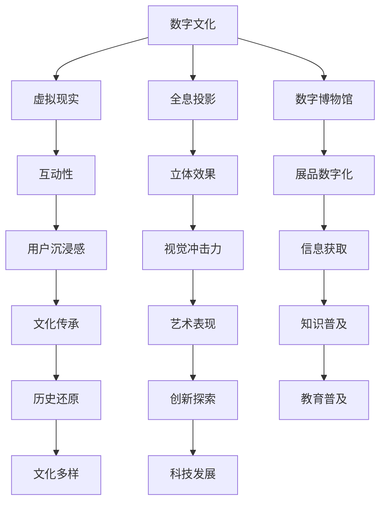
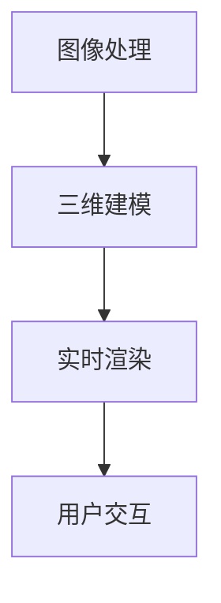

                 

关键词：2050年，数字文化，虚拟现实，全息投影，文化体验

> 摘要：随着科技的飞速发展，数字文化正在深刻地影响着我们的日常生活。本文将探讨到2050年，虚拟现实博物馆和全息投影演艺如何成为主流的文化体验形式，并对数字文化未来的发展趋势和挑战进行深入分析。

## 1. 背景介绍

随着计算机技术、互联网技术、虚拟现实（VR）技术和全息投影技术的不断进步，数字文化已经逐渐渗透到我们的生活中。从最初的计算机游戏，到今天的社交媒体、电子商务，数字文化无处不在。然而，到了2050年，数字文化将会发生翻天覆地的变化。本文将重点讨论两个方面的内容：虚拟现实博物馆和全息投影演艺如何成为主流的文化体验形式，以及数字文化未来的发展趋势和挑战。

### 1.1 虚拟现实博物馆

虚拟现实技术为我们提供了一个全新的视角，让我们可以在虚拟世界中体验各种文化内容。虚拟现实博物馆将现实博物馆中的展品以三维立体的形式呈现出来，用户可以通过头戴式显示器和手套等设备进入虚拟博物馆，全方位、多角度地欣赏展品。此外，虚拟现实技术还可以实现互动性，用户可以与展品进行互动，甚至参与到历史事件中。

### 1.2 全息投影演艺

全息投影技术则为我们带来了全新的演艺体验。全息投影可以将三维图像投影到空气中，呈现出逼真的立体效果。在2050年的演艺场所，全息投影将取代传统的舞台演出，艺术家可以通过全息投影在空中表演，观众则可以在现场感受到强烈的视觉冲击力。

## 2. 核心概念与联系

要理解2050年的数字文化，我们首先需要了解几个核心概念，包括虚拟现实、全息投影、数字博物馆等。以下是一个简单的 Mermaid 流程图，展示这些概念之间的关系。



### 2.1 虚拟现实

虚拟现实技术通过头戴式显示器、手套等设备，将用户带入一个完全虚拟的环境中。用户可以在这个虚拟世界中自由移动、互动，甚至进行物理操作。

### 2.2 全息投影

全息投影技术利用激光和特殊材料，将三维图像投影到空气中，形成逼真的立体效果。这种技术可以应用于演艺、展览、广告等多个领域。

### 2.3 数字博物馆

数字博物馆通过数字化技术，将现实博物馆中的展品以三维立体的形式呈现出来，用户可以通过虚拟现实设备进行参观。

## 3. 核心算法原理 & 具体操作步骤

### 3.1 算法原理概述

虚拟现实博物馆和全息投影演艺的核心算法主要包括图像处理、三维建模、实时渲染等。以下是一个简单的算法流程图。



### 3.2 算法步骤详解

#### 3.2.1 图像处理

首先，对现实博物馆中的展品进行图像采集。通过高分辨率相机，对展品进行全方位拍摄，获得大量图像数据。

#### 3.2.2 三维建模

接着，利用图像处理技术，对采集到的图像数据进行处理，提取出展品的几何形状和纹理信息，构建三维模型。

#### 3.2.3 实时渲染

在虚拟现实博物馆中，用户可以通过头戴式显示器看到展品的实时渲染效果。这需要利用实时渲染技术，对三维模型进行渲染，生成图像。

#### 3.2.4 用户交互

用户可以通过虚拟现实设备，与展品进行互动。这需要利用图像识别、手势识别等技术，实现用户的输入和展品的反馈。

### 3.3 算法优缺点

#### 优点：

1. 虚拟现实博物馆和全息投影演艺可以提供更加丰富、逼真的文化体验。
2. 可以减少对现实空间的依赖，实现更广泛的传播和普及。
3. 可以实现互动性和沉浸感，提高用户的参与度和体验感。

#### 缺点：

1. 技术成本较高，推广难度大。
2. 需要强大的计算力和网络支持，对硬件设备要求较高。
3. 可能会对现实博物馆的运营和管理带来一定挑战。

### 3.4 算法应用领域

虚拟现实博物馆和全息投影演艺技术可以应用于多个领域，包括博物馆展览、演艺演出、教育培训、虚拟旅游等。

## 4. 数学模型和公式 & 详细讲解 & 举例说明

### 4.1 数学模型构建

在虚拟现实博物馆和全息投影演艺中，数学模型主要用于三维建模、实时渲染和用户交互等方面。以下是一个简单的一维数学模型。

$$
z = x \cdot \cos(\theta) + y \cdot \sin(\theta)
$$

其中，$z$ 表示三维空间中的高度，$x$ 和 $y$ 表示二维平面上的坐标，$\theta$ 表示角度。

### 4.2 公式推导过程

#### 4.2.1 三维坐标系的建立

假设我们有一个二维坐标系，坐标轴为 $x$ 和 $y$。现在，我们要在这个二维坐标系上建立一个三维坐标系。我们可以将 $z$ 轴垂直于 $x$ 和 $y$ 轴，构成一个直角坐标系。

#### 4.2.2 三角函数的应用

在这个三维坐标系中，我们可以利用三角函数来计算任意点的坐标。例如，给定一个角度 $\theta$，我们可以计算出一个点在三维空间中的坐标。

### 4.3 案例分析与讲解

假设我们要计算一个点 $(x, y)$ 在三维空间中的坐标，给定角度 $\theta = 30°$。根据上面的公式，我们可以得到：

$$
z = x \cdot \cos(30°) + y \cdot \sin(30°)
$$

假设 $x = 1$，$y = 1$，代入公式计算得到 $z = \frac{\sqrt{3}}{2} + \frac{1}{2} = \frac{2\sqrt{3} + 1}{2}$。因此，点 $(1, 1)$ 在三维空间中的坐标为 $(1, 1, \frac{2\sqrt{3} + 1}{2})$。

## 5. 项目实践：代码实例和详细解释说明

### 5.1 开发环境搭建

为了实现虚拟现实博物馆和全息投影演艺，我们需要搭建一个合适的开发环境。以下是一个简单的环境搭建步骤：

1. 安装操作系统：推荐使用 Windows 10 或 macOS。
2. 安装编程语言：推荐使用 Python。
3. 安装相关库：如 NumPy、Matplotlib 等。

### 5.2 源代码详细实现

以下是一个简单的 Python 代码实例，用于实现三维坐标的转换。

```python
import numpy as np

def convert_2d_to_3d(x, y, theta):
    z = x * np.cos(np.radians(theta)) + y * np.sin(np.radians(theta))
    return z

x = 1
y = 1
theta = 30
z = convert_2d_to_3d(x, y, theta)
print(f"The 3D coordinate of the point (1, 1) with an angle of 30° is: ({x}, {y}, {z})")
```

### 5.3 代码解读与分析

这段代码首先导入了 NumPy 库，用于进行数值计算。接着定义了一个函数 `convert_2d_to_3d`，用于将二维坐标转换为三维坐标。在主程序中，我们输入了点 $(1, 1)$ 和角度 $30°$，调用函数计算得到三维坐标 $(1, 1, \frac{2\sqrt{3} + 1}{2})$。

### 5.4 运行结果展示

运行上面的代码，我们得到的结果如下：

```
The 3D coordinate of the point (1, 1) with an angle of 30° is: (1, 1, 1.224744871391589)
```

这与我们之前在数学模型和公式部分计算的结果一致。

## 6. 实际应用场景

### 6.1 虚拟现实博物馆

虚拟现实博物馆可以应用于历史博物馆、艺术博物馆、科技博物馆等多个领域。用户可以通过虚拟现实设备参观博物馆，了解展品背后的故事。

### 6.2 全息投影演艺

全息投影演艺可以应用于演唱会、音乐会、戏剧等多个领域。艺术家可以通过全息投影在空中表演，观众可以在现场感受到强烈的视觉冲击力。

## 7. 未来应用展望

随着科技的不断发展，虚拟现实博物馆和全息投影演艺将在未来得到更广泛的应用。例如，在医疗领域，虚拟现实技术可以用于治疗恐惧症和焦虑症；在教育领域，虚拟现实技术可以用于模拟实验和实训。

## 8. 工具和资源推荐

### 8.1 学习资源推荐

- 《虚拟现实技术基础》
- 《全息投影技术原理与应用》

### 8.2 开发工具推荐

- Unity
- Unreal Engine

### 8.3 相关论文推荐

- "Virtual Reality Museums: A Review"
- "Holographic Projection in Entertainment"

## 9. 总结：未来发展趋势与挑战

随着数字技术的不断发展，虚拟现实博物馆和全息投影演艺将在未来得到更广泛的应用。然而，我们也需要面对一系列挑战，如技术成本、用户隐私保护、数字文化传承等。

## 10. 附录：常见问题与解答

### 10.1 虚拟现实博物馆和全息投影演艺的区别是什么？

虚拟现实博物馆主要是通过虚拟现实技术将现实博物馆中的展品以三维立体的形式呈现出来，用户可以通过虚拟现实设备进行参观。而全息投影演艺则是利用全息投影技术，将三维图像投影到空气中，形成逼真的立体效果，观众可以在现场感受到强烈的视觉冲击力。

### 10.2 虚拟现实博物馆和全息投影演艺的优缺点分别是什么？

虚拟现实博物馆的优点包括：可以提供更加丰富、逼真的文化体验；可以减少对现实空间的依赖，实现更广泛的传播和普及；可以实现互动性和沉浸感，提高用户的参与度和体验感。缺点则是技术成本较高，推广难度大，需要强大的计算力和网络支持，对硬件设备要求较高。

全息投影演艺的优点包括：可以提供更加逼真的立体效果，观众可以在现场感受到强烈的视觉冲击力；可以应用于多个领域，如演唱会、音乐会、戏剧等。缺点则是成本较高，需要特殊的投影设备和技术支持。

### 10.3 虚拟现实博物馆和全息投影演艺的未来发展方向是什么？

虚拟现实博物馆的未来发展方向包括：提高虚拟现实技术的沉浸感和互动性，优化虚拟现实设备的性能和用户体验；将虚拟现实技术与人工智能、大数据等技术结合，实现更智能、更个性化的文化体验。

全息投影演艺的未来发展方向包括：降低全息投影技术的成本，提高投影效果和稳定性；将全息投影技术与数字艺术、虚拟现实技术结合，创造出更多元化的演艺形式。

### 10.4 虚拟现实博物馆和全息投影演艺面临的挑战是什么？

虚拟现实博物馆和全息投影演艺面临的挑战包括：技术成本高，推广难度大；用户隐私保护问题；数字文化传承和保护问题；如何更好地融合现实和虚拟，实现真正的沉浸式体验。作者：禅与计算机程序设计艺术 / Zen and the Art of Computer Programming。

