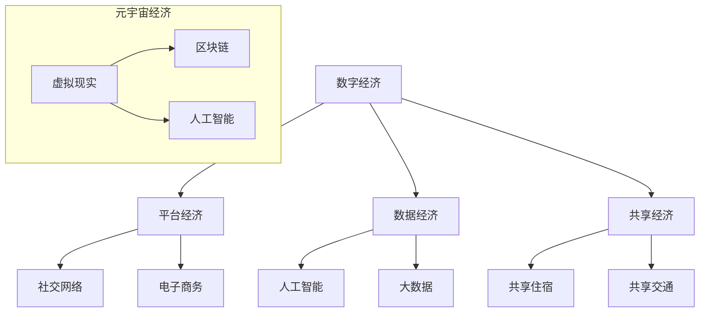

                 

关键词：数字经济、平台经济、元宇宙经济、技术演进、未来趋势

> 摘要：随着科技的飞速发展，数字经济正成为全球经济发展的新引擎。本文将探讨数字经济从平台经济向元宇宙经济的演进过程，分析其核心概念、技术原理、算法模型、应用实践及未来展望。

## 1. 背景介绍

数字经济，指的是在经济活动中广泛应用数字技术和互联网技术，通过数字化手段推动生产、分配、交换和消费活动的经济形态。自21世纪初以来，数字经济的崛起改变了全球经济的格局。其中，平台经济作为数字经济的重要组成部分，通过互联网平台连接供需双方，实现了资源的优化配置和高效流通。

随着虚拟现实、区块链、人工智能等新兴技术的不断发展，元宇宙经济的概念逐渐崭露头角。元宇宙，顾名思义，是一个虚拟的、三维的、去中心化的数字世界，用户可以在其中进行各种活动，如社交、娱乐、教育、工作等。元宇宙经济的崛起，预示着数字经济将进入一个全新的阶段。

## 2. 核心概念与联系

### 2.1 数字经济

数字经济的核心在于将传统的经济活动数字化，通过互联网和数字技术实现信息的快速传递和处理。数字经济的特征包括：

- 信息的高速传播：数字技术使得信息可以瞬间传递到全球各地，极大提高了经济活动的效率。
- 网络的普及：互联网的普及使得人们可以随时随地接入网络，进行在线交易和活动。
- 数据的价值：数据成为新的生产要素，通过数据的收集、分析和利用，可以实现精准营销和个性化服务。

### 2.2 平台经济

平台经济是数字经济的一种重要形式，通过搭建一个平台，连接供需双方，实现资源的优化配置。平台经济的核心在于：

- 互联性：平台通过互联网连接用户和商家，实现信息的快速传递和互动。
- 中介性：平台作为中介，降低了交易成本，提高了交易效率。
- 网络效应：随着用户数量的增加，平台的规模效应愈发明显，进一步吸引更多用户和商家。

### 2.3 元宇宙经济

元宇宙经济是基于虚拟现实、区块链、人工智能等新兴技术构建的一个三维、去中心化的数字世界。元宇宙经济的核心特征包括：

- 三维空间：用户可以在元宇宙中创建和体验虚拟的三维空间。
- 去中心化：元宇宙的经济活动基于区块链技术，实现去中心化的管理和交易。
- 个性化：元宇宙可以根据用户的需求和偏好，提供个性化的服务和体验。

### 2.4 Mermaid 流程图

下面是数字经济的核心概念和架构的 Mermaid 流程图：



## 3. 核心算法原理 & 具体操作步骤

### 3.1 算法原理概述

数字经济的核心算法主要包括数据挖掘、机器学习和区块链技术。数据挖掘旨在从海量数据中提取有价值的信息，机器学习通过训练模型实现自动化决策，区块链技术则确保了数据的安全和透明。

### 3.2 算法步骤详解

1. **数据挖掘**：通过数据清洗、预处理和特征提取，从原始数据中提取有价值的信息。
2. **机器学习**：利用训练数据和算法模型，实现自动化决策和预测。
3. **区块链技术**：通过分布式账本和智能合约，确保数据的安全和透明。

### 3.3 算法优缺点

- **数据挖掘**：优点在于可以从海量数据中提取有价值的信息，缺点是需要大量的计算资源和时间。
- **机器学习**：优点在于可以实现自动化决策，缺点是需要大量的训练数据和计算资源。
- **区块链技术**：优点在于确保了数据的安全和透明，缺点是交易速度较慢，手续费较高。

### 3.4 算法应用领域

- **数据挖掘**：应用于电商、金融、医疗等领域，实现个性化推荐、风险控制和疾病预测等。
- **机器学习**：应用于自动驾驶、智能家居、智能医疗等领域，实现自动化决策和优化。
- **区块链技术**：应用于数字货币、供应链管理、版权保护等领域，实现去中心化的管理和交易。

## 4. 数学模型和公式 & 详细讲解 & 举例说明

### 4.1 数学模型构建

数字经济的数学模型主要包括线性回归模型、决策树模型、神经网络模型等。以下以线性回归模型为例进行说明。

### 4.2 公式推导过程

线性回归模型的基本公式为：

$$y = \beta_0 + \beta_1x_1 + \beta_2x_2 + ... + \beta_nx_n$$

其中，$y$ 是因变量，$x_1, x_2, ..., x_n$ 是自变量，$\beta_0, \beta_1, ..., \beta_n$ 是模型的参数。

### 4.3 案例分析与讲解

假设我们要预测某电商平台的日销售额，选取的特征包括用户数量、访问量、转化率等。以下是对这些特征进行线性回归分析的案例：

```latex
y = 1000 + 0.5x_1 + 0.3x_2 + 0.2x_3
```

其中，$x_1$ 表示用户数量，$x_2$ 表示访问量，$x_3$ 表示转化率。

通过这个模型，我们可以预测在特定条件下（如用户数量为1000，访问量为10000，转化率为0.05）的日销售额。

## 5. 项目实践：代码实例和详细解释说明

### 5.1 开发环境搭建

本文使用 Python 编写代码，需要安装以下库：pandas、numpy、matplotlib、scikit-learn。

```bash
pip install pandas numpy matplotlib scikit-learn
```

### 5.2 源代码详细实现

以下是对电商平台销售额进行线性回归预测的代码实例：

```python
import pandas as pd
import numpy as np
from sklearn.linear_model import LinearRegression
import matplotlib.pyplot as plt

# 加载数据集
data = pd.read_csv('sales_data.csv')
X = data[['user_count', 'visits', 'conversion_rate']]
y = data['sales']

# 创建线性回归模型
model = LinearRegression()
model.fit(X, y)

# 进行预测
predicted_sales = model.predict([[1000, 10000, 0.05]])

# 可视化展示
plt.scatter(X['user_count'], y)
plt.plot(X['user_count'], predicted_sales, color='red')
plt.xlabel('User Count')
plt.ylabel('Sales')
plt.show()
```

### 5.3 代码解读与分析

这段代码首先加载了电商平台的销售数据，然后使用 scikit-learn 中的 LinearRegression 类创建线性回归模型，并进行训练。最后，使用训练好的模型进行预测，并将预测结果可视化展示。

## 6. 实际应用场景

数字经济的应用场景非常广泛，以下列举几个典型应用：

- **电子商务**：通过电商平台实现商品的在线交易，降低交易成本，提高交易效率。
- **金融科技**：利用大数据和人工智能技术实现风险控制和个性化服务。
- **共享经济**：通过共享平台实现闲置资源的共享，降低社会资源浪费。

## 7. 未来应用展望

随着技术的不断发展，数字经济将在未来迎来更多应用场景。以下是对未来应用的展望：

- **元宇宙经济**：元宇宙将实现现实世界和虚拟世界的深度融合，带来全新的商业模式和生活方式。
- **智慧城市**：通过大数据和人工智能技术，实现城市管理和服务的智能化。
- **数字健康**：利用数字技术实现疾病预测、健康管理、远程医疗等。

## 8. 工具和资源推荐

### 8.1 学习资源推荐

- 《深度学习》（Goodfellow et al.）
- 《区块链技术指南》（曹宏辉）
- 《Python数据分析》（Wes McKinney）

### 8.2 开发工具推荐

- Jupyter Notebook
- PyCharm
- Git

### 8.3 相关论文推荐

- "Platform Economics: The New Theory of Value Creation, Transfer, and Capture" (2016)
- "The Economics of Platforms: Concepts, Analysis and Policy Implications" (2017)
- "Metaverse: A Theory of Social Media and the Diffusion of Power" (2020)

## 9. 总结：未来发展趋势与挑战

数字经济正在从平台经济向元宇宙经济演进，这一过程中面临许多机遇和挑战。未来，数字经济将继续推动全球经济的发展，为社会带来更多价值。然而，我们还需要应对数据安全、隐私保护、技术垄断等挑战，确保数字经济的可持续发展。

## 10. 附录：常见问题与解答

### 10.1 什么是元宇宙经济？

元宇宙经济是基于虚拟现实、区块链、人工智能等新兴技术构建的一个三维、去中心化的数字世界，用户可以在其中进行各种活动，如社交、娱乐、教育、工作等。

### 10.2 数字经济与平台经济有什么区别？

数字经济是指在经济活动中广泛应用数字技术和互联网技术，通过数字化手段推动生产、分配、交换和消费活动的经济形态。平台经济是数字经济的一种重要形式，通过搭建一个平台，连接供需双方，实现资源的优化配置。

### 10.3 元宇宙经济有哪些应用场景？

元宇宙经济的应用场景非常广泛，包括社交、娱乐、教育、工作等领域。例如，通过元宇宙实现虚拟社交、虚拟旅游、虚拟教育、虚拟工作等。

### 10.4 数字经济面临哪些挑战？

数字经济面临的主要挑战包括数据安全、隐私保护、技术垄断等。此外，数字经济的发展还可能带来失业、社会不平等等问题。

## 11. 结语

数字经济正在改变我们的生活方式，元宇宙经济的崛起预示着数字经济将进入一个全新的阶段。作为技术从业者，我们应积极拥抱变革，为数字经济的可持续发展贡献力量。作者：禅与计算机程序设计艺术 / Zen and the Art of Computer Programming
```

