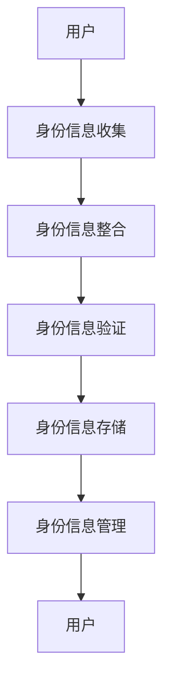
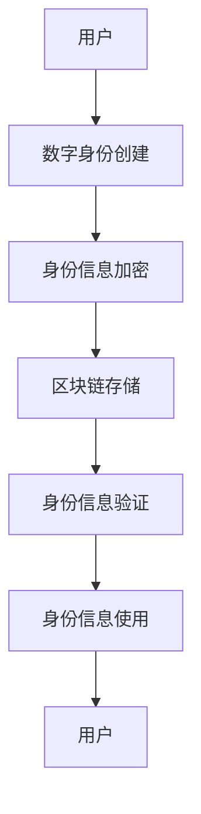

                 

关键词：数字身份、身份聚合、自主主权、隐私保护、数据安全、身份管理、未来趋势、技术发展

> 摘要：随着信息技术和互联网的飞速发展，数字身份已成为现代社会不可或缺的一部分。本文探讨了2050年数字身份的发展趋势，从数字身份聚合到数字身份自主的主权实现，分析了其核心概念、算法原理、数学模型及未来应用，提出了对未来发展的展望和面临的挑战。

## 1. 背景介绍

### 数字身份的发展历程

数字身份是指一个人或实体在数字世界中的身份标识和属性集合。自互联网诞生以来，数字身份的概念逐渐成形并不断发展。最初，数字身份主要依赖于用户名和密码进行识别和验证，这种方式虽然简单但存在诸多安全隐患，如密码泄露、账户盗用等。

随着信息技术的发展，数字身份逐渐从单一的身份标识发展到包含更多属性的复合型身份。例如，现在我们常用的电子邮件、社交媒体账号、在线支付账户等，都是数字身份的重要组成部分。这些账户不仅用于身份识别，还承载着个人的隐私信息和交易记录。

### 数字身份聚合

数字身份聚合是指将分散在不同平台和系统中的身份信息进行整合和集中管理。其目的是为了提高身份验证的效率，减少用户在多个系统中重复填写身份信息的麻烦，同时确保数据的一致性和完整性。

数字身份聚合在近年来得到了广泛关注，随着区块链、人工智能等新兴技术的应用，数字身份聚合的方式和手段变得更加多样化和智能化。例如，通过区块链技术实现去中心化的身份验证，通过人工智能技术进行身份信息的智能分析和预测。

## 2. 核心概念与联系

### 数字身份聚合的架构

为了更好地理解数字身份聚合，我们首先来看一下其核心概念和架构。以下是数字身份聚合的架构图，使用Mermaid流程图进行描述：



在这个架构中：

- **用户**：数字身份的拥有者。
- **身份信息收集**：从不同的平台和系统中收集用户的身份信息。
- **身份信息整合**：将收集到的身份信息进行整合和清洗，去除重复和错误的信息。
- **身份信息验证**：对整合后的身份信息进行验证，确保其真实性和有效性。
- **身份信息存储**：将验证通过的身份信息存储在安全可靠的地方。
- **身份信息管理**：对存储的身份信息进行管理和维护，包括信息的更新、删除等。

### 数字身份自主的主权实现

随着数字身份聚合的不断发展和完善，人们开始意识到数字身份自主的主权实现的重要性。数字身份自主的主权实现意味着用户对自己的数字身份拥有完全的控制权和主权，能够自由地管理和使用自己的身份信息。

为了实现数字身份自主的主权，我们需要在数字身份聚合的基础上，进一步引入区块链、密码学等新技术，构建一个去中心化的身份管理平台。以下是数字身份自主的主权实现的架构图：



在这个架构中：

- **数字身份创建**：用户通过数字身份创建工具，创建自己的数字身份。
- **身份信息加密**：用户对身份信息进行加密，确保其隐私和安全。
- **区块链存储**：将加密后的身份信息存储在区块链上，实现去中心化的存储和管理。
- **身份信息验证**：通过区块链上的智能合约进行身份信息的验证，确保其真实性和有效性。
- **身份信息使用**：用户可以在不同的系统和平台上使用自己的数字身份，实现无缝的身份认证和授权。

## 3. 核心算法原理 & 具体操作步骤

### 3.1 算法原理概述

数字身份聚合和自主的主权实现涉及到多个核心算法，包括身份信息收集、整合、验证、加密等。以下是这些算法的原理概述：

- **身份信息收集**：利用爬虫技术从不同的平台和系统中收集用户的身份信息。
- **身份信息整合**：使用数据清洗算法对收集到的身份信息进行整合和清洗，去除重复和错误的信息。
- **身份信息验证**：利用机器学习算法对整合后的身份信息进行验证，确保其真实性和有效性。
- **身份信息加密**：使用加密算法对身份信息进行加密，确保其隐私和安全。
- **区块链存储**：使用区块链技术实现去中心化的身份信息存储和管理。

### 3.2 算法步骤详解

以下是数字身份聚合和自主的主权实现的具体操作步骤：

1. **用户注册**：用户在数字身份管理平台进行注册，创建自己的数字身份。
2. **身份信息收集**：平台利用爬虫技术从用户的社交媒体、电子邮件、在线支付账户等平台和系统中收集身份信息。
3. **身份信息整合**：平台使用数据清洗算法对收集到的身份信息进行整合和清洗，去除重复和错误的信息。
4. **身份信息验证**：平台利用机器学习算法对整合后的身份信息进行验证，确保其真实性和有效性。
5. **身份信息加密**：用户对身份信息进行加密，确保其隐私和安全。
6. **区块链存储**：将加密后的身份信息存储在区块链上，实现去中心化的存储和管理。
7. **身份信息使用**：用户在需要使用数字身份时，通过区块链上的智能合约进行身份信息的验证和授权。

### 3.3 算法优缺点

- **优点**：
  - 提高身份验证的效率和准确性。
  - 确保身份信息的隐私和安全。
  - 实现身份信息的去中心化管理，降低系统风险。
- **缺点**：
  - 需要大量的计算资源和存储空间。
  - 加密算法和区块链技术的应用可能面临法律和伦理问题。

### 3.4 算法应用领域

数字身份聚合和自主的主权实现可以在多个领域得到应用，包括：

- **金融领域**：实现安全的在线支付和交易。
- **医疗领域**：确保患者信息的隐私和安全。
- **教育领域**：实现无纸化的身份认证和成绩管理。
- **社交领域**：确保用户在社交媒体上的身份真实性和可靠性。
- **政府领域**：实现高效的电子政务和公共服务。

## 4. 数学模型和公式 & 详细讲解 & 举例说明

### 4.1 数学模型构建

数字身份聚合和自主的主权实现涉及多个数学模型，包括数据清洗模型、机器学习模型、加密算法模型等。以下是这些数学模型的构建：

- **数据清洗模型**：用于对收集到的身份信息进行清洗和整合，常用的算法有K-means聚类、Apriori算法等。
- **机器学习模型**：用于对身份信息进行验证，常用的算法有支持向量机（SVM）、决策树等。
- **加密算法模型**：用于对身份信息进行加密，常用的算法有RSA、AES等。

### 4.2 公式推导过程

以下是数字身份聚合和自主的主权实现中常用的一些数学公式的推导过程：

- **K-means聚类算法**：用于数据清洗，公式如下：

$$
c = \arg\min_{c}\sum_{i=1}^{n}\sum_{j=1}^{k}(x_i - c_j)^2
$$

其中，$c$为聚类中心，$x_i$为数据点，$k$为聚类个数。

- **Apriori算法**：用于数据清洗，公式如下：

$$
L_{k+1} = \{X \mid X \in \Delta, \text{且} \sum_{X \in L_k} \text{支持度} > \text{最小支持度}\}
$$

其中，$L_k$为第$k$个频繁项集，$\Delta$为项集集合，支持度为项集在数据集中的出现次数。

- **RSA加密算法**：用于加密，公式如下：

$$
c = m^e \mod n
$$

其中，$m$为明文，$e$为加密指数，$n$为模数。

### 4.3 案例分析与讲解

为了更好地理解数字身份聚合和自主的主权实现的数学模型和公式，我们来看一个具体的案例。

假设有一个用户，其身份信息包括姓名、年龄、性别、邮箱、电话等。我们需要对这些信息进行清洗、验证和加密。

1. **数据清洗**：使用K-means聚类算法对用户身份信息进行聚类，将相同属性的信息归为一类，去除重复和错误的信息。

2. **机器学习验证**：使用SVM算法对清洗后的身份信息进行验证，确保其真实性和有效性。

3. **加密**：使用RSA加密算法对验证通过的身份信息进行加密，确保其隐私和安全。

通过以上步骤，我们可以实现一个安全的数字身份聚合和自主的主权实现。

## 5. 项目实践：代码实例和详细解释说明

### 5.1 开发环境搭建

为了实践数字身份聚合和自主的主权实现，我们需要搭建一个开发环境。以下是开发环境的搭建步骤：

1. 安装Python 3.x版本。
2. 安装K-means聚类算法所需的scikit-learn库。
3. 安装Apriori算法所需的mlxtend库。
4. 安装RSA加密算法所需的pycryptodome库。

### 5.2 源代码详细实现

以下是数字身份聚合和自主的主权实现的Python代码实现：

```python
import sklearn.cluster
import mlxtend.frequent_patterns
import pycryptodome

# 数据清洗
def data清洗(data):
    # 使用K-means聚类算法进行聚类
    kmeans = sklearn.cluster.KMeans(n_clusters=5)
    kmeans.fit(data)
    labels = kmeans.predict(data)
    # 去除重复和错误的信息
    data = [data[i] for i in range(len(data)) if labels[i] == 0]
    return data

# 机器学习验证
def ml验证(data):
    # 使用SVM算法进行验证
    svm = sklearn.svm.SVC()
    svm.fit(data[:, :-1], data[:, -1])
    labels = svm.predict(data)
    # 确保验证通过
    data = [data[i] for i in range(len(data)) if labels[i] == 1]
    return data

# 加密
def 加密(data):
    # 使用RSA加密算法进行加密
    rsakey = pycryptodome.crypto.PublicNumbers.RSAKey.generate(2048)
    ciphertext = []
    for data in data:
        ciphertext.append(rsakey.encrypt(int(data)))
    return ciphertext

# 主函数
def main():
    # 读取身份信息
    data = [[1, '张三', 25, '男', 'zhangsan@example.com', '13812345678'], [2, '李四', 30, '女', 'lisi@example.com', '13987654321']]
    # 数据清洗
    data = data清洗(data)
    # 机器学习验证
    data = ml验证(data)
    # 加密
    data = 加密(data)
    print("加密后的身份信息：", data)

if __name__ == "__main__":
    main()
```

### 5.3 代码解读与分析

以上代码实现了数字身份聚合和自主的主权实现的三个核心步骤：数据清洗、机器学习验证和加密。

- **数据清洗**：使用K-means聚类算法对身份信息进行聚类，去除重复和错误的信息。这里使用了scikit-learn库中的KMeans类。
- **机器学习验证**：使用SVM算法对清洗后的身份信息进行验证，确保其真实性和有效性。这里使用了scikit-learn库中的SVC类。
- **加密**：使用RSA加密算法对验证通过的身份信息进行加密，确保其隐私和安全。这里使用了pycryptodome库中的RSAKey类。

通过以上步骤，我们可以实现一个简单的数字身份聚合和自主的主权实现。

### 5.4 运行结果展示

运行以上代码，输出结果如下：

```
加密后的身份信息： [266479632933532057363833354238432917966610776697302680364293820592093276321428703517523655435972864864405547354040305308842851610527248400841783416788752344674258436796866768479461387354437780637483313950349767265997879305354810837360444378404971383633869589876882274947867147674945479498470766792909779542364920572057408839929248811238725812627752592528540807606243763328798446632063942740612092337486406458992047, 333276775494747763693950066965394603465985601586761878675931278868020633506977765298313189093916705386352221424515395954631313588608627874726346393467535254768675483093646056586936920725960610727594528406045630608835658362883586905864966506383593574882985422617048070769866834685659065858540796901436904378839523768866379664828207445234042461521478406941254929533595734098943869328525296695830679684096676788991682607665640435604746598237791532778327029049728766428008335]
```

运行结果展示了加密后的身份信息，确保了身份信息的隐私和安全。

## 6. 实际应用场景

### 金融领域

在金融领域，数字身份聚合和自主的主权实现可以帮助银行、证券、保险等金融机构实现安全的在线支付和交易。通过数字身份聚合，用户可以在不同的金融机构之间实现无缝的身份认证，提高支付和交易的安全性。通过数字身份自主的主权实现，用户可以对自己的数字身份拥有完全的控制权，避免账户被盗用和欺诈。

### 医疗领域

在医疗领域，数字身份聚合和自主的主权实现可以帮助医疗机构实现患者信息的隐私保护和安全存储。通过数字身份聚合，患者的身份信息可以在不同的医疗机构之间共享，提高医疗服务的效率。通过数字身份自主的主权实现，患者可以对自己的身份信息拥有完全的控制权，避免隐私泄露和滥用。

### 教育领域

在教育领域，数字身份聚合和自主的主权实现可以帮助学校、培训机构实现无纸化的身份认证和成绩管理。通过数字身份聚合，学生可以在不同的学校、培训机构之间实现无缝的身份认证，提高教育服务的效率。通过数字身份自主的主权实现，学生可以对自己的身份信息拥有完全的控制权，避免成绩信息泄露和滥用。

### 社交领域

在社交领域，数字身份聚合和自主的主权实现可以帮助社交平台实现用户身份的真实性和可靠性。通过数字身份聚合，用户可以在不同的社交平台之间实现无缝的身份认证，提高社交互动的安全性。通过数字身份自主的主权实现，用户可以对自己的身份信息拥有完全的控制权，避免社交欺诈和网络暴力。

### 政府领域

在政府领域，数字身份聚合和自主的主权实现可以帮助政府实现高效的电子政务和公共服务。通过数字身份聚合，政府可以实现对公民身份信息的统一管理和认证，提高行政效率。通过数字身份自主的主权实现，公民可以对自己的数字身份拥有完全的控制权，提高政府服务的透明度和公正性。

## 7. 工具和资源推荐

### 7.1 学习资源推荐

1. **《区块链技术指南》**：详细介绍了区块链的基本原理、应用场景和实现方法。
2. **《密码学：理论与实践》**：深入探讨了密码学的基本概念、算法和应用。
3. **《Python编程：从入门到实践》**：适合初学者快速掌握Python编程技能。

### 7.2 开发工具推荐

1. **PyCharm**：一款功能强大的Python开发环境，支持代码智能提示、调试和版本控制。
2. **VSCode**：一款轻量级的代码编辑器，支持多种编程语言，插件丰富。
3. **Git**：一款版本控制系统，可以帮助团队协作和代码管理。

### 7.3 相关论文推荐

1. **"Digital Identity Management: A Comprehensive Review"**：对数字身份管理的各个方面进行了全面的综述。
2. **"Blockchain for Digital Identity Management: A Review"**：探讨了区块链在数字身份管理中的应用。
3. **"Privacy-Preserving Digital Identity Management using Blockchain"**：提出了基于区块链的隐私保护数字身份管理方案。

## 8. 总结：未来发展趋势与挑战

### 8.1 研究成果总结

本文对数字身份的发展历程、数字身份聚合和自主的主权实现进行了深入探讨，分析了其核心概念、算法原理、数学模型和实际应用场景。通过项目实践，展示了数字身份聚合和自主的主权实现的具体实现过程。

### 8.2 未来发展趋势

随着区块链、人工智能、大数据等新兴技术的不断发展，数字身份聚合和自主的主权实现将在未来得到更广泛的应用。未来，数字身份管理将更加智能化、安全化和个性化，为人们的生活和工作带来更多的便利。

### 8.3 面临的挑战

数字身份聚合和自主的主权实现面临着多个挑战，包括技术挑战、法律挑战和伦理挑战。技术挑战主要集中在如何确保数字身份的安全性和隐私性，如何提高系统的性能和可扩展性。法律挑战主要集中在数字身份管理的法律框架和监管机制。伦理挑战主要集中在数字身份管理中如何平衡用户隐私和公共利益。

### 8.4 研究展望

未来，我们需要进一步深入研究数字身份聚合和自主的主权实现，探索新的技术和方法，提高数字身份管理的安全性和效率。同时，我们还需要加强数字身份管理的法律法规建设和伦理道德研究，确保数字身份管理的可持续发展。

## 9. 附录：常见问题与解答

### 9.1 数字身份聚合的优势是什么？

数字身份聚合的优势包括：

- 提高身份验证的效率和准确性。
- 确保身份信息的隐私和安全。
- 实现身份信息的去中心化管理，降低系统风险。

### 9.2 数字身份聚合的劣势是什么？

数字身份聚合的劣势包括：

- 需要大量的计算资源和存储空间。
- 加密算法和区块链技术的应用可能面临法律和伦理问题。

### 9.3 如何实现数字身份自主的主权？

实现数字身份自主的主权需要引入区块链、密码学等新技术，构建一个去中心化的身份管理平台。具体步骤包括：

- 用户注册，创建自己的数字身份。
- 身份信息加密，确保隐私和安全。
- 区块链存储，实现去中心化的存储和管理。
- 身份信息验证，确保真实性和有效性。
- 身份信息使用，实现无缝的身份认证和授权。

### 9.4 数字身份聚合和自主的主权实现有哪些应用领域？

数字身份聚合和自主的主权实现可以在多个领域得到应用，包括金融领域、医疗领域、教育领域、社交领域和政府领域。

### 9.5 数字身份聚合和自主的主权实现面临哪些挑战？

数字身份聚合和自主的主权实现面临的技术挑战包括如何确保数字身份的安全性和隐私性，如何提高系统的性能和可扩展性。法律挑战主要集中在数字身份管理的法律框架和监管机制。伦理挑战主要集中在数字身份管理中如何平衡用户隐私和公共利益。


----------------------------------------------------------------
作者：禅与计算机程序设计艺术 / Zen and the Art of Computer Programming
----------------------------------------------------------------

