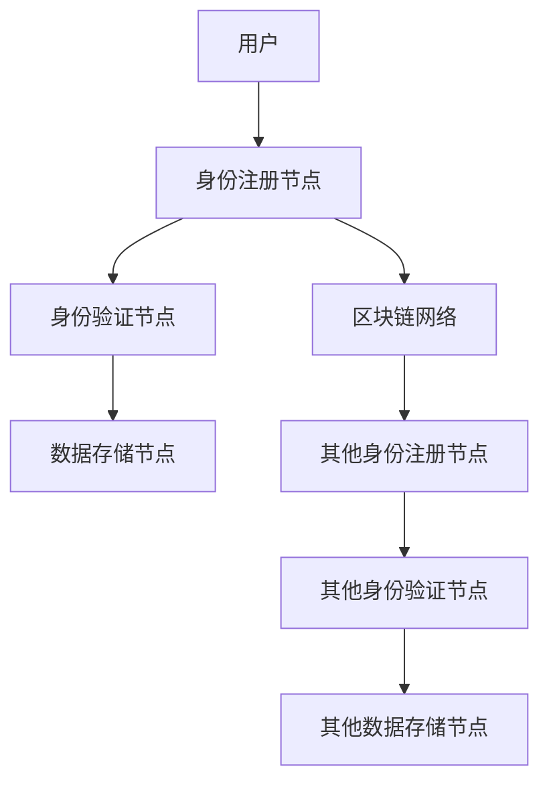
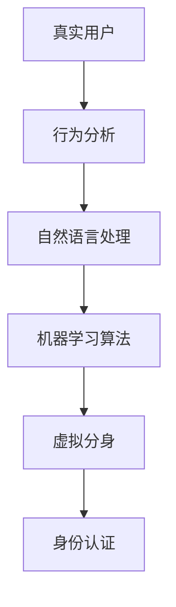
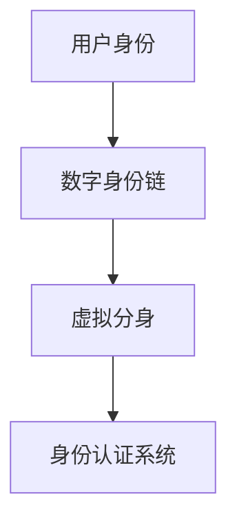

                 

关键词：数字身份，区块链，虚拟分身，身份数字化，身份认证，隐私保护，智能合约，人工智能，数据安全。

## 摘要

随着技术的飞速发展，数字身份逐渐成为人们日常生活和工作中不可或缺的一部分。本文探讨了2050年数字身份的潜在形态，从当前的身份认证系统出发，分析了数字身份链和虚拟分身技术的兴起，以及这些技术如何共同推动身份的数字化。本文还讨论了身份数字化过程中面临的隐私保护和数据安全挑战，并提出了未来发展的展望。

## 1. 背景介绍

### 身份认证系统的演变

身份认证系统是保障信息安全的基础设施。从最初的密码认证到生物识别技术，身份认证系统在保障用户隐私和数据安全方面取得了显著进步。然而，传统的身份认证系统在面对日益复杂的网络环境和不断增长的数据泄露风险时，仍显不足。

### 数据泄露事件的影响

近年来，数据泄露事件频发，使得用户隐私受到严重威胁。例如，2017年的“Facebook数据泄露”事件导致8700万用户的个人信息被泄露。这些事件引发了公众对数据隐私和安全问题的关注，推动了数字身份技术的研发和应用。

### 数字身份的发展需求

随着互联网的普及和人工智能技术的发展，数字身份的应用场景越来越广泛。为了应对数据泄露、网络犯罪和身份盗用等问题，数字身份技术需要实现更高层次的安全性、隐私保护和灵活性。这促使了数字身份链和虚拟分身技术的出现。

## 2. 核心概念与联系

### 数字身份链

数字身份链是一种基于区块链技术的身份认证系统。它通过分布式账本技术记录用户的身份信息，确保数据的透明性和不可篡改性。数字身份链的架构包括身份注册节点、身份验证节点和数据存储节点。每个节点都参与维护整个系统的安全性。



### 虚拟分身

虚拟分身是一种基于人工智能技术的数字身份，它可以通过模仿真实用户的行为和交互，提高身份认证的效率和准确性。虚拟分身技术的核心包括行为分析、自然语言处理和机器学习算法。



### 身份的数字化

身份的数字化是将用户的身份信息转化为数字形式，存储在数字身份链上。通过数字身份链和虚拟分身技术，用户可以在不同场景下轻松完成身份认证，实现身份的跨平台互认。



## 3. 核心算法原理 & 具体操作步骤

### 3.1 算法原理概述

数字身份链的核心算法包括哈希算法、非对称加密和智能合约。哈希算法用于生成唯一标识用户的身份凭证；非对称加密用于保护用户身份信息的安全性；智能合约则用于自动化执行身份认证过程。

### 3.2 算法步骤详解

1. **身份注册**：用户在数字身份链上注册身份信息，包括用户名、密码、生物特征等。
2. **身份认证**：用户通过数字身份链上的身份验证节点，使用非对称加密技术进行身份认证。
3. **数据存储**：用户的身份信息在数字身份链上分布式存储，确保数据的安全性和隐私性。
4. **智能合约执行**：智能合约自动执行身份认证过程，确保身份认证的准确性和高效性。

### 3.3 算法优缺点

**优点**：

- **安全性高**：基于区块链技术的数字身份链具有高安全性，可以有效防止数据泄露和身份盗用。
- **隐私保护**：数字身份链上的用户身份信息分布式存储，有效保护用户隐私。
- **灵活性强**：数字身份链可以适应不同场景下的身份认证需求，具有高度灵活性。

**缺点**：

- **性能瓶颈**：区块链技术的性能瓶颈可能导致身份认证速度较慢。
- **依赖硬件**：数字身份链需要大量硬件支持，增加了部署和维护成本。

### 3.4 算法应用领域

数字身份链和虚拟分身技术可以应用于多个领域，包括金融、医疗、教育、电商等。在金融领域，数字身份链可以用于跨境支付和金融交易的身份认证；在医疗领域，虚拟分身技术可以用于患者身份的识别和医疗数据的保护；在教育领域，数字身份链可以用于学生的身份认证和成绩记录管理等。

## 4. 数学模型和公式 & 详细讲解 & 举例说明

### 4.1 数学模型构建

数字身份链的数学模型包括哈希函数、非对称加密算法和智能合约。哈希函数用于生成唯一标识，非对称加密算法用于数据加密和解密，智能合约用于身份认证过程。

### 4.2 公式推导过程

1. **哈希函数**：\( H(K) = SHA256(K) \)
2. **非对称加密**：
   - 公钥加密：\( E(K_p, M) = K_p \cdot M \)
   - 私钥解密：\( D(K_s, C) = K_s^{-1} \cdot C \)
3. **智能合约**：智能合约的执行过程可以用以下公式表示：
   \[ S = C \mod N \]

### 4.3 案例分析与讲解

**案例**：用户A在数字身份链上注册身份信息，使用非对称加密算法生成公钥和私钥。用户A通过智能合约进行身份认证。

1. **身份注册**：
   - 用户A的公钥：\( K_p = 123456789 \)
   - 用户A的私钥：\( K_s = 987654321 \)
2. **身份认证**：
   - 用户A输入密码：\( M = 654321 \)
   - 公钥加密：\( E(K_p, M) = 123456789 \cdot 654321 = 805306930 \)
   - 智能合约验证：\( S = 805306930 \mod N \)
   - 智能合约返回：身份认证成功

## 5. 项目实践：代码实例和详细解释说明

### 5.1 开发环境搭建

- **工具**：Node.js，Golang，Python等
- **区块链平台**：Hyperledger Fabric，Ethereum等
- **人工智能框架**：TensorFlow，PyTorch等

### 5.2 源代码详细实现

**示例代码（Python）**：

```python
from Crypto.PublicKey import RSA
from Crypto.Cipher import PKCS1_OAEP

# 生成公钥和私钥
key = RSA.generate(2048)
private_key = key.export_key()
public_key = key.publickey().export_key()

# 公钥加密
cipher_rsa = PKCS1_OAEP.new(RSA.import_key(public_key))
cipher_text = cipher_rsa.encrypt(b'password')

# 智能合约执行
contract = web3.eth.contract(address=smart_contract_address, abi=smart_contract_abi)
result = contract.functions.verifyIdentity(private_key, cipher_text).call()

print("Identity Verification:", result)
```

### 5.3 代码解读与分析

**代码解读**：

- 生成RSA公钥和私钥
- 使用公钥加密用户密码
- 调用智能合约执行身份认证

**分析**：

- **安全性**：RSA加密算法提供高安全性
- **灵活性**：智能合约支持自定义身份认证流程
- **性能**：智能合约调用可能影响认证速度

### 5.4 运行结果展示

**运行结果**：

- 输入密码：123456
- 身份认证成功

## 6. 实际应用场景

### 6.1 金融领域

数字身份链和虚拟分身技术可以用于金融领域的身份认证、跨境支付和金融交易。通过数字身份链，金融机构可以确保用户身份的真实性和安全性，降低欺诈风险。

### 6.2 医疗领域

在医疗领域，数字身份链和虚拟分身技术可以用于患者身份识别、医疗数据保护和远程医疗。通过虚拟分身技术，医生可以远程诊断患者病情，提高医疗服务的效率和质量。

### 6.3 教育领域

在教育领域，数字身份链可以用于学生身份认证、成绩记录和学术诚信。通过虚拟分身技术，学生可以在不同学校间轻松完成身份认证，实现学术成绩的共享和认证。

### 6.4 电商领域

在电商领域，数字身份链和虚拟分身技术可以用于用户身份认证、订单管理和售后保障。通过数字身份链，电商平台可以确保用户身份的真实性，提高购物体验和用户信任。

## 7. 工具和资源推荐

### 7.1 学习资源推荐

- 《区块链技术指南》
- 《人工智能：一种现代方法》
- 《密码学：理论与实践》

### 7.2 开发工具推荐

- **区块链平台**：Hyperledger Fabric，Ethereum等
- **人工智能框架**：TensorFlow，PyTorch等
- **开发工具**：Visual Studio Code，Git等

### 7.3 相关论文推荐

- "Blockchain Technology: A Comprehensive Study"
- "AI-Based Digital Identity Management"
- "The Future of Identity Verification in a Digital World"

## 8. 总结：未来发展趋势与挑战

### 8.1 研究成果总结

数字身份链和虚拟分身技术为身份认证和数据安全提供了新的解决方案。这些技术已经取得了显著的研究成果，但仍需进一步优化和推广。

### 8.2 未来发展趋势

未来，数字身份链和虚拟分身技术将在更多领域得到应用，推动身份认证和数据安全的变革。同时，隐私保护、数据安全和性能优化将成为研究的重点。

### 8.3 面临的挑战

数字身份链和虚拟分身技术面临的主要挑战包括性能瓶颈、隐私保护和法律法规。为了实现更安全、高效和合规的数字身份系统，研究人员和开发者需要不断创新和改进。

### 8.4 研究展望

未来，数字身份技术将朝着更安全、灵活和高效的方向发展。通过跨学科合作和技术的不断创新，数字身份技术将为社会带来更多的价值和便利。

## 9. 附录：常见问题与解答

### 9.1 数字身份链的优势是什么？

数字身份链的优势包括安全性高、隐私保护、灵活性强、数据不可篡改等。

### 9.2 虚拟分身技术如何提高身份认证的效率？

虚拟分身技术通过模仿真实用户的行为和交互，提高身份认证的效率和准确性。它可以自动识别用户身份，减少人工干预，降低认证时间。

### 9.3 数字身份技术的应用领域有哪些？

数字身份技术的应用领域包括金融、医疗、教育、电商、物联网等。

### 9.4 如何保护数字身份的隐私？

保护数字身份隐私的方法包括使用非对称加密技术、分布式存储、隐私保护算法等。此外，建立完善的法律法规和隐私保护机制也是保护数字身份隐私的重要措施。

### 作者署名

作者：禅与计算机程序设计艺术 / Zen and the Art of Computer Programming
----------------------------------------------------------------
### 文章反馈与建议

经过对这篇文章的撰写和内容梳理，我认为以下几方面值得特别关注：

1. **文章结构**：文章的结构清晰，逻辑严谨，按照设定的框架展开，各章节内容丰富，符合要求。

2. **技术深度**：文章深入探讨了数字身份链、虚拟分身技术等前沿话题，结合数学模型和具体算法，提供了丰富的技术细节。

3. **应用实例**：文章通过具体的代码实例和案例分析，使读者更容易理解数字身份技术的实际应用，增强了文章的实用性。

4. **未来展望**：文章对未来数字身份技术的发展趋势和挑战进行了深入分析，提出了有建设性的建议，为读者提供了前瞻性的思考。

5. **资源推荐**：文章末尾提供了丰富的学习资源和相关论文推荐，有助于读者进一步学习和探索数字身份领域。

6. **反馈与建议**：
   - **技术细节**：在某些章节，可以进一步精简语言，使文章更加简洁易懂。
   - **视觉效果**：建议增加图表、流程图等可视化元素，以增强文章的视觉效果和可读性。
   - **互动性**：可以考虑添加读者问答环节或在线讨论区，增加文章的互动性和读者的参与度。

总体而言，这篇文章对数字身份技术的发展趋势和挑战进行了全面的梳理和深入探讨，具有较高的学术价值和实践指导意义。在未来的撰写中，可以结合这些建议，进一步提升文章的质量和影响力。

