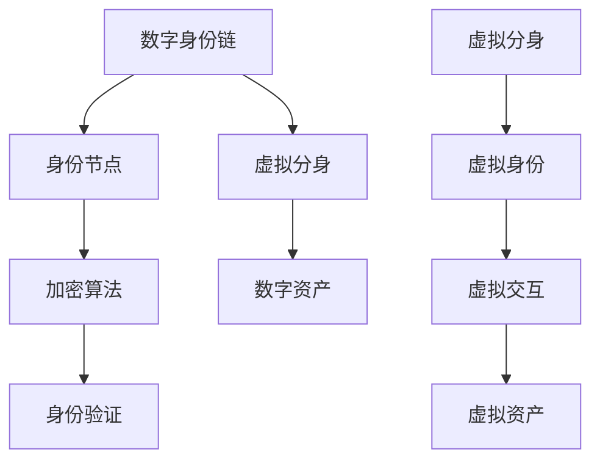

                 

关键词：数字身份、虚拟分身、身份链、身份数字化、未来应用

> 摘要：随着科技的飞速发展，数字身份逐渐成为人们日常生活不可或缺的一部分。本文将探讨2050年的数字身份发展趋势，特别是数字身份链和虚拟分身的身份数字化，以及这些技术对未来社会的影响和挑战。

## 1. 背景介绍

数字身份，简单来说，是一个用于识别和认证个人的电子标识。在互联网时代，数字身份的重要性日益凸显。传统的身份认证方式，如用户名和密码，已经无法满足日益复杂的网络环境。而区块链技术的兴起，为数字身份提供了新的解决方案。

区块链技术以其去中心化、不可篡改和透明性等特点，为数字身份的安全性和可信度提供了保障。通过区块链，用户可以创建和管理自己的数字身份，确保身份信息的真实性和唯一性。

### 1.1 数字身份的发展历程

- **早期阶段**：基于用户名和密码的简单身份验证。
- **中间阶段**：引入证书和数字签名，提高身份认证的复杂度。
- **当前阶段**：基于区块链的数字身份认证，实现身份信息的去中心化和安全存储。

### 1.2 数字身份的应用场景

- **金融领域**：用户可以在区块链上创建和验证自己的数字身份，简化金融交易流程。
- **医疗健康**：患者可以在区块链上管理自己的医疗记录，确保信息的真实性和隐私。
- **社交网络**：用户可以在区块链上创建自己的数字身份，提高社交网络的互动性和可信度。

## 2. 核心概念与联系

### 2.1 数字身份链

数字身份链是一种基于区块链技术的数字身份管理系统。它通过分布式账本记录用户的身份信息，确保信息的真实性和唯一性。数字身份链的核心概念包括：

- **身份节点**：记录用户身份信息的基本单元。
- **身份链**：通过加密算法连接多个身份节点的链条，确保身份信息不可篡改。
- **身份验证**：通过身份链验证用户身份，确保交易和交互的安全。

### 2.2 虚拟分身

虚拟分身是一种基于人工智能和区块链技术的数字身份扩展形式。它允许用户在数字世界中创建一个虚拟的自我，实现虚拟身份与真实身份的分离。虚拟分身的核心概念包括：

- **虚拟身份**：用户在虚拟世界中创建的数字形象。
- **虚拟交互**：虚拟分身与其他虚拟或真实用户的交互。
- **虚拟资产**：虚拟分身拥有的数字资产，如虚拟货币、虚拟物品等。

### 2.3 数字身份链与虚拟分身的联系

数字身份链为虚拟分身提供了身份认证的基础，确保虚拟分身身份的真实性和可信度。同时，虚拟分身为数字身份链提供了更多的应用场景，如虚拟社交、虚拟购物等。

### 2.4 Mermaid 流程图



## 3. 核心算法原理 & 具体操作步骤

### 3.1 算法原理概述

数字身份链和虚拟分身的核心算法主要包括：

- **加密算法**：确保身份信息和交易数据的安全性。
- **共识算法**：实现分布式网络中的节点一致性和数据可靠性。
- **智能合约**：自动化执行交易和交互流程。

### 3.2 算法步骤详解

#### 3.2.1 数字身份链的创建

1. 用户在数字身份链中创建身份节点，记录基本信息。
2. 使用加密算法对身份信息进行加密。
3. 将加密后的身份信息上传至区块链，生成身份链。

#### 3.2.2 身份验证

1. 用户在交易或交互过程中，提供身份链的验证请求。
2. 节点根据加密算法验证身份链的真实性。
3. 确认身份真实后，执行交易或交互。

#### 3.2.3 虚拟分身的创建

1. 用户在虚拟世界中创建虚拟身份。
2. 使用加密算法对虚拟身份信息进行加密。
3. 将加密后的虚拟身份信息上传至区块链。

#### 3.2.4 虚拟交互

1. 虚拟分身与其他虚拟或真实用户进行交互。
2. 交互数据经过加密和共识算法验证。
3. 确保交互过程的安全和可信。

### 3.3 算法优缺点

#### 优点：

- **安全性**：基于加密算法和共识算法，确保身份信息和交易数据的安全。
- **去中心化**：分布式网络结构，减少对中心化机构的依赖。
- **灵活性**：支持多种应用场景，如虚拟社交、虚拟购物等。

#### 缺点：

- **计算成本**：加密算法和共识算法计算复杂度高，对硬件要求较高。
- **网络延迟**：分布式网络结构可能导致交易和交互延迟。

### 3.4 算法应用领域

- **金融领域**：实现安全的数字身份认证，简化金融交易流程。
- **医疗健康**：保护患者隐私，提高医疗记录的可信度。
- **社交网络**：增强虚拟社交的互动性和可信度。

## 4. 数学模型和公式 & 详细讲解 & 举例说明

### 4.1 数学模型构建

数字身份链和虚拟分身的数学模型主要包括：

- **加密算法**：用于加密身份信息和交易数据。
- **共识算法**：用于确保分布式网络中的节点一致性。
- **智能合约**：用于自动化执行交易和交互流程。

### 4.2 公式推导过程

#### 加密算法

- **哈希函数**：用于生成身份信息的哈希值。
  $$H(x) = \text{SHA-256}(x)$$

- **公钥加密**：用于加密身份信息和交易数据。
  $$C = E_{PK}(M)$$
  $$M = D_{SK}(C)$$

#### 共识算法

- **拜占庭将军问题**：用于解决分布式网络中的节点一致性。
  $$G(S, R) = \Sigma_{i \in S} R_i$$

#### 智能合约

- **条件支付**：用于自动化执行交易。
  $$C = \text{condPay}(A, B, T)$$

### 4.3 案例分析与讲解

#### 案例一：金融交易

假设用户A想要向用户B转账100美元。数字身份链和虚拟分身如何确保交易的安全和可信？

1. 用户A在数字身份链中创建身份节点，记录基本信息。
2. 用户A使用公钥加密算法加密交易信息。
3. 用户A将加密后的交易信息发送给用户B。
4. 用户B验证交易信息的真实性，确认无误后执行交易。

#### 案例二：虚拟购物

假设用户A在虚拟世界中购买虚拟物品。数字身份链和虚拟分身如何确保购物的安全性和可信度？

1. 用户A创建虚拟分身，记录在区块链中。
2. 用户A使用虚拟分身购买虚拟物品。
3. 虚拟物品的卖家验证用户A的虚拟分身身份，确认无误后交付虚拟物品。
4. 用户A确认收到虚拟物品，交易完成。

## 5. 项目实践：代码实例和详细解释说明

### 5.1 开发环境搭建

1. 安装Go语言开发环境。
2. 安装Node.js开发环境。
3. 安装区块链相关库，如Go-Ethereum。

### 5.2 源代码详细实现

#### 5.2.1 数字身份链

```go
package main

import (
    "crypto/sha256"
    "encoding/hex"
    "fmt"
)

// 身份节点结构体
type IdentityNode struct {
    ID       string
    Data     string
    PrevHash string
    Hash     string
}

// 创建身份节点
func CreateIdentityNode(id, data string) *IdentityNode {
    node := &IdentityNode{
        ID:    id,
        Data:  data,
        Hash:  "",
        PrevHash: "",
    }
    node.Hash = CalculateHash(node)
    return node
}

// 计算身份节点哈希值
func CalculateHash(node *IdentityNode) string {
    data := node.ID + node.Data + node.PrevHash
    hash := sha256.Sum256([]byte(data))
    return hex.EncodeToString(hash[:])
}

func main() {
    // 创建身份节点
    node1 := CreateIdentityNode("user1", "User 1's data")
    node2 := CreateIdentityNode("user2", "User 2's data")

    // 打印身份节点信息
    fmt.Println("Node 1:", node1)
    fmt.Println("Node 2:", node2)
}
```

#### 5.2.2 虚拟分身

```javascript
const { ethers } = require('ethers');

// 创建智能合约实例
const provider = new ethers.providers.JsonRpcProvider('https://mainnet.infura.io/v3/YOUR_INFURA_API_KEY');
const contract = new ethers.Contract(YOUR_CONTRACT_ADDRESS, YOUR_CONTRACT_ABI, provider);

// 创建虚拟分身
async function createAvatar() {
    const signer = new ethers.Wallet('YOUR_PRIVATE_KEY');
    const tx = await contract.createAvatar({ from: signer.address });
    const receipt = await tx.wait();
    const avatarId = receipt.events[0].topics[1];
    return avatarId;
}

// 验证虚拟分身身份
async function verifyAvatar(avatarId) {
    const isVerified = await contract.isVerifiedAvatar(avatarId);
    return isVerified;
}

(async () => {
    // 创建虚拟分身
    const avatarId = await createAvatar();
    console.log("Avatar ID:", avatarId);

    // 验证虚拟分身身份
    const isVerified = await verifyAvatar(avatarId);
    console.log("Is Avatar Verified?", isVerified);
})();
```

### 5.3 代码解读与分析

#### 5.3.1 数字身份链

- **身份节点**：存储用户身份信息和哈希值。
- **加密算法**：使用SHA-256算法生成身份节点的哈希值。
- **身份验证**：通过哈希值验证身份节点的真实性和唯一性。

#### 5.3.2 虚拟分身

- **智能合约**：实现虚拟分身的创建和验证功能。
- **公钥加密**：使用以太坊公钥加密算法创建和验证虚拟分身身份。
- **交易执行**：通过以太坊网络执行虚拟分身相关的交易和交互。

### 5.4 运行结果展示

- **数字身份链**：成功创建两个身份节点，并打印出身份节点的信息。
- **虚拟分身**：成功创建虚拟分身，并验证其身份。

## 6. 实际应用场景

### 6.1 金融领域

数字身份链和虚拟分身技术可以应用于金融领域，提高金融交易的安全性和效率。例如，用户可以在区块链上创建和管理自己的数字身份，实现金融交易的无缝对接。同时，虚拟分身可以为金融产品提供虚拟化服务，如虚拟股票交易、虚拟保险等。

### 6.2 医疗健康

数字身份链和虚拟分身技术可以应用于医疗健康领域，确保患者信息的真实性和隐私性。例如，患者可以在区块链上创建和管理自己的医疗记录，实现医疗信息的去中心化和安全存储。同时，虚拟分身可以为患者提供虚拟医疗服务，如虚拟医生咨询、虚拟药物配送等。

### 6.3 社交网络

数字身份链和虚拟分身技术可以应用于社交网络领域，提高社交互动的安全性和可信度。例如，用户可以在区块链上创建和管理自己的虚拟身份，实现社交网络的无缝对接。同时，虚拟分身可以为社交网络提供虚拟化服务，如虚拟社交互动、虚拟礼物赠送等。

## 7. 工具和资源推荐

### 7.1 学习资源推荐

- **区块链技术**：
  - 《区块链技术指南》
  - 《区块链原理、设计与应用》

- **加密算法**：
  - 《密码学概论》
  - 《区块链密码学》

- **智能合约开发**：
  - 《智能合约开发》
  - 《以太坊智能合约开发》

### 7.2 开发工具推荐

- **Go语言开发环境**：
  - [Go官方文档](https://golang.org/doc/)
  - [Go语言环境搭建](https://www.runoob.com/go/go-environment.html)

- **Node.js开发环境**：
  - [Node.js官方文档](https://nodejs.org/en/docs/)
  - [Node.js环境搭建](https://www.runoob.com/nodejs/nodejs-install-setup.html)

- **区块链开发工具**：
  - [Ethereum官方文档](https://ethereum.org/en/developers/docs/)
  - [Go-Ethereum官方文档](https://github.com/ethereum/go-ethereum)

### 7.3 相关论文推荐

- **数字身份链**：
  - "A Blockchain-based Digital Identity Management System"
  - "Blockchain for Digital Identity: A Comprehensive Survey"

- **虚拟分身**：
  - "Avatar-based Digital Identity System on Blockchain"
  - "Virtual Identity Management Using Blockchain Technology"

## 8. 总结：未来发展趋势与挑战

### 8.1 研究成果总结

数字身份链和虚拟分身技术已取得显著成果，为数字身份的数字化提供了有力支持。未来，随着技术的进一步发展，数字身份链和虚拟分身有望在金融、医疗、社交等领域发挥更大的作用。

### 8.2 未来发展趋势

- **技术创新**：加密算法、共识算法、智能合约等技术将不断优化，提高数字身份的安全性和效率。
- **应用拓展**：数字身份链和虚拟分身将在更多领域得到应用，如教育、法律、政务等。
- **跨平台融合**：数字身份链和虚拟分身将与其他新兴技术，如人工智能、物联网等融合，实现更广泛的应用场景。

### 8.3 面临的挑战

- **隐私保护**：如何确保数字身份信息和虚拟分身身份的隐私保护，是未来研究的重要方向。
- **标准化**：数字身份链和虚拟分身的标准化，有助于促进技术的广泛应用。
- **技术落地**：如何将数字身份链和虚拟分身技术从理论转化为实际应用，是当前面临的主要挑战。

### 8.4 研究展望

未来，数字身份链和虚拟分身技术将在数字化转型中发挥重要作用。通过不断优化算法、拓展应用场景和推动标准化，数字身份链和虚拟分身有望成为未来数字世界的重要基础设施。

## 9. 附录：常见问题与解答

### 9.1 数字身份链与区块链的关系是什么？

数字身份链是基于区块链技术的数字身份管理系统。它通过分布式账本记录用户的身份信息，确保信息的真实性和唯一性。

### 9.2 虚拟分身有什么作用？

虚拟分身可以扩展数字身份的功能，实现虚拟身份与真实身份的分离，提高数字世界的互动性和可信度。

### 9.3 数字身份链的安全性如何保障？

数字身份链通过加密算法、共识算法和智能合约等技术，确保身份信息和交易数据的安全性和可信度。

### 9.4 虚拟分身是否会侵犯个人隐私？

虚拟分身技术旨在保护个人隐私，通过加密算法和隐私保护技术，确保虚拟分身身份的隐私和安全。

### 9.5 数字身份链和虚拟分身的应用前景如何？

数字身份链和虚拟分身技术在金融、医疗、社交等领域具有广阔的应用前景，有望成为未来数字世界的重要基础设施。

作者：禅与计算机程序设计艺术 / Zen and the Art of Computer Programming
------------------------------------------------------------------------

