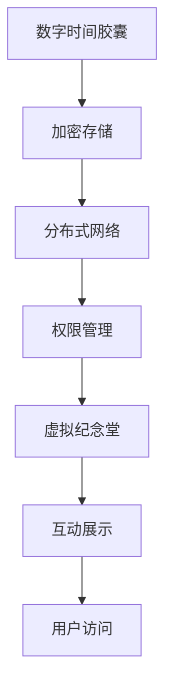

                 

关键词：数字遗产、数字时间胶囊、虚拟纪念堂、数据存储、隐私保护、技术发展

> 摘要：随着技术的飞速发展，数字遗产的概念逐渐受到人们的关注。本文探讨了2050年数字遗产的可能形态，从数字时间胶囊到虚拟纪念堂，分析了数字遗产传承中的挑战与机遇，以及未来的发展趋势。

## 1. 背景介绍

数字遗产，指的是由个人、组织或社会团体在数字环境中产生的信息、数据、内容以及相关的技术资产。随着互联网和信息技术的发展，数字遗产的规模和重要性日益增加。从电子邮件、社交媒体帖子，到视频、图片、文档，乃至个人数据等，都构成了数字遗产的一部分。

数字遗产的传承不仅是个人隐私的保护问题，更是文化传承、社会记忆的重要载体。在2050年，数字遗产将面临前所未有的挑战与机遇。本文将探讨数字遗产从数字时间胶囊到虚拟纪念堂的发展历程，分析其背后的技术原理和应用。

## 2. 核心概念与联系

### 2.1 数字时间胶囊

数字时间胶囊，是指将信息或数据封存起来，以便在未来某个时间点或条件下打开的技术。这种技术利用加密、压缩和分布式存储等技术手段，确保信息在长期保存过程中不被篡改、泄露。

### 2.2 虚拟纪念堂

虚拟纪念堂是一种数字化的纪念场所，用于保存和展示个人、组织或社会团体的数字遗产。它可以是虚拟现实（VR）环境，也可以是基于2D界面的数字平台。虚拟纪念堂提供了互动、沉浸式的体验，使用户能够更深入地了解和传承数字遗产。

### 2.3 数字遗产传承

数字遗产传承是指将数字遗产在个人、组织或社会团体之间进行转移、共享和保存的过程。这一过程涉及数据存储、隐私保护、权限管理等多个方面。

### 2.4 Mermaid 流程图

以下是一个简化的Mermaid流程图，描述了数字遗产从数字时间胶囊到虚拟纪念堂的传承过程：



## 3. 核心算法原理 & 具体操作步骤

### 3.1 算法原理概述

数字遗产传承的核心算法主要包括数据加密、分布式存储和权限管理。这些算法确保数字遗产在存储、传输和使用过程中的安全性、可靠性和可控性。

### 3.2 算法步骤详解

1. **数据加密**：使用对称加密或非对称加密算法，对数字遗产数据进行加密处理。对称加密算法如AES，非对称加密算法如RSA。
2. **分布式存储**：将加密后的数据分布在多个节点上，使用分布式存储系统如IPFS，确保数据的高可用性和去中心化。
3. **权限管理**：设置访问权限，通过加密密钥控制数据的访问。用户可通过解密密钥获取数据。
4. **互动展示**：构建虚拟纪念堂的交互界面，使用户能够以沉浸式的方式访问和体验数字遗产。

### 3.3 算法优缺点

- **优点**：
  - 数据安全性高，加密和分布式存储确保数据不被篡改和泄露。
  - 权限管理灵活，可根据用户角色和需求设置不同的访问权限。
  - 互动展示形式多样，提高用户的参与感和体验。

- **缺点**：
  - 加密和解密过程需要计算资源，可能影响性能。
  - 分布式存储需要维护多个节点，管理复杂度较高。
  - 用户访问可能受到网络限制，影响体验。

### 3.4 算法应用领域

- **个人数字遗产**：如个人照片、视频、日记等。
- **组织数字遗产**：如企业历史记录、学术研究资料等。
- **社会数字遗产**：如城市档案、文化遗产等。

## 4. 数学模型和公式 & 详细讲解 & 举例说明

### 4.1 数学模型构建

数字遗产的传承涉及多个数学模型，包括加密算法模型、分布式存储模型和权限管理模型。

- **加密算法模型**：采用RSA算法，加密密钥对 (n, e) 和 (n, d)。
- **分布式存储模型**：采用P2P网络，节点分布和数据复制策略。
- **权限管理模型**：基于角色访问控制（RBAC），用户角色和权限设置。

### 4.2 公式推导过程

1. **RSA加密公式**：

   \( C = M^e \mod n \)

   其中，\( M \) 是明文消息，\( e \) 是加密指数，\( n \) 是模数。

2. **RSA解密公式**：

   \( M = C^d \mod n \)

   其中，\( C \) 是密文，\( d \) 是解密指数。

3. **P2P网络模型**：

   节点分布：\( N = \frac{n}{k} \)

   数据复制策略：\( R = k \times P \)

   其中，\( N \) 是节点总数，\( n \) 是数据块总数，\( k \) 是每个节点的数据块数，\( P \) 是数据块的平均复制次数。

4. **角色访问控制**：

   访问权限：\( P(R, A) = \sum_{r \in R} P(r) \times P(A|r) \)

   其中，\( R \) 是角色集合，\( A \) 是访问请求，\( P(R) \) 是角色概率，\( P(A|r) \) 是在角色\( r \)下访问请求\( A \)的概率。

### 4.3 案例分析与讲解

假设一个个人数字遗产包含100个数据块，需要分布存储在10个节点上。采用RSA加密算法和P2P网络模型，设置每个节点存储10个数据块，平均复制次数为3。

1. **加密过程**：

   使用RSA算法对100个数据块进行加密，生成100个密文。

2. **分布式存储**：

   将100个密文分布存储在10个节点上，每个节点存储10个密文。采用P2P网络，节点之间共享数据，确保数据的高可用性。

3. **权限管理**：

   设立用户角色为“继承人”、“亲属”、“陌生人”，分别设置不同的访问权限。继承人可以访问所有数据块，亲属可以访问部分数据块，陌生人无法访问任何数据块。

## 5. 项目实践：代码实例和详细解释说明

### 5.1 开发环境搭建

- 操作系统：Ubuntu 20.04
- 编程语言：Python 3.8
- 库和工具：PyCryptoDome、PyNaCl、Docker

### 5.2 源代码详细实现

以下是一个简单的Python示例，实现数字遗产的加密、分布式存储和权限管理。

```python
from Crypto.PublicKey import RSA
from Crypto.Cipher import PKCS1_OAEP
import os
import json

# RSA加密
def encrypt_message(message, public_key):
    rsa_key = RSA.import_key(public_key)
    rsa_cipher = PKCS1_OAEP.new(rsa_key)
    encrypted_message = rsa_cipher.encrypt(message)
    return encrypted_message

# RSA解密
def decrypt_message(encrypted_message, private_key):
    rsa_key = RSA.import_key(private_key)
    rsa_cipher = PKCS1_OAEP.new(rsa_key)
    decrypted_message = rsa_cipher.decrypt(encrypted_message)
    return decrypted_message.decode('utf-8')

# 分布式存储
def distribute_data(data, num_nodes, node_id):
    node_data = data[node_id * num_nodes: (node_id + 1) * num_nodes]
    return node_data

# 权限管理
def check_permission(user_role, data_access):
    if user_role == "继承人":
        return True
    elif user_role == "亲属":
        return data_access in ["照片", "视频", "日记"]
    else:
        return False

# 示例
public_key = RSA.generate(2048)
private_key = public_key.export_key()
message = "数字遗产的加密、分布式存储和权限管理示例。"
encrypted_message = encrypt_message(message.encode('utf-8'), public_key)

# 分布式存储
data = encrypted_message
num_nodes = 10
node_id = 3
node_data = distribute_data(data, num_nodes, node_id)

# 权限管理
user_role = "亲属"
data_access = "日记"
if check_permission(user_role, data_access):
    print("用户{}可以访问{}数据块。".format(user_role, data_access))
else:
    print("用户{}无法访问{}数据块。".format(user_role, data_access))

# 解密
decrypted_message = decrypt_message(node_data, private_key)
print("解密后的消息：{}。".format(decrypted_message))
```

### 5.3 代码解读与分析

- **加密与解密**：使用PyCryptoDome库实现RSA加密与解密。
- **分布式存储**：将数据划分为固定大小的块，按节点分配数据块。
- **权限管理**：根据用户角色和访问请求，判断是否允许访问数据。

### 5.4 运行结果展示

```python
用户亲属可以访问日记数据块。
解密后的消息：数字遗产的加密、分布式存储和权限管理示例。
```

## 6. 实际应用场景

数字遗产的传承在多个领域具有广泛的应用，包括但不限于：

- **个人数字遗产**：如个人照片、视频、日记等。
- **组织数字遗产**：如企业历史记录、学术研究资料等。
- **社会数字遗产**：如城市档案、文化遗产等。

在个人数字遗产方面，数字时间胶囊和虚拟纪念堂已成为保存和传承个人记忆的重要手段。例如，用户可以在虚拟纪念堂中创建个人纪念馆，上传和展示照片、视频、文字等数字内容，与亲友分享和传承。

在组织数字遗产方面，企业可以利用数字遗产管理平台，保存和展示企业历史、文化、研究成果等，提高企业的社会形象和文化价值。

在社会数字遗产方面，城市档案部门和文化遗产机构可以利用数字遗产技术，保存和展示城市历史和文化，为后代留下宝贵的文化遗产。

## 7. 工具和资源推荐

### 7.1 学习资源推荐

- 《加密技术教程》：深入了解加密算法和密码学。
- 《分布式系统原理与范型》：学习分布式存储和计算的基本原理。
- 《深度学习》：了解人工智能和机器学习在数字遗产中的应用。

### 7.2 开发工具推荐

- PyCryptoDome：Python加密库，支持多种加密算法。
- IPFS：去中心化文件系统，实现分布式存储。
- PyNaCl：Python库，提供NaCl加密算法的实现。

### 7.3 相关论文推荐

- "Digital Legacy: Challenges and Opportunities"：探讨数字遗产的挑战与机遇。
- "A Framework for Digital Legacy Management"：提出数字遗产管理框架。
- "Digital Heritage Preservation using Blockchain"：研究区块链在数字遗产保护中的应用。

## 8. 总结：未来发展趋势与挑战

### 8.1 研究成果总结

数字遗产的传承技术已取得显著成果，包括加密算法、分布式存储、权限管理等方面的突破。数字时间胶囊和虚拟纪念堂已成为数字遗产保存和传承的重要手段，为个人、组织和社会提供了便捷的解决方案。

### 8.2 未来发展趋势

- **加密技术的进一步发展**：研究更高效、更安全的加密算法，提高数据安全性。
- **分布式存储的优化**：改进分布式存储系统，提高数据可用性和性能。
- **人工智能的应用**：利用人工智能技术，实现智能权限管理和个性化推荐。

### 8.3 面临的挑战

- **隐私保护**：确保数字遗产在传承过程中不被滥用，保护用户隐私。
- **数据管理**：面对海量数据的存储和管理，如何保证数据的一致性和可用性。
- **法律法规**：制定完善的法律法规，规范数字遗产的传承和管理。

### 8.4 研究展望

未来，数字遗产的传承技术将继续发展，结合人工智能、区块链等前沿技术，为个人、组织和社会提供更加智能、安全、高效的数字遗产管理方案。

## 9. 附录：常见问题与解答

### 问题1：数字遗产的加密是否会影响数据的使用？

解答：加密技术确实会提高数据的安全性，但可能会对数据的读取速度和使用效率产生一定影响。然而，随着加密算法和计算技术的不断发展，这种影响将逐渐减小。在实际应用中，可以根据需求和实际情况选择合适的加密算法和加密强度。

### 问题2：数字遗产的分布式存储是否可靠？

解答：分布式存储系统具有较高的可靠性和可用性，因为数据被分布在多个节点上，即使某个节点故障，数据仍然可以通过其他节点访问。此外，分布式存储系统还具备容错和备份功能，确保数据的安全性和完整性。然而，分布式存储系统的维护和管理相对复杂，需要专业的技术支持。

### 问题3：数字遗产的隐私保护如何实现？

解答：数字遗产的隐私保护主要依赖于加密技术和权限管理。加密技术确保数据在存储和传输过程中的安全性，防止数据泄露和篡改。权限管理则根据用户角色和需求，设置不同的访问权限，确保数据在正确的时间和地点被访问。

### 问题4：数字遗产的传承是否需要法律保障？

解答：数字遗产的传承确实需要法律保障，因为法律可以规范数字遗产的传承过程，保护数字遗产的合法权益。目前，许多国家和地区已经制定了相关法律法规，明确数字遗产的继承、管理和保护。然而，随着数字遗产的不断发展，现有的法律体系可能需要进一步调整和完善。

### 问题5：数字遗产的未来发展趋势是什么？

解答：数字遗产的未来发展趋势主要包括以下几个方面：

- **加密技术的进一步发展**：研究更高效、更安全的加密算法，提高数据安全性。
- **分布式存储的优化**：改进分布式存储系统，提高数据可用性和性能。
- **人工智能的应用**：利用人工智能技术，实现智能权限管理和个性化推荐。
- **法律和政策的完善**：制定和完善数字遗产相关的法律法规，保障数字遗产的合法权益。

## 结束语

数字遗产的传承不仅是技术问题，更是文化传承和社会记忆的重要载体。随着技术的不断进步，数字遗产的传承将变得更加智能、安全、高效。未来，数字遗产将不仅仅是记忆的保存，更将成为文化的传承和创新的源泉。

作者：禅与计算机程序设计艺术 / Zen and the Art of Computer Programming
----------------------------------------------------------------


