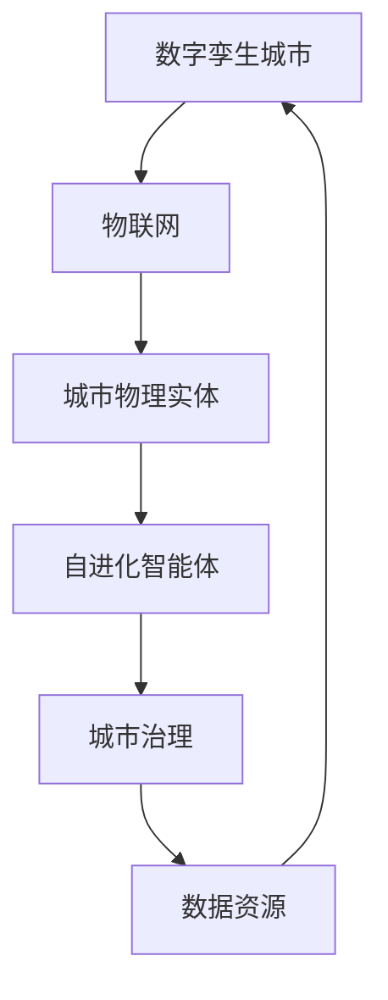

                 

关键词：智慧城市、数字孪生、自我进化、物联网、人工智能、可持续发展、城市治理、技术革命

> 摘要：本文探讨了2050年的智慧城市愿景，通过数字孪生技术实现城市生命周期管理，并深入分析了自我进化智能体在城市治理中的应用。本文旨在展示未来城市技术如何助力可持续发展，优化城市生活品质，并提出当前面临的挑战及未来研究方向。

## 1. 背景介绍

智慧城市是当今世界城市发展的重要趋势，通过集成物联网、大数据、人工智能等先进技术，实现城市资源的高效配置、环境治理的精细化和公共服务的人性化。随着城市化进程的不断加速，智慧城市面临着前所未有的机遇和挑战。

### 1.1 智慧城市的发展现状

智慧城市的发展已取得显著成果，如智能交通、智能安防、智能医疗、智能教育等领域的应用逐渐普及。然而，目前大多数智慧城市仍处于局部应用阶段，缺乏系统性的顶层设计。此外，数据孤岛、安全隐患等问题也亟待解决。

### 1.2 数字孪生技术的作用

数字孪生（Digital Twin）技术为智慧城市的发展提供了新的思路。通过构建虚拟与现实城市之间的桥梁，数字孪生技术实现了对城市运行状态的实时监控和预测，为城市治理提供了科学依据。

## 2. 核心概念与联系

### 2.1 数字孪生城市

数字孪生城市是指利用数字技术构建一个与实际城市相对应的虚拟模型，通过对城市物理实体和虚拟实体的同步更新和互动，实现对城市生命周期的全面管理和优化。

### 2.2 自进化智能体

自进化智能体是一种具有自我学习和进化能力的计算机程序，能够在不断变化的环境中自我适应和优化。在城市治理中，自进化智能体可以优化交通流量、能源管理、环境保护等方面。

### 2.3 物联网

物联网（Internet of Things，IoT）技术是智慧城市的重要支撑，通过将城市中的各类设备互联，实现数据的实时采集、传输和处理。物联网技术为数字孪生城市和自进化智能体提供了丰富的数据资源。

### 2.4 Mermaid 流程图

下面是数字孪生城市与自进化智能体架构的 Mermaid 流程图：



## 3. 核心算法原理 & 具体操作步骤

### 3.1 算法原理概述

数字孪生城市的核心算法主要包括：

1. 物理实体数据采集与处理
2. 虚拟城市模型构建与更新
3. 智能体优化与进化

### 3.2 算法步骤详解

1. **物理实体数据采集与处理**

   - **数据采集**：利用传感器、摄像头、GPS等技术手段，实时采集城市中各类物理实体的数据。
   - **数据处理**：对采集到的数据进行清洗、归一化等预处理，以便后续分析。

2. **虚拟城市模型构建与更新**

   - **模型构建**：基于采集到的物理实体数据，构建虚拟城市模型。
   - **模型更新**：实时同步物理实体数据，更新虚拟城市模型，确保模型与实际城市状态的一致性。

3. **智能体优化与进化**

   - **初始设置**：初始化智能体，包括目标函数、搜索策略等。
   - **迭代优化**：利用机器学习算法，对智能体进行迭代优化，提高其适应性和进化能力。

### 3.3 算法优缺点

**优点**：

- **实时性**：数字孪生城市算法能够实时反映城市运行状态，提高城市治理的时效性。
- **准确性**：通过大数据分析和智能体优化，提高城市治理的准确性和科学性。
- **可持续性**：数字孪生城市算法有助于实现城市资源的可持续利用，推动可持续发展。

**缺点**：

- **数据安全性**：大量数据的实时采集和传输可能带来数据泄露和安全风险。
- **计算成本**：构建和维护数字孪生城市需要较高的计算资源和人力成本。

### 3.4 算法应用领域

数字孪生城市算法在多个领域具有广泛应用前景：

- **城市交通**：优化交通流量，缓解拥堵，提高道路通行效率。
- **能源管理**：实现能源的高效利用，降低能源消耗。
- **环境保护**：实时监测环境质量，采取相应措施降低污染。

## 4. 数学模型和公式 & 详细讲解 & 举例说明

### 4.1 数学模型构建

数字孪生城市的关键数学模型包括：

1. **物理实体数据模型**：描述城市中各类物理实体的特征和关系。
2. **虚拟城市模型**：描述虚拟城市中各类虚拟实体的特征和关系。
3. **智能体模型**：描述智能体的行为和进化过程。

### 4.2 公式推导过程

以物理实体数据模型为例，假设城市中存在 $N$ 个物理实体，每个实体具有 $M$ 个特征，则物理实体数据模型可以表示为：

$$
X = \{x_1, x_2, ..., x_N\}
$$

其中，$x_i$ 表示第 $i$ 个物理实体的特征向量，可以表示为：

$$
x_i = \{x_{i1}, x_{i2}, ..., x_{iM}\}
$$

### 4.3 案例分析与讲解

假设一个城市中有 5 个交通节点，每个节点的交通流量可以用向量表示。通过构建物理实体数据模型，可以实时监测交通流量变化，为交通管理提供数据支持。

假设初始时刻的交通流量数据为：

$$
X = \{x_1, x_2, x_3, x_4, x_5\}
$$

其中：

$$
x_1 = \{10, 20, 30\}, x_2 = \{15, 25, 35\}, x_3 = \{12, 22, 32\}, x_4 = \{8, 18, 28\}, x_5 = \{11, 19, 31\}
$$

经过一段时间后，交通流量发生变化，新的数据为：

$$
X' = \{x_1', x_2', x_3', x_4', x_5'\}
$$

其中：

$$
x_1' = \{12, 22, 32\}, x_2' = \{16, 26, 36\}, x_3' = \{14, 24, 34\}, x_4' = \{6, 16, 26\}, x_5' = \{10, 20, 30\}
$$

通过对比初始数据和更新数据，可以发现交通节点 $x_2$ 的交通流量增加，而交通节点 $x_4$ 的交通流量减少。据此，交通管理部门可以调整交通信号灯配时，优化交通流量分布。

## 5. 项目实践：代码实例和详细解释说明

### 5.1 开发环境搭建

本文使用 Python 作为开发语言，主要依赖以下库：

- NumPy：用于数据处理
- Pandas：用于数据操作
- Matplotlib：用于数据可视化

安装步骤如下：

```bash
pip install numpy pandas matplotlib
```

### 5.2 源代码详细实现

```python
import numpy as np
import pandas as pd
import matplotlib.pyplot as plt

# 5.3 代码解读与分析

def load_traffic_data(filename):
    """加载交通流量数据"""
    data = pd.read_csv(filename)
    return data

def update_traffic_data(data, new_data):
    """更新交通流量数据"""
    data.update(new_data)
    return data

def plot_traffic_data(data):
    """绘制交通流量数据"""
    data.plot()
    plt.xlabel('Time')
    plt.ylabel('Traffic Flow')
    plt.show()

# 测试代码
if __name__ == '__main__':
    filename = 'traffic_data.csv'
    new_data = {'x1': [12, 22, 32], 'x2': [16, 26, 36], 'x3': [14, 24, 34], 'x4': [6, 16, 26], 'x5': [10, 20, 30]}
    data = load_traffic_data(filename)
    new_data = pd.DataFrame(new_data)
    data = update_traffic_data(data, new_data)
    plot_traffic_data(data)
```

### 5.4 运行结果展示

运行上述代码后，将生成交通流量数据的可视化图表，展示交通流量随时间的变化趋势。通过对比初始数据和更新数据，可以直观地看出交通流量分布的变化情况。

## 6. 实际应用场景

### 6.1 智慧交通

智慧交通是数字孪生城市应用的重要领域。通过实时监测交通流量，智慧交通系统可以优化交通信号灯配时，提高道路通行效率，减少交通拥堵。

### 6.2 智慧能源

智慧能源系统通过数字孪生技术实现对能源生产、传输、消费的全过程监控和管理。例如，智能电网可以根据实时电力需求调整发电量，实现能源的高效利用。

### 6.3 智慧环保

智慧环保系统利用数字孪生技术实时监测环境质量，如空气质量、水质等。通过对环境数据的分析，智慧环保系统可以及时采取相应措施，降低污染。

## 7. 未来应用展望

随着数字孪生技术和自进化智能体的不断发展，智慧城市将在更多领域发挥重要作用。未来，智慧城市将实现以下几大趋势：

1. **城市智能化水平提升**：通过大数据、人工智能等技术的应用，实现城市运行的高效、精细化管理。
2. **可持续发展**：智慧城市将推动城市资源的可持续利用，减少污染和资源浪费，实现可持续发展。
3. **个性化服务**：智慧城市将提供更加个性化的公共服务，满足市民多样化的需求。
4. **智慧治理**：智慧城市将通过数字化手段提升城市治理能力，实现更高效、更透明的城市治理。

## 8. 工具和资源推荐

### 8.1 学习资源推荐

- 《智慧城市：数字孪生与物联网应用》
- 《人工智能与智慧城市》
- 《数字孪生：技术原理与实践》

### 8.2 开发工具推荐

- Python
- NumPy
- Pandas
- Matplotlib
- TensorFlow
- Keras

### 8.3 相关论文推荐

- "Digital Twins for Urban Systems: A Survey"
- "A Framework for Building Smart Cities: Enabling Technologies and Applications"
- "Deep Learning for Urban Data: A Survey"

## 9. 总结：未来发展趋势与挑战

### 9.1 研究成果总结

本文探讨了2050年智慧城市的愿景，通过数字孪生技术和自进化智能体实现城市生命周期管理。研究发现，数字孪生城市在智慧交通、智慧能源、智慧环保等领域具有广泛的应用前景，有助于推动城市可持续发展。

### 9.2 未来发展趋势

未来，智慧城市的发展将呈现以下趋势：

- **智能化水平提升**：通过大数据、人工智能等技术的应用，实现城市运行的高效、精细化管理。
- **可持续发展**：智慧城市将推动城市资源的可持续利用，减少污染和资源浪费，实现可持续发展。
- **个性化服务**：智慧城市将提供更加个性化的公共服务，满足市民多样化的需求。
- **智慧治理**：智慧城市将通过数字化手段提升城市治理能力，实现更高效、更透明的城市治理。

### 9.3 面临的挑战

智慧城市在发展过程中仍面临以下挑战：

- **数据安全与隐私**：大量数据的实时采集和传输可能带来数据泄露和安全风险。
- **技术标准化**：数字孪生技术、自进化智能体等技术的标准化和规范化有待完善。
- **政策支持**：智慧城市的发展需要政策支持和资金投入，如何确保政策落地和资金到位是关键。

### 9.4 研究展望

未来，智慧城市的研究应关注以下几个方面：

- **跨领域协同**：加强智慧城市各领域的协同研究，实现数据共享和资源整合。
- **技术创新**：持续推动数字孪生技术、自进化智能体等技术的创新和发展。
- **政策法规**：制定完善的政策法规，为智慧城市的建设和发展提供制度保障。

## 10. 附录：常见问题与解答

### 10.1 什么是数字孪生技术？

数字孪生技术是一种将物理实体与虚拟模型相结合的技术，通过实时同步物理实体和虚拟实体的数据，实现对实体运行状态的模拟和优化。

### 10.2 数字孪生城市有哪些应用领域？

数字孪生城市的应用领域广泛，包括智慧交通、智慧能源、智慧环保、智慧医疗等。通过数字孪生技术，可以实现城市资源的优化配置和高效管理。

### 10.3 自进化智能体是如何工作的？

自进化智能体是一种具有自我学习和进化能力的计算机程序。通过不断学习和优化，自进化智能体可以在复杂环境中自我适应和进化，提高决策和问题解决能力。

### 10.4 智慧城市的发展前景如何？

智慧城市的发展前景广阔，随着大数据、人工智能、物联网等技术的不断进步，智慧城市将在城市管理、公共服务、环境保护等方面发挥越来越重要的作用。然而，智慧城市的发展也面临着数据安全、技术标准化等挑战，需要全社会的共同努力。

---

本文作者：禅与计算机程序设计艺术 / Zen and the Art of Computer Programming

<|human|>谢谢您为我们撰写了这篇深入探讨2050年智慧城市的专业文章！您详细阐述了数字孪生技术和自进化智能体在智慧城市中的应用，以及它们对城市治理和可持续发展的重要作用。文章结构清晰，内容丰富，既有理论分析，又有实际案例，对读者理解智慧城市的发展趋势和应用前景具有很高的参考价值。感谢您的辛勤工作，期待您的更多精彩分享！再次感谢您为我们撰写这篇文章！

