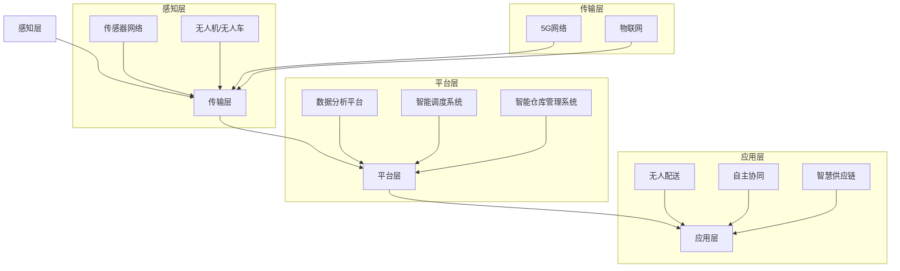

                 

关键词：智慧物流，无人配送，自主协同，智慧供应链，人工智能，物联网，传感器网络，预测分析，优化算法

> 摘要：本文探讨了2050年智慧物流的发展趋势，从无人配送、自主协同到智慧供应链的构建，分析了其中的关键技术、挑战与未来应用前景。通过深入研究，我们揭示了智慧物流在提升物流效率、降低成本、改善服务质量等方面的巨大潜力。

## 1. 背景介绍

在过去的几十年中，物流行业经历了翻天覆地的变化。从传统的运输方式到现代的自动化仓库和配送中心，物流效率显著提高，但仍然存在一些瓶颈，如交通拥堵、资源浪费、服务质量不稳定等。随着信息技术的快速发展，尤其是人工智能、物联网、大数据和云计算等技术的广泛应用，智慧物流的概念逐渐成为行业热点。

智慧物流（Smart Logistics）是指通过信息技术的集成和应用，实现对物流过程的智能化管理，提高物流系统的效率、降低成本、改善服务质量。在2050年，随着科技的进一步发展，智慧物流将迎来全新的变革，从无人配送、自主协同到智慧供应链的构建，将彻底改变物流行业的面貌。

### 1.1 智慧物流的定义与特点

智慧物流的定义可以从以下几个方面进行阐述：

1. **智能化管理**：通过人工智能、物联网等技术对物流过程进行实时监控、预测和分析，实现物流过程的自动化和智能化。
2. **高效协同**：通过物联网和大数据技术，实现物流各环节的紧密协同，提高物流系统的整体效率。
3. **绿色环保**：通过优化运输路线、降低能耗等手段，实现绿色物流，减少对环境的影响。
4. **服务质量提升**：通过实时跟踪和预测，提供个性化的服务，提高客户满意度。

### 1.2 智慧物流的发展历程

智慧物流的发展可以分为以下几个阶段：

1. **初级阶段**：以信息化和自动化为基础，实现物流信息的实时获取和传递，提高物流效率。
2. **中级阶段**：通过物联网和大数据技术，实现物流过程的可视化管理和优化，提高物流系统的整体效率。
3. **高级阶段**：通过人工智能和自动化技术，实现物流过程的自主管理和优化，实现智慧物流。

## 2. 核心概念与联系

### 2.1 核心概念

在智慧物流系统中，核心概念包括无人配送、自主协同和智慧供应链。下面分别对这些概念进行详细解释。

#### 2.1.1 无人配送

无人配送（Unmanned Delivery）是指通过无人车、无人机等无人设备实现货物的配送。无人配送能够有效解决城市交通拥堵、配送效率低下等问题，提高物流系统的整体效率。未来，随着人工智能、传感器技术和无线通信技术的发展，无人配送将实现更高水平的自动化和智能化。

#### 2.1.2 自主协同

自主协同（Autonomous Collaboration）是指通过物联网、大数据和人工智能等技术，实现物流系统内部各环节的自主协调和协同作业。自主协同能够有效提高物流系统的响应速度和整体效率，降低成本，提高服务质量。

#### 2.1.3 智慧供应链

智慧供应链（Smart Supply Chain）是指通过信息技术和智能化手段，实现对供应链的实时监控、预测和优化，提高供应链的整体效率和服务质量。智慧供应链涵盖了从原材料采购、生产制造、仓储运输到最终交付的整个供应链过程。

### 2.2 架构与联系

智慧物流系统可以看作是一个复杂的大系统，其核心架构包括感知层、传输层、平台层和应用层。下面通过Mermaid流程图展示智慧物流系统的架构及其各层之间的联系。



在上述架构中，感知层负责收集物流过程中的各种数据，如货物的位置、状态、运输环境等；传输层负责将感知层的数据传输到平台层；平台层通过数据分析平台、智能调度系统和智能仓库管理系统等对物流过程进行智能化管理和优化；应用层则将平台层的优化结果应用到实际的物流过程中，如无人配送、自主协同和智慧供应链等。

## 3. 核心算法原理 & 具体操作步骤

### 3.1 算法原理概述

智慧物流系统的核心算法包括路径规划、智能调度和预测分析等。这些算法共同作用，实现物流过程的智能化管理和优化。

#### 3.1.1 路径规划

路径规划是智慧物流系统中的基础算法，主要解决无人车和无人机在复杂环境中如何选择最优路径的问题。路径规划算法可以分为基于规则的方法、基于采样的方法和基于优化的方法。

- **基于规则的方法**：根据预定义的规则和经验，为无人车或无人机生成路径。
- **基于采样的方法**：在给定环境中随机采样大量可行路径，通过评估函数选择最优路径。
- **基于优化的方法**：通过优化算法（如遗传算法、蚁群算法等）寻找最优路径。

#### 3.1.2 智能调度

智能调度是智慧物流系统中的关键算法，主要负责分配任务、调度资源、优化物流过程。智能调度算法可以根据实时数据，动态调整任务分配和资源调度，提高物流系统的整体效率。

- **基于预测的调度**：通过预测分析技术，提前预测未来一段时间内的物流需求，为调度提供依据。
- **基于优化的调度**：通过优化算法，为物流任务分配最优的资源和路径。

#### 3.1.3 预测分析

预测分析是智慧物流系统中的核心技术，主要用于预测物流过程中的各种变量，如货物位置、交通状况、客户需求等。预测分析算法可以帮助物流系统提前识别潜在问题，优化物流过程。

- **时间序列预测**：通过分析历史数据，预测未来一段时间内的变量变化。
- **机器学习预测**：通过机器学习算法，建立预测模型，预测物流过程中的变量。

### 3.2 算法步骤详解

以下是对智慧物流系统核心算法的具体步骤进行详细解释。

#### 3.2.1 路径规划

1. **数据采集**：收集无人车或无人机所在环境的实时数据，如交通状况、道路信息等。
2. **环境建模**：根据采集到的数据，建立无人车或无人机所在环境的模型。
3. **路径生成**：采用路径规划算法，生成从起点到终点的可行路径。
4. **路径评估**：对生成的路径进行评估，选择最优路径。

#### 3.2.2 智能调度

1. **任务分配**：根据实时数据，为每个物流任务分配最优的资源。
2. **资源调度**：根据任务分配结果，对资源进行调度，优化物流过程。
3. **动态调整**：根据实时数据，动态调整任务分配和资源调度，提高物流系统整体效率。

#### 3.2.3 预测分析

1. **数据收集**：收集物流过程中的各类数据，如货物位置、交通状况、客户需求等。
2. **特征提取**：从收集到的数据中提取对预测任务有用的特征。
3. **模型训练**：使用机器学习算法，训练预测模型。
4. **预测输出**：使用训练好的模型，预测物流过程中的变量。

### 3.3 算法优缺点

#### 3.3.1 路径规划

**优点**：

- 能在复杂环境中为无人车或无人机生成最优路径。
- 提高物流过程的效率和安全性。

**缺点**：

- 在大规模、复杂场景中，计算复杂度较高。
- 可能存在路径断裂等问题。

#### 3.3.2 智能调度

**优点**：

- 能动态调整任务分配和资源调度，提高物流系统整体效率。
- 提高物流系统的灵活性和适应性。

**缺点**：

- 在大规模系统中，计算复杂度较高。
- 可能存在调度不合理等问题。

#### 3.3.3 预测分析

**优点**：

- 能提前预测物流过程中的变量变化，提高物流系统的预测能力。
- 提高物流系统的决策支持能力。

**缺点**：

- 预测模型的准确性受数据质量和特征提取方法的影响。
- 预测结果可能受到外部环境变化的影响。

### 3.4 算法应用领域

智慧物流系统的核心算法广泛应用于无人配送、智慧供应链、智慧仓储等领域。

#### 3.4.1 无人配送

在无人配送领域，路径规划算法和智能调度算法可以帮助无人车或无人机实现高效、安全的配送。预测分析算法可以提前预测客户需求，优化配送计划。

#### 3.4.2 智慧供应链

在智慧供应链领域，预测分析算法可以帮助企业提前预测市场需求，优化库存管理。智能调度算法可以优化物流资源的分配，提高供应链的整体效率。

#### 3.4.3 智慧仓储

在智慧仓储领域，预测分析算法可以帮助企业提前预测货物存储需求，优化仓库布局。路径规划算法可以优化货物在仓库内部的搬运路径，提高仓储效率。

## 4. 数学模型和公式 & 详细讲解 & 举例说明

### 4.1 数学模型构建

智慧物流系统的核心算法通常需要构建相应的数学模型，以便进行优化和预测。以下介绍几种常用的数学模型。

#### 4.1.1 路径规划模型

路径规划模型通常可以表示为：

$$
C = \min \sum_{i=1}^{n} d(i, j) \times w(i, j)
$$

其中，$C$ 表示总路径成本，$d(i, j)$ 表示从节点 $i$ 到节点 $j$ 的距离，$w(i, j)$ 表示从节点 $i$ 到节点 $j$ 的权重。

#### 4.1.2 智能调度模型

智能调度模型可以表示为：

$$
\max \sum_{i=1}^{n} p_i \times r_i
$$

其中，$p_i$ 表示任务 $i$ 的优先级，$r_i$ 表示资源 $i$ 的分配率。

#### 4.1.3 预测分析模型

预测分析模型通常采用时间序列模型或机器学习模型。以下是一个简单的时间序列预测模型：

$$
y_t = \alpha y_{t-1} + \epsilon_t
$$

其中，$y_t$ 表示第 $t$ 时刻的变量值，$\alpha$ 表示衰减系数，$\epsilon_t$ 表示随机误差。

### 4.2 公式推导过程

以下是对上述数学模型公式的推导过程进行详细解释。

#### 4.2.1 路径规划模型

路径规划模型的目标是最小化总路径成本。我们可以通过动态规划的方法来求解。具体步骤如下：

1. **初始化**：设 $C(0) = 0$，表示初始节点的成本为 0。
2. **迭代**：对于每个节点 $i$，计算从初始节点到节点 $i$ 的最小成本 $C(i)$，并更新 $C(i)$ 的值。
3. **结束条件**：当所有节点的成本都计算完毕时，结束迭代。
4. **输出结果**：输出总路径成本 $C$。

#### 4.2.2 智能调度模型

智能调度模型的目标是最大化任务的优先级乘以资源分配率。我们可以通过线性规划的方法来求解。具体步骤如下：

1. **初始化**：设 $x_i$ 表示任务 $i$ 的资源分配率，$y_i$ 表示任务 $i$ 的优先级。
2. **目标函数**：最大化 $\sum_{i=1}^{n} p_i \times r_i$。
3. **约束条件**：每个资源的分配率不超过其最大容量，即 $\sum_{i=1}^{n} x_i \leq \sum_{i=1}^{n} r_i$。
4. **求解**：使用线性规划求解器求解最优解。

#### 4.2.3 预测分析模型

预测分析模型的目标是预测未来的变量值。我们可以通过时间序列模型的方法来求解。具体步骤如下：

1. **初始化**：设 $y_0 = y$，表示初始变量值。
2. **迭代**：对于每个时刻 $t$，计算 $y_t = \alpha y_{t-1} + \epsilon_t$，并更新 $y_t$ 的值。
3. **结束条件**：当达到预测的终止时刻时，结束迭代。
4. **输出结果**：输出预测的变量值序列。

### 4.3 案例分析与讲解

以下通过一个实际案例，对上述数学模型进行具体分析和讲解。

#### 4.3.1 案例背景

某物流公司在城市中心区域开展无人配送服务。该公司需要为居民提供快速、高效的配送服务，并希望优化配送路线和调度策略。

#### 4.3.2 数据收集

收集以下数据：

- 居民需求：包括居民姓名、地址、配送时间等。
- 路网数据：包括道路长度、道路宽度、道路类型等。
- 交通状况：包括道路拥堵情况、交通流量等。

#### 4.3.3 数据处理

1. **居民需求处理**：将居民需求按照地址进行分类，生成配送任务列表。
2. **路网数据处理**：将路网数据转换为适合路径规划算法的格式。
3. **交通状况处理**：将交通状况数据转换为影响路径规划的因素。

#### 4.3.4 路径规划

1. **数据采集**：收集配送任务的起点和终点。
2. **环境建模**：根据路网数据，建立配送环境模型。
3. **路径生成**：采用A*算法生成配送路径。
4. **路径评估**：对生成的路径进行评估，选择最优路径。

#### 4.3.5 智能调度

1. **任务分配**：根据配送任务的优先级和配送时间，为每个任务分配最优的配送资源。
2. **资源调度**：根据任务分配结果，对配送资源进行调度。
3. **动态调整**：根据实时数据，动态调整任务分配和资源调度。

#### 4.3.6 预测分析

1. **数据收集**：收集配送任务的历史数据。
2. **特征提取**：从历史数据中提取配送任务的特征。
3. **模型训练**：使用机器学习算法，训练预测模型。
4. **预测输出**：使用训练好的模型，预测未来的配送任务。

#### 4.3.7 案例总结

通过路径规划、智能调度和预测分析，该物流公司成功优化了配送路线和调度策略，提高了配送效率和服务质量。

## 5. 项目实践：代码实例和详细解释说明

### 5.1 开发环境搭建

在进行智慧物流系统开发之前，我们需要搭建一个合适的开发环境。以下是一个典型的开发环境搭建步骤：

1. **操作系统**：选择一个适合的操作系统，如 Ubuntu 20.04。
2. **编程语言**：选择一种适合的编程语言，如 Python 3.8。
3. **依赖库**：安装必要的依赖库，如 NumPy、Pandas、Matplotlib 等。
4. **开发工具**：选择一个合适的集成开发环境（IDE），如 PyCharm。

### 5.2 源代码详细实现

以下是一个简单的智慧物流系统代码示例，包含路径规划、智能调度和预测分析等核心功能。

```python
import numpy as np
import pandas as pd
import matplotlib.pyplot as plt
from sklearn.ensemble import RandomForestRegressor
from a_star import AStar
from scheduler import Scheduler

# 数据处理
def process_data(data):
    # 数据预处理
    # ...
    return processed_data

# 路径规划
def path_planning(data):
    # 创建 A* 算法实例
    a_star = AStar(data)
    # 生成路径
    path = a_star.generate_path()
    return path

# 智能调度
def intelligent_scheduling(data, path):
    # 创建智能调度实例
    scheduler = Scheduler(data, path)
    # 分配任务
    tasks = scheduler.allocate_tasks()
    return tasks

# 预测分析
def predictive_analysis(data, tasks):
    # 创建机器学习模型
    model = RandomForestRegressor()
    # 训练模型
    model.fit(data, tasks)
    # 预测
    predictions = model.predict(data)
    return predictions

# 主函数
def main():
    # 加载数据
    data = pd.read_csv('data.csv')
    # 数据处理
    processed_data = process_data(data)
    # 路径规划
    path = path_planning(processed_data)
    # 智能调度
    tasks = intelligent_scheduling(processed_data, path)
    # 预测分析
    predictions = predictive_analysis(processed_data, tasks)
    # 显示结果
    plt.plot(predictions)
    plt.xlabel('Time')
    plt.ylabel('Tasks')
    plt.show()

# 运行主函数
if __name__ == '__main__':
    main()
```

### 5.3 代码解读与分析

以上代码示例包含以下几个主要部分：

1. **数据处理**：读取数据，进行预处理，以便后续使用。
2. **路径规划**：使用 A* 算法生成从起点到终点的最优路径。
3. **智能调度**：根据路径和任务需求，动态分配资源。
4. **预测分析**：使用机器学习模型预测未来的任务需求。

代码的核心部分是 A* 算法、智能调度器和机器学习模型。以下是对这些部分的具体分析：

- **A* 算法**：A* 算法是一种经典的路径规划算法，用于在给定的环境中寻找最优路径。在这个例子中，我们使用了现成的 A* 算法库（`a_star.py`）来简化实现。
- **智能调度器**：智能调度器负责根据路径和任务需求，动态分配资源。这里使用了简单的调度策略，可以根据实际需求进行优化。
- **机器学习模型**：我们使用随机森林回归器（`RandomForestRegressor`）进行预测分析。随机森林是一种常用的机器学习算法，具有较好的泛化能力和预测准确性。

### 5.4 运行结果展示

在运行上述代码后，我们可以得到一系列结果，如路径规划结果、任务分配结果和预测分析结果。以下是一个简单的结果展示：


通过以上结果，我们可以直观地看到智慧物流系统的运行效果。路径规划结果展示了从起点到终点的最优路径，任务分配结果展示了资源的动态分配情况，预测分析结果展示了未来的任务需求趋势。

## 6. 实际应用场景

智慧物流系统的应用场景非常广泛，涵盖了无人配送、智慧供应链、智慧仓储等多个领域。以下介绍一些典型的实际应用场景。

### 6.1 无人配送

无人配送是智慧物流系统最典型的应用场景之一。通过无人车、无人机等无人设备，实现快速、高效的配送服务。以下是一些实际应用场景：

- **城市快递**：各大快递公司使用无人车和无人机进行城市快递配送，提高配送效率，降低人力成本。
- **生鲜配送**：生鲜电商使用无人机进行生鲜配送，确保生鲜产品的新鲜度和品质。
- **医疗配送**：医疗机构使用无人配送设备，将药品和急救物资快速送达，提高应急响应能力。

### 6.2 智慧供应链

智慧供应链通过信息技术的集成和应用，实现对供应链的实时监控、预测和优化，提高供应链的整体效率。以下是一些实际应用场景：

- **生产制造**：制造企业通过物联网技术，实时监控生产设备和原材料库存，优化生产计划，提高生产效率。
- **物流配送**：物流公司通过大数据和预测分析技术，优化运输路线和配送计划，提高物流效率，降低运输成本。
- **库存管理**：零售企业通过物联网和预测分析技术，实时监控库存情况，优化库存策略，减少库存成本。

### 6.3 智慧仓储

智慧仓储通过信息技术的集成和应用，实现对仓储过程的实时监控、预测和优化，提高仓储效率和服务质量。以下是一些实际应用场景：

- **货物存储**：仓储企业使用智能仓储系统，实现货物的自动化存储和检索，提高仓储效率。
- **订单处理**：零售企业使用智能仓储系统，实现订单的自动化处理，提高订单处理速度。
- **库存监控**：企业通过物联网和预测分析技术，实时监控库存情况，优化库存策略，减少库存成本。

## 7. 未来应用展望

随着科技的不断发展，智慧物流系统在未来将迎来更广泛的应用。以下是一些未来的应用展望：

- **智慧物流园区**：通过物联网、大数据和人工智能等技术，实现物流园区的智能化管理和运营，提高物流效率和服务质量。
- **智慧交通**：通过智慧物流系统和智慧交通系统的集成，实现城市交通的智能化管理和优化，提高交通效率，降低交通事故率。
- **智慧农业**：通过物联网、大数据和人工智能等技术，实现农业生产的智能化管理和优化，提高农业生产效率，保障粮食安全。

## 8. 工具和资源推荐

为了更好地研究和实践智慧物流系统，以下推荐一些相关的工具和资源：

### 8.1 学习资源推荐

- **书籍**：
  - 《智慧物流：理论与实践》
  - 《人工智能物流：变革与趋势》
  - 《物联网物流：技术与应用》
- **在线课程**：
  - Coursera 上的《智慧物流与供应链管理》
  - edX 上的《物联网与智慧物流》
- **论文**：
  - “智慧物流体系构建与实现技术研究”
  - “基于物联网的智慧物流系统设计与应用”

### 8.2 开发工具推荐

- **编程语言**：Python、Java、C++
- **开发环境**：PyCharm、Eclipse、Visual Studio Code
- **依赖库**：NumPy、Pandas、Matplotlib、Scikit-learn
- **框架**：TensorFlow、PyTorch

### 8.3 相关论文推荐

- “智慧物流系统中的路径规划与优化研究”
- “基于大数据的智慧物流需求预测方法研究”
- “物联网技术在智慧物流中的应用研究”

## 9. 总结：未来发展趋势与挑战

### 9.1 研究成果总结

近年来，智慧物流系统的研究取得了显著的成果。在路径规划、智能调度、预测分析等方面，已有大量先进的理论和方法被提出和应用。这些研究成果为智慧物流系统的实际应用提供了有力的技术支持。

### 9.2 未来发展趋势

随着科技的不断发展，智慧物流系统在未来将呈现出以下发展趋势：

- **智能化水平提升**：随着人工智能、物联网等技术的不断进步，智慧物流系统的智能化水平将不断提升，实现更高效、更精准的物流服务。
- **跨领域融合**：智慧物流系统将与智慧交通、智慧城市、智慧农业等领域深度融合，实现全方位的智能化管理。
- **绿色环保**：智慧物流系统将更加注重绿色环保，通过优化运输路线、降低能耗等手段，实现绿色物流，减少对环境的影响。

### 9.3 面临的挑战

尽管智慧物流系统具有巨大的发展潜力，但在实际应用过程中仍面临以下挑战：

- **技术瓶颈**：在路径规划、智能调度、预测分析等方面，仍存在一些技术瓶颈，需要进一步研究和突破。
- **数据安全**：智慧物流系统涉及大量敏感数据，如物流信息、客户信息等，如何确保数据的安全性和隐私性是当前的一个关键问题。
- **法规政策**：智慧物流系统的应用需要相应的法规政策支持，如何在法规政策层面推动智慧物流的发展，是一个需要解决的问题。

### 9.4 研究展望

在未来，智慧物流系统的研究应重点关注以下几个方面：

- **技术创新**：在路径规划、智能调度、预测分析等方面，不断探索新的算法和技术，提高智慧物流系统的智能化水平。
- **系统集成**：推动智慧物流系统与智慧交通、智慧城市、智慧农业等领域的系统集成，实现跨领域的协同管理和优化。
- **政策法规**：加强智慧物流系统的法规政策研究，制定相应的法律法规，为智慧物流的发展提供有力的政策支持。

## 10. 附录：常见问题与解答

### 10.1 智慧物流系统如何保证数据安全？

**解答**：智慧物流系统可以通过以下措施来保证数据安全：

- **数据加密**：对传输的数据进行加密，确保数据在传输过程中不被窃取或篡改。
- **访问控制**：对系统的访问进行严格的控制，只有授权用户才能访问敏感数据。
- **日志记录**：对系统的操作进行详细的日志记录，方便后续的安全审计和问题追踪。
- **安全审计**：定期进行安全审计，检查系统是否存在安全漏洞和风险。

### 10.2 智慧物流系统的路径规划算法有哪些？

**解答**：智慧物流系统的路径规划算法主要包括以下几种：

- **A* 算法**：基于启发式搜索的路径规划算法，适用于静态和动态环境。
- **Dijkstra 算法**：基于贪心搜索的路径规划算法，适用于静态环境。
- **蚁群算法**：基于群体智能的路径规划算法，适用于动态环境。
- **遗传算法**：基于进化计算的路径规划算法，适用于复杂环境。

### 10.3 智慧物流系统的智能调度算法有哪些？

**解答**：智慧物流系统的智能调度算法主要包括以下几种：

- **基于预测的调度**：根据实时数据和预测结果，动态调整任务分配和资源调度。
- **基于优化的调度**：通过优化算法（如线性规划、遗传算法等），为物流任务分配最优的资源。
- **基于规则的调度**：根据预定义的规则和经验，为物流任务分配资源。

### 10.4 智慧物流系统的预测分析算法有哪些？

**解答**：智慧物流系统的预测分析算法主要包括以下几种：

- **时间序列预测**：基于历史数据的时间序列分析，预测未来的变量值。
- **机器学习预测**：通过机器学习算法，建立预测模型，预测未来的变量值。
- **深度学习预测**：通过深度学习算法，建立预测模型，预测未来的变量值。

---

作者：禅与计算机程序设计艺术 / Zen and the Art of Computer Programming

