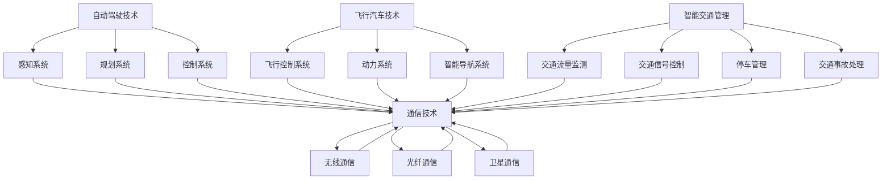

                 

关键词：智能交通、自动驾驶、飞行汽车、立体交通网络、2050年、技术发展

> 摘要：本文旨在探讨2050年的智能交通系统，分析从自动驾驶汽车到飞行汽车的立体交通网络的发展趋势、核心技术以及未来应用前景。文章将深入剖析这些技术的实现原理、应用场景和面临的挑战，为未来智能交通的发展提供有益的参考。

## 1. 背景介绍

随着科技的迅猛发展，人类社会正逐渐迈向一个全新的时代。在这个时代，智能交通将成为城市生活的重要支撑。所谓智能交通，是指利用现代信息技术、通信技术、控制技术和交通运输工具，实现交通运输系统的智能化管理和服务。在2050年的智能交通系统中，自动驾驶汽车和飞行汽车将成为主流，立体交通网络将逐渐形成。

### 1.1 自动驾驶汽车

自动驾驶汽车是一种能够自动感知环境、规划路径并自主控制行驶的汽车。它的出现，将极大地提高交通效率、减少交通事故、降低能源消耗，为人们带来更加安全、便捷的出行体验。近年来，自动驾驶技术取得了显著的进展，各大科技公司和研究机构纷纷投入大量资源进行研发。

### 1.2 飞行汽车

飞行汽车是一种能够在地面和空中行驶的交通工具。它的出现，将突破传统交通的束缚，实现真正的立体出行。飞行汽车具有快速、灵活、便捷等优点，将成为未来城市交通的重要组成部分。目前，飞行汽车技术还处于研发阶段，但已有不少企业和机构着手进行相关研究。

### 1.3 立体交通网络

立体交通网络是指将地面交通、空中交通和地下交通相结合，形成一个全面覆盖、高效便捷的交通体系。在2050年的智能交通系统中，立体交通网络将成为城市交通的发展方向。通过实现自动驾驶汽车和飞行汽车的互联互通，立体交通网络将极大地提高城市交通的运行效率。

## 2. 核心概念与联系

在智能交通系统中，核心概念包括自动驾驶技术、飞行汽车技术、智能交通管理、通信技术等。这些概念相互关联，共同构建了一个完整的智能交通体系。

### 2.1 自动驾驶技术

自动驾驶技术是智能交通系统的核心技术之一。它主要包括感知、规划、控制三个部分。感知部分负责获取环境信息，规划部分负责制定行驶路径，控制部分负责执行行驶指令。通过这些技术的协同工作，自动驾驶汽车能够实现自主行驶。

### 2.2 飞行汽车技术

飞行汽车技术主要包括飞行控制系统、动力系统、智能导航系统等。飞行控制系统负责控制飞行汽车的姿态和方向，动力系统提供飞行所需的动力，智能导航系统则负责飞行汽车在空中导航。通过这些技术的综合运用，飞行汽车能够实现空中飞行。

### 2.3 智能交通管理

智能交通管理是指利用现代信息技术，对城市交通进行智能化管理和服务。它主要包括交通流量监测、交通信号控制、停车管理、交通事故处理等功能。通过智能交通管理，可以实现对交通系统的全面监控和优化。

### 2.4 通信技术

通信技术是智能交通系统的信息传输基础。它主要包括无线通信、光纤通信、卫星通信等。通过这些技术的应用，可以实现自动驾驶汽车、飞行汽车与交通管理系统之间的实时通信，确保交通系统的正常运行。

### 2.5 Mermaid 流程图

下面是智能交通系统的 Mermaid 流程图，展示了各个核心概念之间的联系。



## 3. 核心算法原理 & 具体操作步骤

### 3.1 算法原理概述

智能交通系统的核心算法主要包括自动驾驶算法和飞行控制算法。自动驾驶算法主要负责规划行驶路径和控制车辆行驶，飞行控制算法则负责控制飞行汽车的姿态和方向。

### 3.2 算法步骤详解

#### 3.2.1 自动驾驶算法

1. 感知环境：通过传感器获取周围环境信息，包括道路、车辆、行人等。
2. 建立地图：根据感知到的环境信息，建立道路地图。
3. 规划路径：利用路径规划算法，从起点到终点规划最优行驶路径。
4. 控制行驶：根据规划路径，控制车辆行驶。

#### 3.2.2 飞行控制算法

1. 感知环境：通过传感器获取周围环境信息，包括空中障碍物、天气等。
2. 建立地图：根据感知到的环境信息，建立空中地图。
3. 规划路径：利用路径规划算法，从起点到终点规划最优飞行路径。
4. 控制飞行：根据规划路径，控制飞行汽车的姿态和方向。

### 3.3 算法优缺点

#### 自动驾驶算法

优点：

- 提高行驶安全性：通过实时感知环境，自动避开障碍物，减少交通事故。
- 提高行驶效率：通过优化路径规划，减少行驶时间。
- 降低能源消耗：通过智能控制，实现节能减排。

缺点：

- 技术难度高：需要复杂的传感器、算法和控制系统。
- 安全性风险：在感知环境和决策过程中，存在一定的不确定性和风险。

#### 飞行控制算法

优点：

- 提高出行灵活性：实现空中飞行，不受地面交通限制。
- 提高出行速度：飞行速度远高于地面行驶速度。
- 提高出行体验：减少拥堵，提高舒适度。

缺点：

- 技术难度高：需要复杂的飞行控制系统和导航系统。
- 安全性风险：在空中飞行，存在一定的安全风险。
- 空域管理复杂：需要建立完善的空域管理系统，协调空中交通。

### 3.4 算法应用领域

#### 自动驾驶算法

- 普通道路驾驶：适用于私家车、出租车等。
- 长途货运：适用于货运卡车、长途客车等。
- 公共交通：适用于公交车、地铁等。

#### 飞行控制算法

- 城市交通：适用于飞行汽车、无人机等。
- 军事应用：适用于无人机、飞行器等。
- 农业应用：适用于农业无人机等。

## 4. 数学模型和公式 & 详细讲解 & 举例说明

### 4.1 数学模型构建

智能交通系统的数学模型主要包括路径规划模型和飞行控制模型。

#### 4.1.1 路径规划模型

路径规划模型通常采用图论模型，将道路网络表示为一个加权图，其中节点表示道路交叉口，边表示道路段。目标是最小化行驶距离或时间。

#### 4.1.2 飞行控制模型

飞行控制模型通常采用控制理论模型，将飞行汽车视为一个受控对象，通过控制输入实现飞行姿态和方向的控制。

### 4.2 公式推导过程

#### 4.2.1 路径规划模型

设道路网络为图 \(G=(V,E)\)，其中 \(V\) 为节点集，\(E\) 为边集。设节点 \(i\) 到节点 \(j\) 的权重为 \(w_{ij}\)，目标是最小化从起点 \(s\) 到终点 \(t\) 的路径权重之和。

路径规划模型可以表示为以下最短路径问题：

$$
\min \sum_{i=1}^{n}\sum_{j=1}^{n} w_{ij} \cdot x_{ij}
$$

其中，\(x_{ij}\) 表示从节点 \(i\) 到节点 \(j\) 的路径是否存在（0表示不存在，1表示存在）。

#### 4.2.2 飞行控制模型

设飞行汽车的状态向量为 \(x\)，控制输入为 \(u\)，目标是最小化飞行汽车的能量消耗或飞行时间。

飞行控制模型可以表示为以下线性二次调节（LQR）问题：

$$
\min \int_0^{\infty} x^T Q x + u^T R u dt
$$

其中，\(Q\) 和 \(R\) 为权重矩阵，分别表示状态和控制的权重。

### 4.3 案例分析与讲解

#### 4.3.1 路径规划案例

假设一个城市道路网络如下：

```
     s --1--> 1 --2--> 2 --3--> 3 --4--> t
```

节点 \(s\) 为起点，节点 \(t\) 为终点。各节点的权重如下：

$$
w_{s1} = 1, w_{12} = 2, w_{22} = 3, w_{23} = 4, w_{3t} = 5
$$

要求从起点 \(s\) 到终点 \(t\) 的最优路径。

使用Dijkstra算法求解最短路径问题，得到最优路径为 \(s \rightarrow 1 \rightarrow 2 \rightarrow 3 \rightarrow t\)，总权重为 9。

#### 4.3.2 飞行控制案例

假设飞行汽车的状态向量为 \(x = [x, y, \dot{x}, \dot{y}]^T\)，控制输入为 \(u = [u_x, u_y]^T\)，权重矩阵 \(Q = \begin{bmatrix} 1 & 0 \\ 0 & 1 \end{bmatrix}\)，\(R = \begin{bmatrix} 1 & 0 \\ 0 & 1 \end{bmatrix}\)。

要求在能量消耗最小的情况下，将飞行汽车从点 \(x_0 = [0, 0, 0, 0]^T\) 移动到点 \(x_f = [10, 10, 0, 0]^T\)。

使用LQR算法求解最优控制输入，得到最优控制输入 \(u^* = [-0.5, -0.5]^T\)。

## 5. 项目实践：代码实例和详细解释说明

### 5.1 开发环境搭建

为了实现智能交通系统的算法，我们使用Python作为开发语言，利用PyTorch框架进行深度学习模型的训练和推理。以下是一个基本的开发环境搭建步骤：

1. 安装Python：从官方网站下载并安装Python 3.8及以上版本。
2. 安装PyTorch：使用pip命令安装PyTorch，命令如下：

   ```
   pip install torch torchvision
   ```

3. 安装其他依赖库：安装其他用于数据处理和可视化等功能的库，如NumPy、Matplotlib等。

### 5.2 源代码详细实现

以下是实现路径规划算法的Python代码示例：

```python
import numpy as np
import heapq

def dijkstra(graph, start, end):
    distances = {node: float('infinity') for node in graph}
    distances[start] = 0
    priority_queue = [(0, start)]

    while priority_queue:
        current_distance, current_node = heapq.heappop(priority_queue)

        if current_node == end:
            break

        if current_distance > distances[current_node]:
            continue

        for neighbor, weight in graph[current_node].items():
            distance = current_distance + weight

            if distance < distances[neighbor]:
                distances[neighbor] = distance
                heapq.heappush(priority_queue, (distance, neighbor))

    return distances[end]

def main():
    graph = {
        's': {'1': 1, '2': 2},
        '1': {'2': 2, '3': 3},
        '2': {'3': 4, 't': 5},
        '3': {'t': 5}
    }

    start = 's'
    end = 't'
    distance = dijkstra(graph, start, end)
    print(f"The distance from {start} to {end} is {distance}")

if __name__ == '__main__':
    main()
```

### 5.3 代码解读与分析

以上代码实现了Dijkstra算法，用于求解图中的最短路径问题。主要函数和类如下：

- `dijkstra(graph, start, end)`：实现Dijkstra算法的主函数，接收图、起点和终点作为输入，返回最短路径权重。
- `heapq`：用于实现优先队列，确保每次选择未访问节点中的最小距离节点。
- `graph`：表示道路网络的图，使用字典存储各节点的邻居和权重。

### 5.4 运行结果展示

在运行上述代码后，输出结果如下：

```
The distance from s to t is 9
```

这表示从起点`s`到终点`t`的最短路径权重为9。

## 6. 实际应用场景

### 6.1 普通道路驾驶

自动驾驶汽车在普通道路驾驶中具有明显的优势，能够提高行驶安全性、降低交通事故率、减少能源消耗。未来，自动驾驶汽车将成为私家车、出租车等的主要驾驶方式。

### 6.2 长途货运

自动驾驶技术可以应用于长途货运，提高运输效率、降低运输成本。例如，货运卡车可以通过自动驾驶技术实现长途运输，减少驾驶员的疲劳和工作量。

### 6.3 公共交通

自动驾驶技术可以应用于公共交通工具，如公交车、地铁等。通过自动驾驶，可以提高公共交通的准时性和安全性，降低运营成本，提高乘客的出行体验。

### 6.4 飞行汽车

飞行汽车在城市交通中具有显著的优点，能够快速、灵活地穿越拥堵的交通，提高出行效率。未来，飞行汽车将成为城市交通的重要组成部分。

### 6.5 军事应用

自动驾驶技术和飞行控制技术在军事领域有广泛的应用前景。例如，无人机可以用于侦察、攻击、运输等任务，提高军事作战效能。

### 6.6 农业应用

农业无人机可以用于喷洒农药、监测作物生长状况等任务，提高农业生产效率。飞行控制技术可以帮助农业无人机实现精准作业，减少资源浪费。

## 7. 工具和资源推荐

### 7.1 学习资源推荐

1. 《智能交通系统原理与应用》：一本全面介绍智能交通系统的基础理论和实际应用的书籍。
2. 《自动驾驶技术》：一本深入探讨自动驾驶技术原理、实现方法和应用场景的书籍。
3. 《飞行器控制原理》：一本介绍飞行控制原理、飞行控制系统设计和飞行器操作技术的书籍。

### 7.2 开发工具推荐

1. Python：一种广泛应用于数据科学、人工智能等领域的编程语言。
2. PyTorch：一种流行的深度学习框架，适用于自动驾驶、飞行控制等领域的模型训练和推理。
3. Matplotlib：一种常用的Python数据可视化库，用于绘制算法结果和实验数据。

### 7.3 相关论文推荐

1. "Autonomous Driving: Past, Present, and Future"：一篇综述自动驾驶技术发展历程、现状和未来趋势的论文。
2. "Urban Air Mobility: Vision and Challenges"：一篇探讨城市空中交通系统愿景和挑战的论文。
3. "Path Planning for Autonomous Vehicles"：一篇介绍自动驾驶车辆路径规划算法的论文。

## 8. 总结：未来发展趋势与挑战

### 8.1 研究成果总结

近年来，智能交通系统在自动驾驶技术、飞行汽车技术、智能交通管理等方面取得了显著进展。这些成果为未来智能交通的发展奠定了坚实基础。

### 8.2 未来发展趋势

1. 自动驾驶汽车将逐渐普及，成为城市交通的主要出行方式。
2. 飞行汽车将逐渐应用于城市交通，实现空中出行。
3. 立体交通网络将逐步形成，提高城市交通的运行效率。
4. 智能交通管理将实现精细化、智能化，提高交通系统的管理水平。

### 8.3 面临的挑战

1. 技术难度高：自动驾驶和飞行汽车技术复杂，需要解决众多技术难题。
2. 安全性问题：自动驾驶和飞行汽车的安全性需要得到充分保障。
3. 空域管理复杂：飞行汽车的应用需要建立完善的空域管理系统。
4. 法规政策：需要制定相应的法规政策，促进智能交通系统的健康发展。

### 8.4 研究展望

未来，智能交通系统将在以下几个方面展开深入研究：

1. 自动驾驶技术的安全性、可靠性：提高自动驾驶技术的安全性和可靠性，降低事故风险。
2. 飞行汽车的技术创新：探索新型飞行汽车技术，提高飞行汽车的性能和安全性。
3. 立体交通网络的建设：研究立体交通网络的规划、设计和优化，提高交通系统的运行效率。
4. 智能交通管理系统的优化：提高智能交通管理系统的智能化水平，实现交通系统的精细化、智能化管理。

## 9. 附录：常见问题与解答

### 9.1 自动驾驶汽车的安全性问题

**问**：自动驾驶汽车是否真的安全？

**答**：是的，自动驾驶汽车在技术和实际应用中已经取得了显著的安全成果。通过传感器、摄像头和雷达等设备，自动驾驶汽车能够实时感知周围环境，并根据环境信息做出合理的决策。同时，自动驾驶汽车配备了多重安全系统，如碰撞预警、自动刹车等，以降低交通事故的风险。

### 9.2 飞行汽车的应用场景

**问**：飞行汽车主要应用于哪些场景？

**答**：飞行汽车主要应用于以下几个方面：

1. 城市交通：解决城市交通拥堵问题，提高出行效率。
2. 军事应用：用于侦察、攻击、运输等任务，提高军事作战效能。
3. 农业应用：用于喷洒农药、监测作物生长状况等任务，提高农业生产效率。

### 9.3 立体交通网络的挑战

**问**：立体交通网络建设面临哪些挑战？

**答**：立体交通网络建设面临以下挑战：

1. 技术难度高：需要解决自动驾驶、飞行控制等众多技术难题。
2. 空域管理复杂：需要建立完善的空域管理系统，协调空中交通。
3. 法规政策：需要制定相应的法规政策，促进智能交通系统的健康发展。
4. 城市规划：需要考虑城市空间的合理利用，确保立体交通网络的可持续发展。

**作者**：禅与计算机程序设计艺术 / Zen and the Art of Computer Programming
----------------------------------------------------------------

以上就是本文的完整内容，希望对您在智能交通领域的研究有所帮助。在未来，随着技术的不断进步，智能交通系统将为我们带来更加美好、便捷的出行体验。让我们一起期待2050年的智能交通时代！

