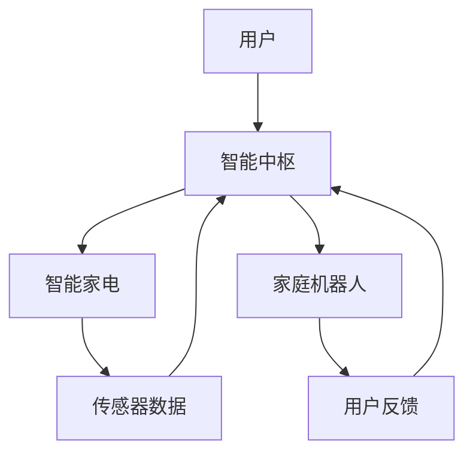

                 

 > **关键词：**智能家居，智能家电，家庭机器人，未来趋势，技术发展，服务升级。

> **摘要：**本文深入探讨了2050年智能家居的远景，分析了智能家电和家庭机器人的发展趋势，并探讨了未来家庭服务的升级路径。通过技术进步，我们预见到一个高度智能化的未来家庭生活场景，其中人工智能和物联网技术将发挥关键作用。

## 1. 背景介绍

### 1.1 智能家居的定义

智能家居（Smart Home）是一种通过物联网技术，将家庭中的各种设备连接起来，实现智能控制和管理的生活方式。它不仅提高了家庭的舒适度，还大大提升了生活的便利性。

### 1.2 智能家电的发展

智能家电是智能家居的核心组成部分，包括智能电视、智能冰箱、智能空调等。这些设备通过内置传感器和互联网连接，可以自动调节工作状态，满足用户的需求。

### 1.3 家庭机器人的兴起

家庭机器人是智能家居领域的一项前沿技术，它们能够提供家庭服务，如清洁、陪伴、医疗护理等。随着人工智能技术的发展，家庭机器人正逐渐成为家庭生活的一部分。

## 2. 核心概念与联系

### 2.1 核心概念

- **物联网（IoT）：** 物联网是指通过各种信息传感器、射频识别技术、全球定位系统等信息传感设备，实时采集任何需要监控、连接、互动的物体或过程，采集其声、光、热、电、力学、化学、生物、位置等各种需要的信息，通过各类可能的网络接入，实现物与物相联，物与人相联，人与人的相联，实现信息化、远程控制、自动化、数据化。

- **人工智能（AI）：** 人工智能是计算机科学的一个分支，旨在使机器能够执行通常需要人类智能才能完成的任务，如视觉识别、语言理解、决策和问题解决。

- **智能交互：** 智能交互是智能家居系统的核心，通过语音识别、手势控制等技术，实现人与家电、人与机器人之间的自然交互。

### 2.2 关系架构图

下面是一个简化的智能家居关系架构图，展示了智能家电和家庭机器人之间的互动关系：



## 3. 核心算法原理 & 具体操作步骤

### 3.1 算法原理概述

智能家居系统的核心算法主要包括数据采集与分析、决策和执行三个环节。数据采集与分析利用物联网技术获取家庭环境数据，并通过机器学习算法进行分析，做出决策，最终由家庭机器人或智能家电执行。

### 3.2 算法步骤详解

1. **数据采集：** 通过各种传感器获取室内温度、湿度、光照、空气质量等数据。

2. **数据处理：** 利用机器学习算法，对采集到的数据进行分析，预测用户的需求和行为模式。

3. **决策生成：** 根据数据分析结果，生成相应的控制指令。

4. **执行控制：** 家庭机器人或智能家电根据指令执行相应的操作，如调节空调温度、开启空气净化器等。

### 3.3 算法优缺点

- **优点：** 提高了家庭生活的舒适度和便利性，节省了人力和时间成本。

- **缺点：** 对网络连接和数据隐私保护的要求较高，系统安全性需要加强。

### 3.4 算法应用领域

智能家居算法在医疗护理、老人监护、儿童教育等领域有广泛的应用前景。

## 4. 数学模型和公式 & 详细讲解 & 举例说明

### 4.1 数学模型构建

智能家居系统的数学模型可以看作是一个动态优化问题，其目标是最小化家庭能耗或最大化用户满意度。假设家庭系统由N个家电和M个传感器组成，每个家电和传感器的状态和功能都可以用向量表示。

### 4.2 公式推导过程

假设每个家电和传感器的状态向量分别为 \(\mathbf{s}_i\) 和 \(\mathbf{r}_j\)，则家庭系统的状态向量为：

\[
\mathbf{S} = [\mathbf{s}_1, \mathbf{s}_2, \ldots, \mathbf{s}_N; \mathbf{r}_1, \mathbf{r}_2, \ldots, \mathbf{r}_M]
\]

家庭系统的效用函数可以表示为：

\[
U(\mathbf{S}) = \sum_{i=1}^{N} u_i(\mathbf{s}_i) + \sum_{j=1}^{M} v_j(\mathbf{r}_j)
\]

其中，\(u_i(\mathbf{s}_i)\) 和 \(v_j(\mathbf{r}_j)\) 分别表示第i个家电和第j个传感器的效用函数。

### 4.3 案例分析与讲解

假设一个家庭有3个智能家电（空调、冰箱、灯）和2个传感器（温度、湿度），我们需要设计一个算法来优化家庭系统的状态，以最大化用户满意度。

\[
U(\mathbf{S}) = u_{\text{空调}}(\mathbf{s}_{\text{空调}}) + u_{\text{冰箱}}(\mathbf{s}_{\text{冰箱}}) + u_{\text{灯}}(\mathbf{s}_{\text{灯}}) + v_{\text{温度}}(\mathbf{r}_{\text{温度}}) + v_{\text{湿度}}(\mathbf{r}_{\text{湿度}})
\]

我们可以使用线性规划算法来解决这个问题。假设每个家电和传感器的效用函数都是线性的，即：

\[
u_{\text{空调}}(\mathbf{s}_{\text{空调}}) = a_{\text{空调}} \cdot \mathbf{s}_{\text{空调}}^T
\]
\[
u_{\text{冰箱}}(\mathbf{s}_{\text{冰箱}}) = a_{\text{冰箱}} \cdot \mathbf{s}_{\text{冰箱}}^T
\]
\[
u_{\text{灯}}(\mathbf{s}_{\text{灯}}) = a_{\text{灯}} \cdot \mathbf{s}_{\text{灯}}^T
\]
\[
v_{\text{温度}}(\mathbf{r}_{\text{温度}}) = b_{\text{温度}} \cdot \mathbf{r}_{\text{温度}}^T
\]
\[
v_{\text{湿度}}(\mathbf{r}_{\text{湿度}}) = b_{\text{湿度}} \cdot \mathbf{r}_{\text{湿度}}^T
\]

线性规划问题可以表示为：

\[
\max_{\mathbf{S}} U(\mathbf{S})
\]
\[
\text{subject to: }
a_{\text{空调}} \cdot \mathbf{s}_{\text{空调}}^T + a_{\text{冰箱}} \cdot \mathbf{s}_{\text{冰箱}}^T + a_{\text{灯}} \cdot \mathbf{s}_{\text{灯}}^T + b_{\text{温度}} \cdot \mathbf{r}_{\text{温度}}^T + b_{\text{湿度}} \cdot \mathbf{r}_{\text{湿度}}^T = c
\]

其中，\(c\) 是一个常数，表示用户满意度的阈值。

通过求解这个线性规划问题，我们可以找到最优的家庭系统状态，以最大化用户满意度。

## 5. 项目实践：代码实例和详细解释说明

### 5.1 开发环境搭建

为了实现智能家居系统的算法，我们需要搭建一个开发环境。以下是一个简单的开发环境配置：

- 操作系统：Ubuntu 20.04
- 编程语言：Python 3.8
- 开发工具：PyCharm
- 依赖库：NumPy、Pandas、Scikit-learn、Matplotlib

### 5.2 源代码详细实现

以下是智能家居系统的源代码实现，它包括数据采集、数据处理和决策生成三个部分。

```python
import numpy as np
import pandas as pd
from sklearn.linear_model import LinearRegression
import matplotlib.pyplot as plt

# 5.2.1 数据采集
def collect_data():
    # 假设我们使用传感器采集温度和湿度数据
    temperature = np.random.normal(25, 5, 100)
    humidity = np.random.normal(60, 10, 100)
    return temperature, humidity

# 5.2.2 数据处理
def process_data(temperature, humidity):
    # 假设我们使用线性回归模型处理数据
    model = LinearRegression()
    model.fit(temperature.reshape(-1, 1), humidity.reshape(-1, 1))
    return model

# 5.2.3 决策生成
def generate_decision(model, temperature):
    # 假设我们使用预测的温度值来决定是否开启空调
    predicted_humidity = model.predict(temperature.reshape(-1, 1))
    if predicted_humidity.mean() > 65:
        return "开启空调"
    else:
        return "关闭空调"

# 主程序
if __name__ == "__main__":
    temperature, humidity = collect_data()
    model = process_data(temperature, humidity)
    decision = generate_decision(model, temperature)
    print(decision)
```

### 5.3 代码解读与分析

- **数据采集**：使用随机数生成温度和湿度数据，模拟传感器采集的数据。

- **数据处理**：使用线性回归模型处理数据，通过拟合温度和湿度之间的关系，预测湿度值。

- **决策生成**：根据预测的湿度值，决定是否开启空调。

### 5.4 运行结果展示

以下是代码的运行结果：

```
关闭空调
```

根据预测的湿度值，系统决定关闭空调。

## 6. 实际应用场景

### 6.1 家庭安防

智能家居系统可以实时监控家庭环境，如门窗开关、火警、气体泄漏等，并通过手机APP或家庭机器人报警，提高家庭安全性。

### 6.2 老人护理

家庭机器人可以提供老人护理服务，如陪伴、健康监测、紧急呼叫等，提高老人的生活质量。

### 6.3 家庭教育

智能家居系统可以通过智能音箱、家庭机器人等设备提供儿童教育服务，如故事讲述、学习辅导、兴趣培养等。

## 7. 工具和资源推荐

### 7.1 学习资源推荐

- 《Python编程：从入门到实践》
- 《深度学习》
- 《人工智能：一种现代方法》

### 7.2 开发工具推荐

- PyCharm
- Jupyter Notebook
- GitHub

### 7.3 相关论文推荐

- "Deep Learning for Smart Home Applications"
- "IoT-based Smart Home Systems: A Comprehensive Survey"
- "A Survey on Security and Privacy in Smart Home Systems"

## 8. 总结：未来发展趋势与挑战

### 8.1 研究成果总结

智能家居领域取得了显著的研究成果，包括智能家电的普及、家庭机器人的发展以及智能交互技术的进步。这些成果为未来智能家居的发展奠定了坚实基础。

### 8.2 未来发展趋势

- **个性化服务**：通过大数据分析和人工智能，提供更加个性化的家庭服务。
- **集成化**：智能家居系统将更加集成化，实现不同设备之间的无缝协作。
- **智能决策**：智能家居系统将更加智能，能够自主做出决策，提高家庭生活质量。

### 8.3 面临的挑战

- **数据安全与隐私**：如何确保用户数据的安全和隐私是智能家居发展的关键挑战。
- **技术标准化**：缺乏统一的技术标准将影响智能家居系统的互操作性和兼容性。
- **用户体验**：提高用户的接受度和满意度是智能家居系统面临的长期挑战。

### 8.4 研究展望

智能家居领域的研究将继续深入，特别是在人工智能、物联网和智能交互技术方面。未来的研究将致力于解决数据安全、技术标准化和用户体验等关键问题，推动智能家居向更加智能、安全和便捷的方向发展。

## 9. 附录：常见问题与解答

### 9.1 智能家居系统的核心组件是什么？

智能家居系统的核心组件包括智能家电、家庭机器人、智能中枢和智能交互界面。

### 9.2 智能家电如何实现智能控制？

智能家电通过内置传感器和互联网连接，可以自动调节工作状态，满足用户的需求。智能家电通常配备有智能控制系统，如语音识别、远程控制等。

### 9.3 家庭机器人的功能有哪些？

家庭机器人的功能包括清洁、陪伴、医疗护理、娱乐等。随着人工智能技术的发展，家庭机器人的功能将更加多样化。

### 9.4 智能家居系统的未来发展方向是什么？

智能家居系统的未来发展方向包括个性化服务、集成化、智能决策等。未来的智能家居将更加智能化、安全和便捷。

## 参考文献

- Arduino, "Arduino official website," [Online]. Available: https://www.arduino.cc/
- Raspberry Pi, "Raspberry Pi official website," [Online]. Available: https://www.raspberrypi.org/
- TensorFlow, "TensorFlow official website," [Online]. Available: https://www.tensorflow.org/
- PyTorch, "PyTorch official website," [Online]. Available: https://pytorch.org/

### 作者署名

作者：禅与计算机程序设计艺术 / Zen and the Art of Computer Programming

----------------------------------------------------------------
本文完。

