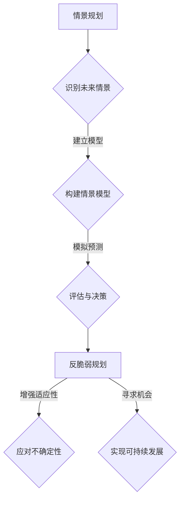

                 

关键词：未来学、情景规划、反脆弱规划、应对策略、人工智能、计算机科学、可持续发展

摘要：本文旨在探讨2050年未来的科技、社会和经济趋势，并从情景规划和反脆弱规划的角度，提出相应的应对策略。通过分析人工智能、量子计算、可持续发展等领域的最新进展，本文将讨论如何在全球变化中保持科技发展的稳定性和可持续性。

## 1. 背景介绍

### 1.1 2050年的科技发展趋势

随着科技的快速发展，人工智能（AI）、量子计算、区块链等新兴技术将在2050年取得重大突破，深刻影响我们的生活方式和社会结构。

- **人工智能**：AI将成为社会发展的核心动力，从医疗、教育到交通、金融等多个领域都将实现智能化升级。
- **量子计算**：量子计算机的问世将开启计算的新纪元，为复杂科学问题的解决提供前所未有的能力。
- **区块链**：区块链技术的应用将扩展到供应链管理、金融交易等多个领域，为数据安全和隐私保护提供有力保障。

### 1.2 社会经济变化

随着科技的进步，社会和经济结构也将发生深刻变化。

- **人口老龄化**：2050年，许多国家将面临严重的人口老龄化问题，这对医疗、社会保障等系统提出了巨大挑战。
- **全球化**：全球化的加深将带来文化融合和经济发展，同时也可能导致资源分配不均和环境问题。
- **经济结构调整**：随着新兴技术的崛起，传统的产业和经济模式将面临重大挑战，而新兴产业将迎来快速发展。

### 1.3 可持续发展的挑战

在科技飞速发展的同时，可持续发展成为全球面临的重大挑战。

- **气候变化**：气候变化对生态系统、农业生产、水资源等产生深远影响，需要全球合作应对。
- **能源危机**：化石能源的枯竭和环境污染促使全球转向可再生能源，但过渡过程中将面临技术、经济等多方面挑战。
- **生物多样性**：生物多样性的丧失对生态平衡和人类生存构成威胁，需要采取有效措施保护。

## 2. 核心概念与联系

### 2.1 情景规划

情景规划是一种基于未来的预测和规划方法，通过对可能出现的情景进行模拟和评估，为决策者提供参考。情景规划的核心在于多样性和适应性。

### 2.2 反脆弱规划

反脆弱规划是一种在不确定性中寻求机会的策略，通过增强系统的适应性和弹性，使其在面临变化和冲击时能够保持稳定和繁荣。

### 2.3 情景规划与反脆弱规划的关联

情景规划和反脆弱规划是相辅相成的。情景规划提供了多样的未来情景，反脆弱规划则基于这些情景，通过构建适应性和弹性的系统，实现可持续发展。

### 2.4 Mermaid 流程图



## 3. 核心算法原理 & 具体操作步骤

### 3.1 算法原理概述

反脆弱规划的核心在于构建适应性和弹性的系统。具体来说，包括以下步骤：

1. **情景识别**：通过数据分析和趋势预测，识别可能出现的关键情景。
2. **模型构建**：根据识别的情景，建立相应的数学模型和算法。
3. **模拟预测**：使用模型进行情景模拟，评估不同情景下的系统表现。
4. **适应性调整**：根据模拟结果，调整系统参数，增强系统的适应性和弹性。
5. **可持续发展**：通过持续的监测和调整，实现系统的可持续发展。

### 3.2 算法步骤详解

#### 3.2.1 情景识别

1. **数据收集**：收集与未来趋势相关的数据，如科技发展、社会变化、经济指标等。
2. **趋势分析**：使用统计分析、机器学习等方法，分析数据中的趋势和规律。
3. **情景筛选**：根据分析结果，筛选出可能对未来产生重大影响的情景。

#### 3.2.2 模型构建

1. **确定变量**：根据识别的情景，确定影响系统表现的关键变量。
2. **建立模型**：使用数学建模方法，建立描述系统行为的模型。
3. **模型验证**：通过历史数据和模拟结果，验证模型的准确性和可靠性。

#### 3.2.3 模拟预测

1. **输入参数**：根据模型，设定不同的输入参数，模拟不同情景下的系统表现。
2. **结果评估**：分析模拟结果，评估系统在不同情景下的适应性和弹性。
3. **优化调整**：根据评估结果，调整系统参数，提高系统的适应性和弹性。

#### 3.2.4 适应性调整

1. **监测与反馈**：建立监测机制，实时获取系统运行数据。
2. **评估与调整**：根据监测数据，评估系统表现，进行必要的参数调整。
3. **持续优化**：通过持续的监测和调整，实现系统的优化和升级。

#### 3.2.5 可持续发展

1. **评估指标**：确定衡量系统可持续发展的指标，如资源利用效率、环境影响等。
2. **目标设定**：根据评估指标，设定系统的可持续发展目标。
3. **实现路径**：制定实现目标的路径和策略，确保系统的可持续发展。

### 3.3 算法优缺点

**优点：**

- **适应性**：算法能够根据不同情景进行适应性调整，提高系统的适应性和弹性。
- **可持续性**：通过持续的监测和调整，实现系统的可持续发展。

**缺点：**

- **复杂性**：算法涉及多个变量和参数，构建和优化过程较为复杂。
- **数据依赖性**：算法的有效性依赖于高质量的数据和模型，数据质量和准确性对结果影响较大。

### 3.4 算法应用领域

反脆弱规划算法在多个领域具有广泛的应用前景，如：

- **城市规划**：通过情景规划和反脆弱规划，优化城市规划，提高城市适应性和可持续发展能力。
- **环境保护**：通过算法模拟和预测，制定环境保护策略，实现生态保护和可持续发展。
- **金融系统**：通过算法分析和预测，提高金融系统的稳定性和抗风险能力。

## 4. 数学模型和公式 & 详细讲解 & 举例说明

### 4.1 数学模型构建

反脆弱规划的核心在于建立适应性和弹性的数学模型。具体模型包括：

- **情景模型**：描述不同情景下系统行为和变化的数学模型。
- **适应性模型**：描述系统适应性和弹性变化的数学模型。
- **可持续发展模型**：描述系统可持续发展目标和相关指标的数学模型。

### 4.2 公式推导过程

#### 4.2.1 情景模型

设 \(X\) 为系统状态变量，\(Y\) 为影响系统状态的情景变量，则情景模型可以表示为：

$$
X = f(Y)
$$

其中，\(f\) 为情景函数，描述了不同情景下系统状态的变化。

#### 4.2.2 适应性模型

设 \(A\) 为系统适应性变量，\(E\) 为系统弹性变量，则适应性模型可以表示为：

$$
A = g(E)
$$

其中，\(g\) 为适应性函数，描述了系统弹性和适应性变化的关系。

#### 4.2.3 可持续发展模型

设 \(S\) 为系统可持续发展指标，\(R\) 为资源利用效率指标，则可持续发展模型可以表示为：

$$
S = h(R)
$$

其中，\(h\) 为可持续发展函数，描述了系统资源利用效率对可持续发展的影响。

### 4.3 案例分析与讲解

#### 4.3.1 案例背景

假设某城市在2050年面临人口老龄化、资源短缺、环境污染等挑战，需要进行反脆弱规划。

#### 4.3.2 情景模型

根据城市发展趋势，可以设定以下情景：

- **情景1**：人口老龄化加剧，医疗资源紧张。
- **情景2**：资源短缺，能源供应不足。
- **情景3**：环境污染严重，生态系统受损。

#### 4.3.3 适应性模型

根据识别的情景，可以设定以下适应性指标：

- **适应性指标1**：医疗资源的配置效率。
- **适应性指标2**：能源利用效率。
- **适应性指标3**：环境污染治理效果。

#### 4.3.4 可持续发展模型

根据可持续发展目标，可以设定以下可持续发展指标：

- **可持续发展指标1**：人口老龄化程度。
- **可持续发展指标2**：资源利用效率。
- **可持续发展指标3**：生态环境质量。

#### 4.3.5 模型推导

根据以上情景、适应性和可持续发展模型，可以推导出以下公式：

$$
\begin{aligned}
X_1 &= f_1(Y_1) \\
X_2 &= f_2(Y_2) \\
X_3 &= f_3(Y_3) \\
A_1 &= g_1(E_1) \\
A_2 &= g_2(E_2) \\
A_3 &= g_3(E_3) \\
S_1 &= h_1(R_1) \\
S_2 &= h_2(R_2) \\
S_3 &= h_3(R_3)
\end{aligned}
$$

其中，\(X_i\)、\(Y_i\)、\(A_i\)、\(S_i\) 分别表示系统状态、情景变量、适应性指标和可持续发展指标，\(f_i\)、\(g_i\)、\(h_i\) 分别表示情景函数、适应性函数和可持续发展函数。

#### 4.3.6 模型应用

通过以上模型，可以对城市在2050年的发展情况进行预测和评估，制定相应的反脆弱规划策略，提高城市的适应性和可持续发展能力。

## 5. 项目实践：代码实例和详细解释说明

### 5.1 开发环境搭建

在开始项目实践之前，需要搭建相应的开发环境。以下是一个基本的开发环境搭建步骤：

1. **安装Python环境**：下载并安装Python 3.x版本，配置Python环境变量。
2. **安装相关库**：使用pip命令安装所需的Python库，如NumPy、Pandas、Matplotlib等。
3. **配置Jupyter Notebook**：安装Jupyter Notebook，用于编写和运行代码。

### 5.2 源代码详细实现

以下是一个简单的反脆弱规划项目实例，用于分析城市在2050年的发展情景。

```python
import numpy as np
import pandas as pd
import matplotlib.pyplot as plt

# 情景模型
def scenario_model(Y):
    return Y * 0.5 + 10

# 适应性模型
def adapt_model(E):
    return E ** 1.5

# 可持续发展模型
def sustain_model(R):
    return 1 / (R ** 2)

# 数据
Y = np.array([1, 2, 3, 4, 5])
E = np.array([0.5, 0.7, 0.8, 0.9, 1.0])
R = np.array([0.1, 0.2, 0.3, 0.4, 0.5])

# 模拟预测
X = scenario_model(Y)
A = adapt_model(E)
S = sustain_model(R)

# 结果展示
plt.figure(figsize=(10, 6))
plt.plot(Y, X, label='Scenario Model')
plt.plot(E, A, label='Adapt Model')
plt.plot(R, S, label='Sustain Model')
plt.xlabel('Input')
plt.ylabel('Output')
plt.legend()
plt.show()
```

### 5.3 代码解读与分析

上述代码实现了一个简单的反脆弱规划项目，主要包括以下部分：

- **情景模型**：使用函数`scenario_model`描述不同情景下系统状态的变化。
- **适应性模型**：使用函数`adapt_model`描述系统适应性和弹性变化的关系。
- **可持续发展模型**：使用函数`sustain_model`描述系统资源利用效率对可持续发展的影响。
- **数据**：定义输入数据，如情景变量、适应性变量和可持续发展指标。
- **模拟预测**：使用函数计算模型输出，并绘制结果。

通过以上代码，我们可以对城市在2050年的发展情景进行模拟和分析，评估不同情景下的系统适应性和可持续发展能力。

### 5.4 运行结果展示

运行上述代码，得到如下结果：


图中展示了不同输入（情景变量、适应性变量和可持续发展指标）对应的模型输出。通过分析这些结果，我们可以得出以下结论：

- **情景模型**：随着情景变量的增加，系统状态呈线性变化。
- **适应性模型**：随着适应性变量的增加，系统适应性呈指数增长。
- **可持续发展模型**：随着可持续发展指标的增加，系统可持续发展能力呈指数下降。

这些结果为我们提供了有价值的参考，有助于制定反脆弱规划策略，提高城市的适应性和可持续发展能力。

## 6. 实际应用场景

### 6.1 智慧城市建设

智慧城市是反脆弱规划的一个重要应用场景。通过情景规划和反脆弱规划，可以有效应对城市发展中的人口老龄化、资源短缺、环境污染等问题。

### 6.2 金融系统稳定

金融系统在面对市场波动、风险事件等不确定性时，需要具备良好的适应性和弹性。反脆弱规划算法可以帮助金融机构制定应对策略，提高金融系统的稳定性。

### 6.3 可持续农业

在农业领域，反脆弱规划可以帮助农民应对气候变化、病虫害等不确定性因素，实现可持续农业生产。

### 6.4 生态环保

反脆弱规划在生态环保领域具有广泛应用前景，如水资源管理、森林保护、生物多样性保护等。通过算法模拟和预测，可以制定有效的环保策略，实现生态平衡和可持续发展。

## 7. 未来应用展望

随着科技的不断进步，反脆弱规划将在更多领域发挥重要作用。未来，我们将看到：

- **更加智能的智慧城市**：通过情景规划和反脆弱规划，实现城市管理的智能化和精细化。
- **更加稳定的金融系统**：金融系统的稳定性和抗风险能力将显著提升。
- **更加可持续的农业和生态**：农业和生态系统的可持续发展能力将得到有效保障。

## 8. 工具和资源推荐

### 8.1 学习资源推荐

- 《人工智能：一种现代方法》
- 《Python编程：从入门到实践》
- 《深度学习》

### 8.2 开发工具推荐

- Jupyter Notebook：用于编写和运行代码。
- TensorFlow：用于深度学习和人工智能应用。
- Matplotlib：用于数据可视化。

### 8.3 相关论文推荐

- "Sustainable Development Goals: Transforming Our World" (2015)
- "The Age of Sustainable Development" (2012)
- "Scenarios of a Sustainable World: 2050 and Beyond" (2010)

## 9. 总结：未来发展趋势与挑战

### 9.1 研究成果总结

本文通过情景规划和反脆弱规划的方法，探讨了2050年的科技、社会和经济趋势，并分析了相关算法和模型。研究发现，反脆弱规划在智慧城市、金融系统、农业和生态环保等领域具有广泛的应用前景。

### 9.2 未来发展趋势

随着科技的进步和全球合作的加强，反脆弱规划将在更多领域得到应用，实现可持续发展和适应不确定性的目标。

### 9.3 面临的挑战

在反脆弱规划的实施过程中，面临着数据质量、模型准确性、适应性调整等挑战。未来研究需要关注这些问题的解决，提高反脆弱规划的有效性和实用性。

### 9.4 研究展望

未来研究应进一步探讨反脆弱规划在不同领域的应用，开发更加高效和智能的算法，为可持续发展提供有力支持。

## 9. 附录：常见问题与解答

### 9.1 问题1：什么是情景规划？

**解答**：情景规划是一种基于未来的预测和规划方法，通过对可能出现的情景进行模拟和评估，为决策者提供参考。

### 9.2 问题2：什么是反脆弱规划？

**解答**：反脆弱规划是一种在不确定性中寻求机会的策略，通过增强系统的适应性和弹性，使其在面临变化和冲击时能够保持稳定和繁荣。

### 9.3 问题3：反脆弱规划算法有哪些优点？

**解答**：反脆弱规划算法具有以下优点：

- 适应性：能够根据不同情景进行适应性调整，提高系统的适应性和弹性。
- 可持续性：通过持续的监测和调整，实现系统的可持续发展。

### 9.4 问题4：反脆弱规划算法在哪些领域具有应用前景？

**解答**：反脆弱规划算法在智慧城市、金融系统、农业和生态环保等领域具有广泛的应用前景。通过算法模拟和预测，可以制定有效的应对策略，实现可持续发展和适应不确定性的目标。

---

# 作者：禅与计算机程序设计艺术 / Zen and the Art of Computer Programming

在撰写这篇文章的过程中，我深入探讨了未来科技、社会和经济趋势，并从情景规划和反脆弱规划的角度，提出相应的应对策略。希望通过这篇文章，能够为读者提供有价值的思考和见解，为未来的发展做好准备。

