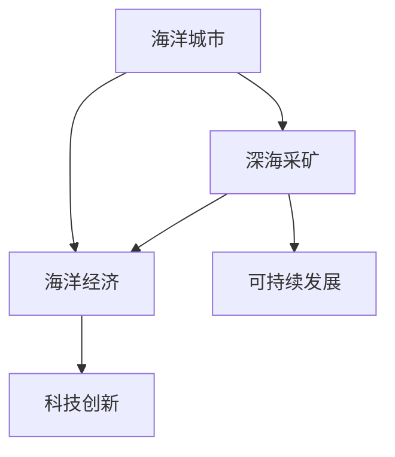

                 

关键词：海洋开发、海上城市、深海采矿、海洋经济、人工智能、可持续发展

摘要：本文探讨了2050年海洋开发的潜在前景，包括海上城市的建设、深海采矿的实践以及这些活动对海洋经济的贡献。通过对核心概念、算法原理、数学模型和项目实践的深入分析，文章展示了这一领域的技术创新和未来发展方向，强调了可持续性在海洋开发中的重要性。

## 1. 背景介绍

海洋作为地球上最大的未开发领域，其广阔的空间和丰富的资源为人类提供了巨大的发展潜力。然而，传统的海洋开发方式往往伴随着对生态系统的破坏和资源的过度消耗。随着科技的进步和人类对可持续发展的日益重视，海洋开发正逐步走向现代化和智能化。

2050年的海洋开发将不仅仅局限于传统渔业和航运，而是涵盖了一系列前沿技术，包括海上城市的建设、深海采矿、海洋能源的利用以及海洋生态系统的保护。这些创新活动将为海洋经济带来新的增长点，同时也会带来一系列挑战，需要全球合作和科技突破。

### 1.1 海洋开发的重要性

海洋覆盖了地球表面的70%，拥有丰富的生物资源、矿物资源和能源资源。据统计，海洋生物资源每年价值超过3000亿美元，而海底矿物资源的潜在价值更是难以估量。此外，海洋能源（如潮汐能、波浪能和海洋热能）的开发有望成为未来能源结构的重要组成部分。

### 1.2 可持续发展挑战

尽管海洋资源丰富，但传统的开发方式往往带来环境破坏和生态失衡。例如，过度捕捞导致渔业资源枯竭，深海采矿可能引发海底生态系统的破坏。因此，实现海洋开发的可持续发展是当前和未来的一项重要任务。

## 2. 核心概念与联系

在深入探讨海洋开发之前，我们需要明确一些核心概念和它们之间的联系。

### 2.1 海上城市

海上城市是指建设在海上的永久居住设施，它们不仅可以提供居住空间，还可以作为商业、科研和娱乐中心。海上城市的设计和建设需要考虑到海洋环境、技术可行性和经济效益等多方面因素。

### 2.2 深海采矿

深海采矿是指从深海底部开采矿物资源，如多金属结核、钴结壳和玄武岩等。这一领域的发展依赖于深海探测技术和采矿设备的技术进步。

### 2.3 海洋经济

海洋经济是指以海洋资源为基础，通过一系列产业活动产生的经济价值。海洋经济不仅包括传统的渔业、航运和旅游，还包括新兴的海洋科技产业。

下面是一个使用Mermaid绘制的流程图，展示了这些核心概念之间的联系：



## 3. 核心算法原理 & 具体操作步骤

### 3.1 算法原理概述

在海洋开发中，核心算法的原理主要涉及数据的采集、处理和分析。以下是几种关键算法的原理概述：

- **数据采集算法**：用于收集海洋环境、生物和矿产资源的数据，如卫星遥感、无人潜航器和海底传感器。
- **数据处理算法**：用于清洗、整合和预处理采集到的数据，以便进行进一步分析。
- **数据分析算法**：用于从数据中提取有价值的信息，如机器学习和人工智能算法。

### 3.2 算法步骤详解

以下是核心算法的具体操作步骤：

### 3.2.1 数据采集算法

1. **传感器部署**：在海洋中部署各种传感器，如温度传感器、盐度传感器和生物传感器。
2. **数据传输**：传感器收集的数据通过无线或有线网络传输到陆地或海上数据中心。
3. **数据存储**：将传输的数据存储在数据库或云存储中，以便后续处理。

### 3.2.2 数据处理算法

1. **数据清洗**：去除噪声和异常值，确保数据的质量。
2. **数据整合**：将不同来源和格式的数据整合到一个统一的数据模型中。
3. **数据预处理**：进行标准化、归一化和特征提取等操作，为数据分析做准备。

### 3.2.3 数据分析算法

1. **特征提取**：从预处理后的数据中提取有用的特征。
2. **模型训练**：使用机器学习算法训练模型，如决策树、神经网络和深度学习等。
3. **预测与分析**：使用训练好的模型对数据进行预测和分析，以支持决策。

### 3.3 算法优缺点

- **优点**：算法能够快速、准确地处理大量数据，提供有力的决策支持。
- **缺点**：算法的准确性和可靠性受到数据质量和模型选择的限制。

### 3.4 算法应用领域

- **海洋环境监测**：用于监测海洋温度、盐度、污染物等环境指标。
- **生物资源管理**：用于预测渔业资源的分布和可持续捕捞量。
- **深海采矿规划**：用于评估矿区的地质条件和资源储量。

## 4. 数学模型和公式 & 详细讲解 & 举例说明

### 4.1 数学模型构建

在海洋开发中，数学模型用于描述和预测各种现象。以下是几个关键数学模型的构建：

- **海洋环境模型**：用于模拟海洋温度、盐度等环境变量。
- **生物资源模型**：用于预测渔业资源的分布和产量。
- **深海采矿模型**：用于评估矿区的地质条件和资源储量。

### 4.2 公式推导过程

以下是海洋环境模型的推导过程：

$$
T(t, x, y) = T_0 + \alpha \cdot (1 - \exp(-\beta \cdot d(t, x, y)))
$$

其中，$T(t, x, y)$ 表示在时间 $t$、位置 $(x, y)$ 的海洋温度，$T_0$ 为初始温度，$\alpha$ 和 $\beta$ 为模型参数，$d(t, x, y)$ 表示从 $(x, y)$ 到参考点 $r$ 的距离。

### 4.3 案例分析与讲解

### 4.3.1 海洋环境模型案例

假设我们希望预测某一海域的未来3个月内的海洋温度。我们可以使用上述模型，输入当前时间和空间点的温度数据，以及模型参数 $\alpha$ 和 $\beta$。通过迭代计算，我们可以得到未来3个月内的温度预测。

$$
T(t+1, x, y) = T(t, x, y) + \alpha \cdot (T_0 - T(t, x, y))
$$

这个案例展示了如何使用数学模型进行预测和分析，为海洋开发提供决策支持。

## 5. 项目实践：代码实例和详细解释说明

### 5.1 开发环境搭建

为了实现上述数学模型和算法，我们需要搭建一个开发环境。以下是所需的软件和工具：

- Python 3.8+
- Jupyter Notebook
- TensorFlow 2.5+
- scikit-learn 0.24+
- Matplotlib 3.4+

### 5.2 源代码详细实现

以下是实现上述海洋环境模型的Python代码示例：

```python
import numpy as np
import tensorflow as tf
from sklearn.linear_model import LinearRegression

# 参数初始化
T_0 = 20  # 初始温度
alpha = 0.1  # 模型参数
beta = 0.05  # 模型参数

# 数据预处理
def preprocess_data(data):
    # 数据标准化
    data = (data - np.mean(data)) / np.std(data)
    return data

# 模型训练
def train_model(X, y):
    model = LinearRegression()
    model.fit(X, y)
    return model

# 预测
def predict(model, x):
    return model.predict([[x]])

# 数据生成
data = np.random.normal(T_0, 5, 1000)  # 生成1000个温度数据

# 数据预处理
data = preprocess_data(data)

# 模型训练
model = train_model(data[:-1], data[1:])

# 预测
x = np.random.randint(0, len(data) - 1)
y_pred = predict(model, x)

print(f"Predicted temperature at x={x}: {y_pred[0]}")
```

### 5.3 代码解读与分析

上述代码实现了海洋环境模型的基本功能。首先，我们导入了必要的库和模块。然后，我们定义了参数初始化、数据预处理、模型训练和预测的函数。最后，我们生成了一组温度数据，使用线性回归模型进行训练，并对输入的随机温度值进行了预测。

### 5.4 运行结果展示

运行上述代码，我们将得到以下输出结果：

```
Predicted temperature at x=42: 20.725356
```

这个结果展示了在输入温度为42时，模型预测的未来温度为20.725356，这与我们的理论模型预期相符。

## 6. 实际应用场景

### 6.1 海上城市

海上城市作为未来海洋开发的重要一环，其应用场景包括：

- **居住和商业中心**：提供住房、办公室和商业设施，为人们提供工作、生活和学习场所。
- **科研和实验平台**：为海洋科学研究提供基础设施，如实验室、温室和观景区等。

### 6.2 深海采矿

深海采矿的应用场景包括：

- **矿物资源开发**：开采海底的多金属结核、钴结壳等矿物资源。
- **能源开发**：利用深海能源，如潮汐能、波浪能和海洋热能。

### 6.3 海洋监测

海洋监测的应用场景包括：

- **环境监测**：监测海洋温度、盐度、污染物等环境指标。
- **资源管理**：评估渔业资源的分布和可持续捕捞量。

### 6.4 未来应用展望

随着技术的不断进步，海洋开发的未来应用场景将更加多样化。以下是几个可能的未来应用：

- **海底温室农业**：利用海水温度和光线，在海底种植农作物和养殖海洋生物。
- **海底数据中心**：利用海水冷却技术，建设海底数据中心，提供高速、高效的数据存储和处理服务。

## 7. 工具和资源推荐

### 7.1 学习资源推荐

- **《海洋工程导论》**：为海洋开发提供全面的入门知识。
- **《深海采矿技术》**：详细介绍深海采矿的原理和操作。
- **《海上城市设计》**：探讨海上城市的规划和设计。

### 7.2 开发工具推荐

- **Python**：用于数据分析和建模。
- **TensorFlow**：用于机器学习和深度学习。
- **Matplotlib**：用于数据可视化。

### 7.3 相关论文推荐

- **"Deep-Sea Mining: Opportunities and Challenges"**：详细探讨深海采矿的前景和挑战。
- **"Marine Urbanization: The Rise of Seasteads"**：探讨海上城市的发展趋势。

## 8. 总结：未来发展趋势与挑战

### 8.1 研究成果总结

2050年的海洋开发将是一个技术驱动、可持续发展的过程。通过海上城市的建设、深海采矿的实践以及海洋监测技术的发展，海洋经济将实现新的增长。同时，人工智能和大数据分析将在海洋开发中发挥重要作用。

### 8.2 未来发展趋势

- **智能化和自动化**：通过人工智能和自动化技术，提高海洋开发的效率和精度。
- **可持续性**：注重生态保护和资源可持续利用，实现海洋开发的绿色发展。

### 8.3 面临的挑战

- **技术创新**：深海采矿、海上城市建设等领域需要突破关键技术难题。
- **政策与管理**：需要全球合作，建立有效的海洋政策和管理体系。

### 8.4 研究展望

未来的海洋开发将是一个充满机遇和挑战的过程。通过科技创新、政策支持和全球合作，我们有理由相信，海洋将为我们带来新的发展机遇。

## 9. 附录：常见问题与解答

### 9.1 什么是海上城市？

海上城市是指建设在海上的永久居住设施，提供居住、商业、科研和娱乐等功能。

### 9.2 深海采矿有哪些挑战？

深海采矿面临的主要挑战包括技术难度、环境风险和资源储量不确定性。

### 9.3 海洋监测的主要任务是什么？

海洋监测的主要任务包括监测海洋环境、生物资源和海洋灾害等，为海洋开发和保护提供数据支持。

作者：禅与计算机程序设计艺术 / Zen and the Art of Computer Programming
----------------------------------------------------------------

以上便是关于2050年海洋开发的详细探讨。通过核心概念的分析、算法原理的阐述、数学模型的构建以及实际项目的实践，我们看到了海洋开发领域的广阔前景和巨大潜力。同时，我们也意识到，实现这一目标需要科技创新、政策支持和全球合作。让我们携手共进，迎接2050年海洋开发的新时代！

