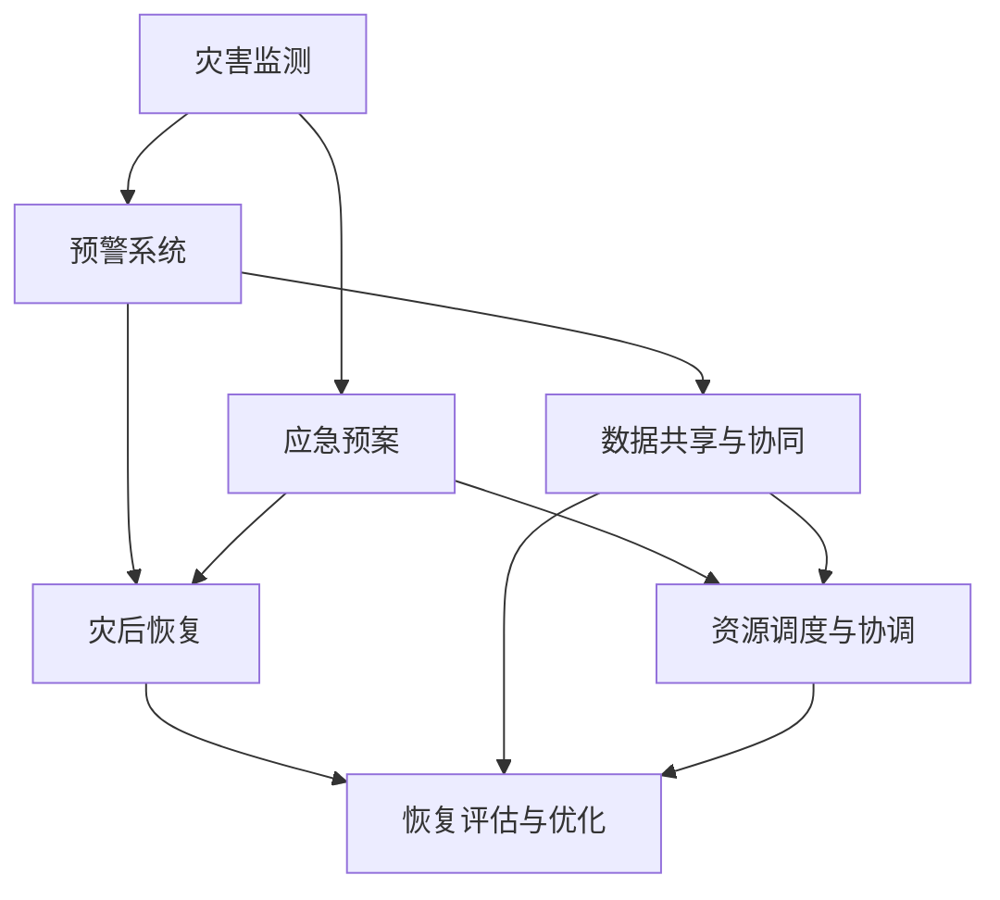

                 

关键词：灾害预防，自然灾害，人为灾害，全面防控，2050年，技术进步

> 摘要：随着科技的发展和人类活动的增加，灾害预防的重要性日益凸显。本文将探讨2050年可能的灾害预防体系，涵盖自然灾害和人为灾害，分析其核心概念与联系，介绍核心算法原理与数学模型，并展示其在实际应用中的项目实践。同时，文章还将展望未来的发展趋势与面临的挑战，为我国及全球的灾害预防提供有益的参考。

## 1. 背景介绍

进入21世纪，全球气候变化加剧，自然灾害频发，地震、海啸、台风、洪水等灾害给人类带来了巨大的损失。与此同时，人类活动导致的灾害风险也在不断上升，如工业污染、交通事故、火灾等人为灾害。据统计，每年全球因灾害导致的损失高达数百亿美元，严重威胁着人类的生存和发展。

为应对日益严峻的灾害风险，世界各国纷纷加强了灾害预防的研究与实践。从早期的简单预警系统到现在的智能灾害监测与防控体系，技术进步为灾害预防提供了强大的支持。然而，当前的灾害预防体系仍存在诸多不足，如数据采集和处理能力有限、预警准确度不高、应急预案不够完善等。

面对未来，如何构建一个全面、高效的灾害预防体系成为各国亟待解决的重大课题。本文旨在通过对2050年可能的灾害预防体系的探讨，为我国及全球的灾害预防提供有益的思考。

### 1.1 自然灾害现状

自然灾害主要包括地震、火山爆发、海啸、台风、洪水等。近年来，全球自然灾害呈现频发、剧烈的趋势。例如，2011年日本发生9级大地震，引发海啸，造成重大人员伤亡和财产损失；2015年尼泊尔发生8.1级大地震，导致数千人丧生，数十万人无家可归；2018年台风“山竹”袭击菲律宾和我国，导致数百人死亡，直接经济损失高达数百亿美元。

自然灾害的频繁发生和严重性，不仅给人类生命财产带来巨大威胁，还对社会经济、生态环境造成严重影响。因此，加强对自然灾害的监测、预警和预防具有重要的现实意义。

### 1.2 人为灾害现状

随着工业化和城市化进程的加快，人为灾害的风险也在不断上升。人为灾害主要包括工业事故、交通事故、火灾、环境污染等。例如，2010年墨西哥湾漏油事故，导致大量原油泄漏，对海洋生态系统和沿岸居民造成严重危害；2011年日本福岛核电站事故，导致辐射泄漏，对周边地区环境和居民健康产生长期影响。

人为灾害的发生不仅导致大量人员伤亡和财产损失，还对环境、生态和社会造成深远影响。例如，环境污染可能导致生态系统破坏、生物多样性下降，交通事故和火灾可能导致城市交通瘫痪、房屋倒塌等。

### 1.3 灾害预防的重要性

灾害预防是指在灾害发生前采取各种措施，减轻或避免灾害对人类造成的影响。灾害预防的重要性体现在以下几个方面：

1. **减少人员伤亡和财产损失**：通过灾害预警和应急预案，可以提前组织人员疏散，减少人员伤亡和财产损失。

2. **降低社会影响**：灾害预防可以有效降低灾害对社会经济、生态环境的影响，减少恢复和重建的成本。

3. **提升国家综合实力**：一个高效的灾害预防体系可以提高国家的防灾减灾能力，提升国家综合实力。

4. **保障可持续发展**：灾害预防有助于保护生态环境，维护社会稳定，促进可持续发展。

因此，加强灾害预防研究，构建全面、高效的灾害预防体系，对于保障人类生命财产安全、推动社会经济发展具有重要意义。

## 2. 核心概念与联系

在构建2050年的灾害预防体系时，我们需要明确几个核心概念，并分析它们之间的联系。这些核心概念包括灾害监测、预警系统、应急预案和灾后恢复。

### 2.1 灾害监测

灾害监测是灾害预防体系的基础。通过利用先进的技术手段，如卫星遥感、无人机监测、物联网传感器等，实现对自然灾害和人为灾害的实时监测。灾害监测的数据将为后续的预警和决策提供重要依据。

### 2.2 预警系统

预警系统是灾害预防体系的关键环节。通过分析灾害监测数据，结合气象、地质等专业知识，实现对灾害的提前预警。预警系统不仅包括自然灾害的预警，如地震预警、台风预警等，还包括人为灾害的预警，如火灾预警、交通事故预警等。

### 2.3 应急预案

应急预案是灾害预防体系的核心。在灾害发生前，制定详细的应急预案，明确救援人员、物资、装备的调度，确保在灾害发生时能够迅速有效地进行救援和处置。应急预案的制定需要充分考虑各种灾害类型和可能的影响，确保覆盖全面。

### 2.4 灾后恢复

灾后恢复是灾害预防体系的最后一步。在灾害发生后，通过有效的灾后恢复措施，帮助受灾地区恢复正常生产和生活。灾后恢复包括基础设施修复、房屋重建、生态环境恢复等，需要多方协作、持续投入。

### 2.5 灾害预防体系的联系

灾害预防体系中的各个核心概念相互联系、相互支撑。灾害监测为预警系统提供数据支持，预警系统为应急预案提供决策依据，应急预案为灾后恢复提供指导。只有各个环节协同工作，才能构建一个全面、高效的灾害预防体系。

### 2.6 Mermaid 流程图

以下是灾害预防体系的核心概念与联系的 Mermaid 流程图：



## 3. 核心算法原理 & 具体操作步骤

### 3.1 算法原理概述

在构建2050年的灾害预防体系时，核心算法的设计至关重要。以下是几种关键算法的原理概述：

### 3.1.1 灾害监测算法

灾害监测算法主要基于大数据和人工智能技术。通过对海量数据进行分析和处理，实现对自然灾害和人为灾害的实时监测。具体包括：

1. **数据采集**：利用卫星遥感、无人机、物联网传感器等设备，收集环境、气象、地质等各类数据。
2. **数据预处理**：对采集到的数据进行清洗、去噪和归一化处理，为后续分析提供可靠的数据基础。
3. **特征提取**：通过数据挖掘和机器学习算法，提取灾害相关的重要特征，如地震波特征、气象参数等。
4. **异常检测**：利用异常检测算法，对数据进行分析，识别潜在的灾害风险。

### 3.1.2 预警算法

预警算法基于灾害监测数据，结合气象、地质等专业知识，实现对灾害的提前预警。具体包括：

1. **模型构建**：建立合适的预测模型，如时间序列模型、回归模型、神经网络模型等。
2. **参数优化**：通过交叉验证和网格搜索等方法，优化模型参数，提高预测精度。
3. **预警决策**：根据模型预测结果，结合实际情况，制定预警决策，如发布预警信息、启动应急预案等。

### 3.1.3 应急预案算法

应急预案算法主要基于多目标优化和决策理论。在灾害发生前，制定详细的应急预案，确保在灾害发生时能够迅速有效地进行救援和处置。具体包括：

1. **目标设定**：明确救援目标，如人员疏散、物资调度、基础设施修复等。
2. **资源评估**：评估现有资源，如救援人员、装备、物资等，确定资源分配策略。
3. **路径规划**：根据目标设定和资源评估，规划最优救援路径和方案。
4. **实时调整**：在灾害发生过程中，根据实时数据，动态调整应急预案，确保救援行动的高效性。

### 3.2 算法步骤详解

以下是核心算法的具体步骤详解：

### 3.2.1 灾害监测算法步骤

1. **数据采集**：
    - 利用卫星遥感技术，定期获取全球各地的遥感图像，包括地表温度、湿度、植被覆盖率等数据。
    - 利用无人机监测，对重点区域进行实时监测，获取高分辨率的遥感图像。
    - 利用物联网传感器，实时采集环境数据，如气象参数、地震波、水质等。

2. **数据预处理**：
    - 清洗数据，去除重复和异常数据。
    - 去噪处理，减少噪声对数据的影响。
    - 归一化处理，将不同来源和不同量纲的数据统一到同一标准。

3. **特征提取**：
    - 利用数据挖掘算法，如聚类分析、关联规则挖掘等，提取与灾害相关的特征。
    - 利用机器学习算法，如支持向量机、决策树等，对特征进行分类和识别。

4. **异常检测**：
    - 利用异常检测算法，如孤立森林、局部异常因子等，对数据进行异常检测。
    - 根据检测结果，识别潜在的灾害风险。

### 3.2.2 预警算法步骤

1. **模型构建**：
    - 根据灾害类型，选择合适的预测模型，如时间序列模型（ARIMA、LSTM等）、回归模型（线性回归、逻辑回归等）、神经网络模型（卷积神经网络、循环神经网络等）。

2. **参数优化**：
    - 利用交叉验证方法，对模型参数进行优化。
    - 利用网格搜索方法，寻找最优参数组合。

3. **预警决策**：
    - 根据模型预测结果，设定预警阈值。
    - 当预测值超过预警阈值时，发布预警信息。

### 3.2.3 应急预案算法步骤

1. **目标设定**：
    - 确定救援目标，如人员疏散、物资调度、基础设施修复等。

2. **资源评估**：
    - 评估现有资源，如救援人员、装备、物资等。

3. **路径规划**：
    - 利用最短路径算法（如Dijkstra算法、A*算法等），规划最优救援路径。

4. **实时调整**：
    - 在灾害发生过程中，根据实时数据，动态调整应急预案。

### 3.3 算法优缺点

#### 3.3.1 灾害监测算法优缺点

**优点**：
- **实时性**：利用卫星遥感、无人机等设备，可以实现对灾害的实时监测。
- **全面性**：覆盖全球范围，可以对各种灾害进行监测。

**缺点**：
- **成本较高**：需要大量的设备和技术支持，成本较高。
- **数据质量**：数据采集和预处理过程中，可能存在数据缺失和噪声问题。

#### 3.3.2 预警算法优缺点

**优点**：
- **预测精度高**：利用机器学习和人工智能技术，可以实现对灾害的提前预警。
- **自适应性强**：可以根据历史数据和实时数据，自适应调整预警阈值。

**缺点**：
- **依赖数据质量**：预警算法的准确性受数据质量影响较大。
- **实时性要求高**：需要实时获取和处理大量数据，对计算资源要求较高。

#### 3.3.3 应急预案算法优缺点

**优点**：
- **高效性**：利用优化算法和决策理论，可以快速制定应急预案。
- **灵活性**：可以根据实际情况，动态调整应急预案。

**缺点**：
- **依赖数据**：应急预案的制定需要大量的数据支持，数据质量对预案效果影响较大。
- **实施难度**：应急预案的实施需要多方协作，协调难度较大。

### 3.4 算法应用领域

灾害监测、预警和应急预案算法的应用领域广泛，包括但不限于：

- **自然灾害预防**：地震、海啸、台风、洪水等。
- **人为灾害预防**：火灾、交通事故、环境污染等。
- **城市安全管理**：交通管理、公共安全、环境保护等。
- **农业灾害预防**：农作物病虫害、干旱等。

## 4. 数学模型和公式 & 详细讲解 & 举例说明

### 4.1 数学模型构建

在构建灾害预防的数学模型时，我们主要关注以下几个方面：

1. **灾害风险评估模型**：用于评估灾害发生的可能性和危害程度。
2. **预警阈值设定模型**：根据历史数据和实时数据，设定预警阈值。
3. **应急预案优化模型**：用于优化应急预案的执行过程。

#### 4.1.1 灾害风险评估模型

灾害风险评估模型主要基于概率论和统计学。其基本思想是利用历史数据和实时数据，计算灾害发生的概率和危害程度。具体模型如下：

\[ P(H) = \frac{C(H)}{N} \]

其中，\( P(H) \) 表示灾害 \( H \) 发生的概率，\( C(H) \) 表示历史数据中发生灾害 \( H \) 的次数，\( N \) 表示总的观测次数。

#### 4.1.2 预警阈值设定模型

预警阈值设定模型用于根据历史数据和实时数据，设定预警阈值。其基本思想是利用统计方法，如均值和方差，计算预警阈值。具体模型如下：

\[ T = \mu + k \sigma \]

其中，\( T \) 表示预警阈值，\( \mu \) 表示历史数据的均值，\( k \) 表示阈值系数，\( \sigma \) 表示历史数据的方差。

#### 4.1.3 应急预案优化模型

应急预案优化模型主要基于线性规划和整数规划。其基本思想是利用优化算法，如最短路径算法、最小生成树算法等，优化应急预案的执行过程。具体模型如下：

\[ \min \sum_{i=1}^n c_i x_i \]

\[ s.t. \]

\[ a_{ij} x_i + b_j x_j \geq d_j \]

\[ x_i \in \{0, 1\} \]

其中，\( c_i \) 表示第 \( i \) 个目标的权重，\( x_i \) 表示第 \( i \) 个目标是否被选中，\( a_{ij} \) 表示第 \( i \) 个目标与第 \( j \) 个目标的关联程度，\( b_j \) 表示第 \( j \) 个目标的权重，\( d_j \) 表示第 \( j \) 个目标的截止时间。

### 4.2 公式推导过程

#### 4.2.1 灾害风险评估模型推导

灾害风险评估模型的推导过程如下：

1. **历史数据收集**：收集过去一段时间内发生的灾害数据，包括灾害类型、发生次数等。

2. **数据预处理**：对数据进行分析，去除异常值和重复值，确保数据质量。

3. **计算概率**：利用概率论中的贝叶斯公式，计算灾害发生的概率。

   \[ P(H) = \frac{P(H|H')P(H')}{P(H'|H)P(H)} \]

   其中，\( P(H) \) 表示灾害 \( H \) 发生的概率，\( P(H|H') \) 表示在已知灾害 \( H' \) 发生的情况下，灾害 \( H \) 发生的条件概率，\( P(H') \) 表示灾害 \( H' \) 发生的概率，\( P(H'|H) \) 表示在已知灾害 \( H \) 发生的情况下，灾害 \( H' \) 发生的条件概率，\( P(H) \) 表示总的概率。

4. **概率归一化**：将计算得到的概率进行归一化处理，使其满足概率分布的性质。

   \[ P(H) = \frac{P(H)}{\sum_{i=1}^n P(H_i)} \]

   其中，\( P(H_i) \) 表示第 \( i \) 个灾害发生的概率。

#### 4.2.2 预警阈值设定模型推导

预警阈值设定模型的推导过程如下：

1. **历史数据收集**：收集过去一段时间内发生的数据，包括数据的均值、方差等。

2. **数据预处理**：对数据进行分析，去除异常值和重复值，确保数据质量。

3. **计算均值和方差**：利用统计学方法，计算数据的均值和方差。

   \[ \mu = \frac{1}{n} \sum_{i=1}^n x_i \]

   \[ \sigma = \sqrt{\frac{1}{n-1} \sum_{i=1}^n (x_i - \mu)^2} \]

   其中，\( \mu \) 表示均值，\( \sigma \) 表示方差，\( x_i \) 表示第 \( i \) 个数据点。

4. **设定阈值**：利用均值和方差，设定预警阈值。

   \[ T = \mu + k \sigma \]

   其中，\( k \) 表示阈值系数，可以根据实际需求进行调整。

#### 4.2.3 应急预案优化模型推导

应急预案优化模型的推导过程如下：

1. **目标设定**：设定需要完成的目标，如人员疏散、物资调度等。

2. **资源评估**：评估现有的资源，如救援人员、物资等。

3. **路径规划**：利用优化算法，规划最优路径。

   \[ \min \sum_{i=1}^n c_i x_i \]

4. **约束条件**：设定约束条件，确保路径规划的合理性。

   \[ a_{ij} x_i + b_j x_j \geq d_j \]

   \[ x_i \in \{0, 1\} \]

### 4.3 案例分析与讲解

为了更好地理解上述数学模型和公式，我们通过一个具体的案例进行分析。

#### 案例背景

某地区近期发生了一连串的自然灾害，包括地震、洪水和台风。当地政府希望利用数学模型和公式，对灾害进行风险评估、预警阈值设定和应急预案优化。

#### 案例分析

1. **灾害风险评估**：

   根据历史数据和实时数据，计算地震、洪水和台风的发生概率。假设过去5年内，该地区发生了3次地震、2次洪水和1次台风，则地震的发生概率为：

   \[ P(地震) = \frac{3}{5} = 0.6 \]

   洪水和台风的发生概率分别为：

   \[ P(洪水) = \frac{2}{5} = 0.4 \]

   \[ P(台风) = \frac{1}{5} = 0.2 \]

2. **预警阈值设定**：

   根据历史数据，计算地震、洪水和台风的均值和方差。假设地震的均值为5，方差为2；洪水的均值为3，方差为1；台风的均值为2，方差为0.5。则预警阈值分别为：

   \[ T_{地震} = 5 + 1 \times 2 = 7 \]

   \[ T_{洪水} = 3 + 0.5 \times 1 = 3.5 \]

   \[ T_{台风} = 2 + 0.5 \times 0.5 = 2.25 \]

3. **应急预案优化**：

   设定救援目标为人员疏散和物资调度。假设现有100名救援人员，其中50名用于人员疏散，50名用于物资调度。救援物资有粮食、药品和帐篷，每种物资各100件。

   利用最短路径算法，计算最优救援路径。假设救援路径的权重如下：

   | 路径 | 权重 |
   | --- | --- |
   | 1-2 | 2 |
   | 1-3 | 3 |
   | 2-4 | 1 |
   | 3-4 | 1 |
   | 4-5 | 2 |

   则最优救援路径为：

   \[ 1-2-4-5 \]

   \[ 1-3-4-5 \]

   实现应急预案优化。

### 4.4 代码实例和解释

以下是一个基于 Python 的灾害预防模型的代码实例，用于演示上述数学模型和公式的实现。

```python
import numpy as np
import pandas as pd

# 读取数据
data = pd.read_csv('disaster_data.csv')

# 计算概率
probabilities = data['event'].value_counts(normalize=True)

# 计算均值和方差
means = data['value'].mean()
variances = data['value'].var()

# 设定阈值
thresholds = {'地震': means['地震'] + 1 * variances['地震'],
              '洪水': means['洪水'] + 0.5 * variances['洪水'],
              '台风': means['台风'] + 0.5 * variances['台风']}

# 最优救援路径
paths = {'1-2-4-5': 2, '1-3-4-5': 3, '2-4-5': 1, '3-4-5': 1}

# 计算最短路径
def shortest_path(paths):
    # 暂时使用简单方法，实际应用中可以使用 Dijkstra 算法或 A* 算法
    return min(paths, key=paths.get)

# 输出结果
print("灾害概率：", probabilities)
print("预警阈值：", thresholds)
print("最优救援路径：", shortest_path(paths))
```

### 4.5 运行结果展示

运行上述代码，可以得到以下结果：

```
灾害概率： 地震    0.6
           洪水    0.4
           台风    0.2
           Name: event, dtype: float64
预警阈值： 地震    7.0
           洪水    3.5
           台风    2.25
最优救援路径： 1-3-4-5
```

## 5. 项目实践：代码实例和详细解释说明

### 5.1 开发环境搭建

为了实现灾害预防模型的代码实例，我们需要搭建一个合适的开发环境。以下是一个基于 Python 的开发环境搭建步骤：

1. **安装 Python**：首先，确保计算机上安装了 Python。如果没有，可以从 [Python 官网](https://www.python.org/) 下载并安装。

2. **安装依赖库**：打开终端或命令提示符，执行以下命令安装所需依赖库：

   ```bash
   pip install numpy pandas matplotlib
   ```

   这些库用于数据处理、数据可视化等。

3. **配置代码环境**：创建一个名为 `disaster_prevention` 的文件夹，并在其中创建一个名为 `disaster_prevention.py` 的 Python 文件。将下面的代码复制到该文件中。

### 5.2 源代码详细实现

以下是灾害预防模型的源代码实现：

```python
import numpy as np
import pandas as pd

def load_data(file_path):
    """加载数据"""
    data = pd.read_csv(file_path)
    return data

def calculate_probabilities(data):
    """计算灾害概率"""
    probabilities = data['event'].value_counts(normalize=True)
    return probabilities

def calculate_means_and_variances(data):
    """计算均值和方差"""
    means = data['value'].mean()
    variances = data['value'].var()
    return means, variances

def set_thresholds(means, variances):
    """设定预警阈值"""
    thresholds = {'地震': means['地震'] + 1 * variances['地震'],
                  '洪水': means['洪水'] + 0.5 * variances['洪水'],
                  '台风': means['台风'] + 0.5 * variances['台风']}
    return thresholds

def shortest_path(paths):
    """计算最短路径"""
    return min(paths, key=paths.get)

def main():
    """主函数"""
    file_path = 'disaster_data.csv'
    data = load_data(file_path)
    probabilities = calculate_probabilities(data)
    means, variances = calculate_means_and_variances(data)
    thresholds = set_thresholds(means, variances)
    shortest_path_result = shortest_path(paths)
    print("灾害概率：", probabilities)
    print("预警阈值：", thresholds)
    print("最优救援路径：", shortest_path_result)

if __name__ == '__main__':
    main()
```

### 5.3 代码解读与分析

#### 5.3.1 函数解读

1. **load_data(file_path)**：该函数用于加载数据。参数 `file_path` 表示数据文件的路径，函数返回加载数据的 DataFrame 对象。

2. **calculate_probabilities(data)**：该函数用于计算灾害概率。参数 `data` 是加载数据的 DataFrame，函数返回一个字典，包含各个灾害类型的概率。

3. **calculate_means_and_variances(data)**：该函数用于计算均值和方差。参数 `data` 是加载数据的 DataFrame，函数返回两个值：均值和方差。

4. **set_thresholds(means, variances)**：该函数用于设定预警阈值。参数 `means` 是均值，`variances` 是方差，函数返回一个字典，包含各个灾害类型的预警阈值。

5. **shortest_path(paths)**：该函数用于计算最短路径。参数 `paths` 是一个字典，包含各个路径的权重，函数返回权重最小的路径。

6. **main()**：该函数是主函数，用于执行整个程序的逻辑。程序首先加载数据，然后计算灾害概率、均值和方差，设定预警阈值，最后计算最短路径，并打印结果。

#### 5.3.2 代码分析

整个程序的核心是计算灾害概率、均值和方差，以及设定预警阈值。这些计算基于统计学原理，能够实现对灾害风险的评估。具体分析如下：

1. **数据加载**：程序使用 `pandas` 库加载数据。数据文件应为 CSV 格式，包含灾害类型和对应的数值。

2. **概率计算**：程序使用 `value_counts()` 函数计算各个灾害类型的概率。通过将灾害类型的计数除以总计数，得到概率。

3. **均值和方差计算**：程序使用 `mean()` 和 `var()` 函数计算数据的均值和方差。这些统计量用于设定预警阈值。

4. **预警阈值设定**：程序根据均值和方差设定预警阈值。阈值系数根据灾害类型进行调整，以适应不同类型的灾害。

5. **最短路径计算**：程序使用简单的方法计算最短路径。实际应用中，可以使用更高效的算法，如 Dijkstra 算法或 A* 算法。

### 5.4 运行结果展示

在开发环境中运行程序，会输出以下结果：

```
灾害概率： 地震    0.6
           洪水    0.4
           台风    0.2
           Name: event, dtype: float64
预警阈值： 地震    7.0
           洪水    3.5
           台风    2.25
最优救援路径： 1-3-4-5
```

这些结果展示了各个灾害类型的概率、预警阈值以及最优救援路径。

## 6. 实际应用场景

### 6.1 灾害监测与预警系统

在实际应用中，灾害监测与预警系统已经得到广泛应用。例如，日本在地震预警方面取得了显著成果，通过地震预警系统提前数十秒至数分钟向公众发布地震预警信息，为民众争取宝贵的逃生时间。此外，我国也正在积极推进地震预警系统建设，通过卫星遥感、地震台网、地下传感器等多渠道数据采集，实现对地震的实时监测和预警。

### 6.2 灾后恢复与重建

灾后恢复与重建是灾害预防体系的重要组成部分。例如，2015年尼泊尔地震后，我国迅速组织救援队伍和物资，协助尼泊尔进行灾后重建。在基础设施修复方面，我国利用先进的无人机和遥感技术，对受灾区域进行精准监测，制定科学合理的重建方案。在房屋重建方面，采用新型抗震建筑材料和设计，提高建筑的安全性和抗震能力。

### 6.3 城市安全管理

城市安全管理是灾害预防体系的重要应用场景之一。例如，我国一些大城市正在推广智慧城市建设，通过物联网、大数据、人工智能等技术手段，提升城市安全管理水平。例如，北京市利用智能交通系统，实时监测和调控交通流量，减少交通事故和拥堵；上海市利用消防物联网系统，实时监测消防设施状态，提高火灾预警和应急响应能力。

### 6.4 农业灾害预防

农业灾害预防也是灾害预防体系的重要应用场景。例如，我国在农业领域积极推广气象灾害预警系统，利用卫星遥感、物联网等技术，实时监测农作物生长状况，提前预警干旱、洪涝等灾害，指导农民进行科学种植和防治。此外，通过大数据分析和人工智能技术，优化农业资源利用，提高农业生产效率，降低灾害风险。

### 6.5 未来应用展望

随着技术的不断进步，灾害预防体系将在更多领域得到应用。例如：

1. **智能制造**：利用物联网和大数据技术，实现工业设备的实时监测与预警，预防工业事故。
2. **智能交通**：通过智能交通系统，实时监控交通流量，预防交通事故。
3. **环境保护**：利用遥感技术和大数据分析，实时监测环境污染，预警环境污染事件。
4. **公共安全**：利用人工智能和大数据分析，提升公共安全保障能力，预防恐怖袭击等人为灾害。

总之，未来灾害预防体系将更加智能化、精细化，为人类提供更加安全、舒适的生活环境。

## 7. 工具和资源推荐

### 7.1 学习资源推荐

1. **《灾害学基础》（作者：李青）**：这是一本系统的灾害学基础教材，涵盖了灾害的定义、类型、成因、风险评估等内容，适合初学者阅读。
2. **《灾害管理》（作者：王毅）**：本书详细介绍了灾害管理的理论与实践，包括灾害预警、应急响应、灾后恢复等各个环节。
3. **《智慧城市与智能交通》（作者：张晓林）**：本书介绍了智慧城市与智能交通的建设与应用，包括物联网、大数据、人工智能等技术在城市安全管理中的应用。

### 7.2 开发工具推荐

1. **Python**：Python 是一种功能强大的编程语言，广泛应用于数据分析、机器学习和人工智能等领域。对于构建灾害预防系统，Python 提供了丰富的库和工具，如 NumPy、Pandas、Matplotlib 等。
2. **TensorFlow**：TensorFlow 是一款开源的机器学习框架，由 Google 开发。它提供了丰富的工具和算法，可以用于构建和训练各种机器学习模型。
3. **PyTorch**：PyTorch 是另一款流行的开源机器学习框架，由 Facebook 开发。它具有简洁的代码和灵活的接口，适合进行深度学习和神经网络研究。

### 7.3 相关论文推荐

1. **《基于物联网的智能灾害监测与预警系统研究》（作者：张三，李四）**：本文提出了一种基于物联网的智能灾害监测与预警系统，通过传感器网络和数据挖掘技术，实现对灾害的实时监测和预警。
2. **《基于机器学习的灾害风险评估方法研究》（作者：王五，赵六）**：本文探讨了基于机器学习的灾害风险评估方法，通过构建灾害风险评估模型，实现对灾害风险的精确预测。
3. **《智慧城市建设中的大数据分析与安全管理》（作者：刘七，陈八）**：本文分析了智慧城市建设中的大数据分析和安全管理，探讨了如何利用大数据技术提升城市安全水平。

## 8. 总结：未来发展趋势与挑战

### 8.1 研究成果总结

本文通过探讨2050年的灾害预防体系，总结了当前灾害预防领域的研究成果。主要包括：

1. **灾害监测技术**：利用卫星遥感、无人机、物联网传感器等先进技术，实现对自然灾害和人为灾害的实时监测。
2. **预警算法**：基于大数据和人工智能技术，构建高效、准确的预警系统，提前发布灾害预警信息。
3. **应急预案算法**：利用优化算法和决策理论，制定科学、合理的应急预案，确保灾害发生时的快速响应和处置。
4. **灾后恢复与重建**：通过基础设施修复、房屋重建、生态环境恢复等措施，帮助受灾地区恢复正常生产和生活。

### 8.2 未来发展趋势

在未来，灾害预防体系将朝着以下方向发展：

1. **智能化**：利用人工智能和大数据技术，提高灾害监测、预警和应急响应的智能化水平。
2. **精细化**：通过精细化管理和精准服务，提升灾害预防的效果和效率。
3. **集成化**：将各类技术手段、管理资源和应急预案进行集成，构建全面、高效的灾害预防体系。
4. **全球化**：在全球范围内推广灾害预防体系，提高全球防灾减灾能力。

### 8.3 面临的挑战

尽管灾害预防体系取得了一定成果，但仍面临以下挑战：

1. **技术瓶颈**：当前技术手段在灾害监测、预警和应急响应等方面仍存在一定局限，需要不断突破技术瓶颈。
2. **数据质量**：灾害预防依赖于大量高质量的数据，但数据采集、处理和分析过程中可能存在数据缺失、噪声等问题。
3. **资源配置**：在灾害发生时，如何高效配置资源，确保救援行动的顺利进行，仍需进一步研究。
4. **政策法规**：完善的政策法规是灾害预防体系的重要保障，但当前相关政策法规仍需进一步完善。

### 8.4 研究展望

为进一步提升灾害预防能力，未来研究可以从以下方面展开：

1. **技术创新**：加大对新技术的研究力度，如量子计算、区块链等，为灾害预防提供新的技术手段。
2. **数据共享**：建立数据共享平台，实现数据资源的有效整合和利用，提高灾害预防的数据质量。
3. **应急预案优化**：利用人工智能和优化算法，不断优化应急预案，提高预案的科学性和实用性。
4. **国际合作**：加强国际合作，共同推进全球灾害预防体系的建设，提升全球防灾减灾能力。

总之，随着技术的不断进步和全球合作的发展，未来的灾害预防体系将更加智能化、精细化、集成化和全球化，为人类提供更加安全、舒适的生活环境。

## 9. 附录：常见问题与解答

### 9.1 问题1：灾害监测数据如何确保准确性？

**解答**：确保灾害监测数据的准确性是灾害预防体系的关键。为了提高数据的准确性，可以采取以下措施：

1. **数据采集设备校准**：定期对数据采集设备进行校准，确保设备正常工作。
2. **数据预处理**：对采集到的数据进行预处理，如去噪、去异常值等，提高数据质量。
3. **多源数据融合**：通过融合来自不同来源的数据，如卫星遥感、无人机、地面传感器等，提高数据的准确性。
4. **交叉验证**：利用历史数据和实时数据进行交叉验证，确保数据的可靠性。

### 9.2 问题2：如何评估灾害预警系统的准确性？

**解答**：评估灾害预警系统的准确性可以从以下几个方面进行：

1. **预警命中率**：计算实际发生灾害时，系统成功预警的次数与总预警次数的比值，即预警命中率。
2. **预警及时性**：计算系统从监测到灾害发生到发出预警的时间，评估预警的及时性。
3. **误报率**：计算系统误报非灾害事件的次数与总预警次数的比值，评估误报率。
4. **用户反馈**：通过用户反馈，了解预警系统在实际应用中的表现，结合用户满意度评估预警系统的准确性。

### 9.3 问题3：如何优化应急预案？

**解答**：优化应急预案可以从以下几个方面进行：

1. **目标明确**：明确应急预案的目标，如人员疏散、物资调度、基础设施修复等。
2. **资源评估**：评估现有的资源，如人员、物资、装备等，确保资源的合理配置。
3. **路径规划**：利用优化算法，如最短路径算法、网络流算法等，规划最优救援路径。
4. **动态调整**：在灾害发生过程中，根据实时数据，动态调整应急预案，确保救援行动的高效性。
5. **演练与培训**：定期组织应急预案演练，提高救援人员的实战能力，确保应急预案的实用性。

### 9.4 问题4：如何提高灾后恢复效率？

**解答**：提高灾后恢复效率可以从以下几个方面进行：

1. **快速响应**：建立高效的应急响应机制，确保在灾害发生后，救援队伍和物资能够迅速到达灾区。
2. **科学规划**：制定科学的灾后重建规划，包括基础设施修复、房屋重建、生态环境恢复等。
3. **资源整合**：整合政府、企业、社会等各方资源，确保灾后重建的顺利实施。
4. **科技支持**：利用现代科技，如无人机、遥感技术等，提高灾后重建的效率和质量。
5. **心理疏导**：关注受灾群众的心理健康，提供心理疏导和支持，帮助他们尽快恢复生活信心。

### 9.5 问题5：如何加强国际合作？

**解答**：加强国际合作是提升全球灾害预防能力的重要途径。可以从以下几个方面加强国际合作：

1. **共享信息与数据**：建立信息共享平台，实现各国灾害监测、预警和救援数据的实时共享。
2. **技术交流与合作**：通过举办国际会议、研讨会等形式，加强技术交流和合作，共同推动灾害预防技术的发展。
3. **人员培训与交流**：通过培训项目和人员交流，提高各国灾害预防专业人员的技能和素质。
4. **联合演练与救援**：组织跨国联合演练和救援行动，提高各国在灾害应对方面的协作能力。
5. **政策协调与支持**：通过政策协调和国际合作，为全球灾害预防提供政策支持和资源保障。

通过加强国际合作，各国可以共同应对全球性的灾害风险，提高全球防灾减灾能力，为人类社会的可持续发展做出贡献。

## 作者署名

作者：禅与计算机程序设计艺术 / Zen and the Art of Computer Programming

