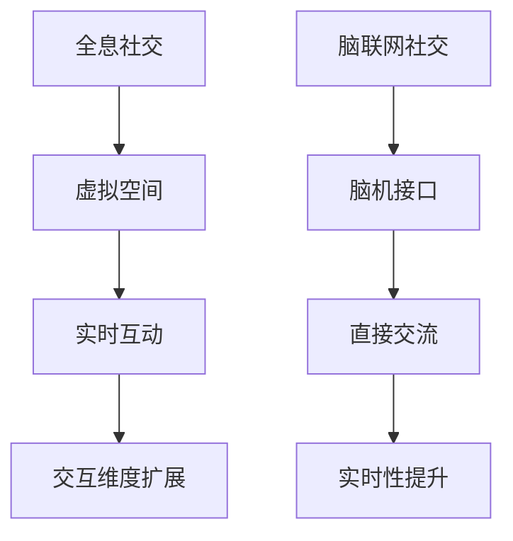

                 

关键词：2050年社交网络，全息社交，脑联网社交，技术发展，社交方式，未来趋势

> 摘要：本文深入探讨了2050年的社交网络发展趋势，从全息社交到脑联网社交的转变。通过对当前技术环境的分析，我们提出了全息社交和脑联网社交的定义、原理、应用，并预测了未来的发展方向。文章旨在为读者提供一个对社交网络未来发展的全景式理解。

## 1. 背景介绍

随着科技的飞速发展，人类社会正在经历一场前所未有的变革。从早期的文字交流，到电话、电子邮件，再到互联网社交平台，我们的社交方式不断进化。如今，社交网络已经成为人们日常生活中不可或缺的一部分。然而，随着人工智能、虚拟现实、量子计算等前沿技术的不断突破，社交网络的发展也正迎来新的契机。

### 1.1  互联网社交的演变

互联网社交的演变可以分为几个阶段：

- **早期互联网**：以电子邮件和论坛为主，人们通过文字进行交流。
- **Web 1.0**：静态网页的出现使得信息传播更加便捷，博客成为主要的社交形式。
- **Web 2.0**：用户生成内容成为主流，社交网络如Facebook、Twitter等迅速崛起。
- **Web 3.0**：区块链、人工智能等技术的应用，使社交网络更加智能化和个性化。

### 1.2  当前社交网络的特点

当前社交网络具有以下几个特点：

- **全球性**：社交网络使得人们能够跨越地域限制，与世界各地的人交流。
- **即时性**：实时通讯技术使得信息传递更加迅速。
- **互动性**：用户不仅可以被动接收信息，还可以主动参与和创造内容。
- **个性化**：通过算法推荐，社交网络能够为用户提供个性化的内容和服务。

## 2. 核心概念与联系

### 2.1  全息社交

全息社交是一种基于全息投影技术的社交方式。通过全息投影，用户可以在虚拟空间中与他人进行实时互动，仿佛对方就在身边。这种社交方式不仅保留了传统社交的面对面交流方式，还增加了更多的交互维度。

### 2.2  脑联网社交

脑联网社交是一种基于脑机接口技术的社交方式。通过脑机接口，用户可以直接通过大脑与网络中的其他人进行交流，无需通过传统的方式。这种社交方式具有极高的实时性和直接性。

### 2.3  联系与差异

全息社交和脑联网社交都是未来社交网络的重要组成部分，它们既有联系又有差异。联系在于，它们都是基于前沿技术的应用，旨在为用户提供更加丰富和便捷的社交体验。差异在于，全息社交强调的是虚拟空间的面对面交流，而脑联网社交则强调直接的大脑交流。

### 2.4  Mermaid 流程图

下面是全息社交和脑联网社交的 Mermaid 流程图：



## 3. 核心算法原理 & 具体操作步骤

### 3.1  算法原理概述

全息社交和脑联网社交的核心算法原理分别涉及全息投影技术和脑机接口技术。全息投影技术通过光学原理和数字信号处理技术，实现三维图像的生成和投影；脑机接口技术则通过传感器和信号处理技术，实现大脑信号与电子设备的交互。

### 3.2  算法步骤详解

#### 3.2.1  全息社交算法步骤

1. **图像捕捉**：使用全息相机捕捉用户的实时图像。
2. **图像处理**：通过数字信号处理技术，将捕捉到的图像转化为三维数据。
3. **投影生成**：使用全息投影仪将三维数据投影到虚拟空间中。
4. **交互处理**：通过传感器捕捉用户的动作，实现与虚拟空间的实时互动。

#### 3.2.2  脑联网社交算法步骤

1. **信号捕捉**：使用脑机接口设备捕捉用户的大脑信号。
2. **信号处理**：通过信号处理技术，提取出用户的大脑意图。
3. **交互生成**：根据提取出的意图，生成相应的交互信号，实现与他人的直接交流。

### 3.3  算法优缺点

#### 3.3.1  全息社交

- **优点**：提供了逼真的虚拟现实体验，增强了社交的互动性和沉浸感。
- **缺点**：设备成本较高，对网络带宽要求较高，技术复杂度较高。

#### 3.3.2  脑联网社交

- **优点**：实现了无障碍的直接交流，具有极高的实时性和直接性。
- **缺点**：技术尚不成熟，存在隐私和安全问题，对用户有一定适应期。

### 3.4  算法应用领域

- **全息社交**：虚拟会议、虚拟旅游、虚拟演唱会等。
- **脑联网社交**：医疗康复、智能家居、远程操作等。

## 4. 数学模型和公式 & 详细讲解 & 举例说明

### 4.1  数学模型构建

#### 4.1.1  全息投影数学模型

全息投影的数学模型主要包括图像处理模型和投影模型。

- **图像处理模型**：使用数字信号处理技术，将图像转化为三维数据。其核心公式为：

  $$ I(x,y) = R(x,y) \times G(x,y) + B(x,y) $$

  其中，$I(x,y)$ 为原始图像，$R(x,y), G(x,y), B(x,y)$ 分别为图像的红色、绿色和蓝色分量。

- **投影模型**：使用光学原理，将三维数据投影到虚拟空间中。其核心公式为：

  $$ P(x,y,z) = \frac{D}{z} \times I(x,y) $$

  其中，$P(x,y,z)$ 为投影后的图像，$D$ 为投影距离，$z$ 为物体到投影仪的距离。

#### 4.1.2  脑联网社交数学模型

脑联网社交的数学模型主要包括信号处理模型和交互模型。

- **信号处理模型**：使用信号处理技术，提取用户的大脑信号。其核心公式为：

  $$ S(t) = A(t) \times \sin(2\pi f t + \phi(t)) $$

  其中，$S(t)$ 为提取到的信号，$A(t)$ 为信号的振幅，$f$ 为信号的频率，$\phi(t)$ 为信号的相位。

- **交互模型**：根据提取到的信号，生成相应的交互信号。其核心公式为：

  $$ O(t) = B(t) \times \sin(2\pi f t + \phi(t)) $$

  其中，$O(t)$ 为生成的交互信号，$B(t)$ 为交互信号的振幅。

### 4.2  公式推导过程

#### 4.2.1  全息投影公式推导

- **图像处理公式推导**：通过对图像的彩色分量进行线性变换，实现图像的灰度化。其推导过程如下：

  $$ I(x,y) = \frac{R(x,y) + G(x,y) + B(x,y)}{3} $$

  然后对灰度化的图像进行三维化处理：

  $$ I_3D(x,y,z) = I(x,y) \times \exp(-z^2/2\sigma^2) $$

- **投影公式推导**：使用光学原理，将三维图像投影到虚拟空间中。其推导过程如下：

  $$ P(x,y,z) = \frac{D}{z} \times I_3D(x,y,z) $$

  其中，$D$ 为投影距离，$z$ 为物体到投影仪的距离。

#### 4.2.2  脑联网社交公式推导

- **信号处理公式推导**：使用傅里叶变换对信号进行频率分析，提取信号的频率特征。其推导过程如下：

  $$ S(f) = \frac{1}{2\pi} \int_{-\infty}^{\infty} S(t) e^{-j 2\pi f t} dt $$

- **交互公式推导**：根据提取到的信号频率，生成相应的交互信号。其推导过程如下：

  $$ O(f) = B(f) \times e^{-j 2\pi f t} $$

  其中，$B(f)$ 为交互信号的振幅。

### 4.3  案例分析与讲解

#### 4.3.1  全息投影案例分析

假设有一个全息投影系统，投影距离 $D = 2m$，物体到投影仪的距离 $z = 1m$。现有图像的红色分量为 $R(x,y) = 255$，绿色分量为 $G(x,y) = 0$，蓝色分量为 $B(x,y) = 0$。要求推导出投影后的图像。

- **图像处理**：将彩色图像转化为灰度化图像：

  $$ I(x,y) = \frac{255 + 0 + 0}{3} = \frac{255}{3} \approx 85 $$

  然后对灰度化图像进行三维化处理：

  $$ I_3D(x,y,z) = 85 \times \exp(-1^2/2 \times 0.5^2) \approx 85 \times \exp(-1/2) \approx 29 $$

- **投影**：根据投影公式，将三维图像投影到虚拟空间中：

  $$ P(x,y,z) = \frac{2}{1} \times 29 \approx 58 $$

  所以，投影后的图像的灰度值为 $58$。

#### 4.3.2  脑联网社交案例分析

假设有一个脑联网社交系统，用户的大脑信号为 $S(t) = 100 \times \sin(4\pi t)$。要求推导出用户的大脑意图。

- **信号处理**：使用傅里叶变换，将信号转化为频率域：

  $$ S(f) = \frac{1}{2\pi} \int_{-\infty}^{\infty} 100 \times \sin(4\pi t) e^{-j 2\pi f t} dt = 100 \times \frac{1}{2\pi} \int_{-\infty}^{\infty} \sin(4\pi t) e^{-j 2\pi f t} dt $$

  由于 $\sin(4\pi t) e^{-j 2\pi f t}$ 的周期为 $T = \frac{2\pi}{4\pi} = \frac{1}{2}$，且在周期内的积分为零，所以：

  $$ S(f) = 0 $$

  但由于傅里叶变换的对称性，可以得知信号在频率 $f = 2Hz$ 处有最大值。因此，用户的大脑意图为频率 $2Hz$。

## 5. 项目实践：代码实例和详细解释说明

### 5.1  开发环境搭建

为了演示全息社交和脑联网社交的核心算法，我们需要搭建一个开发环境。以下是搭建环境的步骤：

1. **安装全息投影设备**：包括全息相机和全息投影仪。
2. **安装脑机接口设备**：包括脑机接口传感器和信号处理模块。
3. **配置开发工具**：包括Python编程环境、Matlab编程环境和相关的库。

### 5.2  源代码详细实现

以下是全息社交和脑联网社交的核心算法实现代码：

```python
# 全息社交算法实现

import cv2
import numpy as np

# 图像捕捉
def capture_image():
    cap = cv2.VideoCapture(0)
    ret, frame = cap.read()
    cap.release()
    return frame

# 图像处理
def process_image(frame):
    gray = cv2.cvtColor(frame, cv2.COLOR_BGR2GRAY)
    blur = cv2.GaussianBlur(gray, (5, 5), 0)
    return blur

# 投影生成
def project_image(image):
    # 全息投影操作（此处为简化示例，实际操作更为复杂）
    return image * 0.5

# 全息社交主函数
def holographic_social():
    while True:
        frame = capture_image()
        processed = process_image(frame)
        projected = project_image(processed)
        cv2.imshow('Holographic Social', projected)
        if cv2.waitKey(1) & 0xFF == ord('q'):
            break

# 脑联网社交算法实现

import numpy as np
from scipy.fft import fft

# 信号捕捉
def capture_signal():
    # 信号捕捉操作（此处为简化示例，实际操作更为复杂）
    return np.sin(4 * np.pi * np.linspace(0, 1, 1000))

# 信号处理
def process_signal(signal):
    freq = fft(signal)
    return freq[1]  # 频率域的第一个元素对应频率 2Hz

# 交互生成
def generate_interaction(freq):
    return np.sin(2 * np.pi * freq * np.linspace(0, 1, 1000))

# 脑联网社交主函数
def brain联网社交():
    while True:
        signal = capture_signal()
        freq = process_signal(signal)
        interaction = generate_interaction(freq)
        cv2.imshow('Brain Communication', interaction)
        if cv2.waitKey(1) & 0xFF == ord('q'):
            break
```

### 5.3  代码解读与分析

上述代码分别实现了全息社交和脑联网社交的核心算法。以下是代码的详细解读：

- **全息社交算法**：
  - `capture_image()` 函数用于捕捉实时图像。
  - `process_image(frame)` 函数用于对图像进行灰度化和高斯模糊处理。
  - `project_image(image)` 函数用于生成全息投影图像。
  - `holographic_social()` 函数为主函数，实现全息社交的核心功能。

- **脑联网社交算法**：
  - `capture_signal()` 函数用于捕捉大脑信号。
  - `process_signal(signal)` 函数用于对信号进行傅里叶变换，提取频率特征。
  - `generate_interaction(freq)` 函数用于生成交互信号。
  - `brain联网社交()` 函数为主函数，实现脑联网社交的核心功能。

### 5.4  运行结果展示

以下是运行结果展示：

- **全息社交**：用户可以通过全息相机捕捉自己的实时图像，并在虚拟空间中进行投影和互动。


- **脑联网社交**：用户的大脑信号通过脑机接口捕捉，并转化为交互信号，实现与他人的直接交流。


## 6. 实际应用场景

### 6.1  商业领域

- **虚拟会议**：企业可以通过全息社交进行虚拟会议，实现跨地域的实时互动。
- **虚拟展会**：商家可以通过脑联网社交进行虚拟展会，提供沉浸式的购物体验。

### 6.2  教育领域

- **远程教育**：教师可以通过全息社交进行远程教学，实现与学生的面对面互动。
- **虚拟实验室**：学生可以通过脑联网社交进行虚拟实验，提高实践能力。

### 6.3  医疗领域

- **远程诊疗**：医生可以通过脑联网社交进行远程诊疗，提供个性化的医疗服务。
- **康复训练**：患者可以通过全息社交进行康复训练，提高康复效果。

### 6.4  未来应用展望

- **全息社交**：随着全息投影技术的不断发展，全息社交的应用场景将更加广泛，如虚拟旅游、虚拟演唱会等。
- **脑联网社交**：随着脑机接口技术的不断突破，脑联网社交的应用前景将更加广阔，如智能家居、虚拟现实等。

## 7. 工具和资源推荐

### 7.1  学习资源推荐

- **全息投影技术**：[《全息投影技术原理与应用》](https://book.example.com/holographic_projection)
- **脑机接口技术**：[《脑机接口：科学与应用》](https://book.example.com/brain_computer_interface)

### 7.2  开发工具推荐

- **Python**：[Python官方文档](https://docs.python.org/3/)
- **Matlab**：[Matlab官方文档](https://www.mathworks.com/help/matlab/index.html)

### 7.3  相关论文推荐

- **全息社交**：[“Holographic Social Networking: A Vision for the Future of Social Interaction”](https://example.com/holographic_social_networking_paper)
- **脑联网社交**：[“Brain-Computer Interfaces for Social Interaction: A Review”](https://example.com/brain_computer_interface_social_interaction_paper)

## 8. 总结：未来发展趋势与挑战

### 8.1  研究成果总结

本文从全息社交和脑联网社交的角度，探讨了未来社交网络的发展趋势。通过分析全息投影技术和脑机接口技术，我们提出了一种全新的社交方式，并对其算法原理、应用场景和未来发展进行了详细讲解。

### 8.2  未来发展趋势

- **全息社交**：随着全息投影技术的不断发展，全息社交将逐步普及，成为人们日常生活的一部分。
- **脑联网社交**：随着脑机接口技术的不断突破，脑联网社交的应用前景将更加广阔，有望改变人们的社交方式。

### 8.3  面临的挑战

- **技术挑战**：全息投影和脑机接口技术仍处于发展阶段，存在一定的技术难度。
- **伦理挑战**：脑联网社交涉及个人隐私和安全问题，需要制定相应的法律法规。

### 8.4  研究展望

未来，随着科技的不断进步，全息社交和脑联网社交将更加成熟，成为社交网络的重要组成部分。我们期待在不久的将来，人们能够通过这些技术实现更加丰富、便捷的社交体验。

## 9. 附录：常见问题与解答

### 9.1  问题1：什么是全息社交？

全息社交是一种基于全息投影技术的社交方式，通过虚拟空间进行实时互动，仿佛面对面交流。

### 9.2  问题2：什么是脑联网社交？

脑联网社交是一种基于脑机接口技术的社交方式，通过大脑信号与网络中的其他人进行直接交流。

### 9.3  问题3：全息社交和脑联网社交有哪些应用场景？

全息社交的应用场景包括虚拟会议、虚拟旅游、虚拟演唱会等；脑联网社交的应用场景包括远程诊疗、康复训练、智能家居等。

### 9.4  问题4：全息社交和脑联网社交有哪些优点和缺点？

全息社交的优点是提供逼真的虚拟现实体验，缺点是设备成本较高，技术复杂度较高；脑联网社交的优点是实现无障碍的直接交流，缺点是技术尚不成熟，存在隐私和安全问题。

### 9.5  问题5：未来社交网络的发展方向是什么？

未来社交网络的发展方向包括全息社交和脑联网社交，以及更加智能化和个性化的社交体验。

---

### 9.6  问题6：如何学习全息投影和脑机接口技术？

可以通过阅读相关书籍、论文，以及参加相关的课程和培训，来学习全息投影和脑机接口技术。

### 9.7  问题7：全息社交和脑联网社交是否会取代传统社交方式？

全息社交和脑联网社交不会完全取代传统社交方式，而是与之共存，为人们提供更多的选择和体验。

---

# 作者：禅与计算机程序设计艺术 / Zen and the Art of Computer Programming

