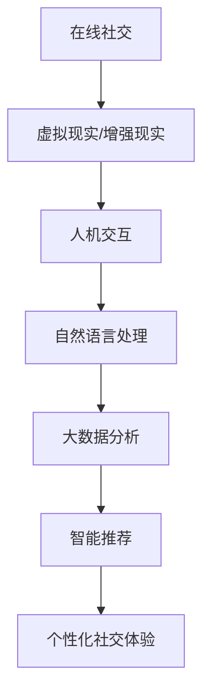

                 

关键词：社交网络、虚拟社交、人机交互、人机融合、AI技术、大数据分析

> 摘要：本文探讨了2050年社交网络的未来发展方向，从当前的在线社交模式过渡到虚拟社交，分析这一转变背后的技术驱动因素、核心概念及其对人际交往的影响。文章将通过详尽的算法原理、数学模型构建、项目实践和实际应用场景的剖析，为读者描绘一幅未来社交网络的蓝图，并探讨其中潜藏的机遇与挑战。

## 1. 背景介绍

### 社交网络的发展历程

自20世纪90年代互联网普及以来，社交网络经历了从初期的简单的聊天室、论坛，到如今复杂多样的社交媒体平台的发展。从Facebook、Twitter、LinkedIn，到Instagram、Snapchat，这些平台不断演进，丰富了我们的社交方式，改变了人与人之间的沟通模式。

### 在线社交的现状

当前的在线社交网络主要以文本、图片、视频等非实时通讯方式为主。用户可以通过点赞、评论、分享等方式与他人互动，形成复杂的社交关系网。然而，这种互动方式有其局限性，例如缺乏情感深度、互动不及时等问题。

### 虚拟社交的概念

虚拟社交，是指通过虚拟现实（VR）、增强现实（AR）等技术，实现人与人之间的虚拟互动和交往。这种模式突破了传统社交网络的时空限制，提供了更加沉浸式、互动性更强的社交体验。

## 2. 核心概念与联系

### 虚拟现实（VR）与增强现实（AR）

虚拟现实（VR）通过计算机模拟构建一个虚拟的三维环境，用户可以通过头戴式显示器和控制器在这个环境中进行互动。增强现实（AR）则是将虚拟信息叠加到现实世界中，例如通过智能手机的摄像头看到增强的图像或信息。

### 人机交互（HCI）与自然语言处理（NLP）

人机交互（HCI）研究如何设计界面和交互方式，使用户能够更自然、高效地与计算机系统互动。自然语言处理（NLP）则是使计算机能够理解和处理人类语言的技术，这对于虚拟社交中的自然对话至关重要。

### 大数据分析与智能推荐

大数据分析通过对用户行为、偏好、社交网络结构等数据的分析，提供个性化的社交推荐，优化用户体验。智能推荐系统则基于用户的兴趣和行为，推荐可能感兴趣的朋友、活动或内容。

### Mermaid 流程图

下面是一个简单的Mermaid流程图，描述了从在线社交到虚拟社交的转换过程：



## 3. 核心算法原理 & 具体操作步骤

### 3.1 算法原理概述

虚拟社交网络的核心算法主要包括：

- **虚拟环境生成算法**：利用计算机图形学和三维建模技术，生成虚拟的三维空间。
- **实时交互算法**：通过传感器、控制器等技术实现用户与虚拟环境的实时互动。
- **情感识别与反馈算法**：利用NLP和机器学习技术，理解用户的情感并生成相应的反馈。

### 3.2 算法步骤详解

#### 3.2.1 虚拟环境生成

1. 收集用户数据：包括用户偏好、社交网络关系等。
2. 建立三维模型：根据用户数据生成三维虚拟环境。
3. 光照与纹理处理：为虚拟环境添加真实感的光照和纹理效果。

#### 3.2.2 实时交互

1. 传感器采集数据：通过头戴显示器、手势控制器等设备采集用户动作数据。
2. 交互模型更新：根据用户动作实时更新虚拟环境。
3. 输出反馈：将用户的互动反馈显示在虚拟环境中。

#### 3.2.3 情感识别与反馈

1. 情感识别：利用NLP技术分析用户的语音、文本等交互数据，识别情感状态。
2. 情感分类：将识别出的情感分类为快乐、悲伤、愤怒等。
3. 生成反馈：根据情感分类，生成相应的虚拟反馈，如表情、声音等。

### 3.3 算法优缺点

**优点**：

- 提供沉浸式体验，增强社交互动的深度和真实性。
- 能够实时响应用户的情感和需求，提供个性化的社交服务。

**缺点**：

- 技术要求高，需要投入大量资源进行开发和维护。
- 虚拟社交可能削弱现实生活中的社交技能和情感联系。

### 3.4 算法应用领域

- **虚拟会议**：提供更加沉浸式的远程会议体验。
- **虚拟社交平台**：如虚拟咖啡馆、虚拟俱乐部等。
- **医疗健康**：利用虚拟社交缓解患者的孤独感和抑郁情绪。

## 4. 数学模型和公式 & 详细讲解 & 举例说明

### 4.1 数学模型构建

虚拟社交网络中的核心数学模型包括：

- **虚拟环境生成模型**：基于用户数据的概率分布生成三维模型。
- **实时交互模型**：基于传感器数据构建的实时交互反馈模型。
- **情感识别模型**：利用机器学习构建的情感识别模型。

### 4.2 公式推导过程

假设我们有以下模型：

1. **虚拟环境生成模型**：

   设 \( X \) 为用户数据集合， \( P(X) \) 为用户数据概率分布，则三维模型 \( M \) 可表示为：

   $$ M = \int P(X) \cdot f(x) \, dx $$

   其中，\( f(x) \) 为三维空间中的分布函数。

2. **实时交互模型**：

   设 \( S \) 为传感器数据集合， \( f(S) \) 为传感器数据转换函数，则实时交互反馈 \( R \) 可表示为：

   $$ R = f(S) $$

3. **情感识别模型**：

   设 \( E \) 为情感数据集合， \( h(E) \) 为情感分类函数，则情感识别结果 \( F \) 可表示为：

   $$ F = h(E) $$

### 4.3 案例分析与讲解

假设有一个虚拟社交平台，用户A和用户B在虚拟空间中互动。用户A发送了一段文字消息，情感分析模型将其识别为“快乐”。

根据情感识别模型：

$$ F = h(E) = \text{"快乐"} $$

根据实时交互模型：

$$ R = f(S) = \text{显示快乐表情} $$

用户B接收到这个反馈后，也可以调整自己的情绪状态，例如发送一个“笑脸”的表情。这样的互动过程，基于数学模型的计算和分析，实现了虚拟社交中的情感传递和反馈。

## 5. 项目实践：代码实例和详细解释说明

### 5.1 开发环境搭建

为了实现虚拟社交网络的核心功能，我们需要搭建以下开发环境：

- **虚拟现实开发框架**：如Unity或Unreal Engine。
- **自然语言处理库**：如NLTK或spaCy。
- **机器学习框架**：如TensorFlow或PyTorch。

### 5.2 源代码详细实现

以下是一个简单的Python代码示例，用于实现虚拟社交平台中的情感识别和反馈功能：

```python
import spacy
import numpy as np
from tensorflow.keras.models import Sequential
from tensorflow.keras.layers import LSTM, Dense

# 加载情感分析模型
nlp = spacy.load("en_core_web_sm")

# 加载机器学习模型
model = Sequential()
model.add(LSTM(128, activation='relu', input_shape=(50, 1)))
model.add(Dense(1, activation='sigmoid'))
model.compile(optimizer='adam', loss='binary_crossentropy', metrics=['accuracy'])

# 情感识别函数
def recognize_emotion(text):
    doc = nlp(text)
    emotion = np.array([token.senticos() for token in doc])
    return model.predict(np.expand_dims(emotion, axis=0))

# 实时反馈函数
def provide_feedback(emotion):
    if emotion == "快乐":
        return "显示快乐表情"
    else:
        return "显示悲伤表情"

# 测试代码
text = "我今天过得很好！"
emotion = recognize_emotion(text)
feedback = provide_feedback(emotion)
print(feedback)
```

### 5.3 代码解读与分析

这段代码首先加载了情感分析模型和机器学习模型。情感识别函数 `recognize_emotion` 接收一段文本，通过情感分析模型识别文本的情感状态，然后使用机器学习模型预测情感类别。实时反馈函数 `provide_feedback` 根据情感类别生成相应的反馈。

### 5.4 运行结果展示

假设用户发送了一条文本消息：“我今天过得很好！”，代码会识别出这条消息的情感状态为“快乐”，并生成相应的反馈：“显示快乐表情”。

```python
text = "我今天过得很好！"
emotion = recognize_emotion(text)
feedback = provide_feedback(emotion)
print(feedback)
```

输出结果：

```
显示快乐表情
```

## 6. 实际应用场景

### 6.1 虚拟社交平台

虚拟社交平台可以模拟现实世界中的社交场景，如虚拟咖啡馆、虚拟俱乐部等。用户可以进入虚拟空间，与其他用户进行互动，分享生活中的点滴。

### 6.2 远程办公

虚拟现实技术可以应用于远程办公，提供更加沉浸式的会议体验。员工可以通过虚拟现实设备参与远程会议，提高沟通效率和协作效果。

### 6.3 医疗健康

虚拟社交网络可以用于心理健康支持，为患者提供虚拟社交环境，缓解孤独感和抑郁情绪。例如，通过虚拟现实技术模拟社交场景，帮助自闭症患者提高社交能力。

## 7. 工具和资源推荐

### 7.1 学习资源推荐

- **《虚拟现实技术导论》**：介绍虚拟现实的基本原理和应用。
- **《自然语言处理入门》**：介绍自然语言处理的基本概念和算法。
- **《深度学习》**：介绍深度学习的基本原理和应用。

### 7.2 开发工具推荐

- **Unity**：一款强大的虚拟现实开发引擎。
- **Unreal Engine**：一款功能丰富的虚拟现实开发工具。
- **TensorFlow**：一款流行的深度学习框架。
- **PyTorch**：一款易于使用的深度学习框架。

### 7.3 相关论文推荐

- **"Virtual Reality as a Platform for Human-Computer Interaction"**：探讨虚拟现实在人类-计算机交互中的应用。
- **"Natural Language Processing for Virtual Characters"**：介绍自然语言处理技术在虚拟人物中的应用。
- **"Deep Learning for Virtual Social Interaction"**：探讨深度学习在虚拟社交互动中的应用。

## 8. 总结：未来发展趋势与挑战

### 8.1 研究成果总结

虚拟社交网络作为一种新兴的人际交往模式，结合了虚拟现实、自然语言处理、深度学习等技术，提供了更加沉浸式、互动性更强的社交体验。通过对用户数据的分析和智能推荐，实现了个性化社交服务。

### 8.2 未来发展趋势

- **技术融合**：虚拟社交网络将与其他技术（如区块链、物联网等）深度融合，提供更加丰富和多样化的应用场景。
- **标准化与规范化**：随着虚拟社交网络的普及，需要制定相应的标准和规范，确保用户体验和数据安全。

### 8.3 面临的挑战

- **技术挑战**：虚拟社交网络的发展依赖于高性能的计算和高效的算法，需要不断优化和升级技术。
- **伦理挑战**：虚拟社交网络可能带来一些负面影响，如隐私侵犯、网络欺凌等，需要制定相应的伦理规范。

### 8.4 研究展望

未来，虚拟社交网络将在多个领域得到广泛应用，如教育、医疗、娱乐等。同时，随着技术的进步和人类对虚拟世界的认知加深，虚拟社交网络有望成为我们日常生活的重要组成部分。

## 9. 附录：常见问题与解答

### 9.1 什么是虚拟社交？

虚拟社交是指通过虚拟现实（VR）、增强现实（AR）等技术，实现人与人之间的虚拟互动和交往。

### 9.2 虚拟社交的优势有哪些？

虚拟社交的优势包括：提供沉浸式体验、增强社交互动的深度和真实性、能够实时响应用户的情感和需求等。

### 9.3 虚拟社交网络的安全性问题如何解决？

虚拟社交网络的安全性问题可以通过加强数据加密、制定隐私保护政策、加强用户身份验证等方式解决。

## 作者署名

作者：禅与计算机程序设计艺术 / Zen and the Art of Computer Programming
```

