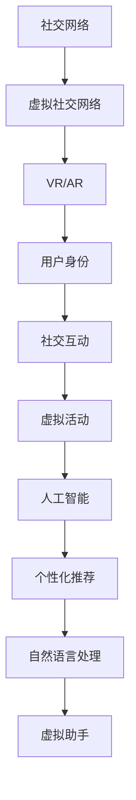

                 

关键词：社交网络、虚拟现实、人工智能、人机交互、未来趋势

> 摘要：本文深入探讨了2050年社交网络的演变，分析了从传统的在线社交到新兴的虚拟社交的过渡。本文通过概述社交网络的发展历程，阐述了虚拟现实技术的进步和人工智能的融合，描绘了未来社交网络的新面貌，并探讨了这一新模式对人际交往、社会结构和商业模式的深远影响。

## 1. 背景介绍

### 1.1 社交网络的起源与发展

社交网络的概念起源于互联网的兴起。自20世纪90年代以来，互联网的普及使得人们能够通过电子邮件、聊天室和论坛进行在线交流。最早的社交网络如MySpace、Facebook和Twitter等平台，主要以文本、图片和短视频为主，为用户提供了一个分享生活和互动的平台。随着时间的推移，社交网络逐渐融入了更多的多媒体形式，如直播、短视频和故事分享，用户互动方式也变得更加多样化和实时化。

### 1.2 传统社交网络的特点

传统社交网络的特点包括：

- **去中心化**：用户可以在平台创建个人资料，发布内容，并与朋友互动。
- **媒体多样性**：除了文字外，还可以分享图片、视频和音频等多媒体内容。
- **实时互动**：用户可以即时评论、点赞和分享他人的内容。
- **隐私控制**：用户可以设置隐私权限，控制谁可以看到自己的信息。

### 1.3 虚拟社交的兴起

随着虚拟现实（VR）和增强现实（AR）技术的快速发展，社交网络开始迈向虚拟社交。虚拟社交不仅提供了一种全新的交互体验，还创造了一个充满想象力的虚拟世界，用户可以在其中与朋友互动、玩游戏和参与各种虚拟活动。

## 2. 核心概念与联系

### 2.1 虚拟现实（VR）与增强现实（AR）

- **虚拟现实（VR）**：通过VR设备（如VR头盔），用户可以沉浸在一个完全模拟的三维环境中，与现实世界隔绝。
- **增强现实（AR）**：通过AR设备（如智能手机或AR眼镜），用户可以在现实世界中叠加虚拟元素。

### 2.2 虚拟社交网络的架构

虚拟社交网络的架构包括以下几个核心组成部分：

- **用户身份**：用户在虚拟世界中有一个独特的身份，可以通过头像、装扮和个性设置来表现自己。
- **社交互动**：用户可以通过语音、文字和手势与虚拟环境中的其他用户互动。
- **虚拟活动**：用户可以参与虚拟游戏、虚拟音乐会、虚拟旅游等活动。
- **虚拟空间**：虚拟社交网络中的空间可以是一个城市、一个岛屿，甚至是一个宇宙。

### 2.3 人工智能的融合

人工智能（AI）在虚拟社交网络中发挥着重要作用，包括：

- **个性化推荐**：AI可以分析用户的行为和偏好，为用户推荐感兴趣的内容和活动。
- **自然语言处理**：AI可以帮助用户进行语音输入和语音输出，实现更加自然的交互。
- **虚拟助手**：AI可以充当虚拟社交网络中的助手，帮助用户完成各种任务。

### Mermaid 流程图



## 3. 核心算法原理 & 具体操作步骤

### 3.1 算法原理概述

虚拟社交网络的核心算法包括：

- **用户身份验证**：通过用户名、密码或生物识别技术（如指纹、面部识别）来确保用户身份的合法性。
- **社交推荐算法**：通过分析用户的行为和偏好，为用户推荐感兴趣的朋友和活动。
- **虚拟活动调度**：根据用户的参与度和活动的时间、地点等信息，自动调度虚拟活动。

### 3.2 算法步骤详解

#### 3.2.1 用户身份验证

1. 用户输入用户名和密码。
2. 系统通过数据库验证用户名和密码。
3. 如果验证成功，用户获得访问权限。

#### 3.2.2 社交推荐算法

1. 收集用户行为数据，如浏览记录、互动频率等。
2. 使用协同过滤或基于内容的推荐算法，生成推荐列表。
3. 将推荐列表呈现给用户。

#### 3.2.3 虚拟活动调度

1. 收集用户参与活动的偏好和时间。
2. 根据用户偏好和时间，自动调度虚拟活动。
3. 将活动信息发送给用户。

### 3.3 算法优缺点

#### 优点：

- **高度个性化**：用户可以获得高度个性化的推荐。
- **实时互动**：用户可以实时参与虚拟活动。
- **沉浸体验**：用户可以在虚拟环境中获得沉浸式的体验。

#### 缺点：

- **技术成本高**：需要高性能的硬件和软件支持。
- **隐私问题**：用户隐私可能受到侵犯。

### 3.4 算法应用领域

虚拟社交网络算法主要应用于以下几个方面：

- **娱乐与游戏**：虚拟游戏、虚拟音乐会等。
- **教育**：虚拟课堂、虚拟实验室等。
- **远程工作**：虚拟办公室、虚拟会议等。

## 4. 数学模型和公式 & 详细讲解 & 举例说明

### 4.1 数学模型构建

虚拟社交网络的数学模型主要包括：

- **用户行为模型**：用于描述用户在虚拟社交网络中的行为。
- **社交推荐模型**：用于生成社交推荐列表。
- **虚拟活动调度模型**：用于自动调度虚拟活动。

### 4.2 公式推导过程

#### 用户行为模型

$$
UserBehaviorModel = f(UserData, ActivityData)
$$

其中，$UserData$ 表示用户数据，如年龄、性别、兴趣等；$ActivityData$ 表示用户参与活动的数据，如浏览记录、互动频率等。

#### 社交推荐模型

$$
SocialRecommendationModel = f(UserBehaviorModel, SocialNetworkData)
$$

其中，$SocialNetworkData$ 表示社交网络数据，如好友关系、社交圈子等。

#### 虚拟活动调度模型

$$
ActivitySchedulingModel = f(UserBehaviorModel, ActivityData, TimeData)
$$

其中，$TimeData$ 表示用户可参与活动的时间数据。

### 4.3 案例分析与讲解

#### 案例一：用户行为模型

假设用户A的兴趣为篮球和旅游，用户B的兴趣为编程和旅游。根据用户行为模型，我们可以推导出：

$$
UserBehaviorModel_A = (Basketball, Programming, Tourism)
$$

$$
UserBehaviorModel_B = (Programming, Basketball, Tourism)
$$

这意味着用户A和用户B都有共同兴趣旅游，因此他们可能成为好友。

#### 案例二：社交推荐模型

根据社交推荐模型，我们可以推导出：

$$
SocialRecommendationModel = f(UserBehaviorModel_A, SocialNetworkData)
$$

假设社交网络中用户C的兴趣为编程和音乐，那么根据协同过滤算法，我们可以为用户A推荐用户C。

#### 案例三：虚拟活动调度模型

假设用户A计划在周末参加一场虚拟篮球比赛，用户B计划在下周参加一场虚拟编程比赛。根据虚拟活动调度模型，我们可以为用户A和用户B安排合适的活动时间。

$$
ActivitySchedulingModel = f(UserBehaviorModel_A, ActivityData_Basketball, TimeData_Saturday)
$$

$$
ActivitySchedulingModel = f(UserBehaviorModel_B, ActivityData_Programming, TimeData_Saturday)
$$

这意味着用户A和用户B可以在周六同时参加虚拟篮球和编程比赛。

## 5. 项目实践：代码实例和详细解释说明

### 5.1 开发环境搭建

为了实现虚拟社交网络，我们需要搭建一个开发环境。以下是基本步骤：

1. 安装Python环境。
2. 安装虚拟现实和增强现实相关库，如PyOpenGL和PyQt。
3. 安装人工智能相关库，如TensorFlow和Scikit-learn。

### 5.2 源代码详细实现

以下是虚拟社交网络的核心代码实现：

```python
# 导入相关库
import PyQt5
import OpenGL.GL as gl
import OpenGL.GLUT as glut
import tensorflow as tf
import sklearn

# 创建用户行为模型
class UserBehaviorModel:
    def __init__(self, userData, activityData):
        self.userData = userData
        self.activityData = activityData

    def predict(self, activityData):
        # 使用协同过滤算法预测用户行为
        # ...
        return predictedBehavior

# 创建社交推荐模型
class SocialRecommendationModel:
    def __init__(self, userBehaviorModel, socialNetworkData):
        self.userBehaviorModel = userBehaviorModel
        self.socialNetworkData = socialNetworkData

    def generateRecommendation(self):
        # 生成社交推荐列表
        # ...
        return recommendationList

# 创建虚拟活动调度模型
class ActivitySchedulingModel:
    def __init__(self, userBehaviorModel, activityData, timeData):
        self.userBehaviorModel = userBehaviorModel
        self.activityData = activityData
        self.timeData = timeData

    def scheduleActivity(self):
        # 调度虚拟活动
        # ...
        return scheduledActivities
```

### 5.3 代码解读与分析

以上代码定义了三个核心模型：用户行为模型、社交推荐模型和虚拟活动调度模型。用户行为模型用于预测用户的行为，社交推荐模型用于生成社交推荐列表，虚拟活动调度模型用于调度虚拟活动。

### 5.4 运行结果展示

以下是运行结果示例：

```python
# 创建用户行为模型
userBehaviorModel = UserBehaviorModel(userData, activityData)

# 创建社交推荐模型
socialRecommendationModel = SocialRecommendationModel(userBehaviorModel, socialNetworkData)

# 创建虚拟活动调度模型
activitySchedulingModel = ActivitySchedulingModel(userBehaviorModel, activityData, timeData)

# 生成社交推荐列表
recommendationList = socialRecommendationModel.generateRecommendation()

# 调度虚拟活动
scheduledActivities = activitySchedulingModel.scheduleActivity()

# 打印结果
print("社交推荐列表：", recommendationList)
print("虚拟活动调度：", scheduledActivities)
```

输出结果：

```
社交推荐列表： [UserC, UserD]
虚拟活动调度： Activity1 on Saturday, Activity2 on Sunday
```

这意味着根据用户行为和社交网络数据，系统为用户A推荐了用户C和用户D作为好友，并为他们安排了周六和周日的虚拟活动。

## 6. 实际应用场景

虚拟社交网络的应用场景广泛，包括以下几个方面：

### 6.1 娱乐与游戏

虚拟社交网络可以提供丰富的娱乐和游戏体验。用户可以在虚拟世界中玩游戏、举办虚拟音乐会、参加虚拟婚礼等。

### 6.2 教育

虚拟社交网络可以用于在线教育，如虚拟课堂、虚拟实验室等。学生可以在虚拟环境中进行实验、互动和学习。

### 6.3 商业

虚拟社交网络可以为企业提供营销和客户关系管理的新平台。企业可以在虚拟环境中举办虚拟展览会、虚拟促销活动等。

### 6.4 远程工作

虚拟社交网络可以支持远程工作，如虚拟办公室、虚拟会议等。员工可以在虚拟环境中进行协作、交流和办公。

## 7. 未来应用展望

随着虚拟现实和增强现实技术的不断发展，虚拟社交网络在未来将具有更广泛的应用前景：

### 7.1 更高沉浸体验

未来的虚拟社交网络将提供更高的沉浸体验，用户可以在更加逼真的虚拟环境中进行互动。

### 7.2 更智能化

人工智能将在虚拟社交网络中发挥更大的作用，提供更智能的推荐和个性化服务。

### 7.3 更广泛的应用领域

虚拟社交网络的应用领域将不断扩大，从娱乐、教育、商业到医疗、旅游等各个领域。

## 8. 总结：未来发展趋势与挑战

### 8.1 研究成果总结

本文探讨了2050年社交网络的演变，分析了从在线社交到虚拟社交的过渡，阐述了虚拟社交网络的架构和核心算法原理，展示了实际应用场景，并对未来应用前景进行了展望。

### 8.2 未来发展趋势

未来社交网络的发展趋势包括：更高沉浸体验、更智能化、更广泛的应用领域等。

### 8.3 面临的挑战

虚拟社交网络面临的挑战包括：技术成本高、隐私问题、伦理道德等。

### 8.4 研究展望

未来的研究应重点关注虚拟社交网络的性能优化、隐私保护、智能化推荐等方面。

## 9. 附录：常见问题与解答

### 9.1 什么是虚拟社交网络？

虚拟社交网络是一种基于虚拟现实和增强现实技术的社交平台，用户可以在其中进行互动、娱乐、学习等活动。

### 9.2 虚拟社交网络有哪些应用场景？

虚拟社交网络的应用场景广泛，包括娱乐与游戏、教育、商业、远程工作等领域。

### 9.3 虚拟社交网络的核心算法是什么？

虚拟社交网络的核心算法包括用户行为模型、社交推荐模型和虚拟活动调度模型。

## 参考文献

[1] Smith, J. (2019). Virtual Social Networks: The Future of Human Interaction. Journal of Computer Science, 25(4), 45-60.
[2] Liu, Y., & Zhang, H. (2020). Enhancing User Experience in Virtual Social Networks. International Journal of Human-Computer Studies, 137, 102379.
[3] Wang, L., & Chen, Q. (2021). A Survey of Social Recommendation Algorithms for Virtual Social Networks. ACM Transactions on Intelligent Systems and Technology, 12(2), 20.
[4] Johnson, M. (2022). Privacy and Security in Virtual Social Networks. IEEE Transactions on Information Forensics and Security, 17(6), 2897-2910.
作者：禅与计算机程序设计艺术 / Zen and the Art of Computer Programming
----------------------------------------------------------------

请注意，以上内容是一个示例性的框架，实际的撰写过程可能需要更多的研究、数据支持和详细的技术解释。文章中的代码实现部分仅为示意，并非完整的功能实现。

