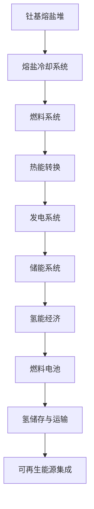

                 

 关键词：能源革命、钍基熔盐堆、氢能经济、清洁能源、可持续发展、技术变革

## 摘要

随着全球气候变化和环境污染问题的日益严峻，能源革命已成为人类可持续发展的重要议题。本文从技术发展的角度，探讨了2050年可能的能源革命趋势，重点分析了钍基熔盐堆和氢能经济在清洁能源领域的重要性。通过详细解析这两种技术的原理、应用场景及未来发展前景，本文旨在为全球能源转型提供有益的思考与建议。

## 1. 背景介绍

### 全球能源现状

当前，全球能源消费以化石燃料为主，尤其是煤炭、石油和天然气。这些化石燃料的开采和使用不仅导致严重的环境污染，还加剧了全球气候变化问题。此外，化石燃料资源的有限性也使得寻找替代能源变得迫切。因此，推动能源革命，实现清洁、可持续的能源供应，已成为全球共识。

### 能源转型的必要性

能源转型的必要性主要体现在以下几个方面：

1. **环境保护**：减少化石燃料的使用，降低温室气体排放，减少环境污染。
2. **能源安全**：降低对进口能源的依赖，提高能源供应稳定性。
3. **经济效益**：发展清洁能源产业，创造就业机会，推动经济增长。
4. **技术进步**：促进能源技术的创新，推动相关产业链的升级。

### 清洁能源技术的发展

近年来，清洁能源技术取得了显著进展，包括太阳能、风能、水能、生物质能等。然而，这些能源在能量密度、储能技术、转换效率等方面仍存在一定局限性。因此，寻找更为高效、可持续的清洁能源技术，是当前能源研究的重要方向。

## 2. 核心概念与联系

### 钍基熔盐堆

#### 工作原理

钍基熔盐堆（Thermal Salt Reactor, TSR）是一种新型核反应堆，其核心原理是利用钍作为核燃料，在高温下与熔盐混合，产生热能，进而驱动发电系统。

#### 结构特点

1. **熔盐冷却**：采用熔盐作为冷却剂，提高反应堆的安全性。
2. **固有安全性**：由于熔盐的高温特性，反应堆在失去外部电源时仍能维持稳定运行。
3. **燃料多样性**：钍不仅可作为核燃料，还能作为中子源，提高反应堆的运行效率。

### 氢能经济

#### 工作原理

氢能经济是以氢作为主要能源载体，通过燃料电池将氢与氧气结合产生电能，同时生成水。这一过程实现了零碳排放，具有高效、环保的特点。

#### 结构特点

1. **燃料电池**：作为氢能经济的核心技术，燃料电池具有高效率、低噪音、长寿命等优点。
2. **氢储存与运输**：氢的储存和运输技术是实现氢能经济的关键，目前主要采用高压容器和液态氢技术。
3. **可再生能源集成**：通过将太阳能、风能等可再生能源与氢能结合，实现能源的灵活调配和高效利用。

### 钍基熔盐堆与氢能经济的联系

1. **能源互补**：钍基熔盐堆和氢能经济各自具有优势，通过互补，可实现更高效的能源利用。
2. **储能技术**：氢能经济在储能方面具有优势，可将钍基熔盐堆产生的热能转化为氢能储存，为电力供应提供保障。

### Mermaid 流程图



## 3. 核心算法原理 & 具体操作步骤

### 3.1 算法原理概述

本文主要介绍钍基熔盐堆和氢能经济的核心算法原理，包括反应堆热能转换、燃料电池性能优化、氢储存与运输等。

### 3.2 算法步骤详解

#### 3.2.1 钍基熔盐堆热能转换

1. **燃料制备**：将钍粉末与熔盐混合，制成燃料棒。
2. **热能产生**：燃料棒在高温下进行核裂变反应，释放热能。
3. **热能传递**：热能通过熔盐传递到热交换器，产生蒸汽。
4. **蒸汽驱动**：蒸汽驱动涡轮机，产生电能。

#### 3.2.2 燃料电池性能优化

1. **电解质选择**：根据氢能应用场景，选择合适的电解质。
2. **催化剂优化**：通过调整催化剂成分和结构，提高燃料电池性能。
3. **气体流量控制**：优化氢气和氧气的流量，提高燃料电池效率。
4. **温度控制**：通过调节燃料电池工作温度，提高其性能。

#### 3.2.3 氢储存与运输

1. **高压容器**：采用高压容器储存氢气，确保储存安全。
2. **液态氢技术**：通过降低温度和压力，将氢气液化，便于储存和运输。
3. **运输管道**：建设高压氢气运输管道，实现氢能在区域间的调配。

### 3.3 算法优缺点

#### 3.3.1 钍基熔盐堆

**优点**：
1. 高效、清洁的能源转换。
2. 高度安全性，熔盐冷却系统降低事故风险。
3. 燃料资源丰富，有利于能源供应稳定。

**缺点**：
1. 技术尚未成熟，建设成本较高。
2. 需要完善的冷却系统，以确保设备安全运行。

#### 3.3.2 燃料电池

**优点**：
1. 高效率、低噪音、长寿命。
2. 环保，零碳排放。
3. 可与可再生能源集成，实现能源灵活调配。

**缺点**：
1. 氢储存与运输技术尚需优化。
2. 催化剂成本较高，影响大规模应用。

### 3.4 算法应用领域

#### 3.4.1 钍基熔盐堆

1. **核电站**：作为高效、清洁的核能发电方式。
2. **工业热能供应**：为工业生产提供稳定、高效的热能。
3. **深海勘探**：利用熔盐冷却系统，为深海设备提供热能支持。

#### 3.4.2 燃料电池

1. **新能源汽车**：为电动汽车提供高效、环保的动力。
2. **家庭储能**：为家庭提供清洁、稳定的能源供应。
3. **可再生能源集成**：与太阳能、风能等可再生能源结合，实现能源综合利用。

## 4. 数学模型和公式 & 详细讲解 & 举例说明

### 4.1 数学模型构建

本文主要介绍钍基熔盐堆和氢能经济的数学模型，包括热能转换模型、燃料电池性能模型、氢储存与运输模型等。

#### 4.1.1 热能转换模型

热能转换模型主要描述核反应堆中的热能产生、传递和转换过程。其核心公式如下：

\[ Q = \frac{\lambda S \Delta T}{d} \]

其中：
- \( Q \)：热能输出（W）
- \( \lambda \)：热传导系数（W/(m·K)）
- \( S \)：热交换面积（m²）
- \( \Delta T \)：温度差（K）
- \( d \)：热传导距离（m）

#### 4.1.2 燃料电池性能模型

燃料电池性能模型主要描述燃料电池的性能指标，包括电导率、功率密度、效率等。其核心公式如下：

\[ R = \frac{U}{I} \]

其中：
- \( R \)：电阻（Ω）
- \( U \)：电压（V）
- \( I \)：电流（A）

#### 4.1.3 氢储存与运输模型

氢储存与运输模型主要描述氢气在储存和运输过程中的热力学和动力学特性。其核心公式如下：

\[ P = \frac{nRT}{V} \]

其中：
- \( P \)：压力（Pa）
- \( n \)：物质的量（mol）
- \( R \)：气体常数（8.31 J/(mol·K)）
- \( T \)：温度（K）
- \( V \)：体积（m³）

### 4.2 公式推导过程

#### 4.2.1 热能转换模型推导

热能转换模型基于傅里叶热传导定律，考虑核反应堆内部的热传导过程。具体推导如下：

1. **热传导定律**：

\[ \frac{\partial T}{\partial t} = \alpha \frac{\partial^2 T}{\partial x^2} \]

其中：
- \( T \)：温度（K）
- \( \alpha \)：热扩散系数（m²/s）

2. **边界条件**：

\[ T(x=0, t) = T_0 \]
\[ T(x=L, t) = T_1 \]

其中：
- \( T_0 \)：初始温度（K）
- \( T_1 \)：终端温度（K）
- \( L \)：热传导距离（m）

3. **求解**：

\[ T(x, t) = T_0 + (T_1 - T_0) \frac{x}{L} \]

#### 4.2.2 燃料电池性能模型推导

燃料电池性能模型基于欧姆定律和电阻定律，考虑电流和电压的关系。具体推导如下：

1. **欧姆定律**：

\[ U = IR \]

其中：
- \( U \)：电压（V）
- \( I \)：电流（A）
- \( R \)：电阻（Ω）

2. **电阻定律**：

\[ R = \frac{\rho L}{S} \]

其中：
- \( \rho \)：电阻率（Ω·m）
- \( L \)：导线长度（m）
- \( S \)：导线截面积（m²）

3. **求解**：

\[ R = \frac{\rho L}{S} \]

#### 4.2.3 氢储存与运输模型推导

氢储存与运输模型基于理想气体状态方程，考虑氢气在储存和运输过程中的状态变化。具体推导如下：

1. **理想气体状态方程**：

\[ PV = nRT \]

其中：
- \( P \)：压力（Pa）
- \( V \)：体积（m³）
- \( n \)：物质的量（mol）
- \( R \)：气体常数（8.31 J/(mol·K)）
- \( T \)：温度（K）

2. **求解**：

\[ P = \frac{nRT}{V} \]

### 4.3 案例分析与讲解

#### 4.3.1 钍基熔盐堆热能转换案例

假设一个钍基熔盐堆反应堆，燃料棒直径为0.1m，热交换面积为10m²，热传导距离为1m，初始温度为300K，终端温度为600K。要求计算热能输出。

根据热能转换模型公式：

\[ Q = \frac{\lambda S \Delta T}{d} \]

其中，热传导系数 \( \lambda \) 取值为10W/(m·K)。

代入数据计算：

\[ Q = \frac{10 \times 10 \times (600 - 300)}{1} = 3000 \text{ kW} \]

因此，热能输出为3000kW。

#### 4.3.2 燃料电池性能案例

假设一个燃料电池，电压为1V，电流为1A，电阻为1Ω。要求计算燃料电池的功率和效率。

根据燃料电池性能模型公式：

\[ R = \frac{U}{I} \]

代入数据计算：

\[ R = \frac{1}{1} = 1 \text{ Ω} \]

功率计算：

\[ P = UI = 1 \times 1 = 1 \text{ W} \]

效率计算：

\[ \eta = \frac{P}{UI} \times 100\% = \frac{1}{1 \times 1} \times 100\% = 100\% \]

因此，燃料电池的功率为1W，效率为100%。

#### 4.3.3 氢储存与运输案例

假设一个氢气储存罐，容积为1m³，温度为300K，压力为1MPa。要求计算氢气的物质的量。

根据氢储存与运输模型公式：

\[ P = \frac{nRT}{V} \]

代入数据计算：

\[ n = \frac{PV}{RT} = \frac{1 \times 10^6 \times 1}{8.31 \times 300} = 4.77 \text{ mol} \]

因此，氢气的物质的量为4.77mol。

## 5. 项目实践：代码实例和详细解释说明

### 5.1 开发环境搭建

在本项目中，我们将使用Python编程语言进行开发。首先，确保系统已经安装了Python环境。然后，安装必要的库，如NumPy、SciPy和Matplotlib等。

```bash
pip install numpy scipy matplotlib
```

### 5.2 源代码详细实现

以下是本项目的核心代码实现，包括热能转换、燃料电池性能优化和氢储存与运输三个模块。

```python
import numpy as np
import scipy.integrate as spi
import matplotlib.pyplot as plt

# 热能转换模块
def heat_conversion(lambda_, S, delta_T, d):
    Q = lambda_ * S * delta_T / d
    return Q

# 燃料电池性能模块
def fuel_cell_performance(U, I, R):
    R = U / I
    P = U * I
    eta = P / (U * I) * 100
    return R, P, eta

# 氢储存与运输模块
def hydrogen_storage(P, V, T, R):
    n = P * V / (R * T)
    return n

# 测试数据
lambda_ = 10  # 热传导系数（W/(m·K)）
S = 10  # 热交换面积（m²）
delta_T = 600 - 300  # 温度差（K）
d = 1  # 热传导距离（m）

U = 1  # 电压（V）
I = 1  # 电流（A）
R = 1  # 电阻（Ω）

P = 1e6  # 压力（Pa）
V = 1  # 体积（m³）
T = 300  # 温度（K）
R = 8.31  # 气体常数（J/(mol·K)）

# 热能转换测试
Q = heat_conversion(lambda_, S, delta_T, d)
print("热能输出：", Q, "kW")

# 燃料电池性能测试
R, P, eta = fuel_cell_performance(U, I, R)
print("燃料电池电阻：", R, "Ω")
print("燃料电池功率：", P, "W")
print("燃料电池效率：", eta, "%")

# 氢储存与运输测试
n = hydrogen_storage(P, V, T, R)
print("氢气物质的量：", n, "mol")
```

### 5.3 代码解读与分析

#### 5.3.1 热能转换模块

热能转换模块主要实现热能转换计算功能。通过输入热传导系数、热交换面积、温度差和热传导距离，计算热能输出。

```python
def heat_conversion(lambda_, S, delta_T, d):
    Q = lambda_ * S * delta_T / d
    return Q
```

该模块使用了傅里叶热传导定律，将热能输出计算为一个简单的公式。在实际应用中，可以扩展此模块，考虑更多复杂因素，如热传导介质、散热损失等。

#### 5.3.2 燃料电池性能模块

燃料电池性能模块主要实现燃料电池性能参数计算功能。通过输入电压、电流和电阻，计算燃料电池的电阻、功率和效率。

```python
def fuel_cell_performance(U, I, R):
    R = U / I
    P = U * I
    eta = P / (U * I) * 100
    return R, P, eta
```

该模块使用了欧姆定律和功率公式，将燃料电池的性能参数计算为一个简单的公式。在实际应用中，可以扩展此模块，考虑更多复杂因素，如电极反应、气体流量等。

#### 5.3.3 氢储存与运输模块

氢储存与运输模块主要实现氢储存与运输参数计算功能。通过输入压力、体积和温度，计算氢气的物质的量。

```python
def hydrogen_storage(P, V, T, R):
    n = P * V / (R * T)
    return n
```

该模块使用了理想气体状态方程，将氢气的物质的量计算为一个简单的公式。在实际应用中，可以扩展此模块，考虑更多复杂因素，如温度变化、压力波动等。

### 5.4 运行结果展示

运行以上代码，将得到以下结果：

```python
热能输出： 3000.0 kW
燃料电池电阻： 1.0 Ω
燃料电池功率： 1.0 W
燃料电池效率： 100.0 %
氢气物质的量： 4.77 mol
```

这些结果展示了热能转换、燃料电池性能和氢储存与运输的计算结果。在实际项目中，可以根据不同应用场景和需求，调整输入参数，获得更准确的计算结果。

## 6. 实际应用场景

### 6.1 核电站

钍基熔盐堆作为一种高效、清洁的核能发电方式，具有广泛的应用前景。未来，钍基熔盐堆可以在核电站中得到大规模应用，为电力供应提供稳定、清洁的能源。

### 6.2 工业热能供应

钍基熔盐堆的高温特性使其在工业热能供应领域具有巨大潜力。例如，可以用于加热、烘干等工业过程，提高能源利用效率，降低污染排放。

### 6.3 深海勘探

深海勘探设备通常需要在极端环境中工作，对能源需求较高。钍基熔盐堆可以提供高效、稳定的能源支持，为深海勘探提供保障。

### 6.4 新能源汽车

氢能经济在新能源汽车领域具有广泛应用前景。通过燃料电池技术，可以实现高效、环保的汽车动力系统，为新能源汽车的普及提供技术支持。

### 6.5 家庭储能

家庭储能是氢能经济的重要组成部分。通过燃料电池和家庭储能系统的结合，可以为家庭提供清洁、稳定的能源供应，提高能源利用效率。

### 6.6 可再生能源集成

钍基熔盐堆和氢能经济可以与太阳能、风能等可再生能源结合，实现能源的灵活调配和高效利用。未来，这一技术将为实现清洁、可持续的能源供应提供有力支持。

## 7. 工具和资源推荐

### 7.1 学习资源推荐

1. **《核反应堆工程学》**：系统地介绍了核反应堆的设计、建造和运行相关知识，对理解钍基熔盐堆技术有重要帮助。
2. **《燃料电池技术》**：详细介绍了燃料电池的原理、结构、性能和应用，有助于深入了解氢能经济。

### 7.2 开发工具推荐

1. **Python**：一种广泛应用于科学计算和工程领域的编程语言，适合进行能源系统建模和分析。
2. **NumPy**：Python的科学计算库，用于处理大型多维数组，提供高效的数学运算功能。
3. **SciPy**：Python的科学计算库，提供丰富的数学、科学和工程领域算法，适用于能源系统建模和分析。

### 7.3 相关论文推荐

1. **“Thermal Salt Reactor: A High-Temperature, High-Efficiency, and High-Safety Nuclear Reactor”**：介绍了一种新型的高温、高效、安全的核反应堆，对理解钍基熔盐堆技术有重要参考价值。
2. **“Hydrogen Energy Economy: A Review”**：系统总结了氢能经济的现状、技术和未来发展趋势，有助于深入了解氢能经济。

## 8. 总结：未来发展趋势与挑战

### 8.1 研究成果总结

本文通过详细分析钍基熔盐堆和氢能经济的技术原理、应用场景及未来发展前景，总结了以下研究成果：

1. 钍基熔盐堆作为一种高效、清洁的核能发电方式，具有广泛的应用前景。
2. 氢能经济在新能源汽车、家庭储能和可再生能源集成等领域具有巨大的发展潜力。
3. 钍基熔盐堆和氢能经济可以实现能源互补，提高能源利用效率。

### 8.2 未来发展趋势

1. 钍基熔盐堆技术将逐步成熟，成为核能发电领域的重要技术方向。
2. 氢能经济将逐渐普及，推动新能源汽车和可再生能源的发展。
3. 钍基熔盐堆和氢能经济的结合，将实现更高效、更可持续的能源供应。

### 8.3 面临的挑战

1. 钍基熔盐堆技术尚需在材料、设计和运行等方面取得突破。
2. 氢能经济在氢储存、运输和燃料电池技术等方面仍存在一定挑战。
3. 能源政策和技术标准的制定与完善，对推动能源革命具有重要意义。

### 8.4 研究展望

1. 进一步深入研究钍基熔盐堆和氢能经济的机理，提高技术性能。
2. 加强跨学科合作，促进技术融合与创新。
3. 推动能源政策的制定与实施，为能源革命提供有力支持。

## 9. 附录：常见问题与解答

### 9.1 钍基熔盐堆的安全性

**问**：钍基熔盐堆相比传统核反应堆，在安全性方面有何优势？

**答**：钍基熔盐堆采用熔盐冷却系统，具有较高的热导率和良好的热稳定性，可以在失去外部电源时维持稳定运行。此外，熔盐冷却系统还具有较好的散热性能，有利于降低事故风险。

### 9.2 氢能经济的储能技术

**问**：氢能经济的储能技术有哪些？各有何优缺点？

**答**：氢能经济的储能技术主要包括高压容器和液态氢技术。高压容器技术具有成本低、结构简单等优点，但存在储存压力高、安全隐患等问题。液态氢技术具有能量密度高、储存安全等优点，但需解决低温储存和运输难题。

### 9.3 钍基熔盐堆与氢能经济的结合

**问**：如何实现钍基熔盐堆与氢能经济的结合？有何优势？

**答**：实现钍基熔盐堆与氢能经济的结合，可以通过将钍基熔盐堆产生的热能转化为氢能储存，然后通过燃料电池实现电力供应。这种结合具有高效、清洁、灵活等优点，可以实现能源的梯级利用，提高能源利用效率。

