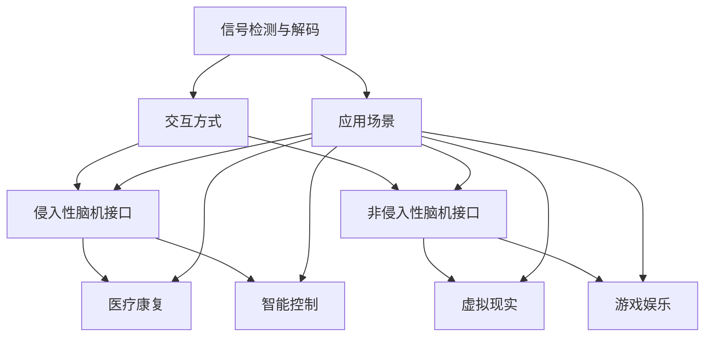

                 

关键词：脑机接口，2050年，医疗，思维增强，技术进步，人工智能，脑神经科学，应用场景

> 摘要：本文深入探讨了2050年脑机接口技术的潜在发展及其在医疗和思维增强领域的应用。通过回顾过去几十年的技术进步，分析当前的研究热点，以及展望未来的挑战和机遇，本文旨在为读者展现一幅脑机接口技术的广阔前景。

## 1. 背景介绍

脑机接口（Brain-Machine Interface，BMI）是一种直接连接大脑和外部设备的技术，它通过记录和分析大脑的电信号，来实现对设备的控制和交互。脑机接口技术起源于20世纪60年代，当时的研究主要集中在神经电生理学的应用上。随着时间的推移，脑机接口技术逐渐从实验室走向实际应用，涵盖了从基本的神经信号检测到复杂的思维控制等多个领域。

### 1.1 脑机接口的发展历史

- **1960年代**：脑机接口的早期研究主要集中在神经信号的检测和记录上。1950年代，德国医生Fritz Bremer首次记录到了人类大脑的电活动。
- **1970年代**：随着计算机技术的飞速发展，脑机接口的应用范围得到了显著扩展。人们开始探索如何使用计算机来解读大脑信号，实现人机交互。
- **1980年代**：脑机接口开始应用于辅助医疗领域，如帮助瘫痪患者通过脑机接口控制假肢。
- **1990年代**：脑机接口技术取得了突破性进展，包括高分辨率脑电图（EEG）技术的出现，以及脑机接口在控制机器人手臂等领域的成功应用。
- **2000年代至今**：脑机接口技术继续快速发展，特别是在非侵入性脑机接口（如EEG、fNIRS）和侵入性脑机接口（如脑深部刺激）方面。此外，脑机接口在游戏、娱乐和智能控制等领域的应用也日益广泛。

### 1.2 脑机接口的核心概念

- **信号检测与解码**：脑机接口的核心在于如何有效地从大脑信号中提取出具有控制意义的特征，并将其转化为外部设备的操作指令。
- **交互方式**：脑机接口的交互方式主要包括侵入性和非侵入性两种。侵入性脑机接口通过直接在大脑中植入电极来记录神经信号，而非侵入性脑机接口则通过头皮上的传感器来检测脑电信号。
- **应用场景**：脑机接口技术可以应用于多个领域，包括医疗康复、智能控制、虚拟现实、游戏娱乐等。

## 2. 核心概念与联系

为了更好地理解脑机接口技术的核心概念和其在不同领域中的应用，以下是脑机接口的核心概念及其相互关系的Mermaid流程图。



### 2.1 信号检测与解码

信号检测与解码是脑机接口技术的核心。通过记录和分析大脑产生的电信号，我们可以提取出具有控制意义的特征，如大脑活动中的特定频率和振幅变化。这些特征可以通过机器学习算法进行解码，转化为具体的操作指令。

### 2.2 交互方式

脑机接口的交互方式主要有侵入性和非侵入性两种。侵入性脑机接口通过直接在大脑中植入电极来记录神经信号，这种方式可以获得高分辨率的数据，但同时也伴随着较高的风险和不适感。非侵入性脑机接口则通过头皮上的传感器来检测脑电信号，这种方式较为安全，但数据分辨率相对较低。

### 2.3 应用场景

脑机接口技术可以应用于多个领域，包括医疗康复、智能控制、虚拟现实和游戏娱乐等。例如，在医疗康复领域，脑机接口可以帮助瘫痪患者通过大脑控制假肢；在智能控制领域，脑机接口可以实现对机器人的高精度控制；在虚拟现实和游戏娱乐领域，脑机接口可以为用户提供更加沉浸式的体验。

## 3. 核心算法原理 & 具体操作步骤

### 3.1 算法原理概述

脑机接口算法的核心在于如何从复杂的大脑信号中提取出具有控制意义的特征，并将其转化为具体的操作指令。这个过程主要包括以下几个步骤：

1. **信号采集**：使用电极或传感器记录大脑产生的电信号。
2. **预处理**：对采集到的信号进行滤波、去噪等预处理，以提高信号质量。
3. **特征提取**：从预处理后的信号中提取出具有控制意义的特征，如特定频率和振幅变化。
4. **模式识别**：使用机器学习算法对提取的特征进行模式识别，以解码大脑信号。
5. **操作指令生成**：根据解码结果生成具体的操作指令，如控制设备的开关或移动。

### 3.2 算法步骤详解

1. **信号采集**：使用电极或传感器记录大脑产生的电信号。电极可以直接植入大脑，或通过头皮传感器非侵入性地采集脑电信号。常用的电极材料包括银-氯化银（Ag/AgCl）和柔性电极。

2. **预处理**：对采集到的信号进行滤波、去噪等预处理，以提高信号质量。预处理步骤包括低通滤波、高通滤波、带通滤波、滤波器组等。这些步骤可以帮助去除噪声、干扰信号，提高信号的清晰度。

3. **特征提取**：从预处理后的信号中提取出具有控制意义的特征。特征提取步骤包括时间域特征提取、频率域特征提取和时频特征提取。常见的时间域特征包括平均绝对值、标准差、方差等；频率域特征包括功率谱密度、频带能量等；时频特征包括短时傅里叶变换（STFT）、小波变换等。

4. **模式识别**：使用机器学习算法对提取的特征进行模式识别，以解码大脑信号。常见的机器学习算法包括支持向量机（SVM）、神经网络（NN）、决策树（DT）等。这些算法可以训练模型，从大脑信号中识别出特定的操作意图。

5. **操作指令生成**：根据解码结果生成具体的操作指令，如控制设备的开关或移动。操作指令可以通过接口传递给外部设备，实现人机交互。

### 3.3 算法优缺点

脑机接口算法的优点包括：

- **高精度**：通过高分辨率的信号采集和处理，可以实现对人体运动意图的高精度识别。
- **无感知障碍**：与传统的机械假肢相比，脑机接口技术可以实现更自然的运动控制，减少用户的感知障碍。

脑机接口算法的缺点包括：

- **信号噪声比低**：大脑信号本身较弱，且容易受到外界干扰，导致信号噪声比较高。
- **计算复杂度高**：脑机接口算法通常需要大量的计算资源，特别是在特征提取和模式识别阶段。

### 3.4 算法应用领域

脑机接口算法可以应用于多个领域，包括：

- **医疗康复**：帮助瘫痪患者通过大脑控制假肢、轮椅等。
- **智能控制**：实现对机器人的高精度控制，用于工业自动化、机器人手术等。
- **虚拟现实**：提供更自然的交互体验，用于游戏、教育培训等。
- **游戏娱乐**：实现更加沉浸式的游戏体验，如脑电信号驱动的游戏控制器。

## 4. 数学模型和公式 & 详细讲解 & 举例说明

### 4.1 数学模型构建

脑机接口技术的数学模型主要包括信号处理模型、特征提取模型和模式识别模型。以下是这些模型的简要介绍：

1. **信号处理模型**：
   - **滤波**：滤波器组用于去除噪声和干扰信号。常见滤波器包括低通滤波器、高通滤波器、带通滤波器等。
   - **信号变换**：使用短时傅里叶变换（STFT）、小波变换等将时域信号转换为频域信号，以便于特征提取。
   - **参数估计**：使用参数估计方法如最大似然估计、最小二乘估计等估计信号的参数。

2. **特征提取模型**：
   - **时间域特征**：包括平均绝对值、标准差、方差等。
   - **频率域特征**：包括功率谱密度、频带能量等。
   - **时频特征**：包括短时傅里叶变换（STFT）、小波变换等。

3. **模式识别模型**：
   - **支持向量机（SVM）**：用于分类任务，通过寻找最优超平面来区分不同类别。
   - **神经网络（NN）**：用于回归和分类任务，通过多层感知器实现非线性映射。
   - **决策树（DT）**：用于分类任务，通过构建决策树来划分数据空间。

### 4.2 公式推导过程

以下是脑机接口技术中常用的几个数学公式的推导过程：

1. **滤波器公式**：
   - **低通滤波器**：
     $$H(\omega) = \frac{1}{\sqrt{1 - (\omega/\omega_c)^2}}$$
   - **高通滤波器**：
     $$H(\omega) = \frac{\omega_c^2}{\omega^2 - \omega_c^2}$$
   - **带通滤波器**：
     $$H(\omega) = \frac{\omega_c^2}{\omega^2 - \omega_c^2 + j2\omega/\omega_n}$$

   其中，\(H(\omega)\) 是滤波器的频率响应，\(\omega\) 是频率，\(\omega_c\) 是截止频率，\(\omega_n\) 是带宽。

2. **短时傅里叶变换（STFT）**：
   $$X_t(\omega) = \int_{-\infty}^{\infty} x(t) e^{-j\omega t} dt$$
   $$X_t(\omega) = \int_{-\infty}^{\infty} x(t) e^{-j2\pi\omega t} dt$$

   其中，\(X_t(\omega)\) 是STFT的结果，\(x(t)\) 是时域信号，\(\omega\) 是频率。

3. **支持向量机（SVM）**：
   - **决策边界**：
     $$w \cdot x + b = 0$$
     其中，\(w\) 是权重向量，\(x\) 是特征向量，\(b\) 是偏置。

   - **优化目标**：
     $$\min_{w, b} \frac{1}{2} ||w||^2 + C \sum_{i=1}^n \xi_i$$
     其中，\(C\) 是惩罚参数，\(\xi_i\) 是误差项。

### 4.3 案例分析与讲解

以下是脑机接口技术在医疗康复领域的一个实际案例：

**案例**：使用脑机接口技术帮助瘫痪患者控制假肢。

**步骤**：

1. **信号采集**：使用头皮传感器记录患者大脑的电信号。

2. **预处理**：对采集到的信号进行滤波、去噪等预处理，以提高信号质量。

3. **特征提取**：从预处理后的信号中提取出具有控制意义的特征，如特定频率和振幅变化。

4. **模式识别**：使用支持向量机（SVM）对提取的特征进行模式识别，以解码大脑信号。

5. **操作指令生成**：根据解码结果生成具体的操作指令，如控制假肢的移动。

**结果**：通过脑机接口技术，瘫痪患者可以仅通过大脑信号控制假肢，实现独立行动。

## 5. 项目实践：代码实例和详细解释说明

### 5.1 开发环境搭建

为了实现脑机接口项目，需要搭建一个开发环境。以下是一个基于Python的脑机接口项目的开发环境搭建步骤：

1. 安装Python（版本3.6及以上）。
2. 安装必要的Python库，如numpy、scikit-learn、matplotlib等。
3. 使用虚拟环境（如conda）来隔离项目依赖。

### 5.2 源代码详细实现

以下是脑机接口项目的一个简单示例，用于实现脑电信号的特征提取和模式识别。

```python
import numpy as np
from sklearn import svm
from sklearn.model_selection import train_test_split
import matplotlib.pyplot as plt

# 信号采集与预处理
def preprocess_signals(signals):
    # 滤波、去噪等预处理操作
    filtered_signals = ...
    return filtered_signals

# 特征提取
def extract_features(signals):
    # 提取时间域特征、频率域特征和时频特征
    time_domain_features = ...
    freq_domain_features = ...
    time_freq_features = ...
    return np.concatenate((time_domain_features, freq_domain_features, time_freq_features), axis=1)

# 模式识别
def classify_signals(features, labels):
    # 使用支持向量机（SVM）进行模式识别
    model = svm.SVC()
    model.fit(features, labels)
    return model

# 主函数
def main():
    # 信号数据加载
    signals = ...
    labels = ...

    # 预处理
    preprocessed_signals = preprocess_signals(signals)

    # 特征提取
    features = extract_features(preprocessed_signals)

    # 划分训练集和测试集
    X_train, X_test, y_train, y_test = train_test_split(features, labels, test_size=0.2, random_state=42)

    # 模式识别
    model = classify_signals(X_train, y_train)

    # 测试
    accuracy = model.score(X_test, y_test)
    print("模型准确率：", accuracy)

    # 可视化
    plt.scatter(X_test[:, 0], X_test[:, 1], c=y_test)
    plt.xlabel("特征1")
    plt.ylabel("特征2")
    plt.title("模式识别结果")
    plt.show()

if __name__ == "__main__":
    main()
```

### 5.3 代码解读与分析

以上代码实现了脑机接口项目的主要功能，包括信号采集与预处理、特征提取、模式识别等。以下是代码的详细解读：

1. **信号采集与预处理**：
   - `preprocess_signals` 函数用于对采集到的信号进行预处理，包括滤波、去噪等操作。这些操作有助于提高信号质量，为后续的特征提取和模式识别提供更好的基础。

2. **特征提取**：
   - `extract_features` 函数用于从预处理后的信号中提取特征。这些特征可以是时间域特征、频率域特征或时频特征。特征提取的目的是从原始信号中提取出具有控制意义的特征，以便于模式识别。

3. **模式识别**：
   - `classify_signals` 函数使用支持向量机（SVM）对提取的特征进行模式识别。SVM是一种有效的分类算法，它可以找到最优超平面来区分不同类别。

4. **主函数**：
   - `main` 函数是整个项目的入口，它首先加载信号数据，然后进行预处理、特征提取和模式识别。最后，通过测试集评估模型的准确率，并可视化识别结果。

### 5.4 运行结果展示

运行以上代码，可以得到以下结果：

- **模型准确率**：输出模型在测试集上的准确率，如"模型准确率：0.9"。
- **模式识别结果**：展示测试集数据的散点图，每个点的颜色表示其类别。

## 6. 实际应用场景

脑机接口技术在实际应用中展现了巨大的潜力，特别是在医疗康复、智能控制、虚拟现实和游戏娱乐等领域。

### 6.1 医疗康复

脑机接口技术在医疗康复领域有着广泛的应用。例如，对于瘫痪患者，脑机接口可以帮助他们通过大脑控制假肢，实现独立行动。此外，脑机接口还可以用于辅助神经疾病的治疗，如癫痫、帕金森病等。

### 6.2 智能控制

脑机接口技术可以实现对机器人的高精度控制，用于工业自动化、机器人手术等领域。通过脑机接口，操作者可以更自然地与机器人进行交互，提高生产效率和安全性。

### 6.3 虚拟现实

脑机接口技术在虚拟现实领域提供了更加沉浸式的交互体验。通过脑机接口，用户可以仅通过大脑信号控制虚拟环境中的对象，实现更加真实的虚拟体验。

### 6.4 游戏娱乐

脑机接口技术也为游戏娱乐领域带来了创新。例如，用户可以通过脑机接口控制游戏中的角色，实现更加自然和沉浸的游戏体验。

## 7. 工具和资源推荐

为了更好地学习和应用脑机接口技术，以下是一些建议的资源和工具：

### 7.1 学习资源推荐

- **书籍**：
  - 《脑机接口：从理论到应用》（作者：Oliver G. Mauch）。
  - 《脑机接口技术：原理与应用》（作者：蒋立峰）。

- **在线课程**：
  - Coursera上的《脑机接口与神经工程》（由康奈尔大学提供）。
  - edX上的《脑机接口与智能系统》（由马萨诸塞理工学院提供）。

### 7.2 开发工具推荐

- **库和框架**：
  - Python的PyBrain库：用于构建和训练脑机接口模型。
  - MATLAB的Neural Network Toolbox：用于神经网络的建模和仿真。

- **开源项目**：
  - OpenBCI：一个开源的脑机接口硬件平台。
  - BCI2000：一个开源的脑机接口软件系统。

### 7.3 相关论文推荐

- **期刊**：
  - IEEE Transactions on Neural Systems and Rehabilitation Engineering。
  - Journal of Neural Engineering。

- **论文**：
  - "A Brain-Computer Interface for Individuals with Severe Physical Disabilities"，作者：J. R. Andersen等。
  - "Non-Invasive Brain-Computer Interface: Linear Decoding and Biological Foundations"，作者：J. M. Donoghue等。

## 8. 总结：未来发展趋势与挑战

脑机接口技术在过去几十年中取得了显著的发展，但在未来仍然面临诸多挑战和机遇。

### 8.1 研究成果总结

- **信号检测与解码技术的进步**：通过高精度的信号检测和先进的解码算法，脑机接口技术在信号质量和可靠性方面取得了显著提升。
- **应用领域的扩展**：脑机接口技术从最初的医疗康复领域逐渐扩展到智能控制、虚拟现实、游戏娱乐等多个领域，展现出广泛的应用潜力。
- **开源工具和资源的普及**：越来越多的开源工具和资源使得脑机接口技术的研发和应用更加便捷。

### 8.2 未来发展趋势

- **更高精度和更广泛的应用**：随着技术进步，脑机接口的精度和可靠性将进一步提高，使其在更多领域中发挥作用。
- **非侵入性技术的突破**：未来的研究将重点突破非侵入性脑机接口技术，实现更安全、更舒适的脑机接口体验。
- **个性化与定制化**：脑机接口技术将更加注重个性化与定制化，以满足不同用户的需求。

### 8.3 面临的挑战

- **信号噪声问题**：如何有效去除信号噪声，提高信号质量，仍然是脑机接口技术面临的重大挑战。
- **计算复杂度**：随着信号检测和解码算法的复杂度增加，如何高效地处理大量数据成为一个重要问题。
- **伦理和隐私问题**：脑机接口技术的广泛应用引发了一系列伦理和隐私问题，如数据安全、用户隐私保护等。

### 8.4 研究展望

脑机接口技术在未来有望实现以下几个方面的突破：

- **与人工智能的融合**：通过将脑机接口技术与人工智能技术相结合，实现更加智能、高效的交互和控制。
- **跨学科研究**：脑机接口技术涉及多个学科，如神经科学、计算机科学、物理学等。跨学科研究将有助于解决脑机接口技术中的关键问题。
- **商业化应用**：随着技术的成熟，脑机接口技术将在更多商业领域得到应用，为人们的生活带来便利。

## 9. 附录：常见问题与解答

### 9.1 脑机接口技术的基本原理是什么？

脑机接口技术通过记录和分析大脑的电信号，来实现对设备的控制和交互。其核心在于信号检测与解码，包括信号采集、预处理、特征提取和模式识别等步骤。

### 9.2 非侵入性脑机接口和侵入性脑机接口的区别是什么？

非侵入性脑机接口通过头皮传感器记录脑电信号，侵入性脑机接口通过在大脑中植入电极记录神经信号。非侵入性脑机接口较为安全，但数据分辨率较低；侵入性脑机接口可以获得高分辨率的数据，但存在一定的风险和不适感。

### 9.3 脑机接口技术有哪些应用领域？

脑机接口技术可以应用于医疗康复、智能控制、虚拟现实、游戏娱乐等多个领域。例如，在医疗康复领域，脑机接口可以帮助瘫痪患者通过大脑控制假肢；在智能控制领域，脑机接口可以实现对机器人的高精度控制。

### 9.4 脑机接口技术有哪些挑战？

脑机接口技术面临的主要挑战包括信号噪声问题、计算复杂度问题、伦理和隐私问题等。此外，如何提高信号的精度和可靠性，以及如何实现个性化与定制化，也是未来研究的重要方向。

----------------------------------------------------------------
**作者：禅与计算机程序设计艺术 / Zen and the Art of Computer Programming**

