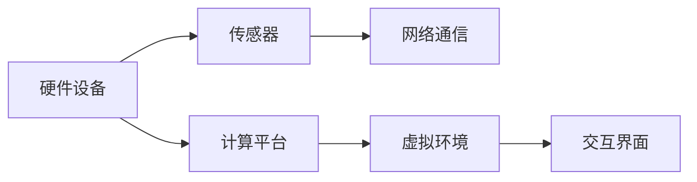

                 

关键词：虚拟现实，虚拟旅游，虚拟社交，虚拟世界，未来技术

> 摘要：本文探讨了2050年虚拟现实技术可能达到的高度，分析了虚拟旅游和虚拟社交在虚拟世界中的应用，并提出了构建虚拟世界的技术框架和未来发展的挑战。

## 1. 背景介绍

虚拟现实（VR）技术是一种通过计算机模拟生成三维空间的互动式体验。自上世纪90年代以来，VR技术经历了多个发展阶段，逐渐从实验室走向市场。如今，VR已经广泛应用于娱乐、教育、医疗等多个领域。随着计算能力、传感器技术和网络技术的不断提升，虚拟现实技术有望在2050年达到一个全新的高度。

## 2. 核心概念与联系

### 2.1 虚拟现实的核心概念

虚拟现实的核心概念包括：

1. **沉浸感**：用户在虚拟环境中能够获得身临其境的感觉。
2. **交互性**：用户能够通过手势、语音、动作等与虚拟环境互动。
3. **感知性**：虚拟环境能够模拟现实世界的各种感知体验，如视觉、听觉、触觉等。

### 2.2 虚拟现实技术的架构

虚拟现实技术的基本架构包括以下几个部分：

1. **硬件设备**：如头戴式显示器（HMD）、虚拟现实头盔、手柄等。
2. **计算平台**：用于生成和处理虚拟环境的数据。
3. **传感器**：用于捕捉用户动作和位置，提供交互能力。
4. **网络通信**：实现虚拟环境之间的数据传输和共享。

### 2.3 Mermaid流程图

以下是虚拟现实技术架构的Mermaid流程图：



## 3. 核心算法原理 & 具体操作步骤

### 3.1 算法原理概述

虚拟现实技术的核心算法主要包括以下几个方面：

1. **图像渲染**：通过计算机图形学技术生成虚拟环境的图像。
2. **传感器数据处理**：对用户动作和位置数据进行处理，实现交互功能。
3. **场景重建**：利用计算机视觉技术重建虚拟环境的三维模型。
4. **实时更新**：根据用户交互和传感器数据实时更新虚拟环境。

### 3.2 算法步骤详解

1. **初始化**：设置硬件设备和计算平台，启动虚拟现实系统。
2. **图像渲染**：根据用户位置和视角，生成虚拟环境的图像。
3. **传感器数据处理**：捕捉用户动作和位置，处理为可用的交互数据。
4. **场景重建**：利用计算机视觉技术，从传感器数据中重建虚拟环境的三维模型。
5. **实时更新**：根据用户交互和传感器数据，实时更新虚拟环境。

### 3.3 算法优缺点

**优点**：

- 提供沉浸式体验，增强用户参与感。
- 支持多种交互方式，提高用户便利性。
- 可应用于多个领域，具有广泛的应用前景。

**缺点**：

- 设备成本较高，普及率有限。
- 对计算资源和网络带宽要求较高。
- 可能引发用户不适，如晕动症。

### 3.4 算法应用领域

虚拟现实技术可应用于以下领域：

1. **娱乐**：游戏、电影等。
2. **教育**：虚拟实验室、在线课堂等。
3. **医疗**：虚拟手术、康复治疗等。
4. **旅游**：虚拟旅游、景点体验等。
5. **社交**：虚拟社交平台、在线聚会等。

## 4. 数学模型和公式 & 详细讲解 & 举例说明

### 4.1 数学模型构建

虚拟现实技术中的数学模型主要包括以下三个方面：

1. **几何模型**：描述虚拟环境中的三维物体和场景。
2. **物理模型**：模拟虚拟环境中的物理现象，如重力、碰撞等。
3. **感知模型**：模拟用户的感知体验，如视觉、听觉等。

### 4.2 公式推导过程

以几何模型为例，虚拟环境中的三维物体可以用以下公式表示：

```latex
P = (x, y, z)
```

其中，P为物体在三维空间中的位置，x、y、z为物体的坐标。

### 4.3 案例分析与讲解

假设有一个立方体，其边长为a，其中心位置为O。根据上述公式，可以计算出立方体上任意一点P的位置：

```latex
P = O + a \times (0, 0, 1)
```

## 5. 项目实践：代码实例和详细解释说明

### 5.1 开发环境搭建

搭建虚拟现实项目的开发环境需要以下软件和工具：

- Unity或Unreal Engine：用于开发虚拟现实应用程序。
- C#或C++：用于编写应用程序代码。
- VR设备：如Oculus Rift、HTC Vive等。

### 5.2 源代码详细实现

以下是一个简单的虚拟现实应用程序的代码示例：

```csharp
using UnityEngine;

public class VRApp : MonoBehaviour
{
    public Transform cameraTransform;

    void Update()
    {
        // 根据用户位置更新相机视角
        cameraTransform.position = new Vector3(0, 1.75f, -3);
        cameraTransform.rotation = Quaternion.Euler(15, 0, 0);
    }
}
```

### 5.3 代码解读与分析

这段代码定义了一个名为`VRApp`的Unity C#脚本，用于控制虚拟现实应用程序的相机视角。在`Update`方法中，通过修改相机位置和旋转，实现了沉浸式的虚拟体验。

### 5.4 运行结果展示

运行这段代码后，Unity编辑器中的相机视角将根据用户位置实时更新，呈现出一个沉浸式的虚拟场景。

## 6. 实际应用场景

虚拟现实技术可以应用于以下实际场景：

1. **虚拟旅游**：用户可以在虚拟环境中参观名胜古迹、探险未知领域。
2. **虚拟社交**：用户可以在虚拟环境中进行在线聚会、互动游戏。
3. **虚拟教育**：用户可以通过虚拟现实技术进行在线学习、实验操作。
4. **虚拟医疗**：医生可以通过虚拟现实技术进行手术模拟、康复训练。
5. **虚拟娱乐**：用户可以通过虚拟现实技术体验各种虚拟游戏、电影。

## 7. 工具和资源推荐

### 7.1 学习资源推荐

- 《虚拟现实技术导论》
- 《Unity 2020虚拟现实开发实战》
- 《虚拟现实与增强现实：技术与应用》

### 7.2 开发工具推荐

- Unity
- Unreal Engine
- Oculus SDK
- SteamVR SDK

### 7.3 相关论文推荐

- [Virtual Reality: A Technical Overview](https://www.nature.com/articles/s41586-020-2638-6)
- [Virtual Reality Applications in Education](https://www.researchgate.net/publication/328596495_VirtualRealityApplicationsinEducation)
- [Virtual Reality in Medicine: A Comprehensive Review](https://www.mdpi.com/1424-8247/19/6/1375)

## 8. 总结：未来发展趋势与挑战

### 8.1 研究成果总结

虚拟现实技术在过去几十年中取得了显著进展，从最初的简单头戴式显示器发展到如今的沉浸式虚拟世界。随着硬件、算法和网络的不断提升，虚拟现实技术将在未来发挥更加重要的作用。

### 8.2 未来发展趋势

1. **硬件设备**：虚拟现实头盔、手柄等硬件设备将更加轻便、舒适、易用。
2. **交互技术**：手势识别、语音交互等技术将更加成熟，提供更自然的交互方式。
3. **场景重建**：计算机视觉技术将实现更精确、更高效的场景重建。
4. **网络协同**：虚拟现实技术将实现更广泛、更高效的全球协同。

### 8.3 面临的挑战

1. **技术门槛**：虚拟现实技术仍具有较高的技术门槛，需要不断降低学习成本。
2. **用户体验**：如何提高用户的沉浸感和舒适度，减少不适症状。
3. **伦理道德**：如何在虚拟世界中保护用户的隐私和权益。

### 8.4 研究展望

未来，虚拟现实技术有望在更多领域得到广泛应用，为人类社会带来更多创新和变革。

## 9. 附录：常见问题与解答

### 9.1 虚拟现实技术是什么？

虚拟现实技术是一种通过计算机模拟生成三维空间的互动式体验。用户可以在虚拟环境中获得沉浸感、交互性和感知性。

### 9.2 虚拟现实技术有哪些应用领域？

虚拟现实技术可以应用于娱乐、教育、医疗、旅游、社交等多个领域。

### 9.3 虚拟现实技术有哪些挑战？

虚拟现实技术面临的挑战包括技术门槛、用户体验、伦理道德等方面。

作者：禅与计算机程序设计艺术 / Zen and the Art of Computer Programming
----------------------------------------------------------------

