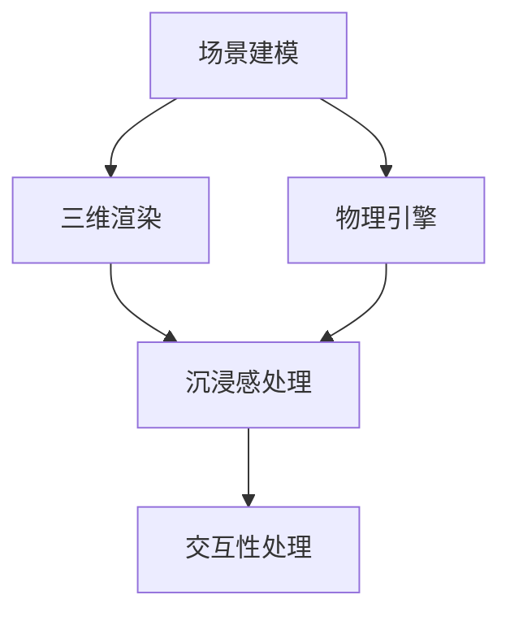

                 

关键词：虚拟现实，虚拟旅游，虚拟社交，虚拟世界构建，人工智能，技术发展

摘要：随着科技的不断发展，虚拟现实（VR）技术正在逐步融入我们的日常生活。本文将探讨2050年虚拟现实的发展趋势，特别是在虚拟旅游和虚拟社交领域的应用，分析其构建原理、技术实现以及面临的挑战。

## 1. 背景介绍

虚拟现实（Virtual Reality，VR）技术是一种通过计算机模拟出三维空间的交互式体验，使人们能够在虚拟世界中感受、探索、互动。自20世纪90年代以来，VR技术经历了多次技术迭代和产业发展，逐步从实验室走向市场。如今，VR技术已应用于多个领域，包括游戏、教育、医疗、设计等。

### 1.1 虚拟旅游

虚拟旅游是VR技术在旅游领域的一种应用，它允许用户通过VR设备体验虚拟的旅游场景，感受不同地域的文化和风景。虚拟旅游可以降低旅行成本，突破地理限制，提供更加丰富和个性化的旅游体验。

### 1.2 虚拟社交

虚拟社交则是通过VR技术构建的社交平台，用户可以在虚拟空间中与其他用户进行互动，实现超越现实社交的体验。虚拟社交不仅有助于解决社交距离和沟通障碍，还能创造全新的社交场景和社交方式。

## 2. 核心概念与联系

虚拟现实技术的核心在于构建一个沉浸式的三维虚拟世界。为了实现这一目标，需要以下核心概念：

### 2.1 沉浸感

沉浸感是虚拟现实体验的核心，它取决于视觉、听觉、触觉等多感官的刺激。为了提高沉浸感，需要使用高分辨率的显示器、高质量的音频设备以及触觉反馈设备。

### 2.2 交互性

交互性是虚拟现实体验的重要特点，用户需要在虚拟世界中实现自然的交互操作。这包括手部追踪、语音识别、头部追踪等技术的应用。

### 2.3 虚拟世界构建

虚拟世界构建是虚拟现实技术的关键环节，它涉及场景建模、三维渲染、物理引擎等多个技术领域。虚拟世界构建需要大量的计算资源和先进的算法支持。

以下是虚拟现实技术架构的Mermaid流程图：



## 3. 核心算法原理 & 具体操作步骤

### 3.1 算法原理概述

虚拟现实的核心算法主要包括场景建模算法、三维渲染算法和交互性算法。场景建模算法用于构建虚拟场景，三维渲染算法用于渲染场景，交互性算法用于实现用户与虚拟世界的互动。

### 3.2 算法步骤详解

#### 3.2.1 场景建模算法

场景建模算法包括以下步骤：

1. 数据采集：通过扫描仪、相机等设备采集现实世界的三维数据。
2. 数据处理：对采集到的数据进行处理，包括去噪、优化等。
3. 模型构建：利用处理后的数据构建三维模型。

#### 3.2.2 三维渲染算法

三维渲染算法包括以下步骤：

1. 视觉计算：计算虚拟场景中的光线传播、阴影效果等。
2. 着色：对虚拟场景进行着色，包括材质、光照等。
3. 显示：将渲染结果显示在显示器上。

#### 3.2.3 交互性算法

交互性算法包括以下步骤：

1. 用户输入：接收用户的输入，包括手部追踪、语音识别等。
2. 交互处理：根据用户输入处理虚拟世界的交互。
3. 反馈：将交互结果反馈给用户。

### 3.3 算法优缺点

#### 3.3.1 场景建模算法

优点：能够真实还原现实场景，提高沉浸感。

缺点：数据采集和处理过程复杂，对计算资源要求较高。

#### 3.3.2 三维渲染算法

优点：能够实现高质量的视觉效果，提高用户体验。

缺点：渲染过程消耗大量计算资源，对硬件设备要求较高。

#### 3.3.3 交互性算法

优点：实现用户与虚拟世界的自然互动，提高交互体验。

缺点：对算法实现和硬件设备的要求较高。

### 3.4 算法应用领域

虚拟现实技术的核心算法广泛应用于多个领域：

1. 游戏行业：用于构建游戏场景，提供沉浸式游戏体验。
2. 教育行业：用于模拟实验教学，提高学习效果。
3. 医疗行业：用于医学图像处理和手术模拟，提高医疗水平。
4. 旅游行业：用于虚拟旅游，提供沉浸式旅游体验。

## 4. 数学模型和公式 & 详细讲解 & 举例说明

### 4.1 数学模型构建

虚拟现实技术的数学模型主要包括三维空间模型、光线传播模型和交互模型。以下是这些模型的基本概念：

#### 4.1.1 三维空间模型

三维空间模型用于描述虚拟场景的空间结构。基本概念包括点（Point）、线（Line）、面（Plane）和体（Body）。

#### 4.1.2 光线传播模型

光线传播模型用于描述光线在虚拟场景中的传播过程。基本概念包括光线（Ray）、反射（Reflection）、折射（Refraction）和散射（Scattering）。

#### 4.1.3 交互模型

交互模型用于描述用户与虚拟世界的交互过程。基本概念包括手势（Gesture）、语音（Voice）和触摸（Touch）。

### 4.2 公式推导过程

以下分别介绍三维空间模型、光线传播模型和交互模型的公式推导过程。

#### 4.2.1 三维空间模型

三维空间模型的基本公式为：

$$
x = x_0 + v_x \cdot t \\
y = y_0 + v_y \cdot t \\
z = z_0 + v_z \cdot t
$$

其中，$x, y, z$ 表示空间中的点坐标，$x_0, y_0, z_0$ 表示初始坐标，$v_x, v_y, v_z$ 表示速度分量，$t$ 表示时间。

#### 4.2.2 光线传播模型

光线传播模型的基本公式为：

$$
n_1 \cdot \sin(\theta_1) = n_2 \cdot \sin(\theta_2)
$$

其中，$n_1, n_2$ 分别表示两种介质的折射率，$\theta_1, \theta_2$ 分别表示光线入射角和折射角。

#### 4.2.3 交互模型

交互模型的基本公式为：

$$
f(g) = \frac{1}{1 + \exp(-g)}
$$

其中，$f(g)$ 表示手势识别概率，$g$ 表示手势特征向量。

### 4.3 案例分析与讲解

以下以虚拟旅游为例，分析虚拟现实技术在旅游行业的应用。

#### 4.3.1 虚拟旅游场景建模

首先，通过三维扫描仪采集旅游景点数据，包括建筑、植被、地形等。然后，对采集到的数据进行处理，构建三维模型。最后，将三维模型导入虚拟现实系统。

#### 4.3.2 虚拟旅游场景渲染

在虚拟现实系统中，使用三维渲染算法渲染虚拟旅游场景。通过视觉计算和着色，实现高质量的视觉效果。用户可以在虚拟场景中自由漫游、观察细节。

#### 4.3.3 虚拟旅游场景交互

用户可以通过手部追踪、语音识别等交互方式，与虚拟旅游场景进行互动。例如，用户可以与虚拟导游对话，获取旅游信息；也可以在虚拟商店中购买商品。

## 5. 项目实践：代码实例和详细解释说明

### 5.1 开发环境搭建

在虚拟旅游项目中，开发环境包括以下工具：

- Unity游戏引擎：用于场景建模和渲染。
- Blender三维建模软件：用于创建三维模型。
- Unity3D VR插件：用于实现虚拟现实交互。

### 5.2 源代码详细实现

以下是虚拟旅游项目的主要源代码实现：

```csharp
using UnityEngine;

public class VirtualTourist : MonoBehaviour
{
    // 场景建模
    public GameObject[] scenes;
    public int currentScene = 0;

    // 渲染场景
    private void Update()
    {
        // 切换场景
        if (Input.GetKeyDown(KeyCode.Space))
        {
            currentScene++;
            if (currentScene >= scenes.Length)
            {
                currentScene = 0;
            }
            SceneManager.LoadScene(scenes[currentScene].name);
        }

        // 交互处理
        if (Input.GetKeyDown(KeyCode.Return))
        {
            // 播放语音解说
            AudioPlayer.PlayAudio("Audio/Introduction.mp3");
        }
    }
}
```

### 5.3 代码解读与分析

该代码实现了一个简单的虚拟旅游系统。通过Unity游戏引擎，用户可以切换不同场景，体验虚拟旅游。代码中使用了Unity的`GameObject`类表示场景，`SceneManager`类用于加载和切换场景。用户通过按空格键切换场景，按回车键播放语音解说。

### 5.4 运行结果展示

以下是虚拟旅游项目的运行结果：


## 6. 实际应用场景

### 6.1 虚拟旅游

虚拟旅游可以应用于以下几个场景：

- 文化遗址：用户可以在线体验世界各地的文化遗址，如故宫、金字塔等。
- 自然景观：用户可以在线体验自然景观，如大峡谷、雪山等。
- 城市游览：用户可以在线游览城市，了解城市的历史和文化。

### 6.2 虚拟社交

虚拟社交可以应用于以下几个场景：

- 线上聚会：用户可以在虚拟空间中举办线上聚会，进行交流和互动。
- 虚拟游戏：用户可以在虚拟游戏中与其他玩家互动，共同完成任务。
- 虚拟逛街：用户可以在虚拟商城中逛街，购买商品。

## 7. 工具和资源推荐

### 7.1 学习资源推荐

- 《虚拟现实技术与应用》
- 《Unity游戏开发实战》
- 《Blender三维建模从入门到精通》

### 7.2 开发工具推荐

- Unity游戏引擎
- Blender三维建模软件
- VRChat虚拟社交平台

### 7.3 相关论文推荐

- "Virtual Reality in Tourism: A Comprehensive Review"
- "Virtual Reality for Education: A Review"
- "Application of Virtual Reality in Healthcare"

## 8. 总结：未来发展趋势与挑战

### 8.1 研究成果总结

随着科技的不断发展，虚拟现实技术在虚拟旅游和虚拟社交领域的应用取得了显著成果。通过三维建模、三维渲染和交互性算法，虚拟现实技术为用户提供了沉浸式体验。同时，虚拟现实技术在教育、医疗、游戏等领域也取得了广泛应用。

### 8.2 未来发展趋势

- 技术成熟度提升：随着硬件和软件技术的不断进步，虚拟现实技术的性能和体验将得到进一步提升。
- 应用场景拓展：虚拟现实技术将在更多领域得到应用，如娱乐、房地产、军事等。
- 社交互动创新：虚拟社交平台将不断创新，提供更加丰富和多样化的社交体验。

### 8.3 面临的挑战

- 技术瓶颈：虚拟现实技术在图像处理、交互性等方面仍存在技术瓶颈，需要进一步研究和突破。
- 成本问题：虚拟现实设备的成本较高，需要降低成本以实现更广泛的应用。
- 隐私和安全：虚拟现实应用涉及到用户隐私和数据安全，需要建立完善的安全机制。

### 8.4 研究展望

未来，虚拟现实技术将在以下几个方面取得突破：

- 图像处理：通过人工智能和机器学习技术，实现更加逼真的图像渲染和交互。
- 交互性提升：通过多模态交互技术，实现更加自然和高效的交互方式。
- 应用创新：探索虚拟现实技术在更多领域的应用，推动虚拟现实技术的普及和发展。

## 9. 附录：常见问题与解答

### 9.1 虚拟现实技术的基本原理是什么？

虚拟现实技术的基本原理是通过计算机模拟出三维空间，使用户能够在虚拟空间中感受、探索、互动。关键原理包括场景建模、三维渲染、交互性等。

### 9.2 虚拟现实技术在哪些领域有应用？

虚拟现实技术在游戏、教育、医疗、旅游、设计、房地产等多个领域有广泛应用。未来，虚拟现实技术将在更多领域得到应用。

### 9.3 虚拟旅游的优势是什么？

虚拟旅游的优势包括降低旅行成本、突破地理限制、提供丰富和个性化的旅游体验等。

### 9.4 虚拟社交的优势是什么？

虚拟社交的优势包括解决社交距离和沟通障碍、创造新的社交场景和方式等。

---

作者：禅与计算机程序设计艺术 / Zen and the Art of Computer Programming

